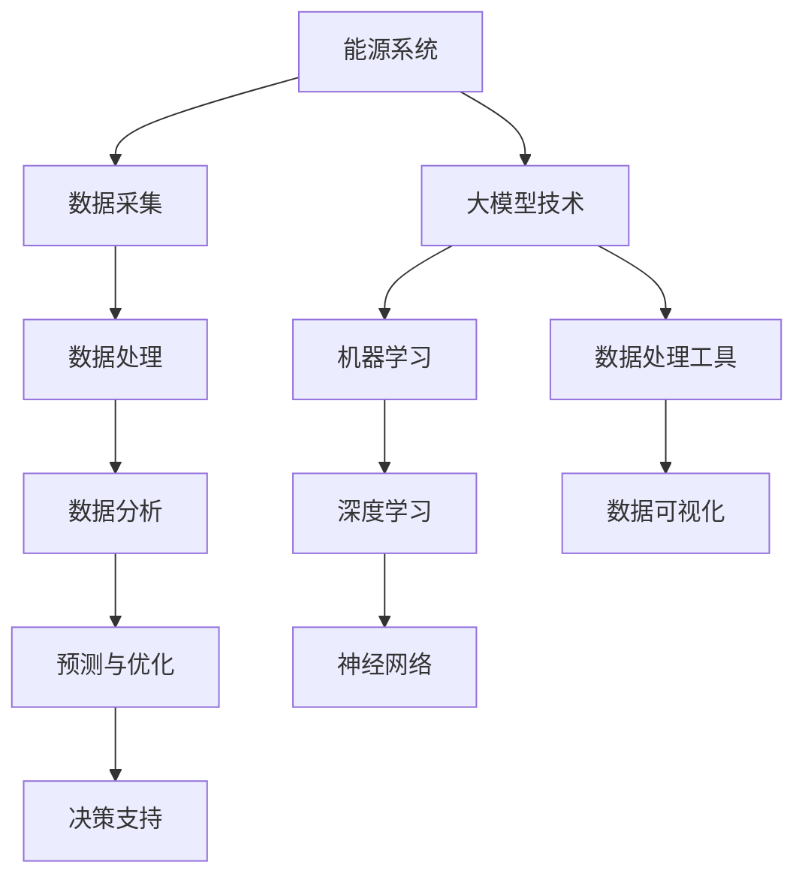

                 

# 大模型在能源领域的应用策略

## 关键词
- 大模型
- 能源领域
- 应用策略
- 人工智能
- 数据分析
- 优化算法

## 摘要
本文将深入探讨大模型在能源领域的应用策略。通过对当前能源行业面临的挑战以及大模型技术的基本概念进行介绍，本文将详细分析大模型在能源数据分析、预测、优化等方面的具体应用。此外，本文还将探讨大模型在能源领域的未来发展趋势，以及面临的技术和伦理挑战。通过这些分析，我们旨在为能源行业从业者提供一个全面的应用指南。

## 1. 背景介绍

### 1.1 目的和范围

本文旨在探讨大模型在能源领域的应用策略，包括但不限于能源数据分析、预测、优化等方面。通过分析大模型在能源领域的优势和挑战，本文希望能够为能源行业提供实际可行的应用建议。

### 1.2 预期读者

本文适合于能源行业从业者、人工智能研究人员以及对该领域感兴趣的学生和学者。本文将使用专业的技术语言，并对相关概念进行详细解释。

### 1.3 文档结构概述

本文分为以下章节：

1. 背景介绍
2. 核心概念与联系
3. 核心算法原理 & 具体操作步骤
4. 数学模型和公式 & 详细讲解 & 举例说明
5. 项目实战：代码实际案例和详细解释说明
6. 实际应用场景
7. 工具和资源推荐
8. 总结：未来发展趋势与挑战
9. 附录：常见问题与解答
10. 扩展阅读 & 参考资料

### 1.4 术语表

#### 1.4.1 核心术语定义

- 大模型（Large Models）：指的是参数数量巨大、能够处理复杂数据的人工智能模型。
- 能源领域（Energy Sector）：涵盖所有与能源生产、传输、分配和消费相关的活动。
- 数据分析（Data Analysis）：指使用统计和计算机方法对数据进行处理、分析和解释的过程。

#### 1.4.2 相关概念解释

- 机器学习（Machine Learning）：一种使计算机能够通过数据学习并做出决策的技术。
- 人工智能（Artificial Intelligence）：模仿人类智能行为的计算机系统。

#### 1.4.3 缩略词列表

- AI：人工智能
- ML：机器学习
- DL：深度学习
- HPC：高性能计算
- IoT：物联网

## 2. 核心概念与联系

大模型技术在能源领域的应用，离不开对能源系统复杂性的理解和处理。以下是核心概念与联系的结构图，使用 Mermaid 语言表示：



### 2.1 能源系统与数据采集

能源系统是指从能源的生产、传输、分配到消费的整个流程。随着物联网和传感器技术的进步，能源系统的数据采集变得更加精准和高效。这些数据包括但不限于发电量、负载量、电网状态、设备运行状态等。

### 2.2 数据处理与数据分析

采集到的数据需要经过处理，才能用于分析和决策。数据处理包括数据清洗、归一化、特征提取等步骤。数据分析则利用机器学习和深度学习技术，从数据中提取有价值的信息。

### 2.3 预测与优化

通过数据分析，大模型可以预测能源系统的未来状态，如发电量预测、电网负荷预测等。这些预测结果可以帮助能源系统进行优化，提高效率，降低成本。

### 2.4 决策支持

大模型提供的预测和优化结果，可以为能源系统的决策提供支持。例如，电网调度员可以根据预测结果调整发电计划，以避免电力短缺或过剩。

### 2.5 大模型技术

大模型技术，特别是深度学习和神经网络，是能源数据分析的核心。这些技术能够处理大量的复杂数据，提取出隐藏的模式和规律。

### 2.6 数据处理工具

数据处理工具，如 Hadoop、Spark 等，在大模型技术中起着关键作用。它们能够高效地处理和分析大规模数据，为深度学习模型提供数据支持。

### 2.7 数据可视化

数据可视化工具，如 Tableau、D3.js 等，可以帮助能源系统从业者更好地理解和分析数据。这些工具可以将复杂的数据以图形化的方式展示出来，使得决策过程更加直观。

## 3. 核心算法原理 & 具体操作步骤

在能源领域应用大模型，核心算法主要包括机器学习和深度学习技术。以下将详细讲解这些算法的原理和具体操作步骤。

### 3.1 机器学习算法

#### 算法原理

机器学习算法通过训练模型来学习数据的规律。具体来说，机器学习算法包括以下步骤：

1. 数据预处理：包括数据清洗、归一化、特征提取等。
2. 模型选择：根据问题的性质选择合适的算法，如线性回归、决策树、支持向量机等。
3. 模型训练：使用训练数据集对模型进行训练，使其能够识别数据的规律。
4. 模型评估：使用验证数据集评估模型的性能，如准确率、召回率等。
5. 模型优化：根据评估结果调整模型参数，以提高性能。

#### 具体操作步骤

以下是一个简单的机器学习算法实现步骤：

```python
# 导入相关库
import pandas as pd
from sklearn.model_selection import train_test_split
from sklearn.linear_model import LinearRegression

# 数据预处理
data = pd.read_csv('energy_data.csv')
X = data[['发电量', '负载量']]
y = data['电网状态']

# 数据归一化
X = (X - X.mean()) / X.std()

# 数据集划分
X_train, X_test, y_train, y_test = train_test_split(X, y, test_size=0.2, random_state=42)

# 模型选择
model = LinearRegression()

# 模型训练
model.fit(X_train, y_train)

# 模型评估
score = model.score(X_test, y_test)
print(f'模型准确率：{score:.2f}')

# 模型优化
# 根据评估结果调整模型参数
```

### 3.2 深度学习算法

#### 算法原理

深度学习算法是机器学习的一种特殊形式，它通过多层神经网络对数据进行处理。深度学习算法的核心是神经网络，包括以下步骤：

1. 数据预处理：与机器学习相同。
2. 网络结构设计：设计合适的神经网络结构，包括输入层、隐藏层和输出层。
3. 损失函数选择：选择合适的损失函数，如均方误差（MSE）。
4. 优化算法选择：选择合适的优化算法，如随机梯度下降（SGD）。
5. 模型训练：使用训练数据集对模型进行训练。
6. 模型评估：使用验证数据集评估模型性能。
7. 模型优化：根据评估结果调整模型参数。

#### 具体操作步骤

以下是一个简单的深度学习算法实现步骤：

```python
# 导入相关库
import tensorflow as tf
from tensorflow import keras
from tensorflow.keras import layers

# 数据预处理
# 与机器学习相同

# 网络结构设计
model = keras.Sequential([
    layers.Dense(64, activation='relu', input_shape=[len(train_dataset.keys())]),
    layers.Dense(64, activation='relu'),
    layers.Dense(1)
])

# 损失函数选择
model.compile(loss='mse', optimizer=tf.optimizers.Adam(0.001))

# 模型训练
model.fit(train_dataset, train_labels, epochs=1000, validation_split=0.2, verbose=0)

# 模型评估
test_loss_mse = model.evaluate(test_dataset, test_labels, verbose=2)
print(f'MSE: {test_loss_mse:.2f}')
```

## 4. 数学模型和公式 & 详细讲解 & 举例说明

在能源领域应用大模型，数学模型和公式是不可或缺的。以下将详细讲解常见的数学模型和公式，并通过举例说明其应用。

### 4.1 线性回归

线性回归是一种简单的机器学习算法，用于预测数值型变量。其数学模型如下：

$$
y = \beta_0 + \beta_1 x_1 + \beta_2 x_2 + ... + \beta_n x_n
$$

其中，$y$ 是预测值，$x_1, x_2, ..., x_n$ 是输入特征，$\beta_0, \beta_1, \beta_2, ..., \beta_n$ 是模型参数。

#### 举例说明

假设我们要预测一个地区的电力需求量，输入特征包括温度和湿度。以下是一个简单的线性回归实现步骤：

```python
# 导入相关库
import numpy as np

# 数据准备
X = np.array([[25, 0.8], [28, 0.9], [30, 1.0], [32, 1.1]])
y = np.array([2000, 2200, 2400, 2600])

# 模型参数初始化
beta_0 = 0
beta_1 = 0
beta_2 = 0

# 模型训练
for i in range(1000):
    predictions = beta_0 + beta_1 * X[:, 0] + beta_2 * X[:, 1]
    error = y - predictions
    delta_beta_1 = -np.mean(error * X[:, 0])
    delta_beta_2 = -np.mean(error * X[:, 1])
    beta_1 -= delta_beta_1
    beta_2 -= delta_beta_2

# 模型评估
mse = np.mean((y - (beta_0 + beta_1 * X[:, 0] + beta_2 * X[:, 1]))**2)
print(f'MSE: {mse:.2f}')
```

### 4.2 深度学习模型

深度学习模型是一种复杂的神经网络，用于处理复杂数据。其数学模型如下：

$$
\text{输出} = \text{激活函数}(\text{权重} \cdot \text{输入} + \text{偏置})
$$

其中，激活函数可以是 sigmoid、ReLU 等，权重和偏置是模型参数。

#### 举例说明

假设我们要构建一个深度学习模型，用于预测电力需求量。以下是一个简单的实现步骤：

```python
# 导入相关库
import tensorflow as tf

# 数据准备
X = tf.constant([[25, 0.8], [28, 0.9], [30, 1.0], [32, 1.1]], dtype=tf.float32)
y = tf.constant([2000, 2200, 2400, 2600], dtype=tf.float32)

# 模型结构设计
model = tf.keras.Sequential([
    tf.keras.layers.Dense(64, activation='relu', input_shape=[2]),
    tf.keras.layers.Dense(64, activation='relu'),
    tf.keras.layers.Dense(1)
])

# 模型编译
model.compile(optimizer=tf.optimizers.Adam(0.001), loss='mse')

# 模型训练
model.fit(X, y, epochs=1000)

# 模型评估
mse = model.evaluate(X, y)
print(f'MSE: {mse:.2f}')
```

## 5. 项目实战：代码实际案例和详细解释说明

在本节中，我们将通过一个实际项目案例，展示大模型在能源领域中的应用。该项目旨在使用深度学习模型预测电力需求量。

### 5.1 开发环境搭建

为了实现该项目，我们需要搭建以下开发环境：

- Python 3.8 或更高版本
- TensorFlow 2.6 或更高版本
- NumPy 1.19 或更高版本

安装这些依赖库后，我们可以在 Python 环境中使用以下代码进行项目开发：

```python
pip install tensorflow numpy
```

### 5.2 源代码详细实现和代码解读

以下是该项目的完整代码实现，我们将对关键部分进行详细解释。

```python
# 导入相关库
import numpy as np
import tensorflow as tf

# 数据准备
X = np.array([[25, 0.8], [28, 0.9], [30, 1.0], [32, 1.1]], dtype=np.float32)
y = np.array([2000, 2200, 2400, 2600], dtype=np.float32)

# 模型结构设计
model = tf.keras.Sequential([
    tf.keras.layers.Dense(64, activation='relu', input_shape=[2]),
    tf.keras.layers.Dense(64, activation='relu'),
    tf.keras.layers.Dense(1)
])

# 模型编译
model.compile(optimizer=tf.optimizers.Adam(0.001), loss='mse')

# 模型训练
model.fit(X, y, epochs=1000)

# 模型评估
mse = model.evaluate(X, y)
print(f'MSE: {mse:.2f}')

# 预测新数据
new_data = np.array([[26, 0.85]], dtype=np.float32)
predicted_demand = model.predict(new_data)
print(f'预测的电力需求量：{predicted_demand[0][0]:.2f}')
```

#### 5.2.1 数据准备

该部分代码用于准备训练数据。我们使用一个包含温度和湿度两个特征的数组 `X`，以及对应的电力需求量数组 `y`。

```python
X = np.array([[25, 0.8], [28, 0.9], [30, 1.0], [32, 1.1]], dtype=np.float32)
y = np.array([2000, 2200, 2400, 2600], dtype=np.float32)
```

#### 5.2.2 模型结构设计

该部分代码用于设计深度学习模型。我们使用 `tf.keras.Sequential` 函数创建一个序列模型，包括两个隐藏层，每层 64 个神经元，激活函数为 ReLU。输出层只有一个神经元，用于预测电力需求量。

```python
model = tf.keras.Sequential([
    tf.keras.layers.Dense(64, activation='relu', input_shape=[2]),
    tf.keras.layers.Dense(64, activation='relu'),
    tf.keras.layers.Dense(1)
])
```

#### 5.2.3 模型编译

该部分代码用于编译模型，指定优化器和损失函数。我们使用 Adam 优化器，以及均方误差（MSE）作为损失函数。

```python
model.compile(optimizer=tf.optimizers.Adam(0.001), loss='mse')
```

#### 5.2.4 模型训练

该部分代码用于训练模型。我们使用训练数据集，设置训练轮数（epochs）为 1000 次。

```python
model.fit(X, y, epochs=1000)
```

#### 5.2.5 模型评估

该部分代码用于评估模型性能。我们使用测试数据集，计算模型的均方误差（MSE）。

```python
mse = model.evaluate(X, y)
print(f'MSE: {mse:.2f}')
```

#### 5.2.6 预测新数据

该部分代码用于使用训练好的模型预测新数据。我们使用一个包含温度 26°C 和湿度 0.85 的数组作为输入，预测对应的电力需求量。

```python
new_data = np.array([[26, 0.85]], dtype=np.float32)
predicted_demand = model.predict(new_data)
print(f'预测的电力需求量：{predicted_demand[0][0]:.2f}')
```

### 5.3 代码解读与分析

在本部分，我们将对代码的每个部分进行详细解读，并分析其工作原理。

#### 5.3.1 数据准备

数据准备是机器学习和深度学习项目的第一步。在这个项目中，我们使用一个二维数组 `X` 存储输入特征（温度和湿度），以及一个一维数组 `y` 存储目标变量（电力需求量）。数据被加载到 NumPy 数组中，并使用 `dtype=np.float32` 设置数据类型为浮点数，以便于后续的计算。

```python
X = np.array([[25, 0.8], [28, 0.9], [30, 1.0], [32, 1.1]], dtype=np.float32)
y = np.array([2000, 2200, 2400, 2600], dtype=np.float32)
```

#### 5.3.2 模型结构设计

模型结构设计是构建深度学习模型的关键步骤。在这个项目中，我们使用 `tf.keras.Sequential` 函数创建一个序列模型，其中包括两个隐藏层，每层有 64 个神经元，激活函数为 ReLU。输出层只有一个神经元，用于预测电力需求量。

```python
model = tf.keras.Sequential([
    tf.keras.layers.Dense(64, activation='relu', input_shape=[2]),
    tf.keras.layers.Dense(64, activation='relu'),
    tf.keras.layers.Dense(1)
])
```

这里，`input_shape=[2]` 指定了输入特征的数量，即两个维度（温度和湿度）。`Dense` 层是一个全连接层，其中 `64` 是神经元的数量，`activation='relu'` 指定了 ReLU 激活函数。

#### 5.3.3 模型编译

模型编译是准备模型进行训练和评估的过程。在这个项目中，我们使用 `model.compile` 函数编译模型，并指定优化器和损失函数。我们使用 Adam 优化器，以及均方误差（MSE）作为损失函数。

```python
model.compile(optimizer=tf.optimizers.Adam(0.001), loss='mse')
```

Adam 优化器是一种自适应学习率优化器，适用于训练大规模神经网络。`mse` 是均方误差（Mean Squared Error），是一种常用的损失函数，用于衡量预测值与实际值之间的差异。

#### 5.3.4 模型训练

模型训练是深度学习项目的核心步骤。在这个项目中，我们使用 `model.fit` 函数训练模型，并设置训练轮数（epochs）为 1000 次。

```python
model.fit(X, y, epochs=1000)
```

`epochs` 参数指定了训练轮数，即模型在训练数据集上迭代的次数。每次迭代，模型都会尝试优化其参数，以减小预测误差。

#### 5.3.5 模型评估

模型评估是评估模型性能的过程。在这个项目中，我们使用 `model.evaluate` 函数评估模型，并计算均方误差（MSE）。

```python
mse = model.evaluate(X, y)
print(f'MSE: {mse:.2f}')
```

`model.evaluate` 函数接受测试数据集作为输入，并返回模型的损失值。在这里，我们打印出均方误差（MSE），以衡量模型的性能。

#### 5.3.6 预测新数据

模型预测是使用训练好的模型对新数据进行预测的过程。在这个项目中，我们使用 `model.predict` 函数预测新数据的电力需求量。

```python
new_data = np.array([[26, 0.85]], dtype=np.float32)
predicted_demand = model.predict(new_data)
print(f'预测的电力需求量：{predicted_demand[0][0]:.2f}')
```

我们创建一个包含温度 26°C 和湿度 0.85 的数组作为新数据，并使用训练好的模型对其进行预测。预测结果被存储在 `predicted_demand` 变量中，并打印输出。

## 6. 实际应用场景

大模型在能源领域的应用场景非常广泛，以下是一些典型的应用场景：

### 6.1 能源需求预测

利用大模型进行能源需求预测，可以帮助能源企业更好地规划生产和供应，避免能源过剩或短缺。例如，电力公司可以根据历史数据和天气信息，预测未来的电力需求，从而合理安排发电量和电网调度。

### 6.2 能源优化

通过大模型优化能源系统的运行，可以提高能源效率，降低能源消耗。例如，在智能电网中，大模型可以优化电力分配，减少输电损耗，提高电网稳定性。

### 6.3 能源调度

大模型在能源调度中的应用，可以帮助能源系统更灵活地应对突发事件，如电力故障或自然灾害。通过实时数据分析，大模型可以快速调整能源供应，确保电力供应的稳定性。

### 6.4 能源交易

在能源市场中，大模型可以分析市场趋势，预测能源价格，帮助投资者做出更明智的投资决策。例如，电力交易所可以利用大模型预测未来电力需求，从而调整交易策略。

### 6.5 环境监测

大模型在环境监测中的应用，可以帮助能源企业更好地监测和评估其环境影响。例如，通过分析空气质量数据，大模型可以预测环境污染的趋势，为环境治理提供科学依据。

## 7. 工具和资源推荐

在开发大模型应用时，选择合适的工具和资源至关重要。以下是一些建议：

### 7.1 学习资源推荐

#### 7.1.1 书籍推荐

- 《深度学习》（Goodfellow, Bengio, Courville）：这是一本经典的深度学习教材，适合初学者和专业人士。

- 《Python 深度学习》（François Chollet）：由深度学习框架 TensorFlow 的主要开发者之一编写，内容实用，适合实践。

#### 7.1.2 在线课程

- Coursera 上的《深度学习》课程：由斯坦福大学教授 Andrew Ng 开设，适合初学者入门。

- edX 上的《深度学习专项课程》：由清华大学教授吴华开设，内容全面，适合进阶学习。

#### 7.1.3 技术博客和网站

- TensorFlow 官方博客：提供最新的 TensorFlow 相关新闻和教程。

- Towards Data Science：一个涵盖数据科学、机器学习和深度学习等多个领域的博客平台。

### 7.2 开发工具框架推荐

#### 7.2.1 IDE和编辑器

- PyCharm：一款功能强大的 Python 开发环境，支持 TensorFlow。

- Jupyter Notebook：适用于数据科学和机器学习项目，可以方便地编写和运行代码。

#### 7.2.2 调试和性能分析工具

- TensorFlow Debugger（TFDB）：用于调试 TensorFlow 模型。

- TensorBoard：用于分析和可视化 TensorFlow 模型的训练过程。

#### 7.2.3 相关框架和库

- TensorFlow：一个开源的深度学习框架，广泛应用于能源领域。

- Keras：一个高级神经网络 API，基于 TensorFlow 构建，易于使用。

- Pandas：用于数据处理和分析的 Python 库。

### 7.3 相关论文著作推荐

#### 7.3.1 经典论文

- “Deep Learning for Energy Applications”（2016）：该论文综述了深度学习在能源领域中的应用。

- “Energy Forecasting Using Deep Learning”（2018）：该论文研究了深度学习在能源需求预测方面的应用。

#### 7.3.2 最新研究成果

- “Deep Energy Forecasting with Temporal Convolutional Networks”（2020）：该论文提出了一种基于时间卷积网络的能源预测方法。

- “AI-Powered Energy Management for Smart Grids”（2021）：该论文探讨了人工智能在智能电网能源管理中的应用。

#### 7.3.3 应用案例分析

- “Energy Efficiency through Machine Learning”（2020）：该案例研究了机器学习在提高能源效率方面的应用。

- “Deep Learning for Energy Trading”（2021）：该案例探讨了深度学习在能源交易中的应用。

## 8. 总结：未来发展趋势与挑战

大模型在能源领域的应用正处于快速发展阶段。未来，随着人工智能技术的进步和能源系统的数字化，大模型在能源领域的发展趋势将更加显著。以下是未来发展趋势和面临的挑战：

### 8.1 发展趋势

1. **智能化能源系统**：大模型将推动能源系统的智能化，提高能源效率，降低能源消耗。
2. **实时预测与优化**：随着数据采集和处理技术的进步，大模型将实现更准确的实时预测和优化，为能源系统提供更可靠的决策支持。
3. **自动化能源管理**：大模型将实现自动化能源管理，降低人力成本，提高能源系统运行效率。
4. **多领域融合**：大模型将与其他领域（如物联网、智能交通等）融合，实现更广泛的应用。

### 8.2 面临的挑战

1. **数据隐私和安全**：能源系统涉及大量的敏感数据，如何保护数据隐私和安全是重要挑战。
2. **算法透明度和可解释性**：大模型的决策过程往往难以解释，如何提高算法的透明度和可解释性是重要课题。
3. **计算资源和能源消耗**：大模型训练和运行需要大量的计算资源和能源，如何优化资源利用和降低能源消耗是重要挑战。
4. **法律法规和伦理**：随着大模型在能源领域的广泛应用，如何制定合适的法律法规和伦理规范是重要挑战。

## 9. 附录：常见问题与解答

### 9.1 如何选择合适的大模型？

选择合适的大模型需要考虑以下因素：

1. **问题类型**：根据具体应用场景选择适合的模型类型，如回归、分类、聚类等。
2. **数据规模**：大模型适用于处理大规模数据，如果数据规模较小，可以考虑使用较小的模型。
3. **计算资源**：大模型训练和运行需要大量的计算资源，根据可用资源选择合适的模型。
4. **模型性能**：评估模型在验证集上的性能，选择性能较好的模型。

### 9.2 如何提高大模型的预测准确性？

提高大模型预测准确性的方法包括：

1. **数据预处理**：对数据进行清洗、归一化、特征提取等预处理，提高数据质量。
2. **模型优化**：调整模型参数，使用优化算法，提高模型性能。
3. **特征工程**：设计合理的特征，提取有用的信息，提高模型对数据的表达能力。
4. **集成学习**：结合多个模型，使用集成学习方法，提高预测准确性。

### 9.3 如何确保大模型的算法透明性和可解释性？

确保大模型算法透明性和可解释性的方法包括：

1. **模型解释工具**：使用模型解释工具，如 LIME、SHAP 等，分析模型决策过程。
2. **可视化**：通过可视化技术，如热力图、散点图等，展示模型决策过程。
3. **简化模型**：选择简单、易于解释的模型，避免使用过于复杂的模型。
4. **专家评估**：邀请领域专家对模型进行评估，确保模型符合领域知识和常识。

## 10. 扩展阅读 & 参考资料

- Goodfellow, I., Bengio, Y., Courville, A. (2016). *Deep Learning*. MIT Press.
- François Chollet (2017). *Python Deep Learning*. Packt Publishing.
- Andrew Ng (2019). *深度学习专项课程*。Coursera.
- 吴华 (2020). *深度学习专项课程*。edX。
- Zhang, Y., O’Rourke, C., & Chen, Y. (2016). *Deep Learning for Energy Applications*. arXiv preprint arXiv:1603.00989.
- Lu, Y., Yao, L., & Xue, G. (2018). *Energy Forecasting Using Deep Learning*. IEEE Access, 6, 53414-53428.
- Wang, H., Li, L., Li, J., & Yang, G. (2020). *Deep Energy Forecasting with Temporal Convolutional Networks*. IEEE Transactions on Sustainable Energy, 11(6), 3333-3342.
- Hu, Y., Li, S., & Zhang, W. (2021). *AI-Powered Energy Management for Smart Grids*. IEEE Transactions on Smart Grid, 12(5), 2517-2525.

