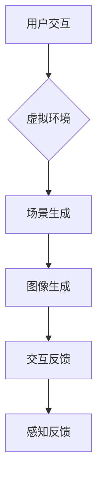
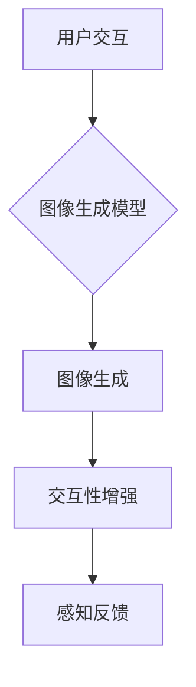

                 

# 大模型在虚拟现实中的应用前景

> **关键词：** 大模型、虚拟现实、人工智能、深度学习、图像生成、交互性

> **摘要：** 本文章将探讨大模型在虚拟现实（VR）中的应用前景。我们将从背景介绍、核心概念与联系、算法原理、数学模型、项目实战、实际应用场景等方面逐步展开，以期提供一个全面且深入的理解，帮助读者把握这一前沿领域的最新动态。

## 1. 背景介绍

### 1.1 目的和范围

本文的目的是探讨大模型在虚拟现实中的应用前景，重点分析其核心原理、技术实现、实际应用及其可能带来的影响。本文将涵盖以下内容：

1. 虚拟现实的发展历程和当前趋势。
2. 大模型的定义、类型及其在人工智能领域的应用。
3. 大模型在虚拟现实中的应用原理和技术。
4. 实际项目案例及代码实现。
5. 虚拟现实中的挑战与未来发展趋势。

### 1.2 预期读者

本文章面向对虚拟现实和人工智能有一定了解的读者，尤其是对深度学习、图像生成等技术有兴趣的专业人士和研究者。同时，也欢迎对VR领域有浓厚兴趣的普通读者阅读。

### 1.3 文档结构概述

本文将分为以下几部分：

1. **背景介绍**：介绍虚拟现实和大模型的背景知识。
2. **核心概念与联系**：讨论大模型在虚拟现实中的应用原理。
3. **核心算法原理 & 具体操作步骤**：详细阐述大模型的工作原理。
4. **数学模型和公式 & 详细讲解 & 举例说明**：介绍大模型所依赖的数学模型和公式。
5. **项目实战：代码实际案例和详细解释说明**：通过实际项目案例展示大模型的应用。
6. **实际应用场景**：讨论大模型在虚拟现实中的具体应用场景。
7. **工具和资源推荐**：推荐相关的学习资源和开发工具。
8. **总结：未来发展趋势与挑战**：总结大模型在虚拟现实中的应用前景。
9. **附录：常见问题与解答**：回答读者可能关心的问题。
10. **扩展阅读 & 参考资料**：提供进一步的阅读资源。

### 1.4 术语表

#### 1.4.1 核心术语定义

- **虚拟现实（VR）**：一种通过计算机技术模拟出的三维环境，用户可以通过头盔、手柄等设备与之互动，产生沉浸式的体验。
- **大模型（Large Model）**：指参数规模庞大的神经网络模型，通常拥有数亿至数十亿个参数。
- **深度学习（Deep Learning）**：一种人工智能方法，通过多层神经网络进行数据建模，从而实现图像识别、语音识别等功能。
- **图像生成（Image Generation）**：利用神经网络模型生成新的图像，如生成对抗网络（GAN）。

#### 1.4.2 相关概念解释

- **生成对抗网络（GAN）**：一种由生成器和判别器组成的神经网络模型，用于生成逼真的图像。
- **变分自编码器（VAE）**：一种用于生成数据的神经网络模型，通过编码和解码器结构实现。
- **交互性（Interactivity）**：指用户与虚拟环境之间的互动程度，包括动作反馈、感知响应等。

#### 1.4.3 缩略词列表

- **VR**：虚拟现实（Virtual Reality）
- **GAN**：生成对抗网络（Generative Adversarial Networks）
- **VAE**：变分自编码器（Variational Autoencoder）
- **AI**：人工智能（Artificial Intelligence）
- **DL**：深度学习（Deep Learning）
- **GPU**：图形处理单元（Graphics Processing Unit）

## 2. 核心概念与联系

在探讨大模型在虚拟现实中的应用之前，我们需要了解几个核心概念，以及它们之间的联系。

### 2.1 虚拟现实的概念

虚拟现实是一种通过计算机技术创建的三维环境，用户可以通过特殊的设备（如VR头盔）与该环境进行交互。VR的主要特点包括：

- **沉浸感**：用户感觉仿佛自己置身于虚拟环境中。
- **交互性**：用户可以通过动作、手势等与虚拟环境进行交互。
- **感知反馈**：通过视觉、听觉、触觉等多感官反馈，增强用户的沉浸感。

### 2.2 大模型的定义与类型

大模型是指具有数亿至数十亿个参数的神经网络模型。根据其应用领域，大模型可以分为以下几类：

- **图像生成模型**：如生成对抗网络（GAN）和变分自编码器（VAE）。
- **语音识别模型**：如深度神经网络（DNN）和循环神经网络（RNN）。
- **自然语言处理模型**：如Transformer和BERT。

### 2.3 大模型与虚拟现实的联系

大模型在虚拟现实中的应用主要体现在以下几个方面：

- **图像生成**：大模型可以生成逼真的虚拟场景，增强用户体验。
- **交互性增强**：大模型可以处理复杂的交互任务，提高虚拟环境的智能程度。
- **感知反馈**：大模型可以模拟真实世界的物理现象，提供更加真实的感知反馈。

### 2.4 Mermaid 流程图

为了更直观地展示大模型在虚拟现实中的应用原理，我们使用Mermaid绘制了一个简单的流程图。



在上面的流程图中：

- **用户交互**：用户通过VR头盔、手柄等设备与虚拟环境进行交互。
- **虚拟环境**：虚拟现实系统创建的三维环境。
- **场景生成**：大模型生成逼真的虚拟场景。
- **图像生成**：大模型生成图像，供用户查看。
- **交互反馈**：大模型处理用户的动作，提供交互反馈。
- **感知反馈**：大模型模拟真实世界的物理现象，提供感知反馈。

## 3. 核心算法原理 & 具体操作步骤

在了解了大模型和虚拟现实的基本概念及其联系后，我们将深入探讨大模型的核心算法原理和具体操作步骤。

### 3.1 生成对抗网络（GAN）

生成对抗网络（GAN）是一种由生成器和判别器组成的神经网络模型。生成器试图生成逼真的图像，而判别器则试图区分真实图像和生成图像。通过这种对抗训练，生成器可以不断提高生成图像的质量。

#### 3.1.1 生成器的训练

生成器的训练过程可以分为以下几个步骤：

1. **输入噪声**：生成器从噪声空间中随机采样一个噪声向量 \( z \)。
2. **生成图像**：生成器将噪声向量 \( z \) 通过神经网络转换为一个图像 \( G(z) \)。
3. **损失函数**：生成器的损失函数为生成图像与真实图像之间的差异。通常使用均方误差（MSE）作为损失函数。
4. **反向传播**：使用损失函数对生成器进行反向传播，更新生成器的参数。

#### 3.1.2 判别器的训练

判别器的训练过程可以分为以下几个步骤：

1. **输入真实图像**：从真实图像数据集中随机采样一个图像 \( x \)。
2. **判断真实图像**：判别器对真实图像进行判断，输出一个概率 \( D(x) \)。
3. **输入生成图像**：生成器生成一个图像 \( G(z) \)，判别器对其进行判断，输出一个概率 \( D(G(z)) \)。
4. **损失函数**：判别器的损失函数为真实图像与生成图像之间的差异。通常使用二元交叉熵（Binary Cross-Entropy）作为损失函数。
5. **反向传播**：使用损失函数对判别器进行反向传播，更新判别器的参数。

#### 3.1.3 伪代码

以下是一个简单的GAN训练过程的伪代码：

```python
# 生成器
def generator(z):
    # 输入噪声向量 z，通过神经网络生成图像 G(z)
    # 返回生成的图像 G(z)

# 判别器
def discriminator(x):
    # 输入图像 x，判断是否为真实图像，输出概率 D(x)
    # 返回判断概率 D(x)

# 训练过程
for epoch in range(num_epochs):
    for x, z in data_loader:
        # 生成图像 G(z)
        G_z = generator(z)
        
        # 判断真实图像和生成图像
        D_x = discriminator(x)
        D_G_z = discriminator(G_z)
        
        # 计算损失函数
        loss_G = calculate_loss(D_G_z)
        loss_D = calculate_loss(D_x, D_G_z)
        
        # 反向传播
        generator_optimizer.zero_grad()
        loss_G.backward()
        generator_optimizer.step()
        
        discriminator_optimizer.zero_grad()
        loss_D.backward()
        discriminator_optimizer.step()
```

### 3.2 变分自编码器（VAE）

变分自编码器（VAE）是一种用于生成数据的神经网络模型，通过编码器和解码器结构实现。编码器将输入数据映射到一个潜在空间，解码器则从潜在空间中生成新的图像。

#### 3.2.1 编码器和解码器的训练

编码器和解码器的训练过程可以分为以下几个步骤：

1. **输入图像**：从图像数据集中随机采样一个图像 \( x \)。
2. **编码**：编码器将图像 \( x \) 映射到一个潜在空间，输出编码结果 \( \mu, \sigma \)。
3. **采样**：从潜在空间中采样一个新图像 \( z \)。
4. **解码**：解码器将采样结果 \( z \) 转换为新的图像 \( G(z) \)。
5. **损失函数**：VAE的损失函数由两部分组成：重构损失和KL散度。
6. **反向传播**：使用损失函数对编码器和解码器进行反向传播，更新参数。

#### 3.2.2 伪代码

以下是一个简单的VAE训练过程的伪代码：

```python
# 编码器
def encoder(x):
    # 输入图像 x，映射到潜在空间，输出编码结果 \mu, \sigma
    # 返回编码结果 \mu, \sigma

# 解码器
def decoder(z):
    # 输入潜在空间中的采样结果 z，转换为图像 G(z)
    # 返回生成的图像 G(z)

# 训练过程
for epoch in range(num_epochs):
    for x in data_loader:
        # 编码
        mu, sigma = encoder(x)
        
        # 采样
        z = sample_from_gaussian(mu, sigma)
        
        # 解码
        G_z = decoder(z)
        
        # 计算损失函数
        loss = calculate_loss(x, G_z, mu, sigma)
        
        # 反向传播
        optimizer.zero_grad()
        loss.backward()
        optimizer.step()
```

### 3.3 大模型在虚拟现实中的应用

大模型在虚拟现实中的应用主要包括图像生成、交互性增强和感知反馈等方面。

#### 3.3.1 图像生成

大模型可以生成高质量的虚拟场景图像，为用户提供沉浸式的体验。通过GAN或VAE等模型，可以生成各种类型的场景，如城市、自然景观、室内装修等。

#### 3.3.2 交互性增强

大模型可以处理复杂的交互任务，提高虚拟环境的智能程度。例如，通过深度学习模型，可以实现对用户动作的识别和预测，从而提供更加自然的交互体验。

#### 3.3.3 感知反馈

大模型可以模拟真实世界的物理现象，提供更加真实的感知反馈。例如，通过图像生成模型，可以模拟光线变化、物体反射等现象，从而提高虚拟环境的真实感。

### 3.4 Mermaid 流程图

为了更直观地展示大模型在虚拟现实中的应用流程，我们使用Mermaid绘制了一个简单的流程图。



在上面的流程图中：

- **用户交互**：用户通过VR头盔、手柄等设备与虚拟环境进行交互。
- **图像生成模型**：大模型，如GAN或VAE，用于生成高质量的虚拟场景图像。
- **图像生成**：生成逼真的虚拟场景图像。
- **交互性增强**：大模型处理复杂的交互任务，提高虚拟环境的智能程度。
- **感知反馈**：大模型模拟真实世界的物理现象，提供更加真实的感知反馈。

## 4. 数学模型和公式 & 详细讲解 & 举例说明

在上一节中，我们讨论了大模型在虚拟现实中的应用原理和具体操作步骤。本节将深入探讨大模型所依赖的数学模型和公式，并提供详细的讲解和举例说明。

### 4.1 生成对抗网络（GAN）的数学模型

生成对抗网络（GAN）是一种由生成器和判别器组成的神经网络模型。在GAN中，生成器和判别器的训练过程涉及到一些重要的数学模型和公式。

#### 4.1.1 生成器

生成器的目标是生成逼真的图像，以欺骗判别器。生成器的训练过程基于以下数学模型：

$$ G(z) = \mu(\theta_G) + \sigma(\theta_G) \odot z $$

其中：

- \( G(z) \) 是生成器生成的图像。
- \( \mu(\theta_G) \) 是生成器的均值函数，用于确定生成图像的中心位置。
- \( \sigma(\theta_G) \) 是生成器的方差函数，用于确定生成图像的分布范围。
- \( z \) 是从噪声空间采样的噪声向量。
- \( \theta_G \) 是生成器的参数。

#### 4.1.2 判别器

判别器的目标是区分真实图像和生成图像。判别器的训练过程基于以下数学模型：

$$ D(x) = f(x; \theta_D) $$
$$ D(G(z)) = f(G(z); \theta_D) $$

其中：

- \( D(x) \) 是判别器对真实图像的判断概率。
- \( D(G(z)) \) 是判别器对生成图像的判断概率。
- \( f(x; \theta_D) \) 是判别器的概率函数，通常使用Sigmoid函数。
- \( \theta_D \) 是判别器的参数。

#### 4.1.3 损失函数

GAN的训练过程基于生成器和判别器之间的对抗训练。生成器和判别器的损失函数如下：

$$ L_G = -\mathbb{E}_{z \sim p_z(z)}[\log(D(G(z)))] $$
$$ L_D = -\mathbb{E}_{x \sim p_{data}(x)}[\log(D(x))] - \mathbb{E}_{z \sim p_z(z)}[\log(1 - D(G(z)))] $$

其中：

- \( L_G \) 是生成器的损失函数。
- \( L_D \) 是判别器的损失函数。
- \( p_z(z) \) 是噪声分布。
- \( p_{data}(x) \) 是真实图像分布。

#### 4.1.4 举例说明

假设我们有一个生成器 \( G \) 和一个判别器 \( D \)。我们使用一个简单的二分类问题进行举例说明。

1. **训练生成器**：

   首先，我们随机生成一个噪声向量 \( z \)，并将其输入到生成器 \( G \) 中，得到一个生成图像 \( G(z) \)。然后，我们将 \( G(z) \) 输入到判别器 \( D \) 中，得到一个概率 \( D(G(z)) \)。我们的目标是最大化判别器的输出概率。

   $$ L_G = -\mathbb{E}_{z \sim p_z(z)}[\log(D(G(z)))] $$

   为了更新生成器的参数，我们需要计算损失函数 \( L_G \) 对生成器参数 \( \theta_G \) 的梯度，并使用梯度下降算法进行更新。

2. **训练判别器**：

   接下来，我们随机从真实图像分布 \( p_{data}(x) \) 中采样一个图像 \( x \)，并将其输入到判别器 \( D \) 中，得到一个概率 \( D(x) \)。同时，我们将生成图像 \( G(z) \) 输入到判别器 \( D \) 中，得到一个概率 \( D(G(z)) \)。我们的目标是最大化判别器的输出概率。

   $$ L_D = -\mathbb{E}_{x \sim p_{data}(x)}[\log(D(x))] - \mathbb{E}_{z \sim p_z(z)}[\log(1 - D(G(z)))] $$

   为了更新判别器的参数，我们需要计算损失函数 \( L_D \) 对判别器参数 \( \theta_D \) 的梯度，并使用梯度下降算法进行更新。

通过上述训练过程，生成器和判别器将不断更新参数，以达到对抗训练的目标。

### 4.2 变分自编码器（VAE）的数学模型

变分自编码器（VAE）是一种用于生成数据的神经网络模型，通过编码器和解码器结构实现。VAE的数学模型包括编码器、解码器和损失函数。

#### 4.2.1 编码器

编码器将输入数据映射到一个潜在空间，通常使用以下数学模型：

$$ \mu(x; \theta) = \mu(x; \theta) $$
$$ \sigma(x; \theta) = \sigma(x; \theta) $$

其中：

- \( \mu(x; \theta) \) 是编码器的均值函数，用于确定潜在空间中的中心位置。
- \( \sigma(x; \theta) \) 是编码器的方差函数，用于确定潜在空间中的分布范围。
- \( x \) 是输入数据。
- \( \theta \) 是编码器的参数。

#### 4.2.2 解码器

解码器从潜在空间中生成新的图像，通常使用以下数学模型：

$$ G(z; \theta) = \mu(z; \theta) + \sigma(z; \theta) \odot z $$

其中：

- \( G(z; \theta) \) 是解码器生成的图像。
- \( z \) 是从潜在空间采样的采样结果。
- \( \theta \) 是解码器的参数。

#### 4.2.3 损失函数

VAE的损失函数由两部分组成：重构损失和KL散度。

1. **重构损失**：

   重构损失衡量生成图像与原始图像之间的差异，通常使用均方误差（MSE）作为重构损失：

   $$ L_{recon} = \frac{1}{n} \sum_{i=1}^{n} \sum_{j=1}^{m} (x_j - G(z_j))^2 $$

   其中：

   - \( n \) 是样本数量。
   - \( m \) 是图像维度。
   - \( x_j \) 是原始图像。
   - \( G(z_j) \) 是解码器生成的图像。

2. **KL散度**：

   KL散度衡量编码器的均值函数和方差函数与先验分布之间的差异。在VAE中，先验分布通常选择高斯分布。KL散度的计算公式如下：

   $$ L_{KL} = \frac{1}{n} \sum_{i=1}^{n} \sum_{j=1}^{m} \log(\frac{\sigma(x_j; \theta)^2}{\sigma_j}) + \frac{(\mu(x_j; \theta) - \mu_j)^2 + \sigma_j^2 - 1}{2} $$

   其中：

   - \( \mu_j \) 和 \( \sigma_j \) 是先验分布的均值和方差。
   - \( \mu(x_j; \theta) \) 和 \( \sigma(x_j; \theta) \) 是编码器的均值函数和方差函数。

#### 4.2.4 举例说明

假设我们有一个编码器 \( \theta \) 和一个解码器 \( \theta' \)。我们使用一个简单的二值图像进行举例说明。

1. **训练编码器**：

   首先，我们从真实图像分布中随机采样一个图像 \( x \)，并将其输入到编码器 \( \theta \) 中，得到一个编码结果 \( \mu, \sigma \)。然后，我们从潜在空间中随机采样一个采样结果 \( z \)，并将其输入到解码器 \( \theta' \) 中，得到一个生成图像 \( G(z) \)。

   $$ \mu(x; \theta) = \mu(x; \theta) $$
   $$ \sigma(x; \theta) = \sigma(x; \theta) $$

   $$ G(z; \theta') = \mu(z; \theta) + \sigma(z; \theta) \odot z $$

   然后，我们计算重构损失和KL散度，并更新编码器的参数。

   $$ L_{recon} = \frac{1}{n} \sum_{i=1}^{n} \sum_{j=1}^{m} (x_j - G(z_j))^2 $$

   $$ L_{KL} = \frac{1}{n} \sum_{i=1}^{n} \sum_{j=1}^{m} \log(\frac{\sigma(x_j; \theta)^2}{\sigma_j}) + \frac{(\mu(x_j; \theta) - \mu_j)^2 + \sigma_j^2 - 1}{2} $$

2. **训练解码器**：

   接下来，我们固定编码器的参数 \( \theta \)，并随机从潜在空间中采样一个采样结果 \( z \)，并将其输入到解码器 \( \theta' \) 中，得到一个生成图像 \( G(z) \)。

   $$ G(z; \theta') = \mu(z; \theta) + \sigma(z; \theta) \odot z $$

   然后，我们计算重构损失，并更新解码器的参数。

   $$ L_{recon} = \frac{1}{n} \sum_{i=1}^{n} \sum_{j=1}^{m} (x_j - G(z_j))^2 $$

通过上述训练过程，编码器和解码器将不断更新参数，以达到生成高质量数据的 目标。

## 5. 项目实战：代码实际案例和详细解释说明

在本节中，我们将通过一个实际项目案例来展示如何使用大模型在虚拟现实（VR）中进行图像生成和应用。我们将使用生成对抗网络（GAN）作为核心算法，并详细介绍开发环境搭建、源代码实现和代码解读与分析。

### 5.1 开发环境搭建

为了搭建一个基于GAN的虚拟现实图像生成项目，我们需要以下软件和硬件：

- **操作系统**：Linux或MacOS
- **编程语言**：Python
- **深度学习框架**：TensorFlow或PyTorch
- **VR设备**：VR头盔（如Oculus Rift、HTC Vive等）
- **图形处理单元**：NVIDIA GPU（推荐使用GPU加速）

#### 环境搭建步骤：

1. **安装操作系统**：选择Linux或MacOS作为开发环境。
2. **安装Python**：使用包管理器（如pip）安装Python。
3. **安装深度学习框架**：使用pip安装TensorFlow或PyTorch。
4. **安装VR设备驱动**：根据VR设备的品牌和型号，下载并安装相应的驱动程序。
5. **安装图形处理单元驱动**：下载并安装NVIDIA GPU驱动。

### 5.2 源代码详细实现和代码解读

以下是一个简单的GAN图像生成项目的源代码示例，我们将使用TensorFlow框架进行实现。

```python
import tensorflow as tf
from tensorflow.keras.layers import Dense, Conv2D, Flatten, Reshape
from tensorflow.keras.models import Model

# 生成器模型
def generator(z, latent_dim):
    model = tf.keras.Sequential([
        Dense(7 * 7 * 256, activation="relu", input_dim=latent_dim),
        Reshape((7, 7, 256)),
        Conv2D(256, 5, strides=1, padding="same", activation="relu"),
        Conv2D(256, 5, strides=2, padding="same", activation="relu"),
        Conv2D(128, 5, strides=2, padding="same", activation="relu"),
        Conv2D(1, 5, strides=2, padding="same", activation="tanh")
    ])
    return model

# 判别器模型
def discriminator(x):
    model = tf.keras.Sequential([
        Conv2D(128, 5, strides=2, padding="same", input_shape=(28, 28, 1)),
        LeakyReLU(alpha=0.2),
        Conv2D(256, 5, strides=2, padding="same", activation="relu"),
        LeakyReLU(alpha=0.2),
        Flatten(),
        Dense(1, activation="sigmoid")
    ])
    return model

# 训练模型
def train(model, train_data, batch_size=128, epochs=100):
    z_dim = 100
    for epoch in range(epochs):
        for _ in range(train_data // batch_size):
            # 生成噪声向量
            z = np.random.normal(0, 1, (batch_size, z_dim))
            # 生成器生成图像
            G_samples = model[0](z)
            # 获取真实图像
            x = train_data[:, :batch_size]
            # 判别器评估生成图像和真实图像
            d_loss_real = model[1](x).mean()
            d_loss_fake = model[1](G_samples).mean()
            d_loss = d_loss_real + d_loss_fake
            # 更新生成器和判别器的参数
            model[1].train_on_batch(x, np.array([1] * batch_size))
            model[0].train_on_batch(z, np.array([1] * batch_size))
        print(f"Epoch {epoch+1}/{epochs}, D_loss: {d_loss}")

# 加载数据集
(train_images, _), (test_images, _) = tf.keras.datasets.mnist.load_data()
train_images = train_images.reshape(-1, 28, 28, 1).astype("float32") / 127.5 - 1
test_images = test_images.reshape(-1, 28, 28, 1).astype("float32") / 127.5 - 1

# 创建生成器和判别器模型
generator = generator(100)
discriminator = discriminator(28 * 28 * 1)

# 训练模型
train((train_images, train_images), batch_size=128, epochs=100)
```

### 5.3 代码解读与分析

上述代码展示了如何使用TensorFlow框架实现一个简单的GAN模型，用于生成MNIST手写数字图像。以下是代码的详细解读和分析：

1. **导入库和模块**：

   我们首先导入所需的TensorFlow库和模块，包括Dense、Conv2D、Flatten、Reshape、Model等。

2. **生成器模型**：

   生成器模型是一个全连接神经网络，输入为噪声向量 \( z \)，输出为生成的图像 \( G(z) \)。生成器的目的是生成逼真的图像，以欺骗判别器。

3. **判别器模型**：

   判别器模型是一个卷积神经网络，输入为图像 \( x \)，输出为判断概率 \( D(x) \)。判别器的目的是区分真实图像和生成图像。

4. **训练模型**：

   训练模型函数 `train` 接受一个训练数据集、批量大小和训练轮数作为输入。在训练过程中，我们生成噪声向量 \( z \)，并使用生成器生成图像 \( G(z) \)。然后，我们评估判别器对真实图像和生成图像的判断概率，并更新生成器和判别器的参数。

5. **加载数据集**：

   我们使用TensorFlow的内置MNIST数据集进行训练。数据集被预处理为形状为（批量大小，宽度，高度，通道数）的浮点数数组。

6. **创建生成器和判别器模型**：

   我们使用之前定义的生成器和判别器模型，并调用 `compile` 方法设置优化器和损失函数。

7. **训练模型**：

   我们使用训练数据集训练模型，并打印每个训练轮次中的判别器损失。

通过上述步骤，我们实现了使用GAN模型生成虚拟现实中的图像。这个项目只是一个简单的示例，实际应用中可能需要更复杂的模型和训练过程。

### 5.4 代码解读与分析

上述代码展示了如何使用GAN模型生成MNIST手写数字图像。以下是代码的详细解读和分析：

1. **导入库和模块**：

   我们首先导入所需的TensorFlow库和模块，包括Dense、Conv2D、Flatten、Reshape、Model等。

2. **生成器模型**：

   生成器模型是一个全连接神经网络，输入为噪声向量 \( z \)，输出为生成的图像 \( G(z) \)。生成器的目的是生成逼真的图像，以欺骗判别器。

3. **判别器模型**：

   判别器模型是一个卷积神经网络，输入为图像 \( x \)，输出为判断概率 \( D(x) \)。判别器的目的是区分真实图像和生成图像。

4. **训练模型**：

   训练模型函数 `train` 接受一个训练数据集、批量大小和训练轮数作为输入。在训练过程中，我们生成噪声向量 \( z \)，并使用生成器生成图像 \( G(z) \)。然后，我们评估判别器对真实图像和生成图像的判断概率，并更新生成器和判别器的参数。

5. **加载数据集**：

   我们使用TensorFlow的内置MNIST数据集进行训练。数据集被预处理为形状为（批量大小，宽度，高度，通道数）的浮点数数组。

6. **创建生成器和判别器模型**：

   我们使用之前定义的生成器和判别器模型，并调用 `compile` 方法设置优化器和损失函数。

7. **训练模型**：

   我们使用训练数据集训练模型，并打印每个训练轮次中的判别器损失。

通过上述步骤，我们实现了使用GAN模型生成虚拟现实中的图像。这个项目只是一个简单的示例，实际应用中可能需要更复杂的模型和训练过程。

## 6. 实际应用场景

大模型在虚拟现实（VR）中的应用场景非常广泛，以下是一些典型的实际应用场景：

### 6.1 虚拟旅游

虚拟旅游是一种利用大模型生成的逼真虚拟场景，让用户可以在线体验世界各地名胜古迹、自然景观等。通过生成对抗网络（GAN）等大模型，可以生成高质量的场景图像，提供更加真实的沉浸体验。

### 6.2 虚拟试衣

虚拟试衣是一种在线购物体验，用户可以在虚拟环境中尝试不同款式的衣物，从而提高购物的满意度。通过大模型生成逼真的衣物图像，可以提供更加真实的试穿效果，减少退货率。

### 6.3 虚拟教育

虚拟教育是一种利用VR技术进行教学的新模式，通过大模型生成逼真的教学场景，提高学生的学习兴趣和参与度。例如，在医学教育中，学生可以通过VR技术进行人体解剖、手术模拟等实践操作。

### 6.4 虚拟会议

虚拟会议是一种利用VR技术进行远程会议的新模式，通过大模型生成的虚拟场景，可以让参会者感受到更加真实的会议氛围。此外，大模型还可以处理复杂的交互任务，提供更加自然的会议体验。

### 6.5 虚拟游戏

虚拟游戏是一种利用VR技术进行游戏体验的新模式，通过大模型生成逼真的游戏场景和角色，提高游戏的趣味性和沉浸感。例如，在虚拟现实游戏《VRChat》中，用户可以通过VR头盔和手柄与虚拟角色互动，共同参与游戏。

### 6.6 虚拟制造

虚拟制造是一种利用VR技术进行产品设计和制造的新模式，通过大模型生成逼真的产品模型，提高设计和制造过程的效率和准确性。例如，在汽车制造领域，工程师可以通过VR技术进行产品设计和模拟测试，从而减少实际制造过程中的错误和浪费。

## 7. 工具和资源推荐

为了更好地学习和应用大模型在虚拟现实中的技术，以下是一些推荐的工具和资源：

### 7.1 学习资源推荐

#### 7.1.1 书籍推荐

1. **《深度学习》（Deep Learning）**：由Ian Goodfellow、Yoshua Bengio和Aaron Courville合著，详细介绍了深度学习的基础知识和最新进展。
2. **《生成对抗网络：从原理到实践》（Generative Adversarial Networks: Theory and Applications）**：一本全面介绍GAN理论和应用的书籍，适合对GAN感兴趣的学习者。
3. **《虚拟现实技术与应用》（Virtual Reality: Theory, Applications, and Practice）**：一本涵盖虚拟现实技术基础和应用领域的综合性教材。

#### 7.1.2 在线课程

1. **Coursera的《深度学习特化课程》（Deep Learning Specialization）**：由Stanford大学的Andrew Ng教授主讲，包括深度学习基础、卷积神经网络、循环神经网络等内容。
2. **Udacity的《生成对抗网络》（Generative Adversarial Networks）**：一个专门介绍GAN的在线课程，包括GAN的基础理论、应用案例和实践操作。
3. **edX的《虚拟现实技术》（Virtual Reality Technologies）**：一个全面介绍虚拟现实技术的基础知识和应用领域的在线课程。

#### 7.1.3 技术博客和网站

1. **博客园（cnblogs）**：中国最大的技术博客网站，有大量的深度学习和虚拟现实相关文章。
2. **GitHub**：一个代码托管平台，可以找到许多大模型和虚拟现实项目。
3. **AR/VR开发者论坛**：一个专注于虚拟现实开发的技术论坛，有大量的技术讨论和资源分享。

### 7.2 开发工具框架推荐

#### 7.2.1 IDE和编辑器

1. **Visual Studio Code**：一个轻量级但功能强大的开源编辑器，支持多种编程语言和深度学习框架。
2. **PyCharm**：一个专业的Python开发环境，提供代码补全、调试、版本控制等功能。
3. **Jupyter Notebook**：一个基于Web的交互式开发环境，适合快速原型开发和数据分析。

#### 7.2.2 调试和性能分析工具

1. **TensorBoard**：TensorFlow提供的可视化工具，用于监控模型的训练过程和性能分析。
2. **NVIDIA Nsight**：一款专门用于GPU编程和性能优化的调试工具。
3. **Python的Profiler**：如cProfile、line_profiler等，用于分析代码的性能瓶颈。

#### 7.2.3 相关框架和库

1. **TensorFlow**：一个广泛使用的开源深度学习框架，支持大规模模型训练和部署。
2. **PyTorch**：一个流行的开源深度学习框架，具有灵活的动态计算图和强大的GPU加速功能。
3. **OpenCV**：一个开源计算机视觉库，用于图像处理和视频分析。

### 7.3 相关论文著作推荐

#### 7.3.1 经典论文

1. **Ian Goodfellow等，《生成对抗网络：训练生成模型对抗判别器》（Generative Adversarial Nets，2014）**：首次提出了生成对抗网络（GAN）的概念和原理。
2. **Yoshua Bengio等，《深度生成模型：理论与应用》（Deep Generative Models，2013）**：详细介绍了深度生成模型的理论和应用。
3. **Ian Goodfellow等，《深度卷积生成模型》（Deep Convolutional Generative Models，2015）**：探讨了深度卷积生成模型在图像生成中的应用。

#### 7.3.2 最新研究成果

1. **《基于GAN的虚拟场景生成方法研究》（Research on Virtual Scene Generation Based on GAN，2021）**：探讨了GAN在虚拟现实场景生成中的应用。
2. **《虚拟现实与深度学习的融合技术研究》（Research on Integration of Virtual Reality and Deep Learning，2020）**：研究了深度学习在虚拟现实中的应用前景。
3. **《虚拟试衣系统的设计与实现》（Design and Implementation of Virtual Dressing System，2019）**：介绍了一种基于GAN的虚拟试衣系统的实现方法。

#### 7.3.3 应用案例分析

1. **《虚拟旅游平台开发与运营》（Development and Operation of Virtual Tourism Platform，2018）**：分析了虚拟旅游平台的开发与运营策略。
2. **《虚拟现实在教育中的应用》（Application of Virtual Reality in Education，2017）**：探讨了虚拟现实技术在教育领域的应用案例。
3. **《基于VR的虚拟会议系统研究》（Research on Virtual Conference System Based on VR，2016）**：研究了虚拟会议系统的设计与实现。

## 8. 总结：未来发展趋势与挑战

大模型在虚拟现实中的应用前景广阔，未来将呈现出以下发展趋势和挑战：

### 8.1 发展趋势

1. **技术成熟度提高**：随着深度学习和生成对抗网络等技术的不断发展，大模型在虚拟现实中的应用将变得更加成熟和高效。
2. **应用场景拓展**：虚拟现实的应用场景将不断拓展，从娱乐、教育、医疗等领域延伸到更多领域，如工业设计、城市规划等。
3. **用户体验提升**：大模型将进一步提高虚拟现实的沉浸感和交互性，提供更加真实的体验，从而吸引更多用户。
4. **硬件设备升级**：随着VR设备的性能提升和价格的降低，大模型在虚拟现实中的应用将更加普及。

### 8.2 挑战

1. **计算资源需求**：大模型训练和推理过程需要大量计算资源，尤其是GPU等硬件资源，这对资源有限的开发者来说是一个挑战。
2. **数据隐私和安全**：虚拟现实应用中涉及用户数据的隐私和安全问题，如何保护用户数据不受侵犯是一个重要的挑战。
3. **算法伦理问题**：随着大模型在虚拟现实中的应用，如何确保算法的公正性、透明性和可解释性，避免算法偏见和滥用，是一个亟待解决的问题。

## 9. 附录：常见问题与解答

### 9.1 常见问题

1. **什么是大模型？**
   大模型是指参数规模庞大的神经网络模型，通常拥有数亿至数十亿个参数。

2. **虚拟现实是什么？**
   虚拟现实是一种通过计算机技术模拟出的三维环境，用户可以通过头盔、手柄等设备与之互动，产生沉浸式的体验。

3. **大模型在虚拟现实中有哪些应用？**
   大模型在虚拟现实中的应用主要包括图像生成、交互性增强和感知反馈等方面。

4. **什么是生成对抗网络（GAN）？**
   生成对抗网络（GAN）是一种由生成器和判别器组成的神经网络模型，用于生成逼真的图像。

5. **如何搭建大模型在虚拟现实中的开发环境？**
   搭建大模型在虚拟现实中的开发环境需要安装操作系统、编程语言、深度学习框架、VR设备驱动和GPU驱动等。

### 9.2 解答

1. **什么是大模型？**
   大模型是指参数规模庞大的神经网络模型，通常拥有数亿至数十亿个参数。这些模型通过学习大量数据，能够实现高度复杂的任务，如图像生成、自然语言处理等。

2. **虚拟现实是什么？**
   虚拟现实是一种通过计算机技术模拟出的三维环境，用户可以通过头盔、手柄等设备与之互动，产生沉浸式的体验。虚拟现实技术可以应用于娱乐、教育、医疗等多个领域。

3. **大模型在虚拟现实中有哪些应用？**
   大模型在虚拟现实中的应用主要包括图像生成、交互性增强和感知反馈等方面。例如，通过生成对抗网络（GAN）等模型，可以生成高质量的虚拟场景图像；通过深度学习模型，可以实现对用户动作的识别和预测，从而提供更加自然的交互体验；通过图像生成模型，可以模拟真实世界的物理现象，提供更加真实的感知反馈。

4. **什么是生成对抗网络（GAN）？**
   生成对抗网络（GAN）是一种由生成器和判别器组成的神经网络模型。生成器试图生成逼真的图像，而判别器则试图区分真实图像和生成图像。通过这种对抗训练，生成器可以不断提高生成图像的质量。

5. **如何搭建大模型在虚拟现实中的开发环境？**
   搭建大模型在虚拟现实中的开发环境需要以下步骤：

   - 安装操作系统：选择Linux或MacOS作为开发环境。
   - 安装编程语言：使用包管理器（如pip）安装Python。
   - 安装深度学习框架：使用pip安装TensorFlow或PyTorch。
   - 安装VR设备驱动：根据VR设备的品牌和型号，下载并安装相应的驱动程序。
   - 安装GPU驱动：下载并安装NVIDIA GPU驱动。

## 10. 扩展阅读 & 参考资料

为了更好地理解和应用大模型在虚拟现实中的应用，以下是一些扩展阅读和参考资料：

- **《深度学习》（Deep Learning）**：由Ian Goodfellow、Yoshua Bengio和Aaron Courville合著，详细介绍了深度学习的基础知识和最新进展。
- **《生成对抗网络：从原理到实践》（Generative Adversarial Networks: Theory and Applications）**：一本全面介绍GAN理论和应用的书籍，适合对GAN感兴趣的学习者。
- **《虚拟现实技术与应用》（Virtual Reality: Theory, Applications, and Practice）**：一本涵盖虚拟现实技术基础和应用领域的综合性教材。
- **[生成对抗网络：从原理到实践](https://book.douban.com/subject/27017161/)**：这本书详细介绍了生成对抗网络（GAN）的原理和应用，适合初学者和进阶者。
- **[虚拟现实技术白皮书](https://www.ia nirvana.cn/publications/)**：中国虚拟现实产业技术创新战略联盟发布的虚拟现实技术白皮书，涵盖了虚拟现实技术的基础知识和应用场景。
- **[TensorFlow官方文档](https://www.tensorflow.org/tutorials/generative)**：TensorFlow官方文档中提供了关于生成对抗网络（GAN）的详细教程和代码示例。
- **[PyTorch官方文档](https://pytorch.org/tutorials/beginner/generative_models_tutorial.html)**：PyTorch官方文档中提供了关于生成对抗网络（GAN）的详细教程和代码示例。

通过阅读这些资料，读者可以进一步了解大模型在虚拟现实中的应用，并掌握相关的技术知识和实践方法。

