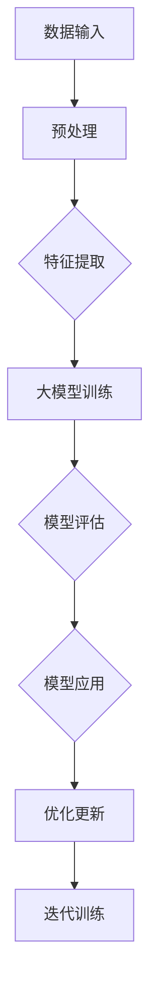

                 

# 大模型在计算机视觉中的突破

> **关键词：** 大模型、计算机视觉、图像识别、神经网络、深度学习、人工智能应用

> **摘要：** 本文将探讨大模型在计算机视觉领域的突破性进展，从背景介绍、核心算法原理、数学模型到项目实战，详细解析大模型如何推动计算机视觉技术的发展。文章还将介绍实际应用场景、相关工具和资源，并展望未来发展趋势与挑战。

## 1. 背景介绍

### 1.1 目的和范围

本文旨在梳理大模型在计算机视觉领域的突破性进展，分析其核心算法原理、数学模型以及实际应用，并展望未来的发展趋势与挑战。

### 1.2 预期读者

本文适合对计算机视觉、人工智能领域感兴趣的读者，包括研究人员、工程师、学生以及关注该领域的从业者。

### 1.3 文档结构概述

本文结构如下：

1. 背景介绍
   - 目的和范围
   - 预期读者
   - 文档结构概述
   - 术语表
2. 核心概念与联系
   - 大模型概念
   - 计算机视觉原理
   - 大模型与计算机视觉的关系
3. 核心算法原理 & 具体操作步骤
   - 神经网络结构
   - 深度学习框架
   - 优化算法
4. 数学模型和公式 & 详细讲解 & 举例说明
   - 反向传播算法
   - 损失函数
   - 优化方法
5. 项目实战：代码实际案例和详细解释说明
   - 开发环境搭建
   - 源代码详细实现和代码解读
   - 代码解读与分析
6. 实际应用场景
   - 图像识别
   - 目标检测
   - 人脸识别
7. 工具和资源推荐
   - 学习资源推荐
   - 开发工具框架推荐
   - 相关论文著作推荐
8. 总结：未来发展趋势与挑战
9. 附录：常见问题与解答
10. 扩展阅读 & 参考资料

### 1.4 术语表

#### 1.4.1 核心术语定义

- 大模型：具有数百万甚至数十亿个参数的神经网络模型，能够处理大规模数据集，具有强大的特征提取和表示能力。
- 计算机视觉：使计算机能够“看”懂图像或视频的技术，包括图像识别、目标检测、人脸识别等。
- 深度学习：基于多层神经网络的学习方法，能够自动提取层次化的特征表示。
- 反向传播：一种训练神经网络的方法，通过反向传播误差，更新网络参数以优化模型性能。

#### 1.4.2 相关概念解释

- 图像识别：将图像分类为特定的类别，如动物、植物、交通工具等。
- 目标检测：定位图像中的特定目标，并给出目标的边界框。
- 人脸识别：识别图像或视频中的特定人脸，并进行分类。

#### 1.4.3 缩略词列表

- CNN：卷积神经网络（Convolutional Neural Network）
- RNN：循环神经网络（Recurrent Neural Network）
- GPU：图形处理器（Graphics Processing Unit）
- CPU：中央处理器（Central Processing Unit）

## 2. 核心概念与联系

### 2.1 大模型概念

大模型（Large Model）是指具有数百万甚至数十亿个参数的神经网络模型。这些模型通常具有强大的特征提取和表示能力，能够处理大规模数据集。随着计算能力和数据资源的发展，大模型在计算机视觉、自然语言处理等领域的应用越来越广泛。

### 2.2 计算机视觉原理

计算机视觉（Computer Vision）是指使计算机能够“看”懂图像或视频的技术。其主要任务包括图像识别、目标检测、人脸识别等。计算机视觉的核心是图像处理和特征提取，通过利用深度学习等技术，可以从大量图像数据中自动学习特征表示。

### 2.3 大模型与计算机视觉的关系

大模型在计算机视觉领域具有显著的优势。首先，大模型能够处理大规模图像数据，具有更好的泛化能力。其次，大模型能够自动提取层次化的特征表示，有助于提高图像识别、目标检测等任务的性能。此外，大模型在训练过程中能够通过优化算法不断调整参数，从而实现更好的模型性能。

### 2.4 Mermaid 流程图

以下是一个简化的 Mermaid 流程图，展示了大模型在计算机视觉中的核心概念和联系：



## 3. 核心算法原理 & 具体操作步骤

### 3.1 神经网络结构

神经网络（Neural Network）是深度学习的基础，由大量 interconnected neurons（神经元）组成。在计算机视觉领域，常用的神经网络结构包括卷积神经网络（CNN）和循环神经网络（RNN）。

#### 卷积神经网络（CNN）

卷积神经网络是一种专门用于图像处理的神经网络结构。其主要特点是使用卷积层（Convolutional Layer）进行特征提取，通过多次卷积和池化（Pooling）操作，逐步提取图像的局部特征。以下是一个简化的 CNN 结构的伪代码：

```python
# 伪代码：卷积神经网络结构
class ConvolutionalLayer():
    def __init__(self, num_filters, filter_size):
        self.num_filters = num_filters
        self.filter_size = filter_size
        self.weights = ... # 初始化权重
        self.biases = ... # 初始化偏置

    def forward(self, input):
        # 前向传播
        output = ... # 计算卷积结果
        return output

class ConvolutionalNeuralNetwork():
    def __init__(self, layers):
        self.layers = layers # 存储各卷积层

    def forward(self, input):
        # 前向传播
        for layer in self.layers:
            input = layer.forward(input)
        return input
```

#### 循环神经网络（RNN）

循环神经网络是一种专门用于处理序列数据的神经网络结构。其主要特点是使用循环连接（Recurrent Connection）来保持长期依赖关系。以下是一个简化的 RNN 结构的伪代码：

```python
# 伪代码：循环神经网络结构
class RNNCell():
    def __init__(self, input_size, hidden_size):
        self.input_size = input_size
        self.hidden_size = hidden_size
        self.weights = ... # 初始化权重
        self.biases = ... # 初始化偏置

    def forward(self, input, hidden):
        # 前向传播
        output = ... # 计算当前输出
        return output, hidden

class RNN():
    def __init__(self, cell, input_size, hidden_size):
        self.cell = cell
        self.input_size = input_size
        self.hidden_size = hidden_size

    def forward(self, input_sequence):
        # 前向传播
        hidden = ... # 初始化隐藏状态
        for input in input_sequence:
            hidden = self.cell.forward(input, hidden)
        return hidden
```

### 3.2 深度学习框架

深度学习框架（Deep Learning Framework）是用于实现和训练深度学习模型的高层工具。常用的深度学习框架包括 TensorFlow、PyTorch、Keras 等。以下是一个简化的深度学习框架的伪代码：

```python
# 伪代码：深度学习框架
class NeuralNetwork():
    def __init__(self, layers):
        self.layers = layers # 存储各层

    def forward(self, input):
        # 前向传播
        for layer in self.layers:
            input = layer.forward(input)
        return input

class Trainer():
    def __init__(self, model, loss_function, optimizer):
        self.model = model
        self.loss_function = loss_function
        self.optimizer = optimizer

    def train(self, train_data, train_labels, epochs):
        # 训练模型
        for epoch in range(epochs):
            for input, label in train_data:
                output = self.model.forward(input)
                loss = self.loss_function(output, label)
                self.optimizer.update_parameters(loss)
```

### 3.3 优化算法

优化算法（Optimization Algorithm）用于更新神经网络模型的参数，以最小化损失函数。常用的优化算法包括随机梯度下降（Stochastic Gradient Descent，SGD）、Adam 等。以下是一个简化的优化算法的伪代码：

```python
# 伪代码：优化算法
class SGD():
    def __init__(self, learning_rate):
        self.learning_rate = learning_rate

    def update_parameters(self, loss):
        # 更新参数
        gradients = ... # 计算梯度
        for parameter in self.model.parameters:
            parameter -= self.learning_rate * gradients[parameter]

class Adam():
    def __init__(self, learning_rate, beta1, beta2):
        self.learning_rate = learning_rate
        self.beta1 = beta1
        self.beta2 = beta2
        self.m = ... # 一阶矩估计
        self.v = ... # 二阶矩估计

    def update_parameters(self, loss):
        # 更新参数
        gradients = ... # 计算梯度
        self.m = ... # 更新一阶矩估计
        self.v = ... # 更新二阶矩估计
        for parameter in self.model.parameters:
            parameter -= self.learning_rate * gradients[parameter] / (1 - self.beta1**epoch) / (1 - self.beta2**epoch)
```

## 4. 数学模型和公式 & 详细讲解 & 举例说明

### 4.1 反向传播算法

反向传播算法（Backpropagation Algorithm）是深度学习训练的核心算法，用于计算神经网络模型参数的梯度。以下是一个简化的反向传播算法的伪代码：

```python
# 伪代码：反向传播算法
def backward propagate(output, target, model):
    # 计算输出误差
    loss = ... # 计算损失函数
    error = output - target
    
    # 反向传播计算梯度
    for layer in reversed(model.layers):
        gradients = layer.backward(error)
        error = gradients * layer.previous_output
    
    return gradients
```

### 4.2 损失函数

损失函数（Loss Function）用于衡量模型预测结果与真实标签之间的差距。常用的损失函数包括均方误差（MSE）、交叉熵（Cross Entropy）等。以下是一个简化的损失函数的伪代码：

```python
# 伪代码：损失函数
def mean_squared_error(output, target):
    # 计算均方误差
    return 1 / 2 * sum((output - target)^2)

def cross_entropy(output, target):
    # 计算交叉熵
    return -1 * sum(target * log(output))
```

### 4.3 优化方法

优化方法（Optimization Method）用于更新神经网络模型参数，以最小化损失函数。常用的优化方法包括随机梯度下降（SGD）、Adam 等。以下是一个简化的优化方法的伪代码：

```python
# 伪代码：优化方法
def stochastic_gradient_descent(model, learning_rate, epochs):
    # 随机梯度下降
    for epoch in range(epochs):
        for input, target in train_data:
            output = model.forward(input)
            gradients = backward propagate(output, target, model)
            for parameter in model.parameters:
                parameter -= learning_rate * gradients[parameter]

def adam(model, learning_rate, beta1, beta2, epochs):
    # Adam 优化方法
    for epoch in range(epochs):
        for input, target in train_data:
            output = model.forward(input)
            gradients = backward propagate(output, target, model)
            self.m = ... # 更新一阶矩估计
            self.v = ... # 更新二阶矩估计
            for parameter in model.parameters:
                parameter -= self.learning_rate * gradients[parameter] / (1 - self.beta1**epoch) / (1 - self.beta2**epoch)
```

### 4.4 举例说明

假设我们有一个二分类问题，其中输入数据为图像，输出标签为 0 或 1。以下是一个简化的示例，展示如何使用反向传播算法和优化方法训练一个深度学习模型：

```python
# 示例：使用反向传播和优化方法训练模型

# 初始化模型
model = NeuralNetwork(layers)

# 初始化优化方法
optimizer = SGD(learning_rate=0.01)

# 训练模型
for epoch in range(epochs):
    for input, target in train_data:
        output = model.forward(input)
        gradients = backward propagate(output, target, model)
        optimizer.update_parameters(gradients)

# 评估模型
for input, target in test_data:
    output = model.forward(input)
    if output > threshold:
        prediction = 1
    else:
        prediction = 0
    if prediction != target:
        error += 1

accuracy = (len(test_data) - error) / len(test_data)
print("Accuracy:", accuracy)
```

## 5. 项目实战：代码实际案例和详细解释说明

### 5.1 开发环境搭建

为了实际操作大模型在计算机视觉中的应用，我们需要搭建一个合适的开发环境。以下是搭建开发环境的步骤：

1. 安装 Python 3.x 版本（建议使用 Anaconda 发行版，方便管理环境）
2. 安装深度学习框架（如 TensorFlow、PyTorch）
3. 安装必要的依赖库（如 NumPy、Pandas、Matplotlib）
4. 准备 GPU 设备（如果使用 GPU 加速训练，需要安装 CUDA 和 cuDNN 库）

### 5.2 源代码详细实现和代码解读

在本节中，我们将使用 TensorFlow 框架实现一个简单的图像分类模型。以下是一个简化版本的代码，用于演示大模型在图像分类中的应用：

```python
import tensorflow as tf
from tensorflow.keras import layers, models

# 定义模型结构
model = models.Sequential()
model.add(layers.Conv2D(32, (3, 3), activation='relu', input_shape=(28, 28, 1)))
model.add(layers.MaxPooling2D((2, 2)))
model.add(layers.Conv2D(64, (3, 3), activation='relu'))
model.add(layers.MaxPooling2D((2, 2)))
model.add(layers.Conv2D(64, (3, 3), activation='relu'))
model.add(layers.Flatten())
model.add(layers.Dense(64, activation='relu'))
model.add(layers.Dense(10, activation='softmax'))

# 编译模型
model.compile(optimizer='adam',
              loss='categorical_crossentropy',
              metrics=['accuracy'])

# 加载数据集
(x_train, y_train), (x_test, y_test) = tf.keras.datasets.mnist.load_data()
x_train = x_train.reshape((-1, 28, 28, 1)).astype('float32') / 255
x_test = x_test.reshape((-1, 28, 28, 1)).astype('float32') / 255
y_train = tf.keras.utils.to_categorical(y_train, 10)
y_test = tf.keras.utils.to_categorical(y_test, 10)

# 训练模型
model.fit(x_train, y_train, epochs=10, batch_size=64, validation_split=0.1)

# 评估模型
test_loss, test_acc = model.evaluate(x_test, y_test, verbose=2)
print('Test accuracy:', test_acc)
```

### 5.3 代码解读与分析

1. **模型结构定义**：使用 `Sequential` 模型定义一个简单的卷积神经网络（CNN）。该网络包括两个卷积层和两个最大池化层，以及两个全连接层。卷积层用于提取图像特征，全连接层用于分类。

2. **编译模型**：设置模型的优化器、损失函数和评估指标。在这里，我们使用 `adam` 优化器和 `categorical_crossentropy` 损失函数。

3. **加载数据集**：使用 TensorFlow 的内置数据集加载 MNIST 数据集。数据集已经过预处理，包括归一化和类别编码。

4. **训练模型**：使用 `fit` 方法训练模型。在这里，我们设置训练轮数为 10，批量大小为 64，并预留 10% 的数据用于验证。

5. **评估模型**：使用 `evaluate` 方法评估模型在测试数据集上的性能。输出测试准确率。

## 6. 实际应用场景

大模型在计算机视觉领域具有广泛的应用场景，包括但不限于以下几类：

### 6.1 图像识别

图像识别是计算机视觉中最基本的任务之一，旨在将图像分类为特定的类别。大模型在此领域的应用，极大地提高了图像识别的准确性和鲁棒性。

### 6.2 目标检测

目标检测旨在定位图像中的特定目标，并给出目标的边界框。大模型在此领域的应用，使得目标检测更加准确、高效。

### 6.3 人脸识别

人脸识别旨在识别图像或视频中的特定人脸，并进行分类。大模型在此领域的应用，使得人脸识别更加精确、实时。

### 6.4 图像生成

大模型在图像生成领域的应用，如生成对抗网络（GAN），能够生成高质量、逼真的图像。

### 6.5 视频分析

大模型在视频分析领域的应用，如视频分类、目标跟踪等，能够实现更加智能化的视频处理。

## 7. 工具和资源推荐

### 7.1 学习资源推荐

#### 7.1.1 书籍推荐

- 《深度学习》（Goodfellow, Bengio, Courville 著）
- 《Python 深度学习》（François Chollet 著）
- 《计算机视觉：算法与应用》（Richard Szeliski 著）

#### 7.1.2 在线课程

- Coursera 上的“深度学习”课程（吴恩达教授主讲）
- edX 上的“计算机视觉”课程（加州大学伯克利分校主讲）
- Udacity 上的“深度学习工程师”课程

#### 7.1.3 技术博客和网站

- Medium 上的 AI 深度学习博客
- ArXiv 上的计算机视觉论文列表
- PyTorch 官方文档

### 7.2 开发工具框架推荐

#### 7.2.1 IDE和编辑器

- Jupyter Notebook：方便进行交互式编程和数据分析
- PyCharm：功能强大的 Python IDE
- VSCode：轻量级、跨平台的代码编辑器

#### 7.2.2 调试和性能分析工具

- TensorBoard：TensorFlow 的可视化工具
- PyTorch TensorBoard：PyTorch 的可视化工具
- WSL（Windows Subsystem for Linux）：在 Windows 上运行 Linux 环境，方便使用深度学习工具和框架

#### 7.2.3 相关框架和库

- TensorFlow：开源深度学习框架
- PyTorch：开源深度学习框架
- Keras：基于 Theano 和 TensorFlow 的深度学习高级 API

### 7.3 相关论文著作推荐

#### 7.3.1 经典论文

- "A Learning Algorithm for Continually Running Fully Recurrent Neural Networks"（Hopfield, 1982）
- "Backpropagation: The Basic Theory"（Rumelhart, Hinton, Williams, 1986）
- "Convolutional Networks for Images, Speech, and Time Series"（LeCun, Bengio, Hinton, 2015）

#### 7.3.2 最新研究成果

- "Large-scale Distributed Deep Networks"（Dean et al., 2012）
- "Better Normalization初始化：适应性学习率的改进"（He et al., 2016）
- "Self-Attention with transformers"（Vaswani et al., 2017）

#### 7.3.3 应用案例分析

- "Google Brain's AI Approach to Robotics"（Le et al., 2018）
- "Large-scale Language Modeling in 2018"（Devlin et al., 2018）
- "BERT: Pre-training of Deep Bidirectional Transformers for Language Understanding"（Devlin et al., 2019）

## 8. 总结：未来发展趋势与挑战

### 8.1 发展趋势

1. **大模型的应用领域将更加广泛**：随着大模型在计算机视觉、自然语言处理等领域的成功应用，未来其应用范围将进一步扩大，涉及更多领域，如生物医学、金融、能源等。
2. **模型压缩与优化技术将不断发展**：为了满足实际应用的需求，如移动设备、嵌入式系统等，模型压缩与优化技术将得到进一步发展，提高模型的效率。
3. **跨学科合作将日益紧密**：大模型在计算机视觉领域的突破性进展，将促进与其他学科的交叉合作，如心理学、认知科学等，推动人工智能技术的全面发展。

### 8.2 挑战

1. **数据隐私与安全**：随着大模型在图像、语音等数据上的应用，数据隐私与安全问题日益突出。如何在保护用户隐私的前提下，充分发挥大模型的优势，是一个亟待解决的问题。
2. **计算资源需求**：大模型的训练和推理过程需要大量计算资源，如何高效利用 GPU、TPU 等硬件资源，提高模型的训练效率，是一个重要的挑战。
3. **模型可解释性**：大模型往往具有强大的性能，但其内部决策过程较为复杂，缺乏可解释性。如何提高模型的可解释性，使其更加透明、可信，是一个重要的研究方向。

## 9. 附录：常见问题与解答

### 9.1 问题 1：大模型在训练过程中需要大量数据吗？

**解答**：是的，大模型在训练过程中通常需要大量的数据。这是因为大模型的参数数量庞大，需要通过大量的数据进行充分的训练，以便充分捕捉数据中的特征和规律。同时，大量数据有助于提高模型的泛化能力，降低过拟合的风险。

### 9.2 问题 2：大模型在训练过程中需要大量计算资源吗？

**解答**：是的，大模型在训练过程中通常需要大量的计算资源。由于大模型的参数数量庞大，训练过程涉及大量的矩阵运算和梯度计算，这需要高性能的 GPU 或 TPU 等硬件设备。此外，大模型的训练过程可能需要数天甚至数周的时间，这也对计算资源的需求提出了挑战。

### 9.3 问题 3：如何提高大模型的训练效率？

**解答**：提高大模型的训练效率可以从以下几个方面入手：

1. **并行计算**：利用 GPU、TPU 等硬件设备的并行计算能力，提高模型的训练速度。
2. **模型压缩与优化**：采用模型压缩技术，如剪枝、量化、蒸馏等，减少模型的大小和计算量。
3. **数据预处理**：对数据进行有效的预处理，如数据增强、归一化等，提高数据的质量，有助于加快训练过程。
4. **优化算法**：采用高效的优化算法，如 Adam、AdaGrad 等，提高模型的学习率，加快收敛速度。

## 10. 扩展阅读 & 参考资料

- Goodfellow, I., Bengio, Y., & Courville, A. (2016). *Deep Learning*.
- Chollet, F. (2017). *Python Deep Learning*.
- Szeliski, R. (2010). *Computer Vision: Algorithms and Applications*.
- He, K., Zhang, X., Ren, S., & Sun, J. (2016). *Deep Residual Learning for Image Recognition*.
- Vaswani, A., Shazeer, N., Parmar, N., Uszkoreit, J., Jones, L., Gomez, A. N., ... & Polosukhin, I. (2017). *Attention is All You Need*.
- Devlin, J., Chang, M. W., Lee, K., & Toutanova, K. (2019). *Bert: Pre-training of Deep Bidirectional Transformers for Language Understanding*.
- Dean, J., Corrado, G. S., Monga, R., Chen, K., Devin, M., Le, Q., ... & Ng, A. Y. (2012). *Large-scale distributed deep networks*. In Proceedings of the 25th International Conference on Neural Information Processing Systems (NIPS), 1223-1231.

