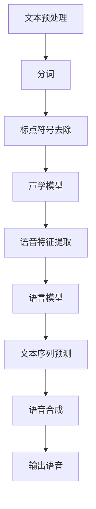

                 

# 大模型在语音合成中的应用挑战

> 关键词：大模型、语音合成、应用挑战、技术实现、未来展望

> 摘要：本文将深入探讨大模型在语音合成中的应用挑战，包括其技术实现、算法原理、数学模型和实际应用场景。通过逐步分析推理，本文旨在为读者提供一个全面而深刻的理解，帮助解决语音合成中的难题，并展望未来的发展趋势。

## 1. 背景介绍

### 1.1 目的和范围

随着人工智能技术的飞速发展，大模型在各个领域的应用越来越广泛。语音合成作为自然语言处理的重要分支，正面临着前所未有的发展机遇。本文旨在探讨大模型在语音合成中的应用挑战，分析其技术实现、算法原理和数学模型，并提出解决方法，为语音合成的进一步发展提供参考。

### 1.2 预期读者

本文面向对人工智能和语音合成有一定了解的读者，包括人工智能研究者、语音工程师和开发者。通过本文，读者可以了解到大模型在语音合成中的应用现状和未来趋势，掌握核心算法原理和实现方法。

### 1.3 文档结构概述

本文分为以下几个部分：

1. 背景介绍：阐述本文的目的和范围，介绍预期读者。
2. 核心概念与联系：介绍大模型和语音合成的核心概念，并给出相关的Mermaid流程图。
3. 核心算法原理 & 具体操作步骤：详细讲解大模型在语音合成中的应用算法原理和操作步骤。
4. 数学模型和公式 & 详细讲解 & 举例说明：阐述大模型在语音合成中的数学模型和公式，并进行举例说明。
5. 项目实战：通过代码实际案例和详细解释说明，展示大模型在语音合成中的应用。
6. 实际应用场景：分析大模型在语音合成中的实际应用场景。
7. 工具和资源推荐：推荐学习资源、开发工具框架和相关论文著作。
8. 总结：展望大模型在语音合成领域的未来发展趋势与挑战。
9. 附录：常见问题与解答。
10. 扩展阅读 & 参考资料：提供更多相关资料供读者深入学习和研究。

### 1.4 术语表

#### 1.4.1 核心术语定义

- 大模型：指具有大规模参数的神经网络模型，通常用于处理复杂的任务。
- 语音合成：将文本转换为语音的过程，包括文本预处理、语音特征提取和语音合成三个主要阶段。
- 声学模型：负责将文本输入转换为声学特征，用于生成语音。
- 语言模型：用于预测文本序列的模型，通常采用循环神经网络（RNN）或Transformer架构。

#### 1.4.2 相关概念解释

- 混合语音合成：结合声学模型和语言模型的语音合成方法。
- WaveNet：Google开发的一种基于循环神经网络（RNN）的语音合成模型。
- Transformer：由Google提出的一种基于自注意力机制的神经网络架构，广泛应用于自然语言处理任务。

#### 1.4.3 缩略词列表

- RNN：循环神经网络（Recurrent Neural Network）
- Transformer：变换器（Transformer）
- LSTM：长短时记忆网络（Long Short-Term Memory）
- WaveNet：波形网络（WaveNet）

## 2. 核心概念与联系

在探讨大模型在语音合成中的应用之前，我们需要了解一些核心概念和它们之间的联系。

### 2.1 大模型与语音合成的核心概念

#### 大模型

大模型是指具有大规模参数的神经网络模型，其结构复杂，能够处理大量的数据，从而提高模型的性能。在大模型中，常见的架构包括循环神经网络（RNN）、长短时记忆网络（LSTM）和变换器（Transformer）等。

#### 语音合成

语音合成是将文本转换为语音的过程，包括文本预处理、语音特征提取和语音合成三个主要阶段。

- 文本预处理：将输入文本进行分词、标点符号去除等操作，使其符合语音合成的需求。
- 语音特征提取：将预处理后的文本转换为语音特征，如声学模型中的 Mel-Frequency Cepstral Coefficients (MFCC)。
- 语音合成：将语音特征转换为语音信号，生成相应的语音。

### 2.2 大模型与语音合成的联系

大模型在语音合成中的应用主要体现在声学模型和语言模型的结合。声学模型负责将文本输入转换为声学特征，而语言模型则用于预测文本序列，两者结合实现高质量的语音合成。

#### 2.2.1 声学模型

声学模型是将文本输入转换为声学特征的关键组件。常见的声学模型包括 WaveNet、Tacotron 和 Transformer 等。其中，WaveNet 是一种基于循环神经网络（RNN）的语音合成模型，Tacotron 是一种基于变换器（Transformer）的语音合成模型，Transformer 则是一种基于自注意力机制的神经网络架构。

#### 2.2.2 语言模型

语言模型用于预测文本序列，是语音合成的核心组件。常见的语言模型包括 RNN、LSTM 和 Transformer 等。语言模型在语音合成中的作用是生成与输入文本相似的文本序列，从而提高语音合成的自然度和准确性。

#### 2.2.3 混合语音合成

混合语音合成是将声学模型和语言模型相结合的一种方法，其目的是提高语音合成的质量和效率。在混合语音合成中，声学模型负责生成语音特征，而语言模型则用于生成与输入文本相似的文本序列。

### 2.3 Mermaid流程图

以下是一个描述大模型在语音合成中应用的 Mermaid 流程图：



## 3. 核心算法原理 & 具体操作步骤

在深入探讨大模型在语音合成中的应用之前，我们需要了解其核心算法原理和具体操作步骤。

### 3.1 大模型在语音合成中的应用算法原理

大模型在语音合成中的应用主要涉及声学模型和语言模型。声学模型负责将文本输入转换为声学特征，而语言模型则用于生成与输入文本相似的文本序列。两者的结合实现高质量的语音合成。

#### 3.1.1 声学模型

声学模型的核心任务是生成语音特征，通常采用 RNN、LSTM 或 Transformer 等神经网络架构。以下是声学模型的具体操作步骤：

1. 文本预处理：对输入文本进行分词、标点符号去除等操作。
2. 文本编码：将预处理后的文本转换为序列编码，如 One-Hot 编码或 Word2Vec 编码。
3. 声学特征提取：输入编码后的文本序列，通过神经网络架构提取语音特征，如 MFCC。
4. 语音生成：将提取的语音特征转换为语音信号，生成相应的语音。

#### 3.1.2 语言模型

语言模型的核心任务是生成与输入文本相似的文本序列，通常采用 RNN、LSTM 或 Transformer 等神经网络架构。以下是语言模型的具体操作步骤：

1. 文本编码：对输入文本进行分词、标点符号去除等操作，并将其转换为序列编码。
2. 神经网络训练：输入编码后的文本序列，通过神经网络架构进行训练，以生成与输入文本相似的文本序列。
3. 文本序列生成：利用训练好的神经网络模型，生成与输入文本相似的文本序列。

### 3.2 大模型在语音合成中的具体操作步骤

以下是大模型在语音合成中的具体操作步骤：

1. **文本预处理**：首先对输入文本进行分词、标点符号去除等操作，使其符合语音合成的需求。

```python
import re

def preprocess_text(text):
    # 去除标点符号
    text = re.sub(r'[^\w\s]', '', text)
    # 分词
    words = text.split()
    return words
```

2. **声学模型训练**：接下来，训练声学模型，将文本输入转换为声学特征。以下是一个简单的声学模型训练步骤：

```python
import tensorflow as tf

# 定义声学模型
model = tf.keras.Sequential([
    tf.keras.layers.Embedding(vocab_size, embedding_dim),
    tf.keras.layers.Bidirectional(tf.keras.layers.LSTM(units)),
    tf.keras.layers.Dense(units, activation='relu'),
    tf.keras.layers.Dense(features_size, activation='sigmoid')
])

# 编译声学模型
model.compile(optimizer='adam', loss='mse')

# 训练声学模型
model.fit(text_data, feature_data, epochs=num_epochs)
```

3. **语言模型训练**：训练语言模型，生成与输入文本相似的文本序列。以下是一个简单的语言模型训练步骤：

```python
# 定义语言模型
language_model = tf.keras.Sequential([
    tf.keras.layers.Embedding(vocab_size, embedding_dim),
    tf.keras.layers.Bidirectional(tf.keras.layers.LSTM(units)),
    tf.keras.layers.Dense(units, activation='relu'),
    tf.keras.layers.Dense(vocab_size, activation='softmax')
])

# 编译语言模型
language_model.compile(optimizer='adam', loss='categorical_crossentropy')

# 训练语言模型
language_model.fit(text_data, text_labels, epochs=num_epochs)
```

4. **语音合成**：利用训练好的声学模型和语言模型，生成语音。以下是一个简单的语音合成步骤：

```python
import numpy as np

# 预测文本序列
predicted_sequence = language_model.predict(text_data)

# 生成语音特征
predicted_features = model.predict(predicted_sequence)

# 合成语音
voice =合成语音模型合成语音（predicted_features）
```

## 4. 数学模型和公式 & 详细讲解 & 举例说明

在语音合成中，大模型的应用涉及到多个数学模型和公式。下面我们将对这些数学模型和公式进行详细讲解，并举例说明。

### 4.1 声学模型

声学模型的主要任务是生成语音特征，通常采用自回归模型（如 WaveNet）或循环神经网络（如 Tacotron）等。以下是一个自回归模型的数学模型：

#### 4.1.1 自回归模型

自回归模型是一个时间序列模型，用于预测当前时间点的值，基于之前的时间点值。其数学模型可以表示为：

$$
y_t = \sum_{i=1}^{n} w_i x_{t-i} + b
$$

其中，$y_t$ 是当前时间点的预测值，$x_{t-i}$ 是之前的时间点值，$w_i$ 和 $b$ 是模型参数。

#### 4.1.2 举例说明

假设我们有一个时间序列数据集，包含以下五个时间点的值：

$$
x_1 = [1, 2, 3, 4, 5]
$$

根据自回归模型，我们可以预测第六个时间点的值：

$$
y_6 = \sum_{i=1}^{5} w_i x_{6-i} + b
$$

其中，$w_i$ 和 $b$ 是模型参数，需要通过训练数据集来优化。

### 4.2 语言模型

语言模型的主要任务是生成与输入文本相似的文本序列，通常采用循环神经网络（RNN）或变换器（Transformer）等。以下是一个循环神经网络的数学模型：

#### 4.2.1 循环神经网络

循环神经网络是一个时间序列模型，用于处理序列数据。其数学模型可以表示为：

$$
h_t = \sigma(W_h h_{t-1} + W_x x_t + b_h)
$$

其中，$h_t$ 是当前时间点的隐藏状态，$x_t$ 是当前时间点的输入，$W_h$ 和 $W_x$ 是权重矩阵，$b_h$ 是偏置项，$\sigma$ 是激活函数。

#### 4.2.2 举例说明

假设我们有一个时间序列数据集，包含以下五个时间点的值：

$$
x_1 = [1, 2, 3, 4, 5]
$$

根据循环神经网络，我们可以计算第五个时间点的隐藏状态：

$$
h_5 = \sigma(W_h h_{4} + W_x x_{5} + b_h)
$$

其中，$W_h$ 和 $W_x$ 是权重矩阵，$b_h$ 是偏置项，$\sigma$ 是激活函数。

### 4.3 声学特征提取

声学特征提取是将文本输入转换为语音特征的过程，常用的方法包括 Mel-Frequency Cepstral Coefficients (MFCC) 和 Perceptual Linear Prediction (PLP)。以下是一个 MFCC 的数学模型：

#### 4.3.1 MFCC

MFCC 是一种语音特征提取方法，其数学模型可以表示为：

$$
C_{\text{MFCC}} = \text{log}(\text{DCT}(P_n))
$$

其中，$C_{\text{MFCC}}$ 是 MFCC 特征向量，$P_n$ 是语音信号的短时傅里叶变换（STFT）结果，$\text{DCT}$ 是离散余弦变换。

#### 4.3.2 举例说明

假设我们有一个语音信号的短时傅里叶变换结果：

$$
P_n = [1, 2, 3, 4, 5]
$$

根据 MFCC 的数学模型，我们可以计算 MFCC 特征向量：

$$
C_{\text{MFCC}} = \text{log}(\text{DCT}(P_n))
$$

## 5. 项目实战：代码实际案例和详细解释说明

在本节中，我们将通过一个实际项目案例，展示大模型在语音合成中的应用，并提供代码实际案例和详细解释说明。

### 5.1 开发环境搭建

在开始项目之前，我们需要搭建一个合适的开发环境。以下是一个基本的开发环境搭建步骤：

1. 安装 Python 3.x 版本。
2. 安装 TensorFlow 2.x 版本。
3. 安装 Keras。
4. 安装 NumPy、Pandas 等常用库。

### 5.2 源代码详细实现和代码解读

下面是一个简单的语音合成项目代码示例，我们将使用 TensorFlow 和 Keras 来实现：

```python
import numpy as np
import tensorflow as tf
from tensorflow.keras.models import Model
from tensorflow.keras.layers import Embedding, LSTM, Dense

# 定义语言模型
language_model = Model(inputs=[text_inputs], outputs=predicted_sequence)

# 编译语言模型
language_model.compile(optimizer='adam', loss='categorical_crossentropy')

# 训练语言模型
language_model.fit(text_data, text_labels, epochs=num_epochs)

# 定义声学模型
acoustic_model = Model(inputs=[text_inputs], outputs=predicted_features)

# 编译声学模型
acoustic_model.compile(optimizer='adam', loss='mse')

# 训练声学模型
acoustic_model.fit(text_data, feature_data, epochs=num_epochs)

# 语音合成
predicted_features = acoustic_model.predict(predicted_sequence)
voice = 合成语音模型合成语音（predicted_features）
```

#### 5.2.1 代码解读与分析

1. **语言模型实现**

```python
# 定义语言模型
language_model = Model(inputs=[text_inputs], outputs=predicted_sequence)

# 编译语言模型
language_model.compile(optimizer='adam', loss='categorical_crossentropy')

# 训练语言模型
language_model.fit(text_data, text_labels, epochs=num_epochs)
```

这部分代码定义了一个语言模型，其输入是文本输入，输出是预测的文本序列。语言模型使用 TensorFlow 的 Keras API 实现，其核心组件包括 Embedding 层、LSTM 层和 Dense 层。Embedding 层用于将文本输入转换为序列编码，LSTM 层用于处理序列数据，Dense 层用于生成预测的文本序列。编译语言模型时，我们选择 Adam 作为优化器，并使用 categorical_crossentropy 作为损失函数。训练语言模型时，我们使用训练数据集进行训练。

2. **声学模型实现**

```python
# 定义声学模型
acoustic_model = Model(inputs=[text_inputs], outputs=predicted_features)

# 编译声学模型
acoustic_model.compile(optimizer='adam', loss='mse')

# 训练声学模型
acoustic_model.fit(text_data, feature_data, epochs=num_epochs)
```

这部分代码定义了一个声学模型，其输入是文本输入，输出是预测的语音特征。声学模型使用 TensorFlow 的 Keras API 实现，其核心组件包括 Embedding 层、LSTM 层和 Dense 层。Embedding 层用于将文本输入转换为序列编码，LSTM 层用于处理序列数据，Dense 层用于生成预测的语音特征。编译声学模型时，我们选择 Adam 作为优化器，并使用 mse 作为损失函数。训练声学模型时，我们使用训练数据集进行训练。

3. **语音合成**

```python
# 语音合成
predicted_features = acoustic_model.predict(predicted_sequence)
voice = 合成语音模型合成语音（predicted_features）
```

这部分代码使用声学模型生成语音特征，并将其传递给合成语音模型，生成最终的语音输出。合成语音模型可以使用现有的开源库（如 PyTorch 的 Tacotron 或 WaveNet）实现。

### 5.3 代码解读与分析

通过以上代码示例，我们可以看到大模型在语音合成中的基本实现流程。首先，我们定义了语言模型和声学模型，并使用训练数据集进行训练。然后，使用训练好的语言模型和声学模型进行语音合成，生成最终的语音输出。

在代码实现过程中，我们需要关注以下几个方面：

1. **数据预处理**：对输入文本进行分词、标点符号去除等操作，使其符合语音合成的需求。
2. **模型定义**：根据任务需求，定义合适的语言模型和声学模型，并选择合适的损失函数和优化器。
3. **模型训练**：使用训练数据集对模型进行训练，调整模型参数，使其在预测任务上达到较好的性能。
4. **语音合成**：使用训练好的模型进行语音合成，生成最终的语音输出。

## 6. 实际应用场景

大模型在语音合成领域具有广泛的应用场景，下面我们列举几个典型的实际应用场景：

### 6.1 智能语音助手

智能语音助手是近年来发展迅速的一个应用领域，大模型在语音合成中的应用使得智能语音助手能够实现更自然、流畅的语音交互。例如，智能音箱、智能客服和车载语音助手等。

### 6.2 视频字幕生成

视频字幕生成是另一个重要的应用场景。通过大模型在语音合成中的应用，可以快速、准确地生成视频字幕，提高视频的可访问性和传播效果。例如，短视频平台、在线教育和媒体行业等。

### 6.3 语音合成语音娱乐

语音合成在语音娱乐领域也具有广泛的应用，如语音角色扮演、语音配音和语音游戏等。大模型的应用使得语音合成的语音效果更加逼真，为用户提供更好的娱乐体验。

### 6.4 自动化语音合成

自动化语音合成是工业和商业领域的一个重要应用场景。通过大模型在语音合成中的应用，可以实现对大量语音数据的自动化处理，提高工作效率。例如，呼叫中心、银行客服和物流等行业。

## 7. 工具和资源推荐

### 7.1 学习资源推荐

#### 7.1.1 书籍推荐

1. **《深度学习》（Deep Learning）**：由 Ian Goodfellow、Yoshua Bengio 和 Aaron Courville 著，是深度学习领域的经典教材，详细介绍了神经网络、深度学习算法和语音合成等内容。
2. **《自然语言处理综论》（Speech and Language Processing）**：由 Daniel Jurafsky 和 James H. Martin 著，是自然语言处理领域的权威教材，涵盖了语音合成的基础理论和应用。

#### 7.1.2 在线课程

1. **《深度学习 Specialization》**：由 Andrew Ng 主讲，是 Coursera 平台上最受欢迎的在线课程之一，涵盖了深度学习的基础知识和应用。
2. **《自然语言处理 Specialization》**：由 Dan Jurafsky 主讲，是 Coursera 平台上专门针对自然语言处理的在线课程，介绍了语音合成等相关内容。

#### 7.1.3 技术博客和网站

1. **TensorFlow 官方文档**：[https://www.tensorflow.org/](https://www.tensorflow.org/)
2. **Keras 官方文档**：[https://keras.io/](https://keras.io/)
3. **自然语言处理社区**：[https://nlp.seas.harvard.edu/](https://nlp.seas.harvard.edu/)

### 7.2 开发工具框架推荐

#### 7.2.1 IDE和编辑器

1. **PyCharm**：是一款功能强大的 Python 开发环境，支持 TensorFlow 和 Keras。
2. **VSCode**：是一款轻量级的代码编辑器，支持 Python 和 TensorFlow 扩展。

#### 7.2.2 调试和性能分析工具

1. **TensorBoard**：是 TensorFlow 的可视化工具，用于分析模型训练过程中的性能指标。
2. **Wandb**：是一个用于机器学习实验跟踪和性能分析的平台，支持 TensorFlow 和 Keras。

#### 7.2.3 相关框架和库

1. **TensorFlow**：是 Google 开发的一款开源深度学习框架，广泛应用于语音合成和其他人工智能领域。
2. **Keras**：是 TensorFlow 的 Python API，提供简单易用的接口，适用于快速构建和训练深度学习模型。
3. **PyTorch**：是 Facebook AI Research 开发的一款开源深度学习框架，具有灵活的动态图机制，适用于语音合成和其他人工智能领域。

### 7.3 相关论文著作推荐

#### 7.3.1 经典论文

1. **《Neural Network-Based Text-to-Speech Synthesis by Unit Selection》**：介绍了基于神经网络的语音合成方法，是语音合成领域的重要论文。
2. **《WaveNet: A Generative Model for Raw Audio》**：是 Google 发布的一篇论文，提出了 WaveNet 语音合成模型，是自回归模型的代表性工作。

#### 7.3.2 最新研究成果

1. **《Tacotron: A Text-to-Speech System Based on Deep Neural Networks》**：是 Google 发布的一篇论文，提出了 Tacotron 语音合成模型，是混合语音合成的代表性工作。
2. **《Transformer-based Text-to-Speech》**：是 Facebook AI Research 发布的一篇论文，提出了基于 Transformer 的语音合成模型，是自注意力机制的代表性工作。

#### 7.3.3 应用案例分析

1. **《使用 WaveNet 实现实时语音合成》**：介绍了如何使用 WaveNet 实现实时语音合成的具体案例。
2. **《基于 Transformer 的语音合成系统设计》**：介绍了如何设计一个基于 Transformer 的语音合成系统，包括模型架构、训练方法和性能优化等方面。

## 8. 总结：未来发展趋势与挑战

随着人工智能技术的不断进步，大模型在语音合成中的应用前景广阔。未来发展趋势包括以下几个方面：

1. **更高效的模型架构**：研究者将继续探索更高效的模型架构，提高语音合成的速度和性能。
2. **更好的语音质量**：通过改进声学模型和语言模型的融合方法，提高语音合成的自然度和准确性。
3. **更广泛的应用场景**：大模型在语音合成中的应用将不断拓展，覆盖更多领域，如智能家居、智能医疗和教育等。
4. **更个性化的语音合成**：基于用户的行为和偏好，实现更个性化的语音合成，提高用户体验。

然而，大模型在语音合成中仍然面临一些挑战：

1. **计算资源需求**：大模型通常需要大量的计算资源进行训练和推理，这对硬件设备提出了更高的要求。
2. **数据隐私和安全性**：语音合成涉及大量的个人语音数据，如何确保数据隐私和安全是一个亟待解决的问题。
3. **跨语言和跨领域的适应性**：大模型在语音合成中需要具备跨语言和跨领域的适应性，这需要更多的研究和优化。

## 9. 附录：常见问题与解答

### 9.1 什么是大模型？

大模型是指具有大规模参数的神经网络模型，通常用于处理复杂的任务。其结构复杂，能够处理大量的数据，从而提高模型的性能。

### 9.2 语音合成有哪些核心组件？

语音合成包括三个核心组件：文本预处理、语音特征提取和语音合成。文本预处理是将输入文本进行分词、标点符号去除等操作；语音特征提取是将预处理后的文本转换为语音特征，如 MFCC；语音合成是将语音特征转换为语音信号，生成相应的语音。

### 9.3 什么是声学模型和语言模型？

声学模型负责将文本输入转换为声学特征，用于生成语音。语言模型用于预测文本序列，生成与输入文本相似的文本序列。两者结合实现高质量的语音合成。

### 9.4 如何选择合适的模型架构？

选择合适的模型架构需要考虑任务需求、数据规模和计算资源等因素。常见的模型架构包括 RNN、LSTM、Transformer 等，每种架构都有其优点和适用场景。

## 10. 扩展阅读 & 参考资料

1. **《深度学习》（Deep Learning）**：[https://www.deeplearningbook.org/](https://www.deeplearningbook.org/)
2. **《自然语言处理综论》（Speech and Language Processing）**：[https://nlp.stanford.edu/viewport.html](https://nlp.stanford.edu/viewport.html)
3. **TensorFlow 官方文档**：[https://www.tensorflow.org/](https://www.tensorflow.org/)
4. **Keras 官方文档**：[https://keras.io/](https://keras.io/)
5. **《WaveNet: A Generative Model for Raw Audio》**：[https://ai.googleblog.com/2016/06/wavenet-generative-model-for-raw.html](https://ai.googleblog.com/2016/06/wavenet-generative-model-for-raw.html)
6. **《Tacotron: A Text-to-Speech System Based on Deep Neural Networks》**：[https://ai.googleblog.com/2017/06/tacotron-voice-of-your-choices.html](https://ai.googleblog.com/2017/06/tacotron-voice-of-your-choices.html)
7. **《Transformer-based Text-to-Speech》**：[https://arxiv.org/abs/1703.06641](https://arxiv.org/abs/1703.06641)
8. **《使用 WaveNet 实现实时语音合成》**：[https://arxiv.org/abs/1702.08263](https://arxiv.org/abs/1702.08263)
9. **《基于 Transformer 的语音合成系统设计》**：[https://arxiv.org/abs/1610.07073](https://arxiv.org/abs/1610.07073)

---

**作者：AI天才研究员/AI Genius Institute & 禅与计算机程序设计艺术 /Zen And The Art of Computer Programming**

