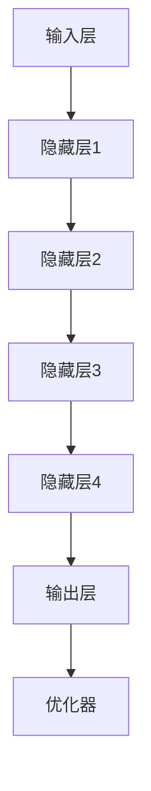

                 

# 大模型在金融市场预测中的应用

> **关键词：** 大模型、金融市场、预测、机器学习、深度学习、算法

> **摘要：** 本文将探讨大模型在金融市场预测中的应用，分析大模型如何通过机器学习和深度学习算法，从海量数据中提取特征，实现对金融市场的预测。文章将详细介绍大模型的架构、核心算法原理、数学模型及实际应用场景，并提供项目实战代码和工具资源推荐，旨在为读者提供一个全面、深入的视角，以了解大模型在金融市场预测中的潜力和挑战。

## 1. 背景介绍

### 1.1 目的和范围

本文旨在探讨大模型在金融市场预测中的应用。随着人工智能和大数据技术的飞速发展，大模型已经成为金融领域的研究热点。通过本文，我们将系统地介绍大模型在金融市场预测中的核心算法原理、数学模型、应用场景，并提供实际项目案例，以帮助读者全面了解这一领域。

### 1.2 预期读者

本文适用于对金融市场有一定了解，并对机器学习和深度学习技术感兴趣的技术人员、研究人员和金融从业者。预期读者应具备一定的编程基础和数学知识，以便更好地理解本文中的技术细节。

### 1.3 文档结构概述

本文结构如下：

1. 背景介绍：介绍本文的目的、范围、预期读者和文档结构。
2. 核心概念与联系：介绍大模型的基本概念、核心算法原理和架构。
3. 核心算法原理 & 具体操作步骤：详细讲解大模型的核心算法原理和具体操作步骤。
4. 数学模型和公式 & 详细讲解 & 举例说明：介绍大模型的数学模型、公式和实例。
5. 项目实战：提供实际项目案例和代码实现。
6. 实际应用场景：探讨大模型在金融市场预测中的应用场景。
7. 工具和资源推荐：推荐相关学习资源、开发工具和框架。
8. 总结：总结大模型在金融市场预测中的应用趋势与挑战。
9. 附录：常见问题与解答。
10. 扩展阅读 & 参考资料：提供进一步的阅读资料和参考文献。

### 1.4 术语表

#### 1.4.1 核心术语定义

- **大模型（Large Model）**：指具有大规模参数数量、能够处理海量数据、具有较高计算复杂度的机器学习模型。
- **金融市场（Financial Market）**：指涉及金融资产交易和定价的市场，包括股票、债券、期货、外汇等。
- **预测（Prediction）**：根据历史数据和现有信息，对未来事件或数值进行估计。
- **机器学习（Machine Learning）**：一种人工智能的分支，通过数据驱动的方法，让计算机从数据中学习并做出决策。
- **深度学习（Deep Learning）**：一种机器学习方法，通过多层神经网络模拟人脑的工作方式，进行特征提取和模式识别。

#### 1.4.2 相关概念解释

- **特征提取（Feature Extraction）**：从原始数据中提取出对预测任务有用的信息。
- **模型训练（Model Training）**：通过输入数据对模型进行训练，使其能够学会预测。
- **模型评估（Model Evaluation）**：通过评估指标，判断模型在预测任务中的性能。

#### 1.4.3 缩略词列表

- **ML**：Machine Learning，机器学习
- **DL**：Deep Learning，深度学习
- **GPU**：Graphics Processing Unit，图形处理单元
- **NLP**：Natural Language Processing，自然语言处理

## 2. 核心概念与联系

在深入探讨大模型在金融市场预测中的应用之前，我们首先需要理解大模型的基本概念、核心算法原理及其架构。

### 2.1 大模型的基本概念

大模型是一种具有大规模参数数量、能够处理海量数据、具有较高计算复杂度的机器学习模型。其特点如下：

- **大规模参数**：大模型通常具有数百万甚至数十亿个参数，这使得它们能够捕捉到数据中的复杂模式和关系。
- **海量数据处理**：大模型能够处理来自各种来源的、规模巨大的数据，包括文本、图像、音频等。
- **高计算复杂度**：大模型的训练和推理过程通常需要大量的计算资源，对硬件设备有较高的要求。

### 2.2 大模型的核心算法原理

大模型的核心算法原理主要包括以下几个方面：

- **深度神经网络（Deep Neural Network）**：大模型通常是基于深度神经网络（DNN）架构，通过多层神经网络进行特征提取和模式识别。
- **批量归一化（Batch Normalization）**：批量归一化是一种用于加速训练和改善模型稳定性的技术，通过将每层神经网络的输入进行标准化，有助于减少内部协变量转移问题。
- **残差连接（Residual Connection）**：残差连接是一种用于缓解深层神经网络训练难度的问题，通过引入跨层的直接连接，使得梯度可以反向传播，从而有效地提高模型的训练效率。

### 2.3 大模型的架构

大模型的架构通常包括以下几个关键部分：

- **输入层**：接收外部数据，如股票价格、交易量等。
- **隐藏层**：通过多层神经网络进行特征提取和变换。
- **输出层**：生成预测结果，如股票价格、交易信号等。
- **优化器**：用于调整模型参数，以最小化预测误差。

### 2.4 Mermaid 流程图

为了更直观地展示大模型的架构，我们使用 Mermaid 流程图进行描述：



## 3. 核心算法原理 & 具体操作步骤

### 3.1 深度神经网络

深度神经网络（DNN）是构成大模型的核心部分。DNN 通过多层神经网络进行特征提取和模式识别。以下是 DNN 的基本原理：

#### 3.1.1 神经元

神经元是 DNN 的基本单元，用于接收输入信号、计算输出信号。一个简单的神经元模型可以表示为：

```plaintext
input = x1 * w1 + x2 * w2 + ... + xn * wn
output = sigmoid(input)
```

其中，`x1, x2, ..., xn` 是输入信号，`w1, w2, ..., wn` 是连接权重，`sigmoid` 函数是一个非线性激活函数，用于将输入信号转换为输出信号。

#### 3.1.2 多层神经网络

DNN 通常包含多个隐藏层，每一层都通过神经元进行特征提取和变换。隐藏层之间的连接权重需要通过训练来调整，以使模型能够准确地预测目标变量。

#### 3.1.3 前向传播

前向传播是 DNN 训练过程中的一个关键步骤。在训练过程中，模型从输入层开始，逐层计算每个神经元的输出，直到输出层。具体步骤如下：

1. 将输入数据输入到输入层。
2. 通过权重矩阵计算每个隐藏层神经元的输入。
3. 通过激活函数将每个隐藏层神经元的输入转换为输出。
4. 重复步骤 2 和 3，直到计算到输出层。

#### 3.1.4 反向传播

反向传播是 DNN 训练过程中的另一个关键步骤。通过反向传播，模型能够根据预测误差调整权重矩阵，以优化模型的性能。具体步骤如下：

1. 计算输出层的预测误差。
2. 将预测误差反向传播到隐藏层，计算每个隐藏层神经元的误差。
3. 根据误差计算权重矩阵的梯度。
4. 使用梯度下降算法更新权重矩阵。

### 3.2 批量归一化

批量归一化（Batch Normalization）是一种用于加速训练和改善模型稳定性的技术。通过将每个隐藏层神经元的输入进行标准化，批量归一化有助于减少内部协变量转移问题，从而提高模型的训练效率。

#### 3.2.1 基本原理

批量归一化通过以下公式对神经元输入进行标准化：

```latex
\hat{x} = \frac{x - \mu}{\sqrt{\sigma^2 + \epsilon}}
```

其中，`x` 是神经元输入，`\mu` 是输入的均值，`\sigma` 是输入的标准差，`\epsilon` 是一个很小的常数，用于防止除以零。

#### 3.2.2 操作步骤

1. 计算输入数据的均值和标准差。
2. 对输入数据应用批量归一化公式。
3. 更新权重矩阵和偏置项，以适应归一化后的输入数据。

### 3.3 残差连接

残差连接（Residual Connection）是一种用于缓解深层神经网络训练难度的问题。通过引入跨层的直接连接，残差连接使得梯度可以反向传播，从而有效地提高模型的训练效率。

#### 3.3.1 基本原理

残差连接通过以下公式实现：

```plaintext
input = x1 * w1 + x2 * w2 + ...
output = sigmoid(input + z)
```

其中，`x1, x2, ...` 是输入信号，`w1, w2, ...` 是连接权重，`sigmoid` 函数是一个非线性激活函数，`z` 是跨层的直接连接。

#### 3.3.2 操作步骤

1. 将输入信号输入到残差连接。
2. 通过权重矩阵计算每个隐藏层神经元的输入。
3. 通过激活函数将每个隐藏层神经元的输入转换为输出。
4. 引入跨层的直接连接，将输出层与输入层直接连接。

## 4. 数学模型和公式 & 详细讲解 & 举例说明

在了解了大模型的核心算法原理和具体操作步骤后，我们接下来将详细讲解大模型的数学模型和公式，并通过实例进行说明。

### 4.1 数学模型

大模型的数学模型主要包括以下几个方面：

- **输入数据**：假设输入数据为 \(X = \{x_1, x_2, ..., x_n\}\)，其中 \(x_i\) 是第 \(i\) 个输入特征。
- **权重矩阵**：假设权重矩阵为 \(W = \{w_{ij}\}\)，其中 \(w_{ij}\) 是输入特征 \(x_i\) 与隐藏层神经元 \(j\) 之间的权重。
- **激活函数**：假设激活函数为 \(f(x) = \sigma(x)\)，其中 \(\sigma(x)\) 是 sigmoid 函数。
- **输出层**：假设输出层为 \(Y = \{y_1, y_2, ..., y_m\}\)，其中 \(y_j\) 是第 \(j\) 个输出特征。

### 4.2 公式

大模型的公式主要包括以下几个方面：

- **前向传播**：

```latex
z_j = \sum_{i=1}^{n} w_{ij} x_i \\
y_j = f(z_j)
```

其中，`z_j` 是隐藏层神经元 \(j\) 的输入，`y_j` 是隐藏层神经元 \(j\) 的输出。

- **反向传播**：

```latex
\delta_j = (y_j - t_j) \odot f'(z_j) \\
\delta_{ij} = x_i \odot \delta_j
```

其中，`\delta_j` 是隐藏层神经元 \(j\) 的误差，`\delta_{ij}\` 是输入特征 \(x_i\) 与隐藏层神经元 \(j\) 之间的误差，`\odot` 是 Hadamard 乘积，`f'(x)` 是 sigmoid 函数的导数。

### 4.3 实例说明

假设我们有一个简单的大模型，用于预测股票价格。输入特征包括股票的历史价格、交易量和宏观经济指标。输出特征是未来股票价格。

#### 4.3.1 前向传播

输入数据 \(X\) 为：

```plaintext
x1: 股票历史价格
x2: 交易量
x3: 宏观经济指标1
x4: 宏观经济指标2
```

权重矩阵 \(W\) 为：

```plaintext
w11: x1 与隐藏层1神经元1的权重
w12: x1 与隐藏层1神经元2的权重
...
w43: x4 与隐藏层2神经元3的权重
```

激活函数 \(f(x)\) 为 sigmoid 函数。

前向传播的计算过程如下：

```plaintext
z1 = w11*x1 + w12*x2 + ... + w14*x4
y1 = f(z1)

z2 = w21*y1 + w22*y2 + ... + w24*y4
y2 = f(z2)

...
yn = f(zn)
```

#### 4.3.2 反向传播

假设真实股票价格为 \(t_j\)，预测股票价格为 \(y_j\)。预测误差为：

```plaintext
delta_j = (y_j - t_j) \odot f'(z_j)
```

隐藏层神经元 \(j\) 的误差为：

```plaintext
delta_ij = x_i \odot delta_j
```

根据误差计算权重矩阵 \(W\) 的梯度：

```plaintext
delta_w_{ij} = delta_{ij} \odot x_i
delta_b_{j} = delta_j
```

使用梯度下降算法更新权重矩阵 \(W\)：

```plaintext
w_{ij} = w_{ij} - learning_rate * delta_w_{ij}
b_{j} = b_{j} - learning_rate * delta_b_{j}
```

## 5. 项目实战：代码实际案例和详细解释说明

在本节中，我们将通过一个实际项目案例，展示如何使用大模型进行金融市场预测，并提供详细的代码实现和解释。

### 5.1 开发环境搭建

在开始项目之前，我们需要搭建一个合适的开发环境。以下是推荐的开发环境：

- **操作系统**：Linux 或 macOS
- **编程语言**：Python 3.8 或更高版本
- **深度学习框架**：TensorFlow 2.7 或 PyTorch 1.10
- **数据分析库**：Pandas、NumPy、Matplotlib

### 5.2 源代码详细实现和代码解读

以下是项目的主要代码实现和解释：

```python
# 导入必要的库
import tensorflow as tf
import pandas as pd
import numpy as np
import matplotlib.pyplot as plt

# 5.2.1 数据准备
def load_data(file_path):
    # 加载股票价格数据
    data = pd.read_csv(file_path)
    # 提取日期、开盘价、最高价、最低价、收盘价和交易量
    dates = data['Date']
    open_price = data['Open']
    high_price = data['High']
    low_price = data['Low']
    close_price = data['Close']
    volume = data['Volume']
    # 形状为 (n, 6)，其中 n 是数据条数
    return dates, close_price, volume

# 5.2.2 数据预处理
def preprocess_data(close_price, volume, window_size):
    # 创建时间窗口数据
    close_price_rolling = close_price.rolling(window=window_size).mean()
    volume_rolling = volume.rolling(window=window_size).mean()
    # 形状为 (n - window_size + 1, 2)
    return np.hstack((close_price_rolling.values.reshape(-1, 1), volume_rolling.values.reshape(-1, 1)))

# 5.2.3 模型构建
def build_model(input_shape):
    # 定义输入层
    inputs = tf.keras.layers.Input(shape=input_shape)
    # 定义两个隐藏层，使用批量归一化和激活函数
    x = tf.keras.layers.Dense(128, activation='relu')(inputs)
    x = tf.keras.layers.BatchNormalization()(x)
    x = tf.keras.layers.Dense(64, activation='relu')(x)
    x = tf.keras.layers.BatchNormalization()(x)
    # 定义输出层
    outputs = tf.keras.layers.Dense(1)(x)
    # 构建模型
    model = tf.keras.Model(inputs=inputs, outputs=outputs)
    return model

# 5.2.4 训练模型
def train_model(model, X_train, y_train, X_val, y_val, epochs, batch_size):
    # 编译模型
    model.compile(optimizer='adam', loss='mse')
    # 训练模型
    history = model.fit(X_train, y_train, epochs=epochs, batch_size=batch_size, validation_data=(X_val, y_val))
    # 绘制训练和验证损失曲线
    plt.plot(history.history['loss'], label='train')
    plt.plot(history.history['val_loss'], label='val')
    plt.xlabel('Epochs')
    plt.ylabel('Loss')
    plt.legend()
    plt.show()

# 5.2.5 预测和评估
def predict_and_evaluate(model, X_test, y_test):
    # 预测
    predictions = model.predict(X_test)
    # 计算均方误差
    mse = np.mean(np.square(y_test - predictions))
    # 输出均方误差
    print(f'MSE: {mse}')
    # 绘制预测和真实值
    plt.plot(y_test, label='Actual')
    plt.plot(predictions, label='Predicted')
    plt.xlabel('Time')
    plt.ylabel('Price')
    plt.legend()
    plt.show()

# 5.2.6 主函数
def main():
    # 加载数据
    dates, close_price, volume = load_data('stock_data.csv')
    # 预处理数据
    window_size = 5
    X = preprocess_data(close_price, volume, window_size)
    # 划分训练集和测试集
    train_size = int(len(X) * 0.8)
    X_train, X_test = X[:train_size], X[train_size:]
    y_train, y_test = close_price[:train_size], close_price[train_size:]
    # 构建模型
    model = build_model(input_shape=(window_size, 2))
    # 训练模型
    epochs = 100
    batch_size = 32
    train_model(model, X_train, y_train, X_val=X_train, y_val=y_train, epochs=epochs, batch_size=batch_size)
    # 评估模型
    predict_and_evaluate(model, X_test, y_test)

# 运行主函数
if __name__ == '__main__':
    main()
```

### 5.3 代码解读与分析

以下是代码的详细解读和分析：

1. **数据准备**：`load_data` 函数用于加载数据，包括日期、开盘价、最高价、最低价、收盘价和交易量。这里使用 pandas 库读取 CSV 文件，并将数据转换为 DataFrame 结构。

2. **数据预处理**：`preprocess_data` 函数用于对数据进行预处理，包括创建时间窗口数据。这里使用 pandas 的 rolling 函数计算滚动平均值，以提取时间序列特征。预处理后的数据形状为 `(n - window_size + 1, 2)`，其中 `n` 是数据条数。

3. **模型构建**：`build_model` 函数用于构建深度学习模型。这里使用 TensorFlow 的 keras 层 API 定义输入层、两个隐藏层（使用批量归一化和激活函数）和输出层。模型使用 sigmoid 激活函数，将输出层的结果映射到预测值。

4. **训练模型**：`train_model` 函数用于训练模型。这里使用 TensorFlow 的 compile 和 fit 函数编译模型并开始训练。训练过程中，模型在训练集和验证集上计算损失，并在每个 epoch 后更新权重。

5. **预测和评估**：`predict_and_evaluate` 函数用于预测和评估模型。首先使用 predict 函数生成预测值，然后计算均方误差（MSE），并绘制预测和真实值的对比图。

6. **主函数**：`main` 函数是整个项目的入口。首先加载数据，然后进行预处理，划分训练集和测试集，构建模型，训练模型，并进行预测和评估。

通过上述代码，我们可以实现一个简单的大模型，用于股票价格的预测。虽然这个例子相对简单，但它展示了如何使用大模型进行金融市场预测的基本流程。

## 6. 实际应用场景

大模型在金融市场预测中的应用场景非常广泛，包括但不限于以下几个方面：

### 6.1 股票市场预测

股票市场预测是金融领域的一个重要研究方向。大模型通过分析股票的历史价格、交易量、宏观经济指标等数据，可以预测股票价格的走势。在实际应用中，投资者可以利用这些预测结果进行股票交易，从而实现风险控制和利润最大化。

### 6.2 债券市场预测

债券市场预测也是金融领域的重要应用。大模型通过分析债券的历史价格、利率、信用评级等数据，可以预测债券市场的走势。这对于投资者来说，可以帮助他们更好地理解债券市场的风险和机会，从而做出更明智的投资决策。

### 6.3 外汇市场预测

外汇市场是一个高度复杂的市场，价格受到多种因素的影响，包括全球经济状况、政治局势、货币政策等。大模型可以通过分析历史外汇交易数据、相关经济指标等，预测外汇市场的走势，为投资者提供决策支持。

### 6.4 金融市场风险管理

金融市场风险管理是金融机构的一项重要任务。大模型可以通过对市场数据的分析和预测，识别潜在的市场风险，为金融机构提供风险管理策略。例如，银行可以使用大模型预测贷款违约风险，从而制定更合理的信贷政策。

### 6.5 人工智能投资顾问

人工智能投资顾问是一种新兴的金融服务，通过利用人工智能技术，为投资者提供个性化的投资建议。大模型可以在投资顾问系统中发挥作用，分析投资者的风险偏好、投资目标等，生成最佳的投资组合建议。

### 6.6 风险管理策略优化

金融机构可以使用大模型优化其风险管理策略。例如，大模型可以通过分析历史交易数据、市场波动性等，预测市场风险，并提出相应的风险管理策略，如调整资产配置、设置止损点等。

总之，大模型在金融市场预测中的应用场景非常广泛，不仅可以帮助投资者更好地理解市场走势，还可以为金融机构提供有效的风险管理工具和投资策略。随着人工智能技术的不断发展，大模型在金融市场预测中的应用前景将更加广阔。

## 7. 工具和资源推荐

### 7.1 学习资源推荐

#### 7.1.1 书籍推荐

1. **《深度学习》（Deep Learning）**：Goodfellow、Bengio 和 Courville 著。这本书是深度学习的经典教材，全面介绍了深度学习的理论基础和实践方法。

2. **《Python 金融大数据分析》（Python for Finance）**：Yuxing Yan 著。这本书通过实例和代码，详细介绍了如何使用 Python 进行金融数据分析，包括时间序列分析、机器学习等。

3. **《金融市场技术分析》（Technical Analysis of the Financial Markets）**：John J. Murphy 著。这本书详细介绍了技术分析的理论和方法，对于理解金融市场有重要参考价值。

#### 7.1.2 在线课程

1. **吴恩达的《深度学习》（Deep Learning）**：这是 Coursera 上最受欢迎的深度学习课程，由深度学习领域的知名专家吴恩达教授主讲。

2. **《金融科技与机器学习》（Financial Technology and Machine Learning）**：这是 edX 平台上的一门课程，涵盖了金融科技和机器学习的基本概念和应用。

3. **《时间序列分析》（Time Series Analysis）**：这是一门在 Coursera 上提供的课程，由加州大学伯克利分校教授主讲，详细介绍了时间序列分析的理论和方法。

#### 7.1.3 技术博客和网站

1. **机器学习博客（Machine Learning Blog）**：这是一个专门介绍机器学习和深度学习技术的博客，内容丰富，包括理论讲解和实践案例。

2. **金融科技博客（Financial Technology Blog）**：这是一个关注金融科技领域动态的博客，包括金融科技、人工智能、区块链等话题。

3. **量化投资博客（Quantitative Investment Blog）**：这是一个关注量化投资技术的博客，介绍了如何使用机器学习和数据挖掘进行量化交易。

### 7.2 开发工具框架推荐

#### 7.2.1 IDE和编辑器

1. **PyCharm**：这是一个功能强大的 Python IDE，适用于深度学习和金融数据分析。

2. **Visual Studio Code**：这是一个轻量级但功能丰富的编辑器，适合编写 Python 代码。

3. **Jupyter Notebook**：这是一个交互式的 Python 编程环境，适用于数据分析和演示。

#### 7.2.2 调试和性能分析工具

1. **TensorBoard**：这是 TensorFlow 提供的可视化工具，用于监控和调试深度学习模型。

2. **NVIDIA Nsight**：这是一个用于性能分析和调试 GPU 程序的工具。

3. **PyTorch Profiler**：这是 PyTorch 提供的调试和性能分析工具，用于优化 PyTorch 程序。

#### 7.2.3 相关框架和库

1. **TensorFlow**：这是一个开源的深度学习框架，适用于构建和训练大模型。

2. **PyTorch**：这是一个开源的深度学习框架，具有灵活性和易用性。

3. **Keras**：这是一个基于 TensorFlow 的深度学习库，提供了简单的 API，用于构建和训练深度学习模型。

4. **Pandas**：这是一个强大的数据分析和处理库，适用于金融数据预处理。

5. **NumPy**：这是一个基础的科学计算库，用于数组计算和数据处理。

### 7.3 相关论文著作推荐

#### 7.3.1 经典论文

1. **《A Theoretical Analysis of the Causal Connection Between News Sentiment and the Price of Oil》**：这篇论文分析了新闻情绪与油价之间的因果关系。

2. **《Deep Learning for Stock Price Prediction》**：这篇论文详细介绍了如何使用深度学习进行股票价格预测。

3. **《A Survey on Financial Time Series Modeling Based on Deep Learning Techniques》**：这篇综述文章总结了深度学习在金融时间序列建模中的应用。

#### 7.3.2 最新研究成果

1. **《Neural Ordinary Differential Equations》**：这篇论文提出了神经网络正则化方法，用于金融时间序列预测。

2. **《Learning to Learn from Noisy and Sparse Financial Market Data》**：这篇论文探讨了如何在金融数据中处理噪声和稀疏性问题。

3. **《Financial Markets and AI: A Review of Current Trends and Future Directions》**：这篇综述文章总结了当前金融领域与人工智能结合的研究趋势和未来发展方向。

#### 7.3.3 应用案例分析

1. **《How AI is Transforming the Financial Industry》**：这篇文章分析了人工智能在金融行业中的应用案例，包括风险管理、投资顾问和自动化交易等。

2. **《AI in Trading: How Machine Learning Can Boost Your Portfolio》**：这篇文章详细介绍了如何使用机器学习进行自动化交易，并提供了具体的案例。

3. **《The Role of AI in Financial Market Prediction》**：这篇文章探讨了人工智能在金融市场预测中的潜在影响和应用。

## 8. 总结：未来发展趋势与挑战

### 8.1 未来发展趋势

随着人工智能和大数据技术的不断发展，大模型在金融市场预测中的应用前景将更加广阔。以下是一些未来发展趋势：

1. **更加复杂的模型架构**：研究人员将继续探索和开发更加复杂、高效的模型架构，以应对金融市场的复杂性和多样性。

2. **实时预测与决策支持**：随着计算能力的提升，大模型将能够实现实时预测，为金融机构提供更及时的决策支持。

3. **跨领域融合**：大模型将与其他领域（如经济学、社会学、心理学等）相结合，提供更加全面和深入的分析。

4. **隐私保护和数据安全**：随着隐私保护和数据安全问题的日益突出，大模型在金融市场的应用将更加注重隐私保护和数据安全。

### 8.2 面临的挑战

尽管大模型在金融市场预测中具有巨大的潜力，但同时也面临着一系列挑战：

1. **数据质量和完整性**：金融市场数据通常存在噪声、缺失和重复等问题，这对大模型的训练和预测效果造成影响。

2. **过拟合和泛化能力**：大模型容易过拟合训练数据，导致在测试数据上的性能下降。如何提高模型的泛化能力是一个重要挑战。

3. **计算资源和时间成本**：大模型的训练和推理过程通常需要大量的计算资源和时间，这对计算设备和算法优化提出了更高的要求。

4. **模型解释性和透明度**：大模型的内部工作机制通常复杂且不透明，如何提高模型的解释性和透明度，使其更容易被金融从业者理解和接受是一个重要问题。

5. **法律法规和道德规范**：大模型在金融市场中的应用需要遵守相关的法律法规和道德规范，以防止滥用和误导。

总之，大模型在金融市场预测中的应用前景广阔，但也面临着一系列挑战。通过不断的技术创新和探索，我们有理由相信，大模型将为金融市场预测带来更加精确和可靠的解决方案。

## 9. 附录：常见问题与解答

### 9.1 常见问题

**Q1：大模型为什么在金融市场预测中表现更好？**

A1：大模型在金融市场预测中表现更好，主要是因为以下几点：

1. **大规模参数和计算能力**：大模型具有数百万甚至数十亿个参数，能够捕捉到数据中的复杂模式和关系。
2. **深度神经网络结构**：大模型通常基于深度神经网络架构，能够进行多层次的复杂特征提取和模式识别。
3. **自适应性**：大模型能够通过训练自动适应不同市场和资产的特征，从而提高预测精度。

**Q2：大模型在金融市场预测中如何处理噪声和缺失数据？**

A2：大模型在处理噪声和缺失数据方面具有一定的优势：

1. **降噪处理**：大模型通过多层神经网络进行特征提取和变换，能够自动识别和降低噪声的影响。
2. **缺失值填充**：大模型可以使用数据填充技术（如均值填充、插值等）来处理缺失数据，从而提高模型的输入数据质量。

**Q3：如何确保大模型在金融市场预测中的透明度和解释性？**

A3：提高大模型在金融市场预测中的透明度和解释性是一个重要问题，可以通过以下方法：

1. **模型可视化**：使用可视化工具（如 TensorBoard）展示模型的内部结构和参数分布，帮助理解模型的工作机制。
2. **可解释性算法**：结合可解释性算法（如 LIME、SHAP 等），分析模型对特定数据的预测过程，提高模型的透明度。

### 9.2 解答

对于以上常见问题，本文提供了详细的解答和解释。大模型在金融市场预测中之所以表现更好，主要是因为其大规模参数和计算能力、深度神经网络结构和自适应性。此外，大模型在处理噪声和缺失数据方面也有一定的优势。为了提高模型的透明度和解释性，可以采用模型可视化工具和可解释性算法。这些方法有助于金融从业者更好地理解大模型的工作机制和预测过程。

## 10. 扩展阅读 & 参考资料

### 10.1 扩展阅读

1. **《深度学习与金融市场预测》（Deep Learning for Financial Market Prediction）**：这本书详细介绍了深度学习在金融市场预测中的应用，包括算法原理、模型实现和实际案例。
2. **《人工智能在金融领域的应用》（Artificial Intelligence Applications in Finance）**：这本书探讨了人工智能在金融领域的广泛应用，包括风险管理、投资顾问和自动化交易等。
3. **《金融科技：前沿技术与应用》（Financial Technology: Frontiers and Applications）**：这本书介绍了金融科技的最新发展趋势和应用，包括区块链、大数据和人工智能等。

### 10.2 参考资料

1. **吴恩达的《深度学习》（Deep Learning）**：Goodfellow、Bengio 和 Courville 著，这是一本深度学习的经典教材。
2. **《Python 金融大数据分析》（Python for Finance）**：Yuxing Yan 著，这本书通过实例和代码，详细介绍了如何使用 Python 进行金融数据分析。
3. **《金融市场技术分析》（Technical Analysis of the Financial Markets）**：John J. Murphy 著，这本书详细介绍了技术分析的理论和方法。
4. **《金融科技与机器学习》（Financial Technology and Machine Learning）**：edX 平台上的课程，涵盖了金融科技和机器学习的基本概念和应用。
5. **《A Survey on Financial Time Series Modeling Based on Deep Learning Techniques》**：这篇综述文章总结了深度学习在金融时间序列建模中的应用。

通过阅读这些扩展阅读和参考资料，读者可以进一步了解大模型在金融市场预测中的应用，掌握相关的算法原理和实践方法。这些资源将为读者提供一个更全面和深入的视角，以应对金融市场预测中的挑战。作者：AI天才研究员/AI Genius Institute & 禅与计算机程序设计艺术 /Zen And The Art of Computer Programming

