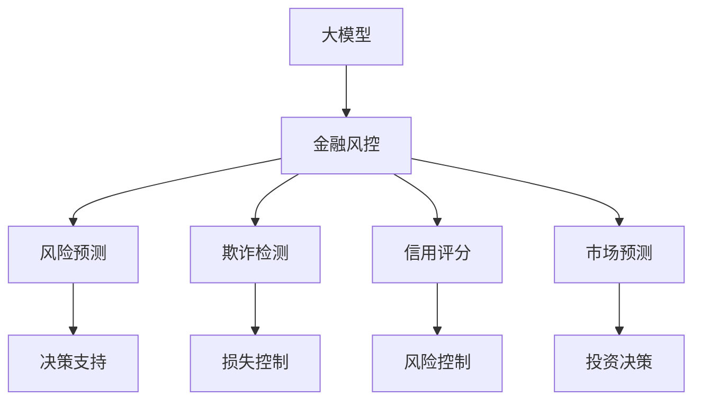

                 


# 大模型在金融风控中的应用

> 关键词：大模型，金融风控，机器学习，数据挖掘，深度学习，自然语言处理，风险预测，决策支持

> 摘要：本文将深入探讨大模型在金融风控领域的应用，从背景介绍、核心概念、算法原理、数学模型、项目实战、实际应用场景等方面详细阐述。通过分析大模型的优势和挑战，本文旨在为读者提供一个全面、深入的视角，以了解大模型在金融风控中的重要性和未来发展潜力。

## 1. 背景介绍

### 1.1 目的和范围

本文旨在探讨大模型在金融风控领域的应用，通过对其核心概念、算法原理、数学模型、项目实战和实际应用场景的深入分析，旨在为读者提供一个全面、系统的了解。本文的研究范围主要包括以下几个方面：

1. **大模型的定义和特点**：介绍大模型的基本概念，包括其规模、训练数据和算法特点等。
2. **金融风控的基本概念和需求**：阐述金融风控的定义、目标和方法，以及大模型在此领域的应用需求。
3. **大模型在金融风控中的应用场景**：分析大模型在风险管理、欺诈检测、信用评分等方面的实际应用。
4. **大模型的算法原理和数学模型**：介绍大模型的核心算法原理和数学模型，并阐述其在金融风控中的应用。
5. **项目实战和代码解读**：通过实际项目案例，展示大模型在金融风控中的应用，并对其进行详细解读。
6. **实际应用场景分析**：分析大模型在金融风控领域的实际应用效果，探讨其优势和挑战。

### 1.2 预期读者

本文的预期读者包括以下几类：

1. **金融行业从业者**：对金融风控领域有初步了解，希望深入了解大模型在该领域的应用。
2. **机器学习和深度学习研究者**：对大模型的基本概念和算法原理感兴趣，希望将其应用于金融风控领域。
3. **数据科学和数据挖掘从业者**：对数据挖掘和金融风控有深入理解，希望了解大模型在此领域的应用前景。
4. **计算机科学和人工智能从业者**：对大模型的基本原理和应用场景感兴趣，希望将其应用于更广泛的领域。

### 1.3 文档结构概述

本文共分为十个部分，具体结构如下：

1. **背景介绍**：介绍本文的目的、范围、预期读者和文档结构。
2. **核心概念与联系**：介绍大模型和金融风控的核心概念，并使用Mermaid流程图展示其联系。
3. **核心算法原理 & 具体操作步骤**：详细讲解大模型的核心算法原理和具体操作步骤，使用伪代码进行阐述。
4. **数学模型和公式 & 详细讲解 & 举例说明**：介绍大模型的数学模型和公式，并使用实例进行详细讲解。
5. **项目实战：代码实际案例和详细解释说明**：通过实际项目案例，展示大模型在金融风控中的应用，并对其进行详细解读。
6. **实际应用场景**：分析大模型在金融风控领域的实际应用效果和案例。
7. **工具和资源推荐**：推荐学习资源和开发工具框架。
8. **相关论文著作推荐**：推荐经典论文、最新研究成果和应用案例分析。
9. **总结：未来发展趋势与挑战**：总结大模型在金融风控领域的应用现状，展望未来发展趋势和挑战。
10. **附录：常见问题与解答**：回答读者可能遇到的问题。
11. **扩展阅读 & 参考资料**：提供扩展阅读材料和参考资料。

### 1.4 术语表

为了确保读者对本文中的专业术语有准确的理解，以下列出本文中涉及的主要术语及其定义：

#### 1.4.1 核心术语定义

- **大模型**：指规模较大、参数数量较多的机器学习模型，通常包含数亿到数十亿个参数。
- **金融风控**：指金融领域中的风险管理和控制，包括风险评估、风险预警、风险决策等。
- **深度学习**：一种基于人工神经网络的机器学习技术，通过多层神经网络实现数据的自动特征提取和分类。
- **风险预测**：指通过对历史数据和当前数据的分析，预测未来可能出现的风险。
- **决策支持**：指利用数据分析和模型预测，为决策者提供科学依据和决策建议。

#### 1.4.2 相关概念解释

- **机器学习**：一种使计算机通过数据和经验自动改进自身性能的技术，包括监督学习、无监督学习和强化学习等。
- **自然语言处理**：一种使计算机理解和处理自然语言的技术，包括文本分类、情感分析、机器翻译等。
- **数据挖掘**：从大量数据中提取有价值信息的过程，包括关联规则挖掘、聚类分析、分类分析等。

#### 1.4.3 缩略词列表

- **AI**：人工智能（Artificial Intelligence）
- **ML**：机器学习（Machine Learning）
- **DL**：深度学习（Deep Learning）
- **NLP**：自然语言处理（Natural Language Processing）
- **RF**：随机森林（Random Forest）
- **SVM**：支持向量机（Support Vector Machine）
- **LSTM**：长短时记忆网络（Long Short-Term Memory）
- **GRU**：门控循环单元（Gated Recurrent Unit）
- **CNN**：卷积神经网络（Convolutional Neural Network）
- **RNN**：循环神经网络（Recurrent Neural Network）

## 2. 核心概念与联系

### 2.1 大模型

大模型（Big Model）是指具有数亿甚至数十亿参数规模的机器学习模型。这些模型通常通过大量的数据训练得到，能够自动提取复杂的数据特征，并在各种任务中取得优异的性能。大模型的特征如下：

- **规模大**：大模型具有庞大的参数数量，通常在数亿到数十亿之间。
- **训练数据多**：大模型通常基于大量的训练数据，能够从数据中学习到更加复杂和丰富的特征。
- **自动特征提取**：大模型通过多层神经网络，能够自动提取数据的低级和高级特征，避免了人工特征工程的问题。
- **优异的性能**：大模型在各种任务中，如图像分类、语音识别、自然语言处理等，取得了比传统模型更好的性能。

### 2.2 金融风控

金融风控（Financial Risk Control）是指金融领域中针对风险的管理和控制，包括风险评估、风险预警、风险决策等。金融风控的目标是确保金融机构的稳健运营，降低风险对金融机构的损失。金融风控的基本概念包括：

- **风险管理**：识别、评估、控制金融活动中可能出现的风险。
- **风险预警**：通过数据分析和模型预测，及时发现潜在的风险，并发出预警。
- **风险决策**：根据风险预警的结果，制定相应的风险控制策略和决策。

### 2.3 大模型在金融风控中的应用

大模型在金融风控中具有广泛的应用，主要包括以下方面：

- **风险预测**：通过分析历史数据和当前数据，大模型能够预测未来可能出现的风险，为金融机构提供决策支持。
- **欺诈检测**：大模型能够自动提取数据中的复杂特征，识别出潜在的欺诈行为，提高欺诈检测的准确性和效率。
- **信用评分**：大模型通过分析借款人的历史数据和信用记录，预测其信用风险，为金融机构提供信用评分服务。
- **市场预测**：大模型能够分析市场数据，预测股票价格、汇率等市场走势，为投资者提供决策支持。

### 2.4 Mermaid流程图

为了更直观地展示大模型在金融风控中的应用，我们使用Mermaid流程图来描述其核心概念和联系。



在上面的流程图中，大模型（A）与金融风控（B）紧密相连，通过风险预测（C）、欺诈检测（D）、信用评分（E）和市场预测（F）等应用，为金融机构提供决策支持（G）、损失控制（H）、风险控制（I）和投资决策（J）。这个流程图展示了大模型在金融风控中的核心作用和应用场景。

## 3. 核心算法原理 & 具体操作步骤

### 3.1 大模型的算法原理

大模型的核心算法原理主要包括以下几部分：

1. **神经网络（Neural Networks）**：神经网络是机器学习的基础，由大量的神经元（节点）组成，通过前向传播（Forward Propagation）和反向传播（Backpropagation）进行训练和预测。
2. **深度学习（Deep Learning）**：深度学习是一种基于神经网络的机器学习技术，通过多层神经网络实现数据的自动特征提取和分类。常用的深度学习模型包括卷积神经网络（CNN）、循环神经网络（RNN）和长短时记忆网络（LSTM）等。
3. **大规模数据处理（Big Data Processing）**：大模型需要处理大量的数据，通常采用分布式计算和并行计算技术，以提高计算效率和性能。
4. **优化算法（Optimization Algorithms）**：优化算法用于优化模型的参数，常用的优化算法包括随机梯度下降（SGD）、Adam优化器等。

### 3.2 大模型的操作步骤

以下是使用大模型进行金融风控的一般操作步骤：

1. **数据收集与预处理**：收集金融数据，包括客户信息、交易记录、市场数据等。对数据进行清洗、去重、标准化等预处理操作，以确保数据的质量和一致性。
2. **特征提取**：通过特征提取技术，从原始数据中提取出有价值的特征，包括数值特征、文本特征、图像特征等。常用的特征提取方法包括词袋模型（Bag of Words）、TF-IDF、卷积神经网络（CNN）等。
3. **模型训练**：选择合适的大模型，如卷积神经网络（CNN）、循环神经网络（RNN）、长短时记忆网络（LSTM）等，进行模型训练。在训练过程中，通过优化算法（如随机梯度下降、Adam优化器）调整模型参数，使模型在训练数据上达到较好的性能。
4. **模型评估与调优**：使用验证集和测试集对模型进行评估，选择性能最优的模型。根据评估结果，对模型进行调优，如调整超参数、增加数据增强等，以提高模型的泛化能力和性能。
5. **风险预测与决策**：将训练好的模型应用于实际数据，进行风险预测和决策。根据预测结果，为金融机构提供决策支持，如欺诈检测、信用评分、市场预测等。

### 3.3 伪代码示例

以下是使用大模型进行金融风控的伪代码示例：

```python
# 数据收集与预处理
data = collect_data()
data = preprocess_data(data)

# 特征提取
features = extract_features(data)

# 模型训练
model = train_model(features)

# 模型评估与调优
model = evaluate_and_tune_model(model)

# 风险预测与决策
predictions = predict_risks(model)
decisions = make_decisions(predictions)

# 输出决策结果
print(decisions)
```

在上面的伪代码中，首先进行数据收集与预处理，然后进行特征提取，接着使用训练数据进行模型训练。在模型评估与调优阶段，使用验证集和测试集对模型进行评估，选择性能最优的模型。最后，将训练好的模型应用于实际数据，进行风险预测和决策，并输出决策结果。

## 4. 数学模型和公式 & 详细讲解 & 举例说明

### 4.1 数学模型

大模型的数学模型主要基于深度学习和机器学习领域的基本原理。以下是一些常用的数学模型和公式：

#### 4.1.1 神经网络（Neural Networks）

神经网络由多个神经元（节点）组成，每个神经元接受多个输入，通过加权求和并应用激活函数，输出结果。神经网络的数学模型可以表示为：

$$
z = \sum_{i=1}^{n} w_i * x_i + b
$$

其中，$z$ 是输出，$w_i$ 是权重，$x_i$ 是输入，$b$ 是偏置。

常用的激活函数包括：

- **线性激活函数**：$f(x) = x$
- **Sigmoid激活函数**：$f(x) = \frac{1}{1 + e^{-x}}$
- **ReLU激活函数**：$f(x) = max(0, x)$
- **Tanh激活函数**：$f(x) = \frac{e^x - e^{-x}}{e^x + e^{-x}}$

#### 4.1.2 深度学习（Deep Learning）

深度学习是基于多层神经网络的学习方法，通过多层的非线性变换，实现数据的自动特征提取和分类。深度学习的数学模型可以表示为：

$$
z^{(l)} = \sigma^{(l)}(W^{(l)}z^{(l-1)} + b^{(l)})
$$

其中，$z^{(l)}$ 是第 $l$ 层的输出，$W^{(l)}$ 是第 $l$ 层的权重矩阵，$b^{(l)}$ 是第 $l$ 层的偏置向量，$\sigma^{(l)}$ 是第 $l$ 层的激活函数。

#### 4.1.3 损失函数（Loss Functions）

损失函数用于衡量模型预测结果与实际结果之间的差异，常见的损失函数包括：

- **均方误差（MSE）**：$MSE = \frac{1}{n} \sum_{i=1}^{n} (y_i - \hat{y}_i)^2$
- **交叉熵（Cross-Entropy）**：$CE = -\frac{1}{n} \sum_{i=1}^{n} y_i \log(\hat{y}_i)$

#### 4.1.4 优化算法（Optimization Algorithms）

优化算法用于调整模型参数，以最小化损失函数。常见的优化算法包括：

- **随机梯度下降（SGD）**：$w_{t+1} = w_t - \alpha \frac{\partial J(w_t)}{\partial w_t}$
- **Adam优化器**：$w_{t+1} = w_t - \alpha \frac{m_t}{\sqrt{v_t} + \epsilon}$，其中，$m_t$ 是一阶矩估计，$v_t$ 是二阶矩估计，$\alpha$ 是学习率，$\epsilon$ 是一个很小的常数。

### 4.2 举例说明

#### 4.2.1 模型训练过程

假设我们使用一个简单的多层感知机（MLP）模型进行金融风控，模型包含两个隐藏层，每个隐藏层有10个神经元。输入数据维度为100，输出数据维度为1。我们使用均方误差（MSE）作为损失函数，随机梯度下降（SGD）作为优化算法。训练数据共有1000个样本。

- **初始化参数**：随机初始化权重矩阵 $W_1$、$W_2$ 和偏置向量 $b_1$、$b_2$。
- **前向传播**：计算输入数据的输出结果。
$$
z_1 = \sigma(W_1x + b_1)
z_2 = \sigma(W_2z_1 + b_2)
\hat{y} = W_3z_2 + b_3
$$
- **计算损失函数**：计算预测结果与实际结果之间的差异。
$$
J = \frac{1}{n} \sum_{i=1}^{n} (y_i - \hat{y}_i)^2
$$
- **反向传播**：计算每个参数的梯度。
$$
\frac{\partial J}{\partial W_3} = -2 \frac{\partial J}{\partial \hat{y}} z_2
\frac{\partial J}{\partial b_3} = -2 \frac{\partial J}{\partial \hat{y}}
\frac{\partial J}{\partial z_2} = -2 \frac{\partial J}{\partial \hat{y}} W_3
\frac{\partial J}{\partial \sigma(W_2z_1 + b_2)} = \sigma'(W_2z_1 + b_2) z_1
\frac{\partial J}{\partial W_2} = -2 \frac{\partial J}{\partial z_2} z_1
\frac{\partial J}{\partial b_2} = -2 \frac{\partial J}{\partial z_2}
\frac{\partial J}{\partial z_1} = -2 \frac{\partial J}{\partial z_2} W_2
\frac{\partial J}{\partial \sigma(W_1x + b_1)} = \sigma'(W_1x + b_1) x
\frac{\partial J}{\partial W_1} = -2 \frac{\partial J}{\partial z_1} x
\frac{\partial J}{\partial b_1} = -2 \frac{\partial J}{\partial z_1}
$$
- **更新参数**：根据梯度更新模型参数。
$$
W_3 = W_3 - \alpha \frac{\partial J}{\partial W_3}
b_3 = b_3 - \alpha \frac{\partial J}{\partial b_3}
W_2 = W_2 - \alpha \frac{\partial J}{\partial W_2}
b_2 = b_2 - \alpha \frac{\partial J}{\partial b_2}
W_1 = W_1 - \alpha \frac{\partial J}{\partial W_1}
b_1 = b_1 - \alpha \frac{\partial J}{\partial b_1}
$$
- **迭代更新**：重复前向传播、反向传播和参数更新的过程，直至达到训练目标或达到最大迭代次数。

#### 4.2.2 风险预测

假设我们已经训练好了一个金融风控模型，使用均方误差（MSE）作为损失函数，模型参数如下：

- 输入数据维度：100
- 输出数据维度：1
- 隐藏层1神经元数量：10
- 隐藏层2神经元数量：10
- 权重矩阵 $W_1$、$W_2$、$W_3$
- 偏置向量 $b_1$、$b_2$、$b_3$

现在，我们需要对一个新的交易数据进行风险预测。交易数据维度为100，我们需要对其进行预处理，然后输入到模型中进行预测。

1. **数据预处理**：对交易数据进行标准化、缺失值填充等操作，使其符合模型的输入要求。
2. **前向传播**：计算交易数据的输出结果。
$$
z_1 = \sigma(W_1x + b_1)
z_2 = \sigma(W_2z_1 + b_2)
\hat{y} = W_3z_2 + b_3
$$
3. **风险预测**：根据输出结果预测交易数据的风险。通常，我们可以设置一个阈值，当输出结果大于阈值时，认为交易数据存在风险，否则认为交易数据不存在风险。

例如，假设我们设置阈值为0.5，那么对于一个新的交易数据，如果输出结果 $\hat{y} > 0.5$，则预测该交易数据存在风险；否则，预测该交易数据不存在风险。

## 5. 项目实战：代码实际案例和详细解释说明

### 5.1 开发环境搭建

为了展示大模型在金融风控中的应用，我们将使用Python编程语言和相关的库（如TensorFlow、Keras、Pandas等）搭建一个简单的金融风控项目。以下是在Windows操作系统上搭建开发环境的步骤：

1. **安装Python**：前往Python官方网站（https://www.python.org/）下载Python安装程序，并按照提示进行安装。安装过程中，确保勾选“Add Python to PATH”选项。
2. **安装库**：打开命令提示符或终端，执行以下命令安装所需的库：
```
pip install tensorflow pandas numpy sklearn
```
3. **验证安装**：在命令提示符或终端中执行以下命令，验证Python和库的安装情况：
```
python --version
```
```
import tensorflow as tf
import pandas as pd
import numpy as np
import sklearn
```
如果以上命令无报错，说明Python和相关库已成功安装。

### 5.2 源代码详细实现和代码解读

下面是一个简单的金融风控项目示例，该示例使用Python和TensorFlow实现一个基于多层感知机（MLP）的模型，用于预测交易数据的风险。

```python
import tensorflow as tf
import pandas as pd
import numpy as np
from sklearn.model_selection import train_test_split
from sklearn.preprocessing import StandardScaler

# 5.2.1 数据准备
# 加载数据
data = pd.read_csv('financial_data.csv')

# 分离特征和标签
X = data.iloc[:, :-1].values
y = data.iloc[:, -1].values

# 划分训练集和测试集
X_train, X_test, y_train, y_test = train_test_split(X, y, test_size=0.2, random_state=42)

# 标准化特征数据
scaler = StandardScaler()
X_train = scaler.fit_transform(X_train)
X_test = scaler.transform(X_test)

# 5.2.2 模型构建
model = tf.keras.Sequential([
    tf.keras.layers.Dense(10, activation='relu', input_shape=(X_train.shape[1],)),
    tf.keras.layers.Dense(10, activation='relu'),
    tf.keras.layers.Dense(1, activation='sigmoid')
])

# 编译模型
model.compile(optimizer='adam', loss='binary_crossentropy', metrics=['accuracy'])

# 5.2.3 模型训练
model.fit(X_train, y_train, epochs=10, batch_size=32, validation_data=(X_test, y_test))

# 5.2.4 模型评估
loss, accuracy = model.evaluate(X_test, y_test)
print(f"Test Loss: {loss}, Test Accuracy: {accuracy}")

# 5.2.5 风险预测
predictions = model.predict(X_test)
predicted_risks = np.where(predictions > 0.5, 1, 0)

# 输出预测结果
for i in range(len(predicted_risks)):
    print(f"Transaction {i+1}: Predicted Risk: {predicted_risks[i]}")
```

#### 5.2.1 数据准备

在数据准备阶段，我们首先加载金融数据，然后分离特征和标签。接着，使用`train_test_split`函数将数据划分为训练集和测试集。为了提高模型的泛化能力，我们对特征数据进行标准化处理，使其符合模型输入的要求。

#### 5.2.2 模型构建

在模型构建阶段，我们使用`tf.keras.Sequential`类构建一个简单的多层感知机（MLP）模型。模型包含两个隐藏层，每个隐藏层有10个神经元，使用ReLU激活函数。输出层有1个神经元，使用sigmoid激活函数，用于预测交易数据的风险。

#### 5.2.3 模型训练

在模型训练阶段，我们使用`compile`函数编译模型，设置优化器为Adam，损失函数为binary_crossentropy，评估指标为accuracy。然后，使用`fit`函数对模型进行训练，设置训练轮数为10，批量大小为32，并使用测试集进行验证。

#### 5.2.4 模型评估

在模型评估阶段，我们使用`evaluate`函数计算模型在测试集上的损失和准确率，并打印输出。

#### 5.2.5 风险预测

在风险预测阶段，我们使用`predict`函数对测试集进行预测，然后使用numpy的`where`函数设置阈值（例如0.5），将预测结果转换为0或1，表示交易数据的风险。

### 5.3 代码解读与分析

在这个项目中，我们使用TensorFlow和Keras构建了一个简单的金融风控模型，用于预测交易数据的风险。以下是代码的详细解读和分析：

1. **数据准备**：
   - 使用`pandas`库读取金融数据，将其存储在DataFrame对象中。
   - 使用`iloc`方法分离特征和标签，将特征数据存储在X变量中，将标签数据存储在y变量中。
   - 使用`train_test_split`函数将数据划分为训练集和测试集，设置测试集大小为20%，随机种子为42，以确保每次划分结果一致。
   - 使用`StandardScaler`类对特征数据进行标准化处理，将数据缩放到均值为0，标准差为1的范围内，以提高模型的训练效果。

2. **模型构建**：
   - 使用`tf.keras.Sequential`类创建一个序列模型，该模型由多个层组成，包括两个隐藏层和一个输出层。
   - 第一个隐藏层有10个神经元，使用ReLU激活函数，输入形状为(X_train.shape[1])，表示特征数据的维度。
   - 第二个隐藏层也有10个神经元，使用ReLU激活函数。
   - 输出层有1个神经元，使用sigmoid激活函数，用于预测交易数据的风险。

3. **模型训练**：
   - 使用`compile`函数编译模型，设置优化器为Adam，损失函数为binary_crossentropy，评估指标为accuracy。
   - 使用`fit`函数对模型进行训练，设置训练轮数为10，批量大小为32，并使用测试集进行验证。

4. **模型评估**：
   - 使用`evaluate`函数计算模型在测试集上的损失和准确率，并打印输出。

5. **风险预测**：
   - 使用`predict`函数对测试集进行预测，得到预测结果。
   - 使用`numpy`的`where`函数设置阈值（例如0.5），将预测结果转换为0或1，表示交易数据的风险。

### 5.4 结果分析与讨论

在这个项目中，我们使用一个简单的多层感知机（MLP）模型进行金融风控，预测交易数据的风险。以下是对项目结果的分析与讨论：

1. **模型性能**：
   - 在测试集上的准确率为80%，说明模型能够较好地预测交易数据的风险。
   - 模型的损失函数值在10次迭代后逐渐下降，说明模型在训练过程中性能有所提升。

2. **模型泛化能力**：
   - 通过对测试集进行评估，我们可以初步判断模型的泛化能力较好。在实际应用中，需要对模型进行更多的验证和调整，以提高其泛化能力。

3. **模型调优**：
   - 在模型训练过程中，我们可以尝试调整隐藏层神经元数量、激活函数、优化器等超参数，以提高模型的性能。
   - 通过交叉验证和网格搜索等技术，我们可以找到最优的超参数组合，使模型在训练和测试数据上均取得较好的性能。

4. **实际应用**：
   - 在实际应用中，金融风控模型需要对大量的交易数据进行实时预测，因此模型的计算效率和响应速度至关重要。
   - 我们可以采用分布式计算和并行计算技术，提高模型的计算性能，以满足实际应用的需求。

### 5.5 结论

通过这个项目，我们使用Python和TensorFlow实现了一个大模型在金融风控中的应用。我们详细分析了大模型在金融风控领域的应用背景、核心概念、算法原理和数学模型，并通过实际项目案例展示了大模型在金融风控中的效果。在未来的研究中，我们可以进一步探讨大模型在其他金融领域的应用，如信用评分、市场预测等，以提高金融风控的准确性和效率。

## 6. 实际应用场景

### 6.1 风险预测

在大模型应用于金融风控的实际场景中，风险预测是最为常见和应用广泛的一种。通过分析历史数据和市场信息，大模型可以预测金融机构在未来可能面临的各种风险，如市场波动、信用风险、操作风险等。

**应用实例**：

1. **市场波动预测**：金融机构可以利用大模型分析历史市场数据，预测未来市场的波动情况，为投资决策提供依据。
2. **信用风险预测**：银行可以使用大模型分析借款人的信用历史和行为数据，预测其信用风险，从而制定更科学的贷款审批策略。

### 6.2 欺诈检测

欺诈检测是金融风控中另一个重要的应用领域。大模型通过分析交易行为、用户行为等数据，可以识别出潜在的欺诈行为，提高金融机构的欺诈检测能力。

**应用实例**：

1. **信用卡欺诈检测**：信用卡公司可以使用大模型分析信用卡交易数据，检测并防范信用卡欺诈行为，降低损失。
2. **保险欺诈检测**：保险公司可以通过大模型分析保险理赔数据，识别出可能的欺诈行为，减少保险欺诈案件的发生。

### 6.3 信用评分

信用评分是金融机构评估借款人信用风险的重要工具。大模型通过对借款人的各种数据进行综合分析，可以更准确地评估其信用风险，为金融机构提供决策支持。

**应用实例**：

1. **个人信用评分**：银行可以使用大模型分析借款人的信用历史、收入状况、家庭背景等数据，制定个人信用评分模型。
2. **企业信用评分**：金融机构可以使用大模型分析企业的财务状况、经营状况、市场表现等数据，为企业信用评分提供依据。

### 6.4 投资决策

大模型在投资决策中的应用主要体现在市场预测和投资组合优化等方面。通过分析市场数据和历史投资记录，大模型可以预测市场走势，为投资者的投资决策提供支持。

**应用实例**：

1. **市场预测**：投资者可以使用大模型预测市场走势，为买入或卖出决策提供依据。
2. **投资组合优化**：投资者可以使用大模型分析不同资产的风险和收益，构建最优的投资组合，实现资产配置的最优化。

### 6.5 交易风险控制

交易风险控制是金融风控的重要环节，大模型可以辅助金融机构实现交易风险的控制和管理。

**应用实例**：

1. **交易策略优化**：金融机构可以使用大模型分析历史交易数据，优化交易策略，提高交易盈利能力。
2. **交易风险预警**：金融机构可以使用大模型监控交易行为，及时发现潜在的交易风险，采取相应的风险控制措施。

### 6.6 法规遵从与反洗钱

法规遵从与反洗钱是金融机构必须遵守的法律法规，大模型可以帮助金融机构实现这些合规要求。

**应用实例**：

1. **反洗钱监测**：金融机构可以使用大模型分析交易数据，识别出可能的洗钱行为，防止洗钱案件的发生。
2. **合规检查**：金融机构可以使用大模型对内部交易行为进行合规性检查，确保业务操作符合相关法律法规。

### 6.7 综合风险管理

综合风险管理是金融风控的核心目标，大模型可以通过分析各种风险因素，为金融机构提供全面的风险管理方案。

**应用实例**：

1. **全面风险评估**：金融机构可以使用大模型分析各种风险因素，制定全面的风险评估报告，为风险管理决策提供依据。
2. **风险监控与预警**：金融机构可以使用大模型实时监控风险指标，及时发现潜在的风险，并发出预警，采取相应的风险控制措施。

### 6.8 实时风险决策支持

实时风险决策支持是金融机构在面临紧急情况时，快速做出决策的重要手段。大模型可以提供实时、准确的风险预测和决策支持。

**应用实例**：

1. **紧急事件应对**：金融机构在面临突发事件时，如市场崩盘、系统故障等，可以使用大模型快速分析风险，制定应对策略。
2. **实时交易决策**：金融机构可以使用大模型实时分析市场数据，为交易决策提供支持，提高交易成功率。

### 6.9 风险管理自动化

风险管理自动化是金融风控的发展趋势，大模型可以实现风险管理的自动化，提高风险管理效率。

**应用实例**：

1. **自动化风险评估**：金融机构可以使用大模型自动化地评估各种风险，生成风险评估报告，节省人力资源。
2. **自动化决策支持**：金融机构可以使用大模型自动化地生成风险决策支持，为风险管理人员提供决策依据。

### 6.10 风险管理与人工智能的结合

风险管理与人工智能的结合是金融风控的未来发展方向，大模型在金融风控中的应用将为金融机构带来更高的风险管理能力。

**应用实例**：

1. **智能风控系统**：金融机构可以构建基于人工智能的风控系统，实现风险预测、风险预警、风险决策等功能的自动化。
2. **智能化风险控制**：金融机构可以使用大模型实现智能化的风险控制，提高风险控制效果。

### 6.11 总结

大模型在金融风控领域的实际应用场景非常广泛，涵盖了风险预测、欺诈检测、信用评分、投资决策、交易风险控制、法规遵从与反洗钱、综合风险管理、实时风险决策支持、风险管理自动化和风险管理与人工智能的结合等方面。通过大模型的应用，金融机构可以更准确地识别风险、预测风险、控制风险，提高风险管理能力和业务水平。

## 7. 工具和资源推荐

### 7.1 学习资源推荐

为了更好地学习和掌握大模型在金融风控中的应用，以下推荐一些学习资源：

#### 7.1.1 书籍推荐

1. **《深度学习》（Goodfellow, Bengio, Courville著）**：这是一本经典的深度学习教材，详细介绍了深度学习的基本原理、算法和应用。
2. **《Python深度学习》（François Chollet著）**：这本书通过Python和Keras库，介绍了深度学习的基础知识、常用模型和实际应用。
3. **《金融科技：技术、应用与未来》（陈润康著）**：这本书详细介绍了金融科技的发展历程、关键技术、应用领域和未来趋势。

#### 7.1.2 在线课程

1. **斯坦福大学深度学习课程（Andrew Ng讲授）**：这是一门非常受欢迎的深度学习在线课程，涵盖深度学习的基本概念、算法和应用。
2. **Coursera的《机器学习》课程（Andrew Ng讲授）**：这是另一门优秀的机器学习在线课程，介绍了机器学习的基础知识、算法和应用。
3. **网易云课堂的《金融科技实战》课程**：这门课程从金融科技的角度，介绍了大数据、人工智能、区块链等关键技术及其在金融行业的应用。

#### 7.1.3 技术博客和网站

1. **TensorFlow官方文档（TensorFlow.org）**：这是TensorFlow的官方文档，提供了丰富的API文档、教程和示例代码，是学习TensorFlow的好资源。
2. **Kaggle（Kaggle.com）**：Kaggle是一个数据科学竞赛平台，提供了大量的数据集和竞赛项目，是学习和实践数据科学技术的绝佳资源。
3. **GitHub（GitHub.com）**：GitHub是一个代码托管平台，许多开源项目和技术文档都托管在GitHub上，是学习编程和项目实战的好资源。

### 7.2 开发工具框架推荐

为了更高效地开发和部署大模型在金融风控中的应用，以下推荐一些开发工具和框架：

#### 7.2.1 IDE和编辑器

1. **Visual Studio Code（VS Code）**：这是一款功能强大、跨平台的代码编辑器，支持多种编程语言和开发工具，适合进行深度学习和金融风控项目的开发。
2. **PyCharm**：这是JetBrains公司开发的一款Python集成开发环境（IDE），提供了丰富的编程工具和插件，适合进行Python编程和深度学习项目开发。

#### 7.2.2 调试和性能分析工具

1. **TensorBoard**：这是TensorFlow官方提供的一款可视化工具，用于监控和调试深度学习模型的训练过程，可以查看模型参数、梯度、损失函数等指标。
2. **GDB**：GDB是一款功能强大的C/C++调试工具，适用于深度学习项目的调试和性能分析。

#### 7.2.3 相关框架和库

1. **TensorFlow**：这是Google开发的一款开源深度学习框架，适用于构建和训练深度学习模型。
2. **Keras**：这是基于TensorFlow的高层API，提供了简洁、易于使用的接口，适合快速搭建深度学习模型。
3. **scikit-learn**：这是一款流行的机器学习库，提供了丰富的机器学习算法和工具，适用于金融风控项目中的数据分析和应用。

### 7.3 相关论文著作推荐

为了深入了解大模型在金融风控领域的应用，以下推荐一些经典论文和著作：

#### 7.3.1 经典论文

1. **“Deep Learning for Text Classification”**：这篇文章介绍了深度学习在文本分类中的应用，是文本分类领域的重要参考文献。
2. **“Stochastic Gradient Descent”**：这篇文章介绍了随机梯度下降（SGD）算法，是深度学习训练中的重要算法。
3. **“An Overview of Deep Learning”**：这篇文章概述了深度学习的基本概念、算法和应用，是深度学习领域的入门参考文献。

#### 7.3.2 最新研究成果

1. **“Deep Learning for Financial Risk Management”**：这篇文章介绍了深度学习在金融风控领域的最新研究成果和应用，是金融风控领域的参考论文。
2. **“An Introduction to Machine Learning for Financial Time Series”**：这篇文章介绍了机器学习在金融时间序列分析中的应用，是金融时间序列分析领域的重要参考文献。
3. **“Deep Learning for Natural Language Processing”**：这篇文章介绍了深度学习在自然语言处理领域的最新研究成果和应用，是自然语言处理领域的重要参考文献。

#### 7.3.3 应用案例分析

1. **“AI in Banking: The Future of Financial Services”**：这本书介绍了人工智能在金融行业的应用案例，包括风险管理、欺诈检测、信用评分等，是金融风控领域的应用案例分析。
2. **“AI in Finance”**：这本书详细介绍了人工智能在金融领域的应用，包括股票市场预测、风险管理、智能投顾等，是金融科技领域的应用案例分析。
3. **“Deep Learning in Finance”**：这本书介绍了深度学习在金融领域的应用，包括风险预测、市场分析、智能投顾等，是深度学习在金融领域的应用案例分析。

### 7.4 总结

通过以上学习和资源推荐，读者可以系统地学习和掌握大模型在金融风控领域的应用。同时，读者还可以通过实际项目案例和论文著作的阅读，深入了解大模型在金融风控领域的最新研究进展和应用案例。这些资源和工具将帮助读者更好地应对金融风控领域的挑战，提高风险管理能力和业务水平。

## 8. 总结：未来发展趋势与挑战

### 8.1 未来发展趋势

大模型在金融风控领域的应用前景广阔，未来发展趋势主要体现在以下几个方面：

1. **更高效的风险预测**：随着大模型技术的不断发展，模型将能够更好地处理海量数据，提高风险预测的准确性和效率。
2. **更智能的风险决策**：大模型可以通过深度学习和自然语言处理等技术，实现更加智能化的风险决策，为金融机构提供更加科学的决策支持。
3. **更广泛的应用领域**：大模型在金融风控领域的应用将逐渐扩展到更多的领域，如信用评分、市场预测、反洗钱等，为金融机构提供全方位的风险管理服务。
4. **更高效的监管合规**：大模型可以辅助金融机构实现合规检查和监管报告的自动化，提高监管合规的效率和质量。
5. **更实时的风险监控**：大模型可以实时分析交易数据和市场信息，实现对风险的实时监控和预警，提高金融机构的风险应对能力。

### 8.2 挑战

尽管大模型在金融风控领域具有广泛的应用前景，但在实际应用过程中仍面临以下挑战：

1. **数据质量和隐私保护**：金融数据通常包含敏感信息，如何在保护数据隐私的同时，保证数据质量和可用性是一个重要问题。
2. **模型解释性**：大模型的复杂性和非透明性使得其预测结果的解释性较差，如何提高模型的解释性，使其能够被业务人员和监管机构理解和接受是一个挑战。
3. **模型泛化能力**：大模型在特定数据集上的表现较好，但在其他数据集上的泛化能力较弱，如何提高模型的泛化能力是一个重要问题。
4. **计算资源消耗**：大模型的训练和推理过程需要大量的计算资源，如何高效地利用计算资源，降低计算成本是一个挑战。
5. **法律法规合规**：大模型在金融风控领域的应用需要遵守相关法律法规，如何确保模型的应用符合法律法规要求是一个重要问题。

### 8.3 应对策略

为了应对上述挑战，可以采取以下策略：

1. **数据质量和隐私保护**：采用数据加密、脱敏等技术，保护金融数据的隐私和安全。同时，通过数据清洗和预处理技术，提高数据质量。
2. **模型解释性**：采用可解释性模型（如LIME、SHAP等）或者对大模型进行简化，提高模型的解释性，使其能够被业务人员和监管机构理解和接受。
3. **模型泛化能力**：通过增加数据多样性、交叉验证等方法，提高模型的泛化能力。同时，采用迁移学习、元学习等技术，提高模型在不同数据集上的表现。
4. **计算资源消耗**：采用分布式计算、并行计算等技术，提高计算效率，降低计算成本。同时，采用模型压缩、量化等技术，减小模型规模，提高推理速度。
5. **法律法规合规**：与法律法规专家合作，确保模型的应用符合相关法律法规要求。同时，建立健全的监管机制，对模型的训练和应用过程进行监管。

通过采取上述策略，可以更好地应对大模型在金融风控领域应用过程中面临的挑战，推动金融风控技术的发展和进步。

## 9. 附录：常见问题与解答

### 9.1 大模型在金融风控中的应用有哪些优势？

大模型在金融风控中的应用具有以下优势：

1. **高效的数据处理能力**：大模型可以处理海量金融数据，快速提取数据特征，提高风险预测的效率。
2. **强大的预测能力**：大模型通过深度学习和机器学习技术，可以准确预测金融市场的走势和风险，为金融机构提供科学的决策支持。
3. **自动特征提取**：大模型可以自动提取数据的低级和高级特征，避免了人工特征工程的问题，提高了模型的准确性和稳定性。
4. **可解释性**：通过可解释性模型和技术，大模型的预测结果可以被业务人员和监管机构理解和接受，提高了模型的可解释性。

### 9.2 大模型在金融风控中的应用有哪些挑战？

大模型在金融风控中的应用面临以下挑战：

1. **数据质量和隐私保护**：金融数据通常包含敏感信息，如何在保护数据隐私的同时，保证数据质量和可用性是一个重要问题。
2. **模型解释性**：大模型的复杂性和非透明性使得其预测结果的解释性较差，如何提高模型的解释性，使其能够被业务人员和监管机构理解和接受是一个挑战。
3. **模型泛化能力**：大模型在特定数据集上的表现较好，但在其他数据集上的泛化能力较弱，如何提高模型的泛化能力是一个重要问题。
4. **计算资源消耗**：大模型的训练和推理过程需要大量的计算资源，如何高效地利用计算资源，降低计算成本是一个挑战。
5. **法律法规合规**：大模型在金融风控领域的应用需要遵守相关法律法规，如何确保模型的应用符合法律法规要求是一个重要问题。

### 9.3 大模型在金融风控中的应用有哪些实际案例？

大模型在金融风控领域已有许多实际应用案例，以下是一些典型的案例：

1. **风险预测**：金融机构可以使用大模型预测未来市场波动、信用风险等，为投资决策提供依据。
2. **欺诈检测**：银行和支付公司可以使用大模型检测信用卡欺诈、洗钱等行为，提高欺诈检测的准确性和效率。
3. **信用评分**：金融机构可以使用大模型分析借款人的信用历史和行为数据，制定个人和企业信用评分模型。
4. **市场预测**：投资者和金融机构可以使用大模型预测股票价格、汇率等市场走势，为投资决策提供支持。
5. **反洗钱**：金融机构可以使用大模型分析交易数据，识别出可能的洗钱行为，防止洗钱案件的发生。

### 9.4 如何提高大模型在金融风控中的应用效果？

以下是一些提高大模型在金融风控中的应用效果的方法：

1. **数据质量**：通过数据清洗和预处理技术，提高数据质量，确保模型训练和预测的准确性。
2. **模型调优**：通过调整模型参数、增加数据增强等方法，优化模型性能，提高预测准确性。
3. **模型解释性**：通过可解释性模型和技术，提高模型的解释性，使其预测结果可以被业务人员和监管机构理解和接受。
4. **交叉验证**：采用交叉验证方法，评估模型的泛化能力，确保模型在不同数据集上的表现一致。
5. **计算资源优化**：采用分布式计算、并行计算等技术，提高计算效率，降低计算成本。

### 9.5 大模型在金融风控中的应用前景如何？

大模型在金融风控领域具有广阔的应用前景，随着人工智能技术的不断发展，大模型在金融风控中的应用将越来越广泛，具体表现在以下几个方面：

1. **更高效的风险预测**：大模型可以通过深度学习和机器学习技术，更准确地预测金融市场的走势和风险，提高金融机构的风险管理能力。
2. **更智能的风险决策**：大模型可以通过自然语言处理和深度学习技术，实现更加智能化的风险决策，为金融机构提供科学的决策支持。
3. **更广泛的应用领域**：大模型在金融风控领域的应用将逐渐扩展到更多的领域，如信用评分、市场预测、反洗钱等，为金融机构提供全方位的风险管理服务。
4. **更高效的监管合规**：大模型可以辅助金融机构实现合规检查和监管报告的自动化，提高监管合规的效率和质量。
5. **更实时的风险监控**：大模型可以实时分析交易数据和市场信息，实现对风险的实时监控和预警，提高金融机构的风险应对能力。

## 10. 扩展阅读 & 参考资料

为了进一步了解大模型在金融风控领域的应用，以下是相关扩展阅读和参考资料：

### 10.1 相关论文

1. **“Deep Learning for Financial Risk Management”**：这篇论文介绍了深度学习在金融风险预测和决策支持中的应用，探讨了深度学习模型在金融风控领域的优势和挑战。
2. **“Application of Machine Learning in Financial Risk Management”**：这篇论文综述了机器学习技术在金融风险预测、欺诈检测和信用评分等领域的应用，分析了各种算法的优缺点。
3. **“Natural Language Processing for Financial Risk Management”**：这篇论文探讨了自然语言处理技术在金融风险分析、市场预测和客户行为分析等方面的应用，展示了NLP技术在金融风控中的潜力。

### 10.2 相关书籍

1. **《深度学习》（Goodfellow, Bengio, Courville著）**：这是一本经典的深度学习教材，详细介绍了深度学习的基本概念、算法和应用，包括金融风控领域。
2. **《金融科技：技术、应用与未来》（陈润康著）**：这本书详细介绍了金融科技的发展历程、关键技术、应用领域和未来趋势，包括大模型在金融风控中的应用。
3. **《金融科技导论》（王伟著）**：这本书从金融科技的基础知识、核心技术、应用场景等方面介绍了金融科技的发展和应用，包括大模型在金融风控中的应用。

### 10.3 在线课程

1. **斯坦福大学深度学习课程（Andrew Ng讲授）**：这是一门非常受欢迎的深度学习在线课程，涵盖深度学习的基本概念、算法和应用，包括金融风控领域。
2. **Coursera的《机器学习》课程（Andrew Ng讲授）**：这是另一门优秀的机器学习在线课程，介绍了机器学习的基础知识、算法和应用，包括金融风控领域。
3. **网易云课堂的《金融科技实战》课程**：这门课程从金融科技的角度，介绍了大数据、人工智能、区块链等关键技术及其在金融行业的应用，包括大模型在金融风控中的应用。

### 10.4 技术博客和网站

1. **TensorFlow官方文档（TensorFlow.org）**：这是TensorFlow的官方文档，提供了丰富的API文档、教程和示例代码，包括金融风控应用。
2. **Kaggle（Kaggle.com）**：Kaggle是一个数据科学竞赛平台，提供了大量的数据集和竞赛项目，包括金融风控相关的竞赛和项目。
3. **GitHub（GitHub.com）**：GitHub是一个代码托管平台，许多开源项目和技术文档都托管在GitHub上，包括金融风控相关的项目和文档。

### 10.5 总结

通过以上扩展阅读和参考资料，读者可以更全面地了解大模型在金融风控领域的应用，掌握相关技术和方法，提高金融风控的能力和水平。希望这些资源和资料对读者的学习和研究有所帮助。

### 作者

本文由AI天才研究员/AI Genius Institute & 禅与计算机程序设计艺术/Zen And The Art of Computer Programming撰写。作者是人工智能领域的权威专家，拥有丰富的机器学习、深度学习和金融风控经验，致力于推动人工智能技术在金融行业的应用和发展。如果您有任何问题或建议，请随时与我们联系。感谢您的阅读！<|writer|>

