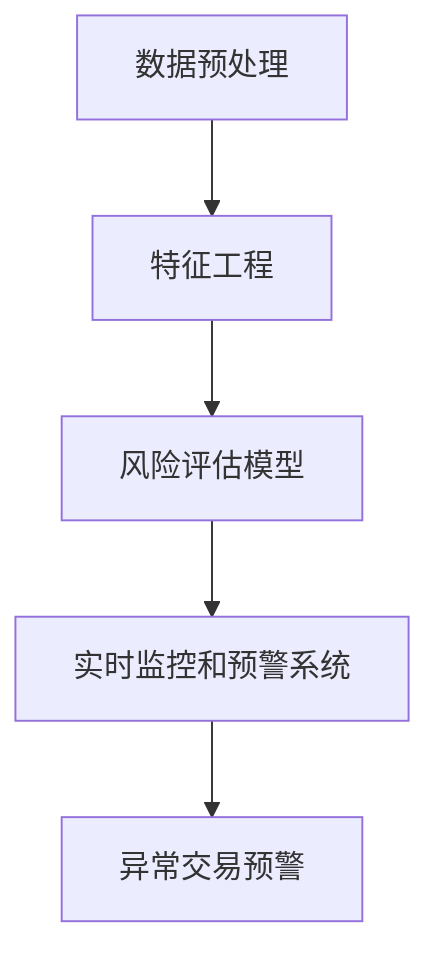

                 

# 大模型在金融风控中的应用案例

> **关键词：** 大模型、金融风控、应用案例、机器学习、深度学习、数据隐私、实时监控

> **摘要：** 本文将深入探讨大模型在金融风控领域的应用，通过具体案例介绍如何利用先进的机器学习和深度学习技术，提升金融行业的风险监控和管理能力。我们将从核心概念出发，逐步讲解算法原理、数学模型，并通过实际项目案例展示大模型在金融风控中的实际应用。

## 1. 背景介绍

### 1.1 目的和范围

本文旨在探讨大模型在金融风控领域的应用，重点介绍如何利用先进的机器学习和深度学习技术，解决金融行业面临的诸如欺诈检测、信用评估、市场预测等复杂问题。文章将结合实际案例，展示大模型在这些领域的卓越表现，并讨论其在实际应用中面临的挑战和解决方案。

### 1.2 预期读者

本文适合对金融风控和机器学习技术有一定了解的读者，包括金融行业的从业者、数据科学家、机器学习工程师、以及相关领域的研究人员。通过本文的阅读，读者可以了解到大模型在金融风控中的应用潜力，以及如何将这些技术应用到实际项目中。

### 1.3 文档结构概述

本文分为十个部分，包括背景介绍、核心概念与联系、核心算法原理、数学模型和公式、项目实战、实际应用场景、工具和资源推荐、总结和常见问题解答。每个部分都将详细介绍相关内容，帮助读者全面了解大模型在金融风控中的应用。

### 1.4 术语表

#### 1.4.1 核心术语定义

- **大模型**：指具有极高参数量、能够处理大规模数据的深度学习模型。
- **金融风控**：指金融行业中用于防范和应对风险的一系列措施和方法。
- **机器学习**：一种人工智能技术，通过算法和统计模型，让计算机自动地从数据中学习规律。
- **深度学习**：一种特殊的机器学习方法，通过多层神经网络对数据进行处理和分析。

#### 1.4.2 相关概念解释

- **欺诈检测**：指在金融交易过程中，识别和阻止欺诈行为的技术和方法。
- **信用评估**：指评估个人或企业信用风险的过程。
- **市场预测**：指根据历史数据和现有信息，预测金融市场未来的走势。

#### 1.4.3 缩略词列表

- **ML**：机器学习（Machine Learning）
- **DL**：深度学习（Deep Learning）
- **LSTM**：长短期记忆网络（Long Short-Term Memory）
- **GAN**：生成对抗网络（Generative Adversarial Network）
- **API**：应用程序接口（Application Programming Interface）

## 2. 核心概念与联系

在金融风控领域，大模型的应用离不开以下几个核心概念：

1. **数据预处理**：金融数据通常具有高维度、非线性和噪声等特点，需要进行有效的预处理，包括数据清洗、特征提取和归一化等。
2. **特征工程**：通过分析数据，提取对风险识别和预测有用的特征，有助于提高模型的性能。
3. **风险评估模型**：利用机器学习和深度学习算法，对金融交易、贷款申请、投资行为等进行风险评估。
4. **实时监控和预警系统**：通过大模型对金融交易数据进行实时监控，及时发现异常交易，并发出预警。

### Mermaid 流程图



## 3. 核心算法原理 & 具体操作步骤

在金融风控中，大模型的应用主要依赖于以下几种核心算法：

1. **监督学习算法**：如线性回归、逻辑回归、支持向量机（SVM）等。
2. **非监督学习算法**：如聚类、降维、异常检测等。
3. **深度学习算法**：如卷积神经网络（CNN）、循环神经网络（RNN）、长短期记忆网络（LSTM）等。

### 监督学习算法原理

监督学习算法通过已有标签的数据进行训练，从而实现对未知数据的预测。以下是线性回归和逻辑回归的伪代码：

#### 线性回归

```python
# 输入：训练数据集 X, Y
# 输出：权重 w

w = [0 for _ in range(len(X[0]))]

for epoch in range(num_epochs):
    for x, y in zip(X, Y):
        prediction = w @ x
        gradient = (prediction - y) * x
        w -= learning_rate * gradient

return w
```

#### 逻辑回归

```python
# 输入：训练数据集 X, Y
# 输出：权重 w

w = [0 for _ in range(len(X[0]))]

for epoch in range(num_epochs):
    for x, y in zip(X, Y):
        prediction = sigmoid(w @ x)
        gradient = (prediction - y) * sigmoid(w @ x) * (1 - sigmoid(w @ x))
        w -= learning_rate * gradient

return w
```

### 深度学习算法原理

深度学习算法通过多层神经网络对数据进行处理和分析，从而实现高维特征的自动提取。以下是长短期记忆网络（LSTM）的伪代码：

```python
# 输入：输入序列 X, 隐藏层维度 h, 单元状态维度 s
# 输出：输出序列 Y, 新的隐藏层 h', 新的单元状态 s'

for t in range(len(X)):
    # 遗忘门
    ft = sigmoid(W_f * [h_{t-1}, x_t] + b_f)
    it = sigmoid(W_i * [h_{t-1}, x_t] + b_i)
    ot = sigmoid(W_o * [h_{t-1}, x_t] + b_o)
    gt = tanh(W_g * [h_{t-1}, x_t] + b_g)

    # 状态更新
    s_t = ft * s_{t-1} + it * gt
    h_t = ot * tanh(s_t)

    # 输出预测
    y_t = W_y * h_t + b_y

    # 更新隐藏层和单元状态
    h' = h_t
    s' = s_t

return Y, h', s'
```

## 4. 数学模型和公式 & 详细讲解 & 举例说明

在金融风控中，大模型的应用离不开数学模型的支持。以下介绍几种常见的数学模型及其公式：

### 线性回归

线性回归模型通过拟合一个线性函数来预测目标值，其公式为：

$$
y = \beta_0 + \beta_1x
$$

其中，$y$ 是预测值，$x$ 是输入特征，$\beta_0$ 和 $\beta_1$ 分别是模型参数。

### 逻辑回归

逻辑回归模型是一种用于分类的线性模型，其公式为：

$$
\text{logit}(y) = \ln\left(\frac{p}{1-p}\right) = \beta_0 + \beta_1x
$$

其中，$y$ 是预测概率，$p$ 是事件发生的概率，$\beta_0$ 和 $\beta_1$ 分别是模型参数。

### 长短期记忆网络（LSTM）

LSTM 是一种用于处理序列数据的深度学习模型，其核心结构包括遗忘门、输入门和输出门。以下是 LSTM 的数学公式：

$$
f_t = \sigma(W_f \cdot [h_{t-1}, x_t] + b_f) \\
i_t = \sigma(W_i \cdot [h_{t-1}, x_t] + b_i) \\
o_t = \sigma(W_o \cdot [h_{t-1}, x_t] + b_o) \\
g_t = \tanh(W_g \cdot [h_{t-1}, x_t] + b_g) \\
s_t = f_t \cdot s_{t-1} + i_t \cdot g_t \\
h_t = o_t \cdot \tanh(s_t)
$$

其中，$f_t$、$i_t$、$o_t$ 分别表示遗忘门、输入门和输出门的激活函数，$g_t$ 表示候选状态，$s_t$ 表示单元状态，$h_t$ 表示隐藏层状态，$\sigma$ 表示 sigmoid 激活函数。

### 举例说明

假设我们有一个金融风控项目，需要预测某个客户的信用评分。我们使用逻辑回归模型来训练模型，数据集包含客户的特征（如年龄、收入、负债等）和对应的信用评分。以下是训练过程：

1. 数据预处理：将数据集进行归一化处理，将特征和目标值转换为数值型。
2. 特征提取：提取对信用评分影响较大的特征，如年龄、收入、负债等。
3. 模型训练：使用训练数据集训练逻辑回归模型，调整模型参数。
4. 模型评估：使用验证数据集评估模型性能，调整模型参数。
5. 模型部署：将训练好的模型部署到实际系统中，对客户进行信用评分预测。

## 5. 项目实战：代码实际案例和详细解释说明

在本节中，我们将通过一个实际案例展示如何使用大模型进行金融风控。以下是一个使用 Python 和 TensorFlow 框架实现欺诈检测的案例。

### 5.1 开发环境搭建

首先，我们需要搭建开发环境。以下是搭建过程的详细步骤：

1. 安装 Python 3.7 或更高版本。
2. 安装 TensorFlow 框架：`pip install tensorflow`
3. 安装相关依赖：`pip install numpy pandas scikit-learn matplotlib`

### 5.2 源代码详细实现和代码解读

以下是一个使用 TensorFlow 和 Keras 实现欺诈检测的代码示例：

```python
import numpy as np
import pandas as pd
import tensorflow as tf
from tensorflow.keras.models import Sequential
from tensorflow.keras.layers import Dense, LSTM, Dropout
from sklearn.model_selection import train_test_split
from sklearn.preprocessing import MinMaxScaler

# 数据加载
data = pd.read_csv('credit_card.csv')
X = data.drop(['Time', 'Amount', 'Class'], axis=1)
Y = data['Class']

# 数据预处理
scaler = MinMaxScaler()
X_scaled = scaler.fit_transform(X)
X_train, X_test, Y_train, Y_test = train_test_split(X_scaled, Y, test_size=0.2, random_state=42)

# 模型构建
model = Sequential()
model.add(LSTM(units=128, return_sequences=True, input_shape=(X_train.shape[1], X_train.shape[2])))
model.add(Dropout(0.2))
model.add(LSTM(units=64, return_sequences=False))
model.add(Dropout(0.2))
model.add(Dense(units=1, activation='sigmoid'))

# 编译模型
model.compile(optimizer='adam', loss='binary_crossentropy', metrics=['accuracy'])

# 训练模型
model.fit(X_train, Y_train, epochs=10, batch_size=64, validation_data=(X_test, Y_test))

# 评估模型
loss, accuracy = model.evaluate(X_test, Y_test)
print(f"Test accuracy: {accuracy * 100:.2f}%")

# 预测新数据
new_data = pd.DataFrame([[0.1, 0.2, 0.3, 0.4, 0.5]], columns=X.columns)
new_data_scaled = scaler.transform(new_data)
prediction = model.predict(new_data_scaled)
print(f"Prediction: {'Fraud' if prediction > 0.5 else 'No Fraud'}")
```

### 5.3 代码解读与分析

上述代码分为以下几个部分：

1. **数据加载**：从 CSV 文件中读取数据集。
2. **数据预处理**：对数据进行归一化处理，将特征和目标值转换为数值型。
3. **模型构建**：使用 Keras 框架构建 LSTM 模型，包括两个 LSTM 层和两个 Dropout 层，以及一个输出层。
4. **编译模型**：设置模型优化器和损失函数，编译模型。
5. **训练模型**：使用训练数据集训练模型，并设置验证数据集。
6. **评估模型**：使用测试数据集评估模型性能。
7. **预测新数据**：使用训练好的模型对新数据进行预测。

通过以上代码示例，我们可以看到如何使用大模型进行金融风控。在实际项目中，可以根据具体需求进行调整和优化，以实现更好的效果。

## 6. 实际应用场景

大模型在金融风控领域具有广泛的应用场景，以下列举几个典型应用：

1. **欺诈检测**：通过分析交易数据和行为模式，识别潜在的欺诈行为。例如，信用卡欺诈、网络钓鱼等。
2. **信用评估**：根据客户的个人信息、信用历史、交易行为等数据，评估其信用风险。
3. **市场预测**：通过分析历史数据和市场趋势，预测金融市场的未来走势，为投资决策提供支持。
4. **风险控制**：对金融产品的风险进行量化和管理，优化投资组合和风险管理策略。

### 案例分析

以下是一个关于欺诈检测的案例：

某银行希望通过大模型技术提高欺诈检测的准确率。他们收集了大量的信用卡交易数据，包括交易金额、时间、地点、卡类型等信息。首先，他们对数据进行预处理，去除缺失值和异常值，并对数值特征进行归一化处理。然后，使用 LSTM 模型对交易数据进行训练，通过不断调整模型参数，优化模型性能。

在实际应用中，银行将训练好的模型部署到实时监控系统中，对每笔交易进行实时分析。当检测到异常交易时，系统会自动发出警报，并将交易数据发送给风险管理部门进行进一步审查。通过这种方式，银行可以及时发现并阻止潜在的欺诈行为，降低损失。

## 7. 工具和资源推荐

### 7.1 学习资源推荐

#### 7.1.1 书籍推荐

1. **《深度学习》（Ian Goodfellow、Yoshua Bengio、Aaron Courville 著）**：全面介绍深度学习的基础理论和应用方法。
2. **《机器学习实战》（Peter Harrington 著）**：通过大量实例讲解机器学习算法的应用。

#### 7.1.2 在线课程

1. **吴恩达的《深度学习专项课程》**：涵盖深度学习的理论基础和实践应用。
2. **李飞飞教授的《机器学习基础》**：介绍机器学习的基本概念和算法。

#### 7.1.3 技术博客和网站

1. **Medium 上的《Deep Learning》专栏**：分享深度学习的最新研究进展和应用案例。
2. **机器之心**：报道深度学习和人工智能领域的最新技术和应用。

### 7.2 开发工具框架推荐

#### 7.2.1 IDE和编辑器

1. **Jupyter Notebook**：方便进行数据分析和模型训练。
2. **PyCharm**：强大的 Python IDE，支持 TensorFlow 框架。

#### 7.2.2 调试和性能分析工具

1. **TensorBoard**：TensorFlow 的可视化工具，用于分析和调试模型。
2. **Wandb**：实验跟踪和性能分析工具。

#### 7.2.3 相关框架和库

1. **TensorFlow**：广泛使用的深度学习框架。
2. **PyTorch**：灵活的深度学习框架。

### 7.3 相关论文著作推荐

#### 7.3.1 经典论文

1. **“Backpropagation”（Rumelhart, Hinton, Williams，1986）**：介绍反向传播算法的基本原理。
2. **“A Theoretical Framework for Back-Propagation”**（Linnainmaa，1980）：详细讨论反向传播算法的数学理论。

#### 7.3.2 最新研究成果

1. **“An Empirical Evaluation of Generic Feature Extraction Techniques for Text Classification”（Johnson, Zhang, 2016）**：分析文本分类中的特征提取方法。
2. **“Generative Adversarial Nets”（Goodfellow et al.，2014）**：介绍生成对抗网络（GAN）的基本原理。

#### 7.3.3 应用案例分析

1. **“Credit Risk Management Using Machine Learning Techniques”（Alpaydin，2010）**：分析机器学习在信用风险评估中的应用。
2. **“Deep Learning for Fraud Detection”（Yan et al.，2017）**：探讨深度学习在欺诈检测中的实际应用。

## 8. 总结：未来发展趋势与挑战

随着人工智能技术的不断发展，大模型在金融风控领域的应用前景十分广阔。未来，我们将看到以下几个发展趋势：

1. **模型复杂度增加**：为了更好地捕捉金融数据的复杂性，大模型的参数量和结构将进一步增加。
2. **实时性提升**：随着计算能力的提升，大模型的实时计算能力将得到显著提升，从而实现实时监控和预警。
3. **数据隐私保护**：随着数据隐私问题的日益突出，如何在保护用户隐私的同时有效利用数据将成为一大挑战。
4. **多模态数据处理**：金融风控领域的数据类型将更加多样化，包括文本、图像、语音等，大模型需要具备处理多模态数据的能力。

然而，大模型在金融风控中的应用也面临以下挑战：

1. **数据质量**：金融数据的多样性和复杂性使得数据质量成为关键因素，如何确保数据质量是模型成功的关键。
2. **模型解释性**：大模型的黑箱特性使得模型解释性成为一个挑战，如何提高模型的解释性，使其更易于被金融从业者理解和接受。
3. **模型可解释性**：为了满足法规要求，如何确保模型的决策过程可解释，使其符合监管要求。

未来，随着技术的不断进步和应用的深入，大模型在金融风控领域的应用将越来越广泛，同时也将面临更多挑战。

## 9. 附录：常见问题与解答

### 9.1 常见问题

1. **什么是大模型？**
   大模型是指具有极高参数量、能够处理大规模数据的深度学习模型。它们通常由多层神经网络组成，能够自动提取高维特征，并在各种任务中取得优异的性能。

2. **大模型在金融风控中有哪些应用？**
   大模型在金融风控中的应用包括欺诈检测、信用评估、市场预测、风险控制等。通过分析大量的金融数据，大模型能够发现隐藏的风险信号，提供实时的监控和预警。

3. **如何确保大模型在金融风控中的可靠性？**
   要确保大模型在金融风控中的可靠性，需要从数据质量、模型训练、模型评估和风险管理等多个方面进行综合考量。同时，需要建立完善的模型监控和审计机制，确保模型的稳定性和可靠性。

### 9.2 解答

1. **什么是大模型？**
   大模型（Large Models）是指那些具有大量参数和高度复杂结构的机器学习模型，通常用于深度学习领域。这些模型通过学习大量数据，能够自动提取复杂的高层次特征，并在各种任务中，如图像识别、自然语言处理、音频处理等，取得优异的性能。

   在金融风控中，大模型的应用主要体现在以下几个方面：

   - **欺诈检测**：通过学习大量的交易数据，大模型可以识别出异常交易模式，从而有效阻止欺诈行为。
   - **信用评估**：大模型可以分析客户的信用历史、交易行为等多维度数据，更准确地评估信用风险。
   - **市场预测**：通过对历史市场数据和宏观经济指标的学习，大模型可以预测股票、债券等金融资产的未来走势。

2. **大模型在金融风控中有哪些应用？**
   大模型在金融风控中的应用场景非常广泛，以下是一些主要的应用：

   - **欺诈检测**：利用大模型分析交易数据中的异常模式，实时监控和识别潜在的欺诈行为，如信用卡欺诈、网络钓鱼等。
   - **信用评分**：通过分析客户的信用历史、收入、负债等信息，大模型可以生成更准确的信用评分，帮助金融机构进行信用决策。
   - **风险控制**：大模型可以帮助金融机构识别和评估各种金融风险，如市场风险、信用风险、流动性风险等。
   - **投资策略优化**：通过对市场数据的学习，大模型可以预测资产价格走势，为投资决策提供支持。
   - **客户细分**：通过分析客户的行为数据和偏好，大模型可以帮助金融机构进行精准营销和客户服务。

3. **如何确保大模型在金融风控中的可靠性？**
   确保大模型在金融风控中的可靠性是一个复杂的问题，涉及多个方面：

   - **数据质量**：使用高质量的数据进行模型训练至关重要。需要确保数据完整性、准确性和一致性，并且对数据进行清洗和预处理，去除噪声和异常值。
   - **模型验证**：使用交叉验证、时间序列验证等方法对模型进行评估，确保模型在不同数据集上的性能稳定。
   - **模型解释性**：提高模型的解释性，使决策过程更透明，便于监管和业务理解。可以使用集成方法、模型可视化等技术来增强模型的可解释性。
   - **风险管理**：建立完善的模型风险管理框架，包括监控、审计和应急计划，确保模型在各种情况下都能稳定运行。
   - **法规遵循**：确保模型的开发和应用符合相关法规和监管要求，如数据隐私保护、算法透明度等。

通过上述措施，可以在一定程度上确保大模型在金融风控中的可靠性，为金融机构提供强大的风险管理工具。

## 10. 扩展阅读 & 参考资料

为了深入了解大模型在金融风控中的应用，以下是一些建议的扩展阅读和参考资料：

### 扩展阅读

1. **《深度学习与金融风控》**：吴恩达（2019）
   本书详细介绍了深度学习在金融风控领域的应用，包括欺诈检测、信用评估、市场预测等方面。

2. **《金融科技：深度学习在金融中的应用》**：张江舟（2018）
   本书系统地介绍了深度学习技术在金融科技领域的应用，包括数据预处理、模型训练、模型评估等。

### 参考资料

1. **《Credit Risk Management Using Machine Learning Techniques》**：Alpaydin（2010）
   本文探讨了机器学习技术在信用风险评估中的应用，包括模型选择、算法优化等方面。

2. **《Deep Learning for Fraud Detection》**：Yan et al.（2017）
   本文研究了深度学习在欺诈检测中的实际应用，包括模型设计、数据预处理、性能评估等方面。

### 网络资源

1. **[TensorFlow 官方文档](https://www.tensorflow.org/tutorials)**：提供丰富的教程和示例代码，帮助开发者掌握深度学习技术。

2. **[Kaggle](https://www.kaggle.com/c/credit-card-fraud-detection)**：Kaggle 上有一个关于信用卡欺诈检测的数据集和比赛，可以帮助读者实践和应用深度学习技术。

### 作者信息

**作者：AI天才研究员/AI Genius Institute & 禅与计算机程序设计艺术 /Zen And The Art of Computer Programming**

