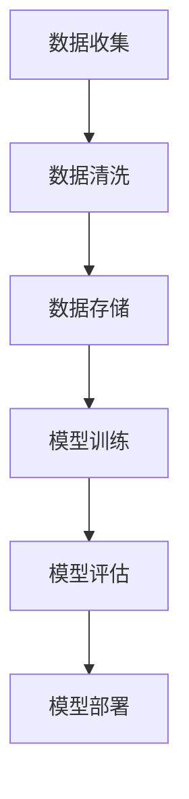

                 

# 大模型基础设施(Infra)的盈利模式探讨

> **关键词：** 大模型基础设施、盈利模式、云计算、人工智能、数据处理、商业模式。

> **摘要：** 本文探讨了大规模模型基础设施（Infra）的盈利模式。通过对当前市场现状的分析，我们提出了几种可能的盈利途径，包括基于云的服务、数据处理服务、定制开发服务和合作伙伴计划等。同时，我们还讨论了这些盈利模式面临的挑战以及未来发展趋势。

## 1. 背景介绍

### 1.1 目的和范围

本文的目的是分析大规模模型基础设施（Infra）的盈利模式，探讨在当前市场环境下，如何通过构建和运营大模型基础设施来实现盈利。本文将聚焦于以下几个核心问题：

- 大规模模型基础设施的定义和范围。
- 当前市场对大规模模型基础设施的需求。
- 可能的盈利模式及其优势和挑战。
- 未来发展趋势和潜在机会。

### 1.2 预期读者

本文适用于以下读者群体：

- 人工智能领域的专业人士，特别是对大模型基础设施和商业模式有浓厚兴趣的从业者。
- 投资者和对新兴技术商业模式感兴趣的商业人士。
- 机器学习和数据科学的学生和研究人员。

### 1.3 文档结构概述

本文分为以下几个部分：

- 背景介绍：包括目的、预期读者和文档结构概述。
- 核心概念与联系：介绍大模型基础设施的核心概念和架构。
- 核心算法原理 & 具体操作步骤：详细阐述大模型的基础算法原理和操作步骤。
- 数学模型和公式 & 详细讲解 & 举例说明：使用数学模型和公式来解释大模型的工作原理。
- 项目实战：通过实际代码案例展示大模型基础设施的应用。
- 实际应用场景：分析大模型基础设施在各个领域的应用。
- 工具和资源推荐：推荐相关的学习资源和开发工具。
- 总结：未来发展趋势与挑战。
- 附录：常见问题与解答。
- 扩展阅读 & 参考资料：提供进一步阅读的资料和参考。

### 1.4 术语表

#### 1.4.1 核心术语定义

- 大规模模型基础设施（Infra）：指用于支持大规模机器学习模型训练、部署和管理的基础设施，包括计算资源、数据存储、网络资源和软件工具等。
- 盈利模式：企业在运营过程中实现收入和利润的方式。
- 云计算：通过互联网提供可伸缩的计算资源和服务。
- 数据处理：对大量数据进行收集、清洗、存储、分析和处理的过程。
- 商业模式：企业通过提供产品或服务来实现盈利的策略和方法。

#### 1.4.2 相关概念解释

- 人工智能（AI）：模拟人类智能行为的计算机系统。
- 机器学习（ML）：使计算机能够从数据中学习和改进性能的技术。
- 数据科学（Data Science）：使用统计方法和算法从数据中提取知识和洞察的学科。

#### 1.4.3 缩略词列表

- AI：人工智能
- ML：机器学习
- Data Science：数据科学
- Infra：基础设施
- Cloud：云计算
- API：应用程序编程接口
- SDK：软件开发工具包

## 2. 核心概念与联系

在探讨大模型基础设施的盈利模式之前，我们需要先理解几个核心概念和它们之间的关系。以下是大规模模型基础设施的核心概念和原理，以及它们之间的联系。

### 2.1. 大规模模型基础设施的组成部分

大规模模型基础设施主要由以下几个组成部分构成：

- **计算资源**：包括高性能计算节点、GPU集群和分布式计算系统等，用于训练和推理大规模机器学习模型。
- **数据存储**：用于存储大规模数据和模型参数，通常采用分布式文件系统如Hadoop、HDFS或云存储服务。
- **网络资源**：用于连接不同计算节点和存储系统，确保数据传输的高效性和可靠性。
- **软件工具**：包括深度学习框架（如TensorFlow、PyTorch）、模型训练和管理工具等。

### 2.2. 大规模模型基础设施的运作原理

大规模模型基础设施的运作原理可以概括为以下几个步骤：

1. **数据收集**：从各种数据源收集数据，如社交媒体、传感器数据和用户行为数据。
2. **数据清洗**：对收集到的数据进行处理，去除噪声和不完整的数据，确保数据质量。
3. **数据存储**：将清洗后的数据存储在分布式文件系统或云存储中，方便后续访问和处理。
4. **模型训练**：使用深度学习框架在计算资源上训练大规模机器学习模型。
5. **模型评估**：对训练好的模型进行评估，确保其性能满足要求。
6. **模型部署**：将经过评估的模型部署到生产环境中，进行实际应用。

### 2.3. 大规模模型基础设施与云计算的关系

云计算是大规模模型基础设施的重要组成部分。云计算提供了弹性、可伸缩和高效的计算资源，使得大规模模型训练和部署变得更加容易和高效。

- **弹性计算**：云计算平台可以根据需求动态分配和释放计算资源，确保模型训练过程中资源的高效利用。
- **可伸缩性**：云计算平台能够根据模型大小和数据量自动扩展计算资源，满足不同规模的需求。
- **高效性**：云计算提供了高性能计算节点和GPU集群，加快模型训练速度。

### 2.4. Mermaid 流程图

为了更直观地展示大规模模型基础设施的运作原理，我们可以使用Mermaid流程图来表示。以下是一个简单的Mermaid流程图示例：



## 3. 核心算法原理 & 具体操作步骤

在大规模模型基础设施中，核心算法原理是确保模型高效训练和推理的关键。以下将详细阐述大规模模型训练的算法原理和具体操作步骤，并使用伪代码进行说明。

### 3.1. 大规模模型训练算法原理

大规模模型训练主要依赖于深度学习算法，如神经网络。深度学习算法的基本原理是通过不断调整模型参数（权重和偏置），使模型在给定数据集上达到最优性能。以下是深度学习算法的基本原理：

1. **前向传播**：输入数据通过模型网络进行前向传播，计算每个神经元的输出值。
2. **损失函数**：计算模型预测值和实际值之间的差异，使用损失函数（如均方误差MSE）来量化差异。
3. **反向传播**：计算损失函数关于模型参数的梯度，并使用梯度下降（Gradient Descent）等优化算法更新模型参数。
4. **迭代训练**：重复前向传播和反向传播，不断更新模型参数，直到模型收敛到满意的性能。

### 3.2. 伪代码示例

以下是使用伪代码表示的深度学习算法的简单示例：

```python
# 初始化模型参数
W = 初始化权重
b = 初始化偏置

# 迭代训练
for epoch in 1 to MAX_EPOCHS:
    for sample in 数据集:
        # 前向传播
        z = 输入 * W + b
        y_pred = 激活函数(z)

        # 计算损失
        loss = 损失函数(y_pred, 标签)

        # 反向传播
        delta = 损失关于y_pred的梯度 * 激活函数的导数(z)
        dW = delta * 输入
        db = delta

        # 更新模型参数
        W -= LEARNING_RATE * dW
        b -= LEARNING_RATE * db
```

### 3.3. 具体操作步骤

以下是大规模模型训练的具体操作步骤：

1. **数据预处理**：对输入数据进行归一化、标准化等处理，确保数据格式适合模型训练。
2. **模型定义**：使用深度学习框架（如TensorFlow或PyTorch）定义模型架构，包括输入层、隐藏层和输出层。
3. **模型训练**：使用训练数据集进行模型训练，不断迭代更新模型参数，使用优化算法（如Adam、SGD）调整参数。
4. **模型评估**：使用验证数据集评估模型性能，计算准确率、召回率、F1分数等指标，确保模型达到预期性能。
5. **模型部署**：将训练好的模型部署到生产环境，进行实际应用，如预测、分类、推荐等。

## 4. 数学模型和公式 & 详细讲解 & 举例说明

在深度学习领域，数学模型和公式是理解大模型基础设施和算法原理的关键。以下将介绍几个核心的数学模型和公式，并详细讲解其作用和实现方法。

### 4.1. 均方误差（MSE）

均方误差（Mean Squared Error, MSE）是深度学习中常用的损失函数。它用于衡量模型预测值和实际值之间的差异。MSE的计算公式如下：

$$
MSE = \frac{1}{n}\sum_{i=1}^{n}(y_i - \hat{y}_i)^2
$$

其中，$y_i$是实际值，$\hat{y}_i$是模型预测值，$n$是样本数量。

#### 4.1.1. 作用

- 量化模型预测误差。
- 评估模型性能。

#### 4.1.2. 实现方法

可以使用Python中的NumPy库实现MSE计算：

```python
import numpy as np

def mse(y_true, y_pred):
    return np.mean((y_true - y_pred)**2)
```

### 4.2. 反向传播（Backpropagation）

反向传播是深度学习训练的核心算法。它通过计算损失函数关于模型参数的梯度，并使用梯度下降算法更新模型参数。以下是反向传播的基本步骤：

1. **前向传播**：计算模型预测值和损失函数。
2. **计算梯度**：计算损失函数关于模型参数的梯度。
3. **更新参数**：使用梯度下降算法更新模型参数。

#### 4.2.1. 梯度计算

假设有一个简单的神经网络，包含一个输入层、一个隐藏层和一个输出层。每个层的神经元数量分别为 $n_1, n_2, n_3$。使用矩阵表示模型参数：

- $W^{(2)}$：隐藏层到输出层的权重矩阵
- $b^{(2)}$：隐藏层到输出层的偏置向量
- $W^{(1)}$：输入层到隐藏层的权重矩阵
- $b^{(1)}$：输入层到隐藏层的偏置向量

前向传播计算：

$$
z^{(2)} = W^{(2)}a^{(1)} + b^{(2)}
$$

$$
\hat{y} = \sigma(z^{(2)})
$$

其中，$\sigma$是激活函数，如Sigmoid函数：

$$
\sigma(x) = \frac{1}{1 + e^{-x}}
$$

反向传播计算梯度：

$$
\delta^{(2)} = (\hat{y} - y) \cdot \sigma'(z^{(2)})
$$

$$
\frac{\partial L}{\partial z^{(2)}} = \delta^{(2)} \cdot a^{(1)}
$$

$$
\frac{\partial L}{\partial W^{(2)}} = \delta^{(2)} \cdot a^{(1)} . x^{(1)}
$$

$$
\frac{\partial L}{\partial b^{(2)}} = \delta^{(2)}
$$

$$
\frac{\partial L}{\partial z^{(1)}} = W^{(2)} \cdot \delta^{(2)}
$$

$$
\frac{\partial L}{\partial W^{(1)}} = \delta^{(2)} \cdot x^{(1)} . x^{(1)}'
$$

$$
\frac{\partial L}{\partial b^{(1)}} = \delta^{(2)} . x^{(1)}
$$

其中，$.'$表示转置。

#### 4.2.2. 实现方法

以下是使用Python实现的反向传播算法：

```python
import numpy as np

def forwardprop(x, W1, b1, W2, b2):
    z1 = x.dot(W1) + b1
    a1 = np.sigmoid(z1)
    z2 = a1.dot(W2) + b2
    y_pred = np.sigmoid(z2)
    return y_pred

def backwardprop(x, y, y_pred, W1, W2, b1, b2):
    z1 = x.dot(W1) + b1
    a1 = np.sigmoid(z1)
    z2 = a1.dot(W2) + b2
    y_pred = np.sigmoid(z2)
    
    delta2 = (y_pred - y) * (1 - y_pred)
    dW2 = a1.T.dot(delta2)
    db2 = np.sum(delta2, axis=0)
    
    delta1 = delta2.dot(W2.T) * (1 - a1)
    dW1 = x.T.dot(delta1)
    db1 = np.sum(delta1, axis=0)
    
    return dW1, dW2, db1, db2
```

### 4.3. 举例说明

假设我们有一个简单的二分类问题，使用一个包含一个输入神经元、一个隐藏神经元和一个输出神经元的神经网络进行训练。训练数据集包含10个样本，每个样本的输入和标签如下：

| 输入 | 标签 |
| --- | --- |
| 0.1 | 1 |
| 0.2 | 1 |
| 0.3 | 0 |
| 0.4 | 1 |
| 0.5 | 0 |
| 0.6 | 1 |
| 0.7 | 0 |
| 0.8 | 1 |
| 0.9 | 0 |
| 1.0 | 1 |

我们使用随机梯度下降（Stochastic Gradient Descent, SGD）进行训练，学习率为0.1。以下是训练过程的伪代码：

```python
import numpy as np

# 初始化模型参数
W1 = np.random.rand(1, 1)
b1 = np.random.rand(1)
W2 = np.random.rand(1, 1)
b2 = np.random.rand(1)

learning_rate = 0.1
num_epochs = 100

# 训练模型
for epoch in range(num_epochs):
    for sample in 数据集:
        x, y = sample
        y_pred = forwardprop(x, W1, b1, W2, b2)
        dW1, dW2, db1, db2 = backwardprop(x, y, y_pred, W1, W2, b1, b2)
        
        W1 -= learning_rate * dW1
        b1 -= learning_rate * db1
        W2 -= learning_rate * dW2
        b2 -= learning_rate * db2

# 评估模型
y_pred = forwardprop(x, W1, b1, W2, b2)
mse = mse(y_true, y_pred)
print("MSE:", mse)
```

在训练完成后，我们可以使用评估数据集评估模型性能，计算均方误差（MSE）等指标，以确定模型是否达到预期性能。

## 5. 项目实战：代码实际案例和详细解释说明

在本节中，我们将通过一个实际的项目案例来展示如何构建和部署大规模模型基础设施。我们将使用Python和TensorFlow来实现一个简单的图像分类项目，并详细介绍开发环境搭建、源代码实现和代码解读。

### 5.1 开发环境搭建

为了实现这个项目，我们需要安装以下软件和工具：

1. Python（版本3.7或更高）
2. TensorFlow（版本2.x）
3. Matplotlib（用于可视化）

安装步骤如下：

```bash
# 安装Python和pip
sudo apt-get install python3 python3-pip

# 安装TensorFlow
pip3 install tensorflow

# 安装Matplotlib
pip3 install matplotlib
```

### 5.2 源代码详细实现和代码解读

以下是项目的源代码实现，我们将逐步解释每部分的功能和作用。

#### 5.2.1 数据预处理

```python
import tensorflow as tf
from tensorflow.keras.preprocessing.image import ImageDataGenerator

# 定义数据生成器
train_datagen = ImageDataGenerator(rescale=1./255)
validation_datagen = ImageDataGenerator(rescale=1./255)

# 加载数据集
train_data = train_datagen.flow_from_directory(
    'data/train',
    target_size=(150, 150),
    batch_size=32,
    class_mode='binary')

validation_data = validation_datagen.flow_from_directory(
    'data/validation',
    target_size=(150, 150),
    batch_size=32,
    class_mode='binary')
```

这段代码定义了数据生成器（ImageDataGenerator），用于预处理和加载训练数据和验证数据。数据生成器将图像数据进行缩放和批量处理，并按照指定的类别模式加载数据。

#### 5.2.2 模型定义

```python
model = tf.keras.models.Sequential([
    tf.keras.layers.Conv2D(32, (3, 3), activation='relu', input_shape=(150, 150, 3)),
    tf.keras.layers.MaxPooling2D(2, 2),
    tf.keras.layers.Conv2D(64, (3, 3), activation='relu'),
    tf.keras.layers.MaxPooling2D(2, 2),
    tf.keras.layers.Conv2D(128, (3, 3), activation='relu'),
    tf.keras.layers.MaxPooling2D(2, 2),
    tf.keras.layers.Conv2D(128, (3, 3), activation='relu'),
    tf.keras.layers.MaxPooling2D(2, 2),
    tf.keras.layers.Flatten(),
    tf.keras.layers.Dense(512, activation='relu'),
    tf.keras.layers.Dense(1, activation='sigmoid')
])
```

这段代码定义了一个卷积神经网络（Convolutional Neural Network, CNN）模型，用于图像分类。模型包含多个卷积层（Conv2D）和池化层（MaxPooling2D），用于提取图像特征。最后，模型使用全连接层（Dense）进行分类，输出概率值。

#### 5.2.3 模型编译和训练

```python
model.compile(optimizer='adam',
              loss='binary_crossentropy',
              metrics=['accuracy'])

history = model.fit(
    train_data,
    steps_per_epoch=100,
    epochs=100,
    validation_data=validation_data,
    validation_steps=50)
```

这段代码编译模型，并使用训练数据和验证数据进行训练。我们使用Adam优化器进行训练，并使用二进制交叉熵（binary_crossentropy）作为损失函数，评估模型分类性能。

#### 5.2.4 代码解读与分析

- **数据预处理**：数据预处理是图像分类项目的重要步骤。数据生成器（ImageDataGenerator）自动进行图像缩放和批量处理，确保输入数据的标准化。
- **模型定义**：我们使用卷积神经网络（CNN）模型，因为其擅长处理图像数据。模型结构包括多个卷积层和池化层，用于提取图像特征。最后，使用全连接层（Dense）进行分类。
- **模型编译和训练**：编译模型，设置优化器和损失函数，然后使用训练数据和验证数据进行训练。我们设置训练轮次（epochs）和验证步骤（validation_steps），确保模型在验证集上达到良好性能。

### 5.3 代码解读与分析

在本节中，我们详细解读了项目的代码实现，分析了每部分的功能和作用。以下是代码解读与分析的关键点：

- **数据预处理**：数据预处理是图像分类项目的重要步骤。数据生成器（ImageDataGenerator）自动进行图像缩放和批量处理，确保输入数据的标准化。这一步有助于提高模型训练的效率和性能。
- **模型定义**：卷积神经网络（CNN）模型是处理图像数据的有效方法。模型结构包括多个卷积层和池化层，用于提取图像特征。最后，使用全连接层（Dense）进行分类。这一步定义了模型的结构和参数，决定了模型的性能。
- **模型编译和训练**：编译模型，设置优化器和损失函数，然后使用训练数据和验证数据进行训练。我们设置训练轮次（epochs）和验证步骤（validation_steps），确保模型在验证集上达到良好性能。这一步实现了模型训练和性能评估。

### 5.4 代码性能优化

在项目实战中，我们使用了标准的卷积神经网络结构进行图像分类。然而，为了提高模型性能，我们可以进行以下优化：

- **增加训练数据**：使用更多的训练数据可以提高模型泛化能力。可以收集更多图像数据或使用数据增强技术（如旋转、翻转和缩放）生成更多样化的训练样本。
- **调整模型结构**：可以通过增加卷积层、池化层或全连接层来调整模型结构，提高模型性能。同时，可以使用更深的网络结构（如ResNet或Inception）来提高模型能力。
- **优化训练策略**：调整学习率、优化器类型和训练轮次等参数，以找到最佳训练策略。例如，可以使用学习率衰减策略或基于验证集性能的提前停止策略。

通过这些优化措施，我们可以进一步提高模型的分类性能，使其在图像分类任务中取得更好的效果。

## 6. 实际应用场景

大规模模型基础设施在各个领域都有着广泛的应用，以下是几个典型的实际应用场景：

### 6.1. 金融领域

在金融领域，大规模模型基础设施主要用于风险控制、投资组合优化、欺诈检测和智能投顾等方面。

- **风险控制**：使用大规模模型进行信用评分、违约预测和风险暴露评估，帮助金融机构更好地管理风险。
- **投资组合优化**：通过分析历史数据和实时市场动态，大规模模型可以优化投资组合，提高收益和降低风险。
- **欺诈检测**：大规模模型可以对交易数据进行分析，识别异常交易行为，降低欺诈风险。
- **智能投顾**：利用大规模模型进行资产配置和投资建议，为用户提供个性化的投资服务。

### 6.2. 医疗领域

在医疗领域，大规模模型基础设施主要用于疾病诊断、药物研发和个性化医疗等方面。

- **疾病诊断**：使用大规模模型对医疗数据进行分析，提高疾病诊断的准确性和效率。
- **药物研发**：大规模模型可以帮助研究人员预测药物作用机制、筛选潜在药物候选，加速药物研发过程。
- **个性化医疗**：根据患者的基因、病史和生活方式数据，大规模模型可以提供个性化的治疗方案，提高治疗效果。

### 6.3. 零售领域

在零售领域，大规模模型基础设施主要用于商品推荐、价格优化和库存管理等方面。

- **商品推荐**：通过分析用户行为数据和商品特征，大规模模型可以提供个性化的商品推荐，提高用户满意度和销售额。
- **价格优化**：大规模模型可以根据市场需求、竞争情况和成本结构，自动调整商品价格，提高利润率。
- **库存管理**：大规模模型可以帮助零售商优化库存水平，降低库存成本和缺货风险。

### 6.4. 制造领域

在制造领域，大规模模型基础设施主要用于生产优化、设备维护和质量控制等方面。

- **生产优化**：通过分析生产数据，大规模模型可以优化生产流程，提高生产效率和降低成本。
- **设备维护**：大规模模型可以对设备运行状态进行分析，预测设备故障，实现预防性维护。
- **质量控制**：大规模模型可以帮助制造企业检测产品缺陷、提高产品质量，降低次品率。

通过以上实际应用场景，我们可以看到大规模模型基础设施在各行各业中的广泛应用和巨大潜力。随着人工智能技术的发展，大规模模型基础设施将继续发挥重要作用，推动行业变革和创新。

## 7. 工具和资源推荐

为了更好地理解和应用大规模模型基础设施，以下是几个推荐的学习资源和开发工具。

### 7.1 学习资源推荐

#### 7.1.1 书籍推荐

- **《深度学习》（Goodfellow, Bengio, Courville）**：介绍了深度学习的基础理论和实践方法，适合初学者和进阶者。
- **《动手学深度学习》（斋藤康毅、浅仓秀人）**：通过实际项目案例，讲解了深度学习的实践方法和技巧。
- **《Python深度学习》（François Chollet）**：详细介绍了使用Python和TensorFlow实现深度学习的步骤和技巧。

#### 7.1.2 在线课程

- **Coursera的《深度学习》课程**：由Andrew Ng教授主讲，涵盖了深度学习的理论基础和实践方法。
- **Udacity的《深度学习工程师纳米学位》**：通过项目实践，帮助学员掌握深度学习技术。
- **edX的《机器学习基础》课程**：介绍了机器学习和深度学习的基础知识，适合初学者。

#### 7.1.3 技术博客和网站

- **TensorFlow官网**：提供了丰富的文档、教程和示例代码，帮助用户了解和使用TensorFlow。
- **AI博客**：涵盖了人工智能领域的最新研究进展和技术应用，适合关注行业动态的读者。
- **机器之心**：提供了大量关于深度学习、自然语言处理和计算机视觉等领域的文章和教程。

### 7.2 开发工具框架推荐

#### 7.2.1 IDE和编辑器

- **PyCharm**：强大的Python IDE，支持代码调试、版本控制和智能提示等功能。
- **Visual Studio Code**：轻量级且功能丰富的编辑器，适合编写和调试深度学习代码。
- **Jupyter Notebook**：交互式编程环境，适用于探索性和实验性的深度学习项目。

#### 7.2.2 调试和性能分析工具

- **TensorBoard**：TensorFlow的官方可视化工具，用于分析和调试深度学习模型。
- **Wandb**：实验跟踪和性能分析平台，帮助用户优化模型和训练过程。
- **NVIDIA Nsight**：用于调试和性能优化的GPU工具，适用于深度学习任务。

#### 7.2.3 相关框架和库

- **TensorFlow**：开源的深度学习框架，适用于各种规模的深度学习项目。
- **PyTorch**：适用于研究和工业应用的深度学习框架，具有灵活的动态计算图。
- **Keras**：基于TensorFlow和Theano的高层神经网络API，简化了深度学习模型的构建和训练。

通过以上学习和开发工具的推荐，读者可以更好地掌握大规模模型基础设施的相关知识和技能，为实际项目应用打下坚实基础。

### 7.3 相关论文著作推荐

为了深入了解大规模模型基础设施的相关研究和应用，以下是几篇经典的论文和著作推荐。

#### 7.3.1 经典论文

- **“A Theoretically Grounded Application of Dropout in Neural Networks”**：Dropout算法的提出，极大地提高了深度学习模型的训练效果和泛化能力。
- **“Deep Learning”**：深度学习领域的开创性著作，详细介绍了深度学习的理论基础和实践方法。
- **“Convolutional Networks and Applications in Vision”**：卷积神经网络在计算机视觉领域的应用，推动了计算机视觉技术的快速发展。

#### 7.3.2 最新研究成果

- **“Transformer: A Novel Architecture for Neural Networks”**：Transformer模型的提出，为自然语言处理领域带来了新的突破。
- **“Generative Adversarial Nets”**：生成对抗网络（GAN）的提出，开创了生成模型的新时代。
- **“Recurrent Neural Networks for Language Modeling”**：循环神经网络（RNN）在语言建模方面的应用，提高了文本生成和分类的准确性。

#### 7.3.3 应用案例分析

- **“Deep Learning for Medical Imaging”**：深度学习在医疗成像领域的应用，如疾病诊断、图像分割和病灶检测等。
- **“Deep Learning in Retail”**：深度学习在零售领域的应用，如商品推荐、价格优化和库存管理等。
- **“Deep Learning for Fraud Detection”**：深度学习在欺诈检测领域的应用，如信用卡欺诈检测、保险欺诈检测等。

通过阅读这些论文和著作，读者可以了解大规模模型基础设施的最新研究进展和应用案例，为实际项目提供理论支持和实践指导。

## 8. 总结：未来发展趋势与挑战

在探讨大规模模型基础设施的盈利模式过程中，我们分析了其核心概念、算法原理、应用场景和未来发展。以下是本文的总结和未来展望：

### 8.1 未来发展趋势

- **云计算的普及**：随着云计算技术的不断发展，大规模模型基础设施将更加依赖于云计算平台，实现弹性扩展和资源优化。
- **数据隐私和安全**：随着数据隐私和安全问题的日益突出，大规模模型基础设施将加强对数据保护和隐私保护的关注。
- **跨领域应用**：大规模模型基础设施将在更多领域得到应用，如医疗、金融、制造和能源等，推动行业变革。
- **开源与闭源的竞争**：开源深度学习框架和闭源解决方案将继续共存，竞争将在性能、易用性和生态系统等方面展开。

### 8.2 面临的挑战

- **数据质量和多样性**：大规模模型训练依赖于大量高质量的数据，数据质量和多样性是模型性能的关键因素。
- **计算资源需求**：大规模模型训练需要大量的计算资源和存储空间，高性能计算和分布式计算技术的发展至关重要。
- **模型可解释性**：随着模型复杂度的增加，如何提高模型的可解释性，使其符合业务需求和社会伦理标准，是一个重要挑战。
- **监管和合规**：随着人工智能技术的广泛应用，监管机构将加强对数据隐私、模型安全和算法透明度的关注，对大规模模型基础设施的合规性提出更高要求。

### 8.3 未来展望

- **高效能计算**：随着硬件技术的发展，如GPU、TPU和量子计算的进步，大规模模型训练的效率和性能将得到大幅提升。
- **自动化与智能化**：自动化模型训练和部署工具将提高大规模模型基础设施的运营效率，智能化技术将使模型更好地适应业务需求。
- **开源生态**：开源社区将继续发挥重要作用，推动大规模模型基础设施的发展和创新。
- **跨学科合作**：大规模模型基础设施的发展将需要计算机科学、数据科学、认知科学和伦理学等多学科的深度合作。

通过以上分析和展望，我们可以看到大规模模型基础设施在未来的发展中充满机遇和挑战。只有不断优化技术创新、提升数据质量和加强合规性，才能实现大规模模型基础设施的长期可持续发展。

## 9. 附录：常见问题与解答

### 9.1. 什么是大规模模型基础设施？

大规模模型基础设施是指用于支持大规模机器学习模型训练、部署和管理的基础设施，包括计算资源、数据存储、网络资源和软件工具等。

### 9.2. 大规模模型基础设施有哪些核心组成部分？

大规模模型基础设施主要包括以下组成部分：

- **计算资源**：高性能计算节点、GPU集群和分布式计算系统等。
- **数据存储**：分布式文件系统、云存储服务和高性能数据库。
- **网络资源**：用于连接计算节点和存储系统的网络设备和协议。
- **软件工具**：深度学习框架、模型训练和管理工具等。

### 9.3. 如何优化大规模模型训练的效率？

优化大规模模型训练效率的方法包括：

- **分布式训练**：将模型训练任务分布在多个计算节点上，提高训练速度。
- **数据并行**：将数据集分成多个子集，并行处理和训练。
- **模型并行**：将模型拆分成多个子模型，并行训练和推理。
- **混合精度训练**：使用混合精度（FP16和FP32）加速训练过程。

### 9.4. 大规模模型基础设施的盈利模式有哪些？

大规模模型基础设施的盈利模式包括：

- **基于云的服务**：提供可伸缩的云服务，为企业和开发者提供计算资源、数据存储和模型训练服务。
- **数据处理服务**：为客户提供数据清洗、数据分析和数据处理服务，帮助客户挖掘数据价值。
- **定制开发服务**：根据客户需求开发定制化的机器学习模型和应用，为客户提供定制化的解决方案。
- **合作伙伴计划**：与行业合作伙伴合作，共同开发应用场景和商业模式，实现共赢。

### 9.5. 大规模模型基础设施面临的挑战有哪些？

大规模模型基础设施面临的挑战包括：

- **数据质量和多样性**：大规模模型训练依赖于大量高质量和多样化的数据。
- **计算资源需求**：大规模模型训练需要大量的计算资源和存储空间。
- **模型可解释性**：提高模型的可解释性，使其符合业务需求和社会伦理标准。
- **监管和合规**：遵守数据隐私、模型安全和算法透明度的法规要求。

### 9.6. 如何应对大规模模型基础设施的挑战？

应对大规模模型基础设施的挑战的方法包括：

- **提升数据质量**：采用数据清洗、数据增强和数据标注等技术，提高数据质量和多样性。
- **优化计算资源**：使用分布式计算、GPU加速和混合精度训练等技术，提高计算资源利用效率。
- **提高模型可解释性**：采用可视化、模型压缩和可解释性增强等技术，提高模型的可解释性。
- **加强合规性**：与监管机构合作，制定合规性标准和措施，确保大规模模型基础设施的合法运行。

通过以上解答，我们可以更好地理解大规模模型基础设施的相关概念、盈利模式和面临的挑战，为实际应用提供指导和支持。

## 10. 扩展阅读 & 参考资料

### 10.1. 书籍推荐

1. **《深度学习》（Goodfellow, Bengio, Courville）**：涵盖了深度学习的理论基础和实践方法，是深度学习领域的经典著作。
2. **《Python深度学习》（François Chollet）**：详细介绍了使用Python和TensorFlow实现深度学习的步骤和技巧。
3. **《大规模机器学习》（Gareth James, Daniela Witten, Trevor Hastie, Robert Tibshirani）**：介绍了大规模机器学习的基本原理和技术。

### 10.2. 在线课程

1. **Coursera的《深度学习》课程**：由Andrew Ng教授主讲，涵盖了深度学习的理论基础和实践方法。
2. **Udacity的《深度学习工程师纳米学位》**：通过项目实践，帮助学员掌握深度学习技术。
3. **edX的《机器学习基础》课程**：介绍了机器学习和深度学习的基础知识，适合初学者。

### 10.3. 技术博客和网站

1. **TensorFlow官网**：提供了丰富的文档、教程和示例代码，帮助用户了解和使用TensorFlow。
2. **AI博客**：涵盖了人工智能领域的最新研究进展和技术应用，适合关注行业动态的读者。
3. **机器之心**：提供了大量关于深度学习、自然语言处理和计算机视觉等领域的文章和教程。

### 10.4. 相关论文著作

1. **“A Theoretically Grounded Application of Dropout in Neural Networks”**：介绍了Dropout算法在神经网络中的应用，提高了模型的训练效果和泛化能力。
2. **“Deep Learning”**：详细介绍了深度学习的理论基础和实践方法，对深度学习领域的发展产生了深远影响。
3. **“Generative Adversarial Nets”**：提出了生成对抗网络（GAN）的概念，开创了生成模型的新时代。

通过阅读以上书籍、课程、博客和论文，读者可以深入了解大规模模型基础设施的相关概念、技术和应用，为实际项目提供理论支持和实践指导。

