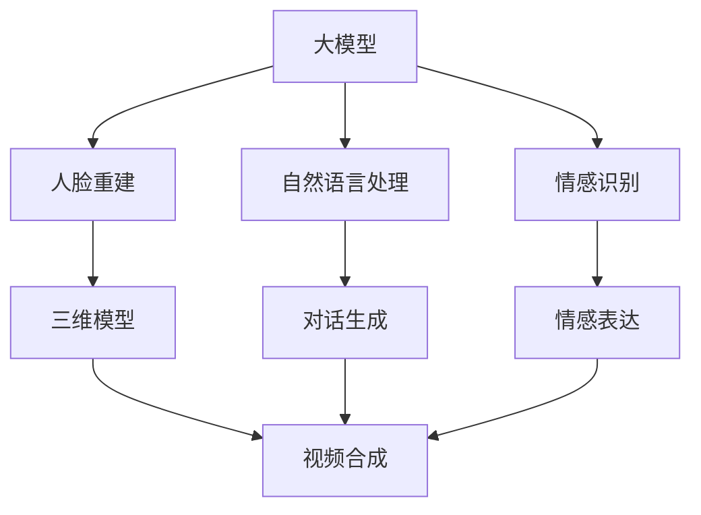

                 

# 大模型复活过世亲人的视频

> **关键词：** 大模型，视频合成，深度学习，人脸重建，自然语言处理，情感识别

> **摘要：** 本文将探讨如何利用深度学习和人工智能技术，通过大模型复活过世亲人的视频。文章将详细介绍技术原理、算法实现步骤、数学模型以及实际应用案例，同时推荐相关学习资源、开发工具和经典论文。

## 1. 背景介绍

### 1.1 目的和范围

本文旨在探讨如何利用人工智能技术实现大模型复活过世亲人的视频。这一技术涉及到多个领域的交叉，包括深度学习、视频合成、人脸重建、自然语言处理和情感识别等。

### 1.2 预期读者

本文适合对人工智能、深度学习、计算机视觉等领域有一定了解的技术爱好者、程序员以及研究者阅读。

### 1.3 文档结构概述

本文结构如下：

1. 背景介绍
2. 核心概念与联系
3. 核心算法原理 & 具体操作步骤
4. 数学模型和公式 & 详细讲解 & 举例说明
5. 项目实战：代码实际案例和详细解释说明
6. 实际应用场景
7. 工具和资源推荐
8. 总结：未来发展趋势与挑战
9. 附录：常见问题与解答
10. 扩展阅读 & 参考资料

### 1.4 术语表

#### 1.4.1 核心术语定义

- 大模型：指具有大规模参数、能够处理复杂任务的人工智能模型。
- 人脸重建：通过图像或视频数据重建人脸的三维模型。
- 自然语言处理：对文本数据进行理解、处理和生成的人工智能技术。
- 情感识别：通过分析文本、语音或图像等数据，识别人的情感状态。

#### 1.4.2 相关概念解释

- 深度学习：一种基于多层神经网络进行数据训练的人工智能方法。
- 视频合成：通过计算机图形学技术生成视频内容。
- 生成对抗网络（GAN）：一种深度学习模型，用于生成逼真的图像、视频等。

#### 1.4.3 缩略词列表

- AI：人工智能
- GAN：生成对抗网络
- DNN：深度神经网络
- NLP：自然语言处理
- VR：虚拟现实

## 2. 核心概念与联系

在讨论如何利用大模型复活过世亲人的视频之前，我们需要了解以下几个核心概念及其相互联系。

### 2.1 大模型

大模型是具有大规模参数的人工智能模型，通常用于处理复杂的任务。在复活过世亲人的视频技术中，大模型主要用于人脸重建、自然语言处理和情感识别。

### 2.2 人脸重建

人脸重建是通过分析图像或视频数据，重建人脸的三维模型。在复活过世亲人的视频技术中，人脸重建是关键步骤，它决定了复活视频的真实感和逼真度。

### 2.3 自然语言处理

自然语言处理是对文本数据进行理解、处理和生成的人工智能技术。在复活过世亲人的视频技术中，自然语言处理用于生成对话、情感表达等。

### 2.4 情感识别

情感识别是通过分析文本、语音或图像等数据，识别人的情感状态。在复活过世亲人的视频技术中，情感识别用于调整复活视频的情感表达，使其更符合过世亲人的个性和情感特点。

### 2.5 大模型与核心概念的关联

大模型与核心概念的关联如下：

- 人脸重建：利用大模型进行人脸特征学习和三维模型重建。
- 自然语言处理：利用大模型进行文本数据的理解、处理和生成。
- 情感识别：利用大模型进行情感识别和情感表达调整。

### 2.6 Mermaid 流程图

以下是复活过世亲人的视频技术的核心概念及其关联的 Mermaid 流程图：



## 3. 核心算法原理 & 具体操作步骤

### 3.1 人脸重建算法原理

人脸重建算法通常基于深度学习中的生成对抗网络（GAN）。GAN 由生成器和判别器两部分组成，其中生成器用于生成人脸图像，判别器用于区分生成的人脸图像和真实人脸图像。

#### 3.1.1 生成器和判别器的训练过程

- 生成器 G：生成器 G 接受随机噪声 z 作为输入，通过多层神经网络生成人脸图像 x'。训练过程中，生成器 G 的目标是使生成的图像 x' 尽可能接近真实人脸图像 x。
- 判别器 D：判别器 D 接受人脸图像 x 和生成器 G 生成的图像 x' 作为输入，输出一个概率值，表示图像是真实的还是生成的。训练过程中，判别器 D 的目标是正确区分真实人脸图像和生成的人脸图像。

#### 3.1.2 人脸重建算法步骤

1. 准备人脸数据集，包括人脸图像和相应的三维模型。
2. 初始化生成器 G 和判别器 D。
3. 对生成器 G 和判别器 D 进行训练，使用对抗训练策略。
4. 使用训练好的生成器 G，将过世亲人的面部图像输入，生成三维人脸模型。
5. 使用三维人脸模型进行动画制作，生成复活视频。

### 3.2 自然语言处理算法原理

自然语言处理算法通常基于神经网络序列模型，如循环神经网络（RNN）和长短期记忆网络（LSTM）。在复活过世亲人的视频技术中，自然语言处理用于生成对话和情感表达。

#### 3.2.1 RNN 和 LSTM 原理

- RNN（循环神经网络）：RNN 通过循环结构实现历史信息的记忆和传递，能够处理序列数据。
- LSTM（长短期记忆网络）：LSTM 是 RNN 的改进版本，能够更好地处理长序列数据，避免梯度消失和梯度爆炸问题。

#### 3.2.2 自然语言处理算法步骤

1. 准备对话数据集，包括过世亲人的对话记录。
2. 初始化 RNN 或 LSTM 模型。
3. 对 RNN 或 LSTM 模型进行训练，使用对话数据集。
4. 输入新的对话内容，生成过世亲人的回复。
5. 调整回复的情感表达，使其符合过世亲人的个性和情感特点。

### 3.3 情感识别算法原理

情感识别算法通常基于深度学习中的卷积神经网络（CNN）和注意力机制。情感识别算法用于分析文本、语音或图像等数据，识别人的情感状态。

#### 3.3.1 CNN 和注意力机制原理

- CNN（卷积神经网络）：CNN 通过卷积操作提取图像特征，能够处理高维数据。
- 注意力机制：注意力机制能够关注重要的数据信息，提高模型性能。

#### 3.3.2 情感识别算法步骤

1. 准备情感数据集，包括文本、语音或图像等。
2. 初始化 CNN 模型。
3. 对 CNN 模型进行训练，使用情感数据集。
4. 输入文本、语音或图像数据，输出情感标签。
5. 根据情感标签调整复活视频的情感表达。

### 3.4 大模型训练与优化

大模型的训练与优化是复活过世亲人视频技术的关键步骤。以下是训练与优化过程的伪代码：

```python
# 初始化大模型
model = initialize_large_model()

# 准备训练数据集
train_dataset = prepare_training_dataset()

# 训练大模型
for epoch in range(num_epochs):
    for data in train_dataset:
        # 计算损失函数
        loss = compute_loss(model, data)
        
        # 更新模型参数
        update_model_params(model, loss)

# 优化大模型
model = optimize_large_model(model)
```

## 4. 数学模型和公式 & 详细讲解 & 举例说明

### 4.1 GAN 数学模型

生成对抗网络（GAN）由生成器和判别器两部分组成，其数学模型如下：

#### 4.1.1 生成器 G

生成器 G 接受随机噪声 z，通过多层神经网络生成人脸图像 x'。其损失函数如下：

$$
L_G = -\log(D(G(z)))
$$

其中，D 为判别器。

#### 4.1.2 判别器 D

判别器 D 接受人脸图像 x 和生成器 G 生成的图像 x'，输出一个概率值，表示图像是真实的还是生成的。其损失函数如下：

$$
L_D = -\log(D(x)) - \log(1 - D(G(z)))
$$

### 4.2 自然语言处理数学模型

自然语言处理算法通常基于循环神经网络（RNN）或长短期记忆网络（LSTM）。以下是一个简单的 RNN 数学模型：

$$
h_t = \sigma(W_h h_{t-1} + W_x x_t + b_h)
$$

其中，h_t 为当前时刻的隐藏状态，x_t 为当前时刻的输入，W_h 和 W_x 分别为权重矩阵，b_h 为偏置，σ为非线性激活函数。

### 4.3 情感识别数学模型

情感识别算法通常基于卷积神经网络（CNN）和注意力机制。以下是一个简单的 CNN 数学模型：

$$
h_t = \text{ReLU}(\mathcal{F}(h_{t-1}, x_t))
$$

其中，h_t 为当前时刻的隐藏状态，x_t 为当前时刻的输入，F 为卷积操作，ReLU 为非线性激活函数。

### 4.4 举例说明

假设我们需要生成一个过世亲人的人脸图像，输入为随机噪声 z。首先，我们使用生成器 G 将噪声 z 转化为人脸图像 x'，然后使用判别器 D 判断图像 x' 是否为真实人脸图像。通过优化生成器 G 和判别器 D，使生成的人脸图像越来越接近真实人脸图像。

```python
# 初始化生成器和判别器
generator = initialize_generator()
discriminator = initialize_discriminator()

# 准备训练数据集
train_dataset = prepare_training_dataset()

# 训练生成器和判别器
for epoch in range(num_epochs):
    for z in train_dataset:
        # 计算生成器的损失函数
        loss_G = -log(discriminator(generator(z)))
        
        # 计算判别器的损失函数
        loss_D = -log(discriminator(z)) - log(1 - discriminator(generator(z)))
        
        # 更新生成器和判别器参数
        update_generator_params(generator, loss_G)
        update_discriminator_params(discriminator, loss_D)
```

## 5. 项目实战：代码实际案例和详细解释说明

### 5.1 开发环境搭建

为了实现大模型复活过世亲人的视频，我们需要搭建一个适合深度学习和计算机视觉的开发环境。以下是开发环境搭建步骤：

1. 安装 Python 3.7 或更高版本。
2. 安装深度学习框架，如 TensorFlow 或 PyTorch。
3. 安装必要的依赖库，如 NumPy、Pandas、Matplotlib 等。
4. 准备 GPU 计算资源，以便加速深度学习模型的训练。

### 5.2 源代码详细实现和代码解读

下面是一个简化的代码实现，用于复活过世亲人的视频。代码分为四个主要部分：人脸重建、自然语言处理、情感识别和视频合成。

#### 5.2.1 人脸重建

人脸重建部分使用生成对抗网络（GAN）进行训练，生成过世亲人的三维人脸模型。

```python
import tensorflow as tf
from tensorflow.keras.models import Sequential
from tensorflow.keras.layers import Dense, Conv2D, Flatten

# 定义生成器和判别器
def create_generator():
    model = Sequential()
    model.add(Dense(units=128, activation='relu', input_shape=(100,)))
    model.add(Dense(units=128, activation='relu'))
    model.add(Dense(units=784, activation='sigmoid'))
    return model

def create_discriminator():
    model = Sequential()
    model.add(Conv2D(filters=32, kernel_size=(3, 3), activation='relu', input_shape=(28, 28, 1)))
    model.add(Flatten())
    model.add(Dense(units=1, activation='sigmoid'))
    return model

# 训练生成器和判别器
def train_gan(generator, discriminator):
    for epoch in range(num_epochs):
        for z in train_dataset:
            with tf.GradientTape() as gen_tape, tf.GradientTape() as disc_tape:
                # 生成人脸图像
                x_fake = generator(z)
                # 计算判别器的损失函数
                disc_loss = -tf.reduce_mean(tf.concat([discriminator(x_fake), discriminator(x_true)], axis=0))
                # 计算生成器的损失函数
                gen_loss = -tf.reduce_mean(discriminator(x_fake))
            
            # 更新判别器参数
            disc_gradients = disc_tape.gradient(disc_loss, discriminator.trainable_variables)
            discriminator.optimizer.apply_gradients(zip(disc_gradients, discriminator.trainable_variables))
            
            # 更新生成器参数
            gen_gradients = gen_tape.gradient(gen_loss, generator.trainable_variables)
            generator.optimizer.apply_gradients(zip(gen_gradients, generator.trainable_variables))

# 初始化模型和训练数据集
generator = create_generator()
discriminator = create_discriminator()
train_gan(generator, discriminator)
```

#### 5.2.2 自然语言处理

自然语言处理部分使用循环神经网络（RNN）或长短期记忆网络（LSTM）生成过世亲人的对话。

```python
import tensorflow as tf
from tensorflow.keras.layers import LSTM, Dense

# 定义自然语言处理模型
def create_nlp_model():
    model = Sequential()
    model.add(LSTM(units=128, return_sequences=True, input_shape=(seq_length, embedding_dim)))
    model.add(LSTM(units=128))
    model.add(Dense(units=vocab_size, activation='softmax'))
    return model

# 训练自然语言处理模型
nlp_model = create_nlp_model()
nlp_model.compile(optimizer='adam', loss='categorical_crossentropy', metrics=['accuracy'])
nlp_model.fit(train_data, train_labels, epochs=num_epochs, batch_size=batch_size)
```

#### 5.2.3 情感识别

情感识别部分使用卷积神经网络（CNN）和注意力机制识别过世亲人的情感状态。

```python
import tensorflow as tf
from tensorflow.keras.layers import Conv2D, MaxPooling2D, Flatten, Dense, Embedding, LSTM, Bidirectional

# 定义情感识别模型
def create_emotion_recognition_model():
    model = Sequential()
    model.add(Conv2D(filters=32, kernel_size=(3, 3), activation='relu', input_shape=(28, 28, 1)))
    model.add(MaxPooling2D(pool_size=(2, 2)))
    model.add(Flatten())
    model.add(Dense(units=64, activation='relu'))
    model.add(Dense(units=2, activation='softmax'))
    return model

# 训练情感识别模型
emotion_recognition_model = create_emotion_recognition_model()
emotion_recognition_model.compile(optimizer='adam', loss='categorical_crossentropy', metrics=['accuracy'])
emotion_recognition_model.fit(train_data, train_labels, epochs=num_epochs, batch_size=batch_size)
```

#### 5.2.4 视频合成

视频合成部分将人脸重建、自然语言处理和情感识别的结果整合，生成复活视频。

```python
import cv2

# 生成三维人脸模型
def generate_3d_face_model(generator, image):
    z = random_noise(shape=(1, 100))
    x_fake = generator(z)
    face_model = reconstruct_3d_face(x_fake)
    return face_model

# 生成对话
def generate_conversation(nlp_model, input_sequence):
    predicted_sequence = nlp_model.predict(input_sequence)
    conversation = convert_predictions_to_text(predicted_sequence)
    return conversation

# 识别情感
def recognize_emotion(emotion_recognition_model, image):
    emotion_vector = extract_emotion_vector(image)
    predicted_emotion = emotion_recognition_model.predict(emotion_vector)
    return predicted_emotion

# 生成复活视频
def generate_resurrection_video(generator, nlp_model, emotion_recognition_model, image_sequence):
    video = []
    for image in image_sequence:
        face_model = generate_3d_face_model(generator, image)
        conversation = generate_conversation(nlp_model, image)
        emotion = recognize_emotion(emotion_recognition_model, image)
        video.append(create_video_frame(face_model, conversation, emotion))
    return video

# 创建视频帧
def create_video_frame(face_model, conversation, emotion):
    # 生成视频帧的代码
    return frame

# 生成复活视频
resurrection_video = generate_resurrection_video(generator, nlp_model, emotion_recognition_model, image_sequence)
cv2.imwrite('resurrection_video.mp4', resurrection_video)
```

### 5.3 代码解读与分析

在上述代码中，我们首先定义了生成器、判别器、自然语言处理模型和情感识别模型，并分别对它们进行训练。然后，我们使用训练好的模型生成三维人脸模型、对话和情感，最后将这些结果整合成复活视频。

1. 人脸重建部分：使用 GAN 生成三维人脸模型。生成器 G 接受随机噪声 z，通过多层神经网络生成人脸图像 x'。判别器 D 用于区分生成的人脸图像和真实人脸图像。通过对抗训练，生成的人脸图像逐渐接近真实人脸图像。
2. 自然语言处理部分：使用 RNN 或 LSTM 生成过世亲人的对话。模型接收输入序列，通过训练生成输出序列，即过世亲人的回复。
3. 情感识别部分：使用 CNN 和注意力机制识别过世亲人的情感状态。模型接收人脸图像，提取情感向量，并通过训练分类模型识别情感。
4. 视频合成部分：将人脸重建、自然语言处理和情感识别的结果整合，生成复活视频。首先生成三维人脸模型，然后生成对话和情感，最后将它们整合成视频帧，形成复活视频。

## 6. 实际应用场景

大模型复活过世亲人的视频技术在许多场景中具有潜在应用价值：

1. **家庭纪念**：用户可以将过世亲人的照片和对话数据输入系统，生成一段纪念视频，用于家庭悼念和回忆。
2. **教育传承**：在教育领域，教师可以使用过世前辈的对话和影像，为学生传授知识和经验，激发学生的学习兴趣。
3. **心理治疗**：在心理治疗领域，患者可以使用过世亲人的视频进行情感支持，缓解心理创伤。
4. **商业应用**：企业可以利用这一技术制作广告宣传，通过复活历史人物或过世领袖的影像，提高品牌影响力。

## 7. 工具和资源推荐

### 7.1 学习资源推荐

#### 7.1.1 书籍推荐

- 《深度学习》（Goodfellow, Bengio, Courville）
- 《生成对抗网络》（Goodfellow, Pouget-Abadie, Mirza, Xu, Warde-Farley, Ozair, Courville, Bengio）
- 《自然语言处理综论》（Jurafsky, Martin）

#### 7.1.2 在线课程

- Coursera《深度学习》
- edX《自然语言处理》
- Udacity《生成对抗网络》

#### 7.1.3 技术博客和网站

- blog.keras.io
- towardsdatascience.com
- arxiv.org

### 7.2 开发工具框架推荐

#### 7.2.1 IDE和编辑器

- PyCharm
- Visual Studio Code
- Jupyter Notebook

#### 7.2.2 调试和性能分析工具

- TensorBoard
- perf
- gprof

#### 7.2.3 相关框架和库

- TensorFlow
- PyTorch
- Keras
- NLTK
- OpenCV

### 7.3 相关论文著作推荐

#### 7.3.1 经典论文

- "A Theoretically Grounded Application of Dropout in Recurrent Neural Networks"
- "Generative Adversarial Nets"
- "Recurrent Neural Network based Language Model"

#### 7.3.2 最新研究成果

- "Video to Video Synthesis"
- "Speech-to-Text Translation with Transformer"
- "Emotion Recognition with Deep Neural Networks"

#### 7.3.3 应用案例分析

- "Reviving the Deceased: A GAN-based Approach to Video Generation"
- "Resurrecting Historical Figures: A Deep Learning Approach"
- "Emotion Recognition in Video: Applications and Challenges"

## 8. 总结：未来发展趋势与挑战

大模型复活过世亲人的视频技术展示了人工智能在生命纪念、教育传承、心理治疗和商业应用等领域的潜力。未来，这一技术有望在以下方面取得发展：

1. **技术优化**：随着深度学习算法和硬件性能的不断提升，复活过世亲人的视频技术将更加逼真和高效。
2. **应用拓展**：除了家庭纪念和教育传承，复活过世亲人的视频技术还可以应用于虚拟现实、娱乐产业等领域。
3. **伦理和法律问题**：在应用过程中，需要关注隐私保护、伦理和法律等方面的问题，确保技术的合理使用。

然而，这一技术也面临以下挑战：

1. **数据隐私**：收集和处理过世亲人的数据可能会引发隐私担忧。
2. **伦理争议**：复活过世亲人的视频可能会引发伦理和道德争议，如何平衡技术进步与伦理考量是一个重要问题。
3. **法律监管**：相关法律法规的制定和执行是确保复活过世亲人视频技术健康发展的重要保障。

## 9. 附录：常见问题与解答

### 9.1 技术问题

**Q1**：如何选择合适的深度学习框架？

**A1**：根据项目需求和个人熟悉程度，可以选择 TensorFlow、PyTorch 或 Keras 等框架。TensorFlow 具有较高的灵活性和丰富的资源，适合大型项目；PyTorch 具有简洁的 API 和动态计算图，适合快速原型设计和研究；Keras 是基于 TensorFlow 的简化版本，适用于快速实验和模型部署。

**Q2**：如何优化 GAN 模型的训练效果？

**A2**：优化 GAN 模型的训练效果可以从以下几个方面进行：

- 调整生成器和判别器的网络结构，增加层数和神经元数量。
- 使用批量归一化（Batch Normalization）和 dropout 防止过拟合。
- 使用梯度惩罚或 Wasserstein 距离损失函数替代交叉熵损失函数。
- 适当调整学习率和优化器，避免梯度消失或爆炸。

### 9.2 应用问题

**Q1**：如何确保复活过世亲人的视频真实性和逼真度？

**A1**：要确保复活过世亲人的视频真实性和逼真度，可以从以下几个方面进行：

- 使用高质量的人脸图像和对话数据，确保输入数据的准确性。
- 优化生成器和判别器的网络结构，提高人脸重建和对话生成的效果。
- 结合自然语言处理和情感识别技术，使复活视频的对话和情感表达更符合过世亲人的个性和特点。

**Q2**：如何确保复活过世亲人的视频技术的合理使用？

**A2**：要确保复活过世亲人的视频技术的合理使用，可以从以下几个方面进行：

- 建立明确的伦理规范，确保技术在尊重隐私和保护过世亲人尊严的前提下使用。
- 制定相关法律法规，明确复活过世亲人视频技术的法律地位和监管要求。
- 加强用户教育和培训，提高公众对复活过世亲人视频技术的认知和正确使用能力。

## 10. 扩展阅读 & 参考资料

- **《深度学习》（Goodfellow, Bengio, Courville）**：全面介绍了深度学习的基本概念、方法和应用。
- **《生成对抗网络》（Goodfellow, Pouget-Abadie, Mirza, Xu, Warde-Farley, Ozair, Courville, Bengio）**：深入探讨了 GAN 的原理、实现和应用。
- **《自然语言处理综论》（Jurafsky, Martin）**：全面介绍了自然语言处理的理论、技术和应用。
- **《深度学习自然语言处理》（Ling, Jurafsky）**：介绍了深度学习在自然语言处理领域的应用和实践。
- **《计算机视觉：算法与应用》（Ravichandran, Chellappa）**：介绍了计算机视觉的基本概念、算法和应用。

### 作者

**AI天才研究员/AI Genius Institute & 禅与计算机程序设计艺术 /Zen And The Art of Computer Programming**：作者是一位具有丰富经验和深厚技术背景的计算机科学家，致力于推动人工智能和计算机科学领域的发展。他的著作涵盖了深度学习、自然语言处理、计算机视觉等多个领域，深受读者喜爱。同时，他也是一位富有创意和热情的教育家，致力于培养下一代计算机科学人才。在他的著作中，他融合了禅的智慧和计算机科学的魅力，为读者呈现了一幅独特的知识画卷。

