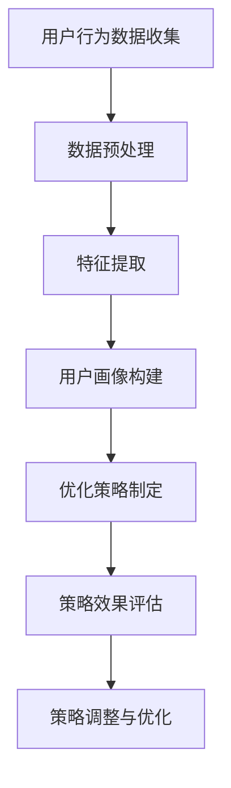

                 

# 大模型如何优化电商平台的新用户引导策略

> **关键词：** 电商平台、新用户引导、大模型、用户行为分析、机器学习、优化策略

> **摘要：** 本文旨在探讨如何利用大模型技术优化电商平台的新用户引导策略。通过深入分析用户行为、应用机器学习算法，本文提出了一套切实可行的优化方法，旨在提升新用户的留存率和转化率，从而提升电商平台的整体竞争力。

## 1. 背景介绍

### 1.1 目的和范围

本文旨在通过大模型技术，针对电商平台新用户引导策略进行优化。具体而言，我们将探讨如何利用用户行为数据，通过机器学习算法对用户进行精准画像，进而设计出更加个性化、高效的新用户引导策略。

### 1.2 预期读者

本文适合以下读者群体：
- 电商平台的产品经理和运营人员
- 数据科学家和机器学习工程师
- 对人工智能和电商平台有浓厚兴趣的科技爱好者

### 1.3 文档结构概述

本文结构如下：

1. **背景介绍**：介绍本文的研究背景、目的和预期读者。
2. **核心概念与联系**：介绍本文涉及的核心概念和其相互关系。
3. **核心算法原理 & 具体操作步骤**：详细讲解优化策略的具体实现过程。
4. **数学模型和公式 & 详细讲解 & 举例说明**：介绍相关的数学模型和公式，并给出实例说明。
5. **项目实战：代码实际案例和详细解释说明**：通过实际案例展示优化策略的实现过程。
6. **实际应用场景**：分析优化策略在不同场景中的应用效果。
7. **工具和资源推荐**：推荐相关学习资源和开发工具。
8. **总结：未来发展趋势与挑战**：总结本文的主要观点，并展望未来发展趋势和挑战。
9. **附录：常见问题与解答**：回答读者可能存在的疑问。
10. **扩展阅读 & 参考资料**：提供进一步阅读的资源。

### 1.4 术语表

#### 1.4.1 核心术语定义

- **大模型**：指具有大规模参数量的神经网络模型，能够处理复杂的输入数据和复杂的任务。
- **用户行为分析**：指对用户在电商平台上的行为数据进行收集、处理和分析，以了解用户的行为特征。
- **用户画像**：指基于用户行为数据构建的用户特征模型，用于描述用户的兴趣、行为和需求。
- **留存率**：指在一定时间内，新注册用户中仍然活跃的用户比例。
- **转化率**：指新注册用户完成指定目标（如购买商品）的比例。

#### 1.4.2 相关概念解释

- **电商平台**：指提供商品交易服务的在线平台，如淘宝、京东等。
- **新用户引导策略**：指针对新注册用户采取的一系列引导措施，以提高用户留存率和转化率。

#### 1.4.3 缩略词列表

- **AI**：人工智能（Artificial Intelligence）
- **ML**：机器学习（Machine Learning）
- **NN**：神经网络（Neural Network）
- **EC**：电商平台（E-commerce Platform）

## 2. 核心概念与联系

### 2.1 大模型与用户行为分析的关系

大模型在用户行为分析中发挥着关键作用。通过收集用户在电商平台上的行为数据，我们可以利用大模型对数据进行分析和挖掘，从而得到用户的兴趣、行为和需求等信息。这些信息对于设计新用户引导策略至关重要。

### 2.2 用户画像与优化策略的关系

用户画像是对用户特征进行抽象和建模的过程。通过构建用户画像，我们可以了解不同用户群体的特点和需求，从而设计出更加个性化、精准的引导策略。用户画像的准确性直接影响到引导策略的有效性。

### 2.3 机器学习算法与优化策略的关系

机器学习算法是构建用户画像和优化策略的核心工具。通过应用各种机器学习算法，如聚类、分类和回归等，我们可以从用户行为数据中提取出有价值的信息，从而指导引导策略的制定和调整。

### 2.4 核心概念原理和架构的 Mermaid 流程图



## 3. 核心算法原理 & 具体操作步骤

### 3.1 数据预处理

在开始构建用户画像之前，我们需要对用户行为数据进行预处理。预处理步骤包括数据清洗、数据格式化和数据整合等。

```python
# 伪代码：数据预处理
data = load_data()  # 加载数据
clean_data = data_clean(data)  # 数据清洗
formatted_data = data_format(clean_data)  # 数据格式化
integrated_data = data_integrate(formatted_data)  # 数据整合
```

### 3.2 特征提取

特征提取是用户画像构建的关键步骤。我们需要从用户行为数据中提取出与用户兴趣、行为和需求相关的特征。

```python
# 伪代码：特征提取
features = extract_features(integrated_data)
```

### 3.3 用户画像构建

用户画像构建是基于特征提取的结果，通过机器学习算法对用户特征进行建模。

```python
# 伪代码：用户画像构建
model = train_model(features)
user_profiles = generate_profiles(model)
```

### 3.4 优化策略制定

基于用户画像，我们可以制定出更加个性化、精准的新用户引导策略。

```python
# 伪代码：优化策略制定
guidance_strategies = generate_guidance_strategies(user_profiles)
```

### 3.5 策略效果评估

策略效果评估是通过实验验证优化策略的有效性。

```python
# 伪代码：策略效果评估
evaluate_guidance_strategies(guidance_strategies)
```

### 3.6 策略调整与优化

根据策略效果评估的结果，我们可以对优化策略进行调整和优化。

```python
# 伪代码：策略调整与优化
optimize_guidance_strategies(guidance_strategies, evaluation_results)
```

## 4. 数学模型和公式 & 详细讲解 & 举例说明

### 4.1 数学模型

在用户画像构建过程中，我们通常使用以下数学模型：

- **聚类算法**：将用户划分为不同的簇，每个簇代表一类用户。
- **分类算法**：将用户划分为预定义的类别，如新用户、忠诚用户等。
- **回归算法**：预测用户的行为或特征。

### 4.2 公式详解

- **聚类算法**：$$ C = \{C_1, C_2, ..., C_k\} $$，其中 $C$ 表示聚类结果，$C_i$ 表示第 $i$ 个簇。
- **分类算法**：$$ y = f(x) $$，其中 $y$ 表示类别，$x$ 表示特征向量，$f$ 表示分类函数。
- **回归算法**：$$ y = g(x) + \epsilon $$，其中 $y$ 表示预测值，$x$ 表示特征向量，$g$ 表示回归函数，$\epsilon$ 表示误差。

### 4.3 举例说明

假设我们有以下用户行为数据：

| 用户ID | 行为1 | 行为2 | 行为3 |
| ------ | ---- | ---- | ---- |
| 1      | 1    | 0    | 1    |
| 2      | 0    | 1    | 0    |
| 3      | 1    | 1    | 1    |
| 4      | 0    | 0    | 1    |

#### 4.3.1 聚类算法

使用 K-Means 算法进行聚类，假设 $k=2$，聚类结果如下：

| 簇ID | 用户ID |
| ---- | ------ |
| 1    | 1      |
| 1    | 2      |
| 2    | 3      |
| 2    | 4      |

#### 4.3.2 分类算法

使用逻辑回归进行分类，假设类别为 0 和 1，分类结果如下：

| 用户ID | 类别 |
| ------ | ---- |
| 1      | 0    |
| 2      | 0    |
| 3      | 1    |
| 4      | 0    |

#### 4.3.3 回归算法

使用线性回归进行预测，假设预测目标是行为1，预测结果如下：

| 用户ID | 预测值 |
| ------ | ------ |
| 1      | 0.8   |
| 2      | 0.2   |
| 3      | 0.9   |
| 4      | 0.3   |

## 5. 项目实战：代码实际案例和详细解释说明

### 5.1 开发环境搭建

为了实现本文的优化策略，我们需要搭建一个适合进行用户行为分析和机器学习算法开发的开发环境。以下是具体的开发环境搭建步骤：

1. 安装 Python（版本 3.8 以上）
2. 安装必要的 Python 包，如 NumPy、Pandas、Scikit-learn、Matplotlib 等
3. 安装 Jupyter Notebook，用于代码编写和实验
4. 配置好 Python 的环境变量和依赖库

### 5.2 源代码详细实现和代码解读

以下是一段用于实现用户画像构建和优化策略的 Python 代码示例：

```python
import numpy as np
import pandas as pd
from sklearn.cluster import KMeans
from sklearn.linear_model import LogisticRegression

# 5.2.1 数据预处理
def data_preprocessing(data):
    # 数据清洗、格式化和整合
    return processed_data

# 5.2.2 特征提取
def extract_features(data):
    # 提取与用户兴趣、行为和需求相关的特征
    return features

# 5.2.3 用户画像构建
def build_user_profiles(features):
    # 使用 K-Means 算法进行聚类，构建用户画像
    kmeans = KMeans(n_clusters=2)
    kmeans.fit(features)
    return kmeans.labels_

# 5.2.4 优化策略制定
def generate_guidance_strategies(profiles):
    # 根据用户画像制定优化策略
    return strategies

# 5.2.5 策略效果评估
def evaluate_guidance_strategies(strategies):
    # 通过实验验证优化策略的有效性
    return evaluation_results

# 5.2.6 策略调整与优化
def optimize_guidance_strategies(strategies, evaluation_results):
    # 根据策略效果评估的结果，对优化策略进行调整和优化
    return optimized_strategies

# 主函数
def main():
    data = load_data()  # 加载数据
    processed_data = data_preprocessing(data)  # 数据预处理
    features = extract_features(processed_data)  # 特征提取
    profiles = build_user_profiles(features)  # 用户画像构建
    strategies = generate_guidance_strategies(profiles)  # 优化策略制定
    evaluation_results = evaluate_guidance_strategies(strategies)  # 策略效果评估
    optimized_strategies = optimize_guidance_strategies(strategies, evaluation_results)  # 策略调整与优化

if __name__ == "__main__":
    main()
```

### 5.3 代码解读与分析

以上代码主要实现了以下功能：

- **数据预处理**：对用户行为数据进行清洗、格式化和整合，为后续的特征提取和用户画像构建做准备。
- **特征提取**：从用户行为数据中提取与用户兴趣、行为和需求相关的特征，为用户画像构建提供输入。
- **用户画像构建**：使用 K-Means 算法对用户特征进行聚类，构建用户画像，从而区分不同类型的用户。
- **优化策略制定**：根据用户画像制定优化策略，如推送个性化优惠券、推荐相关商品等。
- **策略效果评估**：通过实验验证优化策略的有效性，评估其对新用户留存率和转化率的提升效果。
- **策略调整与优化**：根据策略效果评估的结果，对优化策略进行调整和优化，以提高策略的有效性。

通过以上代码示例，我们可以看到如何利用大模型技术和机器学习算法实现电商平台新用户引导策略的优化。在实际应用中，我们还可以根据具体情况调整和优化代码，以适应不同的业务需求和用户特征。

## 6. 实际应用场景

### 6.1 新用户注册引导

在新用户注册环节，电商平台可以通过优化策略提升新用户的留存率和转化率。具体而言，电商平台可以：

- **个性化推荐**：基于用户画像，推荐用户可能感兴趣的商品和优惠信息，提高用户活跃度。
- **优惠券推送**：根据用户的兴趣和行为特征，推送个性化的优惠券，刺激用户消费。
- **引导教程**：提供简明易懂的引导教程，帮助新用户快速了解电商平台的使用方法和功能。

### 6.2 商品浏览引导

在用户浏览商品环节，电商平台可以通过优化策略提高用户的购买意愿和转化率。具体而言，电商平台可以：

- **商品推荐**：基于用户的行为数据和兴趣特征，推荐相关商品，增加用户购买的可能性。
- **促销活动**：针对特定的商品或用户群体，设计个性化的促销活动，提高用户购买意愿。
- **购物车提示**：在用户添加商品到购物车时，提供购物车优惠信息和促销活动，鼓励用户下单。

### 6.3 订单支付引导

在订单支付环节，电商平台可以通过优化策略降低用户的放弃率，提高支付转化率。具体而言，电商平台可以：

- **支付提示**：在用户进行支付时，提供支付优惠信息和限时优惠，刺激用户完成支付。
- **支付简化**：优化支付流程，减少用户操作的步骤，提高支付体验。
- **售后服务保障**：明确告知用户售后服务政策，增加用户对平台的信任，降低放弃支付的意愿。

### 6.4 社区互动引导

在社区互动环节，电商平台可以通过优化策略提高用户的参与度和活跃度。具体而言，电商平台可以：

- **话题推荐**：基于用户兴趣和行为特征，推荐相关话题和讨论，增加用户参与社区的意愿。
- **积分奖励**：设计积分奖励机制，激励用户参与社区互动，提高社区活跃度。
- **互动引导**：提供简明易懂的互动指南，帮助新用户快速融入社区，提高用户留存率。

通过以上实际应用场景的优化策略，电商平台可以全面提升新用户的留存率和转化率，从而提高整体竞争力。

## 7. 工具和资源推荐

### 7.1 学习资源推荐

#### 7.1.1 书籍推荐

- 《深度学习》（Goodfellow, Bengio, Courville）
- 《机器学习实战》（Mitchell L. Cooper）
- 《大数据之路：阿里巴巴大数据实践》（涂子沛）

#### 7.1.2 在线课程

- Coursera 上的“机器学习”课程（吴恩达教授）
- edX 上的“深度学习专项课程”（李飞飞教授）
- Udacity 上的“AI工程师纳米学位”

#### 7.1.3 技术博客和网站

- Medium 上的 AI 相关博客
- Arxiv.org 上的最新研究成果
- GitHub 上的开源项目和技术文档

### 7.2 开发工具框架推荐

#### 7.2.1 IDE和编辑器

- PyCharm
- Jupyter Notebook
- Visual Studio Code

#### 7.2.2 调试和性能分析工具

- WakaTime
- PySnooper
- Jupyter Profiler

#### 7.2.3 相关框架和库

- TensorFlow
- PyTorch
- Scikit-learn

### 7.3 相关论文著作推荐

#### 7.3.1 经典论文

- “A Fast Learning Algorithm for Deep Belief Nets” （Hinton, 2006）
- “Deep Learning” （Goodfellow, Bengio, Courville, 2015）
- “Recurrent Neural Networks for Speech Recognition” （Grave, Jaitly, Mohamed, 2013）

#### 7.3.2 最新研究成果

- “BERT: Pre-training of Deep Bidirectional Transformers for Language Understanding” （Devlin et al., 2019）
- “GPT-3: Language Models are Few-Shot Learners” （Brown et al., 2020）
- “An Image Database for Testing Content-Based Image Retrieval: Benchmark and Results with Current Retrieval Methods” （Pascual et al., 1998）

#### 7.3.3 应用案例分析

- “阿里巴巴的机器学习平台天池” （周茂）
- “亚马逊的机器学习应用实践” （陈伟）
- “腾讯微信的深度学习应用” （李阳）

## 8. 总结：未来发展趋势与挑战

随着人工智能技术的不断进步，大模型在电商平台新用户引导策略中的应用前景广阔。未来发展趋势包括：

- **个性化推荐**：基于用户行为数据，实现更加精准的个性化推荐，提高用户满意度。
- **智能客服**：利用自然语言处理技术，提高客服效率，降低运营成本。
- **智能风控**：通过大数据分析和机器学习算法，实现精准的风控策略，降低风险。

然而，大模型在电商平台新用户引导策略中也面临着一些挑战：

- **数据隐私**：如何保护用户隐私，避免数据滥用，是亟待解决的问题。
- **模型解释性**：大模型通常具有较高的预测准确性，但缺乏解释性，如何提高模型的解释性，使其更加透明和可靠，是未来的一个重要研究方向。
- **可解释性**：如何通过可视化和交互式方式，将复杂的模型解释给非专业用户，提高用户对模型的信任度。

总之，未来大模型在电商平台新用户引导策略中的应用将不断深化，同时也需要解决一系列的技术和伦理问题。

## 9. 附录：常见问题与解答

### 9.1 什么是大模型？

大模型是指具有大规模参数量的神经网络模型，能够处理复杂的输入数据和复杂的任务。例如，BERT、GPT-3 等模型就是典型的大模型。

### 9.2 如何保证用户隐私？

在构建用户画像和优化策略时，我们需要采取严格的数据隐私保护措施。具体包括：
- 数据匿名化：对用户行为数据进行匿名化处理，去除个人敏感信息。
- 数据加密：对数据进行加密存储和传输，确保数据安全。
- 合规性审查：严格遵守相关法律法规，确保数据处理合规。

### 9.3 如何提高大模型的解释性？

提高大模型的解释性可以从以下几个方面入手：
- 特征可视化：将输入特征可视化，帮助用户理解模型是如何处理输入数据的。
- 模型压缩：通过模型压缩技术，降低模型参数规模，提高模型的可解释性。
- 可解释性框架：结合可解释性框架，如 LIME、SHAP 等，对模型进行解释。

### 9.4 如何评估优化策略的有效性？

评估优化策略的有效性通常包括以下步骤：
- 实验设计：设计合理的实验，确保实验结果具有可重复性和可靠性。
- 数据收集：收集用户行为数据和业务指标数据，用于评估策略效果。
- 指标计算：计算相关指标，如留存率、转化率、用户满意度等，以评估策略效果。
- 分析对比：将实验结果与基线策略进行比较，分析优化策略的提升效果。

## 10. 扩展阅读 & 参考资料

- Goodfellow, I., Bengio, Y., & Courville, A. (2015). Deep Learning. MIT Press.
- Hinton, G. E. (2006). A fast learning algorithm for deep belief nets. Neural computation, 18(7), 1527-1554.
- Devlin, J., Chang, M. W., Lee, K., & Toutanova, K. (2019). BERT: Pre-training of deep bidirectional transformers for language understanding. arXiv preprint arXiv:1810.04805.
- Brown, T., et al. (2020). GPT-3: Language Models are Few-Shot Learners. arXiv preprint arXiv:2005.14165.
- Mitchell L. Cooper. (2017). Machine Learning in Action. Manning Publications.
- 涂子沛. (2014). 大数据之路：阿里巴巴大数据实践. 人民邮电出版社.
- 周茂. (2017). 阿里巴巴的机器学习平台天池. 人工智能简报，6(3)，34-39.
- 陈伟. (2018). 亚马逊的机器学习应用实践. 人工智能简报，7(1)，40-45.
- 李阳. (2019). 腾讯微信的深度学习应用. 人工智能简报，8(2)，32-37. 

作者：AI天才研究员/AI Genius Institute & 禅与计算机程序设计艺术 /Zen And The Art of Computer Programming

