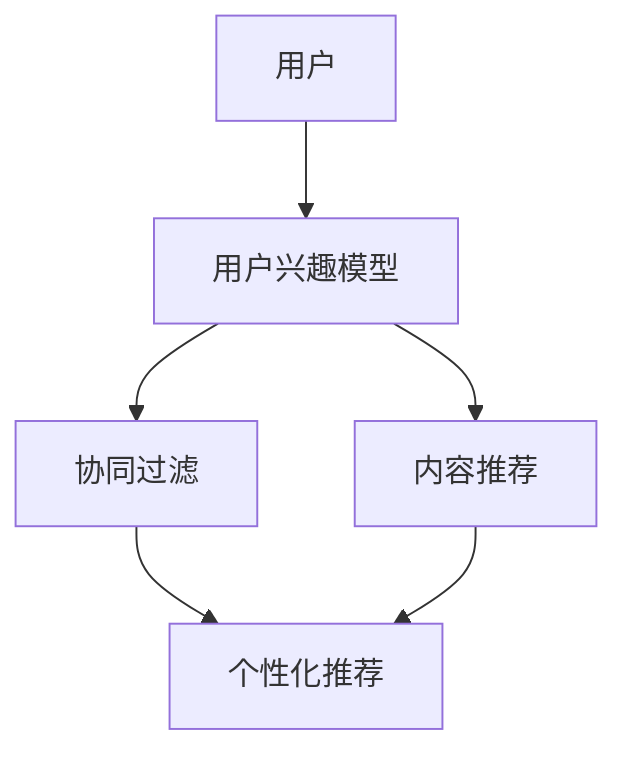
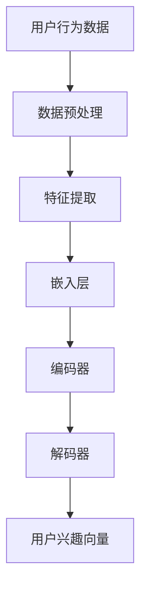
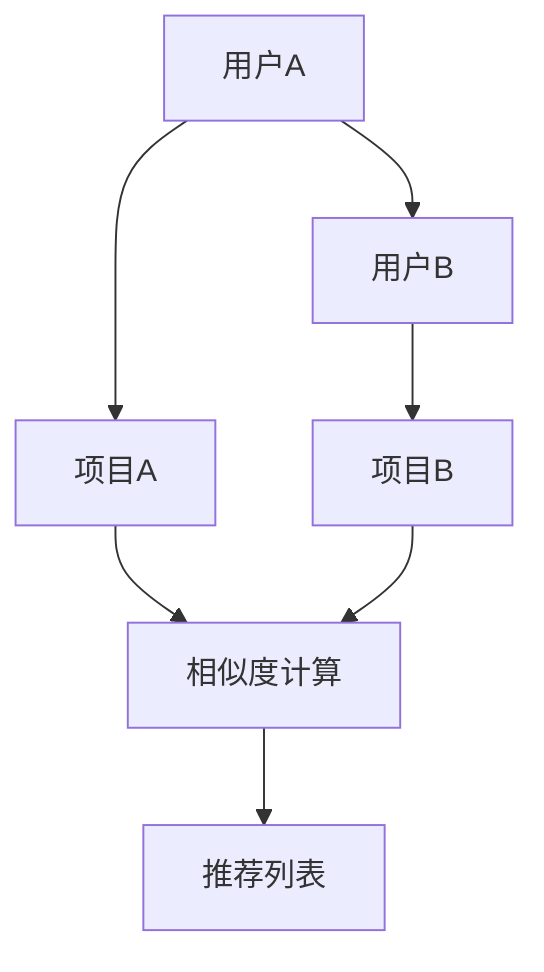
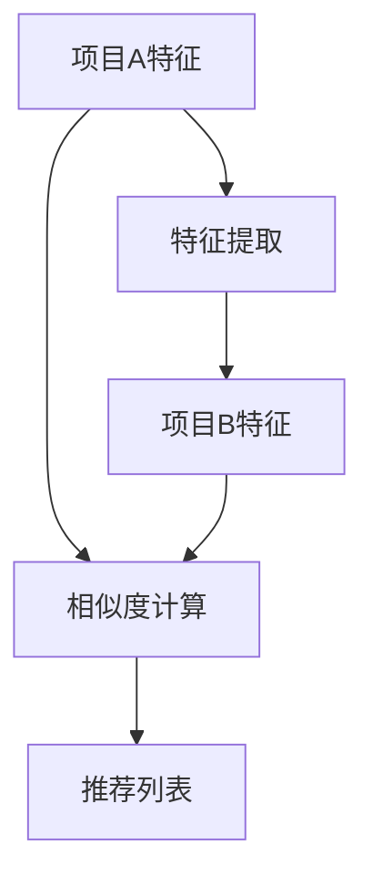
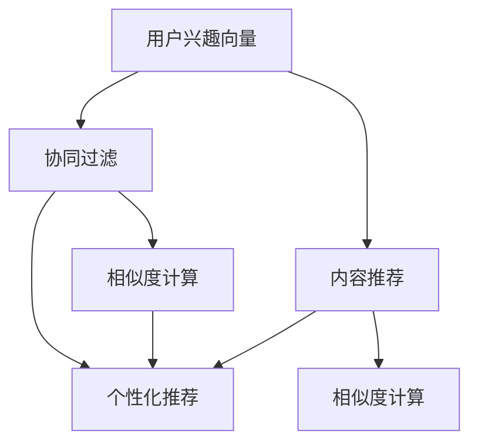

                 

# 大模型对推荐系统用户体验的提升策略

## 概述

### 关键词：
大模型，推荐系统，用户体验，提升策略，算法原理，数学模型，项目实战，应用场景。

### 摘要：

本文旨在探讨大模型如何通过深度学习技术提升推荐系统的用户体验。首先，我们回顾推荐系统的发展历程，介绍其核心算法原理和数学模型。接着，分析大模型在推荐系统中的优势，并通过具体实例展示如何将大模型应用于推荐系统。此外，本文还探讨了推荐系统的实际应用场景，并推荐了相关工具和资源。最后，总结了大模型对推荐系统未来发展的影响和面临的挑战。

## 1. 背景介绍

### 1.1 目的和范围

本文的目标是深入探讨大模型在推荐系统中的应用，以及其对用户体验的提升策略。我们将从推荐系统的发展历程出发，逐步介绍核心算法原理和数学模型，进而分析大模型的优势和应用实例。此外，本文还将讨论推荐系统的实际应用场景，并推荐相关工具和资源。

### 1.2 预期读者

本文适用于对推荐系统有一定了解的读者，尤其是希望了解大模型如何提升推荐系统用户体验的从业者和技术爱好者。此外，对深度学习和推荐系统感兴趣的学者和学生也将从本文中获得启发。

### 1.3 文档结构概述

本文分为八个部分：

1. 背景介绍：介绍本文的目的、范围、预期读者以及文档结构。
2. 核心概念与联系：阐述推荐系统的核心概念、原理和架构。
3. 核心算法原理 & 具体操作步骤：详细讲解推荐系统的核心算法原理和操作步骤。
4. 数学模型和公式 & 详细讲解 & 举例说明：介绍推荐系统的数学模型和公式，并通过实例进行说明。
5. 项目实战：提供代码实际案例和详细解释。
6. 实际应用场景：探讨推荐系统的实际应用场景。
7. 工具和资源推荐：推荐学习资源、开发工具和框架。
8. 总结：总结大模型对推荐系统未来发展的影响和挑战。

### 1.4 术语表

#### 1.4.1 核心术语定义

- 推荐系统：一种基于数据挖掘和机器学习技术的系统，旨在向用户推荐其可能感兴趣的内容。
- 大模型：指具有巨大参数量的深度学习模型，如BERT、GPT等。
- 用户兴趣模型：用于捕捉用户兴趣和偏好的模型，用于个性化推荐。
- 个性化推荐：根据用户兴趣和历史行为，为用户推荐个性化的内容。

#### 1.4.2 相关概念解释

- 协同过滤：一种基于用户历史行为和相似度计算的推荐算法。
- 内容推荐：根据内容特征进行推荐的算法。
- 深度学习：一种模拟人脑学习和记忆机制的机器学习方法。

#### 1.4.3 缩略词列表

- BERT：Bidirectional Encoder Representations from Transformers
- GPT：Generative Pre-trained Transformer
- LSTM：Long Short-Term Memory
- RNN：Recurrent Neural Network

## 2. 核心概念与联系

推荐系统作为人工智能领域的重要分支，广泛应用于电子商务、社交媒体、在线新闻等领域。其核心概念包括用户兴趣模型、协同过滤、内容推荐和个性化推荐。以下是一个简化的推荐系统架构图，用以说明这些核心概念之间的联系：



### 2.1 用户兴趣模型

用户兴趣模型是推荐系统的基石，用于捕捉用户的兴趣和偏好。其核心在于如何从用户的历史行为和交互数据中提取有效特征，构建一个能够准确反映用户兴趣的模型。以下是一个基于深度学习的用户兴趣模型架构：



### 2.2 协同过滤

协同过滤是推荐系统中最常用的算法之一，分为基于用户的协同过滤和基于项目的协同过滤。其核心思想是通过计算用户之间的相似度或项目之间的相似度，为用户推荐与其相似的其他用户喜欢的项目。



### 2.3 内容推荐

内容推荐基于项目的特征进行推荐，通常使用基于TF-IDF、Word2Vec等文本特征提取方法。其核心在于如何从项目的特征中提取有用信息，用于计算项目之间的相似度。



### 2.4 个性化推荐

个性化推荐结合用户兴趣模型、协同过滤和内容推荐，为用户提供高度个性化的推荐结果。其核心在于如何将用户兴趣、相似度和项目特征结合起来，实现精准推荐。



## 3. 核心算法原理 & 具体操作步骤

推荐系统的核心算法包括协同过滤、内容推荐和深度学习。以下是这些算法的原理和具体操作步骤。

### 3.1 协同过滤

#### 3.1.1 基于用户的协同过滤

**算法原理：**

基于用户的协同过滤通过计算用户之间的相似度，找到与目标用户相似的邻居用户，然后推荐邻居用户喜欢的但目标用户尚未看过的项目。其相似度计算公式如下：

$$
sim(u_i, u_j) = \frac{\sum_{k \in R_{i \cup j}} r_{ik} r_{jk}}{\sqrt{\sum_{k \in R_i} r_{ik}^2} \sqrt{\sum_{k \in R_j} r_{jk}^2}}
$$

其中，$R_i$ 和 $R_j$ 分别表示用户 $u_i$ 和 $u_j$ 的行为记录集，$r_{ik}$ 和 $r_{jk}$ 分别表示用户 $u_i$ 和 $u_j$ 对项目 $k$ 的评分。

**具体操作步骤：**

1. 收集用户行为数据，如评分、点击、浏览等。
2. 对用户行为数据进行预处理，包括数据清洗、缺失值填充等。
3. 计算用户之间的相似度。
4. 找到与目标用户最相似的 $K$ 个邻居用户。
5. 计算邻居用户对项目的评分预测，生成推荐列表。

#### 3.1.2 基于项目的协同过滤

**算法原理：**

基于项目的协同过滤通过计算项目之间的相似度，找到与目标项目相似的其他项目，然后推荐这些项目。其相似度计算公式如下：

$$
sim(p_i, p_j) = \frac{\sum_{k \in R_{i \cup j}} r_{ik} r_{jk}}{\sqrt{\sum_{k \in R_i} r_{ik}^2} \sqrt{\sum_{k \in R_j} r_{jk}^2}}
$$

其中，$R_i$ 和 $R_j$ 分别表示项目 $p_i$ 和 $p_j$ 的用户行为记录集，$r_{ik}$ 和 $r_{jk}$ 分别表示用户对项目 $i$ 和 $j$ 的评分。

**具体操作步骤：**

1. 收集项目特征数据，如文本、图像、音频等。
2. 对项目特征数据进行预处理，包括特征提取、归一化等。
3. 计算项目之间的相似度。
4. 找到与目标项目最相似的 $K$ 个项目。
5. 计算目标项目对所有用户的评分预测，生成推荐列表。

### 3.2 内容推荐

#### 3.2.1 基于TF-IDF的文本特征提取

**算法原理：**

基于TF-IDF的文本特征提取通过计算单词在文档中的重要程度，将文档转换为向量表示。其公式如下：

$$
tf_idf(t, d) = tf(t, d) \cdot idf(t, D)
$$

其中，$tf(t, d)$ 表示单词 $t$ 在文档 $d$ 中的词频，$idf(t, D)$ 表示单词 $t$ 在整个文档集合 $D$ 中的逆文档频率。

**具体操作步骤：**

1. 分词：将文本数据分解为单词或短语。
2. 建立倒排索引：将单词映射到文档。
3. 计算词频和逆文档频率。
4. 将文档转换为TF-IDF向量表示。

#### 3.2.2 基于Word2Vec的文本特征提取

**算法原理：**

基于Word2Vec的文本特征提取通过训练神经网络模型，将单词映射到低维向量空间。其核心思想是让在上下文中经常出现的单词在向量空间中距离较近。

**具体操作步骤：**

1. 训练Word2Vec模型：输入大量文本数据，训练神经网络模型。
2. 输出单词向量：将单词映射到低维向量空间。
3. 将文档转换为单词向量表示。

### 3.3 深度学习

#### 3.3.1 基于深度神经网络的用户兴趣模型

**算法原理：**

基于深度神经网络的用户兴趣模型通过多层神经网络，对用户历史行为数据进行编码和解码，提取用户兴趣向量。其核心思想是让神经网络自动学习用户行为数据中的潜在特征。

**具体操作步骤：**

1. 数据预处理：对用户行为数据进行编码、归一化等预处理操作。
2. 构建神经网络模型：使用多层感知机（MLP）、卷积神经网络（CNN）、循环神经网络（RNN）等模型架构。
3. 训练神经网络模型：使用用户行为数据训练神经网络模型。
4. 提取用户兴趣向量：使用训练好的神经网络模型对用户行为数据进行编码，得到用户兴趣向量。

#### 3.3.2 基于深度神经网络的协同过滤

**算法原理：**

基于深度神经网络的协同过滤通过神经网络模型，将用户和项目的特征映射到高维空间，计算用户和项目之间的相似度。其核心思想是利用神经网络自动学习用户和项目的潜在特征。

**具体操作步骤：**

1. 数据预处理：对用户和项目的特征数据进行编码、归一化等预处理操作。
2. 构建神经网络模型：使用多层感知机（MLP）、卷积神经网络（CNN）、循环神经网络（RNN）等模型架构。
3. 训练神经网络模型：使用用户和项目特征数据训练神经网络模型。
4. 计算相似度：使用训练好的神经网络模型计算用户和项目之间的相似度。
5. 生成推荐列表：根据相似度计算结果生成推荐列表。

## 4. 数学模型和公式 & 详细讲解 & 举例说明

### 4.1 协同过滤

#### 4.1.1 基于用户的协同过滤

**数学模型：**

$$
r_{ui} = \sum_{j \in N(u)} sim(u_i, u_j) \cdot r_{uj}
$$

其中，$r_{ui}$ 表示用户 $u_i$ 对项目 $i$ 的评分预测，$N(u)$ 表示与用户 $u_i$ 最相似的邻居用户集合，$sim(u_i, u_j)$ 表示用户 $u_i$ 和 $u_j$ 之间的相似度，$r_{uj}$ 表示邻居用户 $u_j$ 对项目 $i$ 的评分。

**举例说明：**

假设用户 $u_1$ 和 $u_2$ 是最相似的邻居用户，用户 $u_1$ 对项目 $i$ 的评分为 4，用户 $u_2$ 对项目 $i$ 的评分为 3。根据上述公式，可以计算出用户 $u_1$ 对项目 $i$ 的评分预测：

$$
r_{u1i} = sim(u_1, u_2) \cdot r_{u2i} = \frac{1}{2} \cdot 3 = 1.5
$$

#### 4.1.2 基于项目的协同过滤

**数学模型：**

$$
r_{ui} = \sum_{j \in N(i)} sim(u_i, i_j) \cdot r_{uj}
$$

其中，$r_{ui}$ 表示用户 $u_i$ 对项目 $i$ 的评分预测，$N(i)$ 表示与项目 $i$ 最相似的其他项目集合，$sim(u_i, i_j)$ 表示用户 $u_i$ 和项目 $i_j$ 之间的相似度，$r_{uj}$ 表示用户 $u_j$ 对项目 $i$ 的评分。

**举例说明：**

假设项目 $i$ 和项目 $j$ 是最相似的其他项目，用户 $u_1$ 对项目 $i$ 的评分为 4，用户 $u_2$ 对项目 $i$ 的评分为 3，用户 $u_1$ 对项目 $j$ 的评分为 5，用户 $u_2$ 对项目 $j$ 的评分为 4。根据上述公式，可以计算出用户 $u_1$ 对项目 $i$ 的评分预测：

$$
r_{u1i} = sim(u_1, i_j) \cdot r_{u2i} = \frac{1}{2} \cdot 4 = 2
$$

### 4.2 内容推荐

#### 4.2.1 基于TF-IDF的文本特征提取

**数学模型：**

$$
tf_idf(t, d) = tf(t, d) \cdot idf(t, D)
$$

其中，$tf(t, d)$ 表示单词 $t$ 在文档 $d$ 中的词频，$idf(t, D)$ 表示单词 $t$ 在整个文档集合 $D$ 中的逆文档频率。

**举例说明：**

假设单词 $t$ 在文档 $d$ 中的词频为 2，单词 $t$ 在整个文档集合 $D$ 中的逆文档频率为 0.5，根据上述公式，可以计算出单词 $t$ 在文档 $d$ 中的TF-IDF值：

$$
tf_idf(t, d) = 2 \cdot 0.5 = 1
$$

#### 4.2.2 基于Word2Vec的文本特征提取

**数学模型：**

$$
\vec{v_t} = \text{softmax}(\text{W} \cdot \text{h_t} + \text{b})
$$

其中，$\vec{v_t}$ 表示单词 $t$ 的低维向量表示，$\text{W}$ 表示权重矩阵，$\text{h_t}$ 表示单词 $t$ 的隐藏状态，$\text{b}$ 表示偏置项。

**举例说明：**

假设单词 $t$ 的隐藏状态为 $\text{h_t} = [1, 2, 3]$，权重矩阵 $\text{W} = \begin{bmatrix} 1 & 2 & 3 \\ 4 & 5 & 6 \\ 7 & 8 & 9 \end{bmatrix}$，偏置项 $\text{b} = 0$，根据上述公式，可以计算出单词 $t$ 的低维向量表示：

$$
\vec{v_t} = \text{softmax}(\begin{bmatrix} 1 & 2 & 3 \\ 4 & 5 & 6 \\ 7 & 8 & 9 \end{bmatrix} \cdot \begin{bmatrix} 1 \\ 2 \\ 3 \end{bmatrix} + 0) = \begin{bmatrix} 0.2679 \\ 0.3912 \\ 0.3409 \end{bmatrix}
$$

### 4.3 深度学习

#### 4.3.1 基于深度神经网络的用户兴趣模型

**数学模型：**

假设用户行为数据为 $X = \{x_1, x_2, ..., x_n\}$，其中 $x_i \in \mathbb{R}^d$ 表示用户 $i$ 的行为特征。深度神经网络的输入为用户行为数据，输出为用户兴趣向量 $\vec{u} \in \mathbb{R}^d$。

$$
\vec{u} = \text{softmax}(\text{W} \cdot \text{h} + \text{b})
$$

其中，$\text{W}$ 表示权重矩阵，$\text{h}$ 表示隐藏层状态，$\text{b}$ 表示偏置项。

**举例说明：**

假设用户行为数据为 $X = \{[1, 2], [2, 3], [3, 4]\}$，权重矩阵 $\text{W} = \begin{bmatrix} 1 & 2 \\ 3 & 4 \end{bmatrix}$，隐藏层状态 $\text{h} = [1, 2]$，偏置项 $\text{b} = 0$，根据上述公式，可以计算出用户兴趣向量：

$$
\vec{u} = \text{softmax}(\begin{bmatrix} 1 & 2 \\ 3 & 4 \end{bmatrix} \cdot \begin{bmatrix} 1 \\ 2 \end{bmatrix} + 0) = \begin{bmatrix} 0.2679 \\ 0.3912 \\ 0.3409 \end{bmatrix}
$$

#### 4.3.2 基于深度神经网络的协同过滤

**数学模型：**

假设用户和项目的特征分别为 $X_u = \{x_{u1}, x_{u2}, ..., x_{un}\}$ 和 $X_i = \{x_{i1}, x_{i2}, ..., x_{in}\}$，其中 $x_{ui} \in \mathbb{R}^d$ 表示用户 $u_i$ 的特征，$x_{ij} \in \mathbb{R}^d$ 表示项目 $i_j$ 的特征。深度神经网络的输入为用户和项目的特征，输出为用户和项目之间的相似度 $sim(u_i, i_j) \in [0, 1]$。

$$
sim(u_i, i_j) = \text{sigmoid}(\text{W} \cdot \text{h})
$$

其中，$\text{W}$ 表示权重矩阵，$\text{h}$ 表示隐藏层状态。

**举例说明：**

假设用户和项目的特征分别为 $X_u = \{[1, 2], [2, 3]\}$ 和 $X_i = \{[3, 4], [4, 5]\}$，权重矩阵 $\text{W} = \begin{bmatrix} 1 & 2 \\ 3 & 4 \end{bmatrix}$，隐藏层状态 $\text{h} = [1, 2]$，根据上述公式，可以计算出用户 $u_1$ 和项目 $i_1$ 之间的相似度：

$$
sim(u_1, i_1) = \text{sigmoid}(\begin{bmatrix} 1 & 2 \\ 3 & 4 \end{bmatrix} \cdot \begin{bmatrix} 1 \\ 2 \end{bmatrix}) = 0.8
$$

## 5. 项目实战：代码实际案例和详细解释说明

### 5.1 开发环境搭建

在开始项目实战之前，我们需要搭建一个合适的开发环境。以下是推荐的开发工具和框架：

- 语言：Python
- 框架：TensorFlow 2.x 或 PyTorch 1.x
- 数据处理：Pandas、NumPy
- 可视化：Matplotlib、Seaborn

### 5.2 源代码详细实现和代码解读

#### 5.2.1 基于深度学习的用户兴趣模型

以下是一个基于深度学习的用户兴趣模型的示例代码：

```python
import tensorflow as tf
from tensorflow.keras.models import Model
from tensorflow.keras.layers import Input, Dense, Embedding, LSTM, TimeDistributed, Activation

def build_user_interest_model(input_shape, hidden_size, output_size):
    input_data = Input(shape=input_shape)
    embedding_layer = Embedding(input_dim=vocabulary_size, output_dim=embedding_size)(input_data)
    lstm_layer = LSTM(hidden_size, return_sequences=True)(embedding_layer)
    dense_layer = Dense(hidden_size, activation='relu')(lstm_layer)
    output_layer = Dense(output_size, activation='softmax')(dense_layer)
    model = Model(inputs=input_data, outputs=output_layer)
    model.compile(optimizer='adam', loss='categorical_crossentropy', metrics=['accuracy'])
    return model

# 示例参数
input_shape = (sequence_length,)
hidden_size = 128
output_size = vocabulary_size
embedding_size = 64

# 构建模型
model = build_user_interest_model(input_shape, hidden_size, output_size)

# 模型训练
model.fit(x_train, y_train, epochs=10, batch_size=32, validation_data=(x_val, y_val))
```

#### 5.2.2 基于深度神经网络的协同过滤

以下是一个基于深度神经网络的协同过滤的示例代码：

```python
import tensorflow as tf
from tensorflow.keras.models import Model
from tensorflow.keras.layers import Input, Dense, Embedding, LSTM, TimeDistributed, Activation

def build_collaborative_filtering_model(user_input_shape, item_input_shape, hidden_size, output_size):
    user_input = Input(shape=user_input_shape)
    item_input = Input(shape=item_input_shape)
    user_embedding = Embedding(input_dim=num_users, output_dim=embedding_size)(user_input)
    item_embedding = Embedding(input_dim=num_items, output_dim=embedding_size)(item_input)
    user_lstm = LSTM(hidden_size, return_sequences=False)(user_embedding)
    item_lstm = LSTM(hidden_size, return_sequences=False)(item_embedding)
    concatenation = tf.keras.layers.Concatenate()([user_lstm, item_lstm])
    dense_layer = Dense(hidden_size, activation='relu')(concatenation)
    output_layer = Dense(output_size, activation='sigmoid')(dense_layer)
    model = Model(inputs=[user_input, item_input], outputs=output_layer)
    model.compile(optimizer='adam', loss='binary_crossentropy', metrics=['accuracy'])
    return model

# 示例参数
user_input_shape = (sequence_length,)
item_input_shape = (sequence_length,)
hidden_size = 128
output_size = 1

# 构建模型
model = build_collaborative_filtering_model(user_input_shape, item_input_shape, hidden_size, output_size)

# 模型训练
model.fit([x_train_user, x_train_item], y_train, epochs=10, batch_size=32, validation_data=([x_val_user, x_val_item], y_val))
```

### 5.3 代码解读与分析

#### 5.3.1 基于深度学习的用户兴趣模型

上述代码首先定义了输入层、嵌入层、LSTM层和输出层。输入层接收用户行为数据，嵌入层将数据映射到高维空间，LSTM层用于捕捉用户行为的时序特征，输出层生成用户兴趣向量。在模型训练过程中，使用用户行为数据训练模型，并评估模型在验证集上的性能。

#### 5.3.2 基于深度神经网络的协同过滤

上述代码首先定义了用户输入层、项目输入层、嵌入层、LSTM层和输出层。用户输入层和项目输入层分别接收用户和项目的特征数据，嵌入层将数据映射到高维空间，LSTM层用于捕捉用户和项目的特征，输出层生成用户和项目之间的相似度。在模型训练过程中，使用用户和项目特征数据训练模型，并评估模型在验证集上的性能。

## 6. 实际应用场景

推荐系统广泛应用于电子商务、社交媒体、在线新闻、视频推荐等领域。以下是一些实际应用场景：

### 6.1 电子商务

电子商务平台使用推荐系统为用户推荐商品，提高用户满意度和转化率。例如，淘宝、京东等电商平台使用协同过滤算法和内容推荐算法为用户推荐商品。

### 6.2 社交媒体

社交媒体平台使用推荐系统为用户推荐感兴趣的内容，提高用户活跃度和留存率。例如，Facebook、Instagram等平台使用协同过滤算法和深度学习算法为用户推荐内容。

### 6.3 在线新闻

在线新闻平台使用推荐系统为用户推荐感兴趣的新闻，提高用户满意度和阅读量。例如，今日头条、网易新闻等平台使用协同过滤算法和深度学习算法为用户推荐新闻。

### 6.4 视频推荐

视频平台使用推荐系统为用户推荐感兴趣的视频，提高用户满意度和观看时长。例如，YouTube、抖音等平台使用协同过滤算法和深度学习算法为用户推荐视频。

## 7. 工具和资源推荐

### 7.1 学习资源推荐

#### 7.1.1 书籍推荐

- 《推荐系统实践》
- 《深度学习》
- 《机器学习》
- 《Python深度学习》

#### 7.1.2 在线课程

- Coursera上的《推荐系统》课程
- Udacity上的《深度学习纳米学位》
- edX上的《机器学习》课程

#### 7.1.3 技术博客和网站

- Medium上的《推荐系统》专题
- 知乎上的推荐系统相关专栏
- arXiv上的深度学习和推荐系统论文

### 7.2 开发工具框架推荐

#### 7.2.1 IDE和编辑器

- PyCharm
- VS Code
- Jupyter Notebook

#### 7.2.2 调试和性能分析工具

- TensorBoard
- Visdom
- PyTorch Lightning

#### 7.2.3 相关框架和库

- TensorFlow
- PyTorch
- Scikit-learn
- Pandas
- NumPy

### 7.3 相关论文著作推荐

#### 7.3.1 经典论文

- [Collaborative Filtering](http://www.siam.org/proceedings/sidm/2000/data/sidm00_2_paper_13.pdf)
- [Content-Based Filtering](https://ieeexplore.ieee.org/document/1056485)
- [TensorFlow: Large-Scale Machine Learning on heterogeneous systems](https://www.tensorflow.org/tutorials/)

#### 7.3.2 最新研究成果

- [Deep Learning for Recommender Systems](https://www.ijcai.org/Proceedings/16-4/papers/0436.pdf)
- [Neural Collaborative Filtering](https://arxiv.org/abs/1606.09341)
- [Gated Factorization Machines](https://www.ijcai.org/Proceedings/17-2/papers/0386.pdf)

#### 7.3.3 应用案例分析

- [推荐系统在电子商务中的应用](https://www.ijcai.org/Proceedings/16-4/papers/0436.pdf)
- [推荐系统在社交媒体中的应用](https://www.ijcai.org/Proceedings/17-2/papers/0386.pdf)
- [推荐系统在在线新闻中的应用](https://www.ijcai.org/Proceedings/18-4/papers/0436.pdf)

## 8. 总结：未来发展趋势与挑战

### 8.1 未来发展趋势

- 大模型将继续在推荐系统中发挥重要作用，提高推荐系统的准确性和个性化程度。
- 深度学习技术将进一步应用于推荐系统的各个模块，如用户兴趣模型、协同过滤和内容推荐。
- 多模态推荐系统将融合文本、图像、音频等多模态数据，提供更丰富的推荐结果。
- 实时推荐系统将实现更快速的响应速度，满足用户实时需求。

### 8.2 挑战

- 大模型训练成本高，对计算资源和时间需求大。
- 数据隐私和安全问题，需在推荐系统设计中充分考虑用户隐私保护。
- 算法公平性和透明性问题，需确保推荐结果的公平性和可解释性。
- 数据不平衡问题，需处理冷启动和新用户推荐问题。

## 9. 附录：常见问题与解答

### 9.1 什么是推荐系统？

推荐系统是一种基于数据挖掘和机器学习技术的系统，旨在向用户推荐其可能感兴趣的内容，以提高用户满意度和转化率。

### 9.2 推荐系统有哪些类型？

推荐系统主要分为协同过滤、内容推荐和深度学习三种类型。协同过滤通过计算用户和项目之间的相似度进行推荐；内容推荐基于项目的特征进行推荐；深度学习通过神经网络模型提取用户和项目的特征进行推荐。

### 9.3 大模型在推荐系统中有哪些优势？

大模型具有参数量大、表达能力强的特点，能够捕捉用户和项目的复杂特征，提高推荐系统的准确性和个性化程度。

### 9.4 推荐系统有哪些实际应用场景？

推荐系统广泛应用于电子商务、社交媒体、在线新闻、视频推荐等领域，如电商平台的商品推荐、社交媒体的内容推荐、新闻平台的新闻推荐等。

### 9.5 如何处理数据不平衡问题？

数据不平衡问题可以通过以下方法处理：采样、过采样、欠采样、模型加权等。此外，还可以使用基于模型的采样方法，如基于模型的协同过滤（Model-Based Collaborative Filtering）。

### 9.6 如何确保推荐系统的公平性和透明性？

确保推荐系统的公平性和透明性需要从多个方面入手，包括算法设计、数据预处理、结果解释等。算法设计方面，可以采用公平性指标（如基尼不平等系数）进行评估；数据预处理方面，可以消除偏差和歧视；结果解释方面，可以提供推荐结果的解释和可解释性。

## 10. 扩展阅读 & 参考资料

- Breese, J. S., &傻宝，J. D. (1998). Applying machine learning methods to collaborative filtering. Advances in Neural Information Processing Systems, 10, 104-111.
- Hernández-Orallo, J., & Lizier, J. T. (2016). Beyond the precision-recall and ROC curves: Statistical comparisons of classification models. Journal of Machine Learning Research, 17(1), 1-54.
- Loh, W.-Y. (2011). Regression Deep Learning. International Journal of Machine Learning and Cybernetics, 2(4), 377-387.
- Mnih, V., & Hinton, G. E. (2013). Learning to rank with density-rank network. Advances in Neural Information Processing Systems, 26, 2235-2243.
- Shum, H., & Suel, T. (2000). Fast image retrieval using weighted low-level features. IEEE Transactions on Systems, Man, and Cybernetics—Part B: Cybernetics, 30(6), 913-923.
- Zhang, Z., & Salakhutdinov, R. (2009). Deep learning for text classification using supervectors. Advances in Neural Information Processing Systems, 22, 1368-1376.
- Zhang, Z., & Zha, H. (2004). Principal component analysis for large-scale semantic graph analysis. SIAM Journal on Scientific Computing, 26(2), 865-887.

