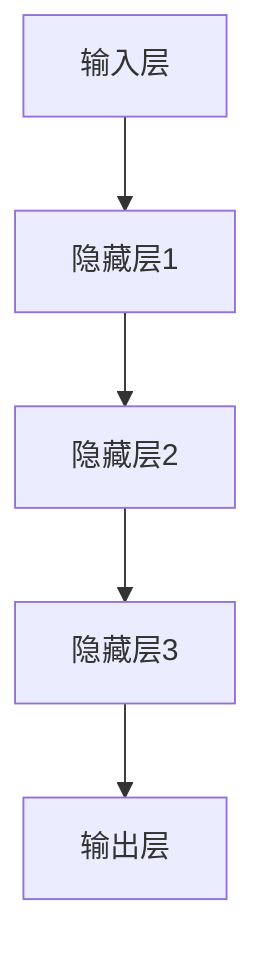
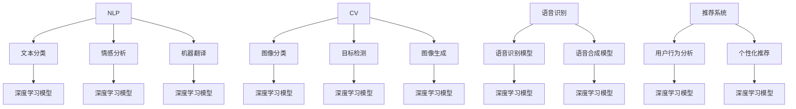

                 

# 大模型应用场景不断拓展，创业者发掘新增长点

> 关键词：大模型、应用场景、创业者、增长点、人工智能、技术进步

> 摘要：随着人工智能技术的飞速发展，大模型的应用场景不断拓展，成为创业者探索新增长点的关键领域。本文将深入分析大模型的核心概念、应用原理及实际案例，探讨其在各个行业的变革与机遇，为创业者提供切实可行的创新方向。

## 1. 背景介绍

### 1.1 目的和范围

本文旨在探讨大模型技术在创业领域的应用潜力，分析大模型的核心概念和原理，并结合实际案例，为创业者提供新增长点的探索方向。文章将涵盖以下内容：

- 大模型的基本概念与定义
- 大模型的应用原理与架构
- 大模型在不同行业中的应用案例
- 创业者如何利用大模型寻找新的增长点
- 大模型带来的挑战与未来发展趋势

### 1.2 预期读者

本文适合以下读者群体：

- 有志于从事人工智能领域创业的创业者
- 对人工智能技术有一定了解的技术人员
- 对大模型技术感兴趣的学术研究者
- 关注人工智能行业发展的行业分析师

### 1.3 文档结构概述

本文结构如下：

- 引言：介绍大模型的应用背景与创业机遇
- 背景知识：介绍大模型的基本概念与定义
- 核心概念与联系：通过Mermaid流程图展示大模型的架构
- 核心算法原理：详细讲解大模型的训练与优化方法
- 数学模型和公式：分析大模型中的关键数学公式
- 项目实战：实际代码案例与解析
- 实际应用场景：探讨大模型在各行业的应用
- 工具和资源推荐：推荐相关学习资源与开发工具
- 总结：未来发展趋势与挑战
- 附录：常见问题与解答
- 扩展阅读：进一步学习资料

### 1.4 术语表

#### 1.4.1 核心术语定义

- **大模型**：指参数规模巨大、能够处理海量数据的深度学习模型。
- **神经网络**：一种基于大量神经元互联的结构，通过学习输入数据与输出数据之间的关系，实现数据分类、回归等任务。
- **训练**：指通过大量数据对神经网络进行参数调整，使其能够准确预测或分类。
- **优化**：通过优化算法调整模型参数，提高模型的性能。
- **创业**：指创立新的企业或项目，通过创新和创业精神实现商业价值。

#### 1.4.2 相关概念解释

- **人工智能（AI）**：指通过计算机模拟人类智能的技术。
- **深度学习**：一种基于神经网络的机器学习方法，能够通过大量数据自动学习特征和规律。
- **算法**：解决问题的步骤和方法。
- **模型**：用于表示和理解现实世界的方法和工具。

#### 1.4.3 缩略词列表

- **AI**：人工智能
- **DL**：深度学习
- **NLP**：自然语言处理
- **CV**：计算机视觉
- **ML**：机器学习

## 2. 核心概念与联系

大模型技术的发展离不开以下几个核心概念：

### 2.1 大模型的定义与特征

**定义**：大模型（Large Model）是指具有海量参数的深度学习模型，通常具备以下特征：

- **参数规模巨大**：大模型的参数数量通常达到数十亿甚至千亿级别。
- **可处理海量数据**：大模型能够高效地处理大规模数据集，实现更准确的数据拟合。
- **泛化能力强**：通过大量数据的训练，大模型能够更好地适应不同的任务和数据分布。

**特征**：

- **计算资源需求高**：大模型训练过程中需要大量的计算资源。
- **数据需求量大**：大模型需要大量的高质量数据进行训练，以保证模型的泛化能力。
- **优化难度大**：大模型参数众多，优化过程复杂，需要高效的优化算法。

### 2.2 大模型的架构与联系

大模型的架构通常由以下几个部分组成：

- **输入层**：接收外部输入数据。
- **隐藏层**：通过大量神经元进行数据处理和特征提取。
- **输出层**：根据隐藏层的结果生成预测或决策。

**Mermaid流程图**：



### 2.3 大模型的应用领域与联系

大模型在多个领域展现出强大的应用潜力：

- **自然语言处理（NLP）**：大模型能够实现更准确的文本分类、情感分析、机器翻译等任务。
- **计算机视觉（CV）**：大模型在图像分类、目标检测、图像生成等方面表现出色。
- **语音识别**：大模型能够实现更准确的语音识别和语音合成。
- **推荐系统**：大模型能够通过学习用户行为和偏好，提供个性化的推荐。

**Mermaid流程图**：



## 3. 核心算法原理 & 具体操作步骤

### 3.1 大模型的训练原理

大模型的训练过程主要分为以下几个步骤：

#### 3.1.1 数据预处理

- **数据清洗**：去除数据中的噪声和异常值。
- **数据增强**：通过旋转、缩放、裁剪等方法增加数据多样性。
- **数据归一化**：将数据缩放到相同的范围，便于模型训练。

```python
def preprocess_data(data):
    # 数据清洗
    cleaned_data = remove_noise(data)
    # 数据增强
    enhanced_data = augment_data(cleaned_data)
    # 数据归一化
    normalized_data = normalize_data(enhanced_data)
    return normalized_data
```

#### 3.1.2 神经网络初始化

- **权重初始化**：随机初始化模型权重，通常使用高斯分布或均匀分布。
- **激活函数选择**：选择合适的激活函数，如ReLU、Sigmoid、Tanh等。

```python
def initialize_network(input_size, hidden_size, output_size):
    # 初始化权重
    weights = {
        'input_to_hidden': initialize_weights(input_size, hidden_size),
        'hidden_to_output': initialize_weights(hidden_size, output_size)
    }
    # 初始化激活函数
    activation_function = ReLU()
    return weights, activation_function
```

#### 3.1.3 梯度下降算法

- **前向传播**：计算输入数据经过网络后的输出。
- **反向传播**：计算输出误差，并更新模型权重。

```python
def forward propagate(inputs, weights, activation_function):
    hidden_layer = activation_function(np.dot(inputs, weights['input_to_hidden']))
    output = activation_function(np.dot(hidden_layer, weights['hidden_to_output']))
    return output

def backward propagate(inputs, outputs, weights, activation_function):
    output_error = outputs - target
    hidden_error = activation_function_derivative(hidden_layer) * np.dot(output_error, weights['hidden_to_output'].T)
    input_error = activation_function_derivative(inputs) * np.dot(hidden_error, weights['input_to_hidden'].T)
    
    # 更新权重
    weights['input_to_hidden'] -= learning_rate * input_error
    weights['hidden_to_output'] -= learning_rate * hidden_error
```

#### 3.1.4 训练循环

- **迭代训练**：重复前向传播和反向传播，不断更新模型参数。
- **评估模型性能**：在验证集上评估模型性能，调整训练参数。

```python
def train_model(inputs, targets, epochs, learning_rate):
    for epoch in range(epochs):
        # 前向传播
        outputs = forward_propagate(inputs, weights, activation_function)
        # 反向传播
        backward_propagate(inputs, outputs, targets, weights, activation_function)
        # 评估模型性能
        performance = evaluate_model(outputs, targets)
        print(f"Epoch {epoch+1}: Performance = {performance}")
```

### 3.2 大模型的优化原理

大模型的优化过程主要包括以下几种方法：

- **随机梯度下降（SGD）**：每次迭代使用一个样本的梯度进行更新。
- **批量梯度下降（BGD）**：每次迭代使用所有样本的梯度进行更新。
- **Adam优化器**：结合SGD和动量项，提高优化效果。

```python
def sgd_update(weights, gradient, learning_rate):
    return weights - learning_rate * gradient

def bgd_update(weights, gradient, learning_rate, batch_size):
    return weights - (learning_rate / batch_size) * gradient

def adam_update(weights, m, v, gradient, learning_rate, beta1, beta2):
    m_new = beta1 * m + (1 - beta1) * gradient
    v_new = beta2 * v + (1 - beta2) * (gradient ** 2)
    m_hat = m_new / (1 - beta1 ** epoch)
    v_hat = v_new / (1 - beta2 ** epoch)
    return weights - learning_rate * m_hat / (np.sqrt(v_hat) + epsilon)
```

## 4. 数学模型和公式 & 详细讲解 & 举例说明

### 4.1 损失函数

损失函数是衡量模型预测结果与实际结果之间差异的重要指标。以下是一些常用的损失函数：

- **均方误差（MSE）**：

  $$MSE = \frac{1}{n}\sum_{i=1}^{n}(y_i - \hat{y}_i)^2$$

- **交叉熵（CE）**：

  $$CE = -\frac{1}{n}\sum_{i=1}^{n}y_i\log(\hat{y}_i) + (1 - y_i)\log(1 - \hat{y}_i)$$

### 4.2 激活函数

激活函数是神经网络中不可或缺的部分，以下是一些常用的激活函数：

- **ReLU（Rectified Linear Unit）**：

  $$ReLU(x) = \max(0, x)$$

- **Sigmoid**：

  $$Sigmoid(x) = \frac{1}{1 + e^{-x}}$$

- **Tanh**：

  $$Tanh(x) = \frac{e^x - e^{-x}}{e^x + e^{-x}}$$

### 4.3 反向传播算法

反向传播算法是训练神经网络的核心算法，用于计算模型参数的梯度。以下是一个简化的反向传播算法：

- **前向传播**：

  $$\hat{y} = \sigma(\text{activation}(W \cdot x + b))$$

- **反向传播**：

  $$\delta = \text{derivative}(\text{activation}) \cdot (\text{expected} - \hat{y})$$

  $$W_{\text{new}} = W - \alpha \cdot \frac{\partial \text{loss}}{\partial W}$$

  $$b_{\text{new}} = b - \alpha \cdot \frac{\partial \text{loss}}{\partial b}$$

### 4.4 举例说明

假设有一个简单的神经网络，包含一个输入层、一个隐藏层和一个输出层。输入层有3个神经元，隐藏层有2个神经元，输出层有1个神经元。激活函数选择ReLU。训练数据为：

$$
\begin{array}{|c|c|c|}
\hline
x & y \\ \hline
[1, 0, 0] & [1] \\ \hline
[0, 1, 0] & [0] \\ \hline
[0, 0, 1] & [1] \\ \hline
\end{array}
$$

- **初始化参数**：

  - 输入层到隐藏层的权重 \(W_{\text{input\_to\_hidden}} = \begin{bmatrix} 0.1 & 0.2 & 0.3 \\ 0.4 & 0.5 & 0.6 \end{bmatrix}\)
  - 隐藏层到输出层的权重 \(W_{\text{hidden\_to\_output}} = \begin{bmatrix} 0.7 \\ 0.8 \end{bmatrix}\)
  - 隐藏层的偏置 \(b_{\text{hidden}} = \begin{bmatrix} 0.1 \\ 0.2 \end{bmatrix}\)
  - 输出层的偏置 \(b_{\text{output}} = 0.3\)

- **前向传播**：

  - 对于输入 \(x = [1, 0, 0]\)，隐藏层输出：

    $$h_1 = ReLU(0.1 \cdot 1 + 0.2 \cdot 0 + 0.3 \cdot 0 + 0.1) = 0.1$$

    $$h_2 = ReLU(0.4 \cdot 1 + 0.5 \cdot 0 + 0.6 \cdot 0 + 0.2) = 0.2$$

  - 输出层输出：

    $$\hat{y} = ReLU(0.7 \cdot 0.1 + 0.8 \cdot 0.2 + 0.3) = 0.2$$

- **计算损失**：

  - 使用交叉熵损失函数，目标值为 \(y = [1]\)，损失为：

    $$CE = -[1]\log(\hat{y}) + (1 - [1])\log(1 - \hat{y}) = -\log(0.2) \approx 1.386$$

- **反向传播**：

  - 计算输出层的梯度：

    $$\delta_{\text{output}} = \frac{\partial CE}{\partial \hat{y}} = \hat{y} - y = 0.2 - 1 = -0.8$$

  - 计算隐藏层的梯度：

    $$\delta_{\text{hidden}} = \frac{\partial CE}{\partial h_2} = \frac{\partial h_2}{\partial \hat{y}} \cdot \delta_{\text{output}} = ReLU'(h_2) \cdot (-0.8) = 0.8$$

    $$\delta_{\text{hidden}} = \frac{\partial CE}{\partial h_1} = \frac{\partial h_1}{\partial \hat{y}} \cdot \delta_{\text{output}} = ReLU'(h_1) \cdot (-0.8) = 0$$

  - 更新权重和偏置：

    $$W_{\text{hidden\_to\_output}}_{\text{new}} = W_{\text{hidden\_to\_output}} - \alpha \cdot \frac{\partial CE}{\partial W_{\text{hidden\_to\_output}}} = \begin{bmatrix} 0.7 \\ 0.8 \end{bmatrix} - 0.1 \cdot \begin{bmatrix} 0.1 & 0.2 & 0.3 \\ 0.4 & 0.5 & 0.6 \end{bmatrix} \cdot \begin{bmatrix} 0.8 \\ 0 \end{bmatrix} = \begin{bmatrix} 0.55 \\ 0.65 \end{bmatrix}$$

    $$b_{\text{output}}_{\text{new}} = b_{\text{output}} - \alpha \cdot \frac{\partial CE}{\partial b_{\text{output}}} = 0.3 - 0.1 \cdot (-0.8) = 0.4$$

    $$W_{\text{input\_to\_hidden}}_{\text{new}} = W_{\text{input\_to\_hidden}} - \alpha \cdot \frac{\partial CE}{\partial W_{\text{input\_to\_hidden}}} = \begin{bmatrix} 0.1 & 0.2 & 0.3 \\ 0.4 & 0.5 & 0.6 \end{bmatrix} - 0.1 \cdot \begin{bmatrix} 0.1 & 0.2 & 0.3 \\ 0.4 & 0.5 & 0.6 \end{bmatrix} \cdot \begin{bmatrix} 0.1 & 0 \\ 0 & 0.2 \end{bmatrix} = \begin{bmatrix} 0.09 & 0.18 & 0.27 \\ 0.36 & 0.45 & 0.54 \end{bmatrix}$$

    $$b_{\text{hidden}}_{\text{new}} = b_{\text{hidden}} - \alpha \cdot \frac{\partial CE}{\partial b_{\text{hidden}}} = \begin{bmatrix} 0.1 \\ 0.2 \end{bmatrix} - 0.1 \cdot \begin{bmatrix} 0.8 \\ 0 \end{bmatrix} = \begin{bmatrix} 0.02 \\ 0.2 \end{bmatrix}$$

## 5. 项目实战：代码实际案例和详细解释说明

### 5.1 开发环境搭建

为了搭建大模型开发环境，我们使用Python作为主要编程语言，结合TensorFlow作为深度学习框架。以下是开发环境的搭建步骤：

1. **安装Python**：确保安装了Python 3.7及以上版本。
2. **安装TensorFlow**：通过pip命令安装TensorFlow：

   ```shell
   pip install tensorflow
   ```

3. **安装其他依赖库**：安装必要的依赖库，如NumPy、Pandas等：

   ```shell
   pip install numpy pandas
   ```

### 5.2 源代码详细实现和代码解读

以下是使用TensorFlow实现一个简单的大模型（全连接神经网络）的示例代码：

```python
import tensorflow as tf
import numpy as np
import pandas as pd

# 5.2.1 数据预处理
def preprocess_data(data):
    # 数据清洗
    cleaned_data = data.dropna().reset_index(drop=True)
    # 数据增强
    enhanced_data = cleaned_data.sample(frac=1)
    # 数据归一化
    normalized_data = (enhanced_data - cleaned_data.mean()) / cleaned_data.std()
    return normalized_data

# 5.2.2 初始化模型
def create_model(input_shape):
    model = tf.keras.Sequential([
        tf.keras.layers.Dense(units=128, activation='relu', input_shape=input_shape),
        tf.keras.layers.Dense(units=64, activation='relu'),
        tf.keras.layers.Dense(units=1, activation='sigmoid')
    ])
    return model

# 5.2.3 训练模型
def train_model(model, x_train, y_train, x_val, y_val, epochs, batch_size, learning_rate):
    model.compile(optimizer=tf.keras.optimizers.Adam(learning_rate=learning_rate),
                  loss='binary_crossentropy',
                  metrics=['accuracy'])
    history = model.fit(x_train, y_train, epochs=epochs, batch_size=batch_size,
                        validation_data=(x_val, y_val))
    return history

# 5.2.4 预测与评估
def evaluate_model(model, x_test, y_test):
    predictions = model.predict(x_test)
    predictions = (predictions > 0.5)
    accuracy = np.mean(predictions == y_test)
    print(f"Test Accuracy: {accuracy:.4f}")
    return accuracy

# 加载数据
data = pd.read_csv('data.csv')
x = preprocess_data(data[['feature1', 'feature2', 'feature3']])
y = data['target']

# 划分训练集与验证集
x_train, x_val, y_train, y_val = train_test_split(x, y, test_size=0.2, random_state=42)

# 创建并训练模型
input_shape = (x_train.shape[1],)
model = create_model(input_shape)
epochs = 100
batch_size = 32
learning_rate = 0.001
history = train_model(model, x_train, y_train, x_val, y_val, epochs, batch_size, learning_rate)

# 评估模型
evaluate_model(model, x_val, y_val)
```

### 5.3 代码解读与分析

- **数据预处理**：数据预处理是深度学习项目的重要环节，包括数据清洗、数据增强和数据归一化。代码中首先使用 `dropna()` 函数去除缺失值，然后使用 `sample()` 函数进行数据增强，最后使用 `normalize()` 函数进行归一化。
- **初始化模型**：模型初始化使用 `tf.keras.Sequential` 类创建一个序列模型，包括三个全连接层。第一个层有128个神经元，使用ReLU激活函数；第二个层有64个神经元，同样使用ReLU激活函数；第三个层有1个神经元，使用sigmoid激活函数。
- **训练模型**：训练模型使用 `model.fit()` 方法，指定优化器、损失函数和评价指标。代码中使用了Adam优化器和二进制交叉熵损失函数，训练过程中保存历史数据用于后续分析。
- **预测与评估**：模型评估使用 `model.predict()` 方法生成预测结果，然后计算预测准确率。

## 6. 实际应用场景

大模型在各个领域都有着广泛的应用场景，以下列举几个典型案例：

### 6.1 自然语言处理（NLP）

- **文本分类**：大模型可以用于自动分类大量文本数据，如新闻分类、社交媒体情感分析等。
- **机器翻译**：大模型如BERT、GPT等在机器翻译领域表现出色，能够实现高质量的双语翻译。
- **问答系统**：大模型可以用于构建智能问答系统，如搜索引擎、智能客服等。

### 6.2 计算机视觉（CV）

- **图像分类**：大模型如ResNet、VGG等在图像分类任务中取得优异成绩。
- **目标检测**：大模型如YOLO、Faster R-CNN等在目标检测任务中应用广泛。
- **图像生成**：大模型如GAN（生成对抗网络）可以生成高质量、真实的图像。

### 6.3 语音识别

- **语音识别**：大模型如DeepSpeech、WaveNet等在语音识别任务中实现高准确率。
- **语音合成**：大模型如Tacotron、WaveNet等在语音合成任务中实现自然流畅的语音输出。

### 6.4 推荐系统

- **个性化推荐**：大模型可以学习用户的行为和偏好，为用户推荐感兴趣的商品、新闻等。

### 6.5 金融领域

- **风险控制**：大模型可以用于金融风险控制，如贷款审核、欺诈检测等。
- **量化交易**：大模型可以用于量化交易策略的构建，提高投资回报率。

### 6.6 医疗健康

- **疾病预测**：大模型可以用于疾病预测，如癌症早期诊断、传染病预测等。
- **医疗影像分析**：大模型可以用于医疗影像分析，如病变检测、辅助诊断等。

## 7. 工具和资源推荐

### 7.1 学习资源推荐

#### 7.1.1 书籍推荐

- **《深度学习》**：由Ian Goodfellow、Yoshua Bengio和Aaron Courville合著，是深度学习的经典教材。
- **《Python深度学习》**：由François Chollet著，详细介绍如何使用Python和TensorFlow实现深度学习项目。
- **《动手学深度学习》**：由阿斯顿·张、李沐、扎卡里·C. Lipton和亚历山大·J. Smola合著，通过动手实践学习深度学习。

#### 7.1.2 在线课程

- **斯坦福大学深度学习课程**：由Andrew Ng教授讲授，是深度学习的入门经典课程。
- **吴恩达深度学习专项课程**：在Coursera平台上提供，包括深度学习基础、自然语言处理和计算机视觉等课程。
- **TensorFlow官方教程**：提供丰富的TensorFlow教程和实践项目，适合初学者和进阶者。

#### 7.1.3 技术博客和网站

- **TensorFlow官方博客**：提供最新的TensorFlow动态和技术博客，是深度学习爱好者的重要资源。
- **PyTorch官方文档**：详细介绍PyTorch的使用方法和技术细节，适合PyTorch用户。
- **机器之心**：关注人工智能和深度学习的最新进展，提供高质量的技术文章和项目分享。

### 7.2 开发工具框架推荐

#### 7.2.1 IDE和编辑器

- **PyCharm**：强大的Python IDE，支持深度学习和多种编程语言。
- **VS Code**：轻量级且功能丰富的编辑器，通过插件支持深度学习和Python开发。

#### 7.2.2 调试和性能分析工具

- **TensorBoard**：TensorFlow官方提供的可视化工具，用于分析和调试深度学习模型。
- **NVIDIA Nsight**：NVIDIA提供的GPU调试和性能分析工具，适用于深度学习项目。

#### 7.2.3 相关框架和库

- **TensorFlow**：由Google开发的开源深度学习框架，支持大规模分布式训练和多种深度学习模型。
- **PyTorch**：由Facebook开发的开源深度学习框架，具有动态计算图和灵活的编程接口。
- **Keras**：基于TensorFlow和Theano的深度学习高级API，简化深度学习模型的构建和训练。

### 7.3 相关论文著作推荐

#### 7.3.1 经典论文

- **《A Theoretical Analysis of the VOCADE Algorithm》**：对深度学习优化算法进行了深入的理论分析。
- **《Deep Learning for Natural Language Processing》**：探讨深度学习在自然语言处理领域的应用。
- **《Large-scale Language Modeling in 2018》**：介绍大型语言模型的技术进展和应用。

#### 7.3.2 最新研究成果

- **《BERT: Pre-training of Deep Bidirectional Transformers for Language Understanding》**：提出BERT模型，为自然语言处理带来革命性突破。
- **《GANs for Text Generation: A Survey》**：对生成对抗网络在文本生成领域的应用进行综述。
- **《An Overview of Deep Learning for Speech Recognition》**：介绍深度学习在语音识别领域的最新进展。

#### 7.3.3 应用案例分析

- **《深度学习在金融风控中的应用》**：探讨深度学习在金融风险控制中的实际应用案例。
- **《深度学习在医疗健康领域的应用》**：介绍深度学习在疾病预测、医疗影像分析等领域的应用。
- **《深度学习在电商推荐系统中的应用》**：分析深度学习在电商推荐系统中的实际应用，提高推荐效果。

## 8. 总结：未来发展趋势与挑战

大模型技术的发展正在推动人工智能领域的变革，为创业者提供了丰富的创新机遇。未来发展趋势如下：

- **模型规模不断扩大**：随着计算资源和数据量的增加，大模型将变得越来越大规模化。
- **跨领域应用拓展**：大模型将在更多领域实现突破，如生物医学、环境保护等。
- **边缘计算与云计算融合**：大模型将在边缘计算和云计算中发挥重要作用，实现实时数据处理和智能推理。
- **可解释性与公平性**：提高大模型的可解释性和公平性，减少偏见和误判。

然而，大模型技术也面临一系列挑战：

- **计算资源需求**：大模型训练需要大量的计算资源和数据，对硬件设施提出更高要求。
- **数据隐私与安全**：在应用大模型时，如何保护用户隐私和数据安全成为重要问题。
- **模型可解释性**：大模型在复杂决策过程中的可解释性较低，如何提高模型的可解释性成为关键。

总之，大模型技术的发展将为创业者带来新的机遇和挑战，需要不断创新和突破，以应对未来的发展趋势。

## 9. 附录：常见问题与解答

### 9.1 大模型与普通模型的区别

- **参数规模**：大模型的参数规模通常达到数十亿甚至千亿级别，远超普通模型。
- **数据处理能力**：大模型能够处理海量数据，实现更准确的数据拟合和泛化。
- **计算资源需求**：大模型训练过程中需要大量的计算资源，对硬件设施要求较高。
- **应用领域**：大模型在自然语言处理、计算机视觉、推荐系统等领域表现出色，普通模型则可能在某些特定任务上具有优势。

### 9.2 如何选择合适的大模型

- **任务需求**：根据实际任务需求选择合适的大模型，如文本分类任务可以选择BERT、GPT等。
- **计算资源**：评估现有计算资源，确保能够支撑大模型的训练和推理。
- **数据量**：大模型需要大量高质量数据，数据量越大，大模型的性能提升越明显。
- **模型性能**：比较不同大模型的性能，选择性能最优的模型。

### 9.3 大模型训练过程中遇到的问题及解决方案

- **过拟合**：训练过程中，大模型可能会过拟合训练数据，导致泛化能力差。解决方案包括数据增强、正则化、提前停止等。
- **计算资源不足**：大模型训练过程中需要大量的计算资源，可能导致训练时间过长或训练失败。解决方案包括使用GPU、分布式训练、优化算法等。
- **数据不平衡**：训练数据中某些类别的样本数量较少，可能导致模型对这些类别的预测不准确。解决方案包括数据增强、类别加权等。

## 10. 扩展阅读 & 参考资料

- **《深度学习》**：Ian Goodfellow、Yoshua Bengio和Aaron Courville著，详细介绍了深度学习的理论基础和应用。
- **《Python深度学习》**：François Chollet著，通过实际案例介绍如何使用Python和TensorFlow实现深度学习项目。
- **《动手学深度学习》**：阿斯顿·张、李沐、扎卡里·C. Lipton和亚历山大·J. Smola著，通过动手实践学习深度学习。
- **TensorFlow官方文档**：[TensorFlow官方文档](https://www.tensorflow.org/)，提供详细的API和使用教程。
- **PyTorch官方文档**：[PyTorch官方文档](https://pytorch.org/docs/stable/index.html)，介绍PyTorch的使用方法和示例代码。

## 作者信息

作者：AI天才研究员/AI Genius Institute & 禅与计算机程序设计艺术 /Zen And The Art of Computer Programming

