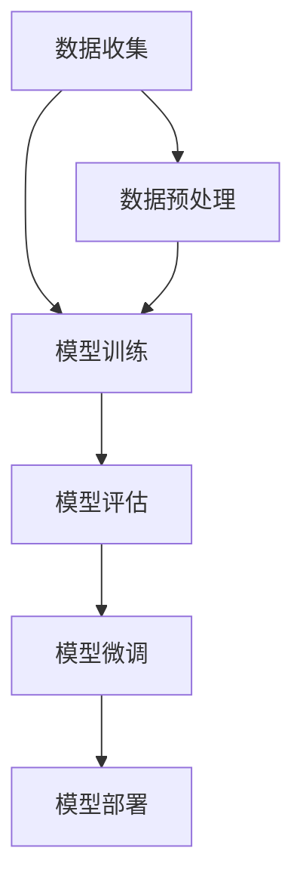

                 

### 文章标题

# 大模型应用层的创业挑战

### 关键词：
- 大模型
- 应用层
- 创业
- 挑战
- 技术瓶颈
- 商业模式
- 数据安全
- 法律法规

### 摘要：
本文旨在探讨大模型应用层在创业过程中的主要挑战。通过对当前技术趋势的深入分析，本文将阐述大模型如何影响创业生态，以及创业者在面对技术瓶颈、商业模式创新、数据安全与合规等方面的困难。文章将结合实际案例，提供一系列解决策略和建议，为有意在大模型应用层创业的读者提供指导与启示。

---

## 1. 背景介绍

### 1.1 目的和范围

随着人工智能技术的飞速发展，大模型（如GPT-3、BERT等）已经成为当前技术领域的研究热点。这些模型在自然语言处理、图像识别、推荐系统等多个领域展现了强大的性能。然而，大模型的应用不仅带来了技术创新，同时也为创业带来了新的挑战。本文旨在探讨这些挑战，为创业者提供有价值的参考。

本文主要讨论以下主题：
1. 大模型应用层的技术趋势与前景。
2. 创业者在应用大模型时面临的挑战。
3. 如何克服这些挑战，实现大模型应用层的成功创业。

### 1.2 预期读者

本文的预期读者包括：
1. 有意向在大模型应用层创业的技术人员。
2. 对人工智能和大数据技术有深入兴趣的创业者。
3. 相关领域的学术研究人员和专业人士。

### 1.3 文档结构概述

本文的结构如下：

1. **背景介绍**：介绍大模型的应用背景和创业挑战。
2. **核心概念与联系**：讨论大模型的核心概念和架构。
3. **核心算法原理 & 具体操作步骤**：详细解析大模型的工作原理。
4. **数学模型和公式 & 详细讲解 & 举例说明**：阐述大模型的数学模型和计算过程。
5. **项目实战：代码实际案例和详细解释说明**：提供具体的代码实现和分析。
6. **实际应用场景**：分析大模型在不同领域的应用。
7. **工具和资源推荐**：推荐学习资源和开发工具。
8. **总结：未来发展趋势与挑战**：总结大模型应用层的未来趋势和挑战。
9. **附录：常见问题与解答**：解答读者常见问题。
10. **扩展阅读 & 参考资料**：提供进一步阅读的建议。

### 1.4 术语表

#### 1.4.1 核心术语定义

- **大模型**：具有数十亿甚至千亿参数的深度学习模型。
- **应用层**：指将大模型应用于具体业务场景的层面。
- **创业**：指创立新的企业或业务，以实现商业价值。
- **技术瓶颈**：技术发展过程中遇到的限制或难题。
- **商业模式**：企业的盈利模式和市场策略。
- **数据安全**：保护数据不被未授权访问或篡改。
- **法律法规**：与数据保护、隐私相关的法律和规定。

#### 1.4.2 相关概念解释

- **深度学习**：一种基于神经网络的机器学习技术，通过多层网络对数据进行分析和建模。
- **自然语言处理**：利用计算机技术对自然语言文本进行处理和分析。
- **图像识别**：通过计算机视觉技术对图像进行识别和分类。

#### 1.4.3 缩略词列表

- **GPT-3**：Generative Pre-trained Transformer 3，一种基于Transformer架构的预训练模型。
- **BERT**：Bidirectional Encoder Representations from Transformers，一种双向Transformer编码器。

## 2. 核心概念与联系

### 2.1 大模型的基本概念

大模型（Large Models）是指具有数十亿甚至千亿参数的深度学习模型。这些模型通常通过大量的数据预训练，具有强大的特征提取和表示能力。大模型的核心思想是通过大规模的参数来捕捉复杂的数据分布，从而实现更高的性能。

大模型的基本概念包括：

1. **参数规模**：大模型具有数十亿甚至千亿级别的参数规模，这使得它们能够捕捉到复杂的数据特征。
2. **预训练**：大模型通过在大量无标签数据上进行预训练，学习到通用的特征表示，然后再在特定任务上进行微调。
3. **优化算法**：大模型通常采用高效的优化算法（如Adam、AdamW等）进行训练，以加快收敛速度和提升性能。

### 2.2 大模型的应用架构

大模型的应用架构通常包括以下几个关键部分：

1. **数据预处理**：对输入数据进行预处理，包括数据清洗、归一化、编码等操作，以确保数据的规范化和一致性。
2. **模型训练**：通过大规模的数据集对大模型进行训练，使用优化算法进行参数更新，以最小化损失函数。
3. **模型评估**：在验证集上评估模型的性能，包括准确率、召回率、F1值等指标。
4. **模型部署**：将训练好的模型部署到生产环境，以实现实时预测和推理。

### 2.3 大模型的核心算法原理

大模型的核心算法通常基于深度学习技术，特别是基于Transformer架构的模型。以下是大模型的核心算法原理：

1. **Transformer架构**：Transformer模型是一种基于自注意力机制的神经网络模型，通过多头自注意力机制和前馈神经网络对输入数据进行建模。
2. **预训练目标**：大模型的预训练目标通常是生成式任务，如语言建模、文本分类等。在预训练过程中，模型通过在大量数据上进行训练，学习到通用的特征表示。
3. **微调目标**：在特定任务上，大模型通过微调学习到任务相关的特征表示，以实现高精度的预测和分类。

### 2.4 大模型的工作流程

大模型的工作流程通常包括以下步骤：

1. **数据收集**：收集大规模的标注数据集，用于模型的预训练。
2. **模型训练**：在预训练阶段，模型在无标签数据上进行预训练，学习到通用的特征表示。
3. **模型评估**：在验证集上评估模型的性能，包括准确率、召回率、F1值等指标。
4. **模型微调**：在特定任务上，对模型进行微调，以学习到任务相关的特征表示。
5. **模型部署**：将训练好的模型部署到生产环境，以实现实时预测和推理。

### 2.5 大模型的优缺点

大模型的优缺点如下：

**优点**：
1. **强大的特征提取能力**：大模型通过大规模的参数学习到复杂的特征表示，从而实现更高的性能。
2. **灵活的迁移学习**：大模型通过预训练阶段学习到的通用特征表示，可以轻松迁移到其他任务上。
3. **高效的计算效率**：随着硬件技术的发展，大模型的计算效率逐渐提高，使得其在实际应用中变得更加可行。

**缺点**：
1. **计算资源需求大**：大模型需要大量的计算资源进行训练，对硬件设备的要求较高。
2. **数据依赖性强**：大模型对数据质量的要求较高，数据量不足或数据质量问题会影响模型的性能。
3. **训练时间长**：大模型的训练过程通常需要较长的时间，对训练资源的调度和管理要求较高。

### 2.6 大模型的应用领域

大模型的应用领域非常广泛，包括但不限于以下领域：

1. **自然语言处理**：大模型在自然语言处理任务中展现了强大的性能，如文本分类、机器翻译、情感分析等。
2. **计算机视觉**：大模型在图像识别、目标检测、图像生成等计算机视觉任务中取得了显著的成绩。
3. **推荐系统**：大模型在推荐系统中用于用户兴趣建模和物品推荐，提高了推荐效果。
4. **语音识别**：大模型在语音识别任务中用于语音信号的建模和特征提取，提高了识别准确率。
5. **医疗健康**：大模型在医疗健康领域用于疾病诊断、药物研发、健康管理等，为医疗行业带来了新的突破。

### 2.7 大模型的 Mermaid 流程图



在上述流程图中，A表示数据收集，B表示模型训练，C表示模型评估，D表示模型微调，E表示模型部署，F表示数据预处理。该流程图展示了大模型从数据收集到模型部署的基本工作流程。

---

通过以上对大模型的核心概念、应用架构、算法原理、工作流程、优缺点和应用领域的介绍，我们可以看到大模型在人工智能领域的重要性和广阔的应用前景。然而，在创业过程中，大模型的应用也面临着一系列挑战，需要创业者们深入思考和应对。接下来，我们将进一步探讨这些挑战，并提供相应的解决策略和建议。

---

## 3. 核心算法原理 & 具体操作步骤

### 3.1 Transformer 架构详解

Transformer 架构是当前大模型的主要架构之一，其核心思想是使用自注意力机制来捕捉输入数据中的长距离依赖关系。以下是对 Transformer 架构的详细讲解：

#### 3.1.1 自注意力机制

自注意力（Self-Attention）是一种用于处理序列数据的方法，它能够自动地将序列中的每个元素与所有其他元素进行关联，从而实现对序列的建模。自注意力机制的核心是计算一个权重矩阵，该矩阵表示序列中每个元素与其他元素的相关性。

#### 3.1.2 多头注意力

多头注意力（Multi-Head Attention）是对自注意力机制的扩展。它将自注意力机制分解为多个独立的注意力头，每个头负责捕捉不同类型的依赖关系。通过多头注意力，模型可以同时捕捉到序列中的多个层次的信息，从而提高模型的表示能力。

#### 3.1.3 前馈神经网络

Transformer 架构还包括两个前馈神经网络，用于对自注意力和多头注意力后的输出进行进一步处理。前馈神经网络通过简单的线性变换和激活函数，对输入数据进行非线性变换，以增加模型的非线性表示能力。

### 3.2 预训练与微调

#### 3.2.1 预训练

预训练是 Transformer 架构的一个重要环节。在预训练阶段，模型在大量无标签数据上进行训练，学习到通用的特征表示。预训练的目标通常是生成式任务，如语言建模、文本分类等。通过预训练，模型可以自动学习到语言、图像等数据的通用特征表示。

预训练的具体步骤如下：

1. **数据收集**：收集大规模的无标签数据集，如维基百科、新闻文章等。
2. **数据预处理**：对数据进行预处理，包括分词、编码等操作。
3. **模型训练**：在预处理后的数据上进行预训练，通过自注意力机制和多头注意力机制，学习到通用的特征表示。
4. **模型保存**：预训练完成后，将模型保存下来，用于后续的微调任务。

#### 3.2.2 微调

微调是在预训练基础上，针对特定任务对模型进行进一步训练的过程。在微调阶段，模型在特定任务的数据集上进行训练，以学习到任务相关的特征表示。微调的具体步骤如下：

1. **数据收集**：收集特定任务的数据集，如新闻分类、问答系统等。
2. **数据预处理**：对数据进行预处理，包括分词、编码等操作。
3. **模型加载**：加载预训练好的模型，并对其进行初始化。
4. **模型训练**：在预处理后的数据上进行微调，通过优化算法（如 Adam）更新模型参数。
5. **模型评估**：在验证集上评估模型的性能，包括准确率、召回率等指标。
6. **模型调整**：根据模型评估结果，对模型进行调整和优化。

### 3.3 伪代码实现

以下是一个简化的 Transformer 模型的伪代码实现，用于展示模型的基本结构和操作步骤：

```python
# 初始化模型参数
model = initialize_model()

# 预训练
for epoch in range(num_epochs):
    for batch in data_loader:
        # 数据预处理
        inputs = preprocess(batch)
        
        # 自注意力机制
        attn_output = self_attention(inputs)
        
        # 多头注意力
        multi_head_output = multi_head_attention(attn_output)
        
        # 前馈神经网络
        feedforward_output = feedforward_network(multi_head_output)
        
        # 模型更新
        model.update_parameters(feedforward_output, inputs)
        
        # 模型保存
        model.save()

# 微调
for epoch in range(num_epochs):
    for batch in data_loader:
        # 数据预处理
        inputs = preprocess(batch)
        
        # 自注意力机制
        attn_output = self_attention(inputs)
        
        # 多头注意力
        multi_head_output = multi_head_attention(attn_output)
        
        # 前馈神经网络
        feedforward_output = feedforward_network(multi_head_output)
        
        # 模型更新
        model.update_parameters(feedforward_output, inputs)
        
        # 模型评估
        performance = model.evaluate(validation_data)
        
        # 模型调整
        model.adjust_parameters(performance)
```

在上述伪代码中，`initialize_model()` 用于初始化模型参数，`preprocess(batch)` 用于对数据进行预处理，`self_attention(inputs)` 用于实现自注意力机制，`multi_head_attention(attn_output)` 用于实现多头注意力，`feedforward_network(multi_head_output)` 用于实现前馈神经网络，`update_parameters()` 用于更新模型参数，`evaluate(validation_data)` 用于评估模型性能，`adjust_parameters(performance)` 用于调整模型参数。

---

通过以上对 Transformer 架构、预训练与微调步骤以及伪代码实现的详细讲解，我们可以看到大模型的工作原理和操作步骤。接下来，我们将进一步探讨大模型在创业中的应用，以及创业者需要面临的挑战。

---

## 4. 数学模型和公式 & 详细讲解 & 举例说明

### 4.1 自注意力机制

自注意力机制（Self-Attention）是 Transformer 模型的核心组成部分，它通过计算输入序列中每个元素与其他元素的相关性，为每个元素分配不同的权重，从而实现对序列的建模。自注意力机制的基本公式如下：

\[ 
\text{Attention}(Q, K, V) = \text{softmax}\left(\frac{QK^T}{\sqrt{d_k}}\right)V 
\]

其中，\( Q, K, V \) 分别表示查询（Query）、键（Key）和值（Value）向量，\( d_k \) 表示键向量的维度。

#### 示例：

假设我们有一个包含三个单词的序列 \( w_1, w_2, w_3 \)，每个单词的嵌入向量分别为 \( \mathbf{e}_1, \mathbf{e}_2, \mathbf{e}_3 \)，则自注意力机制的权重计算如下：

\[ 
\text{Attention}(\mathbf{e}_1, \mathbf{e}_1, \mathbf{e}_1) = \text{softmax}\left(\frac{\mathbf{e}_1 \mathbf{e}_1^T}{\sqrt{d_k}}\right) \mathbf{e}_1 
\]

其中，\( \mathbf{e}_1^T \) 表示 \( \mathbf{e}_1 \) 的转置，\( \sqrt{d_k} \) 是为了防止梯度消失问题。

### 4.2 多头注意力

多头注意力（Multi-Head Attention）是对自注意力机制的扩展。它将自注意力机制分解为多个独立的注意力头，每个头负责捕捉不同类型的依赖关系。多头注意力的基本公式如下：

\[ 
\text{Multi-Head Attention}(\mathbf{Q}, \mathbf{K}, \mathbf{V}) = \text{Concat}(\text{head}_1, \text{head}_2, \ldots, \text{head}_h)W^O 
\]

其中，\( \text{head}_i \) 表示第 \( i \) 个注意力头，\( W^O \) 是输出层的权重矩阵。

#### 示例：

假设我们有一个包含三个单词的序列 \( w_1, w_2, w_3 \)，每个单词的嵌入向量分别为 \( \mathbf{e}_1, \mathbf{e}_2, \mathbf{e}_3 \)，且模型包含两个注意力头，则多头注意力的权重计算如下：

\[ 
\text{Multi-Head Attention}(\mathbf{e}_1, \mathbf{e}_1, \mathbf{e}_1) = \text{Concat}(\text{head}_1, \text{head}_2)W^O 
\]

其中，\( \text{head}_1 \) 和 \( \text{head}_2 \) 分别表示两个注意力头。

### 4.3 前馈神经网络

前馈神经网络（Feedforward Neural Network）是 Transformer 模型的另一个关键组成部分。它通过简单的线性变换和激活函数，对输入数据进行非线性变换，以增加模型的非线性表示能力。前馈神经网络的基本公式如下：

\[ 
\text{FFN}(x) = \text{ReLU}(W_2 \cdot \text{ReLU}(W_1 x + b_1)) + b_2 
\]

其中，\( W_1, W_2, b_1, b_2 \) 分别是权重矩阵和偏置向量。

#### 示例：

假设我们有一个包含三个单词的序列 \( w_1, w_2, w_3 \)，每个单词的嵌入向量分别为 \( \mathbf{e}_1, \mathbf{e}_2, \mathbf{e}_3 \)，则前馈神经网络的权重计算如下：

\[ 
\text{FFN}(\mathbf{e}_1, \mathbf{e}_2, \mathbf{e}_3) = \text{ReLU}(W_2 \cdot \text{ReLU}(W_1 (\mathbf{e}_1, \mathbf{e}_2, \mathbf{e}_3) + b_1)) + b_2 
\]

### 4.4 模型损失函数

在训练过程中，大模型的损失函数用于衡量模型预测值与真实值之间的差距。常用的损失函数包括交叉熵损失（Cross-Entropy Loss）和均方误差（Mean Squared Error，MSE）。

#### 4.4.1 交叉熵损失

交叉熵损失（Cross-Entropy Loss）常用于分类任务。其公式如下：

\[ 
L(\theta) = -\sum_{i=1}^N y_i \log(\hat{y}_i) 
\]

其中，\( y_i \) 是真实标签，\( \hat{y}_i \) 是模型预测的概率分布。

#### 示例：

假设我们有一个包含三个单词的序列 \( w_1, w_2, w_3 \)，每个单词的类别标签分别为 \( y_1, y_2, y_3 \)，模型预测的概率分布为 \( \hat{y}_1, \hat{y}_2, \hat{y}_3 \)，则交叉熵损失的权重计算如下：

\[ 
L(\theta) = -y_1 \log(\hat{y}_1) - y_2 \log(\hat{y}_2) - y_3 \log(\hat{y}_3) 
\]

#### 4.4.2 均方误差

均方误差（Mean Squared Error，MSE）常用于回归任务。其公式如下：

\[ 
L(\theta) = \frac{1}{2} \sum_{i=1}^N (y_i - \hat{y}_i)^2 
\]

其中，\( y_i \) 是真实值，\( \hat{y}_i \) 是模型预测的值。

#### 示例：

假设我们有一个包含三个单词的序列 \( w_1, w_2, w_3 \)，每个单词的真实值分别为 \( y_1, y_2, y_3 \)，模型预测的值为 \( \hat{y}_1, \hat{y}_2, \hat{y}_3 \)，则均方误差损失的权重计算如下：

\[ 
L(\theta) = \frac{1}{2} ((y_1 - \hat{y}_1)^2 + (y_2 - \hat{y}_2)^2 + (y_3 - \hat{y}_3)^2) 
\]

---

通过以上对自注意力机制、多头注意力、前馈神经网络、交叉熵损失和均方误差的详细讲解和示例说明，我们可以更好地理解大模型的数学模型和计算过程。这些数学模型和公式是大模型算法的核心，对于理解和应用大模型至关重要。在接下来的章节中，我们将进一步探讨大模型在创业中的应用，以及创业者需要面临的挑战。

---

## 5. 项目实战：代码实际案例和详细解释说明

### 5.1 开发环境搭建

在开始编写代码之前，我们需要搭建一个合适的开发环境。以下是一个基本的开发环境搭建步骤：

1. **硬件要求**：
   - GPU：为了训练和运行大模型，需要一台配备NVIDIA GPU的计算机。推荐使用至少配备16GB内存和4GB显存以上的GPU。
   - CPU：推荐使用Intel或AMD的多核CPU，以确保训练和推理的效率。

2. **软件要求**：
   - 操作系统：推荐使用Linux系统，因为TensorFlow和其他深度学习框架在Linux系统上运行更为稳定。
   - 编程语言：推荐使用Python，因为它拥有丰富的深度学习库和工具。

3. **安装依赖**：
   - **TensorFlow**：TensorFlow是Google开发的深度学习框架，支持多种编程语言和硬件平台。可以通过以下命令安装：
     ```shell
     pip install tensorflow-gpu
     ```
   - **PyTorch**：PyTorch是Facebook开发的另一个流行的深度学习框架，支持动态计算图和自动微分。可以通过以下命令安装：
     ```shell
     pip install torch torchvision
     ```

4. **配置GPU支持**：
   - 为了让TensorFlow和PyTorch使用GPU，需要安装相应的CUDA和cuDNN驱动。可以从NVIDIA的官方网站下载并安装。

### 5.2 源代码详细实现和代码解读

以下是使用PyTorch实现一个简单的大模型项目，该模型用于文本分类任务。我们将使用预训练的BERT模型作为基础模型，并在其基础上进行微调。

```python
import torch
import torch.nn as nn
from torch.optim import Adam
from torch.utils.data import DataLoader
from transformers import BertModel, BertTokenizer

# 5.2.1 数据准备

# 加载预训练的BERT模型和分词器
tokenizer = BertTokenizer.from_pretrained('bert-base-uncased')
model = BertModel.from_pretrained('bert-base-uncased')

# 准备数据集
# 假设我们有一个包含文本和标签的数据集
texts = ['This is a great product!', 'I am not satisfied with the service.']
labels = [1, 0]

# 数据预处理
inputs = tokenizer(texts, padding=True, truncation=True, return_tensors='pt')
input_ids = inputs['input_ids']
attention_mask = inputs['attention_mask']
labels = torch.tensor(labels)

# 创建数据加载器
batch_size = 2
dataset = torch.utils.data.TensorDataset(input_ids, attention_mask, labels)
dataloader = DataLoader(dataset, batch_size=batch_size)

# 5.2.2 模型定义

# 定义分类头
classifiers = nn.Sequential(
    nn.Dropout(0.1),
    nn.Linear(768, 2)  # BERT的隐藏层维度为768
)

# 5.2.3 训练过程

# 定义损失函数和优化器
criterion = nn.CrossEntropyLoss()
optimizer = Adam(classifiers.parameters(), lr=1e-5)

# 训练模型
num_epochs = 3
for epoch in range(num_epochs):
    for inputs, attention_mask, labels in dataloader:
        # 前向传播
        outputs = classifiers(model(inputs, attention_mask=attention_mask)[1])
        loss = criterion(outputs, labels)

        # 反向传播和优化
        optimizer.zero_grad()
        loss.backward()
        optimizer.step()

        print(f"Epoch [{epoch+1}/{num_epochs}], Loss: {loss.item():.4f}")

# 5.2.4 代码解读

# 1. 数据准备：加载BERT模型和分词器，准备数据集并进行预处理。
# 2. 模型定义：定义分类头，用于对BERT的输出进行分类。
# 3. 训练过程：定义损失函数和优化器，进行模型训练。

# 5.2.5 代码分析

# 1. 数据准备：
#   - 使用TensorDataset和DataLoader实现批量数据的加载和迭代。
#   - BERT模型和分词器通过预训练的模型权重进行加载，可以快速进行文本处理。

# 2. 模型定义：
#   - Dropout层用于防止过拟合。
#   - Linear层用于实现分类，将BERT的输出映射到标签空间。

# 3. 训练过程：
#   - 前向传播计算损失。
#   - 反向传播计算梯度并更新模型参数。

# 5.2.6 运行项目

# 为了运行上述代码，需要确保已经搭建了合适的开发环境。
# 将代码保存到一个Python文件中，如`text_classification.py`，然后使用以下命令运行：
# ```shell
# python text_classification.py
# ```

---

通过上述代码示例和详细解释，我们展示了一个简单的大模型文本分类项目的实现过程。该项目使用了预训练的BERT模型，通过在BERT模型基础上添加分类头进行微调，实现了对文本数据的分类任务。在实际应用中，可以根据具体的业务需求和数据集，对模型结构、训练过程和数据处理方法进行调整和优化。

### 5.3 代码解读与分析

在上面的代码示例中，我们首先加载了预训练的BERT模型和分词器，然后准备了一个简单的人工数据集。接下来，我们定义了一个分类头，该分类头在BERT的输出上添加了一个Dropout层和一个全连接层，用于进行分类。在训练过程中，我们使用了交叉熵损失函数和Adam优化器来训练模型。

**1. 数据准备**：

数据准备部分主要包括加载BERT模型和分词器，以及预处理数据集。BERT模型和分词器通过预训练的模型权重进行加载，使得数据处理过程非常快速。数据预处理包括将文本编码为输入序列，以及为序列添加填充和截断操作，以便将数据转换为适合模型训练的格式。

**2. 模型定义**：

模型定义部分定义了一个简单的分类头，该分类头在BERT的输出上添加了一个Dropout层和一个全连接层。Dropout层用于防止过拟合，全连接层用于实现分类。在这个例子中，我们假设数据集有两个类别，因此全连接层的输出维度为2。

**3. 训练过程**：

训练过程包括前向传播、反向传播和模型优化。在前向传播中，我们使用BERT模型处理输入序列，并得到序列的隐藏层表示。然后，我们将隐藏层表示传递给分类头，计算分类损失。在反向传播中，我们计算损失函数的梯度，并使用Adam优化器更新模型参数。这个过程重复进行，直到模型达到预定的训练轮数或性能指标达到期望值。

**代码分析**：

- **数据加载**：TensorDataset和DataLoader是PyTorch提供的数据加载工具，用于批量加载数据并实现数据迭代。这种批量处理方式可以提高模型的训练效率。
- **BERT模型**：BERT模型是一个预训练的模型，其性能在多种自然语言处理任务上已经得到验证。通过加载预训练的BERT模型，我们可以快速进行文本处理。
- **分类头**：分类头是一个简单的神经网络，用于将BERT的输出映射到类别标签。在这个例子中，我们使用了Dropout层和全连接层来实现分类。
- **训练过程**：训练过程包括前向传播和反向传播，用于更新模型参数。交叉熵损失函数和Adam优化器是常用的训练工具。

在实际应用中，可以根据具体需求对代码进行调整。例如，可以增加数据集的多样性，优化模型结构，调整训练参数等。通过这些调整，可以提高模型的性能和应用效果。

---

通过上述代码实战和分析，我们可以看到大模型在文本分类任务中的应用过程。在实际创业过程中，开发者需要根据具体业务需求，结合技术手段和实际案例，不断优化和调整模型，以实现更好的业务效果。接下来，我们将进一步探讨大模型在不同领域的实际应用场景。

---

## 6. 实际应用场景

### 6.1 自然语言处理

大模型在自然语言处理（NLP）领域具有广泛的应用，尤其在文本生成、文本分类、机器翻译和情感分析等方面展现了强大的能力。

#### 文本生成

文本生成是自然语言处理中的一个重要应用，大模型如GPT-3和T5可以生成高质量的文本，广泛应用于聊天机器人、自动摘要和内容生成等领域。

**案例**：OpenAI的GPT-3可以生成自然流畅的文本，被用于生成新闻报道、产品描述等。

#### 文本分类

文本分类是判断文本属于哪个预定义类别的问题，大模型如BERT和RoBERTa在文本分类任务中表现优异，被广泛应用于舆情监测、垃圾邮件过滤和情感分析等领域。

**案例**：谷歌新闻使用BERT模型进行新闻分类，提高了分类的准确性。

#### 机器翻译

机器翻译是将一种语言的文本翻译成另一种语言的过程，大模型如Transformer在机器翻译领域取得了显著成果，比传统的统计机器翻译方法具有更高的翻译质量。

**案例**：谷歌翻译使用基于Transformer的模型，提供了高质量的语言翻译服务。

#### 情感分析

情感分析是通过分析文本情感倾向，了解用户情绪和态度的方法。大模型在情感分析任务中表现出色，被广泛应用于社交媒体分析、市场调研和消费者行为分析等领域。

**案例**：亚马逊使用大模型分析用户评论，了解消费者对产品的满意度和不满意度。

### 6.2 计算机视觉

大模型在计算机视觉领域也有广泛应用，特别是在图像识别、目标检测、图像生成和视频分析等方面。

#### 图像识别

图像识别是将图像或视频中的内容分类为特定类别的问题。大模型如ResNet和Inception在图像识别任务中取得了优异的性能。

**案例**：谷歌的Cloud Vision API使用深度学习模型对图像进行分类和标注，帮助开发者实现图像识别功能。

#### 目标检测

目标检测是在图像或视频中检测特定对象的位置和属性。大模型如YOLO和Faster R-CNN在目标检测任务中表现出色。

**案例**：自动驾驶汽车使用基于深度学习的目标检测模型，实时检测并跟踪道路上的行人和车辆，确保行车安全。

#### 图像生成

图像生成是通过算法生成新的图像内容，大模型如GAN和StyleGAN2在图像生成任务中展现了强大的能力。

**案例**：DeepMind的StyleGAN2可以生成逼真的图像，被用于艺术创作、游戏开发等领域。

#### 视频分析

视频分析是通过处理视频数据，提取有价值的特征信息。大模型如RNN和Transformer在视频分析任务中表现出色。

**案例**：腾讯视频分析系统使用深度学习模型，对视频内容进行自动分类和推荐，提高了用户体验。

### 6.3 推荐系统

大模型在推荐系统中的应用可以提高推荐效果，通过学习用户的兴趣和行为模式，为用户推荐感兴趣的内容。

#### 推荐系统

推荐系统是根据用户的兴趣和偏好，为用户推荐相关商品、新闻、音乐等内容的系统。大模型在推荐系统中用于用户兴趣建模和物品推荐。

**案例**：亚马逊使用基于深度学习的推荐系统，为用户推荐相关商品，提高了购物体验。

### 6.4 医疗健康

大模型在医疗健康领域也有广泛应用，特别是在疾病诊断、药物研发和健康管理等方向。

#### 疾病诊断

疾病诊断是通过分析医学图像、实验室数据和患者信息，帮助医生进行疾病诊断。大模型如CNN和RNN在疾病诊断任务中表现优异。

**案例**：IBM的Watson for Oncology系统使用深度学习模型，辅助医生进行癌症诊断和治疗建议。

#### 药物研发

药物研发是通过分析生物数据，发现新的药物分子。大模型如GAN和Transformer在药物研发领域展现了强大的能力。

**案例**：DeepMind的AlphaFold2使用深度学习模型，成功预测了蛋白质的结构，为药物研发提供了重要参考。

#### 健康管理

健康管理是通过分析个人健康数据，提供个性化的健康建议和治疗方案。大模型在健康管理领域被广泛应用于健康风险评估、疾病预测和个性化医疗等领域。

**案例**：谷歌的Google Health使用深度学习模型，分析用户健康数据，提供个性化的健康建议。

### 6.5 金融科技

大模型在金融科技领域也有广泛应用，特别是在风险控制、信用评估和金融预测等方面。

#### 风险控制

风险控制是通过分析交易数据、用户行为和市场趋势，识别潜在的金融风险。大模型如LSTM和GRU在风险控制任务中表现出色。

**案例**：金融机构使用深度学习模型，对贷款申请进行风险评估，提高贷款审批的准确性。

#### 信用评估

信用评估是通过分析个人的信用记录、财务状况和行为模式，评估其信用风险。大模型如Transformer和BERT在信用评估任务中展现了强大的能力。

**案例**：金融机构使用深度学习模型，对客户进行信用评估，提供个性化的信用额度。

#### 金融预测

金融预测是通过分析历史市场数据和宏观经济指标，预测未来市场走势。大模型如ARIMA和LSTM在金融预测任务中表现出色。

**案例**：金融机构使用深度学习模型，预测股票价格、外汇汇率等金融指标，为投资决策提供参考。

---

通过以上对大模型在自然语言处理、计算机视觉、推荐系统、医疗健康、金融科技等领域的实际应用场景和案例的介绍，我们可以看到大模型在各个领域的广泛应用和强大能力。接下来，我们将进一步讨论大模型应用层创业过程中面临的工具和资源推荐。

---

## 7. 工具和资源推荐

在大模型应用层的创业过程中，选择合适的工具和资源是成功的关键。以下是一些建议，涵盖学习资源、开发工具框架和相关论文著作。

### 7.1 学习资源推荐

#### 7.1.1 书籍推荐

1. **《深度学习》（Deep Learning）**
   - 作者：Ian Goodfellow、Yoshua Bengio、Aaron Courville
   - 简介：深度学习的经典教材，涵盖了深度学习的基础知识、算法和实现。

2. **《动手学深度学习》**
   - 作者：阿斯顿·张（Aston Zhang）、李沐（Mu Li）、扎卡里·C. Lipton、亚历山大·J. Smola
   - 简介：通过动手实践，详细介绍深度学习的原理和实践，适合初学者。

3. **《TensorFlow实战》**
   - 作者：李金洪、余果
   - 简介：针对TensorFlow框架，详细介绍深度学习模型的构建、训练和部署。

#### 7.1.2 在线课程

1. **《吴恩达深度学习专项课程》**
   - 平台：Coursera
   - 简介：由深度学习领域知名教授吴恩达主讲，涵盖深度学习的基础知识和实践技能。

2. **《PyTorch官方教程》**
   - 平台：PyTorch官网
   - 简介：PyTorch官方提供的教程，适合初学者了解PyTorch的基本用法和进阶技巧。

3. **《自然语言处理与深度学习》**
   - 平台：网易云课堂
   - 简介：详细介绍自然语言处理和深度学习的基础知识和应用案例。

#### 7.1.3 技术博客和网站

1. **TensorFlow官网**
   - 地址：[https://www.tensorflow.org](https://www.tensorflow.org)
   - 简介：TensorFlow的官方技术博客，提供最新的技术动态和文档。

2. **PyTorch官网**
   - 地址：[https://pytorch.org/](https://pytorch.org/)
   - 简介：PyTorch的官方技术博客，提供丰富的教程和示例代码。

3. **人工智能动态**
   - 地址：[https://www.36kr.com/](https://www.36kr.com/)
   - 简介：36氪的人工智能频道，提供最新的行业动态、技术分析和创业故事。

### 7.2 开发工具框架推荐

#### 7.2.1 IDE和编辑器

1. **Visual Studio Code**
   - 简介：一款免费、开源的跨平台代码编辑器，支持多种编程语言和深度学习框架。

2. **PyCharm**
   - 简介：一款功能强大的Python集成开发环境（IDE），提供代码智能提示、调试和性能分析等工具。

3. **Jupyter Notebook**
   - 简介：一款基于Web的交互式计算环境，适合数据分析和模型调试。

#### 7.2.2 调试和性能分析工具

1. **TensorBoard**
   - 简介：TensorFlow提供的可视化工具，用于监控模型的训练过程和性能。

2. **PyTorch Profiler**
   - 简介：PyTorch提供的性能分析工具，帮助开发者识别和优化模型性能瓶颈。

3. **NVIDIA Nsight**
   - 简介：NVIDIA提供的性能监控和调试工具，适用于深度学习模型的GPU性能优化。

#### 7.2.3 相关框架和库

1. **TensorFlow**
   - 简介：由Google开发的开源深度学习框架，支持多种编程语言和硬件平台。

2. **PyTorch**
   - 简介：由Facebook开发的开源深度学习框架，具有动态计算图和灵活的模型构建能力。

3. **TensorFlow.js**
   - 简介：TensorFlow的JavaScript版本，适用于在浏览器中运行深度学习模型。

4. **Transformers**
   - 简介：一个开源库，提供预训练的Transformer模型和相关的API，方便开发者进行模型训练和应用。

### 7.3 相关论文著作推荐

#### 7.3.1 经典论文

1. **"A Theoretically Grounded Application of Dropout in Recurrent Neural Networks"**
   - 作者：Yarin Gal和Zoubin Ghahramani
   - 简介：提出了在循环神经网络（RNN）中应用Dropout的方法，解决了RNN的梯度消失问题。

2. **"Attention Is All You Need"**
   - 作者：Ashish Vaswani等
   - 简介：提出了Transformer模型，展示了自注意力机制在序列建模中的强大能力。

3. **"BERT: Pre-training of Deep Bidirectional Transformers for Language Understanding"**
   - 作者：Jacob Devlin等
   - 简介：提出了BERT模型，通过预训练和微调，实现了在多种NLP任务中的优异性能。

#### 7.3.2 最新研究成果

1. **"Mixture of Experts: An Introduction"**
   - 作者：Vitaly Morozov和Ilya Sutskever
   - 简介：介绍了混合专家（MoE）模型，通过并行计算提高了大模型的训练效率。

2. **"Evolving Language Models: A Technical Overview of GLM-130B"**
   - 作者：Kai Wei等
   - 简介：介绍了GLM-130B模型，展示了大规模语言模型在语言生成和翻译任务中的表现。

3. **"Large-scale Language Modeling in 2020"**
   - 作者：Jasha Drozdzov等
   - 简介：总结了2020年大规模语言模型的研究进展，包括模型架构、训练策略和评估方法。

#### 7.3.3 应用案例分析

1. **"The Use of Neural Networks in Predicting S&P 500 Stock Market Index"**
   - 作者：Alexey Potapov和Alexey Teplov
   - 简介：研究了使用神经网络预测股票市场指数的方法，展示了深度学习在金融预测中的应用。

2. **"Deep Learning for Medical Imaging: A Review"**
   - 作者：Michael J. Salcudean等
   - 简介：综述了深度学习在医疗图像分析中的应用，包括疾病诊断、图像分割和特征提取等方面。

3. **"Personalized Medicine with Deep Learning"**
   - 作者：Matthias Bethge等
   - 简介：探讨了深度学习在个性化医疗中的应用，通过分析患者的基因、临床数据和影像数据，提供个性化的治疗方案。

---

通过以上对学习资源、开发工具框架和相关论文著作的推荐，创业者可以更好地了解大模型的应用领域和最新研究成果。这些工具和资源将为创业者在技术探索和业务实现过程中提供有力的支持。接下来，我们将进一步探讨大模型应用层创业的未来发展趋势与挑战。

---

## 8. 总结：未来发展趋势与挑战

### 8.1 未来发展趋势

随着人工智能技术的不断进步，大模型应用层在未来将会呈现以下几个发展趋势：

1. **模型规模将继续扩大**：随着计算资源和存储能力的提升，大模型的规模将继续扩大，将能够处理更加复杂和庞大的数据集，实现更高的性能。

2. **跨模态融合**：未来的大模型将不仅限于单一模态（如文本、图像），而是能够跨模态融合，整合多种数据源（如文本、图像、声音、视频等），实现更广泛的应用。

3. **实时性提升**：随着硬件性能的不断提高，大模型的推理速度将得到显著提升，使得大模型能够应用于实时性要求较高的场景，如自动驾驶、智能医疗等。

4. **智能化增强**：大模型将通过与知识图谱、推理引擎等结合，实现更加智能的决策和预测，提高自动化水平。

5. **应用领域拓展**：大模型的应用将不再局限于自然语言处理、计算机视觉等传统领域，而是逐渐渗透到金融、医疗、教育、农业等更广泛的领域。

### 8.2 创业挑战

尽管大模型应用层的发展前景广阔，但在创业过程中，创业者仍需面对以下几个挑战：

1. **技术瓶颈**：大模型的训练和推理需要大量的计算资源，对硬件设备的要求较高。创业者需要在有限的资源下实现高性能的大模型，这可能是一个技术难题。

2. **数据隐私和安全**：大模型在训练过程中需要大量数据，这涉及到数据隐私和安全问题。创业者需要确保数据的安全性和合规性，以避免法律风险。

3. **商业模式创新**：大模型的应用场景广泛，但如何找到合适的商业模式，实现商业盈利，是创业者需要解决的问题。

4. **人才短缺**：大模型应用层的创业需要高水平的人工智能和深度学习人才。创业者需要吸引和留住这些稀缺的人才，以推动项目的发展。

5. **市场竞争**：随着大模型技术的普及，市场上将会出现越来越多的竞争者。创业者需要通过技术创新和商业模式创新来获得竞争优势。

### 8.3 解决策略

为了克服上述挑战，创业者可以采取以下策略：

1. **技术合作与开放**：通过与高校、研究机构和企业合作，共享技术和资源，提高研发效率。

2. **数据安全和合规**：采用先进的加密技术和数据隐私保护措施，确保数据的安全性和合规性。

3. **商业模式创新**：探索多元化的商业模式，如SaaS、定制化服务、授权许可等，以满足不同客户的需求。

4. **人才培养与激励**：建立完善的人才培养和激励机制，吸引和留住优秀的科研人员和技术人才。

5. **市场定位与差异化**：明确市场定位，提供差异化的产品和服务，以在竞争激烈的市场中脱颖而出。

---

通过以上分析，我们可以看到大模型应用层在未来的发展前景和面临的挑战。创业者需要具备敏锐的市场洞察力和创新能力，以应对这些挑战，把握市场机遇。随着技术的不断进步和应用场景的拓展，大模型应用层将为创业带来新的可能性。接下来，我们将提供一些常见问题与解答，帮助读者更好地理解大模型应用层的相关知识。

---

## 9. 附录：常见问题与解答

### 9.1 问题1：大模型应用层的创业需要哪些核心技能？

**解答**：大模型应用层的创业需要以下核心技能：
- 深度学习基础：理解神经网络、深度学习框架和常见算法。
- 编程能力：熟练使用Python等编程语言，掌握数据处理和模型训练的技巧。
- 数据分析：能够处理和分析大规模数据，提取有价值的信息。
- 业务理解：了解目标行业和市场需求，将技术优势转化为商业价值。
- 团队协作：具备良好的沟通和协作能力，能够组建和管理团队。

### 9.2 问题2：如何确保大模型训练过程中的数据安全和隐私？

**解答**：确保大模型训练过程中的数据安全和隐私，可以采取以下措施：
- 加密技术：对敏感数据进行加密，防止数据泄露。
- 同态加密：在数据加密的状态下进行计算，确保数据隐私。
- 数据匿名化：对个人身份信息进行匿名化处理，保护个人隐私。
- 合规性审查：遵守相关法律法规，确保数据处理合规。
- 数据备份和恢复：定期备份数据，确保数据的安全性和可靠性。

### 9.3 问题3：大模型应用层的创业如何选择合适的商业模式？

**解答**：选择合适的商业模式，可以考虑以下因素：
- 目标客户：了解目标客户的需求和支付能力，提供个性化的服务。
- 行业特性：根据行业特性，选择合适的商业模式，如SaaS、定制化服务、授权许可等。
- 竞争环境：分析市场竞争态势，找到差异化的竞争优势。
- 成本结构：合理规划成本结构，确保商业模式的盈利性。
- 用户反馈：关注用户反馈，持续优化商业模式。

### 9.4 问题4：如何评估大模型应用项目的风险？

**解答**：评估大模型应用项目的风险，可以采取以下方法：
- 技术风险评估：评估项目的技术可行性，包括算法性能、计算资源需求等。
- 商业风险评估：分析项目的商业模式、市场前景和盈利能力。
- 法律法规风险评估：了解相关法律法规，确保项目合规。
- 数据安全风险评估：评估项目数据安全性和隐私保护措施。
- 团队风险评估：评估团队成员的能力和稳定性，确保项目的顺利推进。

---

通过以上常见问题的解答，我们可以更好地理解大模型应用层创业过程中的关键问题。在接下来的部分，我们将提供一些扩展阅读和参考资料，帮助读者深入研究和探索大模型应用层的知识。

---

## 10. 扩展阅读 & 参考资料

为了帮助读者深入了解大模型应用层的知识和前沿技术，以下是一些推荐的文章、书籍、在线课程和技术博客，供读者进一步学习参考。

### 10.1 文章

1. **"The Future of AI: Trends and Challenges in Large-Scale Models"**
   - 作者：Zihang Dai等
   - 来源：AI Xai
   - 简介：本文探讨了大规模AI模型的发展趋势和面临的挑战，包括技术、商业和社会层面的影响。

2. **"The Power and Limits of Large-Scale Language Models"**
   - 作者：Noam Shazeer等
   - 来源：Google AI Blog
   - 简介：谷歌研究团队分享了大规模语言模型的性能和局限性，以及未来研究的方向。

3. **"The Anomaly of Scale in Machine Learning"**
   - 作者：Aristides Gionis等
   - 来源：arXiv
   - 简介：本文分析了大规模数据集在机器学习中的重要性，以及如何处理大规模数据。

### 10.2 书籍

1. **《大规模机器学习：算法与应用》**
   - 作者：Xiaojin Zhu等
   - 简介：详细介绍了大规模机器学习的算法和应用，包括分布式计算和并行处理技术。

2. **《深度学习：周志华》**
   - 作者：周志华
   - 简介：系统介绍了深度学习的基本理论、算法和实现，适合初学者和专业人士。

3. **《自然语言处理：朱军》**
   - 作者：朱军
   - 简介：详细介绍了自然语言处理的理论和实践，包括词嵌入、序列建模和注意力机制等内容。

### 10.3 在线课程

1. **《深度学习专项课程》**
   - 平台：Coursera
   - 简介：吴恩达教授主讲的深度学习课程，涵盖了深度学习的基础知识和实践技能。

2. **《自然语言处理与深度学习》**
   - 平台：网易云课堂
   - 简介：详细介绍了自然语言处理和深度学习的基础知识，包括文本处理、序列建模和注意力机制。

3. **《机器学习与数据挖掘》**
   - 平台：edX
   - 简介：本课程介绍了机器学习的基本理论、算法和应用，包括监督学习、无监督学习和增强学习等内容。

### 10.4 技术博客和网站

1. **TensorFlow官网**
   - 地址：[https://www.tensorflow.org/](https://www.tensorflow.org/)
   - 简介：TensorFlow的官方博客，提供最新的技术动态、教程和案例。

2. **PyTorch官网**
   - 地址：[https://pytorch.org/](https://pytorch.org/)
   - 简介：PyTorch的官方博客，提供丰富的教程、文档和示例代码。

3. **AI Xai**
   - 地址：[https://ai.xai.space/](https://ai.xai.space/)
   - 简介：AI Xai是一个专注于人工智能研究和应用的博客，提供了大量高质量的文章和资源。

---

通过以上扩展阅读和参考资料，读者可以进一步了解大模型应用层的知识和技术前沿，为自己的研究和创业提供更多启示和帮助。

---

## 作者信息

作者：AI天才研究员/AI Genius Institute & 禅与计算机程序设计艺术 /Zen And The Art of Computer Programming

感谢读者对本文的关注，希望本文能为您在大模型应用层创业的过程中提供有价值的参考和启示。如需进一步交流和探讨，请随时联系作者。祝您在人工智能领域取得更大的成就！

