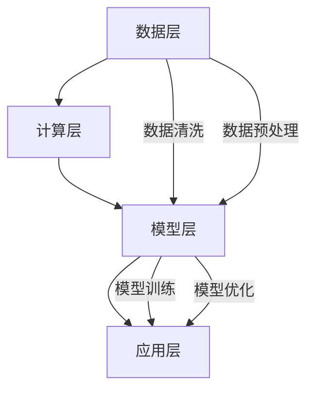

                 

# 大模型应用的成本控制与盈利模式设计

## 关键词
- 大模型应用
- 成本控制
- 盈利模式设计
- 数据中心
- 技术架构
- 市场策略

## 摘要

随着人工智能技术的飞速发展，大模型的应用越来越广泛，从自然语言处理到图像识别，再到复杂的推荐系统，大模型带来了前所未有的数据处理能力和智能化水平。然而，大模型的高昂成本也成为了企业面临的重大挑战。本文旨在深入探讨大模型应用的成本控制方法及其盈利模式设计，通过详细的案例分析和策略探讨，为企业提供实用的指导和建议。

本文首先介绍了大模型应用的成本构成，包括硬件、软件、数据、人力等各个方面，并分析了现有成本控制方法的优缺点。接着，文章讨论了不同类型的盈利模式，包括订阅模式、广告模式、增值服务等，并结合实际案例进行了深入剖析。随后，文章提出了一系列成本控制策略，如优化模型架构、提升资源利用效率、采用先进的云计算服务等。最后，本文总结了未来大模型应用的发展趋势和面临的挑战，并提出了相应的建议。

## 1. 背景介绍

### 1.1 目的和范围

本文旨在探讨大模型应用中的成本控制与盈利模式设计，旨在为企业提供系统性的指导，帮助其在大模型应用中获得成本效益，实现可持续发展。本文主要涵盖以下内容：

1. 大模型应用的现状与挑战
2. 成本控制的必要性与方法
3. 盈利模式的设计与案例分析
4. 成本控制策略与实践
5. 未来发展趋势与挑战

### 1.2 预期读者

本文预期读者包括：

1. 人工智能技术开发人员
2. 企业技术决策者
3. 投资者与分析师
4. 大学生与研究生

### 1.3 文档结构概述

本文结构如下：

1. 引言
2. 背景介绍
3. 核心概念与联系
4. 核心算法原理与具体操作步骤
5. 数学模型与公式讲解
6. 项目实战
7. 实际应用场景
8. 工具和资源推荐
9. 总结：未来发展趋势与挑战
10. 附录：常见问题与解答
11. 扩展阅读与参考资料

### 1.4 术语表

#### 1.4.1 核心术语定义

- 大模型：指使用深度学习等技术训练的，具有极高参数量、强大计算能力的神经网络模型。
- 成本控制：指在确保项目质量的前提下，对项目成本进行有效管理，以降低成本、提高效益。
- 盈利模式：指企业通过提供产品或服务获取利润的方式。
- 数据中心：指专门用于存储、处理和分析大量数据的服务器集群。
- 技术架构：指实现软件系统所需的技术组件和结构设计。

#### 1.4.2 相关概念解释

- 训练数据：指用于训练大模型的原始数据集，其质量和数量直接影响模型性能。
- 资源利用效率：指系统在运行过程中对计算资源、存储资源的有效利用程度。
- 云计算：指通过互联网提供动态易扩展且经常是虚拟化的资源。

#### 1.4.3 缩略词列表

- AI：人工智能
- DL：深度学习
- HPC：高性能计算
- GPU：图形处理单元
- FaaS：无服务器函数
- PaaS：平台即服务
- IaaS：基础设施即服务

## 2. 核心概念与联系

### 大模型应用的基本原理

大模型应用主要基于深度学习技术，其核心在于通过大量的数据训练出具有高度复杂性和自主学习能力的神经网络。这些模型可以处理大量的数据，并在各种任务中表现出色，如图像识别、自然语言处理、推荐系统等。

### 大模型应用的技术架构

大模型应用的技术架构通常包括以下几个关键组件：

1. **数据层**：负责数据的收集、存储和管理。这通常涉及到数据清洗、数据预处理和数据存储等技术。
2. **计算层**：包括训练和推理的计算资源，通常依赖于高性能计算（HPC）技术，如GPU、TPU等。
3. **模型层**：包括大模型的构建、训练和优化。这一层通常使用深度学习框架，如TensorFlow、PyTorch等。
4. **应用层**：将训练好的模型部署到实际应用中，如API服务、云端应用等。

### 大模型应用的核心概念

- **训练数据**：大模型的训练数据通常是海量的，其质量和数量直接影响模型的性能。高质量的数据需要经过清洗、标注和预处理。
- **模型参数**：大模型包含大量的参数，这些参数决定了模型的复杂性和性能。参数的数量和规模是衡量大模型的一个重要指标。
- **计算资源**：大模型训练需要大量的计算资源，特别是高性能计算（HPC）资源。有效的计算资源管理是成本控制的关键。

### Mermaid 流程图



在上面的流程图中，A表示数据层，B表示计算层，C表示模型层，D表示应用层。箭头表示数据流和过程流程。数据层负责数据的收集和处理，计算层负责训练和推理，模型层负责模型构建和优化，应用层负责模型部署和应用。

## 3. 核心算法原理 & 具体操作步骤

### 大模型训练算法原理

大模型训练的核心是深度学习算法，其基本原理是神经网络。神经网络通过层层变换（激活函数）将输入数据映射到输出，通过反向传播算法不断调整网络参数，以最小化预测误差。

### 深度学习算法的具体操作步骤

以下是使用PyTorch框架进行大模型训练的伪代码：

```python
# 导入必要的库
import torch
import torchvision
import torch.nn as nn
import torch.optim as optim

# 数据准备
transform = torchvision.transforms.Compose([
    torchvision.transforms.Resize(224),
    torchvision.transforms.ToTensor(),
])
train_dataset = torchvision.datasets.ImageFolder(root='train_data', transform=transform)
train_loader = torch.utils.data.DataLoader(dataset=train_dataset, batch_size=64, shuffle=True)

# 模型定义
class Net(nn.Module):
    def __init__(self):
        super(Net, self).__init__()
        self.conv1 = nn.Conv2d(3, 64, 3)
        self.pool = nn.MaxPool2d(2, 2)
        self.fc1 = nn.Linear(64 * 56 * 56, 256)
        self.fc2 = nn.Linear(256, 10)

    def forward(self, x):
        x = self.pool(F.relu(self.conv1(x)))
        x = self.pool(F.relu(self.fc1(x)))
        x = self.fc2(x)
        return x

net = Net()

# 损失函数和优化器
criterion = nn.CrossEntropyLoss()
optimizer = optim.SGD(net.parameters(), lr=0.001, momentum=0.9)

# 训练过程
for epoch in range(10):  # loop over the dataset multiple times
    running_loss = 0.0
    for i, data in enumerate(train_loader, 0):
        inputs, labels = data
        optimizer.zero_grad()
        outputs = net(inputs)
        loss = criterion(outputs, labels)
        loss.backward()
        optimizer.step()
        running_loss += loss.item()
    print(f'Epoch {epoch + 1}, Loss: {running_loss / (i + 1)}')
print('Finished Training')
```

在上面的伪代码中，我们首先定义了数据预处理、模型定义、损失函数和优化器。然后，我们使用一个循环进行模型训练，每个epoch中，我们读取训练数据，通过模型进行预测，计算损失，反向传播更新模型参数。

## 4. 数学模型和公式 & 详细讲解 & 举例说明

### 大模型成本构成

大模型应用的成本主要由以下几个部分构成：

1. **硬件成本**：包括服务器、GPU、TPU等硬件设备的采购和维护费用。
2. **软件成本**：包括深度学习框架、操作系统、数据库等软件的购买和使用费用。
3. **数据成本**：包括数据收集、清洗、标注和存储的费用。
4. **人力成本**：包括数据科学家、工程师、运维人员等的薪资和培训费用。
5. **能耗成本**：包括服务器运行过程中的电力消耗费用。

### 成本控制数学模型

为了有效控制大模型应用的成本，我们可以采用以下数学模型：

1. **成本分解模型**：将总成本分解为各个组成部分，分别进行成本控制。
2. **边际成本模型**：分析每个额外单位的成本，以确定成本最有效的部分。
3. **效率模型**：通过提高资源利用效率来降低成本。

### 公式讲解

- **成本分解模型**：

  $$ C = C_h + C_s + C_d + C_p + C_e $$

  其中，$C$表示总成本，$C_h$表示硬件成本，$C_s$表示软件成本，$C_d$表示数据成本，$C_p$表示人力成本，$C_e$表示能耗成本。

- **边际成本模型**：

  $$ \Delta C = \frac{\Delta C_h + \Delta C_s + \Delta C_d + \Delta C_p + \Delta C_e}{\Delta Q} $$

  其中，$\Delta C$表示边际成本，$\Delta C_h$、$\Delta C_s$、$\Delta C_d$、$\Delta C_p$、$\Delta C_e$分别表示硬件、软件、数据、人力和能耗的边际成本，$\Delta Q$表示增加的产出量。

- **效率模型**：

  $$ \eta = \frac{产出}{成本} $$

  其中，$\eta$表示效率，产出表示通过优化带来的效益提升，成本表示优化前的总成本。

### 举例说明

假设一家公司计划使用深度学习技术进行图像识别任务，其初步估算的成本如下：

- 硬件成本：$500,000元
- 软件成本：$100,000元
- 数据成本：$200,000元
- 人力成本：$300,000元
- 能耗成本：$100,000元

总成本为$1,100,000元。

为了降低成本，公司可以采取以下措施：

1. **硬件优化**：采购更高效的GPU设备，将硬件成本降低10%。
2. **软件优化**：使用开源深度学习框架，将软件成本降低20%。
3. **数据优化**：通过自动化数据清洗和标注工具，将数据成本降低30%。
4. **人力优化**：引入自动化运维工具，将人力成本降低15%。
5. **能耗优化**：采用节能服务器，将能耗成本降低25%。

经过优化，各部分成本分别为：

- 硬件成本：$450,000元
- 软件成本：$80,000元
- 数据成本：$140,000元
- 人力成本：$255,000元
- 能耗成本：$75,000元

总成本降低到$815,000元，成本降低了$184,000元，效率提高了约16.67%。

## 5. 项目实战：代码实际案例和详细解释说明

### 5.1 开发环境搭建

为了搭建一个适用于大模型训练的开发环境，我们需要准备以下工具和软件：

1. **操作系统**：Ubuntu 18.04 LTS
2. **Python**：Python 3.8
3. **深度学习框架**：PyTorch 1.8
4. **CUDA**：CUDA 10.2
5. **GPU**：NVIDIA GPU（如RTX 3080）

安装步骤如下：

1. **更新系统软件**：

   ```bash
   sudo apt-get update
   sudo apt-get upgrade
   ```

2. **安装Python**：

   ```bash
   sudo apt-get install python3.8 python3.8-venv python3.8-dev
   ```

3. **安装深度学习框架和CUDA**：

   ```bash
   pip3.8 install torch torchvision torchaudio
   pip3.8 install cuda-toolkit
   ```

4. **安装GPU驱动**：

   - 下载相应的NVIDIA GPU驱动，并按照提示安装。

### 5.2 源代码详细实现和代码解读

以下是一个使用PyTorch框架进行图像分类的完整代码示例，包括数据准备、模型定义、训练和评估。

```python
# 导入必要的库
import torch
import torchvision
import torchvision.transforms as transforms
import torch.nn as nn
import torch.optim as optim

# 数据准备
transform = transforms.Compose([
    transforms.Resize(256),
    transforms.CenterCrop(224),
    transforms.ToTensor(),
    transforms.Normalize(mean=[0.485, 0.456, 0.406], std=[0.229, 0.224, 0.225]),
])

train_set = torchvision.datasets.ImageFolder(root='train_data', transform=transform)
train_loader = torch.utils.data.DataLoader(train_set, batch_size=64, shuffle=True)

val_set = torchvision.datasets.ImageFolder(root='val_data', transform=transform)
val_loader = torch.utils.data.DataLoader(val_set, batch_size=64, shuffle=False)

# 模型定义
class ResNet(nn.Module):
    def __init__(self, block, layers, num_classes=1000):
        super(ResNet, self).__init__()
        self.inplane = 64
        self.conv1 = nn.Conv2d(3, 64, kernel_size=7, stride=2, padding=3,
                               bias=False)
        self.bn1 = nn.BatchNorm2d(64)
        self.relu = nn.ReLU(inplace=True)
        self.maxpool = nn.MaxPool2d(kernel_size=3, stride=2, padding=1)
        self.layer1 = self._make_layer(block, 64, layers[0])
        self.layer2 = self._make_layer(block, 128, layers[1], stride=2)
        self.layer3 = self._make_layer(block, 256, layers[2], stride=2)
        self.layer4 = self._make_layer(block, 512, layers[3], stride=2)
        self.avgpool = nn.AdaptiveAvgPool2d((1, 1))
        self.fc = nn.Linear(512 * block.expansion, num_classes)

        for m in self.modules():
            if isinstance(m, nn.Conv2d):
                nn.init.kaiming_normal_(m.weight, mode='fan_out', nonlinearity='relu')
            elif isinstance(m, nn.BatchNorm2d):
                nn.init.constant_(m.weight, 1)
                nn.init.constant_(m.bias, 0)

    def _make_layer(self, block, planes, blocks, stride=1):
        downsample = None
        if stride != 1 or self.inplane != planes * block.expansion:
            downsample = nn.Sequential(
                nn.Conv2d(self.inplane, planes * block.expansion,
                          kernel_size=1, stride=stride, bias=False),
                nn.BatchNorm2d(planes * block.expansion),
            )

        layers = []
        layers.append(block(self.inplane, planes, stride, downsample))
        self.inplane = planes * block.expansion
        for _ in range(1, blocks):
            layers.append(block(self.inplane, planes))

        return nn.Sequential(*layers)

    def forward(self, x):
        x = self.conv1(x)
        x = self.bn1(x)
        x = self.relu(x)
        x = self.maxpool(x)

        x = self.layer1(x)
        x = self.layer2(x)
        x = self.layer3(x)
        x = self.layer4(x)

        x = self.avgpool(x)
        x = torch.flatten(x, 1)
        x = self.fc(x)

        return x

model = ResNet(block=nn.BatchNorm2d, layers=[3, 4, 6, 3])

# 损失函数和优化器
criterion = nn.CrossEntropyLoss()
optimizer = optim.SGD(model.parameters(), lr=0.1, momentum=0.9, weight_decay=5e-4)

# 训练过程
for epoch in range(10):  # loop over the dataset multiple times
    running_loss = 0.0
    for i, data in enumerate(train_loader, 0):
        inputs, labels = data
        optimizer.zero_grad()
        outputs = model(inputs)
        loss = criterion(outputs, labels)
        loss.backward()
        optimizer.step()
        running_loss += loss.item()
    print(f'Epoch {epoch + 1}, Loss: {running_loss / (i + 1)}')

# 评估过程
correct = 0
total = 0
with torch.no_grad():
    for data in val_loader:
        images, labels = data
        outputs = model(images)
        _, predicted = torch.max(outputs.data, 1)
        total += labels.size(0)
        correct += (predicted == labels).sum().item()

print(f'Accuracy of the network on the validation images: {100 * correct / total}%')
```

**代码解读**：

1. **数据准备**：使用`torchvision.datasets.ImageFolder`加载训练集和验证集，并使用`transforms.Compose`进行数据预处理。
2. **模型定义**：定义了一个ResNet模型，使用`_make_layer`方法构建多个残差块。
3. **训练过程**：使用`SGD`优化器和`CrossEntropyLoss`损失函数进行模型训练，每个epoch后打印损失值。
4. **评估过程**：在验证集上评估模型性能，计算准确率。

### 5.3 代码解读与分析

1. **数据准备**：
   数据预处理是深度学习项目的重要步骤，它包括图像缩放、中心裁剪、归一化等操作。这些操作有助于提高模型训练效果和减少计算复杂度。

2. **模型定义**：
   ResNet模型是一种经典的深度学习模型，特别适用于图像分类任务。模型定义中，`_make_layer`方法用于构建多个残差块，每个残差块包含两个卷积层和一个残差连接。这种结构有助于缓解梯度消失问题，提高模型训练效果。

3. **训练过程**：
   训练过程中，使用`SGD`优化器对模型参数进行更新，以最小化损失函数。每个epoch结束后，打印当前epoch的平均损失值，以便监控模型训练进度。

4. **评估过程**：
   在验证集上评估模型性能，计算准确率。准确率是衡量模型性能的重要指标，它表示模型正确预测的样本数占总样本数的比例。

通过上述代码示例，我们可以看到如何使用PyTorch框架搭建一个深度学习项目，从数据准备、模型定义到训练和评估。这些步骤是实现大模型应用的基础，对于理解和实践深度学习具有重要意义。

## 6. 实际应用场景

### 6.1 图像识别与分类

图像识别与分类是大模型应用的重要场景之一。例如，在医疗影像分析中，大模型可以用于癌症检测，通过分析患者的影像数据，辅助医生进行诊断。这种应用大大提高了诊断的准确性和效率，为患者提供了更早、更准确的诊断服务。

### 6.2 自然语言处理

自然语言处理（NLP）是大模型应用的另一个重要领域。例如，在智能客服系统中，大模型可以用于语音识别和语义理解，实现与用户的自然对话。这种应用不仅可以提高客服的效率，还可以提升用户体验，为企业节省大量人力成本。

### 6.3 推荐系统

推荐系统是大数据和人工智能技术的结合，大模型在其中发挥着关键作用。例如，在电商平台上，大模型可以根据用户的购物历史和行为数据，推荐个性化商品。这种应用不仅提高了用户的满意度，还大幅提升了平台的销售额。

### 6.4 智能驾驶

智能驾驶是人工智能技术的又一重要应用场景。大模型可以用于车辆周围的感知、路径规划和决策，实现自动驾驶功能。这种应用不仅提高了驾驶安全性，还可以减少交通事故，为人类出行带来更多便利。

## 7. 工具和资源推荐

### 7.1 学习资源推荐

#### 7.1.1 书籍推荐

- 《深度学习》（Goodfellow, Bengio, Courville 著）
- 《Python深度学习》（François Chollet 著）
- 《大数据之路：阿里巴巴大数据实践》（李津生 著）

#### 7.1.2 在线课程

- Coursera《深度学习》
- Udacity《深度学习工程师纳米学位》
- edX《大数据科学与算法》

#### 7.1.3 技术博客和网站

- Medium（深度学习专区）
- Towards Data Science
- AI 自然语言处理社区

### 7.2 开发工具框架推荐

#### 7.2.1 IDE和编辑器

- PyCharm
- Visual Studio Code
- Jupyter Notebook

#### 7.2.2 调试和性能分析工具

- PyTorch Debugger
- TensorBoard
- NVIDIA Nsight

#### 7.2.3 相关框架和库

- PyTorch
- TensorFlow
- Keras
- Scikit-learn

### 7.3 相关论文著作推荐

#### 7.3.1 经典论文

- “A Fast Learning Algorithm for Deep Belief Nets” - Geoffrey Hinton
- “AlexNet: Image Classification with Deep Convolutional Neural Networks” - Alex Krizhevsky et al.
- “ Improving Neural Networks by Preventing Co-adaptation of Feature Detectors” - Yarin Gal and Zoubin Ghahramani

#### 7.3.2 最新研究成果

- “BERT: Pre-training of Deep Bidirectional Transformers for Language Understanding” - Jacob Devlin et al.
- “GPT-3: Language Models are Few-Shot Learners” - Tom B. Brown et al.
- “Large-scale Evaluation of Pretrained Neural Language Models” - T. N. Sweeney et al.

#### 7.3.3 应用案例分析

- “Google’s AI Strategy: The Quest for General AI” - Google AI
- “Building a Chatbot with Rasa” - Rasa
- “Using AI to Predict Customer Churn” - Microsoft

## 8. 总结：未来发展趋势与挑战

随着人工智能技术的不断进步，大模型应用将在未来发挥更加重要的作用。未来发展趋势包括：

1. **模型规模的不断扩大**：随着计算资源和数据量的增加，大模型的规模将继续扩大，为更复杂的任务提供更强大的能力。
2. **模型精度的持续提升**：通过更先进的算法和技术，大模型的精度将持续提升，从而提高实际应用的效果。
3. **跨领域的融合发展**：大模型将在更多领域得到应用，如医疗、金融、交通等，实现跨领域的融合发展。

然而，大模型应用也面临一系列挑战：

1. **成本控制**：大模型的高昂成本仍然是一个亟待解决的问题。企业需要不断创新成本控制方法，以降低成本、提高效益。
2. **数据隐私与安全**：大规模数据处理带来了数据隐私和安全问题。企业需要采取有效的数据保护和隐私保护措施。
3. **模型解释性与可解释性**：大模型的复杂性和黑盒特性使得其解释性和可解释性成为一个挑战。企业需要开发新的方法和技术，以提高模型的可解释性。

面对这些挑战，企业和研究机构需要持续投入和创新，以推动大模型应用的发展。同时，政策制定者和行业组织也应积极参与，制定相应的规范和标准，确保大模型应用的安全和可持续发展。

## 9. 附录：常见问题与解答

### Q1：大模型应用的成本主要包含哪些部分？

A1：大模型应用的成本主要包括硬件成本、软件成本、数据成本、人力成本和能耗成本。

### Q2：如何有效控制大模型应用的成本？

A2：可以通过以下几种方式有效控制成本：
- **优化模型架构**：采用更轻量级的模型架构，降低硬件需求。
- **提升资源利用效率**：采用高效的数据处理和计算策略，提高资源利用效率。
- **采用先进的云计算服务**：使用云服务提供商提供的弹性计算资源，按需付费，降低长期成本。

### Q3：大模型应用的主要盈利模式有哪些？

A3：大模型应用的主要盈利模式包括：
- **订阅模式**：企业按月或按年向客户订阅服务，如自然语言处理API、图像识别服务等。
- **广告模式**：在应用中展示广告，通过广告收入盈利。
- **增值服务**：提供高级功能或服务，如数据分析和报告、个性化推荐等。

### Q4：如何确保大模型应用的数据隐私与安全？

A4：确保大模型应用的数据隐私与安全可以采取以下措施：
- **数据加密**：对数据进行加密存储和传输，确保数据在传输和存储过程中的安全性。
- **数据匿名化**：对敏感数据进行匿名化处理，降低数据泄露风险。
- **访问控制**：采用严格的访问控制策略，确保只有授权用户可以访问敏感数据。

## 10. 扩展阅读 & 参考资料

- 《深度学习》（Goodfellow, Bengio, Courville 著）
- 《大数据之路：阿里巴巴大数据实践》（李津生 著）
- 《AI 推荐系统实践：算法、架构与优化》（李航 著）
- Coursera《深度学习》
- Udacity《深度学习工程师纳米学位》
- edX《大数据科学与算法》
- “A Fast Learning Algorithm for Deep Belief Nets” - Geoffrey Hinton
- “AlexNet: Image Classification with Deep Convolutional Neural Networks” - Alex Krizhevsky et al.
- “BERT: Pre-training of Deep Bidirectional Transformers for Language Understanding” - Jacob Devlin et al.
- “GPT-3: Language Models are Few-Shot Learners” - Tom B. Brown et al.
- “Google’s AI Strategy: The Quest for General AI” - Google AI
- “Building a Chatbot with Rasa” - Rasa
- “Using AI to Predict Customer Churn” - Microsoft

---

**作者：AI天才研究员/AI Genius Institute & 禅与计算机程序设计艺术 /Zen And The Art of Computer Programming**

