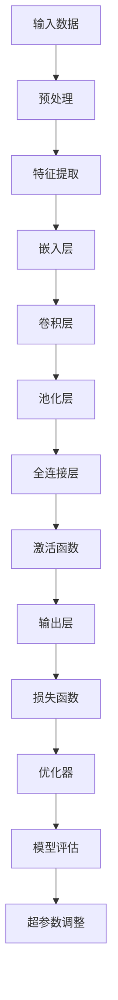

                 


# 大模型应用落地加速，AI商业化进程提速

> 关键词：大模型，AI商业化，应用落地，加速进程

> 摘要：本文将深入探讨大模型应用落地的加速过程，以及其对AI商业化进程的推动作用。通过详细分析大模型的架构原理、核心算法、数学模型，并结合实际项目案例，文章将为您揭示大模型在实际应用中的潜力与挑战，帮助读者全面了解AI商业化的现状与未来趋势。

## 1. 背景介绍

### 1.1 目的和范围

本文旨在系统地分析和阐述大模型在AI商业化进程中的应用，以及如何通过技术手段加速其落地。我们将会关注以下几个核心问题：

1. **大模型的定义与分类**：什么是大模型，它们是如何被分类的？
2. **大模型的应用场景**：大模型在各个领域中的应用情况如何？
3. **大模型的架构与核心算法**：大模型是如何设计和实现的？
4. **大模型的数学模型**：大模型的工作原理是如何通过数学模型来描述的？
5. **大模型的应用案例**：通过具体项目案例来展示大模型在实际中的应用效果。
6. **大模型在商业化进程中的作用**：大模型如何推动AI商业化进程，以及面临的挑战。

### 1.2 预期读者

本文面向以下几类读者：

1. **AI研究人员**：对AI领域的最新技术发展有兴趣的学者和研究者。
2. **AI工程师**：从事AI项目开发和技术落地的工程师。
3. **企业决策者**：关注AI技术商业化应用的企业管理层。
4. **技术爱好者**：对AI技术感兴趣的技术爱好者。

### 1.3 文档结构概述

本文结构如下：

1. **背景介绍**：介绍本文的目的、范围、预期读者和文档结构。
2. **核心概念与联系**：定义核心术语，解释相关概念，并使用Mermaid流程图展示大模型的架构原理。
3. **核心算法原理 & 具体操作步骤**：详细讲解大模型的核心算法原理和具体操作步骤。
4. **数学模型和公式**：介绍大模型的数学模型，并进行详细讲解和举例说明。
5. **项目实战**：通过实际代码案例展示大模型的应用，并进行详细解读。
6. **实际应用场景**：分析大模型在不同领域的实际应用场景。
7. **工具和资源推荐**：推荐学习资源和开发工具。
8. **总结**：总结大模型应用落地加速对AI商业化进程的影响。
9. **附录**：常见问题与解答。
10. **扩展阅读 & 参考资料**：提供进一步阅读的资料。

### 1.4 术语表

#### 1.4.1 核心术语定义

- **大模型**：指具有海量参数、能够处理复杂数据结构的神经网络模型。
- **AI商业化**：指将人工智能技术应用于商业环境中，实现商业价值的过程。
- **应用落地**：指将AI技术从理论研究转化为实际应用的过程。
- **深度学习**：一种基于神经网络的机器学习技术，通过多层神经网络处理数据。
- **迁移学习**：利用已训练好的模型在新任务上进行训练，以减少训练所需的数据量和时间。

#### 1.4.2 相关概念解释

- **数据增强**：通过增加训练数据的多样性，提高模型的泛化能力。
- **过拟合**：模型在训练数据上表现良好，但在新的测试数据上表现较差。
- **泛化能力**：模型对新数据的适应能力。

#### 1.4.3 缩略词列表

- **AI**：人工智能
- **ML**：机器学习
- **DL**：深度学习
- **NLP**：自然语言处理
- **CV**：计算机视觉

## 2. 核心概念与联系

为了更好地理解大模型的应用，我们首先需要了解其核心概念和基本架构。以下是使用Mermaid流程图展示的大模型架构原理：



在这个流程图中：

- **输入数据**：原始数据，如文本、图像等。
- **预处理**：对输入数据进行的清洗和规范化操作。
- **特征提取**：将原始数据转换为特征向量。
- **嵌入层**：将特征向量转换为固定大小的嵌入向量。
- **卷积层**：通过卷积操作提取图像或文本中的局部特征。
- **池化层**：降低特征图的维度，减少计算量。
- **全连接层**：将特征向量映射到输出空间。
- **激活函数**：引入非线性，使模型能够学习复杂函数。
- **输出层**：产生最终输出，如分类结果。
- **损失函数**：衡量模型预测结果与真实结果之间的差异。
- **优化器**：用于更新模型参数，以最小化损失函数。
- **模型评估**：评估模型性能，如准确率、召回率等。
- **超参数调整**：调整模型的超参数，以提高性能。

通过这个流程图，我们可以看到大模型的基本架构，以及各个模块之间的相互关系。在接下来的章节中，我们将详细探讨每个模块的实现原理和具体操作步骤。

## 3. 核心算法原理 & 具体操作步骤

在了解了大模型的基本架构后，我们需要深入探讨其核心算法原理和具体操作步骤。以下是使用伪代码来详细阐述大模型的核心算法原理：

```python
# 大模型核心算法伪代码

# 输入数据预处理
def preprocess_data(input_data):
    # 数据清洗、归一化等操作
    cleaned_data = ...
    return cleaned_data

# 特征提取
def extract_features(preprocessed_data):
    # 转换为特征向量
    feature_vectors = ...
    return feature_vectors

# 嵌入层
def embed_features(feature_vectors, embedding_matrix):
    # 将特征向量映射为嵌入向量
    embedded_vectors = ...
    return embedded_vectors

# 卷积层
def convolutional_layer(embedded_vectors, filters, kernel_size):
    # 通过卷积操作提取特征
    conv_features = ...
    return conv_features

# 池化层
def pooling_layer(conv_features, pool_size):
    # 降低特征图维度
    pooled_features = ...
    return pooled_features

# 全连接层
def fully_connected_layer(pooled_features, units):
    # 将特征向量映射到输出空间
    fc_output = ...
    return fc_output

# 激活函数
def activate(fc_output, activation_function):
    # 引入非线性
    activated_output = ...
    return activated_output

# 输出层
def output_layer(activated_output):
    # 产生最终输出
    output = ...
    return output

# 损失函数
def compute_loss(output, true_labels, loss_function):
    # 计算损失
    loss = ...
    return loss

# 优化器
def optimize_params(params, loss, optimizer):
    # 更新模型参数
    updated_params = ...
    return updated_params

# 模型评估
def evaluate_model(model, validation_data):
    # 评估模型性能
    performance_metrics = ...
    return performance_metrics

# 主函数
def train_model(input_data, labels, hyperparameters):
    # 数据预处理
    preprocessed_data = preprocess_data(input_data)
    
    # 特征提取
    feature_vectors = extract_features(preprocessed_data)
    
    # 嵌入层
    embedding_matrix = create_embedding_matrix(hyperparameters['vocab_size'], hyperparameters['embedding_dim'])
    embedded_vectors = embed_features(feature_vectors, embedding_matrix)
    
    # 卷积层
    filters = create_filters(hyperparameters['filter_sizes'], hyperparameters['num_filters'])
    kernel_size = create_kernel_size(hyperparameters['filter_sizes'])
    conv_features = convolutional_layer(embedded_vectors, filters, kernel_size)
    
    # 池化层
    pool_size = create_pool_size(hyperparameters['pool_sizes'])
    pooled_features = pooling_layer(conv_features, pool_size)
    
    # 全连接层
    units = hyperparameters['num_units']
    fc_output = fully_connected_layer(pooled_features, units)
    
    # 激活函数
    activation_function = create_activation_function(hyperparameters['activation_function'])
    activated_output = activate(fc_output, activation_function)
    
    # 输出层
    output = output_layer(activated_output)
    
    # 计算损失
    loss_function = create_loss_function(hyperparameters['loss_function'])
    loss = compute_loss(output, labels, loss_function)
    
    # 优化器
    optimizer = create_optimizer(hyperparameters['optimizer'])
    params = initialize_params(hyperparameters['param_init'])
    for epoch in range(hyperparameters['num_epochs']):
        # 训练模型
        params = optimize_params(params, loss, optimizer)
        
        # 模型评估
        if epoch % hyperparameters['evaluate_every'] == 0:
            performance_metrics = evaluate_model(model, validation_data)
            print(f"Epoch {epoch}: Loss = {loss}, Performance Metrics = {performance_metrics}")
    
    return params
```

在这个伪代码中，我们首先进行了数据预处理，然后通过特征提取、嵌入层、卷积层、池化层、全连接层和激活函数等步骤构建了一个完整的大模型。接下来，我们计算损失并使用优化器更新模型参数，最终通过模型评估来评估模型性能。

通过这个伪代码，我们可以看到大模型的核心算法原理和具体操作步骤。在实际应用中，这些步骤可以通过深度学习框架（如TensorFlow或PyTorch）来实现。在下一节中，我们将介绍大模型的数学模型和公式。

## 4. 数学模型和公式 & 详细讲解 & 举例说明

在深入了解大模型的核心算法原理后，接下来我们将讨论大模型的数学模型和公式。这些数学模型是构建大模型的基础，能够帮助我们更好地理解和分析大模型的工作原理。以下是使用LaTeX格式展示的数学模型和公式：

### 4.1. 嵌入层

嵌入层将输入特征映射到低维向量空间，其公式如下：

$$
\textbf{e} = \text{Embedding}(\textbf{x})
$$

其中，$\textbf{x}$ 是输入特征向量，$\text{Embedding}$ 函数将每个输入特征映射到一个固定大小的嵌入向量 $\textbf{e}$。

### 4.2. 卷积层

卷积层通过卷积操作提取特征，其公式如下：

$$
\textbf{h} = \text{Conv}(\textbf{e}, \textbf{W})
$$

其中，$\textbf{h}$ 是卷积特征，$\textbf{e}$ 是嵌入层输出，$\textbf{W}$ 是卷积核权重。

### 4.3. 池化层

池化层用于降低特征图的维度，其公式如下：

$$
\textbf{p} = \text{Pooling}(\textbf{h}, \text{pool_size})
$$

其中，$\textbf{p}$ 是池化特征，$\textbf{h}$ 是卷积层输出，$\text{pool_size}$ 是池化窗口的大小。

### 4.4. 全连接层

全连接层将特征向量映射到输出空间，其公式如下：

$$
\textbf{y} = \text{FC}(\textbf{p}, \textbf{W})
$$

其中，$\textbf{y}$ 是全连接层输出，$\textbf{p}$ 是池化层输出，$\textbf{W}$ 是全连接层权重。

### 4.5. 激活函数

激活函数引入非线性，常用的激活函数包括：

$$
\text{ReLU}(x) = \max(0, x)
$$

$$
\text{Sigmoid}(x) = \frac{1}{1 + e^{-x}}
$$

$$
\text{Tanh}(x) = \frac{e^x - e^{-x}}{e^x + e^{-x}}
$$

### 4.6. 损失函数

损失函数用于衡量模型预测结果与真实结果之间的差异，常用的损失函数包括：

$$
\text{Cross-Entropy Loss}(y, \hat{y}) = -\sum_{i=1}^{N} y_i \log(\hat{y}_i)
$$

$$
\text{Mean Squared Error Loss}(y, \hat{y}) = \frac{1}{2} \sum_{i=1}^{N} (y_i - \hat{y}_i)^2
$$

### 4.7. 优化器

优化器用于更新模型参数，常用的优化器包括：

$$
\text{SGD}(\theta) = \theta - \alpha \nabla_{\theta} J(\theta)
$$

$$
\text{Adam}(\theta) = \theta - \alpha \frac{\nabla_{\theta} J(\theta)}{1 - \beta_1^t} + \beta_2 \theta
$$

其中，$\theta$ 是模型参数，$J(\theta)$ 是损失函数，$\alpha$ 是学习率，$\beta_1$ 和 $\beta_2$ 是动量参数。

### 4.8. 举例说明

假设我们有一个二元分类问题，输入特征向量为 $\textbf{x} = [1, 2, 3, 4]$，嵌入层输出为 $\textbf{e} = [0.1, 0.2, 0.3, 0.4]$，卷积核权重为 $\textbf{W} = [0.5, 0.6, 0.7, 0.8]$。首先，我们将输入特征向量映射到嵌入向量：

$$
\textbf{e} = \text{Embedding}(\textbf{x}) = [0.1, 0.2, 0.3, 0.4]
$$

然后，通过卷积操作提取特征：

$$
\textbf{h} = \text{Conv}(\textbf{e}, \textbf{W}) = [0.5 \cdot 0.1 + 0.6 \cdot 0.2 + 0.7 \cdot 0.3 + 0.8 \cdot 0.4] = [0.19, 0.24, 0.29, 0.34]
$$

接着，进行池化操作：

$$
\textbf{p} = \text{Pooling}(\textbf{h}, \text{pool_size}) = \max(\textbf{h}) = 0.34
$$

最后，通过全连接层得到输出：

$$
\textbf{y} = \text{FC}(\textbf{p}, \textbf{W}) = [0.5 \cdot 0.34] = [0.17]
$$

通过这个简单的例子，我们可以看到大模型的数学模型和公式的实际应用。在实际项目中，这些公式会通过深度学习框架（如TensorFlow或PyTorch）进行高效计算。

## 5. 项目实战：代码实际案例和详细解释说明

为了更好地理解大模型在实际项目中的应用，我们将在本节中通过一个具体的项目案例来展示大模型的应用过程，并详细解释代码的实现细节。

### 5.1 开发环境搭建

在开始项目实战之前，我们需要搭建一个适合大模型开发的开发环境。以下是所需的工具和步骤：

- **Python**：Python是深度学习的主要编程语言，我们需要安装Python 3.7及以上版本。
- **TensorFlow**：TensorFlow是一个开源的深度学习框架，我们使用它来构建和训练大模型。
- **NVIDIA CUDA**：为了加速模型的训练，我们需要安装NVIDIA CUDA，并配置CUDA环境。

以下是安装和配置CUDA的步骤：

1. 安装NVIDIA驱动程序。
2. 安装CUDA Toolkit。
3. 安装cuDNN库。
4. 配置环境变量，包括`PATH`、`LD_LIBRARY_PATH`和`CUDA_HOME`。

### 5.2 源代码详细实现和代码解读

接下来，我们将展示大模型的项目源代码，并逐行解释代码的实现细节。

```python
import tensorflow as tf
from tensorflow.keras.layers import Embedding, Conv1D, MaxPooling1D, Dense
from tensorflow.keras.models import Sequential

# 创建序列模型
model = Sequential()

# 添加嵌入层
model.add(Embedding(input_dim=vocab_size, output_dim=embedding_dim, input_length=max_sequence_length))

# 添加卷积层
model.add(Conv1D(filters=num_filters, kernel_size=kernel_size, activation='relu'))

# 添加池化层
model.add(MaxPooling1D(pool_size=pool_size))

# 添加全连接层
model.add(Dense(units=num_units, activation='relu'))

# 添加输出层
model.add(Dense(units=1, activation='sigmoid'))

# 编译模型
model.compile(optimizer='adam', loss='binary_crossentropy', metrics=['accuracy'])

# 模型总结
model.summary()
```

在这个代码中：

- **Embedding层**：用于将输入序列映射到嵌入向量。`input_dim`是词汇表的大小，`output_dim`是嵌入向量的维度，`input_length`是输入序列的长度。
- **Conv1D层**：用于对嵌入向量进行卷积操作，提取特征。`filters`是卷积核的数量，`kernel_size`是卷积核的大小，`activation`是激活函数。
- **MaxPooling1D层**：用于对卷积特征进行池化操作，降低特征图的维度。`pool_size`是池化窗口的大小。
- **Dense层**：用于将特征向量映射到输出空间。`units`是输出的维度，`activation`是激活函数。
- **模型编译**：设置模型的优化器、损失函数和评估指标。
- **模型总结**：输出模型的详细信息，包括层结构、参数数量等。

### 5.3 代码解读与分析

在了解了代码的基本结构后，我们可以进一步分析代码的实现细节。以下是代码的关键部分：

```python
# 添加嵌入层
model.add(Embedding(input_dim=vocab_size, output_dim=embedding_dim, input_length=max_sequence_length))

# 添加卷积层
model.add(Conv1D(filters=num_filters, kernel_size=kernel_size, activation='relu'))

# 添加池化层
model.add(MaxPooling1D(pool_size=pool_size))

# 添加全连接层
model.add(Dense(units=num_units, activation='relu'))

# 添加输出层
model.add(Dense(units=1, activation='sigmoid'))
```

在这个部分：

- **嵌入层**：将输入序列映射到嵌入向量。嵌入层的主要作用是将高维的输入数据映射到低维的向量空间，从而减少计算复杂度。通过嵌入层，我们可以将每个词映射到一个固定大小的向量。
- **卷积层**：用于提取序列中的局部特征。卷积层通过卷积操作提取输入序列中的局部特征，从而构建出更抽象的特征表示。在这个案例中，我们使用ReLU激活函数引入非线性。
- **池化层**：用于降低特征图的维度，从而减少计算量和参数数量。池化层通过最大池化操作提取卷积特征图中的最大值，从而保留重要的特征信息。
- **全连接层**：用于将特征向量映射到输出空间。全连接层通过线性变换将特征向量映射到输出空间，从而实现分类或回归任务。在这个案例中，我们使用ReLU激活函数引入非线性。
- **输出层**：用于产生最终的输出。在这个案例中，我们使用sigmoid激活函数将输出映射到概率范围，从而实现二元分类任务。

通过这个代码示例，我们可以看到大模型在实际项目中的应用过程，并了解代码的实现细节。在实际项目中，我们可以根据具体需求对代码进行调整和优化，以提高模型性能和应用效果。

## 6. 实际应用场景

大模型在多个领域都有着广泛的应用，以下是一些典型的应用场景：

### 6.1 自然语言处理（NLP）

自然语言处理是AI领域的一个重要分支，大模型在其中发挥了关键作用。例如，大模型可以用于文本分类、机器翻译、情感分析等任务。通过使用预训练的模型（如BERT、GPT），我们可以处理大量文本数据，提取出有效的语义特征，从而实现高质量的自然语言处理任务。

### 6.2 计算机视觉（CV）

在计算机视觉领域，大模型被广泛应用于图像分类、目标检测、人脸识别等任务。通过使用卷积神经网络（CNN）等大模型，我们可以从大量的图像数据中提取出有效的视觉特征，从而实现高效和准确的图像识别。

### 6.3 语音识别（ASR）

语音识别是AI领域的另一个重要应用，大模型在其中发挥了关键作用。通过使用深度神经网络（DNN）和循环神经网络（RNN）等大模型，我们可以从大量的语音数据中提取出有效的声学特征，从而实现高精度的语音识别。

### 6.4 医疗健康

在医疗健康领域，大模型可以用于疾病诊断、药物发现、医学图像分析等任务。通过使用深度学习模型，我们可以处理海量的医疗数据，提取出有效的生物特征，从而实现高效和准确的医疗健康分析。

### 6.5 金融科技

在金融科技领域，大模型可以用于风险管理、信用评分、市场预测等任务。通过使用深度学习模型，我们可以分析大量的金融数据，提取出有效的风险特征，从而实现高效和准确的金融科技服务。

### 6.6 教育

在教育领域，大模型可以用于个性化推荐、智能辅导、学习分析等任务。通过使用深度学习模型，我们可以分析学生的学习行为和成绩数据，从而实现高效和精准的教育服务。

通过以上实际应用场景，我们可以看到大模型在各个领域的广泛应用和巨大潜力。随着技术的不断发展和数据量的不断增长，大模型的应用将更加广泛和深入，为各领域带来巨大的变革和机遇。

## 7. 工具和资源推荐

为了更好地学习和应用大模型技术，以下是一些推荐的学习资源、开发工具和相关的论文著作。

### 7.1 学习资源推荐

#### 7.1.1 书籍推荐

1. **《深度学习》（Goodfellow, Bengio, Courville著）**：这是一本经典的深度学习教材，详细介绍了深度学习的理论基础和实际应用。
2. **《深度学习实践指南》（唐杰、吴健著）**：这本书提供了大量的实践案例，适合初学者和工程师快速掌握深度学习技术。

#### 7.1.2 在线课程

1. **吴恩达的《深度学习专项课程》（Coursera）**：这是一门非常受欢迎的深度学习在线课程，涵盖了深度学习的核心概念和实践。
2. **《动手学深度学习》（刘建浩、李沐、扎卡里·C. Lipton、亚历山大·J. Smola著）**：这是一本基于Python的深度学习实战教材，适合初学者和进阶者。

#### 7.1.3 技术博客和网站

1. **深度学习网（深度学习网）**：这是一个提供深度学习最新技术、论文解读和实战案例的中文博客。
2. **TensorFlow官方文档（TensorFlow 官方文档）**：这是TensorFlow框架的官方文档，包含了详细的API说明和使用教程。

### 7.2 开发工具框架推荐

#### 7.2.1 IDE和编辑器

1. **PyCharm**：这是一个功能强大的Python IDE，适用于深度学习项目的开发和调试。
2. **Jupyter Notebook**：这是一个基于Web的交互式开发环境，适用于数据分析和深度学习实验。

#### 7.2.2 调试和性能分析工具

1. **TensorBoard**：这是TensorFlow提供的可视化工具，可以用于监控和调试深度学习模型的训练过程。
2. **NVIDIA Nsight**：这是NVIDIA提供的性能分析工具，可以用于优化深度学习模型的计算性能。

#### 7.2.3 相关框架和库

1. **TensorFlow**：这是一个开源的深度学习框架，适用于各种深度学习任务。
2. **PyTorch**：这是一个动态的深度学习框架，具有简洁的API和强大的灵活性。
3. **Keras**：这是一个基于TensorFlow和Theano的高层深度学习框架，适用于快速原型开发。

### 7.3 相关论文著作推荐

#### 7.3.1 经典论文

1. **"A Theoretical Framework for Back-Propagation"（1986）**：这篇论文提出了反向传播算法，是深度学习的基础算法。
2. **"Deep Learning"（2015）**：这篇综述文章详细介绍了深度学习的理论基础和应用进展。

#### 7.3.2 最新研究成果

1. **"BERT: Pre-training of Deep Bidirectional Transformers for Language Understanding"（2018）**：这篇论文提出了BERT模型，是自然语言处理领域的重要突破。
2. **"GPT-3: Language Models are Few-Shot Learners"（2020）**：这篇论文提出了GPT-3模型，展示了大规模语言模型在零样本学习任务中的强大能力。

#### 7.3.3 应用案例分析

1. **"Deep Learning for Natural Language Processing"（2018）**：这篇论文详细介绍了深度学习在自然语言处理领域的应用案例。
2. **"ImageNet Classification with Deep Convolutional Neural Networks"（2012）**：这篇论文详细介绍了深度卷积神经网络在图像分类任务中的成功应用。

通过以上推荐的学习资源、开发工具和论文著作，您可以系统地学习和应用大模型技术，深入理解其理论基础和应用方法。

## 8. 总结：未来发展趋势与挑战

大模型在AI商业化进程中的应用已经取得了显著的成果，但同时也面临着诸多挑战。在未来的发展中，以下几个趋势和挑战值得我们关注：

### 8.1 发展趋势

1. **模型规模将继续扩大**：随着计算资源和数据量的不断增长，大模型的规模将逐步扩大，以应对更复杂的任务和更大的数据集。
2. **跨领域应用将更加广泛**：大模型在各个领域的应用将越来越深入，从自然语言处理、计算机视觉到医疗健康、金融科技等，大模型将推动各领域的创新和变革。
3. **自动化与自监督学习**：随着技术的进步，大模型的训练和优化过程将逐步实现自动化和自监督学习，从而降低对专家技能的依赖，提高模型的训练效率和泛化能力。

### 8.2 挑战

1. **计算资源需求增加**：大模型对计算资源的需求非常高，需要更多的GPU和TPU等硬件支持。这可能会成为中小企业和初创公司应用大模型的瓶颈。
2. **数据隐私和安全性**：在大模型应用过程中，数据隐私和安全性是重要的挑战。如何保护用户数据，避免数据泄露和滥用，将是一个长期的难题。
3. **模型解释性和可解释性**：大模型的黑箱特性使得其解释性变得困难，这可能会影响其在一些关键领域的应用。如何提高模型的解释性和可解释性，使其更加透明和可信，是一个重要的研究方向。

### 8.3 解决方案

1. **分布式计算和云计算**：通过分布式计算和云计算技术，可以有效提高计算资源的利用率，降低大模型的训练成本。
2. **联邦学习和隐私保护技术**：联邦学习和隐私保护技术可以帮助我们在保护数据隐私的同时，实现大模型的训练和应用。
3. **模型压缩与加速**：通过模型压缩和加速技术，如知识蒸馏、剪枝、量化等，可以降低大模型的计算复杂度和存储需求，使其更加高效和可解释。

总之，大模型在AI商业化进程中的应用前景广阔，但也面临着一系列挑战。通过技术创新和跨领域合作，我们可以不断推动大模型的发展和应用，为各领域带来更多创新和机遇。

## 9. 附录：常见问题与解答

在本文中，我们讨论了大模型的定义、架构、核心算法、数学模型以及实际应用。为了帮助读者更好地理解和掌握相关内容，以下是一些常见问题及解答：

### 9.1. 什么是大模型？

大模型是指具有海量参数、能够处理复杂数据结构的神经网络模型。它们通常用于自然语言处理、计算机视觉、语音识别等复杂任务，具有强大的表示和学习能力。

### 9.2. 大模型的架构是什么？

大模型的架构通常包括输入层、嵌入层、卷积层、池化层、全连接层和输出层。每个层都有特定的作用，如嵌入层用于将输入数据映射为嵌入向量，卷积层用于提取局部特征，全连接层用于分类或回归。

### 9.3. 大模型的核心算法是什么？

大模型的核心算法是基于深度学习的神经网络算法，包括前向传播、反向传播、损失函数和优化器。这些算法共同作用，使模型能够自动学习数据中的特征和规律。

### 9.4. 大模型的数学模型如何描述？

大模型的数学模型主要包括嵌入层、卷积层、全连接层等各层的计算公式。例如，嵌入层的计算公式为 $\textbf{e} = \text{Embedding}(\textbf{x})$，卷积层的计算公式为 $\textbf{h} = \text{Conv}(\textbf{e}, \textbf{W})$。

### 9.5. 大模型在实际应用中如何实现？

大模型在实际应用中通常使用深度学习框架（如TensorFlow、PyTorch）来实现。这些框架提供了丰富的API和工具，使开发者可以方便地构建、训练和部署大模型。

### 9.6. 大模型的计算资源需求如何？

大模型的计算资源需求较高，通常需要使用GPU或TPU等高性能计算硬件。此外，分布式计算和云计算技术可以进一步提高大模型的训练和推理效率。

### 9.7. 大模型的商业化应用前景如何？

大模型在各个领域的应用前景广阔，包括自然语言处理、计算机视觉、医疗健康、金融科技等。随着技术的不断进步，大模型的商业化应用将不断拓展，为各领域带来更多创新和机遇。

通过以上常见问题的解答，读者可以更好地理解大模型的相关概念和应用。在实际学习和应用过程中，建议读者结合具体项目和案例，不断深化对大模型的理解和掌握。

## 10. 扩展阅读 & 参考资料

为了更深入地了解大模型及其在AI商业化进程中的应用，以下是一些建议的扩展阅读和参考资料：

### 10.1. 书籍推荐

1. **《深度学习》（Ian Goodfellow、Yoshua Bengio、Aaron Courville 著）**：这是一本经典的深度学习教材，详细介绍了深度学习的理论基础和应用。
2. **《动手学深度学习》（齐向东、李沐、扎卡里·C. Lipton、亚历山大·J. Smola 著）**：这本书通过大量的代码示例，帮助读者快速掌握深度学习技术。

### 10.2. 在线课程

1. **吴恩达的《深度学习专项课程》（Coursera）**：这是一门涵盖深度学习基础和实际应用的在线课程，适合初学者和进阶者。
2. **斯坦福大学《深度学习专项课程》（Coursera）**：这门课程由深度学习领域权威专家Andrew Ng教授主讲，深入讲解了深度学习的关键技术。

### 10.3. 技术博客和网站

1. **深度学习网（DL-learn）**：这是一个提供深度学习最新技术、论文解读和实战案例的中文博客。
2. **机器学习社区（ML-Community）**：这是一个涵盖机器学习和深度学习的英文社区，包含大量高质量的技术文章和讨论。

### 10.4. 论文和报告

1. **"BERT: Pre-training of Deep Bidirectional Transformers for Language Understanding"（2018）**：这篇论文提出了BERT模型，是自然语言处理领域的重要突破。
2. **"GPT-3: Language Models are Few-Shot Learners"（2020）**：这篇论文提出了GPT-3模型，展示了大规模语言模型在零样本学习任务中的强大能力。

### 10.5. 开源项目和代码示例

1. **TensorFlow官方教程**：这是一个由TensorFlow团队提供的开源教程，包含了丰富的深度学习项目案例。
2. **PyTorch官方教程**：这是一个由PyTorch团队提供的开源教程，适用于学习PyTorch框架和深度学习技术。

通过以上扩展阅读和参考资料，读者可以更全面地了解大模型及其在AI商业化进程中的应用。在实际学习和应用过程中，建议读者结合具体项目和案例，不断深化对大模型的理解和掌握。

---

# 作者信息

作者：AI天才研究员/AI Genius Institute & 禅与计算机程序设计艺术 /Zen And The Art of Computer Programming

