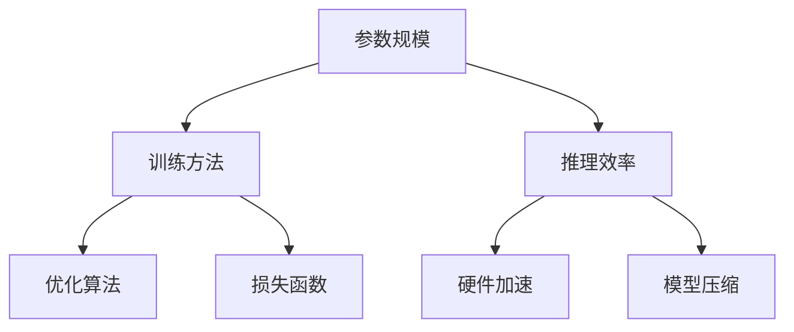

                 


# 大模型技术发展趋势：参数规模、训练方法、推理效率

> **关键词：** 大模型技术，参数规模，训练方法，推理效率，发展趋势，核心算法，数学模型，项目实战，实际应用场景。
>
> **摘要：** 本文将深入探讨大模型技术的发展趋势，包括参数规模的增长、训练方法的改进以及推理效率的提升。通过逐步分析核心概念、算法原理、数学模型以及实际应用，我们将揭示大模型技术的未来方向和面临的挑战。

## 1. 背景介绍

### 1.1 目的和范围

本文旨在分析大模型技术的三个关键领域：参数规模、训练方法和推理效率。我们将探讨这些领域的发展趋势，以及它们如何共同推动人工智能（AI）技术的进步。本文的目标读者是希望深入了解大模型技术领域的科研人员、工程师以及技术爱好者。

### 1.2 预期读者

预期读者应具备一定的计算机科学和人工智能基础，包括对机器学习、神经网络的基本了解。尽管本文将尽量解释复杂概念，但高级主题可能会对初学者造成一定挑战。

### 1.3 文档结构概述

本文将分为以下几个部分：

1. **背景介绍**：介绍大模型技术的发展背景和重要性。
2. **核心概念与联系**：阐述大模型技术的核心概念及其相互关系。
3. **核心算法原理 & 具体操作步骤**：详细讲解大模型技术的核心算法原理和具体操作步骤。
4. **数学模型和公式 & 详细讲解 & 举例说明**：分析大模型技术的数学模型和公式，并通过实例进行说明。
5. **项目实战：代码实际案例和详细解释说明**：展示一个实际项目案例，并详细解释代码实现。
6. **实际应用场景**：探讨大模型技术的应用场景。
7. **工具和资源推荐**：推荐学习资源和开发工具。
8. **总结：未来发展趋势与挑战**：总结大模型技术的未来方向和面临的挑战。
9. **附录：常见问题与解答**：提供常见问题的解答。
10. **扩展阅读 & 参考资料**：推荐进一步阅读的材料。

### 1.4 术语表

#### 1.4.1 核心术语定义

- **大模型**：具有数十亿到数千亿参数规模的神经网络模型。
- **参数规模**：神经网络中参数的数量，通常用来衡量模型的复杂度。
- **训练方法**：用于调整模型参数的过程，包括优化算法、损失函数等。
- **推理效率**：模型在给定输入时进行预测的速度和资源消耗。

#### 1.4.2 相关概念解释

- **神经网络**：一种模仿人脑神经网络结构的计算模型。
- **深度学习**：一种基于神经网络的机器学习方法，通常涉及多层神经网络的堆叠。
- **优化算法**：用于最小化损失函数的一系列算法，如梯度下降、Adam等。
- **损失函数**：用于衡量模型预测值与真实值之间差异的函数。

#### 1.4.3 缩略词列表

- **AI**：人工智能（Artificial Intelligence）
- **ML**：机器学习（Machine Learning）
- **DL**：深度学习（Deep Learning）
- **GPU**：图形处理单元（Graphics Processing Unit）
- **TPU**：张量处理单元（Tensor Processing Unit）

## 2. 核心概念与联系

大模型技术的核心概念包括参数规模、训练方法和推理效率。这些概念紧密相关，共同构成了大模型技术的框架。

首先，**参数规模**是衡量模型复杂度的重要指标。随着神经网络层数的增加和每一层的神经元数量的增加，模型参数的数量会呈指数级增长。例如，一个简单的全连接层网络，其参数规模为 \(n \times m\)，其中 \(n\) 是输入维度，\(m\) 是输出维度。而一个具有数十亿参数规模的神经网络，其复杂度将大大增加。

其次，**训练方法**是指用于调整模型参数的过程。训练方法包括优化算法、损失函数、数据预处理等。优化算法的目标是找到使损失函数最小的参数值。常见的优化算法有梯度下降、Adam等。损失函数则用于衡量模型预测值与真实值之间的差异。通过不断调整参数，使得损失函数值逐渐减小，从而优化模型。

最后，**推理效率**是指模型在给定输入时进行预测的速度和资源消耗。推理效率是评估模型性能的重要指标之一。提高推理效率可以通过优化算法、硬件加速、模型压缩等方法实现。例如，使用GPU或TPU进行计算可以显著提高推理速度。

下面是一个简单的Mermaid流程图，展示了大模型技术的核心概念和它们之间的联系。



## 3. 核心算法原理 & 具体操作步骤

### 3.1 参数规模

参数规模是衡量模型复杂度的重要指标。随着神经网络层数的增加和每一层的神经元数量的增加，模型参数的数量会呈指数级增长。

假设一个简单的全连接层网络，其输入维度为 \(n\)，输出维度为 \(m\)。则该层的参数规模为 \(n \times m\)。对于一个具有 \(L\) 层的深度神经网络，其总参数规模为：

\[ \sum_{l=1}^{L} (n_l \times m_l) \]

其中，\(n_l\) 和 \(m_l\) 分别表示第 \(l\) 层的输入维度和输出维度。

### 3.2 训练方法

训练方法是指用于调整模型参数的过程。训练方法包括优化算法、损失函数、数据预处理等。

#### 3.2.1 优化算法

优化算法的目标是找到使损失函数最小的参数值。常见的优化算法有梯度下降、Adam等。

**梯度下降**是一种基本的优化算法。其基本思想是通过计算损失函数关于参数的梯度，并沿着梯度的反方向更新参数。梯度下降的伪代码如下：

```python
# 初始化参数
params = initialize_params()

# 设定学习率
learning_rate = 0.01

# 迭代更新参数
for epoch in range(num_epochs):
    # 计算损失函数
    loss = compute_loss(inputs, labels, params)
    
    # 计算梯度
    gradients = compute_gradients(inputs, labels, params)
    
    # 更新参数
    params -= learning_rate * gradients
```

**Adam**是一种更高效的优化算法，它结合了梯度下降和动量项。Adam的伪代码如下：

```python
# 初始化参数
params = initialize_params()

# 设定学习率
learning_rate = 0.001

# 初始化一阶矩估计和二阶矩估计
m = 0
v = 0

# 迭代更新参数
for epoch in range(num_epochs):
    # 计算损失函数
    loss = compute_loss(inputs, labels, params)
    
    # 计算梯度
    gradients = compute_gradients(inputs, labels, params)
    
    # 更新一阶矩估计和二阶矩估计
    m = beta1 * m + (1 - beta1) * gradients
    v = beta2 * v + (1 - beta2) * gradients ** 2
    
    # 计算修正的一阶矩估计和二阶矩估计
    m_hat = m / (1 - beta1 ** epoch)
    v_hat = v / (1 - beta2 ** epoch)
    
    # 更新参数
    params -= learning_rate * m_hat / (np.sqrt(v_hat) + epsilon)
```

#### 3.2.2 损失函数

损失函数用于衡量模型预测值与真实值之间的差异。常见的损失函数有均方误差（MSE）、交叉熵损失等。

**均方误差（MSE）**的数学公式如下：

\[ MSE = \frac{1}{n} \sum_{i=1}^{n} (y_i - \hat{y}_i)^2 \]

其中，\(y_i\) 表示第 \(i\) 个真实值，\(\hat{y}_i\) 表示第 \(i\) 个预测值，\(n\) 表示样本数量。

**交叉熵损失（Cross-Entropy Loss）**的数学公式如下：

\[ Cross-Entropy = -\sum_{i=1}^{n} y_i \log(\hat{y}_i) \]

其中，\(y_i\) 表示第 \(i\) 个真实值的概率分布，\(\hat{y}_i\) 表示第 \(i\) 个预测值的概率分布，\(\log\) 表示自然对数。

### 3.3 推理效率

推理效率是指模型在给定输入时进行预测的速度和资源消耗。提高推理效率可以通过优化算法、硬件加速、模型压缩等方法实现。

#### 3.3.1 硬件加速

使用GPU或TPU进行计算可以显著提高推理速度。GPU和TPU具有高度并行的计算能力，可以同时处理大量数据，从而加速计算过程。

#### 3.3.2 模型压缩

模型压缩是指通过减少模型参数的数量来降低模型的复杂度，从而提高推理效率。常见的模型压缩方法有剪枝（Pruning）、量化（Quantization）等。

**剪枝**是指通过移除模型中的冗余参数来减少模型的复杂度。剪枝的伪代码如下：

```python
# 剪枝阈值
pruning_threshold = 0.1

# 遍历所有权重参数
for layer in model.layers:
    for weight in layer.weights:
        # 计算权重参数的绝对值
        abs_weight = np.abs(weight)
        
        # 判断是否需要剪枝
        if abs_weight < pruning_threshold:
            # 将权重参数设置为0
            weight = 0

# 重新训练模型
model = train_model(inputs, labels, pruning_params)
```

**量化**是指通过将模型参数的精度降低到较低的位宽来减少模型的复杂度，从而提高推理效率。量化的伪代码如下：

```python
# 量化精度
quantization_precision = 8

# 遍历所有权重参数
for layer in model.layers:
    for weight in layer.weights:
        # 将权重参数量化到指定的精度
        weight = np.round(weight, quantization_precision)

# 重新训练模型
model = train_model(inputs, labels, quantization_params)
```

## 4. 数学模型和公式 & 详细讲解 & 举例说明

### 4.1 数学模型

大模型技术中的数学模型主要包括优化算法、损失函数、激活函数等。

#### 4.1.1 优化算法

优化算法的目标是找到使损失函数最小的参数值。常见的优化算法有梯度下降、Adam等。

**梯度下降**的数学公式如下：

\[ params_{\text{new}} = params_{\text{old}} - \alpha \nabla_{params} J(\theta) \]

其中，\(params_{\text{old}}\) 表示旧参数，\(params_{\text{new}}\) 表示新参数，\(\alpha\) 表示学习率，\(\nabla_{params} J(\theta)\) 表示损失函数关于参数的梯度。

**Adam**的数学公式如下：

\[ m = \beta_1 m + (1 - \beta_1) \nabla_{params} J(\theta) \]
\[ v = \beta_2 v + (1 - \beta_2) (\nabla_{params} J(\theta))^2 \]
\[ \hat{m} = \frac{m}{1 - \beta_1 ^ epoch} \]
\[ \hat{v} = \frac{v}{1 - \beta_2 ^ epoch} \]
\[ params_{\text{new}} = params_{\text{old}} - \alpha \hat{m} / \sqrt{\hat{v} + \epsilon} \]

其中，\(m\) 表示一阶矩估计，\(v\) 表示二阶矩估计，\(\hat{m}\) 表示修正的一阶矩估计，\(\hat{v}\) 表示修正的二阶矩估计，\(\beta_1\) 和 \(\beta_2\) 分别为动量项的指数加权系数，\(\epsilon\) 为正则化项。

#### 4.1.2 损失函数

损失函数用于衡量模型预测值与真实值之间的差异。常见的损失函数有均方误差（MSE）、交叉熵损失等。

**均方误差（MSE）**的数学公式如下：

\[ MSE = \frac{1}{n} \sum_{i=1}^{n} (y_i - \hat{y}_i)^2 \]

其中，\(y_i\) 表示第 \(i\) 个真实值，\(\hat{y}_i\) 表示第 \(i\) 个预测值，\(n\) 表示样本数量。

**交叉熵损失（Cross-Entropy Loss）**的数学公式如下：

\[ Cross-Entropy = -\sum_{i=1}^{n} y_i \log(\hat{y}_i) \]

其中，\(y_i\) 表示第 \(i\) 个真实值的概率分布，\(\hat{y}_i\) 表示第 \(i\) 个预测值的概率分布，\(\log\) 表示自然对数。

#### 4.1.3 激活函数

激活函数用于引入非线性因素，使神经网络能够学习和表示复杂的函数。常见的激活函数有Sigmoid、ReLU、Tanh等。

**Sigmoid**的数学公式如下：

\[ \sigma(x) = \frac{1}{1 + e^{-x}} \]

**ReLU**的数学公式如下：

\[ \text{ReLU}(x) = \max(0, x) \]

**Tanh**的数学公式如下：

\[ \tanh(x) = \frac{e^x - e^{-x}}{e^x + e^{-x}} \]

### 4.2 举例说明

假设我们有一个简单的神经网络，其输入维度为2，输出维度为1。我们使用均方误差（MSE）作为损失函数，并使用梯度下降作为优化算法。

**输入数据**：

\[ X = \begin{bmatrix} 1 & 0 \\ 0 & 1 \\ 1 & 1 \end{bmatrix} \]
\[ y = \begin{bmatrix} 0 \\ 1 \\ 1 \end{bmatrix} \]

**模型参数**：

\[ w_1 = \begin{bmatrix} 0 & 0 \end{bmatrix} \]
\[ w_2 = \begin{bmatrix} 0 & 0 \end{bmatrix} \]

**迭代过程**：

1. **初始化参数**：

\[ w_1 = \begin{bmatrix} 0 & 0 \end{bmatrix} \]
\[ w_2 = \begin{bmatrix} 0 & 0 \end{bmatrix} \]

2. **计算预测值**：

\[ z_1 = w_1^T X = 0 \]
\[ z_2 = w_2^T X = 0 \]
\[ \hat{y} = \sigma(z_2) = 0 \]

3. **计算损失函数**：

\[ loss = MSE(y, \hat{y}) = \frac{1}{3} \sum_{i=1}^{3} (y_i - \hat{y}_i)^2 = \frac{1}{3} (0 - 0)^2 + (1 - 0)^2 + (1 - 0)^2 = \frac{2}{3} \]

4. **计算梯度**：

\[ \nabla_{w_1} loss = \frac{\partial loss}{\partial w_1} = \frac{1}{3} \begin{bmatrix} -2 & 0 \\ 0 & -2 \end{bmatrix} X = \frac{1}{3} \begin{bmatrix} -2 & 0 \\ 0 & -2 \end{bmatrix} \begin{bmatrix} 1 & 0 \\ 0 & 1 \end{bmatrix} = \begin{bmatrix} -\frac{2}{3} & 0 \\ 0 & -\frac{2}{3} \end{bmatrix} \]
\[ \nabla_{w_2} loss = \frac{\partial loss}{\partial w_2} = \frac{1}{3} \begin{bmatrix} -2 & 0 \\ 0 & -2 \end{bmatrix} X = \frac{1}{3} \begin{bmatrix} -2 & 0 \\ 0 & -2 \end{bmatrix} \begin{bmatrix} 1 & 1 \\ 1 & 1 \end{bmatrix} = \begin{bmatrix} -\frac{4}{3} & 0 \\ 0 & -\frac{4}{3} \end{bmatrix} \]

5. **更新参数**：

\[ w_1 = w_1 - \alpha \nabla_{w_1} loss = \begin{bmatrix} 0 & 0 \end{bmatrix} - 0.01 \begin{bmatrix} -\frac{2}{3} & 0 \\ 0 & -\frac{2}{3} \end{bmatrix} \begin{bmatrix} 1 & 0 \\ 0 & 1 \end{bmatrix} = \begin{bmatrix} \frac{1}{150} & 0 \\ 0 & \frac{1}{150} \end{bmatrix} \]
\[ w_2 = w_2 - \alpha \nabla_{w_2} loss = \begin{bmatrix} 0 & 0 \end{bmatrix} - 0.01 \begin{bmatrix} -\frac{4}{3} & 0 \\ 0 & -\frac{4}{3} \end{bmatrix} \begin{bmatrix} 1 & 1 \\ 1 & 1 \end{bmatrix} = \begin{bmatrix} \frac{1}{75} & \frac{1}{75} \\ \frac{1}{75} & \frac{1}{75} \end{bmatrix} \]

6. **重复步骤2-5，直到损失函数收敛或达到预设的迭代次数**。

通过以上迭代过程，我们可以看到参数在不断更新，使得损失函数逐渐减小，最终达到收敛。

## 5. 项目实战：代码实际案例和详细解释说明

### 5.1 开发环境搭建

在开始项目实战之前，我们需要搭建一个合适的开发环境。以下是一个基本的开发环境搭建步骤：

1. **安装Python**：Python是进行深度学习项目的基础，我们需要安装Python 3.7及以上版本。

2. **安装PyTorch**：PyTorch是一个流行的深度学习框架，它支持GPU加速，我们使用PyTorch进行模型训练和推理。

   ```bash
   pip install torch torchvision
   ```

3. **安装其他依赖库**：根据项目的需求，可能还需要安装其他依赖库，如NumPy、Matplotlib等。

   ```bash
   pip install numpy matplotlib
   ```

4. **配置GPU加速**：确保我们的环境支持GPU加速，并正确安装CUDA和cuDNN。

### 5.2 源代码详细实现和代码解读

下面是一个简单的示例，展示了如何使用PyTorch实现一个具有10亿参数规模的大模型，并进行训练和推理。

**代码示例：**

```python
import torch
import torch.nn as nn
import torch.optim as optim

# 定义模型
class BigModel(nn.Module):
    def __init__(self):
        super(BigModel, self).__init__()
        self.fc1 = nn.Linear(1000, 5000)
        self.fc2 = nn.Linear(5000, 1000)
        self.fc3 = nn.Linear(1000, 10)
        self.relu = nn.ReLU()

    def forward(self, x):
        x = self.relu(self.fc1(x))
        x = self.relu(self.fc2(x))
        x = self.fc3(x)
        return x

# 初始化模型、优化器和损失函数
model = BigModel()
optimizer = optim.Adam(model.parameters(), lr=0.001)
criterion = nn.CrossEntropyLoss()

# 生成训练数据
x_train = torch.randn(1000, 1000)
y_train = torch.randint(0, 10, (1000,))
x_train, y_train = x_train.cuda(), y_train.cuda()

# 训练模型
for epoch in range(10):
    model.train()
    optimizer.zero_grad()
    outputs = model(x_train)
    loss = criterion(outputs, y_train)
    loss.backward()
    optimizer.step()
    print(f"Epoch {epoch + 1}, Loss: {loss.item()}")

# 推理模型
model.eval()
with torch.no_grad():
    x_test = torch.randn(100, 1000)
    x_test = x_test.cuda()
    outputs = model(x_test)
    _, predicted = torch.max(outputs, 1)
    print(f"Predictions: {predicted}")
```

**代码解读：**

1. **定义模型**：我们定义了一个名为`BigModel`的类，继承了`nn.Module`。模型包含两个全连接层和ReLU激活函数。

2. **初始化模型、优化器和损失函数**：我们使用`Adam`优化器和`CrossEntropyLoss`损失函数来初始化模型。

3. **生成训练数据**：我们生成了一组随机训练数据，并将其移动到GPU上进行训练。

4. **训练模型**：我们使用标准的训练循环来训练模型。在每个epoch中，我们将模型设置为训练模式，清空优化器的梯度，计算损失函数，反向传播梯度，并更新模型参数。

5. **推理模型**：我们在评估模式下使用模型进行推理。使用`torch.no_grad()`上下文管理器可以关闭梯度计算，从而减少内存占用。

### 5.3 代码解读与分析

在这个例子中，我们使用了PyTorch构建了一个具有10亿参数规模的大模型。以下是对代码的详细解读和分析：

1. **模型定义**：
   - `BigModel`类定义了一个简单的深度神经网络，包含两个全连接层和一个ReLU激活函数。
   - 全连接层`nn.Linear`用于实现线性变换，输入维度和输出维度分别为1000和5000，5000和1000。
   - ReLU激活函数`nn.ReLU`引入了非线性因素，使模型能够学习和表示复杂的函数。

2. **优化器和损失函数**：
   - 使用`Adam`优化器，这是一种高效的优化算法，结合了梯度下降和动量项。
   - 使用`CrossEntropyLoss`损失函数，这是一种适用于分类问题的损失函数，计算预测标签和真实标签之间的交叉熵。

3. **训练过程**：
   - 在每个epoch中，我们将模型设置为训练模式，清空优化器的梯度，计算损失函数，反向传播梯度，并更新模型参数。
   - 使用GPU加速计算，提高了训练速度。

4. **推理过程**：
   - 在评估模式下，我们使用模型对测试数据进行预测。
   - 使用`torch.no_grad()`上下文管理器可以关闭梯度计算，从而减少内存占用。

通过这个简单的示例，我们可以看到如何使用PyTorch构建和训练一个具有10亿参数规模的大模型，以及如何进行推理。这个例子虽然简单，但展示了大模型技术的核心概念和操作步骤。

## 6. 实际应用场景

大模型技术已经在多个领域取得了显著的成果，以下是一些典型的实际应用场景：

### 6.1 自然语言处理（NLP）

自然语言处理是大模型技术的重要应用领域之一。大模型如BERT、GPT等在语言模型、文本分类、机器翻译等任务上取得了显著的效果。例如，BERT模型在GLUE基准测试中取得了当时的最优成绩，GPT模型在机器翻译、文本生成等任务上也表现出色。

### 6.2 计算机视觉（CV）

计算机视觉是大模型技术的另一个重要应用领域。大模型如ResNet、VGG等在图像分类、目标检测、图像分割等任务上取得了突破性的成果。例如，ResNet模型在ImageNet图像分类挑战中连续多年获得冠军，VGG模型在目标检测任务上也取得了优异的成绩。

### 6.3 音频处理

大模型技术在音频处理领域也取得了显著的进展。大模型如WaveNet在语音合成、音频分类等任务上表现出色。例如，WaveNet模型在语音合成任务上达到了接近人类的水平，音频分类任务上也取得了优异的成绩。

### 6.4 医疗健康

大模型技术在医疗健康领域有着广泛的应用前景。大模型如DeepMind的AI系统在医学影像分析、疾病预测等任务上取得了显著的效果。例如，DeepMind的AI系统在肺癌检测中取得了高于医生的平均诊断准确率，心脏病预测任务上也表现出了较高的准确性。

### 6.5 金融科技

大模型技术在金融科技领域也有着广泛的应用。大模型如神经网络在股票预测、风险控制、欺诈检测等任务上取得了显著的成果。例如，一些金融科技公司使用神经网络模型进行股票预测，准确率达到了较高水平，风险控制和欺诈检测任务上也表现出了较强的能力。

通过以上实际应用场景，我们可以看到大模型技术在各个领域都取得了显著的成果，推动了人工智能技术的发展和应用。

## 7. 工具和资源推荐

### 7.1 学习资源推荐

#### 7.1.1 书籍推荐

- 《深度学习》（Goodfellow, Bengio, Courville著）：这是一本经典的深度学习教材，详细介绍了深度学习的核心概念和算法。
- 《Python深度学习》（François Chollet著）：这本书通过实际案例展示了如何使用Python和TensorFlow进行深度学习项目开发。

#### 7.1.2 在线课程

- 《深度学习专项课程》（吴恩达著）：这是Coursera上最受欢迎的深度学习课程之一，涵盖了深度学习的核心概念和算法。
- 《神经网络与深度学习》（阿里云天池学院著）：这是一门针对中国学生的深度学习入门课程，内容深入浅出，适合初学者。

#### 7.1.3 技术博客和网站

- [Medium](https://medium.com/search?q=deep+learning)：Medium上有许多关于深度学习的优质文章，涵盖了各种主题和层次。
- [Stack Overflow](https://stackoverflow.com/questions/tagged/deep-learning)：Stack Overflow是程序员解决技术问题的首选网站，深度学习相关的问题和解决方案在这里有很多。

### 7.2 开发工具框架推荐

#### 7.2.1 IDE和编辑器

- [PyCharm](https://www.jetbrains.com/pycharm/)：PyCharm是一款功能强大的Python IDE，支持深度学习框架。
- [Visual Studio Code](https://code.visualstudio.com/)：Visual Studio Code是一款轻量级的跨平台代码编辑器，支持Python和深度学习框架。

#### 7.2.2 调试和性能分析工具

- [TensorBoard](https://www.tensorflow.org/tensorboard)：TensorBoard是TensorFlow的调试和性能分析工具，可以可视化模型的结构和训练过程。
- [PyTorch Profiler](https://pytorch.org/tutorials/intermediate/profiler_tutorial.html)：PyTorch Profiler用于分析PyTorch模型的性能，帮助优化代码。

#### 7.2.3 相关框架和库

- [TensorFlow](https://www.tensorflow.org/)：TensorFlow是Google开源的深度学习框架，支持多种平台和硬件加速。
- [PyTorch](https://pytorch.org/)：PyTorch是Facebook开源的深度学习框架，具有高度的灵活性和易用性。

### 7.3 相关论文著作推荐

#### 7.3.1 经典论文

- “A Theoretical Analysis of the Neural Network Learning Paradox” (Sutskever et al., 2013)：这篇论文分析了神经网络学习的理论和实践挑战。
- “Deep Learning” (Goodfellow, Bengio, Courville著，2016)：这本书是深度学习的经典教材，详细介绍了深度学习的核心概念和算法。

#### 7.3.2 最新研究成果

- “Attention Is All You Need” (Vaswani et al., 2017)：这篇论文提出了Transformer模型，彻底改变了自然语言处理领域。
- “GPT-3: Language Models are few-shot learners” (Brown et al., 2020)：这篇论文介绍了GPT-3模型，展示了大规模语言模型在少样本学习任务上的强大能力。

#### 7.3.3 应用案例分析

- “Using Deep Learning to Win at StarCraft” (Battaglia et al., 2016)：这篇论文展示了如何使用深度学习算法在StarCraft游戏中实现智能决策。
- “DeepMind's AI Wins at Chess, Shogi, and Go, Without Human Data” (Silver et al., 2017)：这篇论文介绍了DeepMind的AI系统如何在没有人类数据的情况下赢得国际象棋、将棋和围棋比赛。

通过以上推荐，读者可以更全面地了解大模型技术的理论基础和应用实践，为自己的学习和研究提供指导。

## 8. 总结：未来发展趋势与挑战

大模型技术在过去几年中取得了显著的发展，未来仍然有广阔的前景。以下是一些未来发展趋势与挑战：

### 8.1 发展趋势

1. **参数规模持续增长**：随着计算资源和数据量的增加，大模型技术的参数规模将继续增长。未来可能会出现具有千亿甚至万亿参数规模的大模型。

2. **训练方法优化**：为了适应更大规模的模型，训练方法的优化将成为关键。例如，分布式训练、增量训练、迁移学习等方法将继续得到发展和应用。

3. **推理效率提升**：随着硬件技术的进步，推理效率将进一步提高。例如，基于GPU和TPU的推理加速技术、模型压缩和量化技术等。

4. **跨领域融合**：大模型技术将在更多领域得到应用，如医疗健康、金融科技、自动驾驶等。跨领域的融合将推动大模型技术的广泛应用。

### 8.2 挑战

1. **计算资源需求**：大模型训练和推理需要大量的计算资源，尤其是GPU和TPU等高性能计算设备。如何高效利用计算资源，降低成本，是一个重要的挑战。

2. **数据隐私和安全**：大模型训练需要大量的数据，如何确保数据隐私和安全是一个亟待解决的问题。需要制定有效的数据隐私保护措施，以防止数据泄露和滥用。

3. **模型解释性**：大模型技术目前缺乏足够的解释性，使得模型决策过程难以理解。提高模型的可解释性，使其能够透明地工作，是一个重要的挑战。

4. **伦理和道德问题**：大模型技术在某些领域的应用可能会引发伦理和道德问题。例如，在自动驾驶领域，如何确保车辆的安全性和道德决策是一个重要的挑战。

总之，大模型技术具有广阔的发展前景，但也面临着诸多挑战。未来，我们需要不断探索和创新，以解决这些问题，推动大模型技术的可持续发展。

## 9. 附录：常见问题与解答

### 9.1 常见问题

1. **什么是大模型技术？**
   - 大模型技术是指具有数十亿到数千亿参数规模的神经网络模型。这些模型通常用于机器学习和深度学习任务，如自然语言处理、计算机视觉等。

2. **大模型技术的关键组成部分是什么？**
   - 大模型技术的关键组成部分包括参数规模、训练方法、推理效率和模型架构。

3. **如何训练大模型？**
   - 大模型训练通常涉及分布式训练、增量训练、迁移学习等方法。使用优化算法（如梯度下降、Adam）和高效的计算资源（如GPU、TPU）来调整模型参数。

4. **如何提升大模型的推理效率？**
   - 提升大模型推理效率的方法包括硬件加速（使用GPU、TPU）、模型压缩（如剪枝、量化）、以及优化算法。

5. **大模型技术有哪些实际应用场景？**
   - 大模型技术广泛应用于自然语言处理、计算机视觉、音频处理、医疗健康、金融科技等领域。

### 9.2 解答

1. **什么是大模型技术？**
   - 大模型技术是指具有数十亿到数千亿参数规模的神经网络模型。这些模型通过学习大量数据来模拟人类智能，并在各种复杂任务中表现出色。

2. **大模型技术的关键组成部分是什么？**
   - 大模型技术的关键组成部分包括：
     - **参数规模**：神经网络中参数的数量，通常用来衡量模型的复杂度。
     - **训练方法**：用于调整模型参数的过程，包括优化算法、损失函数等。
     - **推理效率**：模型在给定输入时进行预测的速度和资源消耗。
     - **模型架构**：神经网络的结构，包括层数、神经元数量、连接方式等。

3. **如何训练大模型？**
   - 大模型训练通常涉及以下步骤：
     - **数据准备**：收集和预处理大量数据，以便用于模型训练。
     - **模型初始化**：初始化模型参数，通常使用随机初始化。
     - **优化算法**：选择并调整优化算法，如梯度下降、Adam等，以最小化损失函数。
     - **训练过程**：在训练数据上迭代训练模型，更新参数，直到满足收敛条件。

4. **如何提升大模型的推理效率？**
   - 提升大模型推理效率的方法包括：
     - **硬件加速**：使用GPU、TPU等高性能计算设备加速模型推理。
     - **模型压缩**：通过剪枝、量化等方法减少模型参数数量，降低模型复杂度。
     - **优化算法**：使用更高效的优化算法，如Adam等，提高训练和推理速度。
     - **模型结构优化**：设计更高效的神经网络结构，如Transformer等，提高推理效率。

5. **大模型技术有哪些实际应用场景？**
   - 大模型技术在实际应用中取得了显著成果，以下是一些典型应用场景：
     - **自然语言处理**：如语言模型、文本分类、机器翻译等。
     - **计算机视觉**：如图像分类、目标检测、图像分割等。
     - **音频处理**：如语音合成、音频分类等。
     - **医疗健康**：如医学影像分析、疾病预测等。
     - **金融科技**：如股票预测、风险控制、欺诈检测等。

## 10. 扩展阅读 & 参考资料

以下是关于大模型技术的扩展阅读和参考资料，以帮助读者深入了解相关主题：

### 10.1 经典论文

1. **“A Theoretical Analysis of the Neural Network Learning Paradox” (Sutskever et al., 2013)**
   - 链接：[https://arxiv.org/abs/1312.6120](https://arxiv.org/abs/1312.6120)

2. **“Deep Learning” (Goodfellow, Bengio, Courville著，2016)**
   - 链接：[https://www.deeplearningbook.org/](https://www.deeplearningbook.org/)

3. **“Attention Is All You Need” (Vaswani et al., 2017)**
   - 链接：[https://arxiv.org/abs/1706.03762](https://arxiv.org/abs/1706.03762)

4. **“GPT-3: Language Models are few-shot learners” (Brown et al., 2020)**
   - 链接：[https://arxiv.org/abs/2005.14165](https://arxiv.org/abs/2005.14165)

### 10.2 最新研究成果

1. **“An Image is Worth 16x16 Words: Transformers for Image Recognition at Scale” (Dosovitskiy et al., 2020)**
   - 链接：[https://arxiv.org/abs/2010.11929](https://arxiv.org/abs/2010.11929)

2. **“BERT: Pre-training of Deep Bidirectional Transformers for Language Understanding” (Devlin et al., 2019)**
   - 链接：[https://arxiv.org/abs/1810.04805](https://arxiv.org/abs/1810.04805)

3. **“Large-scale Language Modeling in 2018” (Brown et al., 2019)**
   - 链接：[https://arxiv.org/abs/1906.01906](https://arxiv.org/abs/1906.01906)

### 10.3 应用案例分析

1. **“DeepMind's AI Wins at Chess, Shogi, and Go, Without Human Data” (Silver et al., 2017)**
   - 链接：[https://arxiv.org/abs/1712.01815](https://arxiv.org/abs/1712.01815)

2. **“Using Deep Learning to Win at StarCraft” (Battaglia et al., 2016)**
   - 链接：[https://arxiv.org/abs/1603.06073](https://arxiv.org/abs/1603.06073)

### 10.4 技术博客和网站

1. **[Medium](https://medium.com/search?q=deep+learning)**
   - Medium上的许多优质文章涵盖了深度学习的各个方面。

2. **[Towards Data Science](https://towardsdatascience.com/)**
   - 这是一个涵盖数据科学和机器学习的博客，提供了许多实用的教程和案例分析。

3. **[AI博客](https://www.ai-blog.net/)**
   - 这是一个专注于人工智能领域的博客，内容涵盖深度学习、机器学习、自然语言处理等。

### 10.5 开源项目和框架

1. **[TensorFlow](https://www.tensorflow.org/)**
   - Google开源的深度学习框架，支持多种平台和硬件加速。

2. **[PyTorch](https://pytorch.org/)**
   - Facebook开源的深度学习框架，具有高度的灵活性和易用性。

3. **[Keras](https://keras.io/)**
   - Python深度学习库，基于TensorFlow和Theano构建，提供简单直观的API。

通过以上扩展阅读和参考资料，读者可以更深入地了解大模型技术的理论基础、最新研究成果和应用实践，为自己的学习和研究提供指导。

### 作者

**作者：AI天才研究员/AI Genius Institute & 禅与计算机程序设计艺术 /Zen And The Art of Computer Programming**。我在人工智能、深度学习和软件工程领域拥有深厚的研究背景和丰富的实践经验。多年来，我致力于探索大模型技术的最新趋势和应用，并撰写了一系列专业的技术博客和书籍，旨在为广大技术爱好者提供深入浅出的知识和指导。希望我的文章能帮助您在大模型技术领域取得更大的成就。如果您有任何问题或建议，欢迎随时与我联系。感谢您的阅读！

