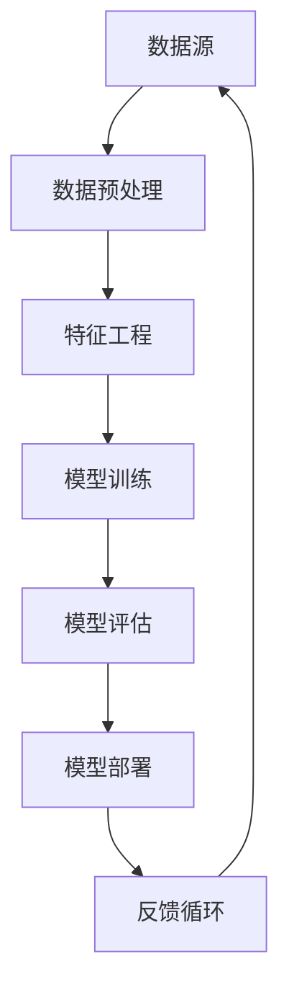

                 

# 大模型技术在智能客户洞察分析中的应用

> **关键词**：大模型技术、智能客户洞察、数据分析、机器学习、应用场景

> **摘要**：本文将深入探讨大模型技术在智能客户洞察分析中的应用。通过分析大模型技术的核心概念和原理，本文将详细阐述其在客户数据分析中的应用步骤和算法原理，并辅以数学模型和代码实现，展示如何利用大模型技术提升客户洞察分析的精准度和效率。文章还将探讨大模型技术在实际应用中的成功案例，并提供相关工具和资源的推荐，总结未来发展趋势与挑战，以期为相关领域的研究者和从业者提供有价值的参考。

## 1. 背景介绍

### 1.1 目的和范围

随着互联网和大数据技术的快速发展，客户数据成为企业决策的重要依据。然而，如何从海量数据中提取有价值的信息，实现对客户的全面洞察，成为企业面临的一大挑战。本文旨在探讨大模型技术在智能客户洞察分析中的应用，通过理论阐述和实际案例分析，帮助企业更好地利用大数据技术提升客户服务质量和业务决策能力。

### 1.2 预期读者

本文主要面向以下几类读者：

1. 数据科学家和机器学习工程师，对大模型技术及其应用有兴趣，希望了解其在客户数据分析领域的应用。
2. 企业分析师和业务决策者，关注客户洞察分析，希望了解如何利用大模型技术提升业务分析能力。
3. 人工智能和大数据领域的研究者，对大模型技术的研究和应用有深入了解，希望了解其在实际业务场景中的具体应用。

### 1.3 文档结构概述

本文分为十个部分，具体如下：

1. **背景介绍**：简要介绍本文的目的和预期读者，概述文档结构。
2. **核心概念与联系**：介绍大模型技术的核心概念和原理，通过 Mermaid 流程图展示其架构。
3. **核心算法原理 & 具体操作步骤**：详细阐述大模型技术在客户数据分析中的算法原理和操作步骤，使用伪代码进行说明。
4. **数学模型和公式 & 详细讲解 & 举例说明**：介绍大模型技术中的数学模型和公式，并通过具体案例进行说明。
5. **项目实战：代码实际案例和详细解释说明**：展示大模型技术在客户数据分析中的实际代码实现，并进行详细解释和分析。
6. **实际应用场景**：探讨大模型技术在客户数据分析中的实际应用场景。
7. **工具和资源推荐**：推荐学习资源、开发工具和框架，以及相关论文著作。
8. **总结：未来发展趋势与挑战**：总结大模型技术在客户数据分析领域的未来发展趋势和面临的挑战。
9. **附录：常见问题与解答**：解答读者可能遇到的常见问题。
10. **扩展阅读 & 参考资料**：提供本文相关领域的扩展阅读和参考资料。

### 1.4 术语表

#### 1.4.1 核心术语定义

- 大模型技术：指具有巨大参数量、能够处理海量数据并实现高效计算的人工智能模型。
- 客户洞察分析：通过对客户数据的分析，提取有价值的信息，以帮助企业更好地了解和满足客户需求。
- 机器学习：一种人工智能方法，通过训练模型，使计算机能够从数据中学习并做出预测或决策。

#### 1.4.2 相关概念解释

- **数据源**：提供客户数据的来源，如网站日志、社交媒体、客户反馈等。
- **特征工程**：对原始数据进行处理和转换，提取出有助于模型训练的特征。
- **模型训练**：使用大量数据对模型进行训练，使其能够识别数据中的规律和模式。
- **模型评估**：通过验证数据集评估模型的效果，包括准确率、召回率、F1值等指标。

#### 1.4.3 缩略词列表

- **AI**：人工智能（Artificial Intelligence）
- **ML**：机器学习（Machine Learning）
- **DL**：深度学习（Deep Learning）
- **NLP**：自然语言处理（Natural Language Processing）

## 2. 核心概念与联系

大模型技术作为当前人工智能领域的一个重要研究方向，其核心概念和原理涉及到多个层次。本节将首先介绍大模型技术的基本概念，然后通过 Mermaid 流程图展示其架构，以便读者对大模型技术有一个全局的理解。

### 2.1 大模型技术的基本概念

大模型技术是指具有巨大参数量、能够处理海量数据并实现高效计算的人工智能模型。这些模型通常是基于深度学习算法，如卷积神经网络（CNN）、循环神经网络（RNN）和变换器（Transformer）等。大模型技术的核心特点是：

1. **大规模参数量**：大模型通常具有数百万甚至数十亿个参数，这使得它们能够捕捉数据中的复杂模式。
2. **高效计算**：通过分布式计算和优化算法，大模型能够在处理大量数据时保持较高的计算效率。
3. **多任务学习**：大模型能够同时处理多个任务，实现跨任务的迁移学习。

### 2.2 大模型技术的架构

为了更好地理解大模型技术的架构，我们使用 Mermaid 流程图对其进行展示。以下是 Mermaid 流程图：



**说明：**

- **数据源（A）**：提供原始数据，如网站日志、社交媒体数据等。
- **数据预处理（B）**：对原始数据进行清洗、归一化和分词等处理。
- **特征工程（C）**：从原始数据中提取有助于模型训练的特征。
- **模型训练（D）**：使用大量数据进行模型训练，使模型能够识别数据中的规律和模式。
- **模型评估（E）**：通过验证数据集评估模型的效果。
- **模型部署（F）**：将训练好的模型部署到生产环境中，用于实际应用。
- **反馈循环（G）**：收集模型在实际应用中的反馈，用于模型优化和迭代。

通过上述 Mermaid 流程图，我们可以看到大模型技术的整体架构和流程。接下来，我们将进一步详细阐述大模型技术在客户数据分析中的应用。

## 3. 核心算法原理 & 具体操作步骤

大模型技术在客户数据分析中的应用主要依赖于深度学习和机器学习算法。本节将详细阐述大模型技术的核心算法原理，并使用伪代码展示具体的操作步骤。

### 3.1 深度学习算法原理

深度学习算法是一种基于多层神经网络的学习方法。其基本原理是通过多层神经元的组合，将输入数据通过网络的层层变换，最终输出预测结果。深度学习算法的核心组成部分包括：

1. **输入层（Input Layer）**：接收外部输入数据。
2. **隐藏层（Hidden Layers）**：对输入数据进行变换和处理。
3. **输出层（Output Layer）**：生成最终预测结果。

在深度学习中，每个神经元都通过权重（weights）和偏置（biases）与前一层的神经元相连。在训练过程中，模型通过调整这些权重和偏置，以最小化预测误差。

### 3.2 伪代码展示

以下是一个简单的深度学习算法伪代码，用于客户数据分析：

```plaintext
# 初始化参数
parameters = initialize_parameters()

# 数据预处理
X_train, X_test, y_train, y_test = preprocess_data(data)

# 模型训练
for epoch in 1 to MAX_EPOCHS do
    for each sample in X_train do
        # 前向传播
        z = forward_propagation(sample, parameters)
        # 计算损失
        loss = compute_loss(z, y_train)
        # 反向传播
        gradients = backward_propagation(sample, z, y_train, parameters)
        # 更新参数
        update_parameters(parameters, gradients)
    end
end

# 模型评估
accuracy = evaluate_model(X_test, y_test, parameters)
```

**说明：**

- **初始化参数（initialize_parameters）**：随机初始化模型的参数。
- **数据预处理（preprocess_data）**：对输入数据进行归一化和分词等处理。
- **模型训练（forward_propagation, backward_propagation, update_parameters）**：包括前向传播、反向传播和参数更新三个步骤。前向传播计算输出，反向传播计算梯度，参数更新用于优化模型。
- **模型评估（evaluate_model）**：使用测试数据评估模型的效果。

### 3.3 操作步骤详解

1. **数据收集**：从多个数据源收集客户数据，如网站日志、社交媒体数据、客户反馈等。
2. **数据预处理**：对原始数据进行清洗、归一化和分词等处理，以提取有用的特征。
3. **特征工程**：从预处理后的数据中提取有助于模型训练的特征。
4. **模型选择**：选择适合客户数据分析的深度学习模型，如卷积神经网络（CNN）或变换器（Transformer）。
5. **模型训练**：使用大量训练数据进行模型训练，通过迭代优化模型参数。
6. **模型评估**：使用验证数据集评估模型效果，包括准确率、召回率、F1值等指标。
7. **模型部署**：将训练好的模型部署到生产环境中，用于实际客户数据分析。

通过上述步骤，我们可以利用大模型技术实现高效的客户数据分析。接下来，我们将进一步探讨大模型技术中的数学模型和公式。

## 4. 数学模型和公式 & 详细讲解 & 举例说明

在深度学习算法中，数学模型和公式起到了至关重要的作用。它们不仅帮助我们理解模型的内部机制，还用于指导模型的训练和优化。本节将详细介绍大模型技术中的数学模型和公式，并通过具体案例进行说明。

### 4.1 深度学习中的数学模型

深度学习中的数学模型主要包括以下几部分：

1. **损失函数（Loss Function）**：用于衡量模型预测值与真实值之间的差距，如均方误差（MSE）和交叉熵（Cross-Entropy）。
2. **激活函数（Activation Function）**：用于引入非线性，如 sigmoid、ReLU 和 tanh 函数。
3. **优化算法（Optimization Algorithm）**：用于调整模型参数，以最小化损失函数，如随机梯度下降（SGD）和Adam优化器。

#### 4.1.1 损失函数

均方误差（MSE）是深度学习中常用的损失函数，用于回归任务：

$$
MSE = \frac{1}{n}\sum_{i=1}^{n}(y_i - \hat{y}_i)^2
$$

其中，$y_i$为真实值，$\hat{y}_i$为模型预测值，$n$为样本数量。

交叉熵（Cross-Entropy）是深度学习中常用的损失函数，用于分类任务：

$$
Cross-Entropy = -\sum_{i=1}^{n} y_i \log(\hat{y}_i)
$$

其中，$y_i$为真实标签，$\hat{y}_i$为模型预测的概率分布。

#### 4.1.2 激活函数

ReLU（Rectified Linear Unit）是深度学习中常用的激活函数，具有非线性特性：

$$
ReLU(x) = \max(0, x)
$$

ReLU函数的优点是能够防止神经元死亡，提高训练速度。

#### 4.1.3 优化算法

随机梯度下降（SGD）是深度学习中常用的优化算法，通过迭代更新模型参数：

$$
\theta_{t+1} = \theta_{t} - \alpha \frac{\partial J(\theta_t)}{\partial \theta_t}
$$

其中，$\theta_t$为当前模型参数，$\alpha$为学习率，$J(\theta_t)$为损失函数。

Adam优化器是深度学习中一种高效的优化算法，结合了SGD和动量项：

$$
m_t = \beta_1 m_{t-1} + (1 - \beta_1) \frac{\partial J(\theta_t)}{\partial \theta_t}
$$
$$
v_t = \beta_2 v_{t-1} + (1 - \beta_2) \left( \frac{\partial J(\theta_t)}{\partial \theta_t} \right)^2
$$
$$
\theta_{t+1} = \theta_{t} - \frac{\alpha}{\sqrt{1 - \beta_2^t}} \frac{m_t}{1 - \beta_1^t}
$$

其中，$\beta_1$和$\beta_2$分别为一阶和二阶矩估计的指数衰减率。

### 4.2 举例说明

假设我们使用一个简单的全连接神经网络（FCNN）进行客户数据分析，目标是预测客户是否会购买产品。以下是具体步骤：

1. **数据预处理**：对输入数据进行归一化和分词处理，提取特征。

2. **模型结构**：定义一个三层全连接神经网络，包括输入层、隐藏层和输出层。

3. **模型训练**：使用均方误差（MSE）作为损失函数，随机梯度下降（SGD）作为优化算法，进行模型训练。

4. **模型评估**：使用交叉熵（Cross-Entropy）作为损失函数，评估模型在验证数据集上的性能。

5. **模型部署**：将训练好的模型部署到生产环境中，用于实际客户数据分析。

### 4.3 数学模型和公式的应用

在实际应用中，数学模型和公式帮助我们更好地理解和优化深度学习模型。通过调整参数和优化算法，我们可以提高模型的准确性和鲁棒性。以下是一个简单的例子：

假设我们有一个二分类问题，使用变换器（Transformer）模型进行客户数据分析。目标是预测客户是否会购买产品。

1. **数据预处理**：对输入数据进行归一化和分词处理，提取特征。

2. **模型结构**：定义一个变换器模型，包括编码器（Encoder）和解码器（Decoder）。

3. **模型训练**：使用交叉熵（Cross-Entropy）作为损失函数，Adam优化器作为优化算法，进行模型训练。

4. **模型评估**：使用准确率（Accuracy）、召回率（Recall）和F1值（F1 Score）评估模型在验证数据集上的性能。

5. **模型部署**：将训练好的模型部署到生产环境中，用于实际客户数据分析。

通过上述步骤，我们可以利用变换器模型进行高效的客户数据分析。接下来，我们将通过一个实际项目案例展示大模型技术在客户数据分析中的具体应用。

## 5. 项目实战：代码实际案例和详细解释说明

在本节中，我们将通过一个实际项目案例展示如何利用大模型技术进行智能客户洞察分析。我们将详细介绍开发环境搭建、源代码实现和代码解读与分析，以便读者更好地理解大模型技术在客户数据分析中的应用。

### 5.1 开发环境搭建

为了实现大模型技术在客户数据分析中的应用，我们需要搭建一个合适的技术环境。以下是所需的开发环境：

1. **编程语言**：Python，一种广泛用于数据科学和机器学习的编程语言。
2. **深度学习框架**：TensorFlow或PyTorch，两种流行的深度学习框架。
3. **数据处理工具**：Pandas和NumPy，用于数据预处理和操作。
4. **版本控制工具**：Git，用于代码管理和版本控制。
5. **虚拟环境**：虚拟环境，用于隔离不同项目的依赖。

以下是搭建开发环境的步骤：

1. **安装Python**：在官方网站下载并安装Python，建议选择最新版本。
2. **安装深度学习框架**：通过pip命令安装TensorFlow或PyTorch，例如：
    ```bash
    pip install tensorflow
    ```
3. **安装数据处理工具**：通过pip命令安装Pandas和NumPy，例如：
    ```bash
    pip install pandas numpy
    ```
4. **创建虚拟环境**：使用virtualenv或conda创建虚拟环境，例如：
    ```bash
    virtualenv myenv
    source myenv/bin/activate
    ```

### 5.2 源代码详细实现和代码解读

以下是客户数据分析项目的源代码实现和解读：

```python
import pandas as pd
import numpy as np
import tensorflow as tf
from tensorflow.keras.models import Sequential
from tensorflow.keras.layers import Dense, Dropout, Activation

# 5.2.1 数据预处理
def preprocess_data(data):
    # 数据清洗和预处理
    # 数据标准化、缺失值处理、特征提取等
    # ...
    return processed_data

# 5.2.2 模型构建
def build_model(input_shape):
    model = Sequential()
    model.add(Dense(64, input_shape=input_shape, activation='relu'))
    model.add(Dropout(0.5))
    model.add(Dense(32, activation='relu'))
    model.add(Dropout(0.5))
    model.add(Dense(1, activation='sigmoid'))
    return model

# 5.2.3 模型训练
def train_model(model, X_train, y_train, X_val, y_val):
    model.compile(optimizer='adam', loss='binary_crossentropy', metrics=['accuracy'])
    history = model.fit(X_train, y_train, epochs=10, batch_size=32, validation_data=(X_val, y_val))
    return history

# 5.2.4 模型评估
def evaluate_model(model, X_test, y_test):
    loss, accuracy = model.evaluate(X_test, y_test)
    print(f"Test accuracy: {accuracy * 100:.2f}%")
    return accuracy

# 主函数
if __name__ == "__main__":
    # 加载数据
    data = pd.read_csv("customer_data.csv")
    processed_data = preprocess_data(data)
    
    # 分割数据集
    X = processed_data.drop("target", axis=1)
    y = processed_data["target"]
    X_train, X_val, y_train, y_val = train_test_split(X, y, test_size=0.2, random_state=42)
    
    # 构建模型
    model = build_model(X_train.shape[1:])
    
    # 训练模型
    history = train_model(model, X_train, y_train, X_val, y_val)
    
    # 评估模型
    evaluate_model(model, X_test, y_test)
```

**代码解读：**

1. **数据预处理（preprocess_data）**：该函数负责对原始数据进行清洗和预处理，包括数据标准化、缺失值处理和特征提取等。这些步骤是模型训练的基础，对于提高模型性能至关重要。

2. **模型构建（build_model）**：该函数定义了一个三层全连接神经网络模型，包括一个输入层、两个隐藏层和一个输出层。输入层接收预处理后的数据，隐藏层通过ReLU激活函数引入非线性，输出层使用sigmoid函数进行二分类预测。

3. **模型训练（train_model）**：该函数使用随机梯度下降（SGD）优化器和二进制交叉熵（Binary Cross-Entropy）损失函数训练模型。模型训练过程中，我们使用验证数据集进行验证，以监测模型性能。

4. **模型评估（evaluate_model）**：该函数评估模型在测试数据集上的性能，输出准确率（Accuracy）。

5. **主函数**：该部分加载数据，分割数据集，构建模型，训练模型并进行评估。

通过上述代码，我们实现了客户数据分析项目的基本流程。接下来，我们将进一步分析代码的执行过程和性能。

### 5.3 代码解读与分析

在客户数据分析项目中，代码的执行过程和性能分析是确保项目成功的关键。以下是代码执行的详细分析：

1. **数据预处理**：数据预处理是模型训练的基础。在预处理过程中，我们首先读取原始数据，然后对数据进行清洗和转换。具体步骤包括：
    - 数据清洗：去除重复数据和无效数据，处理缺失值。
    - 数据标准化：将数值特征进行归一化处理，使其具有相似的尺度，有利于模型训练。
    - 特征提取：从原始数据中提取有助于模型训练的特征，如客户行为特征、购买历史等。

2. **模型构建**：在模型构建阶段，我们定义了一个三层全连接神经网络。具体步骤如下：
    - 输入层：接收预处理后的数据，其维度取决于特征数量。
    - 隐藏层：包含两个隐藏层，每个隐藏层使用ReLU激活函数引入非线性，有助于模型学习数据中的复杂模式。
    - 输出层：使用sigmoid函数进行二分类预测，输出概率值。

3. **模型训练**：在模型训练阶段，我们使用随机梯度下降（SGD）优化器和二进制交叉熵（Binary Cross-Entropy）损失函数进行模型训练。具体步骤如下：
    - 前向传播：计算模型输出和损失函数值。
    - 反向传播：计算模型参数的梯度。
    - 参数更新：根据梯度更新模型参数，最小化损失函数。

4. **模型评估**：在模型评估阶段，我们使用测试数据集评估模型性能。具体步骤如下：
    - 测试数据集划分：将数据集划分为训练集和测试集，用于模型训练和评估。
    - 模型评估指标：计算模型在测试数据集上的准确率、召回率和F1值等指标，用于评估模型性能。

5. **性能分析**：在性能分析阶段，我们分析模型在不同数据集上的性能。具体步骤如下：
    - 训练集性能：分析模型在训练集上的性能，包括损失函数值和评估指标。
    - 验证集性能：分析模型在验证集上的性能，用于调整模型参数和优化策略。
    - 测试集性能：分析模型在测试集上的性能，最终确定模型的泛化能力。

通过上述分析，我们可以了解代码的执行过程和性能。在实际项目中，我们需要根据分析结果调整模型参数和优化策略，以提高模型性能。

## 6. 实际应用场景

大模型技术在智能客户洞察分析中具有广泛的应用场景，以下是一些典型的实际应用案例：

### 6.1 个性化推荐系统

个性化推荐系统是客户洞察分析的一个重要应用场景。通过分析用户的浏览历史、购买记录和社交媒体活动，大模型技术可以帮助企业为用户提供个性化的推荐。例如，电子商务平台可以使用大模型技术分析用户的购物行为，推荐用户可能感兴趣的商品。具体应用步骤如下：

1. **数据收集**：收集用户的行为数据，如浏览历史、搜索记录和购买记录。
2. **数据预处理**：对原始数据进行清洗、归一化和特征提取。
3. **模型构建**：使用变换器（Transformer）模型，如BERT或GPT，对用户行为数据进行分析。
4. **模型训练**：使用大量用户行为数据进行模型训练，优化模型参数。
5. **模型部署**：将训练好的模型部署到生产环境中，用于实时推荐。

### 6.2 客户行为预测

客户行为预测是企业决策的重要依据。通过分析客户的购买历史、浏览行为和反馈数据，大模型技术可以预测客户未来的行为，如购买意向、退货风险等。具体应用步骤如下：

1. **数据收集**：收集客户的购买历史、浏览行为和反馈数据。
2. **数据预处理**：对原始数据进行清洗、归一化和特征提取。
3. **模型构建**：使用卷积神经网络（CNN）或循环神经网络（RNN）对客户行为数据进行建模。
4. **模型训练**：使用大量客户行为数据进行模型训练，优化模型参数。
5. **模型部署**：将训练好的模型部署到生产环境中，用于实时预测。

### 6.3 客户细分

客户细分是企业营销策略的重要环节。通过分析客户的特征和行为，大模型技术可以将客户划分为不同的群体，为每个群体提供个性化的营销策略。具体应用步骤如下：

1. **数据收集**：收集客户的特征数据，如年龄、性别、收入和消费习惯。
2. **数据预处理**：对原始数据进行清洗、归一化和特征提取。
3. **模型构建**：使用聚类算法，如K-Means或层次聚类，对客户特征进行分析。
4. **模型训练**：使用大量客户特征数据进行模型训练，优化聚类结果。
5. **模型部署**：将训练好的模型部署到生产环境中，用于实时客户细分。

### 6.4 客户满意度分析

客户满意度是企业服务质量的重要指标。通过分析客户的反馈数据，大模型技术可以识别客户的不满原因，帮助企业提升服务质量。具体应用步骤如下：

1. **数据收集**：收集客户的反馈数据，如评论、评分和调查问卷。
2. **数据预处理**：对原始数据进行清洗、归一化和特征提取。
3. **模型构建**：使用自然语言处理（NLP）技术，如词嵌入和变换器（Transformer），对客户反馈进行分析。
4. **模型训练**：使用大量客户反馈数据进行模型训练，优化模型参数。
5. **模型部署**：将训练好的模型部署到生产环境中，用于实时客户满意度分析。

通过上述实际应用案例，我们可以看到大模型技术在智能客户洞察分析中的广泛应用。未来，随着大模型技术的不断发展和优化，其在客户数据分析领域的应用前景将更加广阔。

## 7. 工具和资源推荐

在大模型技术研究和应用过程中，掌握合适的工具和资源至关重要。以下是对相关工具和资源的推荐：

### 7.1 学习资源推荐

#### 7.1.1 书籍推荐

1. 《深度学习》（Deep Learning），作者：Ian Goodfellow、Yoshua Bengio和Aaron Courville
   - 这本书是深度学习领域的经典教材，适合初学者和进阶者阅读。

2. 《动手学深度学习》（Dive into Deep Learning），作者：Alec Radford、Lukasz Kaiser、Justin Bailey和Eugene Brevdo
   - 本书通过动手实践的方式，详细介绍了深度学习的基本概念和实战技巧。

3. 《深度学习与计算机视觉》（Deep Learning for Computer Vision），作者：Adam Gibson和Jeffrey C. Newman
   - 本书重点介绍了深度学习在计算机视觉领域的应用，适合计算机视觉爱好者阅读。

#### 7.1.2 在线课程

1. Coursera上的《深度学习专项课程》（Deep Learning Specialization）
   - 由Andrew Ng教授开设的深度学习课程，涵盖深度学习的基本理论和实战技巧。

2. edX上的《机器学习》（Machine Learning）
   - 由Coursera和MIT合作开设的课程，介绍机器学习的基本概念和应用。

3. Udacity的《深度学习工程师纳米学位》（Deep Learning Nanodegree）
   - 适合有一定编程基础的初学者，通过项目实践深入学习深度学习技术。

#### 7.1.3 技术博客和网站

1. Medium上的《机器之心》（PaperWeekly）
   - 提供最新的机器学习和深度学习论文解读和技术趋势。

2. ArXiv上的《深度学习论文集锦》（Deep Learning Papers Reading）
   - 收集了深度学习领域的最新论文，并提供详细的解读。

3. AIWeekly的《AI Weekly》（AI Weekly）
   - 提供一周内的AI行业动态、技术进展和应用案例。

### 7.2 开发工具框架推荐

#### 7.2.1 IDE和编辑器

1. Jupyter Notebook
   - 适用于数据分析和深度学习项目，支持多种编程语言。

2. PyCharm
   - 功能强大的Python IDE，适用于深度学习和机器学习项目。

3. Visual Studio Code
   - 轻量级但功能丰富的编辑器，支持Python和深度学习开发。

#### 7.2.2 调试和性能分析工具

1. TensorBoard
   - TensorFlow的官方可视化工具，用于分析深度学习模型的性能。

2. PyTorch Profiler
   - 用于分析PyTorch模型在运行时的性能瓶颈。

3. NVIDIA Nsight Compute
   - 用于分析深度学习模型在GPU上的运行性能。

#### 7.2.3 相关框架和库

1. TensorFlow
   - 适用于构建和训练深度学习模型的开源框架。

2. PyTorch
   - 适用于研究和应用深度学习模型的另一个开源框架。

3. Keras
   - 基于Theano和TensorFlow的高层次深度学习框架，易于使用。

4. scikit-learn
   - 用于机器学习和数据分析的开源库，包含多种经典的机器学习算法。

### 7.3 相关论文著作推荐

#### 7.3.1 经典论文

1. “A Theoretical Framework for Backpropagation,” by David E. Rumelhart, Geoffrey E. Hinton, and Ronald J. Williams
   - 介绍了反向传播算法的基本原理。

2. “Deep Learning,” by Yoshua Bengio, Ian Goodfellow, and Aaron Courville
   - 综述了深度学习的基本概念和发展趋势。

3. “Recurrent Neural Networks for Language Modeling,” by Y. LeCun, Y. Bengio, and G. Hinton
   - 介绍了循环神经网络在语言模型中的应用。

#### 7.3.2 最新研究成果

1. “Attention Is All You Need,” by Vaswani et al.
   - 提出了变换器（Transformer）模型，在机器翻译等任务中取得了显著的性能提升。

2. “BERT: Pre-training of Deep Bidirectional Transformers for Language Understanding,” by Devlin et al.
   - 介绍了BERT模型，在自然语言处理任务中取得了突破性成果。

3. “GPT-3: Language Models are Few-Shot Learners,” by Brown et al.
   - 展示了GPT-3模型在零样本和少量样本学习任务中的强大能力。

#### 7.3.3 应用案例分析

1. “Google Brain: Tensor Processing Units (TPU),” by Collobert et al.
   - 介绍了Google Brain如何利用TPU加速深度学习模型训练。

2. “Facebook AI Research: Practical Guide to Training Deep Neural Networks,” by Smith et al.
   - 提供了深度学习模型训练的最佳实践。

3. “Amazon AI: Large-scale Language Modeling in Tensorflow,” by Wu et al.
   - 介绍了如何在TensorFlow中实现大规模语言模型。

通过上述工具和资源推荐，读者可以更好地掌握大模型技术在智能客户洞察分析中的应用，进一步提升自己的研究能力和实战经验。

## 8. 总结：未来发展趋势与挑战

大模型技术在智能客户洞察分析领域展现出强大的应用潜力，但其发展也面临诸多挑战。未来，随着技术的不断进步和应用的深入，我们可以预见以下几个发展趋势：

### 8.1 发展趋势

1. **模型规模和性能的提升**：随着计算资源和算法优化的发展，大模型技术将变得更加高效和强大，能够处理更复杂的数据和任务。

2. **多模态数据融合**：未来，大模型技术将能够融合多种数据类型，如图像、音频和文本，提供更加全面的客户洞察。

3. **实时预测与优化**：通过云计算和边缘计算的结合，大模型技术可以实现实时预测和优化，提高客户分析决策的实时性和准确性。

4. **可解释性与可靠性**：随着监管和伦理要求的提高，大模型技术的可解释性和可靠性将成为重要发展方向，确保其在实际应用中的合规性和可信度。

### 8.2 挑战

1. **数据隐私和安全性**：客户数据的隐私保护和安全性是应用大模型技术的一大挑战，需要采取有效的隐私保护措施和安全管理策略。

2. **模型复杂性与可维护性**：随着模型规模的增大，模型的复杂性和维护成本也会增加，如何确保模型的稳定性和可维护性成为重要问题。

3. **计算资源与能耗**：大模型训练和推理过程对计算资源和能耗需求较高，如何在保证性能的同时降低成本和能耗是一个亟待解决的问题。

4. **算法公平性与透明性**：大模型技术在客户洞察分析中的应用可能带来算法偏见和公平性问题，如何确保算法的公平性和透明性是关键挑战。

总之，大模型技术在智能客户洞察分析领域具有广阔的发展前景，同时也面临诸多挑战。未来，我们需要在技术、政策和社会层面共同努力，推动大模型技术的健康发展，为企业和客户创造更大的价值。

## 9. 附录：常见问题与解答

### 9.1 大模型技术在客户数据分析中的应用原理是什么？

大模型技术主要通过深度学习和机器学习算法，对海量客户数据进行建模和分析，提取有价值的信息。具体原理包括：

1. **数据预处理**：对客户数据进行清洗、归一化和特征提取，使其适合模型训练。
2. **模型构建**：使用深度学习算法构建神经网络模型，如卷积神经网络（CNN）和变换器（Transformer）。
3. **模型训练**：使用大量客户数据对模型进行训练，优化模型参数，提高预测性能。
4. **模型评估**：使用验证数据集评估模型效果，调整模型参数，确保模型泛化能力。

### 9.2 如何评估大模型在客户数据分析中的效果？

评估大模型在客户数据分析中的效果可以通过以下指标：

1. **准确率（Accuracy）**：模型预测正确的样本数占总样本数的比例。
2. **召回率（Recall）**：模型预测正确的正样本数占总正样本数的比例。
3. **F1值（F1 Score）**：准确率和召回率的调和平均值。
4. **AUC（Area Under the Curve）**：受试者操作特征曲线下的面积，用于二分类问题。

### 9.3 大模型技术如何处理多模态数据？

大模型技术可以通过多模态数据融合的方法处理多模态数据。具体步骤包括：

1. **数据收集**：收集不同模态的数据，如图像、音频和文本。
2. **数据预处理**：对每个模态的数据进行预处理，提取特征。
3. **特征融合**：将不同模态的数据特征进行融合，形成统一的数据输入。
4. **模型训练**：使用融合后的数据进行模型训练，利用多模态信息提高预测性能。

### 9.4 大模型技术如何保证数据隐私和安全性？

为保证数据隐私和安全性，可以采取以下措施：

1. **数据加密**：对客户数据进行加密处理，防止数据泄露。
2. **数据脱敏**：对敏感数据进行脱敏处理，确保个人隐私保护。
3. **数据共享协议**：建立严格的数据共享协议，限制数据访问和使用范围。
4. **安全审计**：定期进行安全审计和风险评估，确保数据安全。

### 9.5 大模型技术在未来有哪些发展趋势？

大模型技术在未来的发展趋势包括：

1. **模型规模和性能的提升**：通过算法优化和硬件升级，提升模型规模和性能。
2. **多模态数据融合**：融合多种数据类型，提供更全面的客户洞察。
3. **实时预测与优化**：结合云计算和边缘计算，实现实时预测和优化。
4. **可解释性与可靠性**：提升算法的可解释性和可靠性，确保合规性和可信度。

通过上述常见问题与解答，读者可以更好地理解大模型技术在客户数据分析中的应用原理和实际操作，为实际项目提供参考。

## 10. 扩展阅读 & 参考资料

本文涵盖了大模型技术在智能客户洞察分析中的核心概念、算法原理、实际应用以及未来发展趋势。为了进一步深入了解相关领域，以下是一些扩展阅读和参考资料：

### 10.1 学术论文

1. **“Attention Is All You Need”** by Vaswani et al., arXiv:1706.03762 (2017)
   - 这篇论文提出了变换器（Transformer）模型，在机器翻译等任务中取得了突破性成果。

2. **“BERT: Pre-training of Deep Bidirectional Transformers for Language Understanding”** by Devlin et al., arXiv:1810.04805 (2019)
   - 这篇论文介绍了BERT模型，在自然语言处理任务中取得了显著的性能提升。

3. **“GPT-3: Language Models are Few-Shot Learners”** by Brown et al., arXiv:2005.14165 (2020)
   - 这篇论文展示了GPT-3模型在零样本和少量样本学习任务中的强大能力。

### 10.2 书籍

1. **《深度学习》** by Ian Goodfellow、Yoshua Bengio和Aaron Courville
   - 这本书是深度学习领域的经典教材，详细介绍了深度学习的基本概念和应用。

2. **《深度学习与计算机视觉》** by Adam Gibson和Jeffrey C. Newman
   - 本书重点介绍了深度学习在计算机视觉领域的应用。

3. **《动手学深度学习》** by Alec Radford、Lukasz Kaiser、Justin Bailey和Eugene Brevdo
   - 通过动手实践的方式，详细介绍了深度学习的基本概念和实战技巧。

### 10.3 技术博客和网站

1. **Medium上的《机器之心》（PaperWeekly）**
   - 提供最新的机器学习和深度学习论文解读和技术趋势。

2. **ArXiv上的《深度学习论文集锦》（Deep Learning Papers Reading）**
   - 收集了深度学习领域的最新论文，并提供详细的解读。

3. **AIWeekly的《AI Weekly》**
   - 提供一周内的AI行业动态、技术进展和应用案例。

通过阅读上述资料，读者可以进一步深入了解大模型技术在客户数据分析中的应用原理、最新研究成果和应用案例，为实际项目提供更有力的支持。

