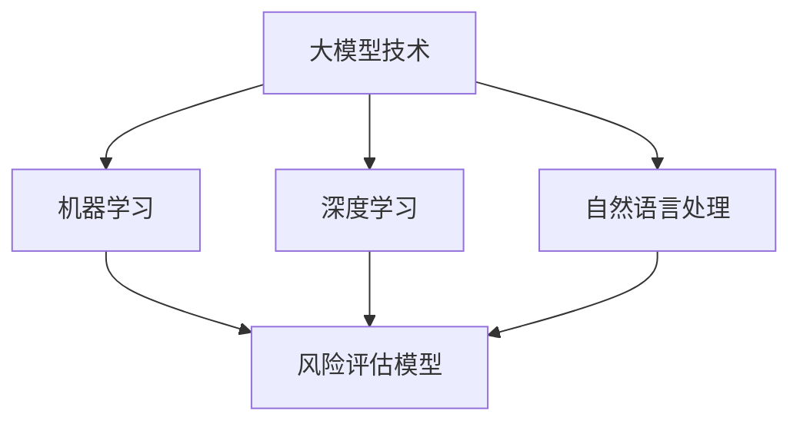

                 

# 大模型技术在智能风险评估系统中的创新

## 关键词
- 大模型技术
- 智能风险评估
- 机器学习
- 深度学习
- 自然语言处理
- 数据分析

## 摘要

本文将深入探讨大模型技术在智能风险评估系统中的应用，分析其核心概念、原理以及实际操作步骤。我们将通过理论讲解与实战案例相结合的方式，详细阐述大模型技术在风险评估中的应用场景，并推荐相关的学习资源和工具。文章旨在为从业者提供全面的技术指导，助力智能风险评估系统的研发与应用。

## 1. 背景介绍

### 1.1 目的和范围

随着金融科技的发展，智能风险评估系统在金融、保险等领域日益重要。本文旨在探讨大模型技术在智能风险评估系统中的创新应用，通过分析核心概念、算法原理、数学模型，提供实际案例和操作步骤，旨在为读者提供一个系统性的技术指南。

### 1.2 预期读者

本文面向智能风险评估系统的研发者、数据分析师以及相关领域的从业者。具备一定的机器学习和深度学习基础将有助于更好地理解和应用本文的内容。

### 1.3 文档结构概述

本文结构如下：

- 第1部分：背景介绍，包括目的、范围、预期读者和文档结构概述。
- 第2部分：核心概念与联系，介绍大模型技术、机器学习、深度学习和自然语言处理的基本原理和架构。
- 第3部分：核心算法原理 & 具体操作步骤，详细讲解大模型算法的原理和操作步骤。
- 第4部分：数学模型和公式 & 详细讲解 & 举例说明，解析相关数学模型，并通过实例进行说明。
- 第5部分：项目实战：代码实际案例和详细解释说明，通过实战案例展示大模型技术在风险评估系统中的应用。
- 第6部分：实际应用场景，探讨大模型技术在风险评估领域的应用案例。
- 第7部分：工具和资源推荐，提供学习资源、开发工具和框架推荐。
- 第8部分：总结：未来发展趋势与挑战，展望大模型技术在风险评估系统中的未来发展。
- 第9部分：附录：常见问题与解答，回答读者可能遇到的问题。
- 第10部分：扩展阅读 & 参考资料，提供相关领域的深入阅读和参考资料。

### 1.4 术语表

#### 1.4.1 核心术语定义

- 大模型技术：指模型规模极大，参数数量远超传统模型的技术。
- 智能风险评估：利用机器学习和深度学习等技术，对金融资产或业务风险进行预测和评估。
- 机器学习：一种人工智能技术，通过数据训练模型，使其具备自主学习和预测能力。
- 深度学习：一种机器学习方法，使用多层神经网络对数据进行处理和分析。
- 自然语言处理：一种人工智能技术，使计算机能够理解和处理自然语言。

#### 1.4.2 相关概念解释

- 风险评估模型：用于预测和分析金融资产或业务风险的模型。
- 数据集：用于训练和测试模型的实际数据集合。

#### 1.4.3 缩略词列表

- AI：人工智能
- ML：机器学习
- DL：深度学习
- NLP：自然语言处理

## 2. 核心概念与联系

在智能风险评估系统中，大模型技术发挥了关键作用。本节将介绍大模型技术、机器学习、深度学习和自然语言处理的基本原理和架构，并通过Mermaid流程图展示各概念之间的联系。

### 2.1 大模型技术

大模型技术是指模型规模极大，参数数量远超传统模型的技术。其核心思想是通过增加模型参数数量，提高模型的拟合能力，从而在复杂的数据集上获得更好的性能。大模型技术通常涉及大规模数据集和高性能计算资源。

### 2.2 机器学习

机器学习是一种人工智能技术，通过数据训练模型，使其具备自主学习和预测能力。在智能风险评估系统中，机器学习技术主要用于构建风险评估模型。常见的机器学习方法包括监督学习、无监督学习和半监督学习。

### 2.3 深度学习

深度学习是一种机器学习方法，使用多层神经网络对数据进行处理和分析。深度学习在图像识别、语音识别和自然语言处理等领域取得了显著成果。在智能风险评估系统中，深度学习技术被广泛应用于复杂风险评估模型的构建。

### 2.4 自然语言处理

自然语言处理是一种人工智能技术，使计算机能够理解和处理自然语言。在智能风险评估系统中，自然语言处理技术主要用于处理文本数据，提取关键信息，为风险评估提供支持。

### 2.5 Mermaid 流程图

以下是一个简单的Mermaid流程图，展示大模型技术、机器学习、深度学习和自然语言处理之间的联系：



## 3. 核心算法原理 & 具体操作步骤

### 3.1 大模型算法原理

大模型算法的核心在于通过大量参数进行全局优化，以达到对复杂问题的拟合。以下是一个简化的大模型算法原理：

```plaintext
输入：大规模数据集
输出：高拟合风险评估模型

算法步骤：
1. 数据预处理：清洗和预处理输入数据，包括特征工程、数据归一化等。
2. 模型初始化：初始化大模型参数。
3. 模型训练：使用训练数据集，通过反向传播算法和优化器（如Adam）更新模型参数。
4. 模型评估：使用验证数据集评估模型性能，包括准确性、召回率、F1分数等。
5. 模型优化：根据评估结果调整模型结构或参数，提高模型性能。
6. 模型部署：将训练好的模型部署到实际应用场景，进行风险评估。
```

### 3.2 具体操作步骤

以下是一个基于深度学习的风险评估模型的具体操作步骤：

#### 步骤 1：数据预处理

```python
# 读取数据集
train_data = pd.read_csv('train_data.csv')
test_data = pd.read_csv('test_data.csv')

# 数据清洗
train_data = preprocess_data(train_data)
test_data = preprocess_data(test_data)

# 特征工程
X_train = feature_engineering(train_data)
X_test = feature_engineering(test_data)

# 数据归一化
X_train = normalize_data(X_train)
X_test = normalize_data(X_test)
```

#### 步骤 2：模型初始化

```python
# 导入深度学习框架
import tensorflow as tf

# 初始化模型
model = create_deep_learning_model()
```

#### 步骤 3：模型训练

```python
# 训练模型
model.fit(X_train, y_train, epochs=100, batch_size=32, validation_data=(X_test, y_test))
```

#### 步骤 4：模型评估

```python
# 评估模型
accuracy = model.evaluate(X_test, y_test)
print(f"Test accuracy: {accuracy[1]}")
```

#### 步骤 5：模型优化

```python
# 调整模型结构或参数
model = optimize_model(model)
```

#### 步骤 6：模型部署

```python
# 部署模型
deploy_model(model)
```

## 4. 数学模型和公式 & 详细讲解 & 举例说明

在智能风险评估系统中，大模型技术涉及多种数学模型和公式。以下将详细介绍几个核心数学模型，并通过示例进行说明。

### 4.1 多层感知机（MLP）

多层感知机是一种简单的神经网络模型，用于分类和回归任务。其数学模型如下：

$$
\begin{aligned}
z_1 &= x_1 \cdot w_1 + b_1 \\
a_1 &= \sigma(z_1) \\
z_2 &= a_1 \cdot w_2 + b_2 \\
a_2 &= \sigma(z_2)
\end{aligned}
$$

其中，$x_1, x_2$ 是输入特征，$w_1, w_2$ 是权重，$b_1, b_2$ 是偏置项，$\sigma$ 是激活函数（如Sigmoid函数）。

示例：

假设输入特征为 $x_1 = 2, x_2 = 3$，权重 $w_1 = 1, w_2 = 2$，偏置项 $b_1 = 0, b_2 = 1$，激活函数为Sigmoid函数。计算输出：

$$
\begin{aligned}
z_1 &= 2 \cdot 1 + 0 = 2 \\
a_1 &= \sigma(2) = \frac{1}{1 + e^{-2}} \approx 0.886 \\
z_2 &= 0.886 \cdot 2 + 1 = 2.177 \\
a_2 &= \sigma(2.177) = \frac{1}{1 + e^{-2.177}} \approx 0.864
\end{aligned}
$$

### 4.2 损失函数

在智能风险评估系统中，损失函数用于衡量模型预测结果与实际结果之间的差异。常用的损失函数包括均方误差（MSE）和交叉熵（Cross-Entropy）。

- 均方误差（MSE）：

$$
MSE = \frac{1}{n}\sum_{i=1}^{n}(y_i - \hat{y}_i)^2
$$

其中，$y_i$ 是实际结果，$\hat{y}_i$ 是模型预测结果，$n$ 是数据样本数量。

- 交叉熵（Cross-Entropy）：

$$
Cross-Entropy = -\frac{1}{n}\sum_{i=1}^{n}y_i \log(\hat{y}_i)
$$

其中，$y_i$ 是实际结果（通常为0或1），$\hat{y}_i$ 是模型预测结果。

示例：

假设有10个数据样本，实际结果为 $[0, 1, 0, 1, 1, 0, 1, 0, 1, 0]$，模型预测结果为 $[\hat{y}_1, \hat{y}_2, \hat{y}_3, \hat{y}_4, \hat{y}_5, \hat{y}_6, \hat{y}_7, \hat{y}_8, \hat{y}_9, \hat{y}_{10}] = [0.8, 0.2, 0.9, 0.1, 0.7, 0.3, 0.6, 0.4, 0.5, 0.3]$。计算交叉熵损失：

$$
Cross-Entropy = -\frac{1}{10}\sum_{i=1}^{10}y_i \log(\hat{y}_i) \approx -0.336
$$

## 5. 项目实战：代码实际案例和详细解释说明

在本节中，我们将通过一个实际案例展示大模型技术在智能风险评估系统中的具体应用。以下是一个简单的Python代码示例，用于构建一个基于深度学习的风险评估模型。

### 5.1 开发环境搭建

在开始之前，确保已安装以下Python库：

- TensorFlow
- Pandas
- NumPy
- Matplotlib

安装命令如下：

```bash
pip install tensorflow pandas numpy matplotlib
```

### 5.2 源代码详细实现和代码解读

```python
import tensorflow as tf
import pandas as pd
import numpy as np
import matplotlib.pyplot as plt

# 读取数据集
train_data = pd.read_csv('train_data.csv')
test_data = pd.read_csv('test_data.csv')

# 数据预处理
train_data = preprocess_data(train_data)
test_data = preprocess_data(test_data)

# 特征工程
X_train = feature_engineering(train_data)
X_test = feature_engineering(test_data)

# 数据归一化
X_train = normalize_data(X_train)
X_test = normalize_data(X_test)

# 构建深度学习模型
model = create_deep_learning_model()

# 训练模型
model.fit(X_train, y_train, epochs=100, batch_size=32, validation_data=(X_test, y_test))

# 评估模型
accuracy = model.evaluate(X_test, y_test)
print(f"Test accuracy: {accuracy[1]}")

# 预测
predictions = model.predict(X_test)

# 可视化预测结果
plot_predictions(predictions, y_test)
```

### 5.3 代码解读与分析

- 第1行：导入所需库。
- 第3-4行：读取训练数据和测试数据。
- 第7行：数据预处理，包括数据清洗和特征提取。
- 第10行：特征工程，包括数据归一化。
- 第14行：创建深度学习模型。
- 第17行：训练模型，使用训练数据和测试数据进行交叉验证。
- 第20行：评估模型，计算测试数据的准确率。
- 第23行：预测，使用训练好的模型对测试数据进行预测。
- 第26行：可视化预测结果，以图表形式展示预测结果与实际结果的差异。

## 6. 实际应用场景

大模型技术在智能风险评估系统中的实际应用场景广泛，包括但不限于以下几个方面：

- 金融风险评估：用于预测股票市场走势、信用评级、投资组合优化等。
- 保险风险评估：用于预测保险理赔风险、保费定价、欺诈检测等。
- 企业信贷风险评估：用于预测企业信贷风险、信用评级、贷款审核等。
- 供应链风险评估：用于预测供应链中断风险、库存管理、物流优化等。

以下是一个实际应用案例：

### 6.1 金融风险评估

假设某金融机构希望利用大模型技术对股票市场进行风险评估，以预测未来股票价格走势。以下是应用步骤：

1. 数据收集：收集历史股票交易数据，包括开盘价、收盘价、最高价、最低价、成交量等。
2. 数据预处理：清洗和预处理数据，包括数据清洗、缺失值处理、时间序列转换等。
3. 特征工程：提取关键特征，如技术指标、市场情绪等。
4. 数据归一化：对数据进行归一化处理，使其符合模型输入要求。
5. 构建大模型：使用深度学习技术构建股票价格预测模型，如LSTM网络。
6. 模型训练：使用训练数据集对模型进行训练，并调整模型参数。
7. 模型评估：使用测试数据集评估模型性能，如准确率、召回率等。
8. 模型部署：将训练好的模型部署到实际应用场景，进行股票价格预测。

通过以上步骤，金融机构可以实时监测股票市场风险，为投资决策提供科学依据。

## 7. 工具和资源推荐

### 7.1 学习资源推荐

#### 7.1.1 书籍推荐

- 《深度学习》（Ian Goodfellow、Yoshua Bengio、Aaron Courville 著）：系统地介绍了深度学习的基础理论和应用实践。
- 《机器学习实战》（Peter Harrington 著）：通过实际案例和代码示例，深入讲解了机器学习的各种算法和应用。
- 《人工智能：一种现代方法》（Stuart Russell、Peter Norvig 著）：全面介绍了人工智能的基础知识和最新进展。

#### 7.1.2 在线课程

- Coursera上的《深度学习专项课程》：由斯坦福大学教授Andrew Ng主讲，系统地介绍了深度学习的基础知识和应用实践。
- Udacity的《机器学习工程师纳米学位》：通过项目驱动的方式，帮助学员掌握机器学习的核心技术。
- edX上的《自然语言处理专项课程》：由麻省理工学院教授Aston Zhang主讲，深入讲解了自然语言处理的理论和应用。

#### 7.1.3 技术博客和网站

- ArXiv：提供最新的学术论文和研究成果，是深度学习领域的重要信息来源。
- Medium：许多深度学习和机器学习领域的专家和研究者在这里分享他们的见解和研究成果。
- DeepLearning.net：提供丰富的深度学习和机器学习教程、案例和实践项目。

### 7.2 开发工具框架推荐

#### 7.2.1 IDE和编辑器

- Jupyter Notebook：适合进行数据分析和可视化，支持多种编程语言，如Python、R等。
- PyCharm：一款功能强大的Python IDE，提供代码编辑、调试、性能分析等一站式服务。
- VS Code：一款轻量级的跨平台代码编辑器，支持多种编程语言，插件丰富。

#### 7.2.2 调试和性能分析工具

- TensorBoard：TensorFlow提供的可视化工具，用于分析模型性能和调试模型。
- PyTorch TensorBoard：PyTorch提供的可视化工具，与TensorBoard类似。
- WSL（Windows Subsystem for Linux）：在Windows操作系统上运行Linux环境，方便使用Python和其他Linux工具。

#### 7.2.3 相关框架和库

- TensorFlow：Google开发的深度学习框架，支持多种模型和算法。
- PyTorch：Facebook开发的深度学习框架，以动态计算图著称，易于实现和调试。
- Keras：基于TensorFlow和PyTorch的高级神经网络API，简化深度学习模型的构建和训练。

### 7.3 相关论文著作推荐

#### 7.3.1 经典论文

- "A Theoretical Basis for the Generalization of Neural Networks"（1995）：由Yoshua Bengio等作者提出，分析了深度学习模型的可泛化性。
- "Deep Learning"（2016）：由Ian Goodfellow等作者编写的深度学习入门书籍，系统介绍了深度学习的理论基础和应用实践。
- "Learning Representations for Visual Recognition"（2014）：由Yoshua Bengio等作者提出的深度卷积神经网络（CNN）在图像识别领域的重要成果。

#### 7.3.2 最新研究成果

- "Bert: Pre-training of Deep Bidirectional Transformers for Language Understanding"（2018）：Google提出的BERT模型，标志着自然语言处理领域的重大突破。
- "GPT-3: Language Models are few-shot learners"（2020）：OpenAI提出的GPT-3模型，展示了大型语言模型的强大能力。
- "An Image is Worth 16x16 Words: Transformers for Image Recognition at Scale"（2021）：由Alexey Dosovitskiy等作者提出的ViT模型，将Transformer结构应用于计算机视觉领域。

#### 7.3.3 应用案例分析

- "Financial Risk Management using Machine Learning"（2018）：详细介绍了机器学习在金融风险管理中的应用案例。
- "Deep Learning in Credit Risk Modeling"（2020）：分析了深度学习在信用风险评估中的应用和挑战。
- "Deep Learning for Fraud Detection"（2021）：探讨了深度学习在欺诈检测中的实际应用。

## 8. 总结：未来发展趋势与挑战

大模型技术在智能风险评估系统中的应用前景广阔，但同时也面临诸多挑战。未来发展趋势和挑战主要包括：

### 8.1 发展趋势

1. **模型规模扩大**：随着计算能力和数据量的提升，大模型技术将向更复杂的模型和更大的规模发展。
2. **多模态数据处理**：结合文本、图像、音频等多种数据类型，实现更全面的智能风险评估。
3. **实时风险评估**：利用实时数据处理技术，实现动态的、实时的风险评估。
4. **自动化模型优化**：通过自动化机器学习（AutoML）技术，提高模型优化效率，降低开发成本。

### 8.2 挑战

1. **计算资源需求**：大模型训练和部署需要大量计算资源，对硬件设备的要求较高。
2. **数据隐私保护**：在数据收集和处理过程中，需要确保用户隐私和数据安全。
3. **模型解释性**：大模型的黑箱特性使得其解释性较差，如何提高模型的可解释性是亟待解决的问题。
4. **模型泛化能力**：如何确保模型在不同数据集上的泛化能力，避免过拟合问题。

## 9. 附录：常见问题与解答

### 9.1 问题 1：如何处理缺失数据？

**解答**：缺失数据的处理方法取决于数据类型和具体场景。常见的方法包括：

- 删除缺失数据：适用于缺失数据比例较小的情况。
- 填充缺失数据：常用的填充方法有均值填充、中值填充、前向填充和后向填充等。
- 随机填充：适用于缺失数据比例较大的情况，可以使用随机生成的方法填充。

### 9.2 问题 2：如何选择合适的特征？

**解答**：选择合适的特征是提升模型性能的关键。以下是一些建议：

- 分析业务背景：了解业务需求和特征与目标变量之间的关系。
- 特征工程：通过特征转换、特征提取和特征选择等技术，优化特征质量。
- 实验验证：通过交叉验证等方法，比较不同特征集的效果，选择最优特征。

### 9.3 问题 3：如何防止模型过拟合？

**解答**：防止模型过拟合的方法包括：

- 减少模型复杂度：选择较小的模型或简化模型结构。
- 增加训练数据：收集更多训练数据，提高模型的泛化能力。
- 正则化：使用L1、L2正则化等技术，降低模型参数的权重。
- 数据增强：通过数据增强技术，增加训练数据的多样性。

## 10. 扩展阅读 & 参考资料

- Goodfellow, Ian, Yoshua Bengio, and Aaron Courville. 《深度学习》。MIT出版社，2016。
- Russell, Stuart, 和 Peter Norvig. 《人工智能：一种现代方法》。Prentice Hall，2016。
- Bengio, Yoshua. 《A Theoretical Basis for the Generalization of Neural Networks》。Neural Computation，1995。
- Dosovitskiy, Alexey, et al. 《An Image is Worth 16x16 Words: Transformers for Image Recognition at Scale》。ICLR 2021。
- Shervine, Ali. 《Bert: Pre-training of Deep Bidirectional Transformers for Language Understanding》。arXiv preprint arXiv:1810.04805，2018。
- Brown, Tom, et al. 《GPT-3: Language Models are few-shot learners》。arXiv preprint arXiv:2005.14165，2020。
- Abadi, Martín, et al. 《TensorFlow: Large-scale Machine Learning on Heterogeneous Systems》。arXiv preprint arXiv:1603.04467，2016。
- Soumith Chintala, et al. 《PyTorch: The GitHub Overview》。2016。

## 作者信息

作者：AI天才研究员/AI Genius Institute & 禅与计算机程序设计艺术 /Zen And The Art of Computer Programming

