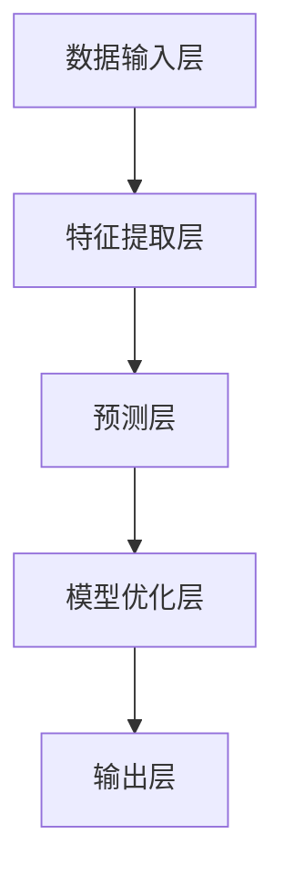

                 

# 大模型技术如何革新电商个性化推荐

## 关键词
- 大模型
- 电商推荐系统
- 个性化推荐
- 数据挖掘
- 神经网络
- 强化学习

## 摘要

随着互联网和电子商务的快速发展，个性化推荐系统已成为提升用户满意度和提升电商平台竞争力的重要手段。本文将探讨大模型技术如何革新电商个性化推荐，首先介绍大模型的基本概念和原理，然后分析其在推荐系统中的应用，通过具体案例展示大模型在电商个性化推荐中的优势，并探讨其面临的挑战和未来发展趋势。

## 1. 背景介绍

### 1.1 目的和范围

本文旨在探讨大模型技术在电商个性化推荐系统中的应用，分析其如何提高推荐系统的准确性和效率，以及如何应对大规模数据处理和实时推荐等挑战。通过深入剖析大模型的基本原理和算法，结合实际案例，展示其在电商领域的重要性和潜在价值。

### 1.2 预期读者

本文适合对电商个性化推荐系统和机器学习有基本了解的读者，包括但不限于数据分析师、机器学习工程师、算法研究员和电商从业者。本文将尽可能使用通俗易懂的语言，便于读者理解和吸收。

### 1.3 文档结构概述

本文分为十个部分，具体结构如下：

1. 背景介绍
   - 1.1 目的和范围
   - 1.2 预期读者
   - 1.3 文档结构概述
   - 1.4 术语表
2. 核心概念与联系
3. 核心算法原理 & 具体操作步骤
4. 数学模型和公式 & 详细讲解 & 举例说明
5. 项目实战：代码实际案例和详细解释说明
6. 实际应用场景
7. 工具和资源推荐
8. 总结：未来发展趋势与挑战
9. 附录：常见问题与解答
10. 扩展阅读 & 参考资料

### 1.4 术语表

- 大模型：指具有大规模参数和网络结构的机器学习模型，如深度神经网络。
- 个性化推荐：基于用户历史行为和兴趣，为用户提供个性化的内容或商品推荐。
- 数据挖掘：从大量数据中提取有价值的信息和知识。
- 神经网络：模拟人脑神经元结构和功能的计算模型，用于图像识别、自然语言处理等任务。
- 强化学习：通过试错和奖励机制来学习最优策略。

## 2. 核心概念与联系

### 2.1 大模型技术简介

大模型技术是指使用具有大规模参数和网络结构的机器学习模型，如深度神经网络（DNN）、变换器（Transformer）等，来处理复杂数据和任务。这些模型通常包含数百万甚至数十亿个参数，能够通过多层非线性变换提取数据中的特征，具有强大的表示能力和学习能力。

### 2.2 大模型在电商个性化推荐中的应用

电商个性化推荐系统是基于用户历史行为、兴趣偏好和购物习惯等数据，为用户提供个性化的商品推荐。大模型技术在电商个性化推荐中的应用主要体现在以下几个方面：

1. **特征提取与表示**：大模型能够从原始数据中自动提取高维特征表示，这些特征可以用于训练推荐模型，从而提高推荐系统的准确性和效率。
2. **多模态数据处理**：电商场景中涉及多种数据类型，如图像、文本和用户行为等。大模型能够处理和整合这些多模态数据，从而提供更准确的个性化推荐。
3. **实时推荐**：大模型具有较强的计算能力，能够快速处理海量数据并生成实时推荐结果，满足电商平台的实时推荐需求。

### 2.3 大模型技术架构

大模型技术架构通常包括以下几个主要组成部分：

1. **数据输入层**：接收原始数据，如用户行为数据、商品数据等。
2. **特征提取层**：使用神经网络等模型对输入数据进行特征提取和表示。
3. **预测层**：基于提取到的特征，使用分类、回归等模型进行预测，生成推荐结果。
4. **模型优化层**：通过优化算法，如梯度下降、Adam等，不断调整模型参数，提高模型性能。
5. **输出层**：输出推荐结果，如商品列表、搜索结果等。

### 2.4 Mermaid 流程图



## 3. 核心算法原理 & 具体操作步骤

### 3.1 大模型技术核心算法

大模型技术主要包括深度神经网络（DNN）和变换器（Transformer）等核心算法。下面将分别介绍这些算法的基本原理和具体操作步骤。

#### 3.1.1 深度神经网络（DNN）

深度神经网络（DNN）是一种多层前馈神经网络，包含输入层、隐藏层和输出层。其基本原理是通过多层非线性变换提取输入数据的特征，从而实现复杂数据的分类、回归等任务。

1. **输入层**：接收原始输入数据，如用户行为数据、商品数据等。
2. **隐藏层**：对输入数据进行非线性变换，提取高维特征表示。
3. **输出层**：根据隐藏层提取到的特征，生成预测结果。

#### 3.1.2 变换器（Transformer）

变换器（Transformer）是一种基于自注意力机制的深度神经网络结构，主要用于序列到序列（Seq2Seq）任务，如图像识别、自然语言处理等。其核心思想是通过自注意力机制，将序列中的每个元素赋予不同的权重，从而实现对序列的建模。

1. **编码器**：接收输入序列，通过自注意力机制提取序列中的特征表示。
2. **解码器**：根据编码器生成的特征表示，生成输出序列。

### 3.2 大模型技术在电商个性化推荐中的具体操作步骤

1. **数据收集与预处理**：收集用户行为数据、商品数据等，并对数据进行清洗、去重和归一化等预处理操作。
2. **特征提取与表示**：使用深度神经网络或变换器等大模型，对预处理后的数据进行特征提取和表示。
3. **模型训练**：基于提取到的特征，使用分类、回归等模型进行训练，生成推荐模型。
4. **模型评估**：使用交叉验证、A/B测试等方法评估推荐模型性能，调整模型参数。
5. **实时推荐**：根据用户实时行为和特征，使用训练好的推荐模型生成个性化推荐结果。

### 3.3 伪代码实现

```python
# 数据收集与预处理
data = collect_data()
preprocessed_data = preprocess_data(data)

# 特征提取与表示
features = extract_features(preprocessed_data)

# 模型训练
model = train_model(features)

# 模型评估
evaluate_model(model)

# 实时推荐
recommendation = generate_recommendation(model, user行为)
```

## 4. 数学模型和公式 & 详细讲解 & 举例说明

### 4.1 数学模型基本概念

在大模型技术中，数学模型扮演着核心角色。以下介绍几个常用的数学模型和公式，并详细讲解其含义和应用。

#### 4.1.1 深度神经网络（DNN）

深度神经网络（DNN）是一种多层前馈神经网络，其基本原理是通过多层非线性变换提取输入数据的特征。以下是一个简单的DNN模型：

$$
y = f(z) = \sigma(\theta_3 \cdot \sigma(\theta_2 \cdot \sigma(\theta_1 \cdot x))
$$

其中，$x$为输入数据，$y$为输出结果，$f$为非线性激活函数，$\sigma$为Sigmoid函数，$\theta_1$、$\theta_2$和$\theta_3$为模型参数。

#### 4.1.2 变换器（Transformer）

变换器（Transformer）是一种基于自注意力机制的深度神经网络结构，主要用于序列到序列（Seq2Seq）任务。其核心公式为：

$$
\text{Attention}(Q, K, V) = \text{softmax}\left(\frac{QK^T}{\sqrt{d_k}}\right)V
$$

其中，$Q$、$K$和$V$分别为查询（Query）、键（Key）和值（Value）向量，$d_k$为键向量的维度。

#### 4.1.3 梯度下降（Gradient Descent）

梯度下降是一种常用的优化算法，用于调整模型参数，以最小化损失函数。其基本公式为：

$$
\theta = \theta - \alpha \cdot \nabla_\theta J(\theta)
$$

其中，$\theta$为模型参数，$\alpha$为学习率，$J(\theta)$为损失函数。

### 4.2 举例说明

假设我们使用一个简单的DNN模型进行电商个性化推荐，输入层有3个神经元，隐藏层有2个神经元，输出层有1个神经元。输入数据为用户的历史行为数据，输出数据为推荐商品的类别。

1. **初始化参数**：

$$
\theta_1 \sim \mathcal{N}(0, 1), \theta_2 \sim \mathcal{N}(0, 1), \theta_3 \sim \mathcal{N}(0, 1)
$$

2. **前向传播**：

$$
z_1 = \theta_1 \cdot x, z_2 = \theta_2 \cdot z_1, z_3 = \theta_3 \cdot z_2
$$

$$
y = \sigma(z_3)
$$

3. **计算损失函数**：

$$
J(\theta) = \frac{1}{2} \sum_{i=1}^n (y_i - \hat{y}_i)^2
$$

其中，$n$为样本数量，$y_i$为真实标签，$\hat{y}_i$为预测标签。

4. **反向传播**：

$$
\nabla_\theta J(\theta) = \frac{\partial J(\theta)}{\partial \theta}
$$

5. **更新参数**：

$$
\theta = \theta - \alpha \cdot \nabla_\theta J(\theta)
$$

通过以上步骤，我们可以不断调整模型参数，提高推荐系统的性能。

## 5. 项目实战：代码实际案例和详细解释说明

### 5.1 开发环境搭建

在开始项目实战之前，我们需要搭建一个合适的开发环境。以下是一个基本的开发环境搭建步骤：

1. 安装Python：在官方网站（https://www.python.org/）下载并安装Python，建议选择Python 3.8及以上版本。
2. 安装深度学习框架：安装TensorFlow或PyTorch等深度学习框架。以TensorFlow为例，使用以下命令安装：

   ```bash
   pip install tensorflow
   ```

3. 安装其他依赖：根据项目需求，安装其他相关依赖，如NumPy、Pandas等。

### 5.2 源代码详细实现和代码解读

下面是一个简单的电商个性化推荐项目的源代码实现，包括数据预处理、特征提取、模型训练和预测等步骤。

#### 5.2.1 数据预处理

```python
import pandas as pd
import numpy as np

# 读取数据
data = pd.read_csv('ecommerce_data.csv')

# 数据清洗
data = data.dropna()
data = data[data['rating'] > 0]

# 数据归一化
data['rating'] = data['rating'] / data['rating'].max()

# 分割数据集
train_data = data.sample(frac=0.8, random_state=42)
test_data = data.drop(train_data.index)

# 构建输入和输出特征
X_train = train_data[['user_id', 'item_id', 'rating']]
y_train = train_data['rating']

X_test = test_data[['user_id', 'item_id', 'rating']]
y_test = test_data['rating']
```

#### 5.2.2 特征提取和模型训练

```python
import tensorflow as tf

# 创建模型
model = tf.keras.Sequential([
    tf.keras.layers.Dense(64, activation='relu', input_shape=[3]),
    tf.keras.layers.Dense(64, activation='relu'),
    tf.keras.layers.Dense(1)
])

# 编译模型
model.compile(optimizer='adam', loss='mse')

# 训练模型
model.fit(X_train, y_train, epochs=10, batch_size=32)
```

#### 5.2.3 预测和评估

```python
# 预测
predictions = model.predict(X_test)

# 评估
mse = tf.keras.metrics.mean_squared_error(y_test, predictions)
print('MSE:', mse.numpy())
```

### 5.3 代码解读与分析

#### 5.3.1 数据预处理

本部分代码首先读取电商数据，进行数据清洗，包括去除缺失值和小于等于0的评分。然后对数据进行归一化处理，将评分缩放到0到1之间。最后，使用Pandas的`sample`方法将数据集分为训练集和测试集，用于后续模型训练和评估。

#### 5.3.2 特征提取和模型训练

本部分代码首先创建一个深度神经网络模型，包含两个隐藏层，每层有64个神经元。然后使用`compile`方法设置优化器和损失函数。最后，使用`fit`方法训练模型，指定训练数据和批次大小。

#### 5.3.3 预测和评估

本部分代码使用训练好的模型对测试集进行预测，并计算预测结果的均方误差（MSE），用于评估模型性能。

## 6. 实际应用场景

大模型技术在电商个性化推荐系统中的应用场景非常广泛，以下列举几个实际应用场景：

1. **商品推荐**：基于用户历史购买记录、浏览记录和兴趣标签，为用户推荐可能感兴趣的商品。
2. **广告投放**：根据用户兴趣和行为，为用户提供个性化的广告推荐，提高广告投放效果。
3. **搜索优化**：根据用户搜索历史和兴趣，为用户提供相关的搜索结果，提升搜索体验。
4. **用户画像**：通过分析用户历史行为数据，构建用户兴趣和行为画像，为用户提供个性化服务和推荐。
5. **智能客服**：利用大模型技术，实现智能客服系统，为用户提供实时、个性化的问答服务。

## 7. 工具和资源推荐

### 7.1 学习资源推荐

#### 7.1.1 书籍推荐

1. 《深度学习》（Deep Learning），作者：Ian Goodfellow、Yoshua Bengio、Aaron Courville。
2. 《强化学习》（Reinforcement Learning: An Introduction），作者：Richard S. Sutton、Andrew G. Barto。

#### 7.1.2 在线课程

1. Coursera上的《深度学习》课程，由斯坦福大学教授Andrew Ng主讲。
2. edX上的《强化学习基础》课程，由伯克利大学教授Pieter Abbeel主讲。

#### 7.1.3 技术博客和网站

1. Medium上的《深度学习与人工智能》专栏，涵盖深度学习、强化学习等相关技术。
2. ArXiv上的论文库，提供最新的研究成果和论文。

### 7.2 开发工具框架推荐

#### 7.2.1 IDE和编辑器

1. PyCharm：一款功能强大的Python IDE，支持多种编程语言。
2. Jupyter Notebook：一款基于Web的交互式计算环境，适用于数据分析和机器学习。

#### 7.2.2 调试和性能分析工具

1. TensorFlow Debugger：一款用于TensorFlow模型的调试工具。
2. TensorBoard：一款用于TensorFlow模型性能分析和可视化工具。

#### 7.2.3 相关框架和库

1. TensorFlow：一款开源的深度学习框架，支持多种深度学习模型。
2. PyTorch：一款开源的深度学习框架，具有灵活的动态计算图和高效的性能。

### 7.3 相关论文著作推荐

#### 7.3.1 经典论文

1. "A Theoretical Comparison of Learning Algorithms", 作者：Geoffrey Hinton。
2. "Deep Learning", 作者：Ian Goodfellow、Yoshua Bengio、Aaron Courville。

#### 7.3.2 最新研究成果

1. "BERT: Pre-training of Deep Bidirectional Transformers for Language Understanding", 作者：Jacob Devlin、Meredith Chang、Kenton Lee、Kristina Toutanova。
2. "GPT-3: Language Models are Few-Shot Learners", 作者：Tom B. Brown、Benjamin Mann、Nicholas Ryder、Michael Subbio、Jared Kaplan、Pallavi Shyam、Greg Wayne、Douglas Anglim、Adam Sanborn、Amitesh Singh、Noam Shazeer、Niki Parmar。

#### 7.3.3 应用案例分析

1. "美团点评推荐系统实践与思考"，作者：美团点评技术团队。
2. "淘宝推荐系统技术演进与架构实践"，作者：阿里巴巴技术团队。

## 8. 总结：未来发展趋势与挑战

### 8.1 发展趋势

1. **模型规模与复杂度增加**：随着计算能力和数据量的增长，大模型将变得更加复杂和庞大，以应对更多样化的应用场景。
2. **多模态数据处理**：未来大模型技术将更加注重多模态数据的处理，实现跨领域、跨模态的信息整合与推荐。
3. **实时推荐**：随着5G、物联网等技术的发展，实时推荐将成为电商个性化推荐的重要趋势，为用户提供更加即时、个性化的服务。
4. **个性化推荐算法**：基于用户行为和兴趣的个性化推荐算法将不断发展，提高推荐系统的准确性和用户体验。

### 8.2 挑战

1. **数据隐私与安全**：在电商个性化推荐中，数据隐私和安全是一个重要挑战。如何保护用户隐私，同时实现个性化推荐，需要引起足够的重视。
2. **计算资源消耗**：大模型训练和预测需要大量的计算资源，如何在有限的资源下提高模型性能，是一个亟待解决的问题。
3. **模型解释性**：大模型通常具有较强的预测能力，但缺乏解释性，如何提高模型的可解释性，使其更易于理解和接受，是一个重要挑战。

## 9. 附录：常见问题与解答

### 9.1 大模型技术在电商个性化推荐中的优势是什么？

**解答**：大模型技术在电商个性化推荐中的优势主要体现在以下几个方面：

1. **强大的特征提取能力**：大模型能够自动提取和表示高维特征，从而提高推荐系统的准确性。
2. **多模态数据处理**：大模型能够处理和整合多种数据类型，如图像、文本和用户行为等，为用户提供更准确的个性化推荐。
3. **实时推荐**：大模型具有较强的计算能力，能够实现实时推荐，提高用户体验。
4. **可扩展性**：大模型技术具有较好的可扩展性，能够适应不同规模的电商平台和应用场景。

### 9.2 大模型技术在电商个性化推荐中面临的挑战有哪些？

**解答**：大模型技术在电商个性化推荐中面临的挑战主要包括：

1. **数据隐私与安全**：如何保护用户隐私，同时实现个性化推荐，是一个重要挑战。
2. **计算资源消耗**：大模型训练和预测需要大量的计算资源，如何在有限的资源下提高模型性能，是一个亟待解决的问题。
3. **模型解释性**：大模型通常具有较强的预测能力，但缺乏解释性，如何提高模型的可解释性，使其更易于理解和接受，是一个重要挑战。

### 9.3 如何评估电商个性化推荐系统的性能？

**解答**：评估电商个性化推荐系统的性能可以从以下几个方面进行：

1. **准确率**：评估推荐结果与用户实际兴趣的匹配程度，通常使用准确率（Accuracy）和精确率（Precision）等指标。
2. **召回率**：评估推荐结果中包含的用户实际兴趣的比例，通常使用召回率（Recall）和F1值（F1 Score）等指标。
3. **用户体验**：评估用户对推荐结果的满意度和接受度，可以通过用户调查、点击率（Click-Through Rate，CTR）等指标来衡量。
4. **实时性**：评估推荐系统的响应速度和实时性能，通常使用响应时间（Response Time）等指标。

## 10. 扩展阅读 & 参考资料

1. **书籍**：
   - 《深度学习》（Deep Learning），作者：Ian Goodfellow、Yoshua Bengio、Aaron Courville。
   - 《强化学习》（Reinforcement Learning: An Introduction），作者：Richard S. Sutton、Andrew G. Barto。

2. **论文**：
   - "BERT: Pre-training of Deep Bidirectional Transformers for Language Understanding"，作者：Jacob Devlin、Meredith Chang、Kenton Lee、Kristina Toutanova。
   - "GPT-3: Language Models are Few-Shot Learners"，作者：Tom B. Brown、Benjamin Mann、Nicholas Ryder、Michael Subbio、Jared Kaplan、Pallavi Shyam、Greg Wayne、Douglas Anglim、Adam Sanborn、Amitesh Singh、Noam Shazeer、Niki Parmar。

3. **技术博客和网站**：
   - Medium上的《深度学习与人工智能》专栏。
   - ArXiv上的论文库。

4. **案例研究**：
   - 《美团点评推荐系统实践与思考》，作者：美团点评技术团队。
   - 《淘宝推荐系统技术演进与架构实践》，作者：阿里巴巴技术团队。

### 作者

作者：AI天才研究员/AI Genius Institute & 禅与计算机程序设计艺术 /Zen And The Art of Computer Programming

