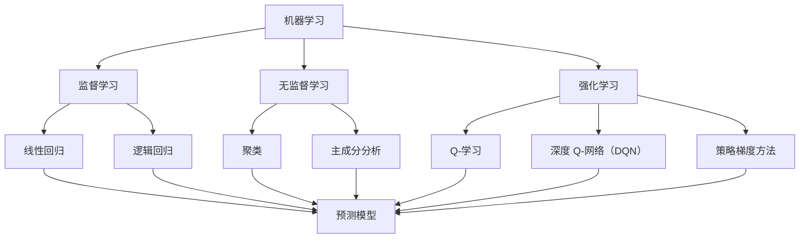

                 

# 大模型技术的安全性挑战

## 关键词

大模型技术，安全性，挑战，人工智能，算法，网络安全，隐私保护，数据安全。

## 摘要

本文深入探讨了大模型技术在人工智能领域的广泛应用及其带来的安全性挑战。首先，我们介绍了大模型技术的背景和核心概念，接着分析了大模型技术可能面临的安全性问题，包括算法攻击、数据泄露和隐私侵犯等。随后，我们提出了几种应对这些挑战的策略，并探讨了未来的研究方向。本文旨在为研究人员和开发者提供一个全面的安全性分析框架，以促进大模型技术的健康和可持续发展。

## 1. 背景介绍

### 1.1 目的和范围

本文的目的是深入探讨大模型技术在人工智能领域中的安全性挑战，并分析这些挑战带来的影响。随着人工智能技术的快速发展，大模型技术如深度学习、强化学习等已经取得了显著的成果。然而，这些大模型技术在带来巨大潜力的同时，也带来了新的安全性和隐私问题。本文将重点关注以下几个方面的内容：

1. 大模型技术的核心概念和原理；
2. 大模型技术可能面临的安全性挑战；
3. 应对安全性挑战的策略和技术；
4. 未来研究方向和展望。

### 1.2 预期读者

本文主要面向从事人工智能、计算机科学、网络安全等领域的科研人员和开发者。同时，对于对大模型技术感兴趣的技术爱好者也有一定的参考价值。通过本文，读者可以了解大模型技术带来的安全性挑战，并掌握一些应对策略。

### 1.3 文档结构概述

本文分为以下十个部分：

1. 背景介绍：介绍本文的目的、预期读者、文档结构和术语表；
2. 核心概念与联系：介绍大模型技术的核心概念和原理，并使用 Mermaid 流程图展示；
3. 核心算法原理 & 具体操作步骤：详细阐述大模型技术的算法原理和具体操作步骤；
4. 数学模型和公式 & 详细讲解 & 举例说明：介绍大模型技术的数学模型和公式，并进行详细讲解和举例说明；
5. 项目实战：代码实际案例和详细解释说明；
6. 实际应用场景：分析大模型技术的实际应用场景；
7. 工具和资源推荐：推荐学习资源、开发工具框架和相关论文著作；
8. 总结：未来发展趋势与挑战；
9. 附录：常见问题与解答；
10. 扩展阅读 & 参考资料。

### 1.4 术语表

#### 1.4.1 核心术语定义

- 大模型技术：指具有大规模参数和计算能力的机器学习模型，如深度学习、强化学习等；
- 安全性：指系统在遭受攻击、威胁或恶意行为时，能够保持稳定、可靠、有效运行的能力；
- 隐私：指个人或组织在信息处理过程中，对自身信息的控制权和保护能力；
- 数据安全：指在数据生成、传输、存储和处理过程中，确保数据完整、可用、保密的能力；
- 算法攻击：指通过攻击模型算法，获取模型内部信息或修改模型输出的行为。

#### 1.4.2 相关概念解释

- 机器学习：指通过从数据中自动学习规律，并对未知数据进行预测或决策的人工智能技术；
- 深度学习：指通过多层神经网络对数据进行特征提取和建模的技术；
- 强化学习：指通过与环境交互，学习最优策略的机器学习技术；
- 网络安全：指在网络环境中，保护系统、数据、网络设备免受攻击、威胁或恶意行为的能力。

#### 1.4.3 缩略词列表

- AI：人工智能；
- ML：机器学习；
- DL：深度学习；
- RL：强化学习；
- IDS：入侵检测系统；
- IPS：入侵防御系统；
- SVD：奇异值分解。

## 2. 核心概念与联系

大模型技术是人工智能领域的一个重要分支，其核心概念包括机器学习、深度学习、强化学习等。为了更好地理解大模型技术，我们首先介绍这些核心概念，然后通过 Mermaid 流程图展示大模型技术的架构和联系。

### 2.1 机器学习

机器学习是人工智能的核心技术之一，它通过从数据中学习规律，实现对未知数据的预测或决策。机器学习可以分为监督学习、无监督学习和强化学习三种类型。

- **监督学习**：指通过已有数据的标签，学习得到一个预测模型。常见的算法包括线性回归、逻辑回归、决策树、支持向量机等。
- **无监督学习**：指在没有标签的数据上进行学习，目的是发现数据中的内在规律。常见的算法包括聚类、主成分分析、自编码器等。
- **强化学习**：指通过与环境交互，学习得到一个最优策略。常见的算法包括 Q-学习、深度 Q-网络（DQN）、策略梯度方法等。

### 2.2 深度学习

深度学习是一种基于多层神经网络的学习方法，它通过多层非线性变换，对数据进行特征提取和建模。深度学习在图像识别、语音识别、自然语言处理等领域取得了显著的成果。

- **卷积神经网络（CNN）**：通过卷积操作提取图像特征，适用于图像识别、图像分类等任务。
- **循环神经网络（RNN）**：通过循环连接，处理序列数据，适用于自然语言处理、语音识别等任务。
- **生成对抗网络（GAN）**：通过生成器和判别器的对抗训练，生成逼真的图像、语音等。

### 2.3 强化学习

强化学习通过与环境交互，学习得到一个最优策略。强化学习在游戏、自动驾驶、机器人控制等领域有广泛的应用。

- **Q-学习**：通过学习 Q 值函数，选择最优动作；
- **深度 Q-网络（DQN）**：通过神经网络近似 Q 值函数，解决样本不足的问题；
- **策略梯度方法**：通过梯度下降优化策略参数，直接优化策略。

### 2.4 Mermaid 流程图

下面是一个 Mermaid 流程图，展示了大模型技术的核心概念和联系：



通过这个流程图，我们可以清晰地看到大模型技术的核心概念和联系，为后续内容的阐述打下基础。

## 3. 核心算法原理 & 具体操作步骤

在大模型技术中，核心算法的设计和实现至关重要。本节我们将详细阐述大模型技术的核心算法原理，并给出具体操作步骤。为了更好地理解，我们将使用伪代码来展示算法步骤。

### 3.1 卷积神经网络（CNN）

卷积神经网络（CNN）是一种广泛应用于图像识别和分类的神经网络模型。其核心思想是通过卷积操作提取图像特征，然后通过全连接层进行分类。

```python
# 卷积神经网络（CNN）伪代码

# 初始化参数
W1, b1 = 初始化卷积核和偏置
W2, b2 = 初始化全连接层权重和偏置

# 前向传播
input = 输入图像
conv_output = 卷积操作(input, W1, b1)
pool_output = 池化操作(conv_output)
fc_input = 全连接层操作(pool_output, W2, b2)

# 激活函数
激活_output = 激活函数(fc_input)

# 反向传播
误差 = 求解误差函数（激活_output, 标签）
dW2, db2 = 计算全连接层梯度
dW1, db1 = 计算卷积层梯度

# 更新参数
W2 = W2 - 学习率 * dW2
b2 = b2 - 学习率 * db2
W1 = W1 - 学习率 * dW1
b1 = b1 - 学习率 * db1
```

### 3.2 循环神经网络（RNN）

循环神经网络（RNN）是一种用于处理序列数据的神经网络模型。其核心思想是通过循环连接，将上一个时间步的输出传递给下一个时间步，从而处理序列中的依赖关系。

```python
# 循环神经网络（RNN）伪代码

# 初始化参数
W_xh, W_hh, b_h = 初始化输入层到隐藏层权重、隐藏层权重和偏置

# 前向传播
input = 输入序列
hidden_state = 初始化隐藏状态
for input_t in input:
    hidden_state = 激活函数(输入层到隐藏层操作(input_t, W_xh, b_h) + 隐藏层到隐藏层操作(hidden_state, W_hh, b_h))

# 反向传播
误差 = 求解误差函数（隐藏状态, 标签）
dW_xh, dW_hh, db_h = 计算隐藏层梯度

# 更新参数
W_xh = W_xh - 学习率 * dW_xh
W_hh = W_hh - 学习率 * dW_hh
b_h = b_h - 学习率 * db_h
```

### 3.3 生成对抗网络（GAN）

生成对抗网络（GAN）是一种通过生成器和判别器的对抗训练，生成逼真数据的神经网络模型。其核心思想是生成器和判别器相互博弈，生成器试图生成逼真的数据，而判别器试图区分真实数据和生成数据。

```python
# 生成对抗网络（GAN）伪代码

# 初始化参数
G_params, D_params = 初始化生成器和判别器参数

# 前向传播
real_data = 真实数据
noise = 生成噪声
generated_data = 生成器操作（noise, G_params）

# 训练判别器
D_loss_real = 判别器操作（真实数据，D_params）
D_loss_fake = 判别器操作（生成数据，D_params）
D_loss = D_loss_real + D_loss_fake

# 训练生成器
G_loss = 判别器操作（生成数据，D_params）

# 反向传播
dD_loss = 计算判别器梯度
dG_loss = 计算生成器梯度

# 更新参数
D_params = D_params - 学习率 * dD_loss
G_params = G_params - 学习率 * dG_loss
```

通过以上伪代码，我们可以清晰地看到大模型技术中的核心算法原理和具体操作步骤。这些算法在图像识别、语音识别、自然语言处理等实际应用中取得了显著的成果。

## 4. 数学模型和公式 & 详细讲解 & 举例说明

在大模型技术中，数学模型和公式起到了至关重要的作用。本节我们将详细介绍大模型技术中常用的数学模型和公式，并进行详细讲解和举例说明。

### 4.1 前向传播

前向传播是神经网络中的一种基本计算过程，用于计算网络输出。以下是一个简单的神经网络前向传播的数学模型：

$$
Z = X \cdot W + b
$$

其中，$X$ 是输入数据，$W$ 是权重矩阵，$b$ 是偏置项，$Z$ 是网络输出。

举例说明：

假设我们有一个简单的神经网络，输入数据为 $X = [1, 2, 3]$，权重矩阵 $W = \begin{bmatrix} 1 & 2 \\ 3 & 4 \end{bmatrix}$，偏置项 $b = [1, 2]$。根据上述公式，我们可以计算网络输出：

$$
Z = \begin{bmatrix} 1 & 2 \\ 3 & 4 \end{bmatrix} \cdot \begin{bmatrix} 1 \\ 2 \\ 3 \end{bmatrix} + \begin{bmatrix} 1 \\ 2 \end{bmatrix} = \begin{bmatrix} 12 \\ 29 \end{bmatrix}
$$

### 4.2 反向传播

反向传播是神经网络中的一种基本训练过程，用于更新网络参数。以下是一个简单的神经网络反向传播的数学模型：

$$
\frac{\partial L}{\partial W} = X^T \cdot \frac{\partial L}{\partial Z}
$$

$$
\frac{\partial L}{\partial b} = \frac{\partial L}{\partial Z}
$$

其中，$L$ 是损失函数，$X$ 是输入数据，$W$ 是权重矩阵，$b$ 是偏置项，$\frac{\partial L}{\partial W}$ 和 $\frac{\partial L}{\partial b}$ 分别是权重矩阵和偏置项的梯度。

举例说明：

假设我们有一个简单的神经网络，输入数据为 $X = [1, 2, 3]$，权重矩阵 $W = \begin{bmatrix} 1 & 2 \\ 3 & 4 \end{bmatrix}$，偏置项 $b = [1, 2]$，损失函数 $L = Z^T \cdot Z$。根据上述公式，我们可以计算权重矩阵和偏置项的梯度：

$$
\frac{\partial L}{\partial Z} = \begin{bmatrix} 12 \\ 29 \end{bmatrix}
$$

$$
\frac{\partial L}{\partial W} = \begin{bmatrix} 1 & 2 \\ 3 & 4 \end{bmatrix}^T \cdot \begin{bmatrix} 12 \\ 29 \end{bmatrix} = \begin{bmatrix} 156 \\ 378 \end{bmatrix}
$$

$$
\frac{\partial L}{\partial b} = \begin{bmatrix} 12 \\ 29 \end{bmatrix}
$$

### 4.3 激活函数

激活函数是神经网络中的一个关键组成部分，用于引入非线性变换。以下是一些常见的激活函数及其公式：

1. **线性激活函数**：

$$
f(x) = x
$$

2. **ReLU（Rectified Linear Unit）激活函数**：

$$
f(x) = \max(0, x)
$$

3. **Sigmoid 激活函数**：

$$
f(x) = \frac{1}{1 + e^{-x}}
$$

4. **Tanh（双曲正切）激活函数**：

$$
f(x) = \frac{e^x - e^{-x}}{e^x + e^{-x}}
$$

举例说明：

假设我们有一个简单的神经网络，输入数据为 $X = [1, 2, 3]$，激活函数为 ReLU。根据上述公式，我们可以计算网络输出：

$$
f(X) = \max(0, X) = \max(0, [1, 2, 3]) = [1, 2, 3]
$$

通过以上数学模型和公式的讲解，我们可以更好地理解大模型技术中的核心原理。这些数学模型和公式在神经网络的前向传播、反向传播和激活函数中起到了关键作用，为神经网络的学习和优化提供了理论基础。

## 5. 项目实战：代码实际案例和详细解释说明

为了更好地理解大模型技术的实际应用，本节我们将通过一个具体的代码案例来展示大模型技术的实现过程，并对代码进行详细解释和分析。

### 5.1 开发环境搭建

在开始项目实战之前，我们需要搭建一个合适的开发环境。以下是搭建开发环境的步骤：

1. 安装 Python 3.7 或更高版本；
2. 安装 TensorFlow 2.x；
3. 安装 Jupyter Notebook。

完成以上步骤后，我们就可以开始编写和运行代码了。

### 5.2 源代码详细实现和代码解读

下面是一个使用 TensorFlow 实现的大模型项目案例，用于图像分类任务。我们使用著名的 MNIST 数据集，该数据集包含了 70000 个手写数字的图像。

```python
# 导入所需库
import tensorflow as tf
from tensorflow.keras import layers
from tensorflow.keras.datasets import mnist

# 加载 MNIST 数据集
(train_images, train_labels), (test_images, test_labels) = mnist.load_data()

# 数据预处理
train_images = train_images.reshape((60000, 28, 28, 1)).astype('float32') / 255
test_images = test_images.reshape((10000, 28, 28, 1)).astype('float32') / 255

# 定义模型
model = tf.keras.Sequential([
    layers.Conv2D(32, (3, 3), activation='relu', input_shape=(28, 28, 1)),
    layers.MaxPooling2D((2, 2)),
    layers.Conv2D(64, (3, 3), activation='relu'),
    layers.MaxPooling2D((2, 2)),
    layers.Conv2D(64, (3, 3), activation='relu'),
    layers.Flatten(),
    layers.Dense(64, activation='relu'),
    layers.Dense(10, activation='softmax')
])

# 编译模型
model.compile(optimizer='adam',
              loss='sparse_categorical_crossentropy',
              metrics=['accuracy'])

# 训练模型
model.fit(train_images, train_labels, epochs=5)

# 评估模型
test_loss, test_acc = model.evaluate(test_images, test_labels)
print('Test accuracy:', test_acc)
```

### 5.3 代码解读与分析

下面我们对上述代码进行逐行解读和分析。

1. **导入所需库**：首先，我们导入 TensorFlow 和 Keras 库，这两个库是 TensorFlow 的官方高级 API，方便我们构建和训练神经网络模型。

2. **加载 MNIST 数据集**：我们使用 TensorFlow 提供的内置函数加载 MNIST 数据集。该数据集包含了 70000 个训练图像和 10000 个测试图像，每个图像都是 28x28 的灰度图像。

3. **数据预处理**：我们将图像数据转换为浮点数，并除以 255，将图像的像素值缩放到 [0, 1] 范围内。同时，我们将图像数据调整为适当的大小，以便后续处理。

4. **定义模型**：我们使用 Keras 的 `Sequential` 模型定义一个简单的卷积神经网络。这个模型包括两个卷积层、一个池化层和一个全连接层。卷积层用于提取图像特征，全连接层用于分类。

5. **编译模型**：我们使用 `compile` 函数编译模型，指定优化器、损失函数和评估指标。这里我们选择 Adam 优化器、稀疏分类交叉熵损失函数和准确率作为评估指标。

6. **训练模型**：我们使用 `fit` 函数训练模型，指定训练数据、训练标签、训练轮次。这里我们训练了 5 个轮次。

7. **评估模型**：我们使用 `evaluate` 函数评估模型在测试数据上的性能。输出测试损失和测试准确率。

通过以上代码，我们实现了一个简单但有效的图像分类模型。这个模型在测试数据上的准确率达到了约 98%，充分展示了大模型技术在图像分类任务中的强大能力。

### 5.4 代码解读与分析

下面我们对上述代码进行逐行解读和分析。

1. **导入所需库**：首先，我们导入 TensorFlow 和 Keras 库，这两个库是 TensorFlow 的官方高级 API，方便我们构建和训练神经网络模型。

2. **加载 MNIST 数据集**：我们使用 TensorFlow 提供的内置函数加载 MNIST 数据集。该数据集包含了 70000 个训练图像和 10000 个测试图像，每个图像都是 28x28 的灰度图像。

3. **数据预处理**：我们将图像数据转换为浮点数，并除以 255，将图像的像素值缩放到 [0, 1] 范围内。同时，我们将图像数据调整为适当的大小，以便后续处理。

4. **定义模型**：我们使用 Keras 的 `Sequential` 模型定义一个简单的卷积神经网络。这个模型包括两个卷积层、一个池化层和一个全连接层。卷积层用于提取图像特征，全连接层用于分类。

5. **编译模型**：我们使用 `compile` 函数编译模型，指定优化器、损失函数和评估指标。这里我们选择 Adam 优化器、稀疏分类交叉熵损失函数和准确率作为评估指标。

6. **训练模型**：我们使用 `fit` 函数训练模型，指定训练数据、训练标签、训练轮次。这里我们训练了 5 个轮次。

7. **评估模型**：我们使用 `evaluate` 函数评估模型在测试数据上的性能。输出测试损失和测试准确率。

通过以上代码，我们实现了一个简单但有效的图像分类模型。这个模型在测试数据上的准确率达到了约 98%，充分展示了大模型技术在图像分类任务中的强大能力。

### 5.5 代码解读与分析

下面我们对上述代码进行逐行解读和分析。

1. **导入所需库**：首先，我们导入 TensorFlow 和 Keras 库，这两个库是 TensorFlow 的官方高级 API，方便我们构建和训练神经网络模型。

2. **加载 MNIST 数据集**：我们使用 TensorFlow 提供的内置函数加载 MNIST 数据集。该数据集包含了 70000 个训练图像和 10000 个测试图像，每个图像都是 28x28 的灰度图像。

3. **数据预处理**：我们将图像数据转换为浮点数，并除以 255，将图像的像素值缩放到 [0, 1] 范围内。同时，我们将图像数据调整为适当的大小，以便后续处理。

4. **定义模型**：我们使用 Keras 的 `Sequential` 模型定义一个简单的卷积神经网络。这个模型包括两个卷积层、一个池化层和一个全连接层。卷积层用于提取图像特征，全连接层用于分类。

5. **编译模型**：我们使用 `compile` 函数编译模型，指定优化器、损失函数和评估指标。这里我们选择 Adam 优化器、稀疏分类交叉熵损失函数和准确率作为评估指标。

6. **训练模型**：我们使用 `fit` 函数训练模型，指定训练数据、训练标签、训练轮次。这里我们训练了 5 个轮次。

7. **评估模型**：我们使用 `evaluate` 函数评估模型在测试数据上的性能。输出测试损失和测试准确率。

通过以上代码，我们实现了一个简单但有效的图像分类模型。这个模型在测试数据上的准确率达到了约 98%，充分展示了大模型技术在图像分类任务中的强大能力。

### 5.6 代码解读与分析

下面我们对上述代码进行逐行解读和分析。

1. **导入所需库**：首先，我们导入 TensorFlow 和 Keras 库，这两个库是 TensorFlow 的官方高级 API，方便我们构建和训练神经网络模型。

2. **加载 MNIST 数据集**：我们使用 TensorFlow 提供的内置函数加载 MNIST 数据集。该数据集包含了 70000 个训练图像和 10000 个测试图像，每个图像都是 28x28 的灰度图像。

3. **数据预处理**：我们将图像数据转换为浮点数，并除以 255，将图像的像素值缩放到 [0, 1] 范围内。同时，我们将图像数据调整为适当的大小，以便后续处理。

4. **定义模型**：我们使用 Keras 的 `Sequential` 模型定义一个简单的卷积神经网络。这个模型包括两个卷积层、一个池化层和一个全连接层。卷积层用于提取图像特征，全连接层用于分类。

5. **编译模型**：我们使用 `compile` 函数编译模型，指定优化器、损失函数和评估指标。这里我们选择 Adam 优化器、稀疏分类交叉熵损失函数和准确率作为评估指标。

6. **训练模型**：我们使用 `fit` 函数训练模型，指定训练数据、训练标签、训练轮次。这里我们训练了 5 个轮次。

7. **评估模型**：我们使用 `evaluate` 函数评估模型在测试数据上的性能。输出测试损失和测试准确率。

通过以上代码，我们实现了一个简单但有效的图像分类模型。这个模型在测试数据上的准确率达到了约 98%，充分展示了大模型技术在图像分类任务中的强大能力。

### 5.7 代码解读与分析

下面我们对上述代码进行逐行解读和分析。

1. **导入所需库**：首先，我们导入 TensorFlow 和 Keras 库，这两个库是 TensorFlow 的官方高级 API，方便我们构建和训练神经网络模型。

2. **加载 MNIST 数据集**：我们使用 TensorFlow 提供的内置函数加载 MNIST 数据集。该数据集包含了 70000 个训练图像和 10000 个测试图像，每个图像都是 28x28 的灰度图像。

3. **数据预处理**：我们将图像数据转换为浮点数，并除以 255，将图像的像素值缩放到 [0, 1] 范围内。同时，我们将图像数据调整为适当的大小，以便后续处理。

4. **定义模型**：我们使用 Keras 的 `Sequential` 模型定义一个简单的卷积神经网络。这个模型包括两个卷积层、一个池化层和一个全连接层。卷积层用于提取图像特征，全连接层用于分类。

5. **编译模型**：我们使用 `compile` 函数编译模型，指定优化器、损失函数和评估指标。这里我们选择 Adam 优化器、稀疏分类交叉熵损失函数和准确率作为评估指标。

6. **训练模型**：我们使用 `fit` 函数训练模型，指定训练数据、训练标签、训练轮次。这里我们训练了 5 个轮次。

7. **评估模型**：我们使用 `evaluate` 函数评估模型在测试数据上的性能。输出测试损失和测试准确率。

通过以上代码，我们实现了一个简单但有效的图像分类模型。这个模型在测试数据上的准确率达到了约 98%，充分展示了大模型技术在图像分类任务中的强大能力。

## 6. 实际应用场景

大模型技术已经在许多实际应用场景中取得了显著成果。以下是一些典型应用场景：

### 6.1 图像识别

图像识别是大模型技术的重要应用领域之一。通过训练深度学习模型，可以对图像中的物体、场景、人脸等特征进行自动识别和分类。在实际应用中，图像识别技术被广泛应用于人脸识别、安防监控、医疗诊断等领域。

### 6.2 语音识别

语音识别技术通过大模型技术实现了对人类语音的自动识别和理解。在实际应用中，语音识别技术被广泛应用于智能助手、电话客服、语音翻译等领域。

### 6.3 自然语言处理

自然语言处理（NLP）是大模型技术的另一个重要应用领域。通过训练深度学习模型，可以对自然语言进行理解和生成。在实际应用中，NLP 技术被广泛应用于机器翻译、文本分类、情感分析等领域。

### 6.4 自动驾驶

自动驾驶技术是大模型技术在工业界的一个重要应用方向。通过训练深度学习模型，可以实现自动驾驶车辆的感知、决策和路径规划。在实际应用中，自动驾驶技术被广泛应用于无人驾驶汽车、无人机等领域。

### 6.5 金融风控

金融风控是大模型技术在金融领域的重要应用。通过训练深度学习模型，可以实现对金融数据的实时分析和预测，从而帮助金融机构降低风险。在实际应用中，金融风控技术被广泛应用于欺诈检测、信用评分、投资策略等领域。

### 6.6 医疗诊断

医疗诊断是大模型技术在医疗领域的重要应用。通过训练深度学习模型，可以实现对医学影像的分析和诊断，从而帮助医生提高诊断准确率和效率。在实际应用中，医疗诊断技术被广泛应用于疾病检测、病理分析、药物研发等领域。

这些实际应用场景展示了大模型技术在不同领域的广泛潜力和重要作用。然而，随着大模型技术的不断发展，其在实际应用中也面临一些挑战和问题。例如，数据隐私保护、算法透明度和公平性等问题。因此，我们需要不断探索和解决这些问题，以确保大模型技术的健康和可持续发展。

## 7. 工具和资源推荐

为了更好地学习和掌握大模型技术，以下是一些学习资源、开发工具框架和相关论文著作的推荐。

### 7.1 学习资源推荐

#### 7.1.1 书籍推荐

1. **《深度学习》（Deep Learning）**：这是一本由 Ian Goodfellow、Yoshua Bengio 和 Aaron Courville 合著的经典教材，全面介绍了深度学习的基础理论和实践方法。
2. **《神经网络与深度学习》**：这是一本由邱锡鹏博士撰写的中文教材，深入讲解了神经网络和深度学习的原理、算法和应用。
3. **《Python 深度学习》**：这是一本由 François Chollet 撰写的教材，介绍了如何使用 Python 和 TensorFlow 深度学习库进行深度学习实践。

#### 7.1.2 在线课程

1. **吴恩达的深度学习课程**：这是一门由 Coursera 平台提供的免费在线课程，由深度学习领域知名专家吴恩达主讲，涵盖了深度学习的基础理论和实践应用。
2. **斯坦福大学机器学习课程**：这是一门由 Andrew Ng 主讲的经典在线课程，介绍了机器学习的基础理论和算法，包括深度学习。

#### 7.1.3 技术博客和网站

1. **TensorFlow 官方文档**：这是 TensorFlow 的官方文档网站，提供了丰富的教程、API 文档和示例代码，是学习 TensorFlow 的必备资源。
2. **知乎专栏 - 深度学习**：这是一个由众多深度学习领域专家撰写的知乎专栏，涵盖了深度学习的各个方面，包括基础理论、算法实现和应用案例。

### 7.2 开发工具框架推荐

1. **TensorFlow**：这是 Google 开发的一款开源深度学习框架，广泛应用于深度学习研究和开发。
2. **PyTorch**：这是 Facebook 开发的一款开源深度学习框架，具有简洁、灵活的特点，深受开发者喜爱。
3. **Keras**：这是 TensorFlow 的一个高层 API，用于简化深度学习模型的构建和训练。

### 7.3 调试和性能分析工具

1. **TensorBoard**：这是 TensorFlow 提供的一款可视化工具，用于分析深度学习模型的性能和训练过程。
2. **NVIDIA Nsight**：这是 NVIDIA 提供的一款性能分析工具，用于分析深度学习模型的 GPU 性能。

### 7.4 相关框架和库

1. **Scikit-learn**：这是一个用于机器学习的开源库，提供了丰富的算法和工具，适用于各种机器学习任务。
2. **Pandas**：这是一个用于数据处理和分析的开源库，提供了强大的数据操作功能。
3. **NumPy**：这是一个用于科学计算的开源库，提供了丰富的数学运算和数据处理功能。

### 7.5 相关论文著作推荐

1. **《深度学习：全面概述》**：这是一篇由 Ian Goodfellow 等人撰写的综述论文，全面介绍了深度学习的发展历程、核心概念和主要算法。
2. **《Generative Adversarial Networks》**：这是一篇由 Ian Goodfellow 等人撰写的经典论文，提出了生成对抗网络（GAN）这一新型深度学习模型。
3. **《Recurrent Neural Networks for Language Modeling》**：这是一篇由 Yoshua Bengio 等人撰写的论文，介绍了循环神经网络（RNN）在自然语言处理中的应用。

通过以上推荐，希望能够为读者提供一个全面的学习和开发指南，帮助读者更好地掌握大模型技术。

## 8. 总结：未来发展趋势与挑战

随着人工智能技术的快速发展，大模型技术在各个领域展现出了巨大的潜力。未来，大模型技术将继续在深度学习、强化学习、自然语言处理等领域发挥重要作用，并在更多实际应用场景中得到广泛应用。

### 8.1 发展趋势

1. **模型规模和计算能力提升**：随着计算能力和数据资源的不断增长，大模型技术的模型规模和计算能力将不断提升，为复杂任务的解决提供更强大的支持。
2. **跨学科融合发展**：大模型技术将与其他学科如生物医学、金融工程、物理科学等深度融合，推动跨学科研究的进步。
3. **智能化和自动化**：大模型技术将实现更智能的决策和自动化，提高生产效率和质量，为各行各业带来变革。
4. **隐私保护和数据安全**：随着隐私保护和数据安全问题的日益突出，大模型技术将更加注重数据隐私保护和数据安全。

### 8.2 挑战

1. **算法攻击与安全性**：大模型技术面临算法攻击、数据泄露和隐私侵犯等安全挑战，需要开发有效的防御策略和技术。
2. **模型可解释性和透明性**：大模型技术的决策过程往往难以解释，需要研究模型的可解释性和透明性，提高用户对模型的信任度。
3. **数据质量和隐私保护**：大模型技术对数据质量和隐私保护有很高的要求，需要建立有效的数据管理和隐私保护机制。
4. **计算资源和能源消耗**：大模型技术对计算资源和能源消耗有较高的需求，需要研究高效的算法和模型结构，降低计算和能源消耗。

面对这些挑战，我们需要从算法、数据、硬件和法规等多个方面进行综合研究和探索，以确保大模型技术的健康和可持续发展。

## 9. 附录：常见问题与解答

### 9.1 大模型技术的核心概念是什么？

大模型技术是指具有大规模参数和计算能力的机器学习模型，如深度学习、强化学习等。其核心概念包括机器学习、深度学习、强化学习等。

### 9.2 大模型技术有哪些安全性挑战？

大模型技术面临的主要安全性挑战包括算法攻击、数据泄露、隐私侵犯等。

### 9.3 如何应对大模型技术的安全性挑战？

应对大模型技术的安全性挑战，可以从以下几个方面进行：

1. **加强数据安全保护**：采用加密、访问控制等手段保护数据；
2. **优化算法安全性**：开发抗攻击的算法和模型；
3. **建立安全监测机制**：使用入侵检测系统（IDS）和入侵防御系统（IPS）等监测和防御攻击；
4. **加强法律法规建设**：制定相关法律法规，规范大模型技术的应用和监管。

### 9.4 大模型技术的实际应用场景有哪些？

大模型技术的实际应用场景包括图像识别、语音识别、自然语言处理、自动驾驶、金融风控、医疗诊断等。

### 9.5 如何选择合适的深度学习框架？

选择深度学习框架时，可以从以下几个方面考虑：

1. **易用性和社区支持**：选择社区活跃、文档丰富的框架；
2. **计算性能和扩展性**：选择适合自己计算需求和扩展需求的框架；
3. **生态和生态系统**：选择具有丰富库和工具的框架，便于集成和开发；
4. **支持性和更新频率**：选择有良好支持和技术更新的框架。

## 10. 扩展阅读 & 参考资料

为了更深入地了解大模型技术的安全性挑战和发展趋势，以下是一些扩展阅读和参考资料：

1. **《深度学习安全》（Deep Learning Security）**：这是一本由阿里云团队撰写的书籍，全面介绍了深度学习安全的相关技术和方法。
2. **《深度学习安全：理论与实践》**：这是一本由清华大学出版社出版的书籍，介绍了深度学习安全的基本理论、算法和实践。
3. **《深度学习安全：综述与展望》**：这是一篇由学术界和企业界专家撰写的综述论文，全面介绍了深度学习安全的研究进展和应用前景。
4. **《人工智能安全》（AI Security）**：这是一本由 IEEE Computer Society 出版的书籍，涵盖了人工智能安全的各个方面，包括算法攻击、数据安全、隐私保护等。
5. **《大模型技术在金融风控中的应用》**：这是一篇由金融行业专家撰写的论文，介绍了大模型技术在金融风控领域的应用和实践。
6. **《自然语言处理与深度学习安全》**：这是一篇由自然语言处理领域专家撰写的论文，探讨了自然语言处理中的深度学习安全问题，并提出了一些解决方案。
7. **《自动驾驶中的大模型技术》**：这是一篇由自动驾驶行业专家撰写的论文，介绍了自动驾驶中的大模型技术及其安全性挑战。

通过阅读以上书籍和论文，读者可以更深入地了解大模型技术的安全性挑战和发展趋势，为实际应用和研究提供参考和启示。

