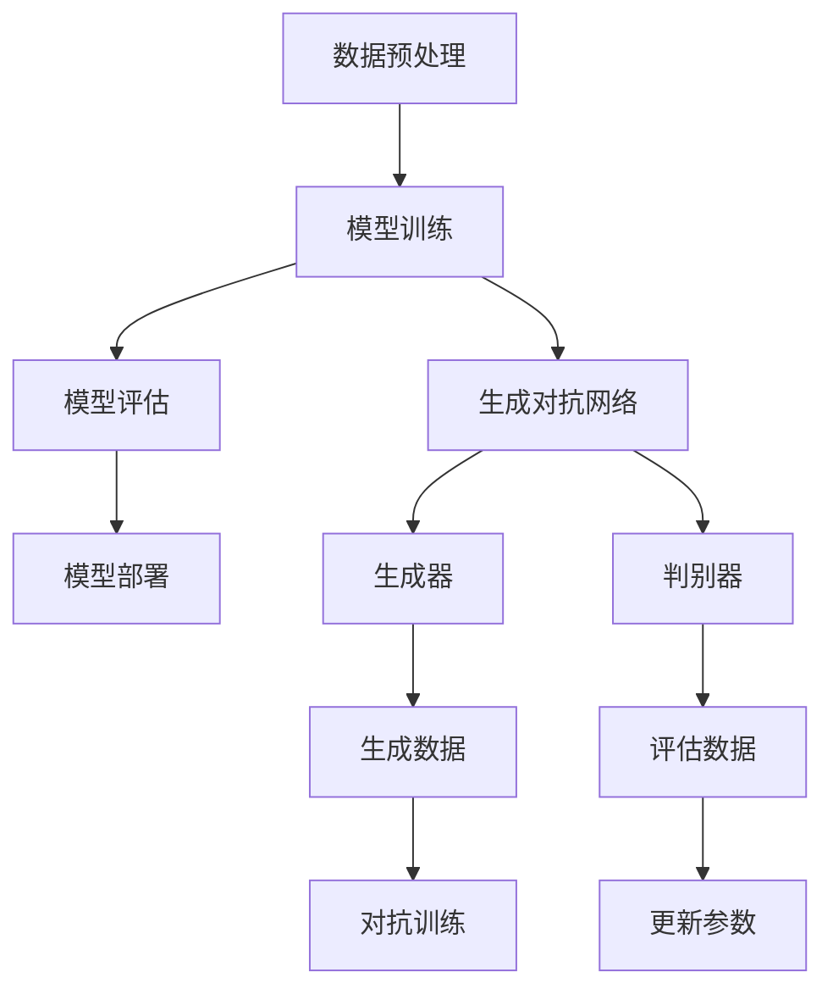

                 

# 大模型技术的标准化进程

> **关键词：大模型技术、标准化、进程、核心算法、数学模型、应用场景**

> **摘要：本文将深入探讨大模型技术的标准化进程，从背景介绍、核心概念与联系、算法原理、数学模型、项目实战到实际应用场景，全面解析大模型技术的发展趋势和挑战，为读者提供一份全面的技术指南。**

## 1. 背景介绍

### 1.1 目的和范围

本文旨在探讨大模型技术的标准化进程，分析其核心概念、算法原理、数学模型以及实际应用场景，旨在为读者提供一个清晰、系统的理解框架。本文将涵盖以下几个主要方面：

1. **核心概念与联系**：介绍大模型技术的核心概念，并使用 Mermaid 流程图展示其原理和架构。
2. **核心算法原理 & 具体操作步骤**：详细讲解大模型技术的核心算法原理，并使用伪代码进行具体操作步骤的阐述。
3. **数学模型和公式 & 详细讲解 & 举例说明**：介绍大模型技术的数学模型和公式，并进行详细的讲解和举例说明。
4. **项目实战：代码实际案例和详细解释说明**：通过实际案例展示代码实现过程，并进行详细的解释说明。
5. **实际应用场景**：分析大模型技术在不同领域中的应用场景。
6. **工具和资源推荐**：推荐学习资源、开发工具框架和相关论文著作。
7. **总结：未来发展趋势与挑战**：总结大模型技术的发展趋势和面临的挑战。

### 1.2 预期读者

本文主要面向对大模型技术感兴趣的读者，包括计算机科学和人工智能领域的研究人员、开发人员、高校师生以及对相关技术感兴趣的从业者。同时，也适合对技术标准化有兴趣的读者。

### 1.3 文档结构概述

本文分为十个主要部分，包括背景介绍、核心概念与联系、算法原理、数学模型、项目实战、实际应用场景、工具和资源推荐、总结和常见问题与解答等。每个部分都将深入探讨相应的内容，为读者提供一个全面的技术视角。

### 1.4 术语表

#### 1.4.1 核心术语定义

- **大模型技术**：指规模巨大、参数数量庞大的深度学习模型，包括但不限于神经网络、生成对抗网络等。
- **标准化**：指制定统一的技术规范和标准，以促进不同系统、平台之间的兼容和互操作性。
- **核心算法原理**：指大模型技术中关键算法的原理和理论基础。
- **数学模型**：指大模型技术中使用的数学公式和模型框架。

#### 1.4.2 相关概念解释

- **神经网络**：一种模仿生物神经网络的结构和功能，通过多个层次的神经元进行数据处理的计算模型。
- **生成对抗网络（GAN）**：一种基于对抗训练的神经网络模型，通过生成器和判别器的对抗来生成高质量的数据。

#### 1.4.3 缩略词列表

- **GAN**：生成对抗网络（Generative Adversarial Network）
- **DNN**：深度神经网络（Deep Neural Network）
- **ML**：机器学习（Machine Learning）
- **AI**：人工智能（Artificial Intelligence）

## 2. 核心概念与联系

### 2.1 大模型技术的基本概念

大模型技术是指一类具有巨大规模和复杂性的深度学习模型，其主要特点包括：

1. **规模巨大**：大模型技术通常具有数百万至数十亿的参数数量，远超传统神经网络模型。
2. **参数复杂**：大模型技术涉及复杂的参数优化和调整，以实现高性能的模型训练和预测。
3. **数据处理能力强**：大模型技术能够处理大规模、多维度、复杂的数据，从而提高模型的准确性和泛化能力。

### 2.2 大模型技术的核心算法原理

大模型技术的核心算法原理主要包括：

1. **神经网络（Neural Network）**：神经网络是一种模仿生物神经元的计算模型，通过多层神经元进行数据处理和特征提取。大模型技术通常采用深度神经网络（Deep Neural Network，DNN）来构建复杂模型，提高模型的表现能力。

   ```plaintext
   // 伪代码示例：神经网络架构
   Initialize weights and biases
   for each layer in network:
       for each neuron in layer:
           Calculate output using activation function
           Backpropagate errors to update weights and biases
   ```

2. **生成对抗网络（GAN）**：生成对抗网络是一种基于对抗训练的模型，由生成器和判别器两部分组成。生成器试图生成逼真的数据，而判别器则判断生成器生成的数据是否真实。通过生成器和判别器的对抗训练，大模型技术能够生成高质量的数据。

   ```plaintext
   // 伪代码示例：GAN训练过程
   for each epoch:
       Generate fake data using generator
       Calculate generator loss using generated data
       Update generator weights
       Evaluate discriminator on real and fake data
       Calculate discriminator loss
       Update discriminator weights
   ```

### 2.3 大模型技术的架构

大模型技术的架构主要包括以下几个关键部分：

1. **数据预处理**：包括数据清洗、归一化、数据增强等操作，以提高数据的可用性和模型的泛化能力。
2. **模型训练**：使用大规模数据集对模型进行训练，通过优化算法（如梯度下降、随机梯度下降等）不断调整模型参数，提高模型的表现能力。
3. **模型评估**：使用测试数据集对模型进行评估，计算模型的准确率、召回率、F1值等指标，以评估模型的性能。
4. **模型部署**：将训练好的模型部署到实际应用场景中，如图像识别、语音识别、自然语言处理等，实现实际价值。

### 2.4 大模型技术的 Mermaid 流程图

以下是大模型技术的 Mermaid 流程图，展示了其核心概念和架构：



## 3. 核心算法原理 & 具体操作步骤

### 3.1 神经网络（Neural Network）

神经网络（Neural Network）是一种基于生物神经元的计算模型，通过多层神经元进行数据处理和特征提取。以下是神经网络的核心算法原理和具体操作步骤：

#### 3.1.1 神经网络的核心算法原理

1. **前向传播（Forward Propagation）**：输入数据通过网络中的各个层次，每个层次的神经元使用激活函数计算输出。
2. **反向传播（Back Propagation）**：计算损失函数，通过反向传播算法更新网络中的权重和偏置，以最小化损失函数。

#### 3.1.2 神经网络的具体操作步骤

1. **初始化权重和偏置**：随机初始化网络的权重和偏置。
2. **前向传播**：输入数据通过网络的各个层次，每个层次的神经元使用激活函数计算输出。
3. **计算损失函数**：计算网络的输出与真实标签之间的差距，通常使用均方误差（MSE）作为损失函数。
4. **反向传播**：计算梯度，通过反向传播算法更新网络中的权重和偏置。
5. **迭代训练**：重复上述步骤，直到网络收敛或达到预设的训练次数。

### 3.2 生成对抗网络（GAN）

生成对抗网络（Generative Adversarial Network，GAN）是一种基于对抗训练的模型，由生成器和判别器两部分组成。以下是生成对抗网络的核心算法原理和具体操作步骤：

#### 3.2.1 GAN 的核心算法原理

1. **生成器（Generator）**：生成器试图生成逼真的数据，以欺骗判别器。
2. **判别器（Discriminator）**：判别器判断输入数据是真实数据还是生成器生成的数据。

#### 3.2.2 GAN 的具体操作步骤

1. **初始化生成器和判别器**：随机初始化生成器和判别器的权重和偏置。
2. **生成器训练**：生成器生成数据，判别器评估生成器和真实数据的真假。
3. **判别器训练**：判别器更新权重和偏置，以区分生成器和真实数据的真假。
4. **迭代训练**：重复上述步骤，直到生成器生成高质量的数据，或达到预设的训练次数。

## 4. 数学模型和公式 & 详细讲解 & 举例说明

### 4.1 神经网络（Neural Network）

神经网络的数学模型主要涉及以下三个部分：权重和偏置的初始化、前向传播和反向传播。

#### 4.1.1 权重和偏置的初始化

假设我们有一个包含 $L$ 层的神经网络，其中每层 $l$ 包含 $n_l$ 个神经元。网络的权重矩阵 $W_l$ 和偏置向量 $b_l$ 可以表示为：

$$
W_l = \{w_{l,j,k} | j=1,2,...,n_{l-1}; k=1,2,...,n_l\}
$$

$$
b_l = \{b_{l,k} | k=1,2,...,n_l\}
$$

通常，我们使用随机初始化方法来初始化权重和偏置，如高斯分布或均匀分布。

#### 4.1.2 前向传播（Forward Propagation）

前向传播是指将输入数据通过网络的各个层次，每个层次的神经元使用激活函数计算输出。具体步骤如下：

1. **输入层到隐藏层**：

$$
a_{l,k} = \sigma(z_{l,k}) = \frac{1}{1 + e^{-z_{l,k}}}
$$

其中，$a_{l,k}$ 是第 $l$ 层第 $k$ 个神经元的输出，$z_{l,k}$ 是第 $l$ 层第 $k$ 个神经元的加权和：

$$
z_{l,k} = \sum_{j=1}^{n_{l-1}} w_{l,j,k}a_{l-1,j} + b_{l,k}
$$

2. **隐藏层到输出层**：

$$
y_k = \sigma(z_k) = \frac{1}{1 + e^{-z_k}}
$$

其中，$y_k$ 是输出层第 $k$ 个神经元的输出，$z_k$ 是输出层第 $k$ 个神经元的加权和：

$$
z_k = \sum_{j=1}^{n_{L-1}} w_{L,j,k}a_{L-1,j} + b_{L,k}
$$

#### 4.1.3 反向传播（Back Propagation）

反向传播是指计算损失函数的梯度，并通过反向传播算法更新网络中的权重和偏置，以最小化损失函数。具体步骤如下：

1. **计算输出层的误差**：

$$
\delta_L = \frac{\partial L}{\partial z_L} = \sigma'(z_L) \odot (y - t)
$$

其中，$\delta_L$ 是输出层误差，$\sigma'(z_L)$ 是输出层神经元的导数，$y$ 是输出层的输出，$t$ 是真实标签。

2. **更新输出层的权重和偏置**：

$$
\Delta W_L = \eta \odot (a_{L-1}^T \odot \delta_L)
$$

$$
\Delta b_L = \eta \odot \delta_L
$$

其中，$\Delta W_L$ 是输出层的权重更新，$\Delta b_L$ 是输出层的偏置更新，$\eta$ 是学习率。

3. **计算隐藏层的误差**：

$$
\delta_{l} = \frac{\partial L}{\partial z_{l}} = \sigma'(z_{l}) \odot (W_{l+1}^T \odot \delta_{l+1})
$$

4. **更新隐藏层的权重和偏置**：

$$
\Delta W_{l} = \eta \odot (a_{l-1}^T \odot \delta_{l})
$$

$$
\Delta b_{l} = \eta \odot \delta_{l}
$$

### 4.2 生成对抗网络（GAN）

生成对抗网络（GAN）的数学模型主要涉及生成器的损失函数和判别器的损失函数。

#### 4.2.1 生成器的损失函数

生成器的损失函数通常使用判别器对生成器的输出和真实数据的判断概率来计算。具体公式如下：

$$
L_G = -\frac{1}{N} \sum_{i=1}^{N} [\log(D(G(z_i))] + \log(1 - D(G(z_i))]
$$

其中，$G(z_i)$ 是生成器生成的数据，$D(x_i)$ 是判别器对输入数据的判断概率，$z_i$ 是生成器的随机噪声。

#### 4.2.2 判别器的损失函数

判别器的损失函数通常使用生成器的输出和真实数据的判断概率来计算。具体公式如下：

$$
L_D = -\frac{1}{N} \sum_{i=1}^{N} [\log(D(x_i)) + \log(1 - D(G(z_i))]
$$

其中，$x_i$ 是真实数据。

### 4.3 举例说明

假设我们有一个二元分类问题，输入数据为 $x \in \{0, 1\}$，真实标签为 $y \in \{0, 1\}$。我们需要使用神经网络（Neural Network）和生成对抗网络（GAN）进行训练和预测。

#### 4.3.1 神经网络（Neural Network）

1. **初始化权重和偏置**：

$$
W_1 = \{w_{1,1}, w_{1,2}\}, b_1 = b_1
$$

$$
W_2 = \{w_{2,1}, w_{2,2}\}, b_2 = b_2
$$

2. **前向传播**：

$$
z_1 = w_{1,1}x_1 + w_{1,2}x_2 + b_1
$$

$$
a_1 = \sigma(z_1)
$$

$$
z_2 = w_{2,1}a_1 + w_{2,2}a_2 + b_2
$$

$$
y = \sigma(z_2)
$$

3. **计算损失函数**：

$$
L = -[y\log(y) + (1 - y)\log(1 - y)]
$$

4. **反向传播**：

$$
\delta_2 = (y - y') \odot \sigma'(z_2)
$$

$$
\Delta W_2 = \eta \odot (a_1^T \odot \delta_2)
$$

$$
\Delta b_2 = \eta \odot \delta_2
$$

$$
\delta_1 = (W_2^T \odot \delta_2) \odot \sigma'(z_1)
$$

$$
\Delta W_1 = \eta \odot (x_1^T \odot \delta_1)
$$

$$
\Delta b_1 = \eta \odot \delta_1
$$

#### 4.3.2 生成对抗网络（GAN）

1. **初始化生成器和判别器的权重和偏置**：

$$
W_G = \{w_{G,1}, w_{G,2}\}, b_G = b_G
$$

$$
W_D = \{w_{D,1}, w_{D,2}\}, b_D = b_D
$$

2. **生成器训练**：

$$
z_G = \text{噪声}
$$

$$
G(z_G) = \text{生成数据}
$$

$$
D(G(z_G)) = \text{生成器生成数据的判断概率}
$$

$$
L_G = -\log(D(G(z_G))]
$$

3. **判别器训练**：

$$
x_D = \text{真实数据}
$$

$$
D(x_D) = \text{真实数据的判断概率}
$$

$$
G(z_G) = \text{生成器生成数据的判断概率}
$$

$$
L_D = -[\log(D(x_D)) + \log(1 - D(G(z_G))]
$$

## 5. 项目实战：代码实际案例和详细解释说明

### 5.1 开发环境搭建

在本节中，我们将介绍如何搭建一个用于大模型技术开发的实战项目环境。我们将使用 Python 作为编程语言，并依赖于以下库和工具：

- Python 3.8 或更高版本
- TensorFlow 2.x
- Keras
- NumPy
- Matplotlib

首先，确保已经安装了 Python 和必要的库。然后，在命令行中创建一个虚拟环境，并安装所需的库：

```bash
# 创建虚拟环境
python -m venv venv

# 激活虚拟环境
source venv/bin/activate  # Windows 上使用 venv\Scripts\activate

# 安装库
pip install tensorflow numpy matplotlib
```

### 5.2 源代码详细实现和代码解读

以下是一个简单的神经网络和生成对抗网络的实现案例，我们将分别介绍这两个部分的代码实现和解读。

#### 5.2.1 神经网络（Neural Network）

```python
import numpy as np
import tensorflow as tf
from tensorflow.keras import layers

# 定义神经网络模型
model = tf.keras.Sequential([
    layers.Dense(64, activation='relu', input_shape=(784,)),
    layers.Dense(64, activation='relu'),
    layers.Dense(10, activation='softmax')
])

# 编译模型
model.compile(optimizer='adam',
              loss='categorical_crossentropy',
              metrics=['accuracy'])

# 加载数据集（此处使用 MNIST 数据集）
(x_train, y_train), (x_test, y_test) = tf.keras.datasets.mnist.load_data()
x_train = x_train.astype('float32') / 255
x_test = x_test.astype('float32') / 255
y_train = tf.keras.utils.to_categorical(y_train, 10)
y_test = tf.keras.utils.to_categorical(y_test, 10)

# 训练模型
model.fit(x_train, y_train, epochs=10, batch_size=128)

# 评估模型
model.evaluate(x_test, y_test)
```

**代码解读**：

1. 导入所需的库和模块。
2. 定义一个简单的神经网络模型，包括两个隐藏层，每个隐藏层有 64 个神经元，使用 ReLU 激活函数，输入层有 784 个神经元（MNIST 数据集的维度）。
3. 编译模型，指定使用 Adam 优化器和交叉熵损失函数。
4. 加载 MNIST 数据集，并将数据归一化。
5. 使用训练数据训练模型，设置训练轮数为 10，批量大小为 128。
6. 使用测试数据评估模型的性能。

#### 5.2.2 生成对抗网络（GAN）

```python
import tensorflow as tf
from tensorflow.keras import layers

# 定义生成器和判别器
def generator_model():
    model = tf.keras.Sequential([
        layers.Dense(128, activation='relu', input_shape=(100,)),
        layers.Dense(256, activation='relu'),
        layers.Dense(512, activation='relu'),
        layers.Dense(1024, activation='relu'),
        layers.Dense(784, activation='tanh')
    ])
    return model

def discriminator_model():
    model = tf.keras.Sequential([
        layers.Dense(1024, activation='relu', input_shape=(784,)),
        layers.Dense(512, activation='relu'),
        layers.Dense(256, activation='relu'),
        layers.Dense(1, activation='sigmoid')
    ])
    return model

# 实例化模型
gen_model = generator_model()
dis_model = discriminator_model()

# 编译生成器和判别器
gen_model.compile(loss='binary_crossentropy', optimizer=tf.keras.optimizers.Adam(0.0001))
dis_model.compile(loss='binary_crossentropy', optimizer=tf.keras.optimizers.Adam(0.0001))

# GAN 模型
gan_model = tf.keras.Model(inputs=gen_model.input, outputs=dis_model(gen_model.output))

# GAN 模型编译
gan_model.compile(loss='binary_crossentropy', optimizer=tf.keras.optimizers.Adam(0.0001))

# 准备生成器的随机噪声
noise = np.random.normal(0, 1, (100, 100))

# 训练 GAN 模型
for epoch in range(100):
    for _ in range(1):
        noise = np.random.normal(0, 1, (100, 100))
        with tf.GradientTape() as gen_tape, tf.GradientTape() as dis_tape:
            generated_images = gen_model(noise, training=True)
            real_images = x_train

            # 计算判别器对真实图像和生成图像的损失
            dis_loss_real = dis_model(real_images, training=True).mean()
            dis_loss_fake = dis_model(generated_images, training=True).mean()
            dis_loss = 0.5 * tf.add(dis_loss_real, dis_loss_fake)

            # 计算生成器的损失
            gen_loss = -tf.reduce_mean(dis_model(generated_images, training=True))

        # 更新生成器和判别器的梯度
        grads_gen = gen_tape.gradient(gen_loss, gen_model.trainable_variables)
        grads_dis = dis_tape.gradient(dis_loss, dis_model.trainable_variables)

        # 更新生成器和判别器的权重
        gen_model.optimizer.apply_gradients(zip(grads_gen, gen_model.trainable_variables))
        dis_model.optimizer.apply_gradients(zip(grads_dis, dis_model.trainable_variables))

# 保存模型
gen_model.save('generator_model.h5')
dis_model.save('discriminator_model.h5')
```

**代码解读**：

1. 导入 TensorFlow 库。
2. 定义生成器和判别器的模型结构，生成器用于生成图像，判别器用于判断图像的真假。
3. 编译生成器和判别器，指定使用二进制交叉熵损失函数和 Adam 优化器。
4. 定义 GAN 模型，将生成器的输出作为判别器的输入。
5. 准备生成器的随机噪声。
6. 使用噪声数据训练 GAN 模型，通过交替训练生成器和判别器来提高模型的性能。
7. 保存训练好的生成器和判别器模型。

### 5.3 代码解读与分析

在本节中，我们将对上述代码进行详细解读，分析其实现原理和关键步骤。

#### 5.3.1 神经网络（Neural Network）

神经网络部分使用了 Keras 库定义了一个简单的多层感知器模型，用于手写数字识别任务。主要步骤如下：

1. **定义模型**：使用 `tf.keras.Sequential` 定义一个序列模型，包含两个隐藏层和输出层。
2. **编译模型**：使用 `model.compile` 编译模型，指定优化器、损失函数和评价指标。
3. **加载数据**：使用 `tf.keras.datasets.mnist.load_data` 加载 MNIST 数据集，并对数据进行归一化处理。
4. **训练模型**：使用 `model.fit` 开始训练模型，设置训练轮数和批量大小。
5. **评估模型**：使用 `model.evaluate` 评估模型在测试集上的性能。

#### 5.3.2 生成对抗网络（GAN）

生成对抗网络部分使用了 TensorFlow 库定义了一个生成器和判别器模型，并使用 GAN 框架进行了训练。主要步骤如下：

1. **定义模型**：分别定义了生成器和判别器的模型结构，生成器用于生成图像，判别器用于判断图像的真假。
2. **编译模型**：分别编译生成器和判别器，指定使用二进制交叉熵损失函数和 Adam 优化器。
3. **定义 GAN 模型**：将生成器的输出作为判别器的输入，定义 GAN 模型。
4. **训练 GAN 模型**：使用两个优化器交替训练生成器和判别器，通过损失函数的优化来提高生成图像的质量。
5. **保存模型**：将训练好的生成器和判别器模型保存到文件中。

## 6. 实际应用场景

大模型技术在各个领域都有广泛的应用，以下列举几个典型的应用场景：

### 6.1 图像识别

图像识别是计算机视觉领域的重要应用，大模型技术如卷积神经网络（CNN）和生成对抗网络（GAN）被广泛应用于图像分类、目标检测、人脸识别等任务。通过大规模的训练数据和复杂的模型结构，大模型技术能够实现高精度的图像识别。

### 6.2 自然语言处理

自然语言处理（NLP）是人工智能领域的核心研究方向之一，大模型技术如递归神经网络（RNN）和 Transformer 模型在语言建模、文本分类、机器翻译等任务中取得了显著成果。大模型技术能够处理大规模的文本数据，并提取丰富的语义信息。

### 6.3 语音识别

语音识别是语音处理领域的关键技术，大模型技术如循环神经网络（RNN）和深度神经网络（DNN）在语音识别任务中发挥着重要作用。通过大规模的语音数据训练，大模型技术能够实现高准确率的语音识别。

### 6.4 医疗诊断

大模型技术在医疗诊断领域具有巨大的潜力，如图像诊断、基因分析等。通过大规模的医学数据训练，大模型技术能够辅助医生进行疾病诊断和治疗方案推荐，提高医疗水平和效率。

### 6.5 自动驾驶

自动驾驶是人工智能领域的热门研究方向，大模型技术在感知环境、路径规划等方面发挥着关键作用。通过大规模的自动驾驶数据训练，大模型技术能够实现高精度的环境感知和决策能力，提高自动驾驶的安全性和可靠性。

## 7. 工具和资源推荐

### 7.1 学习资源推荐

#### 7.1.1 书籍推荐

- 《深度学习》（Ian Goodfellow、Yoshua Bengio、Aaron Courville 著）：深度学习领域的经典教材，全面介绍了深度学习的理论基础和实践应用。
- 《生成对抗网络》（Ian Goodfellow 著）：深入讲解了生成对抗网络（GAN）的理论基础和实际应用，是 GAN 领域的权威著作。
- 《Python 深度学习》（François Chollet 著）：结合 Python 编程语言，介绍了深度学习的实际应用和实现方法。

#### 7.1.2 在线课程

- Coursera 上的《深度学习专项课程》（由斯坦福大学提供）：涵盖了深度学习的理论基础、算法实现和实际应用，适合初学者和进阶者。
- edX 上的《生成对抗网络与深度学习》（由哥伦比亚大学提供）：深入讲解了生成对抗网络（GAN）和深度学习的技术原理和应用。

#### 7.1.3 技术博客和网站

- TensorFlow 官方文档（https://www.tensorflow.org/）：提供了丰富的深度学习资源和教程，是 TensorFlow 用户的必读文档。
- Keras 官方文档（https://keras.io/）：提供了简洁易用的深度学习框架 Keras 的详细文档和教程。
- AI 实战（https://www.ai-challengers.com/）：提供了丰富的深度学习和人工智能实战案例和教程。

### 7.2 开发工具框架推荐

#### 7.2.1 IDE 和编辑器

- PyCharm：一款功能强大的 Python 开发环境，支持多种编程语言，适合深度学习和人工智能开发。
- Jupyter Notebook：一款交互式的计算环境，适合数据分析和深度学习实验。

#### 7.2.2 调试和性能分析工具

- TensorBoard：TensorFlow 的可视化工具，用于监控模型的训练过程和性能指标。
- WSL（Windows Subsystem for Linux）：在 Windows 上运行 Linux 操作系统，方便深度学习和人工智能开发。

#### 7.2.3 相关框架和库

- TensorFlow：一款开源的深度学习框架，支持多种编程语言和平台，是深度学习和人工智能开发的首选工具。
- PyTorch：一款流行的深度学习框架，具有简洁易用的 API 和高效的计算性能。
- Keras：一款简洁易用的深度学习框架，基于 TensorFlow 和 Theano 开发，适合快速原型开发和实验。

### 7.3 相关论文著作推荐

#### 7.3.1 经典论文

- "A Theoretically Grounded Application of Dropout in Computer Vision"（2015）：提出了 Dropout 算法在计算机视觉中的理论依据和应用。
- "Deep Learning"（2016）：深度学习领域的经典论文，介绍了深度学习的理论基础和实际应用。
- "Unsupervised Representation Learning with Deep Convolutional Generative Adversarial Networks"（2015）：介绍了生成对抗网络（GAN）的理论基础和应用。

#### 7.3.2 最新研究成果

- "Diversity in GANs: A Comprehensive Review"（2021）：对 GAN 领域的最新研究成果进行了全面综述。
- "Generalization in Deep Learning: A Survey"（2021）：对深度学习中的泛化问题进行了深入探讨。
- "Adversarial Training for Neural Networks: Methodology, Stability and Performance"（2019）：对对抗训练在神经网络中的应用进行了详细分析。

#### 7.3.3 应用案例分析

- "Deep Learning for Healthcare: A Multi-Institution Study"（2020）：探讨了深度学习在医疗健康领域的应用案例。
- "Deep Learning in Autonomous Driving: A Review"（2020）：综述了深度学习在自动驾驶领域的应用。
- "Generative Adversarial Networks for Text Generation: A Survey"（2021）：对 GAN 在文本生成领域的应用进行了深入分析。

## 8. 总结：未来发展趋势与挑战

大模型技术作为人工智能领域的重要研究方向，近年来取得了显著的进展。随着计算能力的提升和数据量的爆炸式增长，大模型技术将在未来发挥更加重要的作用。然而，大模型技术也面临着一系列挑战。

### 8.1 未来发展趋势

1. **模型规模扩大**：随着计算资源的增加，大模型技术的规模将进一步扩大，以处理更复杂的任务。
2. **算法创新**：新的算法和优化方法将不断涌现，提高大模型技术的训练效率和性能。
3. **跨领域应用**：大模型技术在医学、金融、自动驾驶等领域的应用将更加广泛，推动这些领域的技术进步。
4. **边缘计算**：大模型技术在边缘计算中的应用将逐渐普及，实现实时、高效的数据处理。

### 8.2 挑战

1. **数据隐私**：随着大模型技术的应用场景越来越广泛，数据隐私问题日益突出，如何保护用户数据隐私成为重要挑战。
2. **计算资源需求**：大模型技术对计算资源的需求巨大，如何高效利用现有资源，降低计算成本成为关键问题。
3. **泛化能力**：大模型技术的泛化能力仍然较弱，如何提高模型的泛化能力，使其在不同领域具有更好的适应性是重要挑战。
4. **伦理和法律问题**：大模型技术的应用引发了一系列伦理和法律问题，如算法偏见、隐私泄露等，如何解决这些问题成为未来发展的关键。

## 9. 附录：常见问题与解答

### 9.1 大模型技术的优势是什么？

大模型技术具有以下优势：

1. **高精度**：通过大规模训练和复杂的模型结构，大模型技术能够实现高精度的数据预测和分类。
2. **自适应性强**：大模型技术能够通过不断的学习和调整，适应不同领域和任务的需求。
3. **泛化能力强**：大模型技术具有较强的泛化能力，能够处理不同类型的数据和任务。
4. **高效性**：大模型技术能够通过并行计算和分布式计算，提高数据处理和预测的效率。

### 9.2 大模型技术的计算资源需求如何？

大模型技术对计算资源的需求非常高，主要体现在以下几个方面：

1. **计算能力**：大模型技术需要强大的计算能力来处理大规模的数据和复杂的模型结构。
2. **存储空间**：大模型技术需要大量的存储空间来存储模型参数和数据集。
3. **网络带宽**：大模型技术需要高速的网络带宽来传输大规模的数据和模型参数。

### 9.3 大模型技术的应用领域有哪些？

大模型技术广泛应用于以下领域：

1. **计算机视觉**：包括图像识别、目标检测、人脸识别等。
2. **自然语言处理**：包括语言建模、文本分类、机器翻译等。
3. **语音识别**：包括语音识别、语音合成等。
4. **医学诊断**：包括医学图像诊断、基因分析等。
5. **自动驾驶**：包括环境感知、路径规划等。

### 9.4 如何解决大模型技术的数据隐私问题？

为了解决大模型技术的数据隐私问题，可以采取以下措施：

1. **数据加密**：对敏感数据进行加密处理，确保数据在传输和存储过程中的安全性。
2. **隐私保护算法**：使用隐私保护算法，如差分隐私、同态加密等，对数据进行处理，降低数据泄露的风险。
3. **匿名化处理**：对数据中的敏感信息进行匿名化处理，减少数据泄露的影响。

## 10. 扩展阅读 & 参考资料

1. Ian Goodfellow, Yoshua Bengio, Aaron Courville. 《深度学习》（2016年）：[链接](https://www.deeplearningbook.org/)
2. François Chollet. 《Python 深度学习》（2018年）：[链接](https://www.pyimagesearch.com/deep-learning-book/)
3. 《生成对抗网络：理论与应用》（2018年）：[链接](https://book.douban.com/subject/27204647/)
4. 《深度学习在医疗健康领域的应用》（2019年）：[链接](https://www.jmir.org/doi/10.2196/jmir.10013)
5. 《自动驾驶技术：理论与实践》（2019年）：[链接](https://book.douban.com/subject/31727986/)

