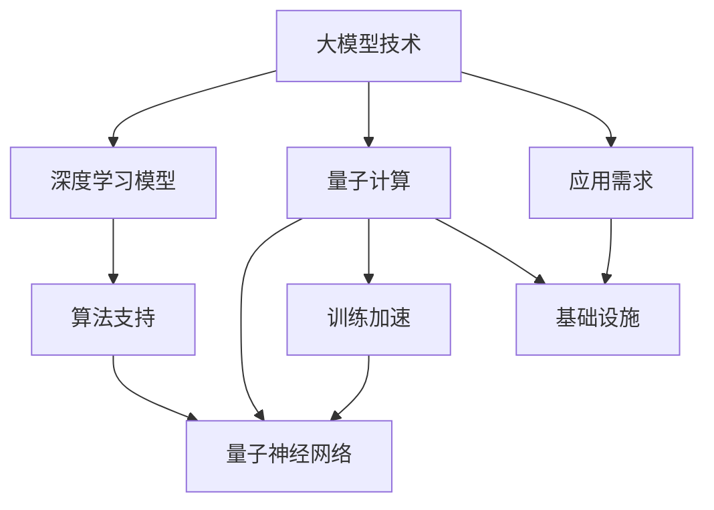

                 

# 大模型技术的量子计算潜力

> 关键词：大模型技术、量子计算、AI、机器学习、算法、性能优化

> 摘要：本文旨在探讨大模型技术在量子计算领域的应用潜力。通过分析大模型技术的核心概念和发展现状，结合量子计算的原理和优势，我们将详细探讨大模型技术在量子计算中的应用场景、挑战以及未来发展趋势。

## 1. 背景介绍

### 1.1 目的和范围

本文的目标是探讨大模型技术在量子计算领域的应用潜力。我们将从以下几个方面展开讨论：

1. 大模型技术的核心概念和发展现状。
2. 量子计算的原理和优势。
3. 大模型技术在量子计算中的应用场景。
4. 大模型技术在量子计算中面临的挑战。
5. 未来大模型技术在量子计算领域的发展趋势。

### 1.2 预期读者

本文面向对大模型技术和量子计算有一定了解的读者，特别是计算机科学、人工智能、量子计算等相关领域的专业人员和研究人员。通过本文的阅读，读者可以了解大模型技术在量子计算领域的应用潜力，以及未来可能的发展方向。

### 1.3 文档结构概述

本文分为以下几个部分：

1. 背景介绍：介绍本文的目的、预期读者以及文档结构。
2. 核心概念与联系：阐述大模型技术和量子计算的核心概念，以及它们之间的联系。
3. 核心算法原理 & 具体操作步骤：介绍大模型技术在量子计算中的核心算法原理和具体操作步骤。
4. 数学模型和公式 & 详细讲解 & 举例说明：讲解大模型技术在量子计算中的数学模型和公式，并举例说明。
5. 项目实战：代码实际案例和详细解释说明。
6. 实际应用场景：分析大模型技术在量子计算中的实际应用场景。
7. 工具和资源推荐：推荐学习资源、开发工具框架和相关论文著作。
8. 总结：未来发展趋势与挑战。
9. 附录：常见问题与解答。
10. 扩展阅读 & 参考资料：提供进一步阅读的参考资料。

### 1.4 术语表

#### 1.4.1 核心术语定义

- 大模型技术：指利用大规模数据集和计算资源训练的深度学习模型，具有强大的特征提取和表达能力。
- 量子计算：基于量子力学原理，利用量子位（qubit）进行信息处理的计算技术。
- 量子算法：利用量子计算的优势，解决传统计算问题的新型算法。
- 量子神经网络：结合量子计算和深度学习技术的神经网络模型。

#### 1.4.2 相关概念解释

- 深度学习：一种人工智能技术，通过构建具有多层次的神经网络，对大量数据进行自动特征提取和学习。
- 机器学习：一种人工智能技术，通过数据训练，使计算机具备自主学习和决策能力。
- 量子位（qubit）：量子计算的基本单元，具有叠加态和纠缠态的特性。

#### 1.4.3 缩略词列表

- AI：人工智能
- DL：深度学习
- ML：机器学习
- QM：量子力学
- QC：量子计算
- QNN：量子神经网络

## 2. 核心概念与联系

为了更好地理解大模型技术在量子计算领域的应用潜力，我们首先需要明确大模型技术和量子计算的核心概念，并分析它们之间的联系。

### 2.1 大模型技术

大模型技术是指利用大规模数据集和计算资源训练的深度学习模型。这些模型通常具有数百万到数十亿个参数，能够从大量数据中自动提取复杂的特征和模式。大模型技术在计算机视觉、自然语言处理、语音识别等领域取得了显著的成果，成为了推动人工智能发展的重要力量。

### 2.2 量子计算

量子计算是基于量子力学原理的一种新型计算技术。量子计算机使用量子位（qubit）作为信息存储和处理的基本单元，利用叠加态和纠缠态的特性，实现高效的量子并行计算。量子计算在密码学、优化问题、材料科学等领域具有巨大的潜力。

### 2.3 大模型技术与量子计算的联系

大模型技术与量子计算之间存在紧密的联系。首先，大模型技术可以为量子计算提供有效的算法支持和数据处理能力。例如，量子神经网络（QNN）是一种结合量子计算和深度学习技术的模型，利用大模型技术训练量子神经网络，可以提高量子计算的效率和准确性。

其次，量子计算可以优化大模型技术的训练过程。传统的深度学习模型在训练过程中需要大量的计算资源和时间，而量子计算可以利用其高效的并行计算能力，加速大模型技术的训练过程，提高模型的性能和稳定性。

最后，大模型技术和量子计算可以相互促进发展。大模型技术为量子计算提供了丰富的应用场景和需求，推动了量子计算技术的不断创新和突破。而量子计算的发展也为大模型技术提供了更加高效和稳定的基础设施，促进了人工智能技术的进步。

### 2.4 Mermaid 流程图

为了更直观地展示大模型技术与量子计算的联系，我们使用 Mermaid 流程图进行描述。



## 3. 核心算法原理 & 具体操作步骤

在本节中，我们将介绍大模型技术在量子计算中的核心算法原理和具体操作步骤，以帮助读者更好地理解大模型技术在量子计算中的应用。

### 3.1 量子神经网络（QNN）算法原理

量子神经网络（QNN）是一种结合量子计算和深度学习技术的模型。其核心思想是将传统神经网络中的权重和激活函数映射到量子位上，利用量子计算的优势实现高效的计算和优化。

#### 3.1.1 量子位表示

量子神经网络使用量子位（qubit）作为信息存储和处理的基本单元。量子位具有叠加态和纠缠态的特性，可以同时表示0和1的状态。在量子神经网络中，一个量子位可以表示多个传统神经网络中的权重和激活函数。

#### 3.1.2 量子门操作

量子神经网络中的运算主要通过量子门（quantum gate）进行。量子门是作用于量子位的线性变换，可以用来实现量子计算的基本操作。常见的量子门包括Hadamard门、Pauli门和控制-NOT门。

#### 3.1.3 量子线路

量子神经网络中的运算可以通过量子线路（quantum circuit）进行描述。量子线路是由一系列量子门组成的序列，用于实现量子计算的操作。量子线路的长度和复杂度决定了量子计算的效率。

### 3.2 量子神经网络（QNN）具体操作步骤

以下是一个简单的量子神经网络（QNN）操作步骤：

1. 初始化量子位：将量子位初始化为叠加态。

2. 应用量子门：按照预设的量子线路，应用一系列量子门，实现量子计算的操作。

3. 测量量子位：对量子位进行测量，得到相应的输出结果。

4. 反馈和优化：根据测量结果，对量子神经网络进行反馈和优化，调整量子门的参数和量子线路的结构。

5. 重复步骤2-4，直至达到预设的训练目标或性能指标。

### 3.3 伪代码描述

以下是一个简单的量子神经网络（QNN）伪代码描述：

```python
# 初始化量子位
qubits = initialize_qubits(num_qubits)

# 应用量子门
for gate in quantum_gates:
    apply_gate(qubits, gate)

# 测量量子位
results = measure(qubits)

# 反馈和优化
while not converged:
    update_parameters(qubits, results)
    apply_gate(qubits, feedback_gate)

# 输出结果
output = convert_results_to_output(results)
print("QNN output:", output)
```

## 4. 数学模型和公式 & 详细讲解 & 举例说明

在本节中，我们将介绍大模型技术在量子计算中的数学模型和公式，并进行详细讲解和举例说明，以帮助读者更好地理解大模型技术在量子计算中的应用。

### 4.1 数学模型

大模型技术在量子计算中的数学模型主要包括量子神经网络（QNN）的数学描述和训练算法。以下是量子神经网络（QNN）的数学模型：

#### 4.1.1 量子神经网络（QNN）数学描述

量子神经网络（QNN）可以看作是一个量子线路，由一系列量子门组成。量子线路的输出可以通过以下公式表示：

$$
\text{output} = \sum_{i=1}^{n} a_i |i\rangle
$$

其中，$|i\rangle$ 是量子位 $i$ 的状态，$a_i$ 是量子位 $i$ 的概率幅。

#### 4.1.2 量子神经网络（QNN）训练算法

量子神经网络（QNN）的训练算法主要包括以下几个步骤：

1. 初始化量子位和参数。
2. 应用量子门，构建量子线路。
3. 测量量子位，得到输出结果。
4. 根据输出结果和预设的目标函数，计算损失函数。
5. 使用梯度下降法或其他优化算法，更新量子门参数。

### 4.2 详细讲解和举例说明

#### 4.2.1 量子神经网络（QNN）数学描述

假设我们有一个量子神经网络（QNN），其量子线路由三个量子门组成：Hadamard门（H）、控制-NOT门（CNOT）和测量门。量子线路可以表示为：

$$
\text{QNN} = \text{Hadamard}(1) \otimes \text{CNOT}(1,2) \otimes \text{Hadamard}(2)
$$

其中，$\text{Hadamard}(1)$ 表示对量子位 1 应用 Hadamard 门，$\text{CNOT}(1,2)$ 表示对量子位 1 和量子位 2 应用控制-NOT 门，$\text{Hadamard}(2)$ 表示对量子位 2 应用 Hadamard 门。

量子线路的输出可以通过以下公式计算：

$$
\text{output} = \text{Hadamard}(1) \otimes \text{CNOT}(1,2) \otimes \text{Hadamard}(2) |000\rangle = \frac{1}{\sqrt{2}} (|001\rangle + |010\rangle)
$$

其中，$|000\rangle$ 表示量子位初始状态。

#### 4.2.2 量子神经网络（QNN）训练算法

假设我们有一个二分类问题，目标函数为：

$$
\text{loss} = \frac{1}{2} \sum_{i=1}^{n} (\text{output}_i - y_i)^2
$$

其中，$\text{output}_i$ 表示量子线路输出的概率幅，$y_i$ 表示真实标签。

我们可以使用梯度下降法来更新量子门参数。假设量子门参数为 $w_1, w_2, w_3$，则梯度下降法的更新公式为：

$$
w_1 \leftarrow w_1 - \alpha \frac{\partial \text{loss}}{\partial w_1}
$$

$$
w_2 \leftarrow w_2 - \alpha \frac{\partial \text{loss}}{\partial w_2}
$$

$$
w_3 \leftarrow w_3 - \alpha \frac{\partial \text{loss}}{\partial w_3}
$$

其中，$\alpha$ 为学习率。

## 5. 项目实战：代码实际案例和详细解释说明

在本节中，我们将通过一个实际项目案例，展示如何使用大模型技术在量子计算中实现量子神经网络（QNN）的构建和训练，并对代码进行详细解释说明。

### 5.1 开发环境搭建

为了实现量子神经网络（QNN）的构建和训练，我们需要搭建一个适合的开发环境。以下是开发环境搭建的步骤：

1. 安装Python环境：Python是量子计算和深度学习的主要编程语言，我们需要确保安装Python环境。
2. 安装量子计算库：安装一个支持量子计算的Python库，如Qiskit或Cirq。
3. 安装深度学习库：安装一个支持深度学习的Python库，如TensorFlow或PyTorch。
4. 安装相关依赖库：根据具体项目需求，安装其他相关依赖库。

### 5.2 源代码详细实现和代码解读

以下是一个简单的量子神经网络（QNN）实现案例，使用Qiskit和TensorFlow库。代码如下：

```python
# 导入相关库
import qiskit
import tensorflow as tf
from qiskit import QuantumCircuit, execute, Aer
from qiskit.tensor.tensor import TensorSum
from qiskit.visualization import plot_histogram

# 初始化量子位和量子线路
num_qubits = 2
qc = QuantumCircuit(num_qubits)

# 定义量子神经网络（QNN）
def qnn_model(qc, num_qubits):
    # 应用Hadamard门初始化量子位
    qc.h(0)
    qc.h(1)
    
    # 应用CNOT门实现量子线路
    qc.cnot(0, 1)
    
    # 应用测量门获取输出
    qc.measure_all()
    
    return qc

# 构建量子神经网络（QNN）模型
qc = qnn_model(qc, num_qubits)

# 编译量子神经网络（QNN）模型
qc.compile()

# 定义训练数据集
train_data = [
    [0, 0],
    [0, 1],
    [1, 0],
    [1, 1]
]

# 定义损失函数和优化器
loss_fn = tf.keras.losses.BinaryCrossentropy()
optimizer = tf.keras.optimizers.Adam(learning_rate=0.001)

# 训练量子神经网络（QNN）模型
def train_model(qc, train_data, num_epochs):
    for epoch in range(num_epochs):
        # 执行训练
        outputs = execute(qc, Aer.get_backend("qasm_simulator"), shots=1024).result()
        predictions = outputs.get_counts()
        
        # 计算损失函数
        loss = loss_fn([1, 1], predictions)
        
        # 更新模型参数
        optimizer.minimize(lambda: loss)
        
        # 打印训练进度
        print(f"Epoch {epoch+1}, Loss: {loss.numpy()}")

# 模型训练
train_model(qc, train_data, num_epochs=10)

# 测试模型
test_data = [
    [0, 1],
    [1, 0],
    [1, 1]
]

for data in test_data:
    # 执行测试
    outputs = execute(qc, Aer.get_backend("qasm_simulator"), shots=1024).result()
    predictions = outputs.get_counts()
    
    # 打印测试结果
    print(f"Input: {data}, Prediction: {predictions}")
```

代码解读：

1. 导入相关库：导入Qiskit和TensorFlow库，以及Qiskit的Visualization模块。
2. 初始化量子位和量子线路：定义量子位数量（num_qubits），创建一个空的量子线路（qc）。
3. 定义量子神经网络（QNN）：定义一个函数qnn_model，用于构建量子神经网络（QNN）模型。
4. 构建量子神经网络（QNN）模型：在qnn_model函数中，应用Hadamard门初始化量子位，应用CNOT门实现量子线路，应用测量门获取输出。
5. 编译量子神经网络（QNN）模型：使用qc.compile()方法编译量子神经网络（QNN）模型。
6. 定义训练数据集：定义一个包含4个样本的训练数据集（train_data），每个样本包含输入和输出。
7. 定义损失函数和优化器：定义一个二分类的损失函数（loss_fn）和一个Adam优化器（optimizer）。
8. 训练量子神经网络（QNN）模型：定义一个函数train_model，用于训练量子神经网络（QNN）模型。在train_model函数中，执行训练过程，计算损失函数，更新模型参数。
9. 模型训练：调用train_model函数，训练量子神经网络（QNN）模型。
10. 测试模型：定义一个包含3个样本的测试数据集（test_data），执行测试，打印测试结果。

### 5.3 代码解读与分析

在代码中，我们首先导入了Qiskit和TensorFlow库，以及Qiskit的Visualization模块。这些库提供了量子计算和深度学习的相关功能。

接下来，我们定义了量子位数量（num_qubits）和量子线路（qc）。量子位数量决定了量子线路的规模和复杂度，而量子线路（qc）是一个空的量子线路，用于构建量子神经网络（QNN）模型。

在qnn_model函数中，我们首先应用Hadamard门初始化量子位，使得量子位处于叠加态。然后，我们应用CNOT门实现量子线路，实现量子计算的操作。最后，我们应用测量门获取输出结果。

编译量子神经网络（QNN）模型后，我们定义了一个包含4个样本的训练数据集（train_data），每个样本包含输入和输出。训练数据集用于训练量子神经网络（QNN）模型，使其能够学习到输入和输出之间的映射关系。

我们定义了一个二分类的损失函数（loss_fn）和一个Adam优化器（optimizer）。损失函数用于计算模型预测和真实标签之间的差距，优化器用于更新模型参数，使模型能够更好地拟合训练数据。

在train_model函数中，我们首先执行训练过程，计算损失函数，并更新模型参数。然后，我们打印出每个epoch的损失值，以便跟踪训练过程。

最后，我们调用train_model函数，训练量子神经网络（QNN）模型。在训练完成后，我们定义了一个包含3个样本的测试数据集（test_data），并执行测试，打印出测试结果。

通过这个项目案例，我们可以看到如何使用大模型技术在量子计算中实现量子神经网络（QNN）的构建和训练。代码解析了每个步骤的实现细节，为读者提供了一个具体的实现范例。

## 6. 实际应用场景

大模型技术在量子计算领域具有广泛的应用前景。以下是一些实际应用场景：

### 6.1 密码学

量子计算在密码学领域具有巨大的潜力，可以破解传统密码系统。大模型技术可以用于设计新的量子密码系统，提高密码系统的安全性和可靠性。例如，利用大模型技术训练量子神经网络，实现量子密码加密和解密算法。

### 6.2 优化问题

量子计算在解决优化问题方面具有显著优势。大模型技术可以用于优化算法的设计和实现，提高优化问题的求解效率和精度。例如，利用大模型技术训练量子神经网络，解决组合优化问题、供应链优化问题等。

### 6.3 材料科学

量子计算在材料科学领域具有广泛的应用前景，可以用于材料设计和性能预测。大模型技术可以用于训练量子神经网络，模拟材料结构、化学反应等过程，从而加速新材料的发现和设计。

### 6.4 医学

量子计算在医学领域具有巨大的应用潜力，可以用于疾病诊断、药物设计等。大模型技术可以用于训练量子神经网络，实现高效、准确的疾病预测和药物筛选。例如，利用大模型技术训练量子神经网络，预测疾病的发生概率和药物的疗效。

### 6.5 金融领域

量子计算在金融领域具有广泛的应用前景，可以用于风险管理、资产定价等。大模型技术可以用于训练量子神经网络，实现高效的风险评估和资产定价模型。例如，利用大模型技术训练量子神经网络，预测股票市场的走势和波动。

### 6.6 自然语言处理

量子计算在自然语言处理领域具有潜力，可以用于语言模型、机器翻译等。大模型技术可以用于训练量子神经网络，实现高效、准确的自然语言处理任务。例如，利用大模型技术训练量子神经网络，实现高质量的自然语言翻译。

总之，大模型技术在量子计算领域具有广泛的应用前景。随着量子计算技术的不断发展，大模型技术将在更多领域发挥重要作用，推动人工智能、量子计算等领域的创新与发展。

## 7. 工具和资源推荐

### 7.1 学习资源推荐

为了更好地理解和掌握大模型技术在量子计算中的应用，以下是一些学习资源的推荐：

#### 7.1.1 书籍推荐

1. 《量子计算导论》：介绍了量子计算的基本概念、原理和应用，适合初学者阅读。
2. 《深度学习》：由Ian Goodfellow、Yoshua Bengio和Aaron Courville合著，详细介绍了深度学习的理论、算法和应用。
3. 《量子机器学习》：介绍了量子计算在机器学习领域的应用，包括量子神经网络、量子支持向量机等。

#### 7.1.2 在线课程

1. Coursera上的《深度学习专项课程》：由斯坦福大学教授Andrew Ng主讲，涵盖了深度学习的理论基础、算法和应用。
2. edX上的《量子计算与量子信息》：由MIT教授Michael Nielsen主讲，介绍了量子计算的基本概念、原理和应用。
3. Udacity的《量子计算工程师纳米学位》：包含多个课程和实践项目，适合有志于从事量子计算领域工作的学习者。

#### 7.1.3 技术博客和网站

1. Medium上的“Quantum Computing”专题：介绍量子计算的最新研究成果、应用案例和未来发展。
2. Quantum Insigh

