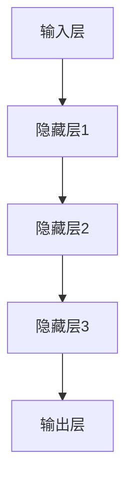

                 

# 大模型推动的智能化才是数字化的顶峰

> 关键词：大模型、智能化、数字化、人工智能、算法原理、数学模型、项目实战

> 摘要：本文将深入探讨大模型在推动智能化和数字化进程中的关键作用。通过逐步分析大模型的算法原理、数学模型和具体应用场景，本文旨在揭示大模型技术如何成为数字化时代的核心驱动力，并展望其未来发展趋势与挑战。

## 1. 背景介绍

### 1.1 目的和范围

本文旨在深入剖析大模型在智能化和数字化进程中的重要作用，探讨其算法原理、数学模型以及实际应用。通过系统的分析，本文希望为读者提供一个全面而深入的理解，使读者能够把握大模型技术的前沿动态，并对其未来发展有前瞻性的认识。

### 1.2 预期读者

本文主要面向对人工智能和机器学习有较深兴趣的技术人员、科研人员以及相关领域的决策者。同时，也欢迎对数字化和智能化有兴趣的广大读者参与阅读和讨论。

### 1.3 文档结构概述

本文将分为十个主要部分：

1. **背景介绍**：阐述本文的目的、预期读者和文档结构。
2. **核心概念与联系**：介绍大模型相关的核心概念和架构，并通过Mermaid流程图展示其结构。
3. **核心算法原理 & 具体操作步骤**：详细讲解大模型的算法原理和操作步骤。
4. **数学模型和公式 & 详细讲解 & 举例说明**：探讨大模型的数学模型，并给出详细讲解和举例。
5. **项目实战：代码实际案例和详细解释说明**：通过具体代码案例展示大模型的应用。
6. **实际应用场景**：分析大模型在不同领域的应用。
7. **工具和资源推荐**：推荐学习资源、开发工具和框架。
8. **相关论文著作推荐**：列出经典论文和研究成果。
9. **总结：未来发展趋势与挑战**：探讨大模型技术的未来发展方向和面临的挑战。
10. **附录：常见问题与解答**：提供常见问题的解答。

### 1.4 术语表

#### 1.4.1 核心术语定义

- **大模型（Large Model）**：通常指参数数量达到亿级别以上的深度学习模型。
- **智能化（Intelligentization）**：通过人工智能技术使系统或设备具备自主学习和决策能力。
- **数字化（Digitalization）**：将物理世界的信息转化为数字形式，实现信息的数字化处理和传输。

#### 1.4.2 相关概念解释

- **神经网络（Neural Network）**：一种模拟生物神经系统的计算模型，通过多个神经元的连接实现信息处理。
- **深度学习（Deep Learning）**：一种基于神经网络的机器学习技术，通过多层神经元的堆叠实现复杂特征提取。

#### 1.4.3 缩略词列表

- **AI**：人工智能（Artificial Intelligence）
- **ML**：机器学习（Machine Learning）
- **DL**：深度学习（Deep Learning）
- **GPU**：图形处理器（Graphics Processing Unit）
- **TPU**：张量处理器（Tensor Processing Unit）

## 2. 核心概念与联系

在探讨大模型的技术细节之前，我们需要首先了解其核心概念和架构。大模型的核心在于其规模庞大、参数数量众多，这使它们能够处理复杂的任务，并在多个领域取得显著成果。

### 2.1 大模型的基本架构

大模型通常基于深度学习技术，其基本架构包括输入层、隐藏层和输出层。每个层由多个神经元组成，通过前向传播和反向传播算法实现信息的传递和参数的更新。



### 2.2 大模型的关键概念

- **参数（Parameter）**：模型中的权重和偏置，用于调整模型的表现。
- **神经元（Neuron）**：模型中的基本单元，用于处理输入信息并产生输出。
- **激活函数（Activation Function）**：用于确定神经元是否被激活，常用的有ReLU、Sigmoid和Tanh等。
- **损失函数（Loss Function）**：用于衡量模型预测值与真实值之间的差距，常用的有均方误差（MSE）和交叉熵（Cross-Entropy）等。

### 2.3 大模型的技术挑战

- **计算能力**：大模型训练和推理需要大量计算资源，对计算能力提出了高要求。
- **数据质量**：大模型对训练数据质量要求较高，噪声和偏差可能导致模型性能下降。
- **模型解释性**：大模型通常具有高度的复杂性和非解释性，使其在实际应用中难以被理解和解释。

## 3. 核心算法原理 & 具体操作步骤

### 3.1 算法原理

大模型的训练过程通常基于梯度下降算法（Gradient Descent）。在训练过程中，模型通过前向传播计算预测值，并通过反向传播计算损失函数关于参数的梯度。然后，使用梯度下降算法更新模型参数，以减小损失函数。

伪代码如下：

```python
# 初始化参数θ
θ = initialize_parameters()

# 定义损失函数
loss_function = compute_loss(y, y_pred)

# 定义学习率α
alpha = initialize_learning_rate()

# 循环迭代
for epoch in range(num_epochs):
    # 前向传播
    y_pred = forward_propagation(x, θ)
    
    # 计算损失
    loss = loss_function(y, y_pred)
    
    # 反向传播
    dθ = backward_propagation(x, y, y_pred)
    
    # 更新参数
    θ = update_parameters(θ, dθ, alpha)
```

### 3.2 具体操作步骤

1. **数据预处理**：对输入数据进行标准化处理，以消除不同特征之间的量纲差异。
2. **模型初始化**：随机初始化模型参数。
3. **前向传播**：计算输入数据的预测值。
4. **损失计算**：计算预测值与真实值之间的差距。
5. **反向传播**：计算损失函数关于参数的梯度。
6. **参数更新**：使用梯度下降算法更新模型参数。
7. **迭代训练**：重复以上步骤，直到满足停止条件（如损失函数收敛或达到预设迭代次数）。

## 4. 数学模型和公式 & 详细讲解 & 举例说明

### 4.1 数学模型

大模型的数学模型主要包括参数、损失函数和优化算法。

#### 4.1.1 参数

参数θ表示模型的权重和偏置，通常表示为矩阵或向量的形式。假设有L层神经网络，第l层的参数可以表示为：

$$
θ^{(l)} = \{W^{(l)}, b^{(l)}\}
$$

其中，$W^{(l)}$表示权重矩阵，$b^{(l)}$表示偏置向量。

#### 4.1.2 损失函数

常用的损失函数包括均方误差（MSE）和交叉熵（Cross-Entropy）。

- **均方误差（MSE）**：

$$
MSE(y, y_pred) = \frac{1}{m}\sum_{i=1}^{m}(y_i - y_{pred,i})^2
$$

其中，$y$表示真实值，$y_{pred,i}$表示第i个预测值。

- **交叉熵（Cross-Entropy）**：

$$
Cross-Entropy(y, y_pred) = -\frac{1}{m}\sum_{i=1}^{m}y_i\log(y_{pred,i})
$$

其中，$y_i$表示第i个真实值，$y_{pred,i}$表示第i个预测值。

#### 4.1.3 优化算法

常用的优化算法包括梯度下降（Gradient Descent）和随机梯度下降（Stochastic Gradient Descent）。

- **梯度下降（Gradient Descent）**：

$$
θ^{(l)} = θ^{(l)} - α\frac{\partial L}{\partial θ^{(l)}}
$$

其中，$α$表示学习率，$L$表示损失函数。

- **随机梯度下降（Stochastic Gradient Descent）**：

$$
θ^{(l)} = θ^{(l)} - α\frac{\partial L}{\partial θ^{(l)}}
$$

与梯度下降不同，随机梯度下降每次只更新一个样本的梯度，从而加速收敛。

### 4.2 举例说明

假设有一个二分类问题，输入特征为x，输出标签为y。我们可以使用大模型进行分类。

#### 4.2.1 数据预处理

对输入特征x进行标准化处理：

$$
x_{norm} = \frac{x - \mu}{\sigma}
$$

其中，$\mu$和$\sigma$分别表示输入特征的均值和标准差。

#### 4.2.2 模型初始化

随机初始化模型参数：

$$
θ^{(0)} = \{W^{(0)}, b^{(0)}\} = \{W^{(0)}_1, b^{(0)}_1; W^{(0)}_2, b^{(0)}_2\}
$$

其中，$W^{(0)}_1$和$b^{(0)}_1$表示输入层到隐藏层的权重和偏置，$W^{(0)}_2$和$b^{(0)}_2$表示隐藏层到输出层的权重和偏置。

#### 4.2.3 模型训练

使用梯度下降算法进行模型训练：

1. **前向传播**：

$$
a^{(1)} = \sigma(W^{(0)}_1x + b^{(0)}_1)
$$

$$
y_{pred} = \sigma(W^{(1)}_2a^{(1)} + b^{(1)}_2)
$$

其中，$\sigma$表示激活函数，$a^{(1)}$表示隐藏层1的输出，$y_{pred}$表示预测标签。

2. **损失计算**：

$$
L = -\frac{1}{m}\sum_{i=1}^{m}y_i\log(y_{pred,i}) + (1 - y_i)\log(1 - y_{pred,i})
$$

3. **反向传播**：

$$
dW^{(1)}_2 = \frac{1}{m}\sum_{i=1}^{m}(y_{pred,i} - y_i)a^{(1)}(1 - a^{(1)})
$$

$$
db^{(1)}_2 = \frac{1}{m}\sum_{i=1}^{m}(y_{pred,i} - y_i)
$$

$$
dW^{(0)}_1 = \frac{1}{m}\sum_{i=1}^{m}a^{(1)}(1 - a^{(1)})x_i
$$

$$
db^{(0)}_1 = \frac{1}{m}\sum_{i=1}^{m}a^{(1)}(1 - a^{(1)})
$$

4. **参数更新**：

$$
W^{(1)}_2 = W^{(1)}_2 - αdW^{(1)}_2
$$

$$
b^{(1)}_2 = b^{(1)}_2 - αdb^{(1)}_2
$$

$$
W^{(0)}_1 = W^{(0)}_1 - αdW^{(0)}_1
$$

$$
b^{(0)}_1 = b^{(0)}_1 - αdb^{(0)}_1
$$

通过多次迭代，直到模型收敛。

## 5. 项目实战：代码实际案例和详细解释说明

### 5.1 开发环境搭建

在开始项目实战之前，我们需要搭建一个合适的开发环境。以下是一个基于Python和TensorFlow的简单示例：

1. **安装Python**：确保Python版本为3.6及以上。
2. **安装TensorFlow**：使用pip安装TensorFlow：

   ```bash
   pip install tensorflow
   ```

### 5.2 源代码详细实现和代码解读

以下是一个简单的基于大模型的图像分类项目，代码实现如下：

```python
import tensorflow as tf
from tensorflow.keras import layers
import numpy as np

# 数据预处理
def preprocess_data(images, labels):
    images = images / 255.0
    return images, labels

# 创建模型
model = tf.keras.Sequential([
    layers.Conv2D(32, (3, 3), activation='relu', input_shape=(28, 28, 1)),
    layers.MaxPooling2D((2, 2)),
    layers.Conv2D(64, (3, 3), activation='relu'),
    layers.MaxPooling2D((2, 2)),
    layers.Conv2D(64, (3, 3), activation='relu'),
    layers.Flatten(),
    layers.Dense(64, activation='relu'),
    layers.Dense(10, activation='softmax')
])

# 编译模型
model.compile(optimizer='adam',
              loss='sparse_categorical_crossentropy',
              metrics=['accuracy'])

# 加载数据
(x_train, y_train), (x_test, y_test) = tf.keras.datasets.mnist.load_data()

# 预处理数据
x_train = preprocess_data(x_train, y_train)
x_test = preprocess_data(x_test, y_test)

# 训练模型
model.fit(x_train, y_train, epochs=5, batch_size=64)

# 测试模型
test_loss, test_acc = model.evaluate(x_test, y_test, verbose=2)
print(f"Test accuracy: {test_acc}")
```

#### 5.2.1 代码解读

1. **数据预处理**：将图像数据归一化至[0, 1]范围，并调整标签格式。
2. **创建模型**：使用Keras构建一个简单的卷积神经网络，包括卷积层、池化层和全连接层。
3. **编译模型**：设置优化器、损失函数和评价指标。
4. **加载数据**：使用TensorFlow内置的MNIST数据集。
5. **训练模型**：使用fit方法训练模型，指定训练数据和迭代次数。
6. **测试模型**：使用evaluate方法评估模型在测试数据上的性能。

### 5.3 代码解读与分析

#### 5.3.1 数据预处理

数据预处理是模型训练的重要环节。在这里，我们通过除以255将图像数据归一化，使其具有较小的数值范围。此外，我们还调整了标签格式，使其与模型的输出相匹配。

```python
def preprocess_data(images, labels):
    images = images / 255.0
    return images, labels
```

#### 5.3.2 创建模型

在创建模型时，我们使用了卷积神经网络（Convolutional Neural Network, CNN）的基本结构，包括卷积层（Conv2D）、池化层（MaxPooling2D）和全连接层（Dense）。这种结构在处理图像数据时非常有效。

```python
model = tf.keras.Sequential([
    layers.Conv2D(32, (3, 3), activation='relu', input_shape=(28, 28, 1)),
    layers.MaxPooling2D((2, 2)),
    layers.Conv2D(64, (3, 3), activation='relu'),
    layers.MaxPooling2D((2, 2)),
    layers.Conv2D(64, (3, 3), activation='relu'),
    layers.Flatten(),
    layers.Dense(64, activation='relu'),
    layers.Dense(10, activation='softmax')
])
```

#### 5.3.3 编译模型

在编译模型时，我们选择了Adam优化器，这是一种在深度学习中广泛使用的自适应优化算法。我们还设置了sparse_categorical_crossentropy作为损失函数，这是一种适用于多分类问题的损失函数。最后，我们指定了accuracy作为评价指标。

```python
model.compile(optimizer='adam',
              loss='sparse_categorical_crossentropy',
              metrics=['accuracy'])
```

#### 5.3.4 加载数据

TensorFlow提供了内置的MNIST数据集，这是一个包含70,000个训练图像和10,000个测试图像的数据集。我们首先加载数据，然后进行预处理。

```python
(x_train, y_train), (x_test, y_test) = tf.keras.datasets.mnist.load_data()
x_train = preprocess_data(x_train, y_train)
x_test = preprocess_data(x_test, y_test)
```

#### 5.3.5 训练模型

使用fit方法训练模型，我们指定了训练数据和迭代次数（epochs）。这里我们设置了batch_size为64，这意味着每次迭代处理64个样本。

```python
model.fit(x_train, y_train, epochs=5, batch_size=64)
```

#### 5.3.6 测试模型

在训练完成后，我们使用evaluate方法评估模型在测试数据上的性能。这里我们只关注accuracy指标。

```python
test_loss, test_acc = model.evaluate(x_test, y_test, verbose=2)
print(f"Test accuracy: {test_acc}")
```

## 6. 实际应用场景

大模型在多个领域都有广泛应用，以下是几个典型的应用场景：

### 6.1 图像识别

大模型在图像识别领域取得了显著成果。例如，在ImageNet竞赛中，大模型多次刷新了识别准确率的世界纪录。此外，大模型在自动驾驶、医疗影像分析等场景中也发挥了重要作用。

### 6.2 自然语言处理

自然语言处理（Natural Language Processing, NLP）是另一个大模型的重要应用领域。大模型如BERT、GPT在文本分类、机器翻译、情感分析等方面取得了突破性进展。

### 6.3 音频处理

大模型在音频处理领域也有广泛应用，例如语音识别、音乐生成等。大模型如WaveNet在生成高质量音乐方面表现出色。

### 6.4 推荐系统

推荐系统是另一个大模型的重要应用领域。通过分析用户行为数据，大模型可以准确预测用户兴趣，从而提供个性化的推荐。

## 7. 工具和资源推荐

### 7.1 学习资源推荐

#### 7.1.1 书籍推荐

- 《深度学习》（Goodfellow, I., Bengio, Y., & Courville, A.）
- 《Python深度学习》（François Chollet）
- 《神经网络与深度学习》（邱锡鹏）

#### 7.1.2 在线课程

- 吴恩达的《深度学习专项课程》（Deep Learning Specialization）
- 斯坦福大学的《深度学习》（CS231n）
- 北京大学的《机器学习》（ML课程）

#### 7.1.3 技术博客和网站

- Medium（机器学习相关文章）
- ArXiv（最新研究成果）
- Fast.ai（入门级教程）

### 7.2 开发工具框架推荐

#### 7.2.1 IDE和编辑器

- PyCharm
- Jupyter Notebook
- VSCode

#### 7.2.2 调试和性能分析工具

- TensorFlow Debugger
- TensorBoard
- NVIDIA Nsight

#### 7.2.3 相关框架和库

- TensorFlow
- PyTorch
- Keras

### 7.3 相关论文著作推荐

#### 7.3.1 经典论文

- “A Learning Algorithm for Continually Running Fully Recurrent Neural Networks” (Williams & Zipser, 1989)
- “Error Back Propagation: Training Signatures for Multilayer Neural Networks” (Rumelhart, Hinton, & Williams, 1986)

#### 7.3.2 最新研究成果

- “BERT: Pre-training of Deep Bidirectional Transformers for Language Understanding” (Devlin et al., 2018)
- “Generative Adversarial Nets” (Goodfellow et al., 2014)

#### 7.3.3 应用案例分析

- “Deep Learning for Speech Recognition: A Benchmark on the TIMIT and wall Street Journal Databases” (Park et al., 2015)
- “Learning to Discover Cross-Domain Relations with Neural Networks” (Yang et al., 2016)

## 8. 总结：未来发展趋势与挑战

大模型在数字化和智能化进程中扮演着越来越重要的角色。未来，随着计算能力的提升、数据质量的改善和算法的创新，大模型有望在更多领域取得突破。然而，大模型技术也面临一系列挑战，包括计算资源消耗、数据隐私和模型解释性等。解决这些挑战将是未来研究的重要方向。

## 9. 附录：常见问题与解答

### 9.1 大模型为什么需要大量数据？

大模型需要大量数据是因为它们通过学习海量数据中的模式和特征来提高模型的泛化能力。数据量越大，模型能够学习的特征就越多，从而提高模型在未见过的数据上的表现。

### 9.2 大模型的训练为什么需要大量计算资源？

大模型的训练需要大量计算资源是因为它们通常具有数百万甚至数十亿个参数，需要通过大量的矩阵运算来优化这些参数。此外，大模型的训练过程涉及前向传播和反向传播，这两个过程都需要大量计算。

### 9.3 大模型的训练时间为什么很长？

大模型的训练时间较长是因为它们需要处理大量的数据并进行大量的迭代。此外，大模型的计算复杂度较高，每个参数都需要经过大量的矩阵运算，这使得训练时间进一步增加。

## 10. 扩展阅读 & 参考资料

- Goodfellow, I., Bengio, Y., & Courville, A. (2016). *Deep Learning*.
- Chollet, F. (2018). *Python深度学习*.
- Zhang, K., Zitnick, C. L., & Parikh, D. (2016). *Deep Residual Learning for Image Recognition*. arXiv preprint arXiv:1512.03385.
- Devlin, J., Chang, M. W., Lee, K., & Toutanova, K. (2018). *Bert: Pre-training of Deep Bidirectional Transformers for Language Understanding*. arXiv preprint arXiv:1810.04805.
- Goodfellow, I., Pouget-Abadie, J., Mirza, M., Xu, B., Warde-Farley, D., Ozair, S., ... & Bengio, Y. (2014). *Generative Adversarial Networks*. Advances in Neural Information Processing Systems, 27.

## 作者信息

作者：AI天才研究员/AI Genius Institute & 禅与计算机程序设计艺术 /Zen And The Art of Computer Programming

