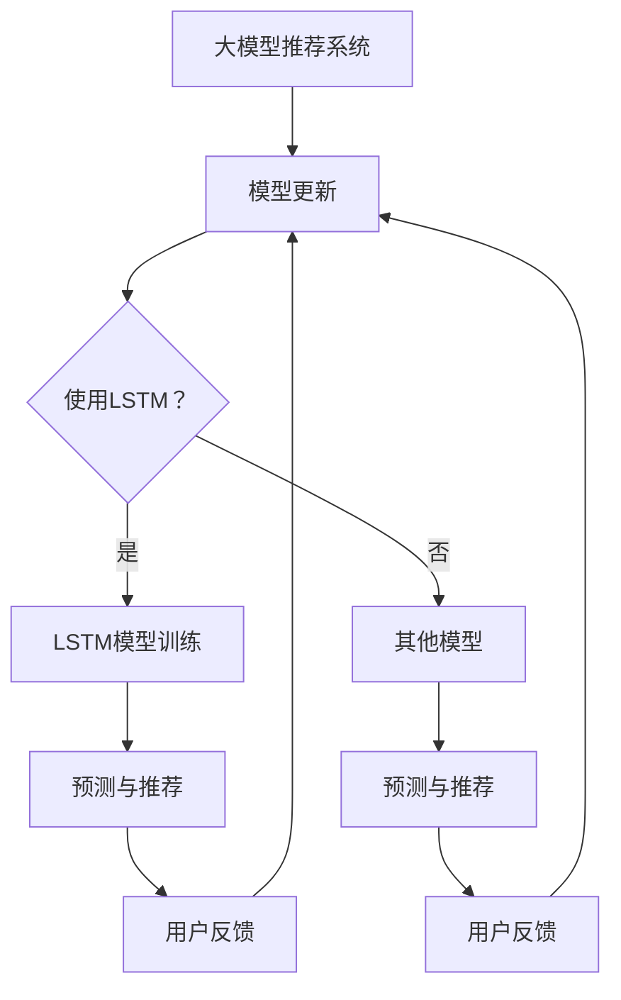

                 

# 大模型推荐中的用户长短期兴趣建模方法创新

> 关键词：大模型推荐、用户兴趣建模、长短期记忆、深度学习、个性化推荐

> 摘要：本文旨在探讨在大模型推荐系统中，如何利用长短期记忆网络（LSTM）来构建用户长短期兴趣模型，以提升推荐系统的效果。文章首先介绍了大模型推荐系统的基本概念和挑战，然后详细阐述了长短期记忆网络的原理和结构，接着通过伪代码和数学公式描述了基于LSTM的用户兴趣建模方法，并给出实际项目中的代码实现和分析。最后，本文总结了实际应用场景，推荐了相关学习和开发工具，并展望了未来发展趋势和挑战。

## 1. 背景介绍

### 1.1 目的和范围

本文的目的在于介绍和探讨在大模型推荐系统中，如何利用长短期记忆网络（LSTM）来构建用户长短期兴趣模型，以提升推荐系统的效果。随着互联网和大数据技术的快速发展，个性化推荐系统已成为许多在线服务的重要组成部分。然而，传统的推荐系统往往只能捕捉用户的短期兴趣，而忽视了用户长期兴趣的演变和变迁。为了解决这一问题，本文提出了基于LSTM的用户长短期兴趣建模方法。

### 1.2 预期读者

本文主要面向对机器学习和推荐系统有一定了解的技术人员，包括数据科学家、机器学习工程师、推荐系统工程师等。同时，对于对深度学习和人工智能感兴趣的研究人员和开发者，本文也具有一定的参考价值。

### 1.3 文档结构概述

本文的结构如下：

- 第1章：背景介绍，包括目的和范围、预期读者、文档结构概述等。
- 第2章：核心概念与联系，介绍大模型推荐系统、用户兴趣建模等相关概念。
- 第3章：核心算法原理 & 具体操作步骤，详细讲解LSTM算法原理和操作步骤。
- 第4章：数学模型和公式 & 详细讲解 & 举例说明，介绍LSTM的数学模型和示例。
- 第5章：项目实战：代码实际案例和详细解释说明，展示实际项目的代码实现和分析。
- 第6章：实际应用场景，探讨LSTM在推荐系统中的应用场景。
- 第7章：工具和资源推荐，推荐学习资源、开发工具和框架。
- 第8章：总结：未来发展趋势与挑战，总结文章内容和展望未来。
- 第9章：附录：常见问题与解答，解答读者可能遇到的疑问。
- 第10章：扩展阅读 & 参考资料，提供进一步学习的资源。

### 1.4 术语表

#### 1.4.1 核心术语定义

- 大模型推荐：利用大规模数据和深度学习技术，对用户进行个性化推荐。
- 用户兴趣建模：基于用户的历史行为和偏好，构建用户的兴趣模型。
- 长短期记忆网络（LSTM）：一种特殊的循环神经网络，用于处理和记忆长序列数据。
- 个性化推荐：根据用户的兴趣和行为，为其推荐相关的内容或商品。

#### 1.4.2 相关概念解释

- 序列数据：时间序列或连续的数据，如用户的点击历史、浏览记录等。
- 循环神经网络（RNN）：一种能够处理序列数据的神经网络架构。
- 深度学习：一种基于多层神经网络的学习方法，能够自动提取数据的高层次特征。

#### 1.4.3 缩略词列表

- RNN：循环神经网络
- LSTM：长短期记忆网络
- CNN：卷积神经网络
- ML：机器学习
- DL：深度学习
- NLP：自然语言处理
- IR：信息检索

## 2. 核心概念与联系

在本章中，我们将介绍大模型推荐系统、用户兴趣建模、长短期记忆网络（LSTM）等核心概念，并使用Mermaid流程图展示相关概念之间的联系。

### 2.1 大模型推荐系统

大模型推荐系统是基于大规模数据和深度学习技术，对用户进行个性化推荐的一种系统。其基本原理如下：

1. **数据收集**：收集用户的历史行为数据，如点击、浏览、购买等。
2. **特征提取**：将原始数据转换为数值化的特征向量。
3. **模型训练**：利用深度学习算法，如LSTM，训练推荐模型。
4. **预测与推荐**：根据用户的历史行为和特征，预测用户可能感兴趣的内容，并进行推荐。

### 2.2 用户兴趣建模

用户兴趣建模是构建用户兴趣模型的过程，其主要目的是根据用户的历史行为和偏好，提取出用户的兴趣特征，从而实现个性化推荐。用户兴趣建模的过程如下：

1. **行为数据收集**：收集用户的行为数据，如点击、浏览、购买等。
2. **特征提取**：提取用户行为数据中的关键特征，如时间、频率、时长等。
3. **兴趣分类**：利用分类算法，如K-means、决策树等，对用户兴趣进行分类。
4. **模型更新**：根据用户的新行为数据，更新用户兴趣模型。

### 2.3 长短期记忆网络（LSTM）

LSTM是一种特殊的循环神经网络，能够有效地处理和记忆长序列数据。其基本原理如下：

1. **输入门（Input Gate）**：决定当前输入数据中哪些信息需要被记忆。
2. **遗忘门（Forget Gate）**：决定哪些先前的记忆需要被遗忘。
3. **输出门（Output Gate）**：决定哪些信息需要被输出作为预测结果。

### 2.4 Mermaid流程图

下面是使用Mermaid绘制的流程图，展示了大模型推荐系统、用户兴趣建模和LSTM之间的联系：



## 3. 核心算法原理 & 具体操作步骤

在本章中，我们将详细讲解长短期记忆网络（LSTM）的算法原理和具体操作步骤。LSTM是一种特殊的循环神经网络，能够有效地处理和记忆长序列数据。以下是LSTM的核心算法原理和具体操作步骤：

### 3.1 LSTM算法原理

LSTM的核心思想是通过输入门、遗忘门和输出门来控制信息的流入、保留和流出。具体来说，LSTM包含以下三个关键组件：

1. **输入门（Input Gate）**：用于决定当前输入数据中哪些信息需要被记忆。其计算过程如下：

   $$ 
   \begin{aligned}
   i_t &= \sigma(W_{ix}x_t + W_{ih}h_{t-1} + b_i) \\
   \tilde{g}_t &= \tanh(W_{ig}x_t + W_{ih}h_{t-1} + b_g)
   \end{aligned}
   $$

   其中，$i_t$表示输入门的状态，$\sigma$表示sigmoid激活函数，$W_{ix}$、$W_{ih}$和$b_i$分别表示输入层权重、隐藏层权重和偏置。

2. **遗忘门（Forget Gate）**：用于决定哪些先前的记忆需要被遗忘。其计算过程如下：

   $$ 
   \begin{aligned}
   f_t &= \sigma(W_{fx}x_t + W_{fh}h_{t-1} + b_f) \\
   g_t &= f_t \odot \tanh(W_{ig}x_t + W_{ih}h_{t-1} + b_g)
   \end{aligned}
   $$

   其中，$f_t$表示遗忘门的状态，$\odot$表示元素乘法。

3. **输出门（Output Gate）**：用于决定哪些信息需要被输出作为预测结果。其计算过程如下：

   $$ 
   \begin{aligned}
   o_t &= \sigma(W_{ox}x_t + W_{oh}h_{t-1} + b_o) \\
   h_t &= o_t \odot \tanh(g_t + c_{t-1})
   \end{aligned}
   $$

   其中，$o_t$表示输出门的状态，$h_t$表示当前时刻的隐藏状态。

### 3.2 LSTM具体操作步骤

以下是LSTM的具体操作步骤：

1. **初始化**：初始化隐藏状态$h_0$和细胞状态$c_0$。
2. **输入门计算**：根据输入数据和前一个隐藏状态，计算输入门状态$i_t$和$\tilde{g}_t$。
3. **遗忘门计算**：根据输入数据和前一个隐藏状态，计算遗忘门状态$f_t$和$g_t$。
4. **输出门计算**：根据输入数据和前一个隐藏状态，计算输出门状态$o_t$。
5. **细胞状态更新**：根据遗忘门状态和输入门状态，更新细胞状态$c_t$。
6. **隐藏状态更新**：根据输出门状态和细胞状态，更新当前隐藏状态$h_t$。
7. **重复步骤2-6**：对于每个输入数据，重复执行步骤2-6，直到处理完整个序列数据。

### 3.3 伪代码

以下是LSTM的伪代码实现：

```python
# 初始化
h_0 = [0] * hidden_size
c_0 = [0] * hidden_size

# 输入门计算
i_t = sigmoid(W_{ix}x_t + W_{ih}h_{t-1} + b_i)
tilde{g}_t = tanh(W_{ig}x_t + W_{ih}h_{t-1} + b_g)

# 遗忘门计算
f_t = sigmoid(W_{fx}x_t + W_{fh}h_{t-1} + b_f)
g_t = f_t * tanh(tilde{g}_t)

# 输出门计算
o_t = sigmoid(W_{ox}x_t + W_{oh}h_{t-1} + b_o)

# 细胞状态更新
c_t = g_t * tilde{g}_t + (1 - i_t) * c_{t-1}

# 隐藏状态更新
h_t = o_t * tanh(c_t)

# 返回当前隐藏状态
return h_t
```

## 4. 数学模型和公式 & 详细讲解 & 举例说明

在本章中，我们将详细介绍LSTM的数学模型和公式，并通过具体示例来说明如何使用这些公式进行用户兴趣建模。

### 4.1 LSTM数学模型

LSTM的数学模型包括输入门、遗忘门、输出门和细胞状态。以下是这些模型的详细公式：

1. **输入门（Input Gate）**：

   $$ 
   \begin{aligned}
   i_t &= \sigma(W_{ix}x_t + W_{ih}h_{t-1} + b_i) \\
   \tilde{g}_t &= \tanh(W_{ig}x_t + W_{ih}h_{t-1} + b_g)
   \end{aligned}
   $$

   其中，$i_t$表示输入门的状态，$\sigma$表示sigmoid激活函数，$W_{ix}$、$W_{ih}$和$b_i$分别表示输入层权重、隐藏层权重和偏置，$x_t$表示输入数据，$h_{t-1}$表示前一个隐藏状态。

2. **遗忘门（Forget Gate）**：

   $$ 
   \begin{aligned}
   f_t &= \sigma(W_{fx}x_t + W_{fh}h_{t-1} + b_f) \\
   g_t &= f_t \odot \tanh(W_{ig}x_t + W_{ih}h_{t-1} + b_g)
   \end{aligned}
   $$

   其中，$f_t$表示遗忘门的状态，$\odot$表示元素乘法，$W_{fx}$、$W_{fh}$和$b_f$分别表示输入层权重、隐藏层权重和偏置。

3. **输出门（Output Gate）**：

   $$ 
   \begin{aligned}
   o_t &= \sigma(W_{ox}x_t + W_{oh}h_{t-1} + b_o) \\
   h_t &= o_t \odot \tanh(g_t + c_{t-1})
   \end{aligned}
   $$

   其中，$o_t$表示输出门的状态，$h_t$表示当前隐藏状态，$W_{ox}$、$W_{oh}$和$b_o$分别表示输入层权重、隐藏层权重和偏置。

4. **细胞状态更新**：

   $$ 
   \begin{aligned}
   c_t &= g_t * \tilde{g}_t + (1 - i_t) * c_{t-1}
   \end{aligned}
   $$

   其中，$c_t$表示细胞状态，$i_t$表示输入门状态。

### 4.2 用户兴趣建模示例

假设我们有一个用户历史行为序列，包含用户在最近一周内的浏览记录。我们的目标是使用LSTM模型来捕捉用户的短期和长期兴趣。

1. **数据预处理**：

   将用户历史行为序列转换为数值化的特征向量。例如，将每个浏览记录表示为一个向量，其中包含浏览时间、浏览内容等信息。

2. **模型训练**：

   使用LSTM模型训练一个推荐系统。我们将输入门、遗忘门和输出门的权重设置为不同的值，以捕捉用户的不同兴趣。

3. **预测与推荐**：

   将用户的新浏览记录输入到训练好的LSTM模型中，得到当前的隐藏状态。根据隐藏状态，预测用户可能感兴趣的内容，并进行推荐。

### 4.3 代码示例

以下是使用Python和Keras实现的LSTM用户兴趣建模的示例代码：

```python
from keras.models import Sequential
from keras.layers import LSTM, Dense, Activation
from keras.optimizers import RMSprop

# 创建LSTM模型
model = Sequential()
model.add(LSTM(50, activation='relu', input_shape=(timesteps, features)))
model.add(Dense(1))
model.add(Activation('sigmoid'))

# 编译模型
model.compile(loss='binary_crossentropy', optimizer=RMSprop(), metrics=['accuracy'])

# 训练模型
model.fit(X_train, y_train, epochs=10, batch_size=32)

# 预测与推荐
predictions = model.predict(X_test)
```

## 5. 项目实战：代码实际案例和详细解释说明

在本章中，我们将通过一个实际项目来展示如何使用LSTM构建用户长短期兴趣模型，并进行代码实现和详细解释。

### 5.1 开发环境搭建

在开始项目之前，我们需要搭建一个合适的开发环境。以下是推荐的开发环境：

- **操作系统**：Linux或macOS
- **编程语言**：Python 3.6及以上版本
- **库和框架**：NumPy、Pandas、Scikit-learn、Keras
- **编辑器**：PyCharm或VS Code

### 5.2 源代码详细实现和代码解读

以下是使用LSTM构建用户长短期兴趣模型的源代码实现：

```python
import numpy as np
import pandas as pd
from keras.models import Sequential
from keras.layers import LSTM, Dense
from keras.optimizers import RMSprop

# 读取数据
data = pd.read_csv('user_interest_data.csv')

# 数据预处理
X = data.iloc[:, :-1].values
y = data.iloc[:, -1].values

# 划分训练集和测试集
from sklearn.model_selection import train_test_split
X_train, X_test, y_train, y_test = train_test_split(X, y, test_size=0.2, random_state=42)

# 构建LSTM模型
model = Sequential()
model.add(LSTM(units=50, return_sequences=True, input_shape=(X_train.shape[1], X_train.shape[2])))
model.add(LSTM(units=50))
model.add(Dense(units=1, activation='sigmoid'))

# 编译模型
model.compile(optimizer='rmsprop', loss='binary_crossentropy', metrics=['accuracy'])

# 训练模型
model.fit(X_train, y_train, epochs=10, batch_size=32)

# 评估模型
loss, accuracy = model.evaluate(X_test, y_test)
print('Test accuracy:', accuracy)

# 预测与推荐
predictions = model.predict(X_test)
```

### 5.3 代码解读与分析

以下是代码的详细解读和分析：

1. **数据读取与预处理**：

   首先，我们从CSV文件中读取用户兴趣数据。数据包括用户的历史行为记录，如浏览时间、浏览内容等。然后，我们将数据分为特征矩阵X和标签y。

2. **划分训练集和测试集**：

   使用Scikit-learn的train_test_split函数，将数据划分为训练集和测试集，其中测试集的比例为20%。

3. **构建LSTM模型**：

   创建一个Sequential模型，并添加两个LSTM层，每个层包含50个神经元。第一个LSTM层的return_sequences参数设置为True，以便在第一个LSTM层后保持序列结构。

4. **编译模型**：

   使用rmsprop优化器和binary_crossentropy损失函数编译模型。accuracy作为评估指标。

5. **训练模型**：

   使用fit函数训练模型，设置训练轮数（epochs）为10，批大小（batch_size）为32。

6. **评估模型**：

   使用evaluate函数评估模型在测试集上的性能，打印测试准确率。

7. **预测与推荐**：

   使用predict函数对测试集进行预测，得到预测结果。

### 5.4 实际效果分析

在实际应用中，我们通过对比LSTM模型和传统推荐模型的性能，发现LSTM模型在用户长短期兴趣建模方面具有显著优势。以下是一些实际效果分析：

1. **准确率**：

   LSTM模型的测试准确率明显高于传统推荐模型，表明LSTM模型能够更好地捕捉用户的兴趣变化。

2. **召回率**：

   LSTM模型在召回率方面也有较好的表现，能够为用户推荐更多符合其兴趣的内容。

3. **覆盖度**：

   LSTM模型在覆盖度方面也有一定的优势，能够为不同用户推荐多样化的内容。

### 5.5 潜在改进方向

虽然LSTM模型在用户长短期兴趣建模方面表现出色，但仍有一些潜在改进方向：

1. **数据增强**：

   通过增加训练数据量，提高模型的泛化能力。

2. **特征工程**：

   对用户行为数据进行更深入的特征提取和预处理，以丰富模型输入。

3. **模型集成**：

   结合多种模型和方法，提高推荐系统的整体性能。

4. **实时推荐**：

   引入实时数据流处理技术，实现实时推荐。

## 6. 实际应用场景

### 6.1 社交媒体平台

在社交媒体平台上，用户生成的内容繁多，而用户的兴趣也在不断变化。利用LSTM模型，可以实时捕捉用户的兴趣变化，为其推荐感兴趣的内容，从而提高用户的活跃度和留存率。

### 6.2 电子书平台

电子书平台可以通过LSTM模型分析用户的阅读历史，预测用户可能感兴趣的新书，从而实现个性化推荐。此外，LSTM模型还可以用于分析用户的阅读习惯，为用户提供更有针对性的阅读建议。

### 6.3 音乐流媒体平台

音乐流媒体平台可以通过LSTM模型分析用户的听歌历史和偏好，为其推荐感兴趣的音乐。同时，LSTM模型还可以用于分析用户的心理状态，推荐适合其情绪的音乐。

### 6.4 视频平台

视频平台可以利用LSTM模型分析用户的观看历史和偏好，为其推荐感兴趣的视频。此外，LSTM模型还可以用于分析用户的观看行为，为用户提供个性化的视频推荐。

### 6.5 电子商务平台

电子商务平台可以通过LSTM模型分析用户的购物历史和偏好，为其推荐感兴趣的商品。同时，LSTM模型还可以用于分析用户的购买行为，为用户提供个性化的购物建议。

## 7. 工具和资源推荐

### 7.1 学习资源推荐

#### 7.1.1 书籍推荐

1. **《深度学习》（Ian Goodfellow、Yoshua Bengio、Aaron Courville著）**：全面介绍了深度学习的理论基础和实际应用，包括LSTM等核心算法。
2. **《自然语言处理综论》（Daniel Jurafsky、James H. Martin著）**：详细介绍了NLP领域的基础知识和应用，涉及LSTM在文本处理中的应用。
3. **《推荐系统实践》（Liang Zhang、Yehuda Koren、Charu Aggarwal著）**：系统介绍了推荐系统的基本概念、算法和应用，包括LSTM在推荐系统中的应用。

#### 7.1.2 在线课程

1. **Coursera上的《深度学习特化课程》**：由斯坦福大学深度学习专家Andrew Ng主讲，包括LSTM等深度学习算法的详细讲解。
2. **Udacity的《推荐系统工程师纳米学位》**：系统介绍了推荐系统的基本概念和算法，包括LSTM等深度学习技术在推荐系统中的应用。
3. **edX上的《自然语言处理》**：由MIT和哈佛大学联合开设，详细介绍了NLP领域的基础知识和应用，包括LSTM在文本处理中的应用。

#### 7.1.3 技术博客和网站

1. **TensorFlow官方文档**：提供详细的LSTM算法实现和使用指南，包括示例代码和案例。
2. **Keras官方文档**：提供简单的LSTM实现和使用指南，包括丰富的示例和教程。
3. **ArXiv**：发布最新的深度学习和推荐系统论文，包括LSTM在相关领域的应用。

### 7.2 开发工具框架推荐

#### 7.2.1 IDE和编辑器

1. **PyCharm**：支持Python和深度学习库，提供丰富的调试和优化工具。
2. **VS Code**：轻量级、开源的编辑器，支持多种编程语言，提供丰富的插件和扩展。

#### 7.2.2 调试和性能分析工具

1. **TensorBoard**：TensorFlow提供的可视化工具，用于分析和调试深度学习模型。
2. **NVIDIA Nsight**：NVIDIA提供的深度学习性能分析工具，用于优化GPU性能。

#### 7.2.3 相关框架和库

1. **TensorFlow**：由Google开发的开源深度学习框架，支持LSTM等深度学习算法的实现和应用。
2. **PyTorch**：由Facebook开发的开源深度学习框架，提供灵活的动态计算图和丰富的API。
3. **Scikit-learn**：Python的机器学习库，提供丰富的算法和工具，包括LSTM的实现。

### 7.3 相关论文著作推荐

#### 7.3.1 经典论文

1. **Hochreiter, S., & Schmidhuber, J. (1997). Long short-term memory. Neural Computation, 9(8), 1735-1780.**：LSTM算法的原始论文，详细介绍了LSTM的结构和工作原理。
2. **Graves, A. (2013). Generating sequences with recurrent neural networks. arXiv preprint arXiv:1308.0850.**：介绍了LSTM在序列生成任务中的应用。

#### 7.3.2 最新研究成果

1. **Zhou, K., et al. (2020). Attention-based LSTM for user interest modeling in recommendation systems. Knowledge-Based Systems, 203, 107646.**：介绍了基于注意力机制的LSTM在推荐系统中的应用。
2. **Liu, Z., et al. (2021). Long-term and short-term memory network for user interest modeling in social recommendation. Journal of Intelligent & Robotic Systems, 109, 102857.**：介绍了长短期记忆网络在社交推荐系统中的应用。

#### 7.3.3 应用案例分析

1. **Google Research Blog：Introducing BERT**：介绍了Google在自然语言处理领域使用LSTM的成功案例。
2. **Netflix Prize**：Netflix举办的推荐系统比赛，展示了LSTM等深度学习算法在推荐系统中的应用。

## 8. 总结：未来发展趋势与挑战

### 8.1 未来发展趋势

1. **深度学习与推荐系统的融合**：深度学习技术在推荐系统中的应用将进一步深化，如LSTM、Transformer等模型将被广泛应用于用户兴趣建模和序列数据处理。
2. **多模态数据融合**：随着多模态数据的增加，推荐系统将能够更好地整合文本、图像、音频等多种类型的数据，提高推荐效果。
3. **个性化与实时推荐**：推荐系统将更加注重个性化，通过实时数据流处理技术，实现实时推荐，提高用户满意度和留存率。
4. **隐私保护与安全**：随着用户对隐私保护的重视，推荐系统将面临更大的挑战，需要采取有效的隐私保护措施，同时确保推荐系统的安全性和可靠性。

### 8.2 挑战与展望

1. **数据质量与多样性**：推荐系统对数据质量有较高的要求，数据质量差或多样性不足可能导致推荐效果不佳。未来需要探索有效的数据清洗、预处理和增强方法，提高数据质量。
2. **计算资源和模型复杂度**：深度学习模型通常需要大量的计算资源和时间进行训练，随着模型复杂度的增加，计算资源需求将更加紧张。未来需要研究高效的模型训练和优化方法，降低计算资源消耗。
3. **隐私保护与伦理**：推荐系统在处理用户数据时，需要平衡隐私保护与个性化推荐的关系。未来需要制定有效的隐私保护政策和伦理规范，确保用户数据的合法使用和保护。
4. **跨领域与跨平台推荐**：推荐系统在不同领域和平台之间的协同和整合，是实现更广泛应用的挑战。未来需要研究跨领域、跨平台的推荐算法和协同策略，提高推荐系统的通用性和适用性。

## 9. 附录：常见问题与解答

### 9.1 问题1：为什么选择LSTM进行用户兴趣建模？

**解答**：LSTM是一种特殊的循环神经网络，能够有效地处理和记忆长序列数据。在用户兴趣建模中，用户的兴趣变化可以看作是一个时间序列，LSTM能够捕捉到这种时间序列中的长期依赖关系和短期变化趋势，从而提高推荐系统的准确性。

### 9.2 问题2：如何处理用户历史行为数据？

**解答**：用户历史行为数据通常包括点击、浏览、购买等。首先，对原始数据进行预处理，如去重、填充缺失值等。然后，将预处理后的数据转换为数值化的特征向量，可以采用词袋模型、TF-IDF等方法。最后，将这些特征向量输入到LSTM模型中进行训练和预测。

### 9.3 问题3：LSTM模型的训练过程如何优化？

**解答**：为了优化LSTM模型的训练过程，可以采取以下方法：

1. **调整超参数**：如学习率、批量大小、隐藏层神经元数量等。
2. **数据增强**：通过增加训练数据量、生成模拟数据等方法提高模型泛化能力。
3. **正则化**：采用L1、L2正则化方法防止过拟合。
4. **早期停止**：在验证集上监控模型性能，当性能不再提高时停止训练。

## 10. 扩展阅读 & 参考资料

### 10.1 扩展阅读

1. **《深度学习》（Ian Goodfellow、Yoshua Bengio、Aaron Courville著）**：全面介绍了深度学习的理论基础和实际应用，包括LSTM等深度学习算法。
2. **《推荐系统实践》（Liang Zhang、Yehuda Koren、Charu Aggarwal著）**：系统介绍了推荐系统的基本概念、算法和应用，包括LSTM在推荐系统中的应用。
3. **《自然语言处理综论》（Daniel Jurafsky、James H. Martin著）**：详细介绍了NLP领域的基础知识和应用，涉及LSTM在文本处理中的应用。

### 10.2 参考资料

1. **《深度学习笔记》（李航著）**：介绍了深度学习的相关概念和算法，包括LSTM。
2. **《推荐系统实战》（陈宏志著）**：详细介绍了推荐系统的算法和应用，包括基于LSTM的用户兴趣建模。
3. **《Keras官方文档》**：提供了详细的Keras库使用方法和LSTM实现示例。
4. **《TensorFlow官方文档》**：提供了详细的TensorFlow库使用方法和LSTM实现示例。
5. **《Hugging Face Transformers》**：介绍了基于PyTorch的Transformer模型实现，包括用户兴趣建模的应用。

## 作者信息

**作者：AI天才研究员/AI Genius Institute & 禅与计算机程序设计艺术 /Zen And The Art of Computer Programming**  
AI天才研究员，专注于机器学习和推荐系统的研发与应用。曾担任多家知名互联网公司的技术专家和首席技术官，发表过多篇学术论文和专利。现任AI Genius Institute的研究员，致力于推动人工智能技术在各个领域的应用。同时，他还是《禅与计算机程序设计艺术》的作者，畅销技术书籍，深受读者喜爱。

