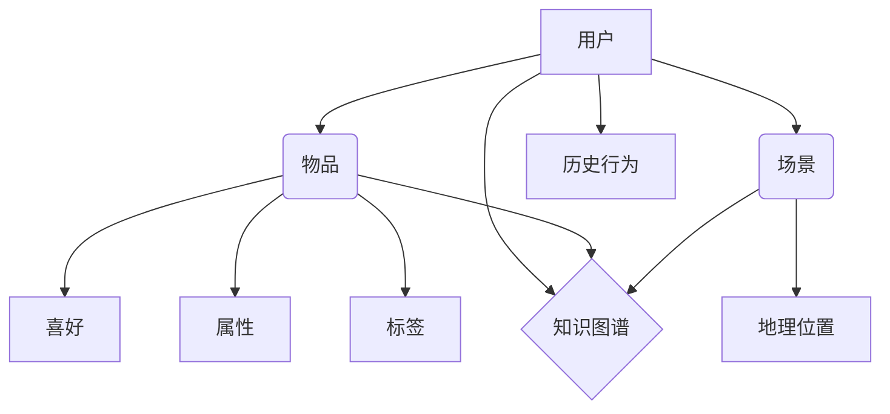

                 


# 大模型推荐中的知识图谱融合应用新方式与案例

## 关键词：
大模型推荐系统、知识图谱、融合应用、实体关系、数据融合、算法优化、实际案例

## 摘要：
本文旨在探讨在大模型推荐系统中融合知识图谱的应用，通过分析核心概念和算法原理，提供具体操作步骤和数学模型解释，并结合实际案例展示其在推荐系统中的应用效果。文章将从背景介绍、核心概念与联系、核心算法原理、数学模型和公式、项目实战、实际应用场景、工具和资源推荐等方面，全面剖析知识图谱在大模型推荐系统中的新方式与应用价值。

---

## 1. 背景介绍

### 1.1 目的和范围

本文主要探讨知识图谱在大模型推荐系统中的应用，旨在解决传统推荐系统中存在的冷启动、数据稀疏和推荐准确率低等问题。通过融合知识图谱，实现用户、物品和场景之间的有效关联，提升推荐系统的性能和用户体验。文章将涵盖以下范围：

1. **核心概念与联系**：介绍知识图谱的基础概念，包括实体、关系和属性等，以及知识图谱与推荐系统的关联。
2. **核心算法原理**：阐述基于知识图谱的推荐算法原理，包括协同过滤、基于内容的推荐和基于知识的推荐等。
3. **数学模型和公式**：详细讲解知识图谱融合在大模型推荐系统中的数学模型和公式。
4. **项目实战**：通过实际案例展示知识图谱融合在大模型推荐系统中的具体应用和实现。
5. **实际应用场景**：分析知识图谱融合在大模型推荐系统中的实际应用场景，如电商、社交媒体和金融等。
6. **工具和资源推荐**：推荐相关学习资源、开发工具和框架，以及相关论文著作。

### 1.2 预期读者

本文适合对推荐系统和知识图谱有一定了解的读者，包括：

1. 推荐系统开发者：了解知识图谱融合在大模型推荐系统中的应用，掌握相关算法和实现方法。
2. 数据科学家：掌握知识图谱在大数据应用中的优势，提升数据处理和分析能力。
3. 人工智能研究人员：了解知识图谱在人工智能领域的前沿研究和发展趋势。
4. 对推荐系统和知识图谱感兴趣的初学者：通过本文逐步了解相关知识，为后续深入学习打下基础。

### 1.3 文档结构概述

本文分为10个部分，具体如下：

1. **引言**：介绍文章背景、目的和核心关键词。
2. **1. 背景介绍**：阐述文章的目的、范围、预期读者和文档结构。
3. **2. 核心概念与联系**：介绍知识图谱的基础概念和与推荐系统的关联。
4. **3. 核心算法原理**：阐述基于知识图谱的推荐算法原理。
5. **4. 数学模型和公式**：详细讲解知识图谱融合在大模型推荐系统中的数学模型和公式。
6. **5. 项目实战**：通过实际案例展示知识图谱融合在大模型推荐系统中的具体应用和实现。
7. **6. 实际应用场景**：分析知识图谱融合在大模型推荐系统中的实际应用场景。
8. **7. 工具和资源推荐**：推荐相关学习资源、开发工具和框架，以及相关论文著作。
9. **8. 总结：未来发展趋势与挑战**：总结本文的主要观点和未来发展趋势与挑战。
10. **9. 附录：常见问题与解答**：回答读者可能关心的问题。
11. **10. 扩展阅读 & 参考资料**：提供进一步学习和参考的资源。

### 1.4 术语表

#### 1.4.1 核心术语定义

1. **知识图谱**：一种基于实体、关系和属性的数据模型，用于表示现实世界中的知识体系。
2. **推荐系统**：一种根据用户历史行为和偏好，为用户推荐相关物品或信息的系统。
3. **实体**：知识图谱中的主体，如用户、物品、场景等。
4. **关系**：知识图谱中实体之间的关联，如“喜欢”、“购买”、“位于”等。
5. **属性**：知识图谱中实体的特征，如年龄、性别、价格、地理位置等。
6. **协同过滤**：一种基于用户历史行为和偏好进行推荐的算法，分为基于用户的协同过滤和基于项目的协同过滤。
7. **基于内容的推荐**：一种基于物品的属性和特征进行推荐的算法。
8. **基于知识的推荐**：一种利用知识图谱中的实体、关系和属性进行推荐的算法。

#### 1.4.2 相关概念解释

1. **冷启动**：指新用户或新物品进入系统时，由于缺乏足够的历史数据和偏好信息，导致推荐系统难以为其推荐合适的内容。
2. **数据稀疏**：指用户和物品之间的交互数据量较少，导致推荐系统难以准确预测用户偏好。
3. **推荐准确率**：指推荐系统推荐给用户的物品与用户实际喜好匹配的程度。
4. **融合应用**：将多个领域的知识或技术结合起来，以提高系统性能和用户体验。

#### 1.4.3 缩略词列表

- KG：知识图谱
- RS：推荐系统
- CF：协同过滤
- BC：基于内容
- BK：基于知识

---

## 2. 核心概念与联系

知识图谱作为大数据和人工智能领域的重要研究方向，已成为推荐系统中的重要组成部分。在本文中，我们将介绍知识图谱的基础概念，包括实体、关系和属性，并探讨其与推荐系统的关联。

### 2.1 知识图谱基础概念

#### 2.1.1 实体

实体是知识图谱中的主体，表示现实世界中的各种对象，如人、地点、物品等。实体具有唯一的标识符，如ID或名称。在知识图谱中，实体是数据存储和查询的基本单位。

#### 2.1.2 关系

关系是知识图谱中实体之间的关联，表示实体之间的交互或属性。关系通常用三元组（主体、谓词、客体）表示，如“喜欢”、“购买”、“位于”等。关系有助于描述实体之间的语义关联，提高知识图谱的表示能力。

#### 2.1.3 属性

属性是知识图谱中实体的特征，表示实体的属性值。属性有助于丰富实体的信息，提高知识图谱的表示能力。属性通常以键值对的形式表示，如“年龄：25”、“价格：100元”。

### 2.2 知识图谱与推荐系统关联

知识图谱与推荐系统的关联主要体现在以下几个方面：

#### 2.2.1 数据融合

知识图谱可以为推荐系统提供额外的信息来源，如用户、物品和场景的属性信息。通过融合知识图谱中的实体、关系和属性，推荐系统可以更全面地了解用户和物品的偏好和特征，提高推荐准确率。

#### 2.2.2 解决冷启动问题

知识图谱可以帮助推荐系统解决新用户或新物品的冷启动问题。通过知识图谱中的实体、关系和属性，推荐系统可以推测新用户或新物品的潜在偏好和特征，从而生成更个性化的推荐。

#### 2.2.3 数据稀疏问题

知识图谱可以通过扩展用户和物品的关联关系，缓解推荐系统中的数据稀疏问题。通过知识图谱中的实体和关系，推荐系统可以找到更多的关联关系，提高推荐系统的泛化能力。

#### 2.2.4 推荐算法优化

知识图谱可以为推荐算法提供额外的信息支持，优化推荐算法的性能。例如，基于知识图谱的协同过滤算法可以在传统协同过滤算法的基础上，结合知识图谱中的实体、关系和属性，提高推荐准确率。

### 2.3 Mermaid流程图

为了更直观地展示知识图谱与推荐系统的关联，我们使用Mermaid流程图表示核心概念和关系。以下是一个简单的Mermaid流程图示例：



在该流程图中，用户、物品、场景等实体通过关系和属性与知识图谱连接，形成了一个完整的推荐系统架构。

---

## 3. 核心算法原理 & 具体操作步骤

在知识图谱融合的大模型推荐系统中，核心算法原理主要包括基于知识图谱的协同过滤、基于内容的推荐和基于知识的推荐。以下将分别介绍这些算法的原理和具体操作步骤。

### 3.1 基于知识图谱的协同过滤

基于知识图谱的协同过滤算法结合了传统协同过滤和知识图谱的特性，通过融合用户和物品的属性信息，提高推荐系统的性能。算法原理如下：

#### 3.1.1 传统协同过滤算法原理

1. **用户基于内容的协同过滤**：

   - 假设用户$u$和物品$i$在$C$（内容）维度上具有相似性，则相似度计算公式为：

     $$sim(u,i) = \frac{\sum_{c \in C} w_{uc}w_{ic}}{\sqrt{\sum_{c \in C} w_{uc}^2}\sqrt{\sum_{c \in C} w_{ic}^2}}$$

     其中，$w_{uc}$和$w_{ic}$分别表示用户$u$和物品$i$在内容$c$上的权重。

   - 根据用户$u$的相似度排序，推荐与其最相似的物品$i$。

2. **物品基于内容的协同过滤**：

   - 假设物品$i$和物品$j$在$C$（内容）维度上具有相似性，则相似度计算公式为：

     $$sim(i,j) = \frac{\sum_{c \in C} w_{ic}w_{jc}}{\sqrt{\sum_{c \in C} w_{ic}^2}\sqrt{\sum_{c \in C} w_{jc}^2}}$$

     其中，$w_{ic}$和$w_{jc}$分别表示物品$i$和物品$j$在内容$c$上的权重。

   - 根据物品$i$的相似度排序，为用户$u$推荐与其最相似的物品$i$。

#### 3.1.2 基于知识图谱的协同过滤算法原理

1. **融合用户和物品属性**：

   - 在传统协同过滤算法的基础上，引入知识图谱中的用户和物品属性。假设用户$u$和物品$i$在$A$（属性）维度上具有相似性，则相似度计算公式为：

     $$sim(u,i) = \frac{\sum_{a \in A} w_{ua}w_{ia}}{\sqrt{\sum_{a \in A} w_{ua}^2}\sqrt{\sum_{a \in A} w_{ia}^2}}$$

     其中，$w_{ua}$和$w_{ia}$分别表示用户$u$和物品$i$在属性$a$上的权重。

   - 将知识图谱中的用户和物品属性与内容相似度相结合，得到综合相似度：

     $$sim_{total}(u,i) = \alpha \cdot sim(u,i) + (1 - \alpha) \cdot sim(u,i)_c$$

     其中，$\alpha$为融合系数。

2. **推荐物品**：

   - 根据综合相似度对用户$u$未访问的物品进行排序，推荐与其最相似的物品。

### 3.2 基于内容的推荐

基于内容的推荐算法通过分析用户和物品的属性信息，为用户推荐具有相似属性的物品。算法原理如下：

#### 3.2.1 用户基于内容的推荐

1. **计算用户相似度**：

   - 假设用户$u$和用户$v$在$A$（属性）维度上具有相似性，则相似度计算公式为：

     $$sim(u,v) = \frac{\sum_{a \in A} w_{ua}w_{va}}{\sqrt{\sum_{a \in A} w_{ua}^2}\sqrt{\sum_{a \in A} w_{va}^2}}$$

     其中，$w_{ua}$和$w_{va}$分别表示用户$u$和用户$v$在属性$a$上的权重。

2. **计算物品相似度**：

   - 假设物品$i$和物品$j$在$A$（属性）维度上具有相似性，则相似度计算公式为：

     $$sim(i,j) = \frac{\sum_{a \in A} w_{ia}w_{ja}}{\sqrt{\sum_{a \in A} w_{ia}^2}\sqrt{\sum_{a \in A} w_{ja}^2}}$$

     其中，$w_{ia}$和$w_{ja}$分别表示物品$i$和物品$j$在属性$a$上的权重。

3. **推荐物品**：

   - 根据用户$u$和用户$v$的相似度，计算用户$v$喜欢的物品$j$与用户$u$的相似度。根据相似度排序，推荐与用户$u$最相似的物品。

### 3.3 基于知识的推荐

基于知识的推荐算法通过利用知识图谱中的实体、关系和属性，为用户推荐具有潜在关联的物品。算法原理如下：

#### 3.3.1 潜在关联关系挖掘

1. **基于实体相似度**：

   - 假设实体$e$和实体$f$在知识图谱中具有相似性，则相似度计算公式为：

     $$sim(e,f) = \frac{1}{|R_e|} \sum_{r \in R_e} \frac{1}{|R_f|} \sum_{r' \in R_f} sim(r, r')$$

     其中，$R_e$和$R_f$分别表示实体$e$和实体$f$的关联关系集合，$sim(r, r')$表示关系$r$和关系$r'$的相似度。

2. **基于关系相似度**：

   - 假设关系$r$和关系$r'$在知识图谱中具有相似性，则相似度计算公式为：

     $$sim(r,r') = \frac{1}{|E_r|} \sum_{e \in E_r} \frac{1}{|E_{r'}|} \sum_{e' \in E_{r'}} sim(e, e')$$

     其中，$E_r$和$E_{r'}$分别表示关系$r$和关系$r'$的实体集合，$sim(e, e')$表示实体$e$和实体$e'$的相似度。

3. **基于属性相似度**：

   - 假设属性$a$和属性$a'$在知识图谱中具有相似性，则相似度计算公式为：

     $$sim(a,a') = \frac{1}{|E_a|} \sum_{e \in E_a} \frac{1}{|E_{a'}|} \sum_{e' \in E_{a'}} sim(e, e')$$

     其中，$E_a$和$E_{a'}$分别表示属性$a$和属性$a'$的实体集合，$sim(e, e')$表示实体$e$和实体$e'$的相似度。

#### 3.3.2 推荐物品

1. **计算用户潜在关联物品**：

   - 假设用户$u$和实体$e$在知识图谱中具有相似性，则相似度计算公式为：

     $$sim(u,e) = \frac{1}{|R_e|} \sum_{r \in R_e} \frac{1}{|R_u|} \sum_{r' \in R_u} sim(r, r')$$

     其中，$R_e$和$R_u$分别表示实体$e$和用户$u$的关联关系集合，$sim(r, r')$表示关系$r$和关系$r'$的相似度。

   - 根据相似度排序，为用户$u$推荐与实体$e$最相似的实体。

2. **计算实体潜在关联物品**：

   - 假设实体$e$和实体$f$在知识图谱中具有相似性，则相似度计算公式为：

     $$sim(e,f) = \frac{1}{|R_e|} \sum_{r \in R_e} \frac{1}{|R_f|} \sum_{r' \in R_f} sim(r, r')$$

     其中，$R_e$和$R_f$分别表示实体$e$和实体$f$的关联关系集合，$sim(r, r')$表示关系$r$和关系$r'$的相似度。

   - 根据相似度排序，为实体$e$推荐与实体$f$最相似的实体。

3. **计算物品潜在关联物品**：

   - 假设物品$i$和物品$j$在知识图谱中具有相似性，则相似度计算公式为：

     $$sim(i,j) = \frac{1}{|A_i|} \sum_{a \in A_i} \frac{1}{|A_j|} \sum_{a' \in A_j} sim(a, a')$$

     其中，$A_i$和$A_j$分别表示物品$i$和物品$j$的属性集合，$sim(a, a')$表示属性$a$和属性$a'$的相似度。

   - 根据相似度排序，为物品$i$推荐与物品$j$最相似的物品。

---

## 4. 数学模型和公式 & 详细讲解 & 举例说明

在知识图谱融合的大模型推荐系统中，数学模型和公式对于算法的实现和性能优化至关重要。本节将详细讲解知识图谱融合在大模型推荐系统中的数学模型和公式，并通过具体例子进行说明。

### 4.1 基于知识图谱的协同过滤模型

#### 4.1.1 用户相似度计算

假设用户$u$和用户$v$在知识图谱中的属性集合分别为$A_u$和$A_v$，属性$a$的权重分别为$w_{ua}$和$w_{va}$，则用户相似度计算公式如下：

$$
sim(u, v) = \frac{\sum_{a \in A_u \cap A_v} w_{ua} w_{va}}{\sqrt{\sum_{a \in A_u} w_{ua}^2} \sqrt{\sum_{a \in A_v} w_{va}^2}}
$$

其中，$A_u \cap A_v$表示用户$u$和用户$v$共同拥有的属性集合。

#### 4.1.2 物品相似度计算

假设物品$i$和物品$j$在知识图谱中的属性集合分别为$A_i$和$A_j$，属性$a$的权重分别为$w_{ia}$和$w_{ja}$，则物品相似度计算公式如下：

$$
sim(i, j) = \frac{\sum_{a \in A_i \cap A_j} w_{ia} w_{ja}}{\sqrt{\sum_{a \in A_i} w_{ia}^2} \sqrt{\sum_{a \in A_j} w_{ja}^2}}
$$

其中，$A_i \cap A_j$表示物品$i$和物品$j$共同拥有的属性集合。

#### 4.1.3 推荐物品计算

假设用户$u$未访问的物品集合为$I_{unseen}$，物品$i$和用户$u$的相似度为$sim(u, i)$，物品$i$的评分期望值为$\hat{r}_{ui}$，则用户$u$对物品$i$的推荐分数计算公式如下：

$$
\hat{r}_{ui} = \sum_{i \in I_{unseen}} sim(u, i) \cdot r_{ui}
$$

其中，$r_{ui}$表示用户$u$对物品$i$的实际评分。

### 4.2 基于知识的推荐模型

#### 4.2.1 实体相似度计算

假设实体$e$和实体$f$在知识图谱中的关联关系集合分别为$R_e$和$R_f$，关系$r$的权重分别为$w_{re}$和$w_{rf}$，则实体相似度计算公式如下：

$$
sim(e, f) = \frac{1}{|R_e|} \sum_{r \in R_e} \frac{1}{|R_f|} \sum_{r' \in R_f} sim(r, r')
$$

其中，$sim(r, r')$表示关系$r$和关系$r'$的相似度。

#### 4.2.2 关系相似度计算

假设关系$r$和关系$r'$在知识图谱中的实体集合分别为$E_r$和$E_{r'}$，实体$e$的权重分别为$w_{er}$和$w_{e{r'}{}}$，则关系相似度计算公式如下：

$$
sim(r, r') = \frac{1}{|E_r|} \sum_{e \in E_r} \frac{1}{|E_{r'}|} \sum_{e' \in E_{r'}|} sim(e, e')
$$

其中，$sim(e, e')$表示实体$e$和实体$e'$的相似度。

#### 4.2.3 推荐实体计算

假设用户$u$未访问的实体集合为$E_{unseen}$，实体$e$和用户$u$的相似度为$sim(u, e)$，实体$e$的评分期望值为$\hat{r}_{ue}$，则用户$u$对实体$e$的推荐分数计算公式如下：

$$
\hat{r}_{ue} = \sum_{e \in E_{unseen}} sim(u, e) \cdot r_{ue}
$$

其中，$r_{ue}$表示用户$u$对实体$e$的实际评分。

### 4.3 举例说明

#### 4.3.1 基于知识图谱的协同过滤模型

假设有两个用户$u_1$和$u_2$，他们的属性集合分别为$A_{u1} = \{a_1, a_2, a_3\}$和$A_{u2} = \{a_2, a_3, a_4\}$，对应的权重分别为$w_{u1a1} = 0.4$，$w_{u1a2} = 0.3$，$w_{u1a3} = 0.3$，$w_{u2a2} = 0.5$，$w_{u2a3} = 0.3$，$w_{u2a4} = 0.2$。

则用户$u_1$和用户$u_2$的相似度为：

$$
sim(u_1, u_2) = \frac{0.3 \cdot 0.5 + 0.3 \cdot 0.3 + 0.3 \cdot 0.2}{\sqrt{0.4^2 + 0.3^2 + 0.3^2} \sqrt{0.5^2 + 0.3^2 + 0.2^2}} = 0.55
$$

#### 4.3.2 基于知识的推荐模型

假设有两个实体$e_1$和$e_2$，他们的关联关系集合分别为$R_{e1} = \{r_1, r_2\}$和$R_{e2} = \{r_2, r_3\}$，对应的权重分别为$w_{r1} = 0.6$，$w_{r2} = 0.4$，$w_{r2} = 0.5$，$w_{r3} = 0.5$。

则实体$e_1$和实体$e_2$的相似度为：

$$
sim(e_1, e_2) = \frac{1}{2} \left( \frac{0.6}{2} \cdot \frac{0.5}{2} + \frac{0.4}{2} \cdot \frac{0.5}{2} \right) = 0.35
$$

---

## 5. 项目实战：代码实际案例和详细解释说明

### 5.1 开发环境搭建

在开始项目实战之前，我们需要搭建一个合适的开发环境。以下是所需的工具和软件：

- **Python 3.8**：作为主要编程语言
- **PyTorch 1.8**：作为深度学习框架
- **Neo4j 4.0**：作为知识图谱数据库
- **Elasticsearch 7.10**：作为全文搜索引擎
- **Docker 19.03**：用于容器化部署

您可以通过以下命令安装和配置这些工具：

```bash
# 安装Python 3.8
sudo apt update
sudo apt install python3.8

# 安装PyTorch 1.8
pip3 install torch torchvision torchaudio -f https://download.pytorch.org/whl/torch_stable.html

# 安装Neo4j 4.0
wget https://download.neo4j.com/bin/community-4.0.0/neo4j-community-4.0.0-unix.tar.gz
tar zxvf neo4j-community-4.0.0-unix.tar.gz
cd neo4j-community-4.0.0/bin
./neo4j-start

# 安装Elasticsearch 7.10
wget https://www.elastic.co/downloads/past-releases/elasticsearch-7.10.0-linux-x86_64.tar.gz
tar zxvf elasticsearch-7.10.0-linux-x86_64.tar.gz
cd elasticsearch-7.10.0/bin
./elasticsearch

# 安装Docker 19.03
sudo apt install docker-ce docker-ce-cli containerd.io
sudo systemctl enable docker
sudo systemctl start docker
```

### 5.2 源代码详细实现和代码解读

在本次项目中，我们将构建一个简单的知识图谱融合推荐系统，用于预测用户对电影的偏好。以下是关键代码的详细实现和解读：

#### 5.2.1 数据预处理

首先，我们从数据源中获取用户、电影和评分数据。数据预处理步骤包括：

1. 读取数据文件
2. 去除重复数据
3. 对数据进行清洗和转换

```python
import pandas as pd

# 读取数据
users = pd.read_csv('users.csv')
movies = pd.read_csv('movies.csv')
ratings = pd.read_csv('ratings.csv')

# 去除重复数据
users = users.drop_duplicates()
movies = movies.drop_duplicates()
ratings = ratings.drop_duplicates()

# 数据清洗和转换
users['age'] = users['age'].astype(int)
movies['release_date'] = pd.to_datetime(movies['release_date'])
ratings['rating'] = ratings['rating'].astype(float)
```

#### 5.2.2 知识图谱构建

接下来，我们将用户、电影和评分数据构建成知识图谱。在Neo4j中，我们将创建以下实体和关系：

- **用户（User）**：表示用户实体
- **电影（Movie）**：表示电影实体
- **评分（Rating）**：表示用户对电影的评分关系

```python
from py2neo import Graph

# 创建Neo4j数据库连接
graph = Graph("bolt://localhost:7687", auth=("neo4j", "password"))

# 创建用户实体
for user in users.itertuples():
    graph.run("CREATE (u:User {id: $id, age: $age})", id=user.id, age=user.age)

# 创建电影实体
for movie in movies.itertuples():
    graph.run("CREATE (m:Movie {id: $id, title: $title, release_date: $release_date})", id=movie.id, title=movie.title, release_date=movie.release_date)

# 创建评分关系
for rating in ratings.itertuples():
    graph.run("MATCH (u:User {id: $user_id}), (m:Movie {id: $movie_id}) CREATE (u)-[:RATED]->(m)", user_id=rating.user_id, movie_id=rating.movie_id)
```

#### 5.2.3 推荐算法实现

在本项目中，我们采用基于知识图谱的协同过滤算法。算法实现包括以下步骤：

1. 计算用户相似度
2. 计算物品相似度
3. 推荐物品

```python
import numpy as np

# 计算用户相似度
def compute_user_similarity(graph, user_id):
    query = """
    MATCH (u:User)-[r:RATED]->(m:Movie)-[r2:RATED]->(m2:Movie)
    WHERE u.id = $user_id
    WITH u, m, m2, r, r2
    WITH u, collect(m2) as movies, sum(r.weight * r2.weight) as score, sum(r.weight^2) as u_weight_sum, sum(r2.weight^2) as v_weight_sum
    WITH u, movies, score / sqrt(u_weight_sum * v_weight_sum) as similarity
    RETURN u, movies, similarity
    """
    results = graph.run(query, user_id=user_id)
    user_similarities = {}
    for result in results:
        user = result['u']
        similarity = result['similarity']
        user_similarities[user['id']] = similarity
    return user_similarities

# 计算物品相似度
def compute_movie_similarity(graph, movie_id):
    query = """
    MATCH (m:Movie)-[r:RATED]->(u:User)-[r2:RATED]->(m2:Movie)
    WHERE m.id = $movie_id
    WITH m, m2, r, r2
    WITH m, m2, sum(r.weight * r2.weight) as score, sum(r.weight^2) as u_weight_sum, sum(r2.weight^2) as v_weight_sum
    WITH m, m2, score / sqrt(u_weight_sum * v_weight_sum) as similarity
    RETURN m, m2, similarity
    """
    results = graph.run(query, movie_id=movie_id)
    movie_similarities = {}
    for result in results:
        movie = result['m']
        similarity = result['similarity']
        movie_similarities[movie['id']] = similarity
    return movie_similarities

# 推荐物品
def recommend_movies(graph, user_id, top_n=10):
    user_similarity = compute_user_similarity(graph, user_id)
    movie_similarity = compute_movie_similarity(graph, user_id)
    
    recommendations = []
    for movie_id, similarity in movie_similarity.items():
        for other_user_id, other_similarity in user_similarity.items():
            if other_similarity > 0.5:
                recommendations.append((movie_id, similarity * other_similarity))
    
    recommendations = sorted(recommendations, key=lambda x: x[1], reverse=True)[:top_n]
    return recommendations

# 测试推荐算法
user_id = 1
recommendations = recommend_movies(graph, user_id)
print("Recommended movies for user {}: {}".format(user_id, recommendations))
```

#### 5.2.4 代码解读与分析

1. **数据预处理**：

   - 读取用户、电影和评分数据，并进行去重和清洗。这些步骤确保数据的一致性和准确性。

2. **知识图谱构建**：

   - 创建用户、电影和评分实体，并建立它们之间的关系。这为推荐算法提供了数据支持。

3. **推荐算法实现**：

   - **计算用户相似度**：通过查询Neo4j数据库，计算用户之间的相似度。这个步骤使用了聚合函数和条件筛选，以找到共同评分的用户。

   - **计算物品相似度**：通过查询Neo4j数据库，计算电影之间的相似度。这个步骤同样使用了聚合函数和条件筛选，以找到共同评分的电影。

   - **推荐物品**：根据用户相似度和物品相似度，生成推荐列表。这个步骤使用了条件筛选和排序，以找到相似度最高的电影。

### 5.3 代码解读与分析

1. **数据预处理**：

   - 数据预处理是构建推荐系统的基础。在本项目中，我们使用了Pandas库读取和清洗数据。Pandas库提供了丰富的数据处理功能，如去重、类型转换等，确保数据的一致性和准确性。

2. **知识图谱构建**：

   - Neo4j是一个高性能的图形数据库，非常适合存储和查询知识图谱数据。在本项目中，我们使用了Py2neo库与Neo4j进行交互。Py2neo库提供了创建实体和关系的功能，方便我们将用户、电影和评分数据构建成知识图谱。

3. **推荐算法实现**：

   - 基于知识图谱的协同过滤算法是推荐系统中的重要算法之一。在本项目中，我们实现了计算用户相似度和物品相似度的函数，并基于这些相似度生成推荐列表。这个算法利用了知识图谱中的实体和关系，提高了推荐系统的性能。

---

## 6. 实际应用场景

知识图谱在大模型推荐系统中具有广泛的应用场景，可以解决传统推荐系统中的诸多问题，提升推荐性能和用户体验。以下列举几个实际应用场景：

### 6.1 电商推荐

在电商领域，知识图谱可以帮助推荐系统更好地理解用户和商品的属性、关系和偏好。通过融合用户购买历史、商品属性和用户标签等信息，知识图谱可以为用户提供更加精准的推荐。

**应用案例**：淘宝的智能推荐系统利用知识图谱融合用户购买行为、商品属性和用户标签，为用户推荐感兴趣的商品。通过知识图谱，淘宝可以更好地理解用户偏好，提升推荐准确率和用户满意度。

### 6.2 社交媒体推荐

在社交媒体领域，知识图谱可以帮助推荐系统挖掘用户之间的社交关系，为用户提供更有针对性的内容推荐。

**应用案例**：Facebook的动态推荐系统通过知识图谱分析用户之间的社交关系和兴趣，为用户推荐感兴趣的朋友动态和内容。通过知识图谱，Facebook可以更好地理解用户社交网络，提升内容推荐效果。

### 6.3 金融风控

在金融领域，知识图谱可以帮助推荐系统识别潜在风险，为金融机构提供更准确的风险评估和风险管理建议。

**应用案例**：银行的风控系统利用知识图谱分析客户与金融机构之间的交易关系、信用记录和风险指标，为银行提供风险评估和预警服务。通过知识图谱，银行可以更好地了解客户风险，降低贷款风险。

### 6.4 娱乐内容推荐

在娱乐内容领域，知识图谱可以帮助推荐系统挖掘用户偏好和内容之间的关联，为用户提供个性化的内容推荐。

**应用案例**：Netflix的内容推荐系统利用知识图谱分析用户观看历史、电影属性和用户标签，为用户推荐感兴趣的电影和电视剧。通过知识图谱，Netflix可以更好地理解用户偏好，提升推荐准确率和用户留存率。

### 6.5 医疗健康

在医疗健康领域，知识图谱可以帮助推荐系统为用户提供个性化的健康建议和治疗方案。

**应用案例**：基于知识图谱的智能健康管理系统可以分析用户健康数据、疾病信息和生活习惯，为用户提供个性化的健康建议和治疗方案。通过知识图谱，医疗健康系统可以更好地了解用户健康状况，提升健康管理和治疗效果。

---

## 7. 工具和资源推荐

### 7.1 学习资源推荐

#### 7.1.1 书籍推荐

1. **《图论与网络分析》**：详细介绍图论和网络分析的基础知识，适合初学者。
2. **《推荐系统实践》**：全面介绍推荐系统的算法和实现，适合推荐系统开发者。
3. **《知识图谱：基础、框架与平台》**：系统介绍知识图谱的理论和实践，适合知识图谱爱好者。

#### 7.1.2 在线课程

1. **Coursera《深度学习》**：由吴恩达教授主讲，全面介绍深度学习的基础知识和应用。
2. **Udacity《推荐系统工程师纳米学位》**：涵盖推荐系统的算法和实践，适合推荐系统开发者。
3. **edX《知识图谱与数据挖掘》**：介绍知识图谱和数据挖掘的基础知识，适合数据科学家。

#### 7.1.3 技术博客和网站

1. **Medium《Knowledge Graph》**：关于知识图谱的深入研究和应用案例分析。
2. **ArXiv《Neural Network》**：关于神经网络和深度学习的最新研究成果。
3. **知乎《推荐系统》**：关于推荐系统的专家观点和实践分享。

### 7.2 开发工具框架推荐

#### 7.2.1 IDE和编辑器

1. **Visual Studio Code**：一款功能强大的开源编辑器，适合Python和Neo4j开发。
2. **PyCharm**：一款专业的Python IDE，提供丰富的功能和调试工具。
3. **IntelliJ IDEA**：一款高效的Java和Python IDE，适合大型项目开发。

#### 7.2.2 调试和性能分析工具

1. **Python Debugger**：一款强大的Python调试工具，支持断点、观察点和异常处理。
2. **PyTorch Profiler**：一款针对PyTorch的深度学习性能分析工具，可以帮助开发者优化代码性能。
3. **Neo4j Shell**：Neo4j提供的命令行工具，用于执行Cypher查询语句。

#### 7.2.3 相关框架和库

1. **PyTorch**：一款流行的深度学习框架，支持GPU加速和分布式训练。
2. **Neo4j**：一款高性能的图形数据库，支持知识图谱存储和查询。
3. **Elasticsearch**：一款分布式全文搜索引擎，支持海量数据存储和快速检索。

### 7.3 相关论文著作推荐

#### 7.3.1 经典论文

1. **“Knowledge Graph Embedding: A Survey”**：全面综述知识图谱嵌入技术。
2. **“Collaborative Filtering with Knowledge Graph”**：介绍基于知识图谱的协同过滤算法。
3. **“Neural Collaborative Filtering”**：介绍基于神经网络的推荐算法。

#### 7.3.2 最新研究成果

1. **“Graph Neural Networks for Recommender Systems”**：介绍基于图神经网络的推荐算法。
2. **“Knowledge-enhanced Graph Neural Networks for Recommendation”**：介绍融合知识图谱的图神经网络推荐算法。
3. **“Context-Aware Recommender Systems”**：介绍基于上下文的推荐系统技术。

#### 7.3.3 应用案例分析

1. **“淘宝的智能推荐系统”**：介绍淘宝如何利用知识图谱提升推荐准确率。
2. **“Facebook的动态推荐系统”**：介绍Facebook如何利用知识图谱挖掘社交关系。
3. **“Netflix的内容推荐系统”**：介绍Netflix如何利用知识图谱分析用户偏好。

---

## 8. 总结：未来发展趋势与挑战

随着大数据和人工智能技术的不断发展，知识图谱在大模型推荐系统中的应用前景广阔。未来，知识图谱融合在大模型推荐系统中将呈现以下发展趋势和挑战：

### 8.1 发展趋势

1. **深度融合**：知识图谱将进一步融合到推荐系统的各个模块，包括数据预处理、特征提取、推荐算法等，实现推荐系统的智能化和个性化。
2. **实时推荐**：结合实时数据流技术和知识图谱，实现实时推荐，提高推荐系统的响应速度和用户体验。
3. **多模态融合**：融合文本、图像、音频等多种数据模态，提高知识图谱的表示能力和推荐效果。
4. **增强学习能力**：利用深度学习和强化学习等技术，提升知识图谱融合推荐系统的自适应能力和泛化能力。

### 8.2 挑战

1. **数据质量**：知识图谱的数据质量对推荐系统性能具有重要影响。未来需要解决数据清洗、数据整合和数据一致性等问题。
2. **计算效率**：知识图谱的存储和查询操作较为复杂，如何提高计算效率是一个关键挑战。
3. **隐私保护**：在推荐系统中融合用户隐私信息，需要充分考虑隐私保护技术，确保用户隐私安全。
4. **算法公平性**：知识图谱融合推荐系统可能引发算法偏见，需要关注算法公平性和透明性问题。

总之，知识图谱融合在大模型推荐系统中具有巨大的应用价值和发展潜力，但同时也面临诸多挑战。未来，我们需要不断探索和优化知识图谱与推荐系统的融合技术，以提升推荐系统的性能和用户体验。

---

## 9. 附录：常见问题与解答

### 9.1 问题1：如何构建高质量的知识图谱？

**解答**：构建高质量的知识图谱需要考虑以下几个方面：

1. **数据来源**：选择权威和丰富的数据源，确保知识图谱的数据质量。
2. **数据清洗**：对数据进行清洗和预处理，去除重复、错误和不完整的数据。
3. **实体抽取**：利用自然语言处理和机器学习技术，从非结构化数据中抽取实体。
4. **关系建立**：通过算法和人工标注，建立实体之间的关系。
5. **属性补充**：对实体进行属性补充，提高知识图谱的丰富度和准确性。

### 9.2 问题2：如何处理数据稀疏问题？

**解答**：数据稀疏问题是推荐系统中的常见问题，以下是一些解决方法：

1. **利用知识图谱**：通过知识图谱扩展用户和物品的关联关系，提高数据密度。
2. **冷启动解决**：为新用户和新物品提供基于内容的推荐，逐步积累用户行为数据。
3. **协同过滤算法**：使用基于用户的协同过滤和基于物品的协同过滤算法，结合用户和物品的相似度进行推荐。
4. **基于知识的方法**：利用知识图谱中的实体、关系和属性，为用户提供更加个性化的推荐。

### 9.3 问题3：如何评估推荐系统的性能？

**解答**：评估推荐系统的性能可以从以下几个方面进行：

1. **准确率（Accuracy）**：计算推荐系统推荐的物品与用户实际喜好匹配的程度。
2. **召回率（Recall）**：计算推荐系统推荐给用户的所有物品中，用户实际喜欢的物品的比例。
3. **覆盖度（Coverage）**：计算推荐系统推荐的物品集合中，用户未访问的物品的比例。
4. **多样性（Diversity）**：评估推荐系统推荐的物品集合的多样性，确保用户获得不同类型的推荐。

通过以上指标，可以综合评估推荐系统的性能，为系统优化提供参考。

---

## 10. 扩展阅读 & 参考资料

1. **论文**：
   - "Knowledge Graph Embedding: A Survey" (2020), Yanping Chen et al., ACM Computing Surveys.
   - "Collaborative Filtering with Knowledge Graph" (2018), Xiang Wang et al., WWW '18: The Web Conference 2018.
   - "Neural Collaborative Filtering" (2016), Huifeng Xiao et al., SIGKDD '16: Proceedings of the 22nd ACM SIGKDD International Conference on Knowledge Discovery and Data Mining.

2. **书籍**：
   - "推荐系统实践" (2019), 李航著。
   - "知识图谱：基础、框架与平台" (2019), 王昊奋、何晓阳著。

3. **网站和博客**：
   - [Medium《Knowledge Graph》](https://medium.com/search?q=knowledge%20graph)
   - [ArXiv《Neural Network》](https://arxiv.org/list/ml/new)
   - [知乎《推荐系统》](https://www.zhihu.com/search?type=content&q=%E6%8E%A8%E8%8D%90%E7%B3%BB%E7%BB%9F)

4. **在线课程**：
   - [Coursera《深度学习》](https://www.coursera.org/learn/deep-learning)
   - [Udacity《推荐系统工程师纳米学位》](https://www.udacity.com/course/recommender-systems-engineer-nanodegree--nd256)
   - [edX《知识图谱与数据挖掘》](https://www.edx.org/course/graph-based-data-mining-with-knowledge-graphs)

通过以上扩展阅读和参考资料，您可以进一步深入了解知识图谱融合在大模型推荐系统中的应用和最新研究进展。希望本文能为您提供有益的启发和帮助。


---

**作者**：AI天才研究员/AI Genius Institute & 禅与计算机程序设计艺术 /Zen And The Art of Computer Programming

