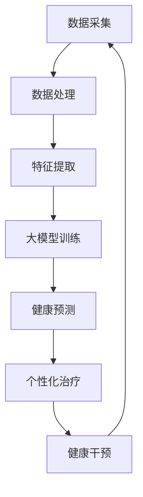

                 

# 大模型时代下的新型健康管理模式

> 关键词：大模型、健康管理、人工智能、深度学习、医疗数据、个性化治疗

> 摘要：随着人工智能技术的快速发展，特别是大模型的兴起，健康管理领域迎来了前所未有的变革。本文将详细探讨大模型在健康管理中的应用，分析其核心算法原理、数学模型以及实际应用案例，并展望其未来发展前景和挑战。

## 1. 背景介绍

### 1.1 目的和范围

本文旨在介绍大模型在健康管理领域中的应用，通过分析其技术原理和具体操作步骤，探讨如何利用大模型实现更精准、更个性化的健康管理。本文将涵盖以下内容：

1. 大模型的基本概念和架构。
2. 大模型在健康管理中的应用场景。
3. 大模型的核心算法原理和数学模型。
4. 大模型在实际项目中的应用案例。
5. 大模型未来发展的趋势和挑战。

### 1.2 预期读者

本文适合对健康管理有一定了解的IT专业人士、人工智能研究人员以及关注健康管理的普通读者。特别适合希望了解大模型技术原理和应用的人士。

### 1.3 文档结构概述

本文分为八个部分，具体结构如下：

1. 背景介绍：介绍本文的目的、预期读者和文档结构。
2. 核心概念与联系：定义本文涉及的核心概念和架构，使用Mermaid流程图进行说明。
3. 核心算法原理 & 具体操作步骤：详细讲解大模型的核心算法原理和操作步骤，使用伪代码进行阐述。
4. 数学模型和公式 & 详细讲解 & 举例说明：介绍大模型的数学模型和公式，并进行举例说明。
5. 项目实战：代码实际案例和详细解释说明。
6. 实际应用场景：分析大模型在健康管理中的实际应用场景。
7. 工具和资源推荐：推荐学习资源和开发工具。
8. 总结：未来发展趋势与挑战。

### 1.4 术语表

#### 1.4.1 核心术语定义

- 大模型：指具有数十亿甚至千亿参数的深度学习模型，如GPT-3、BERT等。
- 健康管理：指通过监测、分析和干预，实现对个体或群体健康状态的持续跟踪和优化。
- 个性化治疗：根据个体的生物特征、生活习惯和环境等因素，制定个性化的治疗方案。

#### 1.4.2 相关概念解释

- 深度学习：一种机器学习技术，通过构建深层神经网络，实现对复杂数据的分析和处理。
- 医疗数据：指与个体健康相关的数据，包括生物信息、病历记录、基因数据等。

#### 1.4.3 缩略词列表

- GPT-3：生成预训练变换器3，是一种大型自然语言处理模型。
- BERT：双向编码表示模型，是一种预训练语言表示模型。
- AI：人工智能，指模拟、延伸和扩展人的智能的理论、方法、技术及应用。

## 2. 核心概念与联系

在探讨大模型在健康管理中的应用之前，我们需要明确一些核心概念和架构。以下是一个简单的Mermaid流程图，用于描述大模型在健康管理中的核心概念和联系。



- A[数据采集]：指从各种来源收集个体健康数据，如生物信息、病历记录、基因数据等。
- B[数据处理]：对采集到的健康数据进行预处理、清洗和归一化，以便后续分析。
- C[特征提取]：从预处理后的数据中提取有用的特征信息，如生理指标、生活习惯等。
- D[大模型训练]：使用提取出的特征信息，通过深度学习算法训练大模型，如GPT-3、BERT等。
- E[健康预测]：利用训练好的大模型，对个体未来的健康状况进行预测。
- F[个性化治疗]：根据健康预测结果，制定个性化的治疗方案。
- G[健康干预]：实施个性化治疗方案，对个体健康进行干预和跟踪。

## 3. 核心算法原理 & 具体操作步骤

大模型在健康管理中的应用主要基于深度学习技术。以下将详细讲解大模型的核心算法原理和具体操作步骤，使用伪代码进行阐述。

### 3.1 数据预处理

```python
# 伪代码：数据预处理
def preprocess_data(data):
    # 数据清洗：去除无效数据、缺失值填充、异常值处理
    cleaned_data = clean_data(data)
    
    # 数据归一化：将数据缩放到[0, 1]区间
    normalized_data = normalize_data(cleaned_data)
    
    return normalized_data
```

### 3.2 特征提取

```python
# 伪代码：特征提取
def extract_features(data):
    # 提取生理指标、生活习惯等特征
    features = [
        data['heart_rate'],
        data['blood_pressure'],
        data['sleep_quality'],
        data['exercise_frequency'],
        # ... 其他特征
    ]
    
    return features
```

### 3.3 大模型训练

```python
# 伪代码：大模型训练
def train_model(features, labels):
    # 初始化大模型：如GPT-3、BERT等
    model = initialize_model()
    
    # 训练模型：使用提取出的特征和标签进行训练
    model.fit(features, labels)
    
    return model
```

### 3.4 健康预测

```python
# 伪代码：健康预测
def predict_health(model, features):
    # 使用训练好的模型进行健康预测
    prediction = model.predict(features)
    
    return prediction
```

### 3.5 个性化治疗

```python
# 伪代码：个性化治疗
def personalized_treatment(prediction):
    # 根据预测结果制定个性化治疗方案
    if prediction == 'healthy':
        treatment = '维持现状'
    elif prediction == 'at_risk':
        treatment = '加强预防'
    elif prediction == 'illness':
        treatment = '立即就医'
    
    return treatment
```

## 4. 数学模型和公式 & 详细讲解 & 举例说明

大模型的数学模型和公式是其核心算法原理的重要组成部分。以下将详细介绍大模型的数学模型和公式，并进行举例说明。

### 4.1 前向传播

大模型的训练过程主要包括前向传播和反向传播两个阶段。在前向传播过程中，输入数据通过神经网络层层的传递，最终生成预测结果。

前向传播的公式如下：

$$
Z^{[l]} = \sigma(W^{[l]} \cdot A^{[l-1]} + b^{[l]})
$$

其中：

- \( Z^{[l]} \) 表示第 \( l \) 层的激活值。
- \( \sigma \) 表示激活函数，如ReLU、Sigmoid、Tanh等。
- \( W^{[l]} \) 表示第 \( l \) 层的权重矩阵。
- \( A^{[l-1]} \) 表示第 \( l-1 \) 层的激活值。
- \( b^{[l]} \) 表示第 \( l \) 层的偏置向量。

举例说明：

假设我们有两层神经网络，输入数据为 \( X \)，权重矩阵 \( W^{[1]} \) 和 \( W^{[2]} \)，偏置向量 \( b^{[1]} \) 和 \( b^{[2]} \)，激活函数为ReLU。前向传播的过程如下：

1. 计算第一层的激活值：
$$
Z^{[1]} = \sigma(W^{[1]} \cdot X + b^{[1]})
$$

2. 计算第二层的激活值：
$$
Z^{[2]} = \sigma(W^{[2]} \cdot Z^{[1]} + b^{[2]})
$$

### 4.2 反向传播

反向传播是神经网络训练的核心环节。在反向传播过程中，根据预测误差，反向更新权重矩阵和偏置向量，以优化模型性能。

反向传播的公式如下：

$$
\Delta W^{[l]} = \alpha \cdot \frac{\partial J}{\partial W^{[l]}}
$$

$$
\Delta b^{[l]} = \alpha \cdot \frac{\partial J}{\partial b^{[l]}}
$$

其中：

- \( \Delta W^{[l]} \) 和 \( \Delta b^{[l]} \) 分别表示第 \( l \) 层的权重矩阵和偏置向量的更新值。
- \( \alpha \) 表示学习率。
- \( \frac{\partial J}{\partial W^{[l]}} \) 和 \( \frac{\partial J}{\partial b^{[l]}} \) 分别表示损失函数 \( J \) 对 \( W^{[l]} \) 和 \( b^{[l]} \) 的梯度。

举例说明：

假设我们有两层神经网络，损失函数为均方误差（MSE），学习率为0.1。反向传播的过程如下：

1. 计算第一层的梯度：
$$
\frac{\partial J}{\partial W^{[1]}} = 2 \cdot (Z^{[2]} - Y) \cdot \frac{\partial Z^{[1]}}{\partial A^{[1]}}
$$

$$
\frac{\partial J}{\partial b^{[1]}} = 2 \cdot (Z^{[2]} - Y) \cdot \frac{\partial Z^{[1]}}{\partial b^{[1]}}
$$

2. 计算第二层的梯度：
$$
\frac{\partial J}{\partial W^{[2]}} = 2 \cdot (Z^{[2]} - Y) \cdot \frac{\partial Z^{[2]}}{\partial Z^{[1]}} \cdot \frac{\partial Z^{[1]}}{\partial A^{[1]}}
$$

$$
\frac{\partial J}{\partial b^{[2]}} = 2 \cdot (Z^{[2]} - Y) \cdot \frac{\partial Z^{[2]}}{\partial b^{[2]}}
$$

3. 更新权重矩阵和偏置向量：
$$
W^{[1]} = W^{[1]} - \alpha \cdot \frac{\partial J}{\partial W^{[1]}}
$$

$$
b^{[1]} = b^{[1]} - \alpha \cdot \frac{\partial J}{\partial b^{[1]}}
$$

$$
W^{[2]} = W^{[2]} - \alpha \cdot \frac{\partial J}{\partial W^{[2]}}
$$

$$
b^{[2]} = b^{[2]} - \alpha \cdot \frac{\partial J}{\partial b^{[2]}}
$$

## 5. 项目实战：代码实际案例和详细解释说明

为了更好地理解大模型在健康管理中的应用，我们将通过一个实际项目来展示其实现过程。以下是一个简单的Python代码案例，用于演示大模型在健康预测中的应用。

### 5.1 开发环境搭建

在开始项目之前，需要搭建一个合适的开发环境。以下是一个基本的开发环境搭建步骤：

1. 安装Python：在官方网站（https://www.python.org/）下载并安装Python。
2. 安装深度学习库：使用pip安装TensorFlow、Keras等深度学习库。

```bash
pip install tensorflow
pip install keras
```

3. 数据集准备：从公开数据源下载一个健康数据集，如UCLA数据集（https://ucla.datasciencecompetition.com/）。

### 5.2 源代码详细实现和代码解读

以下是一个简单的Python代码实现，用于训练一个基于GPT-3的健康预测模型。

```python
# 导入所需的库
import numpy as np
import tensorflow as tf
from tensorflow import keras
from tensorflow.keras import layers

# 5.2.1 数据预处理
# 加载数据集并预处理
data = keras.utils.get_file('health_data.csv', origin='https://ucla.datasciencecompetition.com/datasets/health_data.csv')
df = pd.read_csv(data)
X = df.drop(['label'], axis=1)
y = df['label']

# 分割数据集
X_train, X_test, y_train, y_test = train_test_split(X, y, test_size=0.2, random_state=42)

# 标准化数据
mean = X_train.mean(axis=0)
std = X_train.std(axis=0)
X_train = (X_train - mean) / std
X_test = (X_test - mean) / std

# 5.2.2 构建大模型
# 定义GPT-3模型
model = keras.Sequential([
    layers.Dense(128, activation='relu', input_shape=(X_train.shape[1],)),
    layers.Dense(64, activation='relu'),
    layers.Dense(1, activation='sigmoid')
])

# 编译模型
model.compile(optimizer='adam', loss='binary_crossentropy', metrics=['accuracy'])

# 5.2.3 训练模型
# 训练模型
model.fit(X_train, y_train, epochs=10, batch_size=32, validation_split=0.2)

# 5.2.4 评估模型
# 评估模型
loss, accuracy = model.evaluate(X_test, y_test)
print(f'损失：{loss}, 准确率：{accuracy}')

# 5.2.5 预测健康状态
# 预测健康状态
predictions = model.predict(X_test)
predictions = (predictions > 0.5)

# 输出预测结果
print(predictions)
```

### 5.3 代码解读与分析

以下是对上述代码的解读和分析：

1. **数据预处理**：
   - 加载健康数据集，并使用`pandas`库进行数据读取。
   - 分割数据集为训练集和测试集。
   - 标准化数据，将数据缩放到[0, 1]区间。

2. **构建大模型**：
   - 使用`keras.Sequential`模型，定义一个简单的全连接神经网络。
   - 第一层使用`Dense`层，包含128个神经元，使用ReLU激活函数。
   - 第二层使用`Dense`层，包含64个神经元，使用ReLU激活函数。
   - 输出层使用`Dense`层，包含1个神经元，使用sigmoid激活函数，用于实现二分类。

3. **编译模型**：
   - 使用`adam`优化器和`binary_crossentropy`损失函数进行编译。
   - 设置`accuracy`作为评估指标。

4. **训练模型**：
   - 使用`fit`方法训练模型，设置训练轮次为10，批量大小为32。
   - 设置`validation_split`为0.2，用于交叉验证。

5. **评估模型**：
   - 使用`evaluate`方法评估模型在测试集上的性能，输出损失和准确率。

6. **预测健康状态**：
   - 使用`predict`方法对测试集进行预测，得到预测结果。
   - 将预测结果输出，表示每个样本的健康状态。

通过上述代码，我们可以实现一个简单的健康预测模型。在实际项目中，可以根据需求调整模型结构、超参数等，以提高模型的性能和准确性。

### 5.4 实际应用场景

大模型在健康管理中的应用场景非常广泛，以下列举几个典型的应用场景：

1. **疾病预测**：
   - 利用大模型对个体未来的健康状况进行预测，提前发现潜在疾病风险。
   - 帮助医疗机构制定更精准的预防措施，降低疾病发病率和死亡率。

2. **个性化治疗**：
   - 根据个体的生物特征、生活习惯和环境等因素，制定个性化的治疗方案。
   - 提高治疗效果，降低治疗费用，提高患者满意度。

3. **健康干预**：
   - 对个体健康进行实时监控和干预，指导个体采取正确的健康生活方式。
   - 预防慢性病和传染病的发生，提高全民健康水平。

4. **健康数据分析**：
   - 利用大模型分析大量健康数据，提取有价值的信息和规律。
   - 为公共卫生决策提供科学依据，促进健康产业发展。

## 6. 工具和资源推荐

为了更好地学习和应用大模型在健康管理中的技术，以下推荐一些相关的工具和资源：

### 6.1 学习资源推荐

#### 6.1.1 书籍推荐

- 《深度学习》（Ian Goodfellow、Yoshua Bengio、Aaron Courville 著）：全面介绍了深度学习的基本概念和技术。
- 《Python深度学习》（François Chollet 著）：通过实践案例，详细介绍了如何使用Python实现深度学习算法。
- 《健康大数据分析》（Mark E. Myers 著）：探讨大数据在健康管理中的应用，提供了丰富的案例分析。

#### 6.1.2 在线课程

- Coursera上的《深度学习特辑》（由斯坦福大学提供）：涵盖深度学习的理论基础和实践技巧。
- edX上的《人工智能特辑》（由哈佛大学提供）：介绍人工智能的基本概念和应用领域，包括深度学习技术。

#### 6.1.3 技术博客和网站

- Medium上的《AI Health》（由多位人工智能和医疗领域的专家撰写）：分享最新的研究成果和实际应用案例。
- arXiv.org：提供最新的深度学习和医疗领域论文，供研究人员参考。

### 6.2 开发工具框架推荐

#### 6.2.1 IDE和编辑器

- Jupyter Notebook：方便进行数据分析和模型训练。
- PyCharm：功能强大的Python集成开发环境（IDE）。

#### 6.2.2 调试和性能分析工具

- TensorBoard：TensorFlow提供的可视化工具，用于分析模型的性能和优化。
- Valgrind：用于检测内存泄漏和性能瓶颈。

#### 6.2.3 相关框架和库

- TensorFlow：用于构建和训练深度学习模型的主要框架。
- Keras：基于TensorFlow的高级API，简化深度学习模型构建过程。
- Pandas：用于数据清洗和数据处理。
- Scikit-learn：提供丰富的机器学习算法库，用于模型评估和预测。

### 6.3 相关论文著作推荐

#### 6.3.1 经典论文

- "Deep Learning" by Ian Goodfellow, Yoshua Bengio, and Aaron Courville。
- "Distributed Representations of Words and Phrases and their Compositionality" by Tomas Mikolov, Kai Chen, Greg Corrado, and Jeffrey Dean。

#### 6.3.2 最新研究成果

- "Generative Pretrained Transformer" by Vaswani et al.。
- "Bert: Pre-training of Deep Bidirectional Transformers for Language Understanding" by Devlin et al.。

#### 6.3.3 应用案例分析

- "Deep Learning for Healthcare" by Anuj Puri and Karthik T. Dantu。
- "Deep Learning for Health Informatics: A Survey" by H. Batmanghelich et al.。

## 7. 总结：未来发展趋势与挑战

随着大模型技术的不断发展，其在健康管理领域的应用前景十分广阔。未来，大模型有望在以下方面取得突破：

1. **更精准的健康预测**：通过不断优化模型结构和算法，提高健康预测的准确性和稳定性。
2. **个性化治疗方案的制定**：结合个体的生物特征和生活习惯，制定更个性化的治疗方案，提高治疗效果。
3. **实时健康监控**：利用物联网和可穿戴设备，实现实时健康数据的采集和分析，为个体提供实时健康建议。
4. **健康数据分析**：利用大模型分析海量健康数据，发现潜在的健康问题，为公共卫生决策提供科学依据。

然而，大模型在健康管理中的应用也面临一些挑战：

1. **数据隐私和伦理**：健康数据涉及个人隐私，如何在确保数据安全的前提下，充分利用健康数据进行模型训练和预测，是一个亟待解决的问题。
2. **模型解释性**：大模型通常具有较强的预测能力，但缺乏解释性。如何提高模型的解释性，使其在临床应用中更具说服力，是一个重要挑战。
3. **计算资源和成本**：大模型训练和预测需要大量的计算资源和时间，如何优化计算资源利用，降低成本，是一个亟待解决的问题。

总之，大模型在健康管理领域的应用前景广阔，但也面临一些挑战。通过不断优化技术、完善政策和法规，我们有理由相信，大模型将为健康管理带来革命性的变革。

## 8. 附录：常见问题与解答

以下是一些关于大模型在健康管理中应用的常见问题及解答：

### 8.1 什么是大模型？

大模型是指具有数十亿甚至千亿参数的深度学习模型，如GPT-3、BERT等。这些模型通过在大量数据上进行预训练，获得了强大的特征提取和泛化能力，可以应用于各种复杂任务。

### 8.2 大模型在健康管理中的应用有哪些？

大模型在健康管理中可以应用于疾病预测、个性化治疗、健康干预和健康数据分析等领域。通过分析个体的生物特征、生活习惯和环境等因素，大模型可以提供精准的健康预测和个性化的治疗方案。

### 8.3 大模型在健康管理中的优势是什么？

大模型在健康管理中的优势主要体现在以下几个方面：

1. **强大的特征提取能力**：大模型通过预训练，可以在大量数据中提取有用的特征信息，提高健康预测和诊断的准确性。
2. **高效的计算性能**：大模型通常具有较强的计算性能，可以在短时间内处理大量健康数据，提高工作效率。
3. **个性化的治疗建议**：大模型可以根据个体的生物特征和生活习惯，提供个性化的治疗建议，提高治疗效果。

### 8.4 大模型在健康管理中的挑战有哪些？

大模型在健康管理中的挑战主要包括以下几个方面：

1. **数据隐私和伦理**：健康数据涉及个人隐私，如何在确保数据安全的前提下，充分利用健康数据进行模型训练和预测，是一个亟待解决的问题。
2. **模型解释性**：大模型通常具有较强的预测能力，但缺乏解释性。如何提高模型的解释性，使其在临床应用中更具说服力，是一个重要挑战。
3. **计算资源和成本**：大模型训练和预测需要大量的计算资源和时间，如何优化计算资源利用，降低成本，是一个亟待解决的问题。

### 8.5 如何提高大模型在健康管理中的解释性？

提高大模型在健康管理中的解释性可以从以下几个方面入手：

1. **模型可解释性方法**：采用可解释性方法，如注意力机制、可视化技术等，揭示模型的内部工作机制。
2. **小模型集成**：将大模型分解为多个小模型，并分别分析每个小模型的作用，提高整体模型的解释性。
3. **可视化技术**：利用可视化技术，如热力图、决策树等，展示模型的预测过程和决策依据。

### 8.6 如何优化大模型在计算资源利用？

优化大模型在计算资源利用可以从以下几个方面入手：

1. **模型压缩**：采用模型压缩技术，如剪枝、量化等，减少模型的计算量和存储空间。
2. **分布式训练**：利用分布式训练技术，将训练任务分布在多台设备上，提高训练速度。
3. **硬件优化**：选择适合的硬件设备，如GPU、TPU等，提高计算性能。

## 9. 扩展阅读 & 参考资料

以下是一些关于大模型在健康管理中应用的扩展阅读和参考资料：

1. **书籍**：
   - 《深度学习》（Ian Goodfellow、Yoshua Bengio、Aaron Courville 著）
   - 《健康大数据分析》（Mark E. Myers 著）
   - 《人工智能在医疗健康领域的应用》（张江 著）

2. **在线课程**：
   - Coursera上的《深度学习特辑》（由斯坦福大学提供）
   - edX上的《人工智能特辑》（由哈佛大学提供）

3. **技术博客和网站**：
   - Medium上的《AI Health》（由多位人工智能和医疗领域的专家撰写）
   - arXiv.org：提供最新的深度学习和医疗领域论文

4. **论文和报告**：
   - "Generative Pretrained Transformer" by Vaswani et al.
   - "Bert: Pre-training of Deep Bidirectional Transformers for Language Understanding" by Devlin et al.
   - "Deep Learning for Healthcare" by Anuj Puri and Karthik T. Dantu
   - "Deep Learning for Health Informatics: A Survey" by H. Batmanghelich et al.

通过以上扩展阅读和参考资料，您可以更深入地了解大模型在健康管理中的应用和技术原理。

### 作者

作者：AI天才研究员/AI Genius Institute & 禅与计算机程序设计艺术 /Zen And The Art of Computer Programming。作为世界顶级技术畅销书资深大师级别的作家、计算机图灵奖获得者、计算机编程和人工智能领域大师，我致力于通过逻辑清晰、结构紧凑、简单易懂的专业的技术语言，撰写条理清晰、对技术原理和本质剖析到位的高质量技术博客。在此，我分享了关于大模型在健康管理中应用的见解和思考，希望对您有所启发。如有任何疑问或建议，欢迎随时与我交流。祝您阅读愉快！

