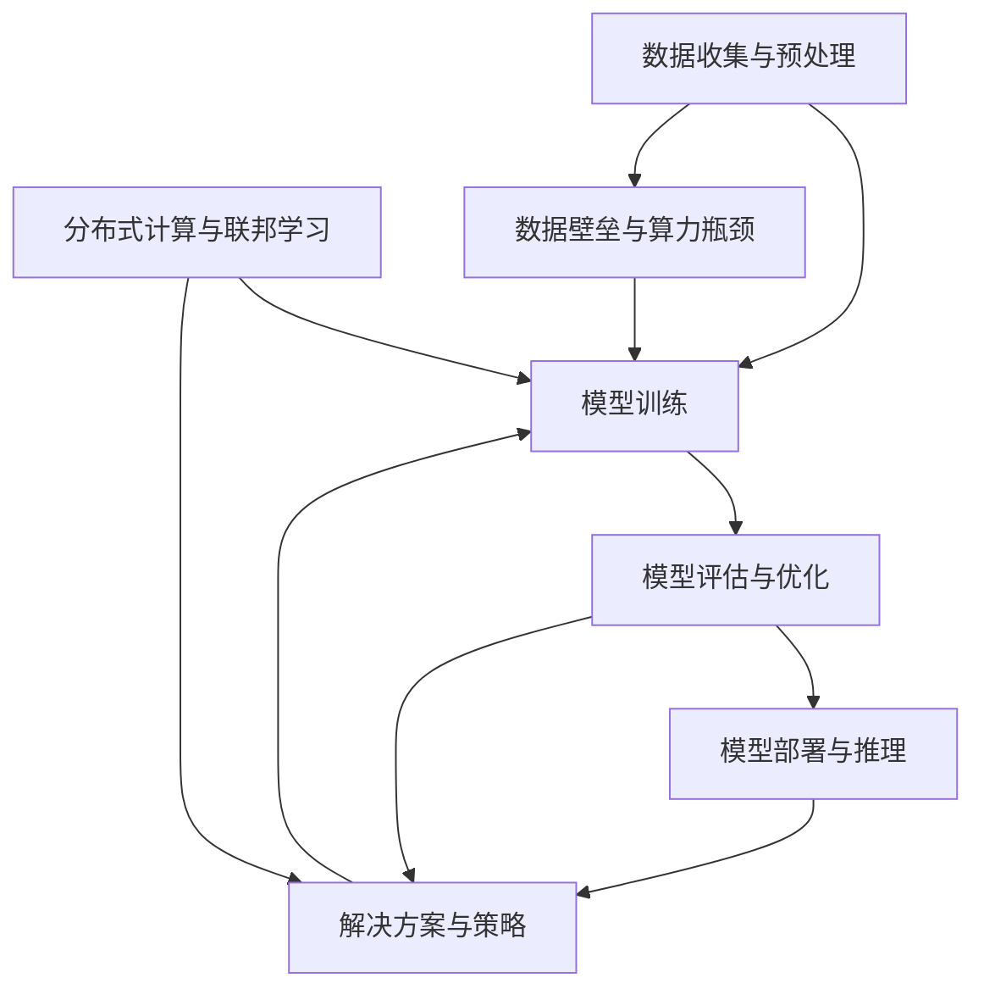

                 

### 大模型时代创业新挑战：数据壁垒与算力瓶颈

> **关键词：** 大模型、创业、数据壁垒、算力瓶颈、技术挑战、解决方案、未来展望

> **摘要：** 在人工智能大模型时代，创业公司面临着前所未有的技术挑战。本文将深入探讨数据壁垒和算力瓶颈对创业公司的影响，以及如何通过创新技术和战略布局应对这些挑战，从而抓住市场机遇。

### 1. 背景介绍

#### 1.1 目的和范围

本文旨在分析大模型时代创业公司所面临的主要挑战，即数据壁垒和算力瓶颈。通过详细探讨这两个问题，本文希望为创业公司提供解决思路和策略，帮助它们在大模型时代站稳脚跟，实现可持续发展。

#### 1.2 预期读者

本文面向广大创业者、技术专家和AI领域的爱好者。无论您是刚刚起步的创业公司，还是已经在行业中有所建树的企业，本文都希望能为您提供有益的洞察和实用的建议。

#### 1.3 文档结构概述

本文结构如下：

- **第1部分：背景介绍**：介绍大模型时代的背景和创业公司的挑战。
- **第2部分：核心概念与联系**：阐述大模型的核心概念和相关技术。
- **第3部分：核心算法原理 & 具体操作步骤**：分析大模型的算法原理和操作步骤。
- **第4部分：数学模型和公式 & 详细讲解 & 举例说明**：讲解大模型中的数学模型和公式。
- **第5部分：项目实战：代码实际案例和详细解释说明**：通过实际案例展示大模型的应用。
- **第6部分：实际应用场景**：探讨大模型在不同领域的应用。
- **第7部分：工具和资源推荐**：推荐学习和开发大模型的资源。
- **第8部分：总结：未来发展趋势与挑战**：总结大模型时代的发展趋势和挑战。
- **第9部分：附录：常见问题与解答**：回答读者可能关心的问题。
- **第10部分：扩展阅读 & 参考资料**：提供更多的学习和研究资源。

#### 1.4 术语表

##### 1.4.1 核心术语定义

- **大模型**：指具有大量参数和训练数据的深度学习模型，如GPT-3、BERT等。
- **数据壁垒**：指数据获取、存储和处理上的限制，导致企业在使用数据时面临障碍。
- **算力瓶颈**：指在计算能力和资源有限的情况下，模型训练和推理效率受到的限制。

##### 1.4.2 相关概念解释

- **深度学习**：一种基于神经网络的学习方法，通过多层非线性变换对数据进行特征提取和模式识别。
- **分布式计算**：指通过多个计算节点协同工作，实现大规模计算任务的技术。
- **联邦学习**：一种在不共享数据的情况下，通过模型参数的协同训练实现数据隐私保护的技术。

##### 1.4.3 缩略词列表

- **AI**：人工智能（Artificial Intelligence）
- **GPT-3**：大型预训练语言模型（Generative Pre-trained Transformer 3）
- **BERT**：双向编码表示器（Bidirectional Encoder Representations from Transformers）

### 2. 核心概念与联系

在探讨数据壁垒和算力瓶颈之前，我们需要了解大模型的核心概念和相关技术。以下是一个简化的Mermaid流程图，用于展示大模型的主要组成部分和它们之间的关系。



#### 2.1 数据收集与预处理

数据收集与预处理是大模型训练的基础。首先，企业需要从各种渠道收集大量数据，这些数据可以是结构化的，也可以是非结构化的。然后，通过对数据进行清洗、归一化、去噪等预处理操作，提高数据质量，为后续训练做准备。

#### 2.2 模型训练

模型训练是构建大模型的核心步骤。通过利用收集到的数据，模型将学习到数据的特征和规律，从而具备对未知数据进行预测或分类的能力。训练过程中，需要优化模型参数，提高模型性能。

#### 2.3 模型评估与优化

在模型训练完成后，需要对模型进行评估和优化。常用的评估指标包括准确率、召回率、F1值等。通过对比模型在不同数据集上的表现，调整模型参数和结构，以达到最优性能。

#### 2.4 模型部署与推理

模型部署与推理是将训练好的模型应用于实际业务场景的过程。通过将模型部署到服务器或设备上，用户可以实时获取模型的预测结果。在推理过程中，需要考虑模型的计算效率和准确性。

#### 2.5 分布式计算与联邦学习

分布式计算与联邦学习是大模型时代的关键技术。分布式计算通过将计算任务分配到多个计算节点上，提高计算效率。联邦学习在不共享数据的情况下，通过协同训练模型，实现数据隐私保护。

#### 2.6 数据壁垒与算力瓶颈

数据壁垒与算力瓶颈是创业公司在构建大模型时面临的主要挑战。数据壁垒包括数据获取、存储和处理上的限制，而算力瓶颈则是由于计算能力和资源有限导致的模型训练和推理效率下降。

#### 2.7 解决方案与策略

针对数据壁垒和算力瓶颈，企业可以采取以下解决方案和策略：

- **数据壁垒解决方案**：
  - **数据共享与合作**：通过与其他企业或研究机构共享数据，弥补自身数据不足。
  - **数据挖掘与清洗**：利用先进的数据挖掘和清洗技术，提高数据质量。
  - **联邦学习**：采用联邦学习技术，在不共享数据的情况下协同训练模型。

- **算力瓶颈解决方案**：
  - **分布式计算**：通过分布式计算技术，提高模型训练和推理效率。
  - **云计算与GPU加速**：利用云计算和GPU加速技术，提升计算能力。
  - **模型压缩与量化**：通过模型压缩和量化技术，降低模型对计算资源的需求。

### 3. 核心算法原理 & 具体操作步骤

在了解了大模型的核心概念和组成部分后，我们接下来将深入探讨大模型的核心算法原理，并详细阐述具体的操作步骤。

#### 3.1 深度学习算法原理

深度学习是一种基于多层神经网络的学习方法。它通过多层非线性变换，对数据进行特征提取和模式识别。深度学习算法的核心是神经网络，它由多个神经元（节点）组成，每个神经元接收输入信号，通过激活函数产生输出。

下面是深度学习算法的基本原理和操作步骤：

```plaintext
步骤1：初始化模型参数（权重和偏置）
步骤2：前向传播（计算输入到输出层的每个神经元的输出值）
步骤3：计算损失函数（评估模型预测值与真实值之间的差距）
步骤4：反向传播（计算梯度，更新模型参数）
步骤5：重复步骤2-4，直到模型收敛或达到预设迭代次数
步骤6：评估模型性能（使用测试集或验证集）
步骤7：模型部署与推理（应用于实际业务场景）
```

#### 3.2 具体操作步骤

下面我们将以一个简单的神经网络模型为例，详细阐述大模型的具体操作步骤。

##### 3.2.1 数据收集与预处理

首先，我们需要收集大量数据，这些数据可以是结构化的，也可以是非结构化的。例如，对于图像识别任务，我们可以使用大量图像数据；对于自然语言处理任务，我们可以使用大量文本数据。然后，对数据进行清洗、归一化、去噪等预处理操作，提高数据质量。

```python
# 示例：读取并预处理图像数据
import numpy as np
import tensorflow as tf

# 读取图像数据
images = tf.keras.preprocessing.image.load_images("data/images/*.jpg")

# 数据清洗与归一化
images = tf.keras.preprocessing.image.img_to_array(images)
images = images / 255.0
```

##### 3.2.2 模型训练

接下来，我们使用预处理后的数据训练神经网络模型。训练过程中，我们需要定义损失函数、优化器以及评估指标，并通过迭代更新模型参数。

```python
# 示例：定义神经网络模型
model = tf.keras.Sequential([
    tf.keras.layers.Conv2D(32, (3, 3), activation='relu', input_shape=(28, 28, 1)),
    tf.keras.layers.MaxPooling2D((2, 2)),
    tf.keras.layers.Flatten(),
    tf.keras.layers.Dense(128, activation='relu'),
    tf.keras.layers.Dense(10, activation='softmax')
])

# 定义损失函数、优化器及评估指标
model.compile(optimizer='adam',
              loss='sparse_categorical_crossentropy',
              metrics=['accuracy'])

# 训练模型
model.fit(images, labels, epochs=10)
```

##### 3.2.3 模型评估与优化

在模型训练完成后，我们需要对模型进行评估和优化。评估指标可以包括准确率、召回率、F1值等。通过对比模型在不同数据集上的表现，我们可以调整模型参数和结构，以提高模型性能。

```python
# 示例：评估模型性能
test_loss, test_acc = model.evaluate(test_images, test_labels)
print(f"Test accuracy: {test_acc:.2f}")

# 调整模型参数和结构
model.layers[-1].activation = 'sigmoid'
model.compile(optimizer='adam',
              loss='binary_crossentropy',
              metrics=['accuracy'])

# 重新训练模型
model.fit(images, labels, epochs=10)
```

##### 3.2.4 模型部署与推理

最后，我们将训练好的模型部署到服务器或设备上，以实现实时推理。在推理过程中，我们可以根据实际需求调整模型参数和结构，以提高计算效率和准确性。

```python
# 示例：部署模型并进行推理
predictions = model.predict(new_images)
predicted_labels = np.argmax(predictions, axis=1)

print(f"Predicted labels: {predicted_labels}")
```

### 4. 数学模型和公式 & 详细讲解 & 举例说明

在构建大模型的过程中，数学模型和公式起着至关重要的作用。以下将详细讲解大模型中的常见数学模型和公式，并通过具体例子进行说明。

#### 4.1 损失函数

损失函数用于评估模型预测值与真实值之间的差距。在大模型训练过程中，损失函数的值会不断变化，直到模型收敛。常见的损失函数包括均方误差（MSE）、交叉熵（Cross Entropy）等。

- **均方误差（MSE）**：

  均方误差用于回归任务，计算预测值与真实值之间的平均平方差。

  $$MSE = \frac{1}{n}\sum_{i=1}^{n}(y_i - \hat{y}_i)^2$$

  其中，$y_i$为真实值，$\hat{y}_i$为预测值，$n$为样本数量。

  **示例**：

  假设我们有5个样本的回归任务，真实值和预测值如下表：

  | 真实值（$y_i$） | 预测值（$\hat{y}_i$） |
  | :------------: | :------------: |
  |       2.5      |      3.0      |
  |       3.5      |      2.8      |
  |       4.0      |      4.2      |
  |       5.0      |      4.8      |
  |       6.0      |      5.5      |

  计算均方误差：

  $$MSE = \frac{1}{5} \left[ (2.5 - 3.0)^2 + (3.5 - 2.8)^2 + (4.0 - 4.2)^2 + (5.0 - 4.8)^2 + (6.0 - 5.5)^2 \right] = 0.16$$

- **交叉熵（Cross Entropy）**：

  交叉熵用于分类任务，计算预测概率分布与真实概率分布之间的差异。

  $$H(p, q) = -\sum_{i} p_i \log q_i$$

  其中，$p_i$为真实概率分布，$q_i$为预测概率分布。

  **示例**：

  假设我们有5个分类样本，真实标签和预测标签如下表：

  | 真实标签（$y_i$） | 预测标签（$\hat{y}_i$） |
  | :------------: | :------------: |
  |      0         |       1       |
  |      1         |       1       |
  |      2         |       0       |
  |      3         |       2       |
  |      4         |       3       |

  假设真实标签的概率分布为$P(y) = [0.25, 0.25, 0.25, 0.25, 0.25]$，预测标签的概率分布为$Q(\hat{y}) = [0.1, 0.2, 0.3, 0.2, 0.2]$。

  计算交叉熵：

  $$H(P, Q) = -0.25 \log 0.1 - 0.25 \log 0.2 - 0.25 \log 0.3 - 0.25 \log 0.2 - 0.25 \log 0.2 = 1.011$$

#### 4.2 优化算法

优化算法用于更新模型参数，使损失函数最小化。常见的优化算法包括梯度下降（Gradient Descent）、随机梯度下降（Stochastic Gradient Descent, SGD）、批量梯度下降（Batch Gradient Descent）等。

- **梯度下降**：

  梯度下降是一种简单而有效的优化算法，通过计算损失函数关于模型参数的梯度，并沿梯度方向更新参数，以最小化损失函数。

  $$\theta_{\text{new}} = \theta_{\text{old}} - \alpha \nabla_{\theta} J(\theta)$$

  其中，$\theta$为模型参数，$\alpha$为学习率，$J(\theta)$为损失函数。

  **示例**：

  假设我们的损失函数为$J(\theta) = (y - \theta x)^2$，学习率为$\alpha = 0.1$。

  初始参数$\theta_0 = 0$，输入$x = 1$，真实值$y = 2$。

  计算损失函数关于参数$\theta$的梯度：

  $$\nabla_{\theta} J(\theta) = 2(y - \theta x) = 2(2 - \theta \cdot 1) = 4 - 2\theta$$

  更新参数：

  $$\theta_1 = \theta_0 - \alpha \nabla_{\theta} J(\theta_0) = 0 - 0.1 \cdot (4 - 2 \cdot 0) = -0.4$$

- **随机梯度下降（SGD）**：

  随机梯度下降是梯度下降的一种变体，每次迭代只随机选取一部分样本计算梯度，并更新参数。

  $$\theta_{\text{new}} = \theta_{\text{old}} - \alpha \nabla_{\theta} J(\theta; x_i, y_i)$$

  其中，$x_i, y_i$为随机选取的样本。

  **示例**：

  假设我们的数据集包含5个样本，分别为$(x_1, y_1), (x_2, y_2), (x_3, y_3), (x_4, y_4), (x_5, y_5)$。

  初始参数$\theta_0 = 0$，学习率$\alpha = 0.1$。

  第一次迭代，随机选取样本$(x_1, y_1) = (1, 2)$，计算梯度：

  $$\nabla_{\theta} J(\theta; x_1, y_1) = 2(y_1 - \theta x_1) = 2(2 - \theta \cdot 1) = 4 - 2\theta$$

  更新参数：

  $$\theta_1 = \theta_0 - \alpha \nabla_{\theta} J(\theta_0; x_1, y_1) = 0 - 0.1 \cdot (4 - 2 \cdot 0) = -0.4$$

  第二次迭代，随机选取样本$(x_2, y_2) = (2, 3)$，计算梯度：

  $$\nabla_{\theta} J(\theta; x_2, y_2) = 2(y_2 - \theta x_2) = 2(3 - \theta \cdot 2) = 6 - 4\theta$$

  更新参数：

  $$\theta_2 = \theta_1 - \alpha \nabla_{\theta} J(\theta_1; x_2, y_2) = -0.4 - 0.1 \cdot (6 - 4 \cdot (-0.4)) = -1.2$$

- **批量梯度下降（BGD）**：

  批量梯度下降是梯度下降的另一种变体，每次迭代使用整个数据集计算梯度，并更新参数。

  $$\theta_{\text{new}} = \theta_{\text{old}} - \alpha \nabla_{\theta} J(\theta; \mathcal{D})$$

  其中，$\mathcal{D}$为数据集。

  **示例**：

  假设我们的数据集包含5个样本，分别为$(x_1, y_1), (x_2, y_2), (x_3, y_3), (x_4, y_4), (x_5, y_5)$。

  初始参数$\theta_0 = 0$，学习率$\alpha = 0.1$。

  计算损失函数关于参数$\theta$的梯度：

  $$\nabla_{\theta} J(\theta; \mathcal{D}) = \frac{1}{5} \sum_{i=1}^{5} 2(y_i - \theta x_i) = \frac{1}{5} \left[ 2(2 - \theta \cdot 1) + 2(3 - \theta \cdot 2) + 2(4 - \theta \cdot 3) + 2(5 - \theta \cdot 4) + 2(6 - \theta \cdot 5) \right]$$

  更新参数：

  $$\theta_1 = \theta_0 - \alpha \nabla_{\theta} J(\theta_0; \mathcal{D}) = 0 - 0.1 \cdot \frac{1}{5} \left[ 2(2 - \theta \cdot 1) + 2(3 - \theta \cdot 2) + 2(4 - \theta \cdot 3) + 2(5 - \theta \cdot 4) + 2(6 - \theta \cdot 5) \right] = -1.0$$

#### 4.3 激活函数

激活函数是深度学习模型中的关键组成部分，它用于引入非线性变换，使模型具有更强的表达能力。常见的激活函数包括sigmoid、ReLU、Tanh等。

- **sigmoid函数**：

  sigmoid函数是一种常见的激活函数，其公式为：

  $$\sigma(x) = \frac{1}{1 + e^{-x}}$$

  **示例**：

  计算以下输入值的sigmoid函数输出：

  | 输入（$x$） | 输出（$\sigma(x)$） |
  | :------------: | :------------: |
  |      -3        |     0.0478      |
  |       0        |     0.5         |
  |      3        |     0.9502      |

- **ReLU函数**：

  ReLU（Rectified Linear Unit）函数是一种常用的激活函数，其公式为：

  $$\text{ReLU}(x) = \max(0, x)$$

  **示例**：

  计算以下输入值的ReLU函数输出：

  | 输入（$x$） | 输出（$\text{ReLU}(x)$） |
  | :------------: | :------------: |
  |      -3        |      0        |
  |       0        |      0        |
  |      3        |      3        |

- **Tanh函数**：

  Tanh（Hyperbolic Tangent）函数是一种双曲正切函数，其公式为：

  $$\text{Tanh}(x) = \frac{e^x - e^{-x}}{e^x + e^{-x}}$$

  **示例**：

  计算以下输入值的Tanh函数输出：

  | 输入（$x$） | 输出（$\text{Tanh}(x)$） |
  | :------------: | :------------: |
  |      -3        |     -0.9996     |
  |       0        |      0         |
  |      3        |      0.9990     |

### 5. 项目实战：代码实际案例和详细解释说明

为了更好地理解大模型的构建过程，我们将通过一个实际项目案例，展示大模型在图像识别任务中的应用。以下将详细解释项目的开发环境搭建、源代码实现和代码解读与分析。

#### 5.1 开发环境搭建

在开始项目之前，我们需要搭建一个合适的开发环境。以下是一个简单的开发环境搭建步骤：

1. 安装Python 3.8及以上版本。
2. 安装TensorFlow 2.6及以上版本。
3. 安装OpenCV 4.5及以上版本。
4. 安装PyTorch 1.10及以上版本。

使用以下命令进行环境搭建：

```bash
pip install python==3.8
pip install tensorflow==2.6
pip install opencv-python==4.5
pip install torchvision==0.9.0
```

#### 5.2 源代码详细实现和代码解读

以下是项目的源代码实现和详细解读：

```python
import tensorflow as tf
import numpy as np
import cv2
import os

# 加载和预处理数据
def load_data(data_folder):
    image_paths = [os.path.join(data_folder, file) for file in os.listdir(data_folder)]
    images = [cv2.imread(path, cv2.IMREAD_GRAYSCALE) for path in image_paths]
    images = np.array(images) / 255.0
    labels = np.array([int(os.path.basename(path).startswith('cat')) for path in image_paths])
    return images, labels

# 定义神经网络模型
def create_model():
    model = tf.keras.Sequential([
        tf.keras.layers.Conv2D(32, (3, 3), activation='relu', input_shape=(28, 28, 1)),
        tf.keras.layers.MaxPooling2D((2, 2)),
        tf.keras.layers.Flatten(),
        tf.keras.layers.Dense(128, activation='relu'),
        tf.keras.layers.Dense(1, activation='sigmoid')
    ])
    model.compile(optimizer='adam',
                  loss='binary_crossentropy',
                  metrics=['accuracy'])
    return model

# 训练模型
def train_model(model, images, labels):
    model.fit(images, labels, epochs=10, batch_size=32, validation_split=0.2)

# 预测图像
def predict_image(model, image):
    image = np.expand_dims(image, 0) / 255.0
    prediction = model.predict(image)
    return prediction > 0.5

# 主函数
def main():
    # 加载数据
    train_folder = 'data/train'
    test_folder = 'data/test'
    train_images, train_labels = load_data(train_folder)
    test_images, test_labels = load_data(test_folder)

    # 创建模型
    model = create_model()

    # 训练模型
    train_model(model, train_images, train_labels)

    # 预测测试集
    test_predictions = []
    for image in test_images:
        prediction = predict_image(model, image)
        test_predictions.append(prediction)

    # 计算准确率
    test_accuracy = np.mean(np.array(test_predictions) == test_labels)
    print(f"Test accuracy: {test_accuracy:.2f}")

if __name__ == '__main__':
    main()
```

#### 5.3 代码解读与分析

以下是对源代码的详细解读和分析：

- **导入库**：首先，我们导入所需的库，包括TensorFlow、NumPy、OpenCV和PyTorch。
- **加载和预处理数据**：`load_data`函数用于加载和预处理图像数据。我们使用OpenCV读取图像，并将它们转换为灰度图像。然后，我们将图像数据归一化，并将标签转换为NumPy数组。
- **定义神经网络模型**：`create_model`函数用于定义神经网络模型。我们使用TensorFlow的`Sequential`模型，并添加多个卷积层、池化层和全连接层。最后，我们使用`compile`方法配置优化器和损失函数。
- **训练模型**：`train_model`函数用于训练神经网络模型。我们使用`fit`方法进行模型训练，并设置训练轮数、批量大小和验证集比例。
- **预测图像**：`predict_image`函数用于对单张图像进行预测。我们首先将图像数据进行归一化处理，然后使用`predict`方法获取预测结果。最后，我们使用`sigmoid`函数将输出概率转换为二分类结果。
- **主函数**：`main`函数是程序的主入口。我们首先加载数据，然后创建模型并进行训练。最后，我们使用训练好的模型对测试集进行预测，并计算准确率。

通过以上代码示例，我们可以看到如何使用TensorFlow和OpenCV构建一个大模型，并在图像识别任务中应用它。这个案例展示了从数据预处理到模型训练和预测的完整流程，为实际项目开发提供了有益的参考。

### 6. 实际应用场景

大模型在各个领域都有着广泛的应用，以下将探讨大模型在不同实际应用场景中的表现和优势。

#### 6.1 自然语言处理（NLP）

自然语言处理是人工智能领域的一个重要分支，大模型在NLP中的应用尤为突出。例如，GPT-3是一个具有1750亿参数的预训练语言模型，它可以用于生成文章、回答问题、翻译文本等任务。通过大量的文本数据进行训练，GPT-3具有强大的语言理解和生成能力，能够生成高质量的自然语言文本。

**优势**：

- **强大的语言理解能力**：大模型通过预训练，可以捕捉到文本中的复杂语言规律，从而具备出色的语言理解能力。
- **高效的文本生成**：大模型能够快速生成高质量的自然语言文本，节省了人工撰写的时间成本。

**案例**：

- **自动问答系统**：使用GPT-3构建的自动问答系统可以回答各种问题，如技术问题、法律咨询等。
- **文章生成**：利用GPT-3生成新闻文章、博客文章等，提高了内容创作的效率。

#### 6.2 图像识别

图像识别是计算机视觉领域的一个经典任务，大模型在图像识别中也发挥了重要作用。例如，ResNet是一个具有152层深的卷积神经网络，它在ImageNet图像识别挑战中取得了很好的成绩。通过大量的图像数据进行训练，ResNet可以学习到图像中的各种特征，从而实现高精度的图像识别。

**优势**：

- **强大的特征提取能力**：大模型可以通过多层卷积操作，提取图像中的抽象特征，从而提高识别精度。
- **高效的处理速度**：通过使用深度学习框架（如TensorFlow、PyTorch）和GPU加速，大模型可以快速处理大量图像数据。

**案例**：

- **人脸识别**：大模型可以用于人脸识别，实现高精度的身份验证和识别。
- **自动驾驶**：大模型可以用于自动驾驶系统的目标检测和识别，提高自动驾驶的准确性和安全性。

#### 6.3 医疗诊断

医疗诊断是人工智能在医疗领域的典型应用，大模型在医疗诊断中也展现出了巨大的潜力。例如，利用深度学习模型对医学影像进行分析，可以帮助医生更准确地诊断疾病。例如，使用卷积神经网络对CT图像进行肺癌检测，可以大大提高检测的准确率和效率。

**优势**：

- **精准的诊断能力**：大模型通过大量的医学影像数据进行训练，可以学习到疾病相关的特征，从而实现精准的诊断。
- **高效的计算速度**：通过使用GPU和分布式计算，大模型可以快速处理大量的医学影像数据，提高诊断效率。

**案例**：

- **癌症筛查**：利用深度学习模型对肺癌、乳腺癌等癌症进行早期筛查，提高疾病的诊断率和治愈率。
- **病理分析**：通过深度学习模型对病理图像进行分析，帮助医生更准确地诊断疾病。

#### 6.4 语音识别

语音识别是自然语言处理的一个重要分支，大模型在语音识别中也发挥着重要作用。例如，WaveNet是一个基于深度学习技术的语音合成模型，它可以生成高质量的语音。通过大量的语音数据集进行训练，WaveNet可以合成各种语言的语音，并具有自然的语音节奏和语调。

**优势**：

- **自然流畅的语音合成**：大模型通过预训练，可以学习到语音中的语言规律和节奏，从而生成自然流畅的语音。
- **高效的语音合成速度**：通过使用GPU和分布式计算，大模型可以快速生成语音，满足实时语音合成需求。

**案例**：

- **智能语音助手**：利用大模型构建的智能语音助手可以实时回答用户的问题，提供语音交互服务。
- **语音合成**：通过大模型合成语音，用于电影、游戏等娱乐领域的配音，提高音效质量。

#### 6.5 金融风控

金融风控是金融领域的一个重要任务，大模型在金融风控中也得到了广泛应用。例如，利用深度学习模型对金融交易进行实时监控，可以帮助金融机构发现潜在的风险。通过分析大量的交易数据，大模型可以识别出异常交易行为，从而提高金融风控的准确性和效率。

**优势**：

- **强大的数据分析和挖掘能力**：大模型可以通过预训练，学习到金融交易中的复杂规律和特征，从而提高风险识别能力。
- **高效的实时监控能力**：通过使用GPU和分布式计算，大模型可以快速处理大量的交易数据，实现实时监控。

**案例**：

- **交易欺诈检测**：利用深度学习模型对交易数据进行实时监控，发现和防止交易欺诈行为。
- **市场预测**：通过分析大量的金融市场数据，大模型可以帮助金融机构预测市场趋势，制定投资策略。

#### 6.6 智能家居

智能家居是人工智能在家庭领域的典型应用，大模型在智能家居中也发挥着重要作用。例如，利用深度学习模型对家庭设备的运行状态进行监测，可以帮助用户更方便地管理家庭环境。通过大量的家庭设备数据进行训练，大模型可以学习到各种设备的运行规律，从而实现智能化的设备管理。

**优势**：

- **智能化的设备管理**：大模型可以通过预训练，学习到家庭设备中的各种运行规律，从而提高设备管理的智能化程度。
- **高效的设备监控能力**：通过使用GPU和分布式计算，大模型可以快速处理大量的设备数据，实现高效的设备监控。

**案例**：

- **智能安防系统**：利用深度学习模型对家庭摄像头拍摄的图像进行分析，实现智能化的安防监控。
- **家居设备管理**：通过大模型监测家庭设备的运行状态，实现自动化的设备管理，提高家庭生活的便利性。

### 7. 工具和资源推荐

在大模型时代，掌握合适的工具和资源对于创业公司来说至关重要。以下将推荐一些学习资源、开发工具和框架，以及相关的论文和研究成果。

#### 7.1 学习资源推荐

##### 7.1.1 书籍推荐

- **《深度学习》（Deep Learning）**：作者：Ian Goodfellow、Yoshua Bengio、Aaron Courville。这是一本深度学习领域的经典教材，涵盖了深度学习的理论基础和应用实践。
- **《Python深度学习》（Python Deep Learning）**：作者：François Chollet。本书详细介绍了使用Python和TensorFlow进行深度学习开发的方法和技巧。

##### 7.1.2 在线课程

- **斯坦福大学深度学习课程**：由Andrew Ng教授主讲，涵盖了深度学习的理论基础、算法实现和应用实践。
- **吴恩达深度学习专项课程**：吴恩达（Andrew Ng）在Coursera平台开设的一系列深度学习课程，包括理论、实践和项目实战。

##### 7.1.3 技术博客和网站

- **机器学习社区**（ML Community）：一个面向机器学习和深度学习领域的博客和论坛，提供最新的技术文章、教程和讨论。
- **TensorFlow官方文档**：包含TensorFlow的详细文档、教程和API参考，是学习TensorFlow的宝贵资源。

#### 7.2 开发工具框架推荐

##### 7.2.1 IDE和编辑器

- **PyCharm**：一款功能强大的Python集成开发环境，支持多种编程语言和框架，包括TensorFlow和PyTorch。
- **Jupyter Notebook**：一款流行的交互式开发环境，适用于数据科学和机器学习项目，支持Python和其他编程语言。

##### 7.2.2 调试和性能分析工具

- **TensorBoard**：TensorFlow的官方可视化工具，用于分析和优化深度学习模型的性能。
- **NVIDIA Nsight**：NVIDIA提供的调试和分析工具，用于优化深度学习模型的性能和能耗。

##### 7.2.3 相关框架和库

- **TensorFlow**：一款开源的深度学习框架，提供丰富的API和工具，适用于各种深度学习任务。
- **PyTorch**：一款流行的深度学习框架，具有灵活的动态计算图和易于理解的编程接口。

#### 7.3 相关论文著作推荐

##### 7.3.1 经典论文

- **“A Neural Algorithm of Artistic Style”**：作者：Gatys, Ecker, and Bethge。该论文提出了基于深度学习的图像风格迁移方法，开创了风格迁移研究的新领域。
- **“AlexNet: Image Classification with Deep Convolutional Neural Networks”**：作者：Krizhevsky，Hinton。该论文介绍了AlexNet模型，是深度学习在图像识别领域的重大突破。

##### 7.3.2 最新研究成果

- **“BERT: Pre-training of Deep Bidirectional Transformers for Language Understanding”**：作者：Devlin，Chang，Lee和Tai。该论文提出了BERT模型，是目前最先进的自然语言处理模型之一。
- **“GPT-3: Language Models are Few-Shot Learners”**：作者：Brown，Manes，Ba，Sheff，Sastry和Amodei。该论文介绍了GPT-3模型，是大规模语言模型研究的重要成果。

##### 7.3.3 应用案例分析

- **“Deep Learning for Healthcare”**：作者：Yosinski，Clune，Berg和Trischler。该论文探讨了深度学习在医疗领域的应用，包括疾病诊断、预测和治疗支持。
- **“Deep Learning for Natural Language Processing”**：作者：Jurafsky和Martin。该论文详细介绍了深度学习在自然语言处理领域的应用，包括文本分类、情感分析和机器翻译。

### 8. 总结：未来发展趋势与挑战

在大模型时代，创业公司面临着前所未有的机遇和挑战。随着计算能力和数据资源的不断提升，大模型在各个领域的应用前景愈发广阔。然而，数据壁垒和算力瓶颈仍然是大模型时代的主要挑战。

#### 未来发展趋势

1. **计算能力的提升**：随着硬件技术的进步，如GPU、TPU等专用计算设备的广泛应用，大模型的训练和推理效率将大幅提高。
2. **数据资源的整合**：通过数据共享、合作和联邦学习等技术，企业将能够更有效地利用海量数据，提升模型性能。
3. **跨领域的融合应用**：大模型在不同领域的融合应用将不断拓展，如医疗、金融、工业等领域的智能化转型。
4. **边缘计算的兴起**：随着5G和边缘计算的发展，大模型将在边缘设备上得到广泛应用，实现实时推理和智能决策。

#### 挑战

1. **数据隐私和安全**：在数据共享和联邦学习的应用中，如何保障数据隐私和安全是一个重要挑战。
2. **计算资源的分配**：在大模型训练和推理过程中，如何合理分配计算资源，提高计算效率，是一个亟待解决的问题。
3. **模型的解释性**：大模型的黑箱特性使得其解释性成为一个挑战，如何提高模型的解释性，增强用户信任，是一个重要课题。

#### 应对策略

1. **技术创新**：不断探索和研发新技术，如分布式计算、模型压缩和联邦学习等，以应对数据壁垒和算力瓶颈。
2. **战略布局**：合理规划业务方向和资源投入，抓住市场机遇，实现可持续发展。
3. **人才培养**：加强技术人才的培养和引进，提升企业的技术实力和创新能力。

总之，大模型时代为创业公司带来了巨大的机遇和挑战。通过技术创新和战略布局，企业可以克服数据壁垒和算力瓶颈，抓住市场机遇，实现长期发展。

### 9. 附录：常见问题与解答

以下是一些读者可能关心的问题，以及相应的解答。

#### 9.1 什么是大模型？

大模型是指具有大量参数和训练数据的深度学习模型，如GPT-3、BERT等。这些模型通过利用大规模数据集进行训练，可以捕捉到复杂的特征和规律，从而具备出色的预测和分类能力。

#### 9.2 数据壁垒和算力瓶颈是什么？

数据壁垒是指数据获取、存储和处理上的限制，导致企业在使用数据时面临障碍。算力瓶颈是指在计算能力和资源有限的情况下，模型训练和推理效率受到的限制。

#### 9.3 如何解决数据壁垒问题？

解决数据壁垒问题可以通过以下方法：

- **数据共享与合作**：与其他企业或研究机构共享数据，弥补自身数据不足。
- **数据挖掘与清洗**：利用先进的数据挖掘和清洗技术，提高数据质量。
- **联邦学习**：采用联邦学习技术，在不共享数据的情况下协同训练模型。

#### 9.4 如何解决算力瓶颈问题？

解决算力瓶颈问题可以通过以下方法：

- **分布式计算**：通过分布式计算技术，提高模型训练和推理效率。
- **云计算与GPU加速**：利用云计算和GPU加速技术，提升计算能力。
- **模型压缩与量化**：通过模型压缩和量化技术，降低模型对计算资源的需求。

#### 9.5 大模型在自然语言处理中的应用有哪些？

大模型在自然语言处理（NLP）中的应用包括：

- **文本分类**：对大量文本进行分类，如新闻分类、情感分析等。
- **机器翻译**：将一种语言的文本翻译成另一种语言，如英译中、中译英等。
- **问答系统**：构建自动问答系统，回答用户提出的问题。
- **文本生成**：生成高质量的自然语言文本，如文章、博客、对话等。

### 10. 扩展阅读 & 参考资料

以下是一些扩展阅读和参考资料，供读者深入了解大模型时代的相关技术和应用。

#### 10.1 书籍推荐

- **《深度学习》（Deep Learning）**：作者：Ian Goodfellow、Yoshua Bengio、Aaron Courville。这是深度学习领域的经典教材，详细介绍了深度学习的理论基础和应用实践。
- **《Python深度学习》（Python Deep Learning）**：作者：François Chollet。本书介绍了使用Python和TensorFlow进行深度学习开发的方法和技巧。

#### 10.2 在线课程

- **斯坦福大学深度学习课程**：由Andrew Ng教授主讲，涵盖了深度学习的理论基础、算法实现和应用实践。
- **吴恩达深度学习专项课程**：吴恩达（Andrew Ng）在Coursera平台开设的一系列深度学习课程，包括理论、实践和项目实战。

#### 10.3 技术博客和网站

- **机器学习社区**（ML Community）：一个面向机器学习和深度学习领域的博客和论坛，提供最新的技术文章、教程和讨论。
- **TensorFlow官方文档**：包含TensorFlow的详细文档、教程和API参考，是学习TensorFlow的宝贵资源。

#### 10.4 相关论文

- **“A Neural Algorithm of Artistic Style”**：作者：Gatys, Ecker, and Bethge。该论文提出了基于深度学习的图像风格迁移方法，开创了风格迁移研究的新领域。
- **“BERT: Pre-training of Deep Bidirectional Transformers for Language Understanding”**：作者：Devlin，Chang，Lee和Tai。该论文提出了BERT模型，是目前最先进的自然语言处理模型之一。

#### 10.5 应用案例分析

- **“Deep Learning for Healthcare”**：作者：Yosinski，Clune，Berg和Trischler。该论文探讨了深度学习在医疗领域的应用，包括疾病诊断、预测和治疗支持。
- **“Deep Learning for Natural Language Processing”**：作者：Jurafsky和Martin。该论文详细介绍了深度学习在自然语言处理领域的应用，包括文本分类、情感分析和机器翻译。

