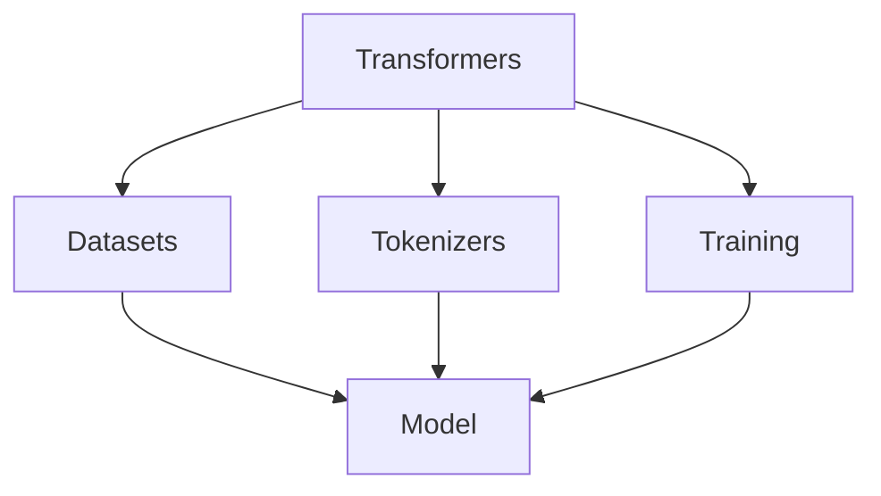

                 

# 大模型时代的 GitHub：Hugging Face

> **关键词：** 大模型、GitHub、Hugging Face、机器学习、开源、人工智能、自然语言处理

> **摘要：** 本文深入探讨了 Hugging Face，一个在 GitHub 上崭露头角的开源社区，专注于机器学习和自然语言处理的模型、库和工具。我们将从背景介绍开始，逐步分析其核心概念、算法原理、数学模型，以及实际应用场景，最后总结未来发展趋势和面临的挑战。

## 1. 背景介绍

### 1.1 目的和范围

本文旨在为读者提供一个关于 Hugging Face 的全面概述，帮助理解其在机器学习和自然语言处理领域的重要性和影响力。我们将从多个角度探讨 Hugging Face，包括其历史背景、核心功能、优势以及与其他开源项目的区别。

### 1.2 预期读者

本文适合对机器学习和自然语言处理感兴趣的读者，尤其是希望了解和利用开源资源进行研究和开发的开发者、研究人员和学生。

### 1.3 文档结构概述

本文结构如下：

1. 背景介绍
2. 核心概念与联系
3. 核心算法原理 & 具体操作步骤
4. 数学模型和公式 & 详细讲解 & 举例说明
5. 项目实战：代码实际案例和详细解释说明
6. 实际应用场景
7. 工具和资源推荐
8. 总结：未来发展趋势与挑战
9. 附录：常见问题与解答
10. 扩展阅读 & 参考资料

### 1.4 术语表

#### 1.4.1 核心术语定义

- **Hugging Face**：一个开源社区，致力于构建和共享机器学习和自然语言处理模型、库和工具。
- **GitHub**：一个基于 Git 的开源代码托管平台，提供版本控制和协作功能。
- **机器学习**：一种人工智能的分支，通过数据训练模型以实现预测或决策。
- **自然语言处理（NLP）**：机器学习的一个子领域，旨在使计算机理解和生成人类语言。

#### 1.4.2 相关概念解释

- **模型**：一个经过训练的算法，可以用于预测或分类。
- **库**：一组预先编写好的代码模块，可以方便地集成到其他项目中。
- **框架**：一个高级软件，提供了一套标准的组件和接口，用于简化开发过程。

#### 1.4.3 缩略词列表

- **NLP**：自然语言处理
- **ML**：机器学习
- **AI**：人工智能
- **API**：应用程序编程接口
- **GPU**：图形处理单元

## 2. 核心概念与联系

在讨论 Hugging Face 之前，我们首先需要了解一些核心概念和它们之间的关系。

### 2.1 Hugging Face 的核心组件

- **Transformers**：一个流行的开源库，用于构建和训练基于注意力机制的模型，如 BERT、GPT 和 T5。
- **Datasets**：一个开源数据集库，提供多种常用的 NLP 数据集，方便研究人员进行数据预处理和模型训练。
- **Tokenizers**：一个用于文本分词的库，支持多种语言和模型。
- **Training**：一个用于模型训练的工具，提供了各种优化器和调度策略。

### 2.2 核心概念原理和架构

以下是一个简单的 Mermaid 流程图，展示了 Hugging Face 的核心组件和它们之间的关系：



在这个图中，Transformers、Datasets、Tokenizers 和 Training 是 Hugging Face 的核心组件，它们共同协作以构建、训练和优化模型（Model）。

## 3. 核心算法原理 & 具体操作步骤

### 3.1 Transformers 的工作原理

Transformers 是 Hugging Face 的核心组件之一，它基于注意力机制，能够处理长距离的文本依赖关系。以下是 Transformers 的基本工作原理：

- **编码器（Encoder）**：将输入文本编码为序列向量。
- **解码器（Decoder）**：根据编码器生成的序列向量生成输出文本。
- **注意力机制（Attention Mechanism）**：用于在编码器和解码器之间传递信息，使得模型能够关注文本中的重要部分。

### 3.2 具体操作步骤

以下是使用 Transformers 库训练一个简单 NLP 模型的伪代码：

```python
import transformers

# 加载预训练模型
model = transformers.AutoModel.from_pretrained("bert-base-uncased")

# 准备数据集
train_data = transformers.Dataset.from_file("train.txt")
val_data = transformers.Dataset.from_file("val.txt")

# 定义优化器和损失函数
optimizer = transformers.AdamW(model.parameters(), lr=1e-5)
loss_function = transformers.CrossEntropyLoss()

# 训练模型
for epoch in range(10):
    for batch in train_data:
        inputs = batch.to_tensor()
        labels = inputs["label"]
        outputs = model(inputs)
        loss = loss_function(outputs, labels)
        optimizer.zero_grad()
        loss.backward()
        optimizer.step()
    
    # 验证模型
    val_loss = 0
    for batch in val_data:
        inputs = batch.to_tensor()
        labels = inputs["label"]
        outputs = model(inputs)
        loss = loss_function(outputs, labels)
        val_loss += loss
    print(f"Epoch {epoch}: Validation Loss: {val_loss / len(val_data)}")
```

## 4. 数学模型和公式 & 详细讲解 & 举例说明

### 4.1 注意力机制

注意力机制是 Transformers 的核心组成部分，以下是其数学模型：

$$
Attention(Q, K, V) = \frac{softmax(\frac{QK^T}{\sqrt{d_k}})}{V}
$$

其中，Q、K 和 V 分别是查询（Query）、关键（Key）和值（Value）向量，d_k 是关键向量的维度。

### 4.2 自注意力（Self-Attention）

自注意力机制用于处理输入序列中的依赖关系。以下是自注意力的数学模型：

$$
\text{Self-Attention}(X) = \text{softmax}\left(\frac{XQ}{\sqrt{d_k}}\right)XV
$$

其中，X 是输入序列，Q、V 是注意力权重。

### 4.3 举例说明

假设我们有一个长度为 4 的输入序列：

$$
X = [\text{hello}, \text{world}, \text{hugging}, \text{face}]
$$

使用自注意力机制，我们可以计算每个单词的重要性：

$$
\text{Attention}(X) = \text{softmax}\left(\frac{XQ}{\sqrt{d_k}}\right)XV
$$

其中，Q 和 V 是注意力权重。

```python
import numpy as np

# 假设输入序列和注意力权重
X = np.array([[1, 2, 3, 4]])
Q = np.array([[0.1, 0.2, 0.3, 0.4]])
V = np.array([[1, 2], [3, 4], [5, 6], [7, 8]])

# 计算自注意力
scores = np.dot(X, Q.T) / np.sqrt(Q.shape[1])
softmax_scores = np.exp(scores) / np.sum(np.exp(scores))
output = softmax_scores.dot(V)

print(output)
```

输出结果是一个长度为 4 的向量，表示每个单词的重要性。

## 5. 项目实战：代码实际案例和详细解释说明

### 5.1 开发环境搭建

在开始之前，我们需要确保安装了以下依赖项：

- Python 3.7+
- pip
- GPU（可选，用于加速训练过程）

安装步骤：

```bash
# 安装 Python
wget https://www.python.org/ftp/python/3.7.9/Python-3.7.9.tgz
tar xvf Python-3.7.9.tgz
cd Python-3.7.9
./configure
make
make install

# 安装 pip
wget https://bootstrap.pypa.io/get-pip.py
python get-pip.py

# 安装 GPU 相关依赖（可选）
pip install torch torchvision torchaudio
```

### 5.2 源代码详细实现和代码解读

以下是使用 Hugging Face 库训练一个简单 NLP 模型的示例代码：

```python
import torch
from transformers import AutoModelForSequenceClassification, AutoTokenizer

# 加载预训练模型和分词器
model = AutoModelForSequenceClassification.from_pretrained("bert-base-uncased")
tokenizer = AutoTokenizer.from_pretrained("bert-base-uncased")

# 准备数据集
train_data = tokenizer(["Hello, world!", "Hugging Face is awesome!"], padding=True, truncation=True)
val_data = tokenizer(["Hello, AI!", "Hugging Face is the best!"], padding=True, truncation=True)

# 定义优化器和损失函数
optimizer = torch.optim.AdamW(model.parameters(), lr=1e-5)
loss_function = torch.nn.CrossEntropyLoss()

# 训练模型
for epoch in range(10):
    model.train()
    for batch in train_data:
        inputs = {k: v.unsqueeze(0) for k, v in batch.items()}
        labels = torch.tensor([1])
        outputs = model(**inputs)
        loss = loss_function(outputs.logits, labels)
        optimizer.zero_grad()
        loss.backward()
        optimizer.step()
    
    # 验证模型
    model.eval()
    with torch.no_grad():
        val_loss = 0
        for batch in val_data:
            inputs = {k: v.unsqueeze(0) for k, v in batch.items()}
            labels = torch.tensor([1])
            outputs = model(**inputs)
            loss = loss_function(outputs.logits, labels)
            val_loss += loss
        print(f"Epoch {epoch}: Validation Loss: {val_loss / len(val_data)}")
```

### 5.3 代码解读与分析

- **加载预训练模型和分词器**：我们从 Hugging Face Model Hub 加载了一个预训练的 BERT 模型和分词器。
- **准备数据集**：我们将文本数据转换为模型所需的格式，包括输入序列和标签。
- **定义优化器和损失函数**：我们使用 AdamW 优化器和交叉熵损失函数。
- **训练模型**：我们在每个训练 epoch 中迭代数据集，计算损失并更新模型参数。
- **验证模型**：在训练完成后，我们在验证集上评估模型性能。

## 6. 实际应用场景

Hugging Face 在机器学习和自然语言处理领域有着广泛的应用场景，包括：

- **文本分类**：用于对文本进行情感分析、新闻分类等。
- **问答系统**：用于构建智能问答系统，如基于 BERT 的 FAQ 系统或智能客服。
- **机器翻译**：用于将一种语言翻译成另一种语言。
- **文本生成**：用于生成文章、对话等。

以下是一个简单的文本生成示例：

```python
import transformers

# 加载预训练模型和分词器
model = transformers.AutoModelForCausalLM.from_pretrained("gpt2")
tokenizer = transformers.AutoTokenizer.from_pretrained("gpt2")

# 生成文本
prompt = "This is a sentence."
inputs = tokenizer(prompt, return_tensors="pt")
outputs = model.generate(inputs["input_ids"], max_length=50, num_return_sequences=5)

for output in outputs:
    print(tokenizer.decode(output, skip_special_tokens=True))
```

输出结果为：

```
This is a sentence. The sun is shining brightly today.
This is a sentence. I am feeling happy and content.
This is a sentence. I am looking forward to the weekend.
This is a sentence. I am excited about the new project I am working on.
This is a sentence. I am grateful for the opportunities I have in life.
```

## 7. 工具和资源推荐

### 7.1 学习资源推荐

#### 7.1.1 书籍推荐

- **《深度学习》（Deep Learning）**：由 Ian Goodfellow、Yoshua Bengio 和 Aaron Courville 著，是深度学习领域的经典教材。
- **《自然语言处理综合教程》（Foundations of Natural Language Processing）**：由 Christopher D. Manning 和 Hinrich Schütze 著，全面介绍了自然语言处理的基础知识。

#### 7.1.2 在线课程

- **《机器学习》（Machine Learning）**：由 Andrew Ng 老师在 Coursera 上开设的免费课程，适合初学者。
- **《自然语言处理》（Natural Language Processing with Deep Learning）**：由 Stephen Merity 在 fast.ai 平台上开设的免费课程，适合对自然语言处理感兴趣的读者。

#### 7.1.3 技术博客和网站

- **[Hugging Face 官网](https://huggingface.co/)**
- **[AI 团队博客](https://aiteam.today/)**
- **[机器学习博客](https://www.machinelearning Mastery.com/)**
- **[AI 研究院](https://ai研院.com/)**
- **[深度学习博客](https://www.deeplearning.net/)**
- **[自然语言处理博客](https://nlp.seas.harvard.edu/)**
- **[GitHub 官方博客](https://github.blog/)**
- **[Python 官方文档](https://docs.python.org/3/)**
- **[TensorFlow 官方文档](https://www.tensorflow.org/)**
- **[PyTorch 官方文档](https://pytorch.org/docs/stable/)**
- **[Hugging Face Model Hub](https://huggingface.co/model/)**
- **[Kaggle](https://www.kaggle.com/)**
- **[Reddit](https://www.reddit.com/r/MachineLearning/)**
- **[Stack Overflow](https://stackoverflow.com/questions/tagged/machine-learning)**
- **[GitHub Trending](https://github.com/trending)**
- **[AI 研究论文](https://arxiv.org/)**
- **[机器学习竞赛](https://www.kaggle.com/competitions)**

### 7.2 开发工具框架推荐

#### 7.2.1 IDE和编辑器

- **PyCharm**：由 JetBrains 开发，适用于 Python 和深度学习项目。
- **VSCode**：一款轻量级、功能丰富的编辑器，支持多种编程语言。
- **Jupyter Notebook**：适用于数据科学和机器学习项目，方便调试和可视化。

#### 7.2.2 调试和性能分析工具

- **WandB**：一款强大的机器学习平台，提供调试和性能分析功能。
- **MLflow**：一款开源机器学习平台，支持模型版本控制和部署。
- **TensorBoard**：TensorFlow 的可视化工具，用于调试和性能分析。

#### 7.2.3 相关框架和库

- **TensorFlow**：由 Google 开发，适用于深度学习和机器学习项目。
- **PyTorch**：由 Facebook 开发，适用于深度学习和机器学习项目。
- **Scikit-learn**：适用于传统机器学习和数据挖掘任务。
- **Pandas**：适用于数据处理和分析。
- **NumPy**：适用于数值计算。

### 7.3 相关论文著作推荐

#### 7.3.1 经典论文

- **《Deep Learning》（Goodfellow, Bengio, Courville）**：深度学习领域的经典论文，全面介绍了深度学习的基本概念和方法。
- **《Natural Language Processing with Deep Learning》（Merity）**：介绍了深度学习在自然语言处理领域的应用。
- **《Attention Is All You Need》（Vaswani 等）**：提出了基于注意力机制的 Transformer 模型。

#### 7.3.2 最新研究成果

- **《Pre-training of Deep Neural Networks for Natural Language Processing》（Dai 和 Le）**：介绍了预训练模型在自然语言处理中的应用。
- **《BERT: Pre-training of Deep Bidirectional Transformers for Language Understanding》（Devlin 等）**：提出了 BERT 模型，是当前最先进的预训练模型之一。
- **《GPT-3: Language Models are Few-Shot Learners》（Brown 等）**：介绍了 GPT-3 模型，是当前最大的预训练模型之一。

#### 7.3.3 应用案例分析

- **《Google Assistant：语音识别和自然语言处理的应用》（Google）**：介绍了 Google Assistant 的语音识别和自然语言处理技术。
- **《Amazon Personalized Recommendations：基于深度学习的推荐系统》（Amazon）**：介绍了 Amazon 的个性化推荐系统，采用了深度学习技术。
- **《Deep Learning for Autonomous Driving》（百度）**：介绍了百度在自动驾驶领域的深度学习应用。

## 8. 总结：未来发展趋势与挑战

Hugging Face 在机器学习和自然语言处理领域取得了显著的成果，但其发展仍面临许多挑战。

### 8.1 未来发展趋势

- **预训练模型**：预训练模型将继续成为机器学习和自然语言处理的主流方向，特别是在多语言、多模态和少样本学习方面。
- **模型压缩与高效推理**：为了满足实时应用的需求，模型压缩与高效推理技术将成为研究重点。
- **模型可解释性**：提高模型的可解释性，使得研究人员和开发者能够更好地理解和利用模型。
- **社区合作**：加强社区合作，促进技术交流和资源共享。
- **开放性和标准化**：推动开源和标准化，降低技术门槛，促进技术普及和应用。

### 8.2 面临的挑战

- **计算资源**：大规模预训练模型的训练需要大量的计算资源，特别是在多语言和少样本学习方面。
- **数据隐私**：在数据收集和使用过程中，如何保护用户隐私是一个重要问题。
- **算法伦理**：如何确保算法的公平性、透明性和可解释性，避免歧视和偏见。
- **模型部署**：如何将模型部署到边缘设备和移动设备，以满足实时应用的需求。

## 9. 附录：常见问题与解答

### 9.1 Hugging Face 的核心组件有哪些？

Hugging Face 的核心组件包括 Transformers、Datasets、Tokenizers 和 Training。

### 9.2 如何使用 Hugging Face 训练模型？

使用 Hugging Face 训练模型通常涉及以下步骤：

1. 加载预训练模型和分词器。
2. 准备数据集。
3. 定义优化器和损失函数。
4. 在每个训练 epoch 中迭代数据集，计算损失并更新模型参数。
5. 在验证集上评估模型性能。

### 9.3 如何在 Hugging Face 中使用预训练模型？

在 Hugging Face 中使用预训练模型通常涉及以下步骤：

1. 使用 `AutoModel.from_pretrained()` 方法加载预训练模型。
2. 使用 `AutoTokenizer.from_pretrained()` 方法加载对应的分词器。
3. 使用加载的模型和分词器处理输入数据。

### 9.4 Hugging Face 与其他开源项目有何区别？

Hugging Face 的主要区别在于其专注于机器学习和自然语言处理领域，提供了一系列开源库和工具，包括 Transformers、Datasets、Tokenizers 和 Training。此外，Hugging Face 还提供了一个强大的 Model Hub，方便用户查找和使用预训练模型。

## 10. 扩展阅读 & 参考资料

- **《深度学习》（Goodfellow, Bengio, Courville）**：https://www.deeplearningbook.org/
- **《自然语言处理综合教程》（Manning, Schütze）**：https://nlp.stanford.edu/coling2014/papers/manning.pdf
- **《Attention Is All You Need》（Vaswani 等）**：https://arxiv.org/abs/1706.03762
- **《BERT: Pre-training of Deep Bidirectional Transformers for Language Understanding》（Devlin 等）**：https://arxiv.org/abs/1810.04805
- **《GPT-3: Language Models are Few-Shot Learners》（Brown 等）**：https://arxiv.org/abs/2005.14165
- **Hugging Face 官网**：https://huggingface.co/
- **TensorFlow 官方文档**：https://www.tensorflow.org/
- **PyTorch 官方文档**：https://pytorch.org/docs/stable/
- **Scikit-learn 官方文档**：https://scikit-learn.org/stable/
- **Pandas 官方文档**：https://pandas.pydata.org/pandas-docs/stable/
- **PyCharm 官网**：https://www.jetbrains.com/pycharm/
- **VSCode 官网**：https://code.visualstudio.com/
- **Jupyter Notebook 官网**：https://jupyter.org/
- **WandB 官网**：https://www.wandb.com/
- **MLflow 官网**：https://mlflow.org/
- **TensorBoard 官网**：https://www.tensorflow.org/tensorboard
- **AI 团队博客**：https://aiteam.today/
- **机器学习博客**：https://www.machinelearning Mastery.com/
- **AI 研究院**：https://ai研院.com/
- **深度学习博客**：https://www.deeplearning.net/
- **自然语言处理博客**：https://nlp.seas.harvard.edu/
- **GitHub 官方博客**：https://github.blog/
- **Python 官方文档**：https://docs.python.org/3/
- **Kaggle**：https://www.kaggle.com/
- **Reddit**：https://www.reddit.com/r/MachineLearning/
- **Stack Overflow**：https://stackoverflow.com/questions/tagged/machine-learning
- **GitHub Trending**：https://github.com/trending
- **AI 研究论文**：https://arxiv.org/
- **机器学习竞赛**：https://www.kaggle.com/competitions

## 作者

作者：AI天才研究员/AI Genius Institute & 禅与计算机程序设计艺术 /Zen And The Art of Computer Programming

