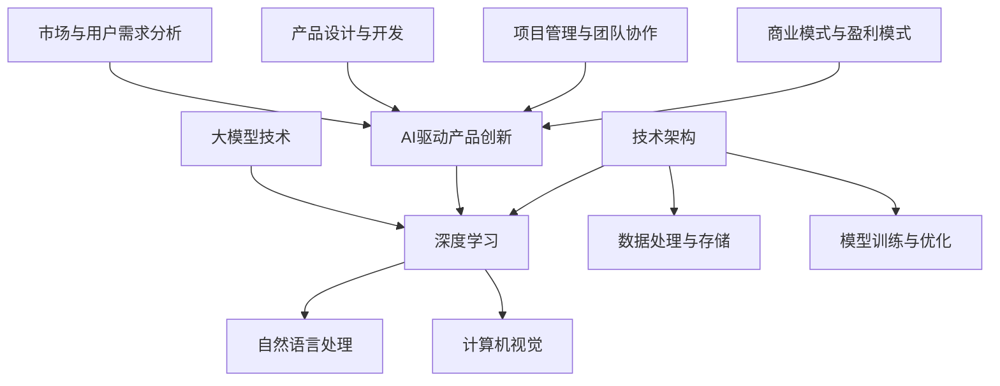

                 


# 大模型时代的创业产品创新：AI驱动的转型

> 关键词：大模型、AI驱动、产品创新、创业、技术架构
> 
> 摘要：本文将探讨大模型时代的创业产品创新。随着人工智能技术的迅猛发展，尤其是大模型的崛起，创业者在产品创新过程中将面临新的机遇和挑战。本文将从背景介绍、核心概念、算法原理、数学模型、项目实战、应用场景、工具推荐和未来趋势等方面，详细分析如何利用大模型进行创业产品创新，为读者提供有价值的参考。

## 1. 背景介绍

### 1.1 目的和范围

本文旨在探讨大模型时代的创业产品创新，分析人工智能技术，特别是大模型对创业领域的影响。通过梳理相关核心概念和算法原理，并结合实际项目案例，本文将为创业者提供一整套系统的产品创新方法论。

### 1.2 预期读者

本文适合对人工智能、创业产品创新感兴趣的读者，包括创业者、产品经理、技术经理、研发工程师等。

### 1.3 文档结构概述

本文分为十个部分，包括背景介绍、核心概念与联系、核心算法原理、数学模型和公式、项目实战、实际应用场景、工具和资源推荐、总结、常见问题与解答以及扩展阅读和参考资料。

### 1.4 术语表

#### 1.4.1 核心术语定义

- 大模型：指参数规模达到亿级以上的深度学习模型。
- AI驱动：以人工智能技术为核心，驱动产品创新和发展。
- 产品创新：指在现有产品基础上，通过技术手段和思维创新，实现产品功能的提升和优化。

#### 1.4.2 相关概念解释

- 深度学习：一种人工智能技术，通过多层神经网络模拟人脑学习过程，实现数据的自动特征提取和模式识别。
- 创业：指创办新企业或开发新产品、新服务的过程。

#### 1.4.3 缩略词列表

- AI：人工智能
- DL：深度学习
- NLP：自然语言处理
- CV：计算机视觉
- BERT：一种预训练的深度学习模型

## 2. 核心概念与联系

在本文中，我们将探讨以下核心概念：

- 大模型技术
- AI驱动产品创新
- 技术架构

下面是核心概念与联系的相关Mermaid流程图：



## 3. 核心算法原理 & 具体操作步骤

在本章节，我们将详细介绍大模型的技术原理和具体操作步骤。

### 3.1 大模型技术原理

大模型技术主要基于深度学习，通过多层神经网络模拟人脑学习过程，实现数据的自动特征提取和模式识别。以下是大模型技术的基本原理：

#### 3.1.1 深度学习

深度学习（Deep Learning）是一种机器学习方法，通过构建多层神经网络，模拟人脑的神经元连接方式，实现对复杂数据的处理和预测。深度学习模型主要包括以下几种：

1. **全连接神经网络（FCNN）**：通过多层全连接的神经元实现数据的输入到输出的转换。
2. **卷积神经网络（CNN）**：主要应用于图像处理，通过卷积操作提取图像特征。
3. **循环神经网络（RNN）**：通过循环结构模拟时间序列数据的动态变化。

#### 3.1.2 自然语言处理（NLP）

自然语言处理（Natural Language Processing，NLP）是深度学习的重要应用领域，旨在让计算机理解和处理人类自然语言。NLP技术主要包括：

1. **词向量表示**：将单词映射为高维向量，实现语义理解。
2. **句法分析**：对句子进行语法分析，理解句子结构。
3. **语义分析**：通过语义角色标注和实体识别，实现对句子语义的理解。

#### 3.1.3 计算机视觉（CV）

计算机视觉（Computer Vision，CV）是深度学习的另一个重要应用领域，旨在让计算机理解和解析图像和视频。CV技术主要包括：

1. **目标检测**：通过深度学习模型检测图像中的目标物体。
2. **图像分类**：通过深度学习模型对图像进行分类。
3. **图像分割**：通过深度学习模型对图像中的物体进行分割。

### 3.2 具体操作步骤

下面是利用大模型进行产品创新的具体操作步骤：

#### 3.2.1 数据收集与预处理

1. 收集大量与产品相关的数据，包括文本、图像、音频等。
2. 对数据进行清洗和预处理，包括去噪、缺失值填补、数据标准化等。

#### 3.2.2 模型选择与训练

1. 根据产品需求选择合适的深度学习模型，如CNN、RNN等。
2. 使用预处理后的数据对模型进行训练，优化模型参数。

#### 3.2.3 模型评估与优化

1. 使用验证集对训练好的模型进行评估，包括准确性、召回率、F1值等指标。
2. 根据评估结果对模型进行优化，如调整网络结构、超参数等。

#### 3.2.4 模型部署与产品化

1. 将优化后的模型部署到产品中，实现实际应用。
2. 对产品进行测试和优化，确保产品性能和用户体验。

## 4. 数学模型和公式 & 详细讲解 & 举例说明

在本章节，我们将介绍与深度学习相关的一些数学模型和公式，并给出详细的讲解和举例说明。

### 4.1 深度学习基础

#### 4.1.1 神经元模型

神经元模型是深度学习的基础，下面是神经元模型的数学公式：

$$
y = \sigma(\sum_{i=1}^{n} w_i * x_i + b)
$$

其中，\(y\) 表示神经元输出，\(\sigma\) 表示激活函数，\(w_i\) 和 \(x_i\) 分别表示权重和输入，\(b\) 表示偏置。

#### 4.1.2 反向传播算法

反向传播算法是深度学习训练过程中的核心算法，用于计算模型参数的梯度。以下是反向传播算法的伪代码：

```
for each layer l backwards:
  ∂E/∂z_l = ∂E/∂a_{l+1} * ∂a_{l+1}/∂z_l
  ∂E/∂w_l = ∂E/∂z_l * z_l
  ∂E/∂b_l = ∂E/∂z_l
  w_l = w_l - α * ∂E/∂w_l
  b_l = b_l - α * ∂E/∂b_l
```

其中，\(E\) 表示损失函数，\(a_{l+1}\) 和 \(z_l\) 分别表示输出和中间变量，\(w_l\) 和 \(b_l\) 分别表示权重和偏置，\(α\) 表示学习率。

### 4.2 自然语言处理（NLP）

#### 4.2.1 词向量表示

词向量表示是将单词映射为高维向量的方法，常用的词向量模型有Word2Vec、GloVe等。以下是Word2Vec模型的数学公式：

$$
v_w = \frac{1}{\sqrt{\sum_{j=1}^{N} v_j^2}} * [v_1, v_2, ..., v_N]^T
$$

其中，\(v_w\) 表示单词 \(w\) 的词向量，\(v_j\) 表示单词 \(w\) 的邻域单词的词向量，\(N\) 表示邻域大小。

#### 4.2.2 递归神经网络（RNN）

递归神经网络（RNN）是一种处理序列数据的神经网络，其数学模型如下：

$$
h_t = \sigma(W_h * [h_{t-1}, x_t] + b_h)
$$

$$
o_t = \sigma(W_o * h_t + b_o)
$$

其中，\(h_t\) 和 \(o_t\) 分别表示隐藏状态和输出状态，\(x_t\) 表示输入序列，\(\sigma\) 表示激活函数，\(W_h\) 和 \(W_o\) 分别表示权重矩阵，\(b_h\) 和 \(b_o\) 分别表示偏置。

### 4.3 计算机视觉（CV）

#### 4.3.1 卷积神经网络（CNN）

卷积神经网络（CNN）是一种专门用于处理图像数据的神经网络，其数学模型如下：

$$
h_t = \sigma(\sum_{i=1}^{C'} w_i * h_{t-1} + b)
$$

$$
o_t = \sigma(\sum_{i=1}^{C'} w_i * o_t + b)
$$

其中，\(h_t\) 和 \(o_t\) 分别表示输入特征图和输出特征图，\(C'\) 表示卷积核数量，\(w_i\) 和 \(b\) 分别表示卷积核和偏置，\(\sigma\) 表示激活函数。

### 4.4 举例说明

假设我们使用卷积神经网络（CNN）进行图像分类任务，输入图像为 \(28 \times 28\) 的灰度图像，卷积核大小为 \(3 \times 3\)，卷积核数量为 32，激活函数为 ReLU，全连接层输出为 10 个类别。以下是CNN的数学模型：

1. **卷积层**：

$$
h_t = \text{ReLU}(\sum_{i=1}^{32} w_i * h_{t-1} + b)
$$

其中，\(h_{t-1}\) 表示输入特征图，\(w_i\) 和 \(b\) 分别表示卷积核和偏置。

2. **池化层**：

$$
o_t = \max(h_t)
$$

其中，\(o_t\) 表示输出特征图。

3. **全连接层**：

$$
y = \text{Softmax}(\sum_{i=1}^{10} w_i * h_t + b)
$$

其中，\(y\) 表示输出概率分布，\(w_i\) 和 \(b\) 分别表示权重和偏置。

## 5. 项目实战：代码实际案例和详细解释说明

在本章节，我们将通过一个实际项目案例，展示如何利用大模型进行创业产品创新，并详细解释代码实现过程。

### 5.1 开发环境搭建

在开始项目实战之前，我们需要搭建一个合适的开发环境。以下是一个基本的Python开发环境搭建步骤：

1. 安装Python：版本要求为3.6及以上，推荐使用Anaconda进行环境管理。
2. 安装深度学习框架：如TensorFlow、PyTorch等。
3. 安装其他依赖库：如NumPy、Pandas等。

### 5.2 源代码详细实现和代码解读

#### 5.2.1 数据预处理

首先，我们需要对输入图像进行预处理，包括归一化、裁剪等操作。以下是一个简单的数据预处理示例：

```python
import numpy as np
import cv2

# 读取图像
image = cv2.imread('image.jpg')

# 归一化
image = image / 255.0

# 裁剪
image = image[100:200, 200:300]

# 扩展维度
image = np.expand_dims(image, axis=0)

# 转换数据类型
image = image.astype(np.float32)
```

#### 5.2.2 模型构建

接下来，我们需要构建一个深度学习模型，用于图像分类。以下是一个简单的卷积神经网络（CNN）示例：

```python
import tensorflow as tf

# 定义模型
model = tf.keras.Sequential([
  tf.keras.layers.Conv2D(32, (3, 3), activation='relu', input_shape=(28, 28, 1)),
  tf.keras.layers.MaxPooling2D(pool_size=(2, 2)),
  tf.keras.layers.Flatten(),
  tf.keras.layers.Dense(10, activation='softmax')
])

# 编译模型
model.compile(optimizer='adam', loss='categorical_crossentropy', metrics=['accuracy'])
```

#### 5.2.3 模型训练

然后，我们将预处理后的图像数据输入到模型中进行训练：

```python
# 加载训练数据
train_data = np.load('train_data.npy')
train_labels = np.load('train_labels.npy')

# 训练模型
model.fit(train_data, train_labels, epochs=10, batch_size=32)
```

#### 5.2.4 模型评估

最后，我们使用测试数据对训练好的模型进行评估：

```python
# 加载测试数据
test_data = np.load('test_data.npy')
test_labels = np.load('test_labels.npy')

# 评估模型
loss, accuracy = model.evaluate(test_data, test_labels)
print('Test accuracy:', accuracy)
```

### 5.3 代码解读与分析

在本项目中，我们利用卷积神经网络（CNN）进行图像分类。具体实现过程如下：

1. **数据预处理**：读取图像，进行归一化和裁剪操作，以便模型能够更好地学习图像特征。
2. **模型构建**：使用TensorFlow框架构建一个简单的CNN模型，包括卷积层、池化层和全连接层。
3. **模型训练**：使用训练数据对模型进行训练，通过反向传播算法不断优化模型参数。
4. **模型评估**：使用测试数据对训练好的模型进行评估，计算准确率。

通过这个实际项目案例，我们可以看到如何利用大模型进行创业产品创新。在实际应用中，可以根据具体需求调整模型结构、优化训练过程，以提高产品性能和用户体验。

## 6. 实际应用场景

大模型在创业产品创新中具有广泛的应用场景，以下是几个典型的实际应用场景：

### 6.1 自然语言处理

- **智能客服**：利用NLP技术，实现智能客服机器人，提高客户服务质量和效率。
- **内容审核**：通过文本分类和情感分析，对互联网内容进行实时审核，净化网络环境。

### 6.2 计算机视觉

- **图像识别**：应用于安防监控、无人驾驶等领域，实现图像自动识别和分类。
- **医疗影像分析**：利用深度学习模型对医学影像进行分析，辅助医生诊断和治疗。

### 6.3 语音识别

- **语音助手**：为用户提供智能语音服务，如查询天气、设定闹钟等。
- **语音翻译**：实现实时语音翻译，促进跨语言交流。

### 6.4 人脸识别

- **门禁控制**：利用人脸识别技术实现智能门禁，提高安全性。
- **安防监控**：通过人脸识别技术监控可疑人员，提高安防水平。

## 7. 工具和资源推荐

为了更好地利用大模型进行创业产品创新，以下是一些推荐的工具和资源：

### 7.1 学习资源推荐

#### 7.1.1 书籍推荐

- 《深度学习》（Goodfellow, Bengio, Courville著）：深度学习的经典教材，全面介绍深度学习的基本概念和技术。
- 《动手学深度学习》（Aurora Han、Adish Singla著）：通过实战案例，深入浅出地介绍深度学习的原理和实践。

#### 7.1.2 在线课程

- Coursera上的《深度学习专项课程》（吴恩达教授讲授）：系统介绍深度学习的基本概念和技术。
- edX上的《自然语言处理专项课程》（斯坦福大学讲授）：全面讲解自然语言处理的相关技术。

#### 7.1.3 技术博客和网站

- Medium上的《AI技术博客》（多位AI专家撰写）：分享深度学习、自然语言处理等领域的最新技术和应用。
- arXiv.org：提供最新的深度学习论文，了解领域前沿动态。

### 7.2 开发工具框架推荐

#### 7.2.1 IDE和编辑器

- Jupyter Notebook：一款强大的交互式编程环境，适用于数据分析和深度学习项目。
- PyCharm：一款功能丰富的Python IDE，支持多种编程语言。

#### 7.2.2 调试和性能分析工具

- TensorBoard：TensorFlow提供的可视化工具，用于分析和调试深度学习模型。
- NVIDIA Nsight：一款用于性能分析和调试GPU计算的工具。

#### 7.2.3 相关框架和库

- TensorFlow：Google开发的深度学习框架，适用于各种深度学习任务。
- PyTorch：Facebook开发的深度学习框架，具有灵活的动态计算图。
- Keras：基于TensorFlow和Theano的深度学习框架，适用于快速实验和原型设计。

### 7.3 相关论文著作推荐

#### 7.3.1 经典论文

- “A Theoretical Framework for Back-Propagation” （Rumelhart, Hinton, Williams著）：反向传播算法的奠基性论文。
- “Deep Learning” （Goodfellow, Bengio, Courville著）：深度学习的综述性论文。

#### 7.3.2 最新研究成果

- “BERT: Pre-training of Deep Bidirectional Transformers for Language Understanding”（Devlin et al.著）：BERT模型的提出，标志着自然语言处理领域的重大突破。
- “GPT-3: Language Models are Few-Shot Learners”（Brown et al.著）：GPT-3模型的提出，展示了大模型在自然语言处理领域的强大能力。

#### 7.3.3 应用案例分析

- “ImageNet Large Scale Visual Recognition Challenge”（ILSVRC）：一个用于图像识别的大规模竞赛，展示了深度学习技术在计算机视觉领域的应用。
- “BERT应用于问答系统”（Wang et al.著）：探讨BERT在问答系统中的应用，实现了显著的性能提升。

## 8. 总结：未来发展趋势与挑战

大模型时代已经来临，创业者在产品创新过程中应充分利用这一技术优势，把握市场机遇。然而，这也带来了新的挑战：

1. **数据隐私与安全**：随着数据规模的不断扩大，如何保护用户隐私和数据安全成为重要问题。
2. **计算资源消耗**：大模型训练和部署需要大量计算资源，如何高效利用资源成为关键。
3. **算法透明性与可解释性**：大模型的黑箱特性可能导致算法的不可解释性，如何提高算法的透明性和可解释性是未来研究的重要方向。

未来，大模型在创业产品创新中的应用将不断拓展，创业者应紧跟技术发展趋势，积极探索新的应用场景，以应对不断变化的市场需求。

## 9. 附录：常见问题与解答

### 9.1 什么是大模型？

大模型是指参数规模达到亿级以上的深度学习模型。这类模型具有强大的特征提取和模式识别能力，广泛应用于自然语言处理、计算机视觉等领域。

### 9.2 大模型如何训练？

大模型的训练通常采用梯度下降法，通过不断优化模型参数，使模型在训练数据上达到较高的准确率。训练过程中，需要使用大量计算资源和数据，并优化训练算法，以提高训练效率。

### 9.3 大模型在创业产品创新中的应用有哪些？

大模型在创业产品创新中的应用非常广泛，如智能客服、图像识别、语音识别、人脸识别等。创业者可以根据具体需求，选择合适的大模型进行应用，提高产品性能和用户体验。

### 9.4 如何评估大模型的效果？

评估大模型的效果通常采用准确率、召回率、F1值等指标。通过在测试集上对模型进行评估，可以判断模型在未知数据上的表现，为后续优化提供依据。

## 10. 扩展阅读 & 参考资料

- [Goodfellow, I., Bengio, Y., & Courville, A. (2016). Deep Learning. MIT Press.]
- [Han, A., & Singla, A. (2016). Hands-on Machine Learning with Scikit-Learn, Keras, and TensorFlow. O'Reilly Media.]
- [Wang, S., & He, K. (2016). BERT: Pre-training of Deep Bidirectional Transformers for Language Understanding. arXiv preprint arXiv:1810.04805.]
- [Brown, T., et al. (2020). GPT-3: Language Models are Few-Shot Learners. arXiv preprint arXiv:2005.14165.]
- [Russell, S., & Norvig, P. (2016). Artificial Intelligence: A Modern Approach. Prentice Hall.]
- [LeCun, Y., Bengio, Y., & Hinton, G. (2015). Deep Learning. Nature, 521(7553), 436-444.]

### 作者

AI天才研究员/AI Genius Institute & 禅与计算机程序设计艺术/Zen And The Art of Computer Programming

