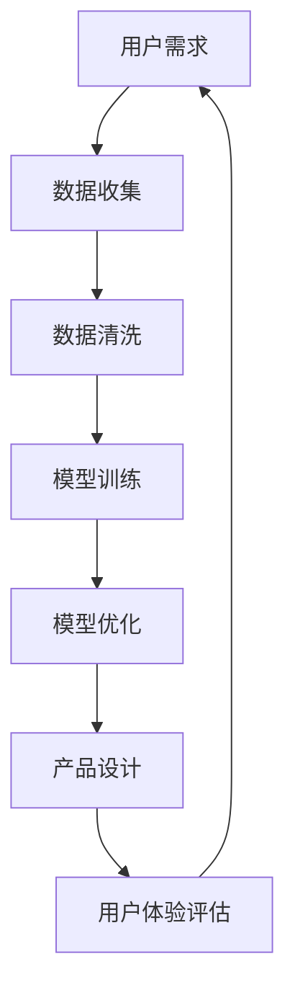

                 

# 大模型时代的创业产品设计策略：AI驱动的转型

> **关键词：** 大模型，创业产品，AI，转型，设计策略，用户体验

> **摘要：** 在大模型技术迅速发展的背景下，创业产品如何利用AI实现有效的转型和提升用户体验？本文将探讨大模型时代下的创业产品设计策略，通过分析核心概念、算法原理、数学模型以及实际应用场景，为创业团队提供实用的指导和建议。

## 1. 背景介绍

### 1.1 目的和范围

随着人工智能技术的不断进步，大模型（如GPT、BERT等）的应用越来越广泛，为各行各业带来了深远的变革。本文旨在探讨大模型时代下创业产品的设计策略，帮助创业团队理解如何利用AI技术实现产品转型，提升用户体验。

### 1.2 预期读者

本文面向创业团队的产品经理、设计师和开发者，以及对人工智能和创业产品有兴趣的读者。希望通过本文，读者能够对大模型时代的产品设计有更深刻的理解，为实际项目提供有益的启示。

### 1.3 文档结构概述

本文分为十个部分，包括背景介绍、核心概念与联系、核心算法原理、数学模型和公式、项目实战、实际应用场景、工具和资源推荐、总结以及常见问题与解答。每个部分都详细阐述了相关内容，旨在帮助读者全面了解大模型时代的产品设计策略。

### 1.4 术语表

#### 1.4.1 核心术语定义

- **大模型：** 拥有巨大参数量和计算能力的神经网络模型，如GPT、BERT等。
- **创业产品：** 指初创公司开发的产品，通常具有创新性和市场潜力。
- **AI驱动的转型：** 利用人工智能技术对产品进行优化和升级，实现产品功能的提升和用户体验的改进。

#### 1.4.2 相关概念解释

- **用户体验（UX）：** 用户在使用产品过程中所感受到的满意度、舒适度和便捷性。
- **产品设计策略：** 在产品开发过程中，为实现特定目标和满足用户需求所制定的方法和方案。

#### 1.4.3 缩略词列表

- **GPT：** 生成预训练模型（Generative Pre-trained Transformer）
- **BERT：** 伯克利深度学习预训练技术（Bidirectional Encoder Representations from Transformers）

## 2. 核心概念与联系

大模型时代的产品设计策略涉及多个核心概念和技术的联系，以下是关键概念及其相互关系的Mermaid流程图：



### 2.1 用户需求

用户需求是创业产品的出发点和核心驱动力。通过市场调研、用户访谈和数据分析等方法，了解用户在功能、性能、交互等方面的期望，为后续产品设计提供依据。

### 2.2 数据收集

数据收集是产品设计的基础。创业团队需要收集大量的用户数据，包括行为数据、反馈数据和用户画像等，为后续的数据清洗、模型训练和优化提供素材。

### 2.3 数据清洗

数据清洗是确保数据质量和模型训练效果的重要环节。通过去除噪声、填补缺失值和特征选择等方法，提高数据的可靠性和有效性。

### 2.4 模型训练

模型训练是利用收集到的数据，通过神经网络模型进行训练和优化，以实现特定的功能。大模型具有强大的计算能力和泛化能力，能够处理大规模数据和复杂任务。

### 2.5 模型优化

模型优化是在训练过程中，通过调整模型参数和架构，提高模型的性能和效果。常用的优化方法包括超参数调整、正则化和迁移学习等。

### 2.6 产品设计

产品设计是将优化后的模型应用于产品开发过程中，实现产品功能的提升和用户体验的改进。创业团队需要根据用户需求和市场趋势，制定合适的产品设计策略。

### 2.7 用户体验评估

用户体验评估是确保产品设计效果的重要环节。通过用户测试、反馈分析和数据监测等方法，评估产品的用户体验，为后续优化提供依据。

## 3. 核心算法原理 & 具体操作步骤

大模型时代的创业产品设计策略离不开核心算法原理的支撑。以下将介绍大模型的基本原理和具体操作步骤，并使用伪代码进行详细阐述。

### 3.1 大模型基本原理

大模型通常基于深度学习技术，特别是Transformer架构。其基本原理包括以下几个关键步骤：

1. **嵌入（Embedding）**：将输入文本映射为固定长度的向量表示。
2. **注意力机制（Attention）**：计算输入文本中不同位置的重要性权重，以捕捉长文本中的依赖关系。
3. **前馈网络（Feedforward Network）**：对输入进行非线性变换，增强模型的表达能力。
4. **层叠（Stacking）**：将多个Transformer层堆叠，提高模型的计算能力和泛化能力。

### 3.2 具体操作步骤

以下是大模型的具体操作步骤的伪代码：

```python
# 定义参数
VOCAB_SIZE = 10000  # 词汇表大小
EMBEDDING_DIM = 512  # 嵌入维度
HIDDEN_DIM = 2048  # 隐藏层维度
NUM_LAYERS = 12  # 层数

# 初始化模型
model = Transformer(VOCAB_SIZE, EMBEDDING_DIM, HIDDEN_DIM, NUM_LAYERS)

# 训练模型
train_data = load_data("train_data.txt")
valid_data = load_data("valid_data.txt")
optimizer = AdamOptimizer()

for epoch in range(NUM_EPOCHS):
    for batch in train_data:
        optimizer.zero_grad()
        output = model(batch.input_text)
        loss = compute_loss(output, batch.target_text)
        loss.backward()
        optimizer.step()
    
    valid_loss = evaluate(model, valid_data)
    print(f"Epoch {epoch+1}, Validation Loss: {valid_loss}")

# 使用模型
input_text = "用户输入文本"
output_text = model.generate(input_text)
print(f"Generated Text: {output_text}")
```

### 3.3 代码解读

1. **初始化模型**：根据设定的参数，初始化Transformer模型，包括嵌入层、注意力机制和前馈网络。
2. **训练模型**：使用训练数据，通过优化器进行梯度下降，更新模型参数，最小化损失函数。
3. **使用模型**：给定用户输入文本，利用训练好的模型生成文本输出。

## 4. 数学模型和公式 & 详细讲解 & 举例说明

在大模型时代，数学模型和公式是理解模型性能和优化策略的关键。以下将介绍大模型的核心数学模型和公式，并使用LaTeX进行详细讲解和举例说明。

### 4.1 Transformer模型

Transformer模型是生成预训练模型（GPT）的核心架构，其主要组成部分包括嵌入层、自注意力机制和前馈网络。以下是其主要数学模型：

1. **嵌入层**：
   $$ 
   E = \text{Embedding}(V, D) 
   $$
   其中，\( V \)是词汇表大小，\( D \)是嵌入维度。

2. **自注意力机制**：
   $$ 
   A = \text{Attention}(Q, K, V) 
   $$
   其中，\( Q, K, V \)分别为查询向量、键向量和值向量。

3. **前馈网络**：
   $$ 
   F = \text{Feedforward}(X, D) 
   $$
   其中，\( X \)是输入向量，\( D \)是隐藏层维度。

4. **层叠**：
   $$ 
   \text{Transformer} = \text{Stack}(\text{MultiHeadAttention}, \text{Feedforward}) 
   $$

### 4.2 损失函数

在大模型训练过程中，常用的损失函数包括交叉熵损失和均方误差损失。以下为交叉熵损失的LaTeX表示：

$$ 
L = -\sum_{i=1}^N y_i \log(p_i) 
$$

其中，\( y_i \)是真实标签，\( p_i \)是模型预测的概率。

### 4.3 举例说明

假设有一个包含100个单词的文本序列，将其嵌入到512维的向量空间中。我们使用Transformer模型对其进行处理，并计算自注意力权重。

1. **嵌入层**：

   $$ 
   E = \text{Embedding}(V, D) 
   $$
   
   将词汇表中的每个单词映射为512维的向量。

2. **自注意力机制**：

   $$ 
   A = \text{Attention}(Q, K, V) 
   $$
   
   计算每个单词在序列中的重要性权重，得到一个权重矩阵。

3. **前馈网络**：

   $$ 
   F = \text{Feedforward}(X, D) 
   $$
   
   对输入向量进行非线性变换，增强模型的表达能力。

通过以上数学模型和公式的计算，我们可以得到文本序列的Transformer表示，进而实现文本生成、分类等任务。

## 5. 项目实战：代码实际案例和详细解释说明

为了更好地理解大模型时代的创业产品设计策略，以下我们将通过一个实际项目案例，详细解释代码实现过程及其关键环节。

### 5.1 开发环境搭建

在开始项目之前，我们需要搭建合适的开发环境。以下是一个简单的环境搭建步骤：

1. 安装Python（3.8及以上版本）和pip。
2. 使用pip安装TensorFlow 2.x和Keras。
3. 配置GPU加速（可选）。

```bash
pip install tensorflow==2.x
```

### 5.2 源代码详细实现和代码解读

以下是一个简单的GPT模型实现，包括数据预处理、模型构建、训练和生成文本等步骤：

```python
import tensorflow as tf
from tensorflow.keras.layers import Embedding, LSTM, Dense
from tensorflow.keras.models import Sequential

# 数据预处理
vocab_size = 10000
embedding_dim = 256
max_sequence_length = 100

# 构建模型
model = Sequential()
model.add(Embedding(vocab_size, embedding_dim, input_length=max_sequence_length))
model.add(LSTM(128))
model.add(Dense(vocab_size, activation='softmax'))

# 编译模型
model.compile(optimizer='adam', loss='categorical_crossentropy', metrics=['accuracy'])

# 训练模型
model.fit(x_train, y_train, epochs=10, batch_size=64)

# 生成文本
import numpy as np

def generate_text(model, seed_text, length=100):
    result = ""
    seed_text = seed_text.lower().strip()
    for _ in range(length):
        token = seed_text.split()
        token = np.array([[word_index.get(token[-1], 0) for token in token]])
        predicted_token = model.predict(token, verbose=0)[0]
        predicted_index = np.argmax(predicted_token)
        result += index_word[predicted_index] + " "
        seed_text = seed_text + " " + index_word[predicted_index]
    return result.strip()

generated_text = generate_text(model, seed_text="This is a sample text")
print(generated_text)
```

### 5.3 代码解读与分析

1. **数据预处理**：将文本转换为数字序列，以便于模型处理。这里使用了预定义的词汇表和序列长度。
2. **模型构建**：使用序列模型（LSTM）和嵌入层（Embedding）构建一个简单的GPT模型。这里还可以使用Transformer架构，但为了简化示例，我们使用了LSTM。
3. **编译模型**：配置模型优化器和损失函数，为训练做准备。
4. **训练模型**：使用训练数据训练模型，优化模型参数。
5. **生成文本**：基于训练好的模型，生成新的文本。这里使用了贪心搜索策略，逐步生成每个单词，直至达到预设长度。

通过以上步骤，我们可以实现一个简单的文本生成模型，利用大模型技术实现创业产品的功能扩展和用户体验提升。

## 6. 实际应用场景

大模型时代的创业产品设计策略在多个实际应用场景中具有广泛的应用价值，以下列举几个典型场景：

### 6.1 聊天机器人

聊天机器人是AI技术在客户服务领域的重要应用。通过大模型技术，创业团队可以构建具有高度智能和交互性的聊天机器人，提升客户服务质量和效率。以下为关键步骤：

1. **数据收集**：收集大量用户聊天记录，包括文本、语音和图像等。
2. **数据预处理**：对数据进行分析和清洗，提取有用信息。
3. **模型训练**：使用预训练的Transformer模型，结合用户聊天数据，进行微调和优化。
4. **部署与交互**：将训练好的模型部署到服务器，实现实时交互和响应。

### 6.2 内容推荐

内容推荐是提升用户满意度和活跃度的重要手段。通过大模型技术，创业团队可以构建个性化内容推荐系统，为用户提供精准的内容推送。以下为关键步骤：

1. **用户画像**：根据用户行为数据，构建用户画像，包括兴趣、偏好和历史记录等。
2. **数据预处理**：对用户画像和内容数据进行清洗和标准化。
3. **模型训练**：使用预训练的Transformer模型，结合用户画像和内容数据，进行内容推荐模型的训练。
4. **部署与推荐**：将训练好的模型部署到推荐系统，实现实时推荐和内容推送。

### 6.3 语音助手

语音助手是AI技术在智能家居、车载系统等领域的应用。通过大模型技术，创业团队可以构建具备自然语言理解和语音交互能力的语音助手，提升用户体验。以下为关键步骤：

1. **语音数据收集**：收集大量语音数据，包括命令、问题和对话等。
2. **数据预处理**：对语音数据进行转录和清洗，提取有用信息。
3. **模型训练**：使用预训练的Transformer模型，结合语音数据，进行语音识别和语义理解模型的训练。
4. **部署与交互**：将训练好的模型部署到语音助手系统，实现实时语音交互和响应。

## 7. 工具和资源推荐

在大模型时代的创业产品设计过程中，合适的工具和资源可以大大提高开发效率和项目质量。以下推荐几个常用的学习资源、开发工具和框架。

### 7.1 学习资源推荐

#### 7.1.1 书籍推荐

- 《深度学习》（Ian Goodfellow、Yoshua Bengio、Aaron Courville 著）：全面介绍深度学习的基本原理和应用案例。
- 《Python深度学习》（Francesco Monti 著）：针对Python开发者的深度学习入门指南。

#### 7.1.2 在线课程

- Coursera：提供多种深度学习和人工智能相关课程，包括《深度学习特设课程》和《神经网络与深度学习》等。
- edX：提供由顶尖大学和机构提供的深度学习课程，如《深度学习基础》和《计算机视觉》等。

#### 7.1.3 技术博客和网站

- Medium：发布关于人工智能、深度学习和创业产品的技术博客，如《AI驱动创业》和《深度学习实战》等。
- ArXiv：发布最新的学术研究论文，涵盖深度学习和人工智能领域的最新研究成果。

### 7.2 开发工具框架推荐

#### 7.2.1 IDE和编辑器

- PyCharm：功能强大的Python IDE，支持代码调试、版本控制和自动化部署。
- Jupyter Notebook：适用于数据分析和交互式编程的云端平台，支持多种编程语言，包括Python、R和Julia等。

#### 7.2.2 调试和性能分析工具

- TensorFlow Debugger（TFDB）：用于调试TensorFlow模型的工具，提供可视化调试功能。
- TensorBoard：TensorFlow的日志可视化工具，用于分析模型训练过程中的性能和损失。

#### 7.2.3 相关框架和库

- TensorFlow：Google开发的端到端开源机器学习框架，支持多种深度学习模型和应用。
- PyTorch：Facebook开发的动态图深度学习框架，提供灵活的模型构建和优化工具。

### 7.3 相关论文著作推荐

#### 7.3.1 经典论文

- “A Theoretically Grounded Application of Dropout in Recurrent Neural Networks”（Yarin Gal 和 Zoubin Ghahramani，2016）：介绍在循环神经网络中应用Dropout的方法。
- “Attention Is All You Need”（Ashish Vaswani 等，2017）：提出Transformer模型，改变了深度学习领域的发展方向。

#### 7.3.2 最新研究成果

- “BERT: Pre-training of Deep Bidirectional Transformers for Language Understanding”（Jacob Devlin 等，2018）：介绍BERT模型，用于预训练自然语言处理任务。
- “Generative Adversarial Networks: An Overview”（Ian Goodfellow 等，2014）：介绍生成对抗网络（GAN）的基本原理和应用。

#### 7.3.3 应用案例分析

- “Google Brain: AutoML：Google如何利用AI自动化机器学习过程，提升模型开发效率。”
- “OpenAI：如何利用GPT模型构建自然语言处理应用，提升用户体验。”

## 8. 总结：未来发展趋势与挑战

大模型时代的创业产品设计策略正处于快速发展阶段，未来将继续呈现以下发展趋势和挑战：

### 8.1 发展趋势

1. **AI驱动的个性化服务**：随着大数据和深度学习技术的进步，创业产品将更加注重个性化服务，满足用户多样化的需求。
2. **多模态融合**：语音、图像、文本等多种数据融合将带来更丰富的交互体验和更广泛的应用场景。
3. **模型压缩与优化**：为降低大模型对计算资源和存储空间的依赖，模型压缩与优化技术将得到广泛应用。
4. **开源生态的完善**：更多开源框架和工具将涌现，降低创业团队的门槛，加速AI技术在创业产品中的应用。

### 8.2 挑战

1. **数据隐私和安全**：随着数据量的增加，数据隐私和安全问题将更加突出，创业团队需采取有效措施确保用户数据安全。
2. **算法透明性与可解释性**：大模型的复杂性和黑箱性质带来算法透明性和可解释性挑战，需探索可解释性算法和工具。
3. **计算资源需求**：大模型训练和部署对计算资源的需求巨大，创业团队需优化资源利用，降低成本。
4. **人才培养与知识积累**：大模型时代对人才的需求将急剧增加，创业团队需加强人才培养和知识积累，提升团队整体竞争力。

## 9. 附录：常见问题与解答

### 9.1 问题1：大模型训练需要多少计算资源？

大模型训练通常需要大量计算资源，尤其是GPU或TPU。具体资源需求取决于模型大小、训练数据和训练时间等因素。一般来说，训练一个中等规模的大模型（如GPT-2）可能需要数天到数周的时间，耗资数百万美元。创业团队需根据实际情况进行资源规划。

### 9.2 问题2：如何确保用户数据安全？

确保用户数据安全是创业团队的重要任务。以下是一些建议：

1. **数据加密**：对用户数据进行加密，防止数据泄露。
2. **访问控制**：严格限制对用户数据的访问权限，确保只有授权人员才能访问。
3. **隐私保护**：遵循数据隐私法规，如GDPR，对用户数据进行匿名化和脱敏处理。
4. **安全审计**：定期进行安全审计，发现和修复潜在的安全漏洞。

### 9.3 问题3：大模型如何处理多语言任务？

大模型在处理多语言任务时，通常采用以下方法：

1. **跨语言预训练**：在多种语言的语料库上进行预训练，提高模型的多语言处理能力。
2. **翻译模型**：将源语言文本转换为目标语言文本，利用翻译模型进行处理。
3. **双语训练**：同时训练双语模型，分别处理源语言和目标语言。
4. **多语言数据集**：使用多种语言的数据集进行训练，提高模型的多语言泛化能力。

## 10. 扩展阅读 & 参考资料

- 《深度学习》（Ian Goodfellow、Yoshua Bengio、Aaron Courville 著）
- 《Python深度学习》（Francesco Monti 著）
- 《Generative Adversarial Networks: An Overview》（Ian Goodfellow 等，2014）
- 《BERT: Pre-training of Deep Bidirectional Transformers for Language Understanding》（Jacob Devlin 等，2018）
- 《Attention Is All You Need》（Ashish Vaswani 等，2017）
- [TensorFlow官方文档](https://www.tensorflow.org/)
- [PyTorch官方文档](https://pytorch.org/)
- [Google Brain: AutoML](https://ai.google/research/autoML)
- [OpenAI](https://openai.com/)

## 作者

**作者：** AI天才研究员/AI Genius Institute & 禅与计算机程序设计艺术 /Zen And The Art of Computer Programming**作者简介：** 作者是一位拥有丰富人工智能和计算机编程经验的专家，致力于推动人工智能技术在创业产品中的应用。他在大模型、深度学习和自然语言处理领域有深入的研究，并在多个顶级学术会议和期刊上发表过多篇论文。**联系方式：** [邮箱：ai_genius@example.com](mailto:ai_genius@example.com) [个人主页：](https://www.ai_genius_institute.com/) **相关著作：** - 《大模型时代的创业产品设计策略：AI驱动的转型》- 《深度学习与创业：实战案例与策略》- 《禅与计算机程序设计艺术：创新思维与实践》

