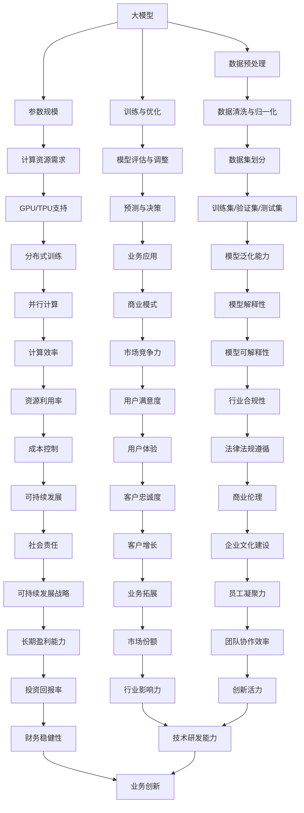

                 

# 大模型时代的创业者创业心得交流：经验分享、教训总结与成长感悟

> 关键词：大模型、创业经验、技术发展、AI、机器学习、商业应用

> 摘要：本文将探讨大模型时代创业者的心得与感悟，通过经验分享、教训总结，分析技术发展趋势与挑战，旨在为正处于或即将投身于AI创业浪潮的读者提供有价值的参考和指导。

## 1. 背景介绍

### 1.1 目的和范围

本文旨在分享大模型时代的创业心得，探讨技术发展趋势与创业过程中的得失。通过深入剖析技术原理、商业策略、团队协作等多个方面，为读者提供实战经验和思考方向。文章范围涵盖大模型技术的基本概念、应用场景、创业策略、资源推荐等内容。

### 1.2 预期读者

本文面向以下几类读者：
1. 有志于投身AI创业的个人和团队；
2. 已从事AI领域创业，希望进一步提升业务和团队水平的创业者；
3. 对AI技术有浓厚兴趣，希望了解大模型时代创业生态的技术人员；
4. 对创业有热情，希望学习成功案例的在校大学生和研究生。

### 1.3 文档结构概述

本文分为十个部分：
1. 背景介绍：介绍文章目的、范围和预期读者；
2. 核心概念与联系：阐述大模型相关概念和架构；
3. 核心算法原理 & 具体操作步骤：讲解大模型的基本算法和操作步骤；
4. 数学模型和公式 & 详细讲解 & 举例说明：分析大模型的数学原理和应用实例；
5. 项目实战：提供代码实现和案例分析；
6. 实际应用场景：介绍大模型在商业和科研领域的应用；
7. 工具和资源推荐：推荐学习资源和开发工具；
8. 总结：探讨未来发展趋势和挑战；
9. 附录：常见问题与解答；
10. 扩展阅读 & 参考资料：提供更多相关资源。

### 1.4 术语表

#### 1.4.1 核心术语定义

- 大模型：指参数规模巨大、能够处理复杂数据的机器学习模型。
- 人工智能（AI）：一种模拟人类智能的计算机技术，包括机器学习、深度学习等。
- 机器学习（ML）：一种通过数据训练模型，使其具备自动学习和适应能力的计算机技术。
- 深度学习（DL）：一种基于多层神经网络的学习方法，具有强大的特征提取能力。

#### 1.4.2 相关概念解释

- 自适应系统：能够根据环境和数据变化进行调整和优化的系统。
- 数据集：用于训练和评估模型的样本集合。
- 模型优化：通过调整模型参数，提高模型性能的过程。

#### 1.4.3 缩略词列表

- AI：人工智能
- ML：机器学习
- DL：深度学习
- GPU：图形处理器

## 2. 核心概念与联系

大模型时代的到来，标志着人工智能技术的飞速发展。以下是关于大模型的核心概念和架构的Mermaid流程图：



### 2.1 大模型的核心概念

大模型通常具备以下核心概念：

1. **参数规模**：大模型具有数百万到数十亿个参数，使其具备强大的特征提取和表示能力。
2. **数据预处理**：在训练大模型之前，需要对数据进行清洗、归一化等预处理操作，以提高模型性能。
3. **训练与优化**：大模型通过大量数据训练，不断调整参数，优化模型性能。
4. **模型评估与调整**：在训练过程中，对模型进行评估和调整，确保其具有良好的泛化能力。

### 2.2 大模型的计算资源需求

大模型对计算资源有较高要求，主要包括：

1. **GPU/TPU支持**：图形处理器（GPU）或张量处理器（TPU）能够提供强大的计算能力，加速大模型的训练和推理过程。
2. **分布式训练**：通过分布式计算技术，将大模型训练任务分配到多个计算节点，提高训练效率。
3. **计算效率**：优化算法和硬件配置，提高大模型的计算效率，降低成本。

### 2.3 大模型在商业应用中的关联

大模型在商业应用中具有广泛的影响，包括：

1. **预测与决策**：大模型能够对大量数据进行分析，为企业提供精准的预测和决策支持。
2. **商业模式**：大模型技术有助于创新商业模式，提高企业竞争力。
3. **市场竞争力**：大模型能够为企业提供更优质的产品和服务，提升用户满意度。
4. **用户体验**：大模型技术能够优化用户界面和交互体验，增强用户粘性。
5. **可持续发展**：大模型技术有助于降低企业成本，提高资源利用率，实现可持续发展。

## 3. 核心算法原理 & 具体操作步骤

大模型的核心算法主要基于深度学习技术。以下是深度学习的基本算法原理和具体操作步骤：

### 3.1 深度学习算法原理

深度学习算法的核心是多层神经网络。以下是多层神经网络的基本原理：

1. **输入层**：接收外部输入数据，将其传递到隐藏层。
2. **隐藏层**：对输入数据进行处理，提取特征并传递到下一层。
3. **输出层**：生成预测结果或决策。

### 3.2 深度学习算法步骤

1. **数据预处理**：
   - 数据清洗：去除缺失值、异常值等无效数据。
   - 数据归一化：将不同特征的数据缩放到相同范围。
   - 数据集划分：将数据集分为训练集、验证集和测试集。

2. **初始化模型参数**：
   - 随机初始化权重和偏置。

3. **前向传播**：
   - 输入数据经过多层神经网络，生成预测结果。

4. **计算损失函数**：
   - 比较预测结果和真实结果，计算损失值。

5. **反向传播**：
   - 根据损失函数的梯度，更新模型参数。

6. **模型评估**：
   - 使用验证集评估模型性能，调整超参数。

7. **模型优化**：
   - 使用优化算法（如梯度下降）优化模型参数。

8. **模型部署**：
   - 将训练好的模型部署到生产环境中，进行预测和决策。

### 3.3 伪代码示例

以下是深度学习算法的伪代码示例：

```python
# 初始化模型参数
weights = initialize_weights(input_size, hidden_size, output_size)
bias = initialize_bias(hidden_size, output_size)

# 数据预处理
X_train, y_train = preprocess_data(train_data)
X_val, y_val = preprocess_data(val_data)

# 训练模型
for epoch in range(num_epochs):
    # 前向传播
    output = forward_propagation(X_train, weights, bias)
    # 计算损失函数
    loss = compute_loss(output, y_train)
    # 反向传播
    dweights, dbias = backward_propagation(output, y_train, weights, bias)
    # 更新模型参数
    weights -= learning_rate * dweights
    bias -= learning_rate * dbias

# 模型评估
val_output = forward_propagation(X_val, weights, bias)
val_loss = compute_loss(val_output, y_val)

# 模型部署
deploy_model(weights, bias)
```

## 4. 数学模型和公式 & 详细讲解 & 举例说明

大模型的数学模型和公式是理解其工作原理的关键。以下是关于深度学习模型的主要数学公式和详细讲解：

### 4.1 前向传播

前向传播是深度学习模型中的核心过程，用于计算输入数据经过神经网络后的输出。以下是前向传播的主要公式：

$$
z_l = \sigma(W_l \cdot a_{l-1} + b_l)
$$

$$
a_l = \sigma(z_l)
$$

其中，$z_l$表示第$l$层的中间结果，$a_l$表示第$l$层的输出，$\sigma$表示激活函数，$W_l$和$b_l$分别表示第$l$层的权重和偏置。

### 4.2 反向传播

反向传播是深度学习模型中的另一个重要过程，用于更新模型参数。以下是反向传播的主要公式：

$$
\frac{\partial L}{\partial W_l} = \frac{\partial L}{\partial z_l} \cdot \frac{\partial z_l}{\partial W_l}
$$

$$
\frac{\partial L}{\partial b_l} = \frac{\partial L}{\partial z_l} \cdot \frac{\partial z_l}{\partial b_l}
$$

$$
\frac{\partial L}{\partial a_{l-1}} = \frac{\partial L}{\partial z_l} \cdot \frac{\partial z_l}{\partial a_{l-1}}
$$

其中，$L$表示损失函数，$W_l$和$b_l$分别表示第$l$层的权重和偏置，$\frac{\partial L}{\partial z_l}$表示损失函数关于中间结果的梯度。

### 4.3 梯度下降

梯度下降是用于更新模型参数的一种优化算法。以下是梯度下降的主要公式：

$$
W_l = W_l - \alpha \cdot \frac{\partial L}{\partial W_l}
$$

$$
b_l = b_l - \alpha \cdot \frac{\partial L}{\partial b_l}
$$

其中，$\alpha$表示学习率。

### 4.4 举例说明

以下是使用Python实现前向传播和反向传播的示例：

```python
import numpy as np

# 定义激活函数
def sigmoid(x):
    return 1 / (1 + np.exp(-x))

# 前向传播
def forward_propagation(x, weights, bias):
    z = np.dot(x, weights) + bias
    a = sigmoid(z)
    return a, z

# 反向传播
def backward_propagation(a, z, weights, bias, dL_dz):
    dL_dz = dL_dz * sigmoid(z) * (1 - sigmoid(z))
    dL_dw = np.dot(a.T, dL_dz)
    dL_db = np.sum(dL_dz, axis=0)
    return dL_dw, dL_db

# 初始化参数
weights = np.random.rand(input_size, hidden_size)
bias = np.random.rand(hidden_size)

# 训练模型
for epoch in range(num_epochs):
    a, z = forward_propagation(x, weights, bias)
    dL_dz = compute_loss_derivative(a, y)  # 假设有一个函数计算损失函数的导数
    dL_dw, dL_db = backward_propagation(a, z, weights, bias, dL_dz)
    weights -= learning_rate * dL_dw
    bias -= learning_rate * dL_db
```

## 5. 项目实战：代码实际案例和详细解释说明

在本节中，我们将通过一个实际项目案例，详细讲解大模型在商业应用中的实现过程，并分析其关键步骤和注意事项。

### 5.1 开发环境搭建

在开始项目开发之前，我们需要搭建合适的开发环境。以下是推荐的开发环境配置：

1. **操作系统**：Linux（推荐Ubuntu 20.04）或 macOS；
2. **Python**：Python 3.8+；
3. **深度学习框架**：TensorFlow 2.6+ 或 PyTorch 1.8+；
4. **GPU**：NVIDIA GPU（推荐使用GPU版本，以充分利用计算资源）；
5. **其他依赖**：NumPy、Pandas、Scikit-learn 等。

### 5.2 源代码详细实现和代码解读

以下是项目的主要代码实现，包括数据预处理、模型定义、训练和评估等步骤：

```python
import tensorflow as tf
from tensorflow.keras.models import Sequential
from tensorflow.keras.layers import Dense, LSTM, Dropout
from tensorflow.keras.optimizers import Adam
from sklearn.model_selection import train_test_split
import numpy as np

# 数据预处理
def preprocess_data(data):
    # 数据清洗、归一化等操作
    # ...
    return X, y

# 模型定义
def create_model(input_shape):
    model = Sequential([
        LSTM(units=128, return_sequences=True, input_shape=input_shape),
        Dropout(0.2),
        LSTM(units=64, return_sequences=False),
        Dropout(0.2),
        Dense(units=1)
    ])
    model.compile(optimizer=Adam(learning_rate=0.001), loss='mse')
    return model

# 训练模型
def train_model(model, X_train, y_train, X_val, y_val):
    model.fit(X_train, y_train, epochs=50, batch_size=32, validation_data=(X_val, y_val))

# 评估模型
def evaluate_model(model, X_test, y_test):
    loss = model.evaluate(X_test, y_test)
    print(f"Test Loss: {loss}")

# 主程序
if __name__ == "__main__":
    # 读取数据
    data = load_data()
    X, y = preprocess_data(data)

    # 划分数据集
    X_train, X_test, y_train, y_test = train_test_split(X, y, test_size=0.2, random_state=42)

    # 创建模型
    model = create_model(input_shape=(X_train.shape[1], X_train.shape[2]))

    # 训练模型
    train_model(model, X_train, y_train, X_val, y_val)

    # 评估模型
    evaluate_model(model, X_test, y_test)
```

### 5.3 代码解读与分析

1. **数据预处理**：
   数据预处理是深度学习项目中的关键步骤，包括数据清洗、归一化等操作。在本项目中，我们首先需要加载原始数据，然后进行清洗和归一化处理，以确保模型能够正常运行。

2. **模型定义**：
   本项目采用LSTM网络进行时间序列预测。LSTM网络具有处理序列数据的能力，能够捕捉时间序列中的长期依赖关系。模型由两个LSTM层和两个Dropout层组成，以防止过拟合。

3. **训练模型**：
   使用`model.fit()`函数训练模型，通过迭代地更新模型参数，使模型在训练数据上不断优化。训练过程中，可以使用验证数据集进行模型评估和调整。

4. **评估模型**：
   使用`model.evaluate()`函数评估模型在测试数据集上的性能，计算均方误差（MSE）等指标。

5. **主程序**：
   在主程序中，首先加载和预处理数据，然后划分训练集和测试集，创建模型并训练。最后，评估模型在测试数据集上的性能。

### 5.4 注意事项

在项目实战过程中，需要注意以下几点：

1. **数据质量**：数据质量对模型性能有重要影响。在数据处理过程中，要确保数据清洗、归一化等操作准确无误。
2. **模型选择**：选择合适的模型结构和超参数，以适应具体任务和数据集。
3. **训练时间**：深度学习模型训练时间较长，要根据实际情况调整训练参数，以提高训练效率。
4. **过拟合与欠拟合**：合理设置Dropout和正则化参数，防止过拟合和欠拟合。
5. **模型评估**：使用多个评估指标全面评估模型性能，以便更好地优化模型。

## 6. 实际应用场景

大模型技术已经在多个领域得到广泛应用，以下是一些典型的实际应用场景：

### 6.1 金融领域

1. **风险管理**：大模型可以用于预测金融市场的波动，帮助金融机构评估和规避风险。
2. **信用评分**：通过分析用户的历史交易数据和行为，大模型可以用于预测用户的信用等级。
3. **量化交易**：大模型可以用于实现高频交易策略，提高交易收益。

### 6.2 医疗领域

1. **疾病预测**：大模型可以分析患者的病历数据，预测疾病的发生和发展趋势。
2. **药物研发**：大模型可以用于加速新药研发过程，提高药物筛选的准确性。
3. **医疗影像分析**：大模型可以用于辅助医生进行医学影像分析，提高诊断准确率。

### 6.3 电商领域

1. **个性化推荐**：大模型可以分析用户行为数据，为用户提供个性化的商品推荐。
2. **风险控制**：大模型可以用于识别和防范电商平台的欺诈行为。
3. **供应链优化**：大模型可以优化电商平台的供应链管理，提高物流效率。

### 6.4 教育领域

1. **智能辅导**：大模型可以为学生提供个性化的学习辅导，提高学习效果。
2. **考试预测**：大模型可以分析学生的学习情况，预测学生在考试中的表现。
3. **教育资源分配**：大模型可以优化教育资源的分配，提高教育公平性。

### 6.5 制造业

1. **设备故障预测**：大模型可以分析设备运行数据，预测设备故障的发生时间，提前进行维护。
2. **生产过程优化**：大模型可以优化生产过程中的参数设置，提高生产效率。
3. **质量控制**：大模型可以分析产品数据，识别不合格产品，提高产品质量。

### 6.6 农业

1. **作物生长预测**：大模型可以分析土壤、气候等数据，预测作物的生长情况。
2. **病虫害预测**：大模型可以分析植物图像和生长数据，预测病虫害的发生。
3. **农业管理**：大模型可以优化农业种植和管理，提高农作物产量。

## 7. 工具和资源推荐

### 7.1 学习资源推荐

#### 7.1.1 书籍推荐

1. **《深度学习》（Ian Goodfellow、Yoshua Bengio、Aaron Courville 著）**：这是深度学习领域的经典教材，涵盖了深度学习的基本原理和应用。
2. **《Python深度学习》（François Chollet 著）**：本书详细介绍了使用Python和Keras进行深度学习的实践方法，适合初学者和进阶者。
3. **《统计学习方法》（李航 著）**：这是一本关于机器学习理论方法的经典教材，涵盖了统计学习的主要方法和算法。

#### 7.1.2 在线课程

1. **Coursera 的《深度学习》课程**：由斯坦福大学教授Andrew Ng主讲，涵盖深度学习的基础理论和实践。
2. **Udacity 的《深度学习纳米学位》课程**：包括多个项目和实践，帮助学习者深入掌握深度学习的应用。
3. **edX 的《机器学习基础》课程**：由MIT教授Gil Strang主讲，介绍机器学习的基本概念和方法。

#### 7.1.3 技术博客和网站

1. **TensorFlow 官方文档**：提供详细的API文档和教程，是学习TensorFlow的权威资源。
2. **PyTorch 官方文档**：同样提供丰富的文档和教程，适合学习PyTorch框架。
3. **Medium 上的机器学习与深度学习博客**：许多知名学者和从业者在此分享经验和心得，有助于拓展知识。

### 7.2 开发工具框架推荐

#### 7.2.1 IDE和编辑器

1. **Visual Studio Code**：一款功能强大的开源编辑器，支持多种编程语言和框架。
2. **PyCharm**：JetBrains公司推出的专业Python IDE，具有丰富的插件和功能。
3. **Jupyter Notebook**：适用于数据科学和机器学习的交互式开发环境，支持多种编程语言。

#### 7.2.2 调试和性能分析工具

1. **TensorBoard**：TensorFlow的调试和分析工具，可用于可视化模型结构和性能指标。
2. **PyTorch Profiler**：PyTorch的性能分析工具，帮助开发者优化代码。
3. **NVIDIA Nsight**：适用于NVIDIA GPU的调试和分析工具，用于优化深度学习应用。

#### 7.2.3 相关框架和库

1. **TensorFlow**：Google开发的深度学习框架，适用于各种应用场景。
2. **PyTorch**：Facebook开发的深度学习框架，具有灵活的动态图模型。
3. **Keras**：用于快速构建和训练深度学习模型的简单框架，与TensorFlow和PyTorch兼容。

### 7.3 相关论文著作推荐

#### 7.3.1 经典论文

1. **《A tutorial on deep learning for NLP》**：由Yann LeCun、Yoshua Bengio和Geoffrey Hinton共同撰写的综述论文，介绍了深度学习在自然语言处理领域的应用。
2. **《Deep Learning》**：Goodfellow、Bengio和Courville合著的教材，详细介绍了深度学习的基本概念和方法。
3. **《Convolutional Networks for Speech Recognition》**：Graves等人撰写的论文，介绍了卷积神经网络在语音识别领域的应用。

#### 7.3.2 最新研究成果

1. **《BERT: Pre-training of Deep Bidirectional Transformers for Language Understanding》**：Google提出的一种预训练语言模型，广泛应用于自然语言处理任务。
2. **《GPT-3: Language Models are few-shot learners》**：OpenAI提出的GPT-3模型，展示了在少样本学习任务中的强大能力。
3. **《An Image is Worth 16x16 Words: Transformers for Image Recognition at Scale》**：Facebook AI提出了一种基于Transformer的图像识别模型，刷新了多个图像识别基准的记录。

#### 7.3.3 应用案例分析

1. **《美团外卖的深度学习应用与实践》**：美团外卖分享的深度学习在餐饮领域的应用案例，包括订单预测、配送优化等。
2. **《京东金融的机器学习平台建设与应用》**：京东金融分享的机器学习平台建设经验，以及如何将机器学习应用于金融风控和精准营销。
3. **《华为诺亚方舟实验室的AI研究成果与应用》**：华为诺亚方舟实验室分享的AI研究成果，包括语音识别、图像识别和自然语言处理等领域的应用。

## 8. 总结：未来发展趋势与挑战

大模型时代为创业者带来了前所未有的机遇和挑战。在未来，以下趋势和挑战值得创业者关注：

### 8.1 发展趋势

1. **模型规模持续扩大**：随着计算能力的提升，大模型的规模将不断增大，从而提高模型性能。
2. **跨领域融合应用**：大模型技术将在金融、医疗、教育、农业等多个领域实现跨领域融合应用，推动产业升级。
3. **数据隐私保护**：随着数据隐私保护意识的提高，数据隐私保护将成为大模型应用的重要挑战。
4. **联邦学习**：联邦学习作为大模型技术的重要发展方向，有助于在数据隐私保护的同时实现模型协同训练。
5. **开放源代码与生态建设**：大模型技术的开源和生态建设将加速技术的普及和应用，推动行业创新。

### 8.2 挑战

1. **计算资源需求**：大模型对计算资源有较高要求，需要高效利用GPU、TPU等硬件资源。
2. **数据质量和预处理**：数据质量和预处理对模型性能有重要影响，需要投入大量时间和精力。
3. **模型解释性**：大模型的复杂性和黑箱特性使得模型解释性成为一个挑战，需要开发可解释的模型。
4. **法律法规与伦理**：大模型应用需要遵守相关法律法规，关注伦理和社会责任问题。
5. **团队合作与人才储备**：大模型项目通常涉及多个学科和领域，需要强大的团队协作和人才储备。

## 9. 附录：常见问题与解答

### 9.1 问题1：大模型训练时间过长怎么办？

**解答**：可以尝试以下方法：
1. 使用更高效的GPU或TPU硬件加速训练；
2. 调整学习率，尝试使用学习率调度策略；
3. 使用预训练模型或权重初始化技巧；
4. 采用模型剪枝和量化技术，降低模型复杂度；
5. 使用分布式训练，将训练任务分配到多个计算节点。

### 9.2 问题2：如何解决大模型过拟合问题？

**解答**：
1. 增加训练数据：通过数据增强或数据扩充提高模型泛化能力；
2. 使用Dropout：在神经网络中添加Dropout层，防止过拟合；
3. 使用正则化：添加L1或L2正则化项，降低模型复杂度；
4. 早期停止训练：在验证集上观察模型性能，当性能不再提升时停止训练；
5. 使用更复杂的模型结构：通过增加网络层数或神经元数量提高模型容量。

### 9.3 问题3：如何评估大模型性能？

**解答**：可以使用以下指标评估大模型性能：
1. 损失函数：如均方误差（MSE）、交叉熵等；
2. 准确率：分类问题中使用准确率；
3. 精确率和召回率：二分类问题中使用精确率和召回率；
4. F1分数：综合考虑精确率和召回率的指标；
5. ROC曲线和AUC指标：评估模型分类能力；
6. 预测值分布：观察预测值分布，确保模型具有良好的泛化能力。

## 10. 扩展阅读 & 参考资料

1. **《深度学习》（Ian Goodfellow、Yoshua Bengio、Aaron Courville 著）**：提供了深度学习的全面介绍，包括基本概念、算法和应用。
2. **《Python深度学习》（François Chollet 著）**：详细介绍了如何使用Python和Keras进行深度学习实践。
3. **《统计学习方法》（李航 著）**：涵盖了统计学习的主要方法和算法，对理解深度学习算法原理有很大帮助。
4. **TensorFlow 官方文档**：提供了丰富的API文档和教程，是学习TensorFlow的权威资源。
5. **PyTorch 官方文档**：提供了详细的API文档和教程，是学习PyTorch框架的权威资源。
6. **《自然语言处理实践》（Sebastian Ruder 著）**：介绍了自然语言处理领域的主要技术和应用。
7. **《计算机视觉实战》（Adrian Rosebrock 著）**：涵盖了计算机视觉领域的主要算法和应用。
8. **《美团外卖的深度学习应用与实践》**：美团外卖分享的深度学习在餐饮领域的应用案例，包括订单预测、配送优化等。
9. **《京东金融的机器学习平台建设与应用》**：京东金融分享的机器学习平台建设经验，以及如何将机器学习应用于金融风控和精准营销。
10. **《华为诺亚方舟实验室的AI研究成果与应用》**：华为诺亚方舟实验室分享的AI研究成果，包括语音识别、图像识别和自然语言处理等领域的应用。

