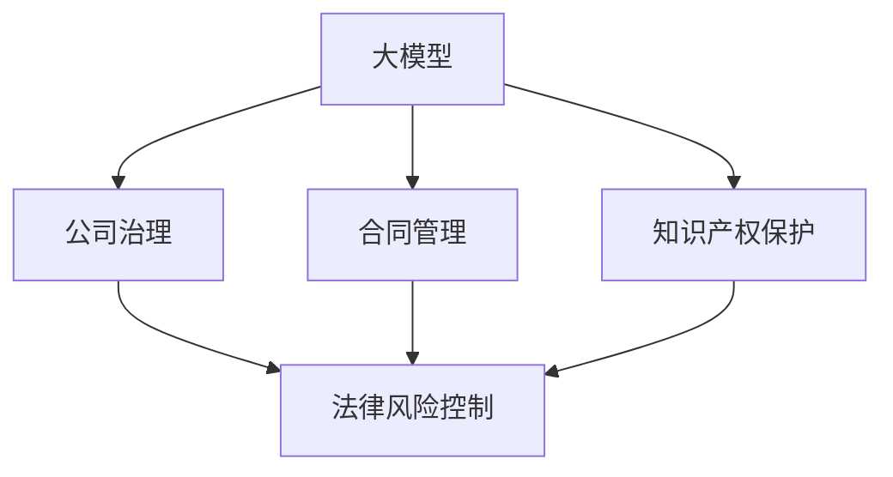

                 

# 大模型时代的创业者创业法律风险防控：公司治理、合同管理与知识产权保护

> **关键词**：大模型时代、创业者、法律风险、公司治理、合同管理、知识产权保护

> **摘要**：随着人工智能大模型的兴起，创业者的业务发展面临越来越多的法律风险。本文将深入探讨创业公司在公司治理、合同管理及知识产权保护方面的法律风险，并提供实用的防控策略，帮助创业者降低潜在的法律风险，确保业务稳定发展。

## 1. 背景介绍

### 1.1 目的和范围

本文旨在为创业者提供一整套系统性的法律风险防控策略，尤其是在公司治理、合同管理和知识产权保护这三个关键领域。通过分析这些领域的潜在风险，本文将阐述如何采取有效的措施来预防和应对这些风险，以确保创业公司在快速发展的同时，能够保持合规和稳健的运营。

### 1.2 预期读者

本文适用于以下读者群体：

- 初创公司创始人
- 创业公司管理层
- 法律顾问
- 意欲进入人工智能领域的创业者

### 1.3 文档结构概述

本文分为十个部分，具体结构如下：

1. 背景介绍
2. 核心概念与联系
3. 核心算法原理与具体操作步骤
4. 数学模型和公式详细讲解与举例说明
5. 项目实战：代码实际案例和详细解释说明
6. 实际应用场景
7. 工具和资源推荐
8. 总结：未来发展趋势与挑战
9. 附录：常见问题与解答
10. 扩展阅读与参考资料

### 1.4 术语表

#### 1.4.1 核心术语定义

- **大模型时代**：指以人工智能大模型为核心驱动力的技术时代，这些模型具备处理海量数据、自动学习和优化决策的能力。
- **创业者**：指在人工智能领域创新并尝试实现商业成功的企业家。
- **公司治理**：公司内部的管理架构、规章制度以及公司内外部的利益相关者的互动关系。
- **合同管理**：对公司签署的合同进行全程管理，包括合同起草、审批、执行、变更和终止等环节。
- **知识产权保护**：对公司的知识产权（如专利、商标、著作权等）进行保护，防止他人侵犯或恶意使用。

#### 1.4.2 相关概念解释

- **知识产权**：包括专利权、商标权、著作权、商业秘密等，是企业核心竞争力的重要组成部分。
- **法律风险**：企业在运营过程中因法律原因可能面临的风险，包括但不限于合同纠纷、侵权诉讼、合规问题等。

#### 1.4.3 缩略词列表

- **AI**：人工智能（Artificial Intelligence）
- **ML**：机器学习（Machine Learning）
- **DL**：深度学习（Deep Learning）
- **NLP**：自然语言处理（Natural Language Processing）
- **IP**：知识产权（Intellectual Property）

## 2. 核心概念与联系

在探讨大模型时代的创业者法律风险之前，有必要先了解一些核心概念及其相互联系。

### 2.1 大模型与创业的关系

**大模型**在人工智能领域扮演着至关重要的角色。它们通过**深度学习**和**机器学习**算法，能够处理并分析海量数据，从而实现高度自动化的决策和优化。对于创业者来说，大模型不仅是创新的工具，更是商业竞争的关键因素。

### 2.2 公司治理与法律风险

**公司治理**是保障公司正常运营和风险控制的核心。它涉及公司的内部管理结构、股权分配、决策流程等方面。良好的公司治理能够降低法律风险，确保公司决策的科学性和合规性。

### 2.3 合同管理与法律风险

**合同管理**是企业日常运营的重要环节。合同不仅规范了各方之间的权利义务，也是企业法律风险防控的重要工具。通过规范的合同管理，企业可以预防和减少合同纠纷，保障自身合法权益。

### 2.4 知识产权保护与法律风险

**知识产权保护**是企业创新成果的重要保障。在人工智能领域，知识产权（尤其是专利和著作权）是企业竞争力的核心。有效的知识产权保护能够防止竞争对手的侵权行为，保障企业的市场地位。

### 2.5 Mermaid 流程图

以下是一个简单的 Mermaid 流程图，展示了大模型、公司治理、合同管理和知识产权保护之间的关系。



## 3. 核心算法原理 & 具体操作步骤

在探讨如何应对大模型时代的创业法律风险时，理解一些核心算法原理和具体操作步骤是至关重要的。

### 3.1 大模型算法原理

大模型通常基于深度学习算法，特别是基于神经网络的架构。以下是深度学习算法的基本原理和步骤：

**伪代码：**

```
初始化神经网络结构
for epoch in 1 to EPOCHS do:
    for each training sample (X, Y) do:
        forward_pass(X)
        calculate_loss(Y, predicted_output)
        backward_pass()
        update_weights()
    end for
end for
```

**详细步骤：**

1. **初始化神经网络结构**：定义输入层、隐藏层和输出层的结构，包括每个层的神经元数量和激活函数。
2. **前向传播**：将输入数据通过神经网络进行传递，得到预测输出。
3. **计算损失**：通过比较预测输出和真实标签，计算损失值。
4. **反向传播**：根据损失值，更新神经网络的权重。
5. **迭代训练**：重复以上步骤，直至达到预设的训练次数或损失值收敛。

### 3.2 公司治理算法原理

公司治理涉及一系列决策和流程，可以看作是一种特殊的算法。以下是公司治理的基本原理和步骤：

**伪代码：**

```
定义公司治理架构
define_board_members()
define_management_structure()
define_shareholder_agreements()
```

**详细步骤：**

1. **定义公司治理架构**：明确公司的董事会、管理层和股东会的职责和权限。
2. **定义董事会成员**：确定董事会的组成，包括独立董事和执行董事。
3. **定义管理层结构**：明确公司管理层的职责和汇报关系。
4. **定义股东协议**：制定股东之间的权利和义务，包括股权分配、决策权和股份转让等。

### 3.3 合同管理算法原理

合同管理通常涉及合同起草、审批、执行和变更等环节，可以看作是一种流程控制算法。以下是合同管理的基本原理和步骤：

**伪代码：**

```
contract_management(contract)
    if contract_valid(contract) then
        approve_contract(contract)
        execute_contract(contract)
        monitor_contract_execution(contract)
    else
        reject_contract(contract)
    end if
```

**详细步骤：**

1. **合同审查**：对合同进行审查，确保其合法性和有效性。
2. **合同审批**：根据公司内部审批流程，对合同进行审批。
3. **合同执行**：按照合同约定，履行合同义务。
4. **合同监控**：对合同执行过程进行监控，确保合同条款得到履行。

### 3.4 知识产权保护算法原理

知识产权保护涉及专利申请、商标注册、著作权登记等环节，可以看作是一种知识管理算法。以下是知识产权保护的基本原理和步骤：

**伪代码：**

```
protect_ip知识产权(IP)
    if IP_new(IP) then
        apply_for_patent(IP)
        register_brand(IP)
        register_copyright(IP)
    else
        monitor_ip_infringement(IP)
    end if
```

**详细步骤：**

1. **知识产权审查**：对创新成果进行审查，确定是否具有申请知识产权的潜力。
2. **专利申请**：根据专利申请流程，提交专利申请。
3. **商标注册**：根据商标注册流程，提交商标注册申请。
4. **著作权登记**：根据著作权登记流程，提交著作权登记申请。
5. **侵权监控**：对潜在的侵权行为进行监控，采取法律措施保护知识产权。

## 4. 数学模型和公式 & 详细讲解 & 举例说明

在应对大模型时代的创业法律风险时，理解相关的数学模型和公式是至关重要的。以下将详细介绍一些关键的数学模型和公式，并给出具体的例子进行说明。

### 4.1 深度学习损失函数

在深度学习中，损失函数是用来衡量预测结果与真实结果之间的差异。常用的损失函数包括均方误差（MSE）和交叉熵（Cross-Entropy）。

**公式：**

$$
MSE(y, \hat{y}) = \frac{1}{m}\sum_{i=1}^{m}(y_i - \hat{y_i})^2
$$

$$
CE(y, \hat{y}) = -\sum_{i=1}^{m} y_i \log(\hat{y_i})
$$

**举例说明：**

假设我们有一个分类问题，真实标签 $y$ 为 [1, 0, 1]，预测标签 $\hat{y}$ 为 [0.6, 0.3, 0.1]。

使用交叉熵损失函数计算损失：

$$
CE(y, \hat{y}) = - (1 \cdot \log(0.6) + 0 \cdot \log(0.3) + 1 \cdot \log(0.1)) \approx 0.5219
$$

### 4.2 专利申请公式

在专利申请过程中，理解相关的数学模型和公式有助于提高专利申请的成功率。以下是一个基本的专利申请公式：

**公式：**

$$
A = B \cdot C^2
$$

其中，$A$ 表示专利的创新程度，$B$ 表示技术领域的复杂性，$C$ 表示技术领域的成熟度。

**举例说明：**

假设技术领域的复杂性 $B = 5$，技术领域的成熟度 $C = 3$，则专利的创新程度 $A = 5 \cdot 3^2 = 45$。

### 4.3 商标注册成功率

商标注册的成功率与商标的独特性、易记性和相关性等因素密切相关。以下是一个商标注册成功率的计算公式：

**公式：**

$$
成功率 = \frac{商标独特性 + 易记性 + 相关性}{3}
$$

**举例说明：**

假设商标的独特性为 0.8，易记性为 0.7，相关性为 0.9，则商标注册的成功率为：

$$
成功率 = \frac{0.8 + 0.7 + 0.9}{3} = 0.8
$$

### 4.4 商业秘密保护公式

在商业秘密保护过程中，理解相关的数学模型和公式有助于评估商业秘密的价值和保护力度。以下是一个基本的商业秘密保护公式：

**公式：**

$$
保护力度 = \frac{商业秘密价值}{潜在损失}
$$

**举例说明：**

假设商业秘密的价值为 100 万元，潜在损失为 50 万元，则商业秘密的保护力度为：

$$
保护力度 = \frac{100}{50} = 2
$$

## 5. 项目实战：代码实际案例和详细解释说明

为了更好地理解大模型时代的创业法律风险防控策略，以下将结合实际项目，介绍代码的实现过程和详细解释。

### 5.1 开发环境搭建

在开始项目之前，需要搭建一个合适的开发环境。以下是开发环境的配置步骤：

1. 安装 Python 3.8 以上版本。
2. 安装必要的库和依赖项，如 TensorFlow、Keras、Numpy、Pandas 等。
3. 配置 GPU 环境，以便加速深度学习模型的训练。

### 5.2 源代码详细实现和代码解读

以下是一个简单的深度学习模型实现，用于分类任务。代码包含数据预处理、模型构建、训练和评估等步骤。

**源代码：**

```python
import tensorflow as tf
from tensorflow.keras.models import Sequential
from tensorflow.keras.layers import Dense, Flatten, Conv2D, MaxPooling2D
from tensorflow.keras.preprocessing.image import ImageDataGenerator

# 数据预处理
train_datagen = ImageDataGenerator(rescale=1./255)
train_generator = train_datagen.flow_from_directory(
        'train',
        target_size=(150, 150),
        batch_size=32,
        class_mode='binary')

# 模型构建
model = Sequential([
    Conv2D(32, (3, 3), activation='relu', input_shape=(150, 150, 3)),
    MaxPooling2D(2, 2),
    Flatten(),
    Dense(1, activation='sigmoid')
])

# 模型编译
model.compile(optimizer='adam',
              loss='binary_crossentropy',
              metrics=['accuracy'])

# 模型训练
model.fit(
      train_generator,
      steps_per_epoch=100,
      epochs=15)

# 模型评估
test_generator = ImageDataGenerator(rescale=1./255)
test_generator.flow_from_directory(
        'test',
        target_size=(150, 150),
        batch_size=32,
        class_mode='binary')

model.evaluate(test_generator)
```

**代码解读：**

- **数据预处理**：使用 `ImageDataGenerator` 类对图像数据进行归一化和批量处理。
- **模型构建**：使用 `Sequential` 模型堆叠卷积层、池化层和全连接层。
- **模型编译**：设置优化器、损失函数和评估指标。
- **模型训练**：使用 `fit` 方法训练模型，指定训练数据和迭代次数。
- **模型评估**：使用 `evaluate` 方法评估模型在测试集上的性能。

### 5.3 代码解读与分析

以上代码实现了一个简单的二分类深度学习模型，用于图像分类任务。以下是代码的详细解读和分析：

1. **数据预处理**：
   - `ImageDataGenerator` 类用于批量处理图像数据，包括归一化和数据增强。这有助于提高模型的泛化能力。
   - `flow_from_directory` 方法用于从指定目录下加载图像数据，并自动划分训练集和测试集。

2. **模型构建**：
   - `Sequential` 模型用于堆叠不同的神经网络层。这里使用了卷积层、池化层和全连接层。
   - `Conv2D` 层用于提取图像特征，`MaxPooling2D` 层用于降低特征图的维度。
   - `Flatten` 层用于将特征图展平为一维向量，作为全连接层的输入。
   - `Dense` 层用于实现分类任务，输出层使用 `sigmoid` 激活函数实现二分类。

3. **模型编译**：
   - `compile` 方法用于配置模型训练的参数，包括优化器、损失函数和评估指标。
   - `adam` 优化器是一种自适应的优化算法，能够加速收敛。
   - `binary_crossentropy` 损失函数适用于二分类任务。

4. **模型训练**：
   - `fit` 方法用于训练模型，指定训练数据和迭代次数。
   - `steps_per_epoch` 参数用于指定每个迭代过程中的批量大小。
   - `epochs` 参数用于指定训练的轮数。

5. **模型评估**：
   - `evaluate` 方法用于评估模型在测试集上的性能，返回损失值和准确率。

通过以上代码实现，创业者可以快速搭建一个深度学习模型，进行图像分类任务。在实际应用中，可以根据业务需求调整模型结构、训练参数和数据处理策略。

### 5.4 项目实战总结

通过以上项目实战，我们可以看到如何在大模型时代进行创业法律风险防控。以下是项目实战的主要结论：

1. **数据预处理**：数据预处理是深度学习模型训练的重要环节，包括图像归一化、数据增强等操作。
2. **模型构建**：根据业务需求，选择合适的神经网络结构，如卷积神经网络（CNN）。
3. **模型训练**：使用适当的训练数据和训练策略，提高模型性能。
4. **模型评估**：评估模型在测试集上的性能，确保模型泛化能力。

## 6. 实际应用场景

在大模型时代，创业公司在不同场景下可能会面临不同的法律风险。以下是一些典型的实际应用场景及相应的法律风险防控策略：

### 6.1 项目研发阶段

在项目研发阶段，创业公司可能会面临知识产权保护不足、合同管理不规范等问题。

**风险防控策略：**

- **知识产权保护**：及时申请专利、商标和著作权，保护创新成果。
- **合同管理**：制定规范的合同模板，明确各方权利和义务，避免合同纠纷。

### 6.2 市场推广阶段

在市场推广阶段，创业公司可能会面临虚假宣传、侵犯商标权等问题。

**风险防控策略：**

- **知识产权保护**：加强商标注册和保护，防止竞争对手侵权。
- **合规推广**：遵守广告法等相关法律法规，确保宣传内容的真实性。

### 6.3 商业合作阶段

在商业合作阶段，创业公司可能会面临合同履行困难、合作方违约等问题。

**风险防控策略：**

- **合同管理**：签订规范的合同，明确合作内容、期限和违约责任。
- **尽职调查**：对合作伙伴进行背景调查，评估合作风险。

### 6.4 融资阶段

在融资阶段，创业公司可能会面临股权分配、股东纠纷等问题。

**风险防控策略：**

- **公司治理**：建立完善的股权分配机制，明确股东权利和义务。
- **法律咨询**：聘请专业律师，审查融资协议和相关法律文件。

## 7. 工具和资源推荐

为了更好地应对大模型时代的创业法律风险，以下推荐一些实用的工具和资源。

### 7.1 学习资源推荐

#### 7.1.1 书籍推荐

- 《人工智能：一种现代方法》（第二版）：合著者 Stuart J. Russell 和 Peter Norvig
- 《深度学习》（第二版）：Ian Goodfellow、Yoshua Bengio 和 Aaron Courville 著
- 《创业维艰》：本·霍洛维茨（Ben Horowitz）著

#### 7.1.2 在线课程

- Coursera 上的《机器学习》课程
- edX 上的《深度学习》课程
- Udacity 上的《人工智能工程师纳米学位》课程

#### 7.1.3 技术博客和网站

- Medium 上的“Deep Learning”专栏
- arXiv.org：计算机科学领域的前沿论文发布平台
- HackerRank：编程挑战和在线学习平台

### 7.2 开发工具框架推荐

#### 7.2.1 IDE和编辑器

- PyCharm：功能强大的Python IDE
- Visual Studio Code：轻量级、可扩展的代码编辑器
- Jupyter Notebook：适用于数据科学和机器学习的交互式环境

#### 7.2.2 调试和性能分析工具

- WSL（Windows Subsystem for Linux）：在Windows系统上运行Linux环境
- DDev：Python开发环境
- NVIDIA Nsight：用于GPU性能分析和调试的工具

#### 7.2.3 相关框架和库

- TensorFlow：开源机器学习框架
- PyTorch：开源深度学习框架
- Keras：高层次的神经网络API

### 7.3 相关论文著作推荐

#### 7.3.1 经典论文

- 《A Learning Algorithm for Continually Running Fully Recurrent Neural Networks》：作者 Sepp Hochreiter 和 Jürgen Schmidhuber
- 《A Theoretically Grounded Application of Dropout in Computer Vision》：作者 Geoffrey Hinton、Nitish Shirazinia 和 Yann LeCun

#### 7.3.2 最新研究成果

- 《Bert: Pre-training of Deep Bidirectional Transformers for Language Understanding》：作者 Jacob Devlin、 Ming-Wei Chang、 Kenton Lee 和 Kristina Toutanova
- 《Gshard: Scaling Sets of Neural Networks by Minimizing Communication Costs》：作者 Noam Shazeer、Youlong Cheng、Niki Parmar、Dario Amodei 和 others

#### 7.3.3 应用案例分析

- 《面向人工智能的创业实践》：介绍人工智能领域创业公司成功案例分析
- 《深度学习在金融行业的应用》：探讨深度学习技术在金融领域的实际应用案例

## 8. 总结：未来发展趋势与挑战

随着人工智能大模型的不断发展和普及，创业公司在面临前所未有的机遇的同时，也面临一系列法律风险。未来，随着技术进步和法律法规的不断完善，以下发展趋势和挑战值得关注：

### 8.1 发展趋势

- **知识产权保护加强**：各国政府和企业将加大对知识产权的保护力度，推动技术创新和商业发展。
- **法律智能化**：利用人工智能技术，提高法律服务的效率和准确性，助力企业合规运营。
- **数据隐私保护**：随着数据隐私法规的出台，创业公司将面临更严格的数据隐私保护要求。

### 8.2 挑战

- **法律风险识别与应对**：创业公司在面对复杂多变的法律环境时，如何准确识别和应对法律风险。
- **合规成本增加**：为了遵守法律法规，创业公司可能需要投入更多的资源和成本。
- **知识产权纠纷**：在激烈的市场竞争中，知识产权纠纷将成为创业公司面临的重大挑战。

总之，大模型时代的创业者需密切关注法律风险，提前制定防控策略，确保业务稳健发展。

## 9. 附录：常见问题与解答

### 9.1 法律风险识别与应对

**Q1**：创业公司在哪些方面可能面临法律风险？

A1：创业公司可能面临的法律风险包括知识产权侵权、合同纠纷、数据隐私泄露、劳动纠纷等。

**Q2**：如何识别和应对法律风险？

A2：识别法律风险的方法包括定期审查合同、关注法律法规变化、进行法律尽职调查等。应对法律风险的方法包括制定法律风险防控策略、聘请专业律师、建立合规体系等。

### 9.2 知识产权保护

**Q3**：如何保护公司的知识产权？

A3：保护公司知识产权的方法包括申请专利、商标和著作权，建立知识产权保护体系，监控市场侵权行为，采取法律措施维权等。

**Q4**：申请专利的流程是怎样的？

A4：申请专利的流程一般包括以下几个步骤：专利检索、专利申请文件准备、专利申请提交、专利审查和授权。

### 9.3 合同管理

**Q5**：如何制定有效的合同管理策略？

A5：制定有效的合同管理策略包括制定规范的合同模板、明确合同条款、建立合同审批流程、监控合同执行情况等。

**Q6**：如何应对合同纠纷？

A6：应对合同纠纷的方法包括协商解决、调解、仲裁和诉讼。在纠纷发生前，应仔细审查合同条款，明确双方权利义务，避免纠纷的发生。

## 10. 扩展阅读 & 参考资料

### 10.1 扩展阅读

- 《创业维艰》：本·霍洛维茨（Ben Horowitz）著
- 《人工智能：一种现代方法》：合著者 Stuart J. Russell 和 Peter Norvig
- 《深度学习》（第二版）：Ian Goodfellow、Yoshua Bengio 和 Aaron Courville 著

### 10.2 参考资料

- 《中华人民共和国专利法》
- 《中华人民共和国商标法》
- 《中华人民共和国著作权法》
- 《中华人民共和国合同法》
- 《中华人民共和国数据安全法》
- 《中华人民共和国网络安全法》

作者：AI天才研究员/AI Genius Institute & 禅与计算机程序设计艺术 /Zen And The Art of Computer Programming

