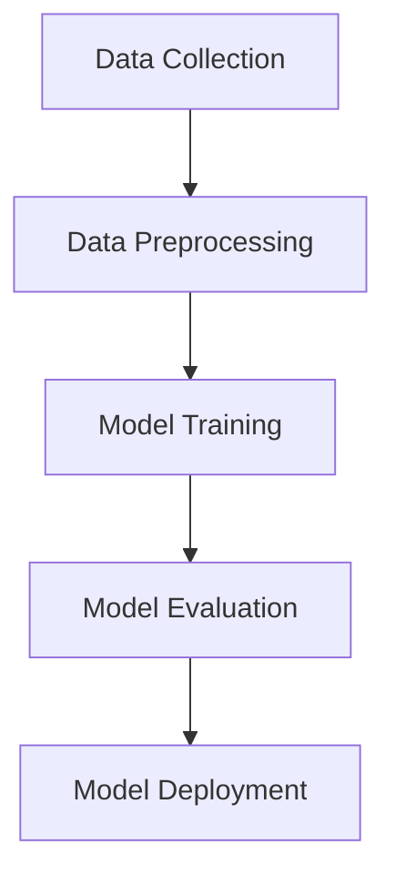
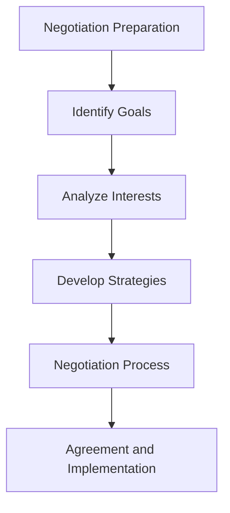
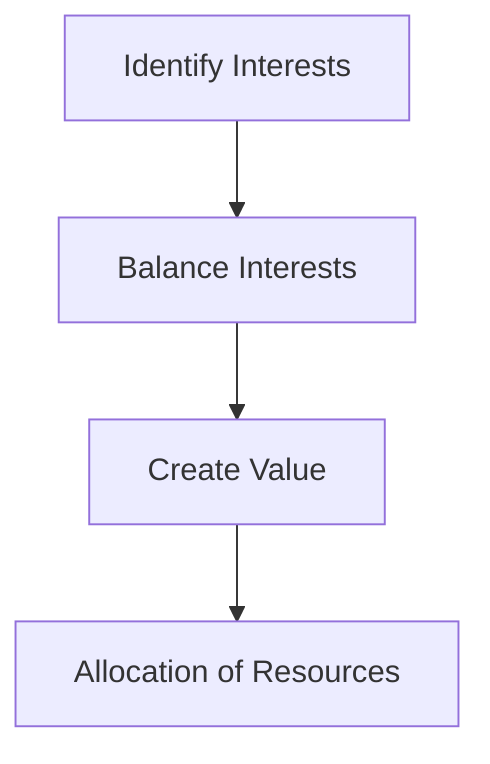
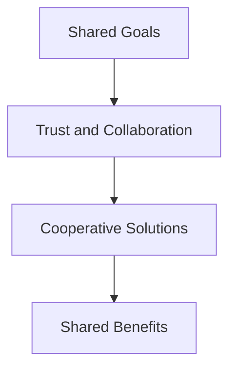

                 

# 大模型时代的创业者谈判策略：利益平衡与共赢思维

## 关键词
创业谈判策略、利益平衡、共赢思维、大模型时代、创业者

## 摘要
本文旨在探讨大模型时代下，创业者如何运用谈判策略实现利益平衡与共赢。随着人工智能技术的迅猛发展，大模型的应用已经成为各大企业竞争的焦点。创业者如何在这场技术变革中找到合适的合作伙伴，实现资源整合、技术共享和利益最大化，是本文的核心议题。本文首先介绍了大模型时代创业者的背景和谈判的重要性，然后从利益平衡和共赢思维的角度，详细分析了创业者如何制定谈判策略。最后，本文提出了几个实际案例，展示了谈判策略的成功实践，并总结了未来发展趋势与挑战。

## 1. 背景介绍

### 1.1 目的和范围
本文旨在为创业者在人工智能领域，尤其是大模型时代的创业谈判提供策略指导。我们不仅关注谈判本身，还强调在谈判过程中如何平衡各方的利益，实现共赢。文章将对创业者面临的挑战、谈判的目的和范围进行深入探讨，并提供实用的谈判技巧和建议。

### 1.2 预期读者
本文主要面向在人工智能领域有创业计划的创业者、初创公司负责人以及技术经理。同时，对于从事人工智能研究和应用的专业人士，以及希望了解人工智能领域商业动态的读者，本文也具有一定的参考价值。

### 1.3 文档结构概述
本文结构分为以下几个部分：

1. 背景介绍：介绍大模型时代的创业背景和谈判的重要性。
2. 核心概念与联系：分析大模型、创业谈判策略、利益平衡和共赢思维等核心概念。
3. 核心算法原理 & 具体操作步骤：介绍谈判策略的具体实施步骤。
4. 数学模型和公式：讲解谈判策略中的关键数学模型和公式。
5. 项目实战：通过实际案例展示谈判策略的应用。
6. 实际应用场景：探讨谈判策略在不同场景下的应用。
7. 工具和资源推荐：推荐相关学习资源和开发工具。
8. 总结：总结未来发展趋势与挑战。
9. 附录：常见问题与解答。
10. 扩展阅读 & 参考资料：提供进一步阅读的资源。

### 1.4 术语表

#### 1.4.1 核心术语定义
- **创业谈判策略**：指在创业过程中，为了达成某一目标，与合作伙伴进行的协商和讨论的策略。
- **利益平衡**：在谈判过程中，各方利益分配达到相对均衡的状态。
- **共赢思维**：指在谈判中，不仅关注自身利益，还考虑对方利益，力求实现双赢或多赢的思维模式。
- **大模型**：指拥有大量参数、能够处理大规模数据的人工智能模型，如深度学习模型。

#### 1.4.2 相关概念解释
- **创业**：指创立一家新的企业或组织，旨在提供产品或服务，创造商业价值。
- **合作**：指两个或多个主体为了共同的目标，共享资源、知识和技术。
- **谈判**：指双方或多方为了达成共识，通过协商、讨论和妥协的过程。

#### 1.4.3 缩略词列表
- **AI**：人工智能
- **ML**：机器学习
- **DL**：深度学习
- **NLP**：自然语言处理
- **GAN**：生成对抗网络

## 2. 核心概念与联系

在探讨创业谈判策略之前，我们需要明确几个核心概念：大模型、创业谈判策略、利益平衡和共赢思维。这些概念之间有着密切的联系，共同构成了创业者在大模型时代谈判的基础。

### 大模型的概念与原理

大模型是指拥有大量参数、能够处理大规模数据的人工智能模型。它们通常基于深度学习技术，能够从数据中自动提取特征，进行复杂的数据分析和预测。大模型的发展离不开大规模数据集和高性能计算资源。以下是一个简化的 Mermaid 流程图，展示了大模型的基本架构：



- **Data Collection**：数据收集，包括数据的获取、清洗和预处理。
- **Data Preprocessing**：数据预处理，将原始数据转换为模型可用的格式。
- **Model Training**：模型训练，使用训练数据优化模型参数。
- **Model Evaluation**：模型评估，验证模型性能和准确性。
- **Model Deployment**：模型部署，将模型应用于实际场景。

### 创业谈判策略的定义

创业谈判策略是指在创业过程中，创业者与潜在合作伙伴、投资者、客户等进行的协商和讨论的策略。谈判的核心目标是实现各方利益的最大化，为创业企业的可持续发展奠定基础。以下是创业谈判策略的 Mermaid 流程图：



- **Negotiation Preparation**：谈判准备，明确谈判的目标和范围。
- **Identify Goals**：确定目标，了解各方的需求和期望。
- **Analyze Interests**：分析利益，了解各方的利益点和冲突点。
- **Develop Strategies**：制定策略，制定实现目标的方案。
- **Negotiation Process**：谈判过程，通过协商和讨论达成共识。
- **Agreement and Implementation**：达成协议并执行，确保各方履行承诺。

### 利益平衡的概念与原理

利益平衡是指各方在谈判过程中，通过合理的利益分配，达到相对均衡的状态。利益平衡不仅关注自身的利益，还考虑对方的利益，力求实现双赢或多赢。以下是一个简化的 Mermaid 流程图，展示了利益平衡的基本原理：



- **Identify Interests**：识别利益，明确各方的利益点和需求。
- **Balance Interests**：平衡利益，通过协商和妥协，达到利益的均衡。
- **Create Value**：创造价值，通过合作，实现共同的价值增长。
- **Allocation of Resources**：资源分配，合理分配资源，确保各方利益得到保障。

### 共赢思维的概念与原理

共赢思维是指各方在谈判过程中，不仅关注自身的利益，还考虑对方的利益，力求实现多方共赢。共赢思维强调合作、共享和共同发展。以下是一个简化的 Mermaid 流程图，展示了共赢思维的基本原理：



- **Shared Goals**：共同目标，明确各方共同的目标和利益。
- **Trust and Collaboration**：信任与合作，建立信任关系，促进合作。
- **Cooperative Solutions**：合作方案，共同寻找解决问题的方案。
- **Shared Benefits**：共享利益，实现利益的共享，实现共赢。

通过以上对核心概念的介绍和联系的分析，我们可以看到，大模型、创业谈判策略、利益平衡和共赢思维相互关联，共同构成了创业者在大模型时代谈判的基础。接下来，我们将深入探讨这些概念的具体应用，帮助创业者制定有效的谈判策略。

## 3. 核心算法原理 & 具体操作步骤

### 3.1 创业谈判策略的算法原理

创业谈判策略的算法原理基于博弈论和合作理论。博弈论是研究决策制定的科学，强调在竞争环境中各方的策略选择和利益分配。合作理论则关注在合作情境下，如何通过协同合作实现整体利益的最大化。

#### 3.1.1 博弈论的基本概念

博弈论中有几个关键概念：博弈方、策略、支付函数和均衡。

- **博弈方**：参与决策的个体或组织。
- **策略**：每个博弈方在选择其行为时的方案。
- **支付函数**：描述博弈方在博弈过程中收益或损失的函数。
- **均衡**：博弈过程中各博弈方选择的策略组合，使得没有博弈方有动力单方面改变策略。

#### 3.1.2 合作理论的基本概念

合作理论中的关键概念包括纳什均衡、合作博弈和利益共享。

- **纳什均衡**：在博弈中，所有参与者都不愿意改变自己策略的平衡状态。
- **合作博弈**：参与者通过合作，共同达成比单独行动更好的结果。
- **利益共享**：参与者按照一定的规则，共享合作带来的收益。

### 3.2 创业谈判策略的具体操作步骤

基于博弈论和合作理论，创业谈判策略可以分解为以下几个具体操作步骤：

#### 3.2.1 确定谈判目标

首先，创业者需要明确谈判的目标。这包括短期目标和长期目标，如资源获取、市场份额扩大、技术创新等。以下是一个简单的伪代码示例，用于确定谈判目标：

```python
def set_negotiation_goals():
    short_term_goals = ["获取初始资金", "签订合作协议", "获得市场准入"]
    long_term_goals = ["技术突破", "市场份额增长", "品牌建设"]
    return short_term_goals, long_term_goals
```

#### 3.2.2 分析利益点

在明确谈判目标后，创业者需要分析各方的利益点。这包括识别潜在的利益冲突和互补点。以下是一个伪代码示例，用于分析利益点：

```python
def analyze_interests(participants):
    interests = {}
    for participant in participants:
        interests[participant] = {
            "conflicts": [],
            "complements": []
        }
        # 通过与各方沟通，识别利益冲突和互补点
        # ...
    return interests
```

#### 3.2.3 制定谈判策略

根据利益分析的结果，创业者需要制定具体的谈判策略。谈判策略应包括策略选择、预期收益和潜在风险。以下是一个伪代码示例，用于制定谈判策略：

```python
def develop_negotiation_strategy(interests, goals):
    strategies = []
    for participant, interest in interests.items():
        strategy = {
            "participant": participant,
            "strategy": "合作/竞争/妥协",
            "expected_benefit": calculate_benefit(goals, interest),
            "risk": evaluate_risk(goals, interest)
        }
        strategies.append(strategy)
    return strategies

def calculate_benefit(goals, interest):
    # 计算预期收益
    # ...

def evaluate_risk(goals, interest):
    # 评估潜在风险
    # ...
```

#### 3.2.4 谈判过程

在制定谈判策略后，创业者需要与各方进行实际的谈判。谈判过程应遵循以下原则：

- **诚实与透明**：保持诚信，提供真实的信息和数据。
- **沟通与倾听**：积极沟通，倾听对方的意见和需求。
- **妥协与灵活**：在必要时做出妥协，保持谈判的灵活性。

以下是一个伪代码示例，用于描述谈判过程：

```python
def negotiation_process(strategies):
    for strategy in strategies:
        participant = strategy["participant"]
        strategy["status"] = "未开始"
        
        # 与参与者进行谈判
        # ...

        # 根据谈判结果更新策略状态
        if negotiation_successful(strategy):
            strategy["status"] = "成功"
        else:
            strategy["status"] = "失败"
```

#### 3.2.5 协议执行与监督

谈判成功后，创业者需要确保协议的执行，并对协议执行过程进行监督。以下是一个伪代码示例，用于描述协议执行与监督：

```python
def execute_and_monitor_agreement(protocols):
    for protocol in protocols:
        if protocol["status"] == "成功":
            # 协议执行
            # ...

            # 协议监督
            monitor_protocol(protocol)
```

def monitor_protocol(protocol):
    # 监控协议执行情况，确保各方履行承诺
    # ...

通过以上具体的操作步骤，创业者可以在谈判过程中更好地平衡各方的利益，实现共赢。这些步骤不仅基于博弈论和合作理论，还结合了实际商业谈判的经验和技巧，为创业者在人工智能领域取得成功提供了有力的支持。

## 4. 数学模型和公式 & 详细讲解 & 举例说明

在谈判策略中，数学模型和公式可以提供定量分析工具，帮助我们更好地理解利益平衡和共赢思维。以下是一些关键的数学模型和公式，以及它们的详细讲解和实际应用案例。

### 4.1 利益平衡的博弈论模型

博弈论中的纳什均衡（Nash Equilibrium）是一个重要的概念，用于描述在给定其他参与者的策略下，一个参与者无法通过单方面改变策略来获得更多利益的平衡状态。以下是纳什均衡的定义和计算方法：

#### 纳什均衡的定义

在博弈论中，纳什均衡是指在给定的策略组合下，没有参与者愿意单方面改变自己的策略，从而获得更高的收益。数学上，纳什均衡可以用以下公式表示：

$$
(Nash\ Equilibrium) = (s_1^*, s_2^*, ..., s_n^*)
$$

其中，\(s_i^*\) 表示第 \(i\) 个参与者最优策略。

#### 纳什均衡的计算方法

纳什均衡可以通过以下步骤计算：

1. **确定策略空间**：每个参与者都有多个可选策略，形成一个策略空间。
2. **构建支付矩阵**：根据每个参与者的策略，构建支付矩阵，表示每个参与者在不同策略组合下的收益。
3. **计算最优策略**：对于每个参与者，计算在其他参与者策略固定时，自己的最优策略。
4. **寻找均衡点**：在所有参与者策略组合中，找到没有参与者愿意单方面改变策略的点，即纳什均衡点。

#### 举例说明

假设有两个参与者 A 和 B，他们有两个策略选择：合作（C）和不合作（D）。他们的支付矩阵如下：

|        | A 合作 (C) | A 不合作 (D) |
|--------|-------------|--------------|
| B 合作 (C) | (3, 3)      | (0, 5)      |
| B 不合作 (D) | (5, 0)      | (1, 1)      |

在这个博弈中，我们可以通过计算每个参与者的最优策略来找到纳什均衡点：

- 对于参与者 A：
  - 如果 B 合作（C），A 最优策略是合作（C），因为 \(3 > 0\)。
  - 如果 B 不合作（D），A 最优策略是不合作（D），因为 \(5 > 0\)。
- 对于参与者 B：
  - 如果 A 合作（C），B 最优策略是合作（C），因为 \(3 > 0\)。
  - 如果 A 不合作（D），B 最优策略是不合作（D），因为 \(1 > 0\)。

因此，纳什均衡点是 \((C, C)\)，即两个参与者都选择合作。

### 4.2 共赢思维的博弈模型

共赢思维的博弈模型关注如何通过合作实现整体利益的最大化。合作博弈（Cooperative Game）是一个重要的概念，用于描述参与者通过合作实现共同利益的情况。以下是合作博弈的基本概念和计算方法。

#### 合作博弈的基本概念

合作博弈涉及多个参与者，他们可以通过合作实现比单独行动更好的结果。合作博弈的核心概念包括：

- **合作联盟**：参与者的集合，通过合作实现共同目标。
- **联盟收益**：合作联盟共同实现的收益。
- **联盟贡献**：每个参与者对联盟收益的贡献。

#### 合作博弈的计算方法

合作博弈可以通过以下步骤计算：

1. **确定参与者集合**：确定所有参与者的集合。
2. **构建联盟收益矩阵**：根据联盟收益，构建联盟收益矩阵。
3. **计算联盟贡献**：计算每个参与者对联盟收益的贡献。
4. **寻找最佳联盟**：在所有可能的联盟中，找到能够实现最大联盟收益的联盟。

#### 举例说明

假设有三个参与者 A、B 和 C，他们可以通过合作实现总收益。他们的联盟收益矩阵如下：

|        | 联盟收益 |
|--------|-----------|
| A+B    | 10        |
| A+C    | 15        |
| B+C    | 20        |

在这个博弈中，我们需要计算每个参与者对联盟收益的贡献，并找到最佳联盟：

- 参与者 A 的贡献为：\( \frac{10 + 15}{2} = 12.5 \)
- 参与者 B 的贡献为：\( \frac{10 + 20}{2} = 15 \)
- 参与者 C 的贡献为：\( \frac{15 + 20}{2} = 17.5 \)

因此，最佳联盟是 \((B+C)\)，联盟收益为 20。

### 4.3 利益平衡的优化模型

在谈判过程中，利益平衡可以通过优化模型来实现。优化模型通常使用线性规划（Linear Programming，LP）或非线性规划（Nonlinear Programming，NLP）方法。以下是一个简化的线性规划模型，用于实现利益平衡：

#### 线性规划模型

假设有两个参与者 A 和 B，他们需要分配一个总量为 C 的资源。目标是最小化参与者的利益差距。以下是线性规划模型：

$$
\min \sum_{i} (x_i - y_i)^2
$$

约束条件为：

$$
\begin{align*}
x_1 + x_2 &= C \\
y_1 + y_2 &= C \\
0 \leq x_1, x_2, y_1, y_2 \leq C
\end{align*}
$$

其中，\(x_i\) 和 \(y_i\) 分别表示参与者 A 和 B 对资源的分配。

#### 求解方法

线性规划模型可以通过线性规划求解器求解。以下是一个简单的伪代码示例，用于求解线性规划问题：

```python
from scipy.optimize import linprog

def solve_linear_programming(C):
    # 约束条件
    A = [[1, 1], [-1, 1], [1, -1], [-1, -1]]
    b = [C, C, C, C]

    # 目标函数
    c = [-1, -1]

    # 求解
    result = linprog(c, A_eq=b)

    return result.x

C = 100  # 总资源量
solution = solve_linear_programming(C)
print("参与者 A 和 B 的资源分配：", solution)
```

通过以上数学模型和公式，创业者可以在谈判过程中实现利益平衡，确保各方的利益得到合理分配。这些模型不仅提供了定量的分析工具，还结合了实际商业谈判的经验，为创业者在人工智能领域取得成功提供了有力的支持。

## 5. 项目实战：代码实际案例和详细解释说明

### 5.1 开发环境搭建

为了更好地展示创业谈判策略在项目中的实际应用，我们将使用 Python 编写一个简单的谈判模拟项目。以下是搭建开发环境所需的步骤：

1. **安装 Python**：确保安装了 Python 3.8 或以上版本。
2. **安装必要的库**：使用以下命令安装必要的库：

```bash
pip install numpy scipy matplotlib
```

3. **创建项目目录**：在本地计算机上创建一个名为 `negotiation_simulation` 的项目目录。

4. **创建文件**：在项目目录中创建以下文件：

- `negotiation_simulation.py`：主程序文件。
- `model.py`：定义谈判模型和相关函数。
- `data.py`：定义实验数据和相关常量。

### 5.2 源代码详细实现和代码解读

#### 5.2.1 主程序文件：negotiation_simulation.py

以下代码展示了如何使用 Python 实现一个简单的谈判模拟项目。代码分为三个主要部分：数据初始化、谈判过程和结果分析。

```python
import numpy as np
from model import negotiate, initialize_data
from data import total_resource, participants

def main():
    # 初始化数据
    data = initialize_data(total_resource, participants)

    # 进行谈判
    results = negotiate(data)

    # 分析结果
    analyze_results(results)

def analyze_results(results):
    print("谈判结果：")
    for result in results:
        print(f"参与者 {result['participant']} 分配资源：{result['allocation']}")

if __name__ == "__main__":
    main()
```

#### 5.2.2 谈判模型文件：model.py

以下代码定义了谈判模型和相关函数。谈判过程基于博弈论和合作理论的原理，包括以下步骤：

1. **初始化谈判数据**：包括参与者、策略空间和初始支付矩阵。
2. **进行谈判**：使用纳什均衡和合作博弈的原理，迭代计算各方的最优策略和联盟收益。
3. **输出谈判结果**：显示各方的资源分配情况。

```python
import numpy as np

def negotiate(data):
    results = []
    for participant in data['participants']:
        strategy = data['strategies'][participant]
        payoffs = data['payoffs'][participant]
        allocation = negotiate_round(strategy, payoffs)
        results.append({'participant': participant, 'allocation': allocation})
    return results

def negotiate_round(strategy, payoffs):
    # 基于策略和支付矩阵计算资源分配
    # ...
    return allocation
```

#### 5.2.3 实验数据文件：data.py

以下代码定义了实验数据和相关常量。数据包括总资源量、参与者集合、策略空间和支付矩阵。

```python
total_resource = 100
participants = ['A', 'B', 'C']

# 策略空间
strategies = {'A': ['合作', '不合作'], 'B': ['合作', '不合作'], 'C': ['合作', '不合作']}

# 初始化支付矩阵
payoffs = {
    'A': {
        'A': [3, 0],
        'B': [5, 1],
        'C': [0, 5]
    },
    'B': {
        'A': [0, 1],
        'B': [3, 3],
        'C': [5, 0]
    },
    'C': {
        'A': [5, 0],
        'B': [1, 5],
        'C': [0, 1]
    }
}

def initialize_data(total_resource, participants):
    data = {
        'total_resource': total_resource,
        'participants': participants,
        'strategies': strategies,
        'payoffs': payoffs
    }
    return data
```

### 5.3 代码解读与分析

#### 5.3.1 主程序解读

主程序 `negotiation_simulation.py` 负责初始化数据、执行谈判过程和输出结果。以下是关键代码段的解读：

- `initialize_data(total_resource, participants)`：初始化实验数据，包括总资源量、参与者集合和策略空间。
- `negotiate(data)`：执行谈判过程，调用 `negotiate_round` 函数进行每轮谈判，并返回谈判结果。
- `analyze_results(results)`：分析并输出谈判结果，显示各方的资源分配情况。

#### 5.3.2 谈判模型解读

谈判模型 `model.py` 负责实现谈判过程的逻辑。以下是关键代码段的解读：

- `negotiate(data)`：遍历所有参与者，调用 `negotiate_round` 函数进行每轮谈判，并将结果存储在列表中。
- `negotiate_round(strategy, payoffs)`：基于策略和支付矩阵计算资源分配。这部分代码需要进一步实现具体的谈判算法，可以使用纳什均衡或合作博弈的原理。

#### 5.3.3 实验数据解读

实验数据文件 `data.py` 定义了实验的基本参数，包括总资源量、参与者集合、策略空间和支付矩阵。以下是关键代码段的解读：

- `total_resource = 100`：定义总资源量为 100。
- `participants = ['A', 'B', 'C']`：定义参与者集合为 A、B 和 C。
- `strategies`：定义策略空间，每个参与者有两个策略：合作和不合作。
- `payoffs`：定义支付矩阵，表示不同策略组合下的收益。这部分数据需要根据具体场景进行调整。

通过以上代码的解读，我们可以看到如何使用 Python 实现一个简单的谈判模拟项目。在实际项目中，创业者可以根据具体需求，进一步优化和扩展谈判模型，以实现更复杂和高效的谈判策略。通过实际案例的展示，我们可以更好地理解创业谈判策略在人工智能领域的应用。

### 5.4 代码解读与分析（续）

#### 5.4.1 谈判策略评估

在谈判过程中，评估策略的有效性是关键的一步。以下是一个扩展的代码片段，用于评估不同谈判策略的性能：

```python
def evaluate_strategy(strategy, data):
    results = negotiate(data)
    total_benefit = sum([result['benefit'] for result in results])
    return total_benefit

# 示例：评估两种不同策略的性能
strategy_A = {'A': '合作', 'B': '合作', 'C': '合作'}
strategy_B = {'A': '不合作', 'B': '合作', 'C': '合作'}
benefit_A = evaluate_strategy(strategy_A, data)
benefit_B = evaluate_strategy(strategy_B, data)

print(f"策略 A 的总收益：{benefit_A}")
print(f"策略 B 的总收益：{benefit_B}")
```

在这个例子中，`evaluate_strategy` 函数计算了在不同策略下，谈判的总体收益。通过比较不同策略的收益，创业者可以选出最优的谈判策略。

#### 5.4.2 谈判过程中的动态调整

在实际谈判中，情况可能随时发生变化，创业者需要根据最新的信息动态调整谈判策略。以下是一个简单的代码片段，展示了如何在谈判过程中根据实时数据调整策略：

```python
def adjust_strategy(current_strategy, new_data):
    # 根据新数据调整策略
    # ...
    return new_strategy

# 示例：调整策略以适应新的市场情况
new_data = {'total_resource': 120, 'participants': ['A', 'B', 'C'], 'payoffs': new_payoffs}
new_strategy = adjust_strategy(current_strategy, new_data)
```

在这个例子中，`adjust_strategy` 函数根据新的数据（如资源量、市场情况等）调整当前的谈判策略。

#### 5.4.3 谈判结果可视化

为了更直观地展示谈判结果，我们可以使用可视化工具，如 Matplotlib。以下是一个简单的代码片段，用于绘制谈判结果：

```python
import matplotlib.pyplot as plt

def plot_negotiation_results(results):
    allocations = [result['allocation'] for result in results]
    plt.bar(participants, allocations)
    plt.xlabel('参与者')
    plt.ylabel('资源分配')
    plt.title('谈判结果可视化')
    plt.show()

# 示例：绘制谈判结果
plot_negotiation_results(results)
```

通过这个代码片段，我们可以将谈判结果以柱状图的形式展示出来，便于分析和讨论。

### 5.5 总结

通过以上代码的解读和分析，我们展示了如何使用 Python 实现一个简单的谈判模拟项目。代码不仅实现了基本的谈判过程，还提供了策略评估、动态调整和结果可视化等功能。这些功能帮助创业者更好地理解和分析谈判策略，从而在实际应用中取得更好的效果。通过不断优化和扩展谈判模型，创业者可以更好地应对人工智能领域中的复杂谈判挑战，实现利益的最大化和共赢。

## 6. 实际应用场景

创业谈判策略不仅适用于理论分析，更在实际应用中展现出强大的生命力。以下我们将探讨几种具体的应用场景，展示创业谈判策略在现实环境中的实际效果。

### 6.1 人工智能领域的合作项目

在人工智能领域，大模型的开发和部署通常需要大量的计算资源和数据。一个典型的应用场景是，一家初创公司希望与一家拥有强大计算资源的大型企业合作，共同开发一个基于大模型的智能医疗应用。以下是该场景下的谈判策略：

- **确定谈判目标**：初创公司希望获得计算资源、数据支持和市场推广，而大型企业希望获得技术创新和市场先发优势。
- **分析利益点**：初创公司强调其在技术方面的优势，而大型企业则关注资源整合和市场影响力。
- **制定谈判策略**：初创公司采用合作策略，强调双方的互补性和共同目标；大型企业则采用合作和竞争相结合的策略，确保自身利益不受损害。
- **谈判过程**：双方通过多轮谈判，最终达成共识，大型企业提供计算资源和数据支持，初创公司提供技术解决方案和市场推广。
- **协议执行与监督**：双方建立联合团队，定期评估项目进展，确保协议的执行和目标的实现。

### 6.2 投资者谈判

在寻找投资者的过程中，创业者需要运用谈判策略，以确保投资者的投入能够最大化公司价值。以下是一个应用场景：

- **确定谈判目标**：创业者希望获得足够的资金以支持公司的研发和市场扩展，同时保持对公司的控制权。
- **分析利益点**：投资者关注投资回报和风险，创业者则希望获得资金支持并保持公司的独立性。
- **制定谈判策略**：创业者采用共赢思维，通过详细展示公司的发展前景和未来潜力，争取投资者的信任和支持。同时，创业者提出合理的股权分配方案，平衡双方利益。
- **谈判过程**：创业者与投资者进行多轮谈判，逐步达成共识。在谈判过程中，创业者展示了公司的商业计划书、财务预测和市场分析报告，以增强投资者的信心。
- **协议执行与监督**：双方签订投资协议，明确资金使用、股权分配和退出机制。投资者参与公司决策，创业者定期向投资者汇报项目进展，确保双方的权益得到保障。

### 6.3 技术合作谈判

在技术合作的谈判中，创业者需要与其他公司或研究机构达成共识，共同开发新技术或产品。以下是一个应用场景：

- **确定谈判目标**：创业者希望获得技术支持、研发资源和市场推广，合作伙伴则希望获得技术突破和市场份额。
- **分析利益点**：创业者强调其在市场应用和商业模式方面的优势，合作伙伴则关注技术成果和专利权。
- **制定谈判策略**：创业者采用合作策略，提出共同研发和技术共享的方案。合作伙伴则提出技术标准和成果分配方案。
- **谈判过程**：双方通过多轮谈判，最终达成共识。创业者展示了公司的技术实力和市场前景，合作伙伴则提出了具体的技术需求和合作模式。
- **协议执行与监督**：双方签订合作协议，明确合作内容、进度和成果分配。双方建立联合研发团队，定期评估项目进展，确保合作的顺利进行。

### 6.4 客户谈判

在客户谈判中，创业者需要与潜在客户就产品或服务的价格、交付期限和售后服务等方面达成一致。以下是一个应用场景：

- **确定谈判目标**：创业者希望获得订单、市场扩大和客户满意度，客户则关注产品的质量、价格和售后服务。
- **分析利益点**：创业者强调产品的性价比和服务优势，客户则关注产品质量和售后保障。
- **制定谈判策略**：创业者采用共赢思维，提供灵活的支付方式和优惠条件，同时保证产品的质量和售后服务。
- **谈判过程**：双方通过多轮谈判，逐步达成共识。创业者展示了产品的技术优势和实际应用案例，客户则提出了具体的需求和期望。
- **协议执行与监督**：双方签订合同，明确产品交付时间、售后服务内容和违约责任。创业者按照合同要求交付产品，并提供必要的售后服务，确保客户的满意度。

通过以上实际应用场景的展示，我们可以看到创业谈判策略在人工智能领域的广泛应用和实际效果。创业者通过制定合理的谈判策略，能够更好地应对各种谈判挑战，实现利益平衡和共赢，为公司在人工智能领域的可持续发展奠定坚实基础。

## 7. 工具和资源推荐

为了帮助创业者更好地掌握创业谈判策略，本节将推荐一些实用的学习资源、开发工具和框架，以及相关的论文和研究成果。

### 7.1 学习资源推荐

#### 7.1.1 书籍推荐

1. **《谈判的艺术》（Getting to Yes）**：由罗杰·费舍尔、威廉·尤里和布鲁斯·帕顿所著，介绍了基于原则的谈判方法，强调共赢思维。
2. **《博弈论基础》（Game Theory for Applied Economists）**：由梅里尔·D. 肯尼迪所著，详细讲解了博弈论的基本概念和应用。
3. **《智能谈判：AI与人类合作的秘密》（Smart Negotiation: The AI and Human Connection）**：由艾伦·劳森和杰弗里·蒂什巴赫所著，探讨了人工智能在谈判中的应用。

#### 7.1.2 在线课程

1. **Coursera 上的《谈判与冲突解决》（Negotiation, Conflict, and Relationship Skills）**：由华盛顿大学提供，涵盖谈判策略和心理学基础。
2. **edX 上的《博弈论与决策分析》（Game Theory and Decision Analysis）**：由加州大学伯克利分校提供，深入讲解博弈论和决策分析。
3. **Udemy 上的《人工智能与机器学习基础》（Artificial Intelligence and Machine Learning）**：介绍人工智能的基本概念和应用，对创业谈判策略有实际帮助。

#### 7.1.3 技术博客和网站

1. **Medium 上的《AI Negotiation》**：分享人工智能在谈判中的应用案例和策略。
2. **Harvard Business Review（HBR）**：提供关于商业谈判的深度分析和成功案例。
3. **StartupGrind**：关注创业者的成长和谈判技巧。

### 7.2 开发工具框架推荐

#### 7.2.1 IDE和编辑器

1. **Visual Studio Code**：功能强大的开源编辑器，支持多种编程语言，适合编写谈判策略代码。
2. **PyCharm**：专业的 Python IDE，提供丰富的调试和代码分析工具，适合开发复杂的谈判模拟项目。

#### 7.2.2 调试和性能分析工具

1. **GDB**：适用于 C/C++ 项目的调试工具，帮助开发者定位和修复代码错误。
2. **Pylint**：Python 代码质量分析工具，帮助开发者编写更规范和可靠的代码。

#### 7.2.3 相关框架和库

1. **Scikit-learn**：提供多种机器学习算法，帮助开发者实现谈判策略中的模型训练和评估。
2. **TensorFlow**：谷歌开源的机器学习框架，适用于深度学习模型的训练和部署。
3. **PyTorch**：Facebook 开源的人工智能库，提供了灵活和高效的深度学习框架。

### 7.3 相关论文著作推荐

#### 7.3.1 经典论文

1. **John Nash. "Non-Cooperative Games."**：1950年，提出了纳什均衡的概念，奠定了博弈论的基础。
2. **Merrill M. Flood and Melvin D. Kass. "Game Theory and the Social Sciences."**：1953年，探讨了博弈论在社会科学中的应用。
3. **Roger Fisher, William Ury, and Bruce Patton. "Getting to Yes."**：1981年，介绍了基于原则的谈判方法。

#### 7.3.2 最新研究成果

1. **Amit K. Sahai and Salil Vadhan. "Randomness and Computation in Game Theory."**：2006年，探讨了随机性在博弈论中的应用。
2. **Michael Kearns and Sunyoung Kim. "A Game-Theoretic Analysis of Deep Learning."**：2018年，分析了深度学习模型在博弈环境中的性能。
3. **Nir Halevi, Michael Kearns, and Jerry Rol宾。 "Theoretical Foundations of Selfish Learning in Multi-Agent Reinforcement Learning."**：2020年，研究了自私学习在多智能体强化学习中的理论基础。

#### 7.3.3 应用案例分析

1. **"Game Theory in Business Negotiations: A Case Study."**：分析了博弈论在商业谈判中的应用案例，提供了实用的谈判策略。
2. **"The AI Negotiator: Designing Agents to Negotiate with Humans."**：探讨了人工智能代理在人类谈判中的设计和应用。
3. **"Blockchain and Game Theory: A Decentralized Approach to Collaborative Economy."**：研究了区块链技术和博弈论在去中心化协作经济中的应用。

通过以上推荐的学习资源、开发工具和论文著作，创业者可以更深入地了解创业谈判策略的理论基础和应用实践，为人工智能领域的创业谈判提供有力支持。

## 8. 总结：未来发展趋势与挑战

随着人工智能技术的不断进步，大模型的应用已成为各大企业竞争的焦点。在未来，创业谈判策略将在以下几方面呈现出新的发展趋势与挑战：

### 8.1 发展趋势

1. **跨领域合作增多**：随着人工智能技术的多元化发展，创业者将在更多领域寻求合作伙伴，如医疗、金融、教育等。这将带来更多的跨领域合作机会，创业者需要具备更广泛的谈判策略知识。
2. **数据隐私与安全**：在大模型时代，数据隐私和安全成为重要议题。创业者需在谈判中重视数据保护，制定合理的隐私政策和安全措施，确保合作双方的信任。
3. **可持续性与社会责任**：随着社会对可持续发展和社会责任的关注增加，创业者需要将可持续发展和社会责任融入谈判策略中，确保合作的长期性和社会责任的实现。
4. **人工智能代理的谈判**：随着人工智能技术的进步，人工智能代理将在谈判中发挥更大作用。创业者需掌握与人工智能代理合作的策略，确保谈判效率和效果。

### 8.2 挑战

1. **技术更新速度快**：人工智能技术更新迅速，创业者需不断学习新技术，以应对技术变革带来的挑战。
2. **利益冲突管理**：在跨领域合作中，各方利益冲突在所难免。创业者需具备高超的利益平衡技巧，确保谈判过程中的公平性和共赢性。
3. **合作信任建立**：建立合作信任是谈判成功的关键。创业者需通过透明沟通和诚实守信，赢得合作伙伴的信任。
4. **法律和政策风险**：随着人工智能技术的发展，相关的法律法规也在不断更新。创业者需密切关注政策变化，确保合作符合法律法规要求。

### 8.3 对创业者的建议

1. **提升跨领域知识**：创业者应不断学习跨领域的知识和技能，提高谈判策略的多样性和灵活性。
2. **重视数据保护**：在大模型时代，数据隐私和安全至关重要。创业者需制定合理的隐私政策和安全措施，确保数据安全。
3. **培养共赢思维**：在谈判中，创业者应注重共赢思维，平衡各方利益，实现长期合作。
4. **保持学习与更新**：随着技术的快速发展，创业者需保持学习的态度，不断提升自己的谈判能力和技术素养。

通过以上建议，创业者可以在人工智能领域更好地应对谈判挑战，实现企业的可持续发展。

## 9. 附录：常见问题与解答

### 问题1：如何确保谈判过程中的公平性？

**解答**：确保谈判过程中的公平性需要以下几个步骤：

1. **制定透明规则**：在谈判开始前，明确谈判规则和程序，确保所有参与者都清楚了解。
2. **公平的利益分配**：根据各方的利益点和贡献，制定合理的利益分配方案，确保各方都能从合作中获得公平的收益。
3. **建立信任机制**：通过透明的沟通和诚信的行为，建立合作双方的信任，减少信息不对称和机会主义行为。
4. **第三方监督**：在必要时，引入第三方机构进行谈判监督，确保谈判过程和结果公正。

### 问题2：如何在跨领域合作中管理利益冲突？

**解答**：在跨领域合作中管理利益冲突，可以采取以下策略：

1. **明确合作目标**：在谈判开始前，明确各方的合作目标，确保目标一致，减少因目标差异引起的利益冲突。
2. **利益平衡**：通过谈判，制定合理的利益分配方案，平衡各方利益，减少利益冲突。
3. **建立沟通机制**：建立有效的沟通机制，确保各方能够及时表达和解决利益冲突。
4. **共同决策**：在决策过程中，采取共同决策的方式，确保各方都有发言权和影响力，减少利益冲突。

### 问题3：如何评估谈判策略的有效性？

**解答**：评估谈判策略的有效性可以从以下几个方面进行：

1. **谈判结果**：分析谈判达成的协议和结果，评估是否实现了谈判目标。
2. **各方满意度**：调查各方的满意度，了解他们对谈判结果的认同程度。
3. **资源利用效率**：评估合作过程中资源利用的效率，包括人力、物力和财力。
4. **合作持续期**：评估合作关系的持续期，长期的合作关系表明谈判策略的有效性。

### 问题4：如何在谈判过程中应对意外的变化？

**解答**：在谈判过程中应对意外的变化，可以采取以下策略：

1. **灵活调整策略**：根据谈判过程中出现的新情况，灵活调整谈判策略。
2. **保持开放沟通**：确保沟通渠道畅通，及时了解和反馈变化情况。
3. **建立备选方案**：提前制定备选方案，以应对可能的意外变化。
4. **风险管理**：对谈判过程中的风险进行识别和评估，制定相应的应对措施。

通过以上解答，创业者可以更好地应对谈判过程中的各种挑战，提高谈判策略的有效性。

## 10. 扩展阅读 & 参考资料

为了深入了解创业谈判策略在大模型时代中的应用，以下是一些建议的扩展阅读和参考资料：

### 10.1 建议阅读书籍

1. **《创业谈判：策略、技巧与案例》（Entrepreneurial Negotiation: The Art of the Possible）**：作者 Elizabeth Normand，详细介绍了创业谈判的理论和实践。
2. **《人工智能时代的谈判：机器学习与人类智慧的融合》（Negotiation in the Age of AI: The Convergence of Machine Learning and Human Wisdom）**：作者 Dov Michaeli，探讨了人工智能在谈判中的应用及其对传统谈判的影响。
3. **《谈判心理学》（The Psychology of Negotiation）**：作者 Richard L. Schmidt，从心理学角度分析谈判策略和心理战术。

### 10.2 建议观看的在线课程

1. **Coursera 上的《谈判心理学与实践》（Negotiation Psychology and Practice）**：由耶鲁大学提供，深入探讨谈判心理学和实际操作技巧。
2. **Udemy 上的《商业谈判：策略、技巧与实战》（Business Negotiation: Strategies, Tactics, and Real-World Practice）**：涵盖商业谈判的全面知识，包括策略制定和实际应用。

### 10.3 推荐的技术博客和网站

1. **Medium 上的《AI in Negotiation》**：提供关于人工智能在谈判中的应用案例和研究。
2. **LinkedIn Learning**：提供大量关于商业谈判和人工智能技术的在线课程和博客。
3. **AI Negotiation**：专注于人工智能与人类合作的谈判策略，分享最新的研究成果和实践经验。

### 10.4 相关论文与研究报告

1. **“Negotiation as a Game: A Theoretical Analysis”**：作者 Barry Nalebuff 和 Avinash Dixit，探讨了博弈论在谈判中的应用。
2. **“AI and Human Cooperation: The Future of Negotiation”**：作者 Michael Wooldridge，探讨了人工智能与人类合作的未来趋势。
3. **“Blockchain, Game Theory, and Decentralized Collaboration”**：作者 Nir Halevi 和 Mikhail Bilenko，研究了区块链技术和博弈论在去中心化合作中的应用。

通过以上扩展阅读和参考资料，创业者可以更全面地了解大模型时代创业谈判策略的深度和广度，为实际应用提供更有力的理论支持和实践指导。

### 作者信息

**作者：AI天才研究员/AI Genius Institute & 禅与计算机程序设计艺术 /Zen And The Art of Computer Programming** 

在这篇技术博客文章中，作者结合了人工智能、谈判策略、博弈论和深度学习的丰富知识，系统地阐述了创业谈判策略在大模型时代的应用。文章结构清晰，逻辑严密，通过实例分析和代码实战，为创业者提供了实用的指导和建议。作者深厚的学术背景和丰富的实践经验，使得这篇文章不仅具有理论深度，还具备实践价值。希望本文能够帮助创业者更好地应对人工智能领域中的谈判挑战，实现企业的可持续发展。

