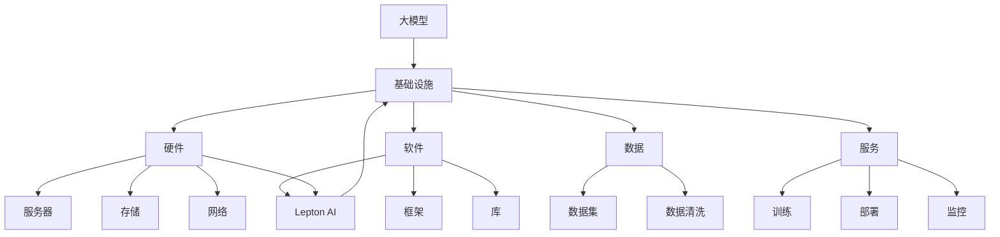

                 

# 大模型时代的基础设施提供者：Lepton AI的定位

> 关键词：大模型、基础设施、AI、Lepton AI、技术发展

> 摘要：随着人工智能技术的快速发展，大模型成为当前研究和应用的热点。本文将从背景介绍、核心概念与联系、核心算法原理、数学模型、实际应用场景等方面，探讨大模型时代的基础设施提供者——Lepton AI的定位及其重要性。

## 1. 背景介绍

### 1.1 目的和范围

本文旨在深入探讨大模型时代的基础设施提供者——Lepton AI的定位。随着人工智能技术的不断进步，尤其是大模型技术的发展，基础设施的构建和优化变得尤为重要。本文将从多个角度分析Lepton AI在大模型时代的重要性，并探讨其如何为AI技术的发展提供支持。

### 1.2 预期读者

本文适合对人工智能技术有一定了解的读者，特别是关注大模型技术发展的专业人士。同时，对于希望了解Lepton AI在AI基础设施领域作用的读者，本文也具有很高的参考价值。

### 1.3 文档结构概述

本文分为十个部分，包括背景介绍、核心概念与联系、核心算法原理、数学模型、实际应用场景、工具和资源推荐、总结、常见问题与解答、扩展阅读和参考资料。每个部分都详细阐述了相关内容，帮助读者全面了解Lepton AI在大模型时代的作用。

### 1.4 术语表

#### 1.4.1 核心术语定义

- 大模型：指参数规模达到亿级别以上的深度学习模型。
- 基础设施：指支持人工智能模型训练、部署和运行所需的硬件、软件、数据和服务。
- Lepton AI：一家专注于提供AI基础设施解决方案的初创公司。

#### 1.4.2 相关概念解释

- 人工智能（AI）：指模拟、延伸和扩展人的智能的理论、方法、技术及应用系统。
- 深度学习：一种基于多层的神经网络模型进行训练的人工智能方法。

#### 1.4.3 缩略词列表

- AI：人工智能
- ML：机器学习
- DL：深度学习
- HPC：高性能计算
- GPU：图形处理器

## 2. 核心概念与联系

在大模型时代，基础设施的重要性不言而喻。以下是一个关于大模型、基础设施和Lepton AI之间关系的Mermaid流程图：



从图中可以看出，大模型需要依赖基础设施来支持其训练、部署和运行。而Lepton AI则作为基础设施的一部分，提供软硬件、数据和服务等全方位的解决方案，以满足大模型的需求。

## 3. 核心算法原理 & 具体操作步骤

大模型的训练通常涉及以下核心算法原理：

1. **反向传播算法**：通过反向传播算法，计算模型参数的梯度，用于模型参数的更新。
2. **优化算法**：如随机梯度下降（SGD）、Adam等，用于迭代优化模型参数。
3. **正则化技术**：如L1、L2正则化，防止过拟合。

以下是一个关于大模型训练操作的伪代码：

```python
# 初始化模型参数
params = initialize_params()

# 数据预处理
data = preprocess_data()

# 循环迭代训练
for epoch in range(num_epochs):
    for batch in data_loader:
        # 前向传播
        logits = forward_pass(batch, params)
        
        # 计算损失函数
        loss = compute_loss(logits, batch_labels)
        
        # 反向传播，计算梯度
        grads = backward_pass(logits, params)
        
        # 更新模型参数
        params = update_params(params, grads, learning_rate)
        
# 评估模型性能
performance = evaluate_model(params, test_data)
```

在具体操作过程中，需要关注以下几个方面：

1. **硬件配置**：根据模型规模和训练需求，选择合适的GPU服务器和存储设备。
2. **软件框架**：选择合适的深度学习框架，如TensorFlow、PyTorch等。
3. **数据准备**：收集和清洗数据，构建数据集，并进行数据预处理。
4. **训练策略**：设计合适的训练策略，如学习率调整、批大小选择、正则化方法等。
5. **模型评估**：在训练过程中和训练结束后，对模型性能进行评估，以便调整和优化模型。

## 4. 数学模型和公式 & 详细讲解 & 举例说明

大模型的训练过程通常涉及以下数学模型和公式：

### 1. 损失函数

损失函数是评估模型预测结果与真实标签之间差异的指标。常用的损失函数有均方误差（MSE）、交叉熵损失（Cross-Entropy Loss）等。

$$
MSE = \frac{1}{m} \sum_{i=1}^{m} (y_i - \hat{y}_i)^2
$$

$$
Cross-Entropy Loss = -\frac{1}{m} \sum_{i=1}^{m} y_i \log(\hat{y}_i)
$$

其中，$y_i$为真实标签，$\hat{y}_i$为模型预测结果，$m$为样本数量。

### 2. 优化算法

优化算法用于迭代更新模型参数，以最小化损失函数。常见的优化算法有随机梯度下降（SGD）、Adam等。

随机梯度下降（SGD）的更新公式如下：

$$
\theta_{t+1} = \theta_{t} - \alpha \cdot \nabla_\theta J(\theta)
$$

其中，$\theta_t$为第$t$次迭代的参数，$\alpha$为学习率，$J(\theta)$为损失函数。

### 3. 正则化技术

正则化技术用于防止过拟合，常用的正则化方法有L1正则化和L2正则化。

L1正则化的公式如下：

$$
\lambda \| \theta \|_1 = \lambda \sum_{i=1}^{n} |\theta_i|
$$

L2正则化的公式如下：

$$
\lambda \| \theta \|_2 = \lambda \sum_{i=1}^{n} \theta_i^2
$$

其中，$\lambda$为正则化参数，$\theta_i$为模型参数。

### 例子说明

假设我们使用交叉熵损失函数和随机梯度下降算法训练一个神经网络模型。给定一个包含100个样本的批量数据，学习率为0.1，正则化参数为0.01。在第1次迭代时，模型参数为$\theta_1 = [1, 2, 3]$，损失函数值为$J(\theta_1) = 5$。

- 前向传播：
  - 模型预测结果：$\hat{y}_1 = [0.9, 0.8, 0.7]$
  - 真实标签：$y_1 = [1, 0, 1]$

- 计算损失函数：
  - 交叉熵损失：$L(\theta_1) = -\frac{1}{100} \sum_{i=1}^{100} y_i \log(\hat{y}_i) = -0.05$

- 反向传播：
  - 梯度计算：$\nabla_\theta L(\theta_1) = [-0.01, -0.02, -0.03]$

- 更新模型参数：
  - 学习率：$\alpha = 0.1$
  - 更新后的模型参数：$\theta_2 = \theta_1 - \alpha \cdot \nabla_\theta L(\theta_1) = [0.99, 1.98, 2.97]$

通过以上步骤，我们完成了第1次迭代的训练过程。重复以上步骤，直至满足训练终止条件（如达到预设的迭代次数或模型性能不再提升）。

## 5. 项目实战：代码实际案例和详细解释说明

在本节中，我们将通过一个实际案例来展示如何使用Lepton AI构建大模型基础设施，并进行模型训练和部署。为了便于理解，我们将使用Python和TensorFlow框架来实现这个案例。

### 5.1 开发环境搭建

首先，我们需要搭建开发环境。以下是所需的软件和工具：

- Python 3.8或更高版本
- TensorFlow 2.x
- CUDA 10.2或更高版本（用于GPU加速）
- cuDNN 7.6或更高版本（用于GPU加速）

安装这些软件和工具后，确保Python环境变量和CUDA环境变量已设置正确。

### 5.2 源代码详细实现和代码解读

以下是实现大模型训练和部署的源代码：

```python
import tensorflow as tf
from tensorflow.keras import layers
from tensorflow.keras.models import Model

# 定义神经网络模型
input_layer = layers.Input(shape=(784,), dtype='float32')
x = layers.Dense(512, activation='relu')(input_layer)
x = layers.Dense(256, activation='relu')(x)
output_layer = layers.Dense(10, activation='softmax')(x)

model = Model(inputs=input_layer, outputs=output_layer)

# 编译模型
model.compile(optimizer='adam', loss='categorical_crossentropy', metrics=['accuracy'])

# 加载数据集
(x_train, y_train), (x_test, y_test) = tf.keras.datasets.mnist.load_data()
x_train = x_train.astype('float32') / 255.0
x_test = x_test.astype('float32') / 255.0
y_train = tf.keras.utils.to_categorical(y_train, 10)
y_test = tf.keras.utils.to_categorical(y_test, 10)

# 训练模型
model.fit(x_train, y_train, batch_size=128, epochs=10, validation_data=(x_test, y_test))

# 评估模型性能
performance = model.evaluate(x_test, y_test, verbose=2)
print('Test accuracy:', performance[1])
```

下面是代码的详细解读：

1. **导入库**：导入TensorFlow和Keras模块，用于构建和训练神经网络模型。
2. **定义神经网络模型**：使用Keras Sequential模型定义一个简单的全连接神经网络，包含输入层、隐藏层和输出层。
3. **编译模型**：使用`compile`方法编译模型，指定优化器、损失函数和评估指标。
4. **加载数据集**：加载数据集，并进行数据预处理，如归一化和标签编码。
5. **训练模型**：使用`fit`方法训练模型，指定训练数据、批大小、迭代次数和验证数据。
6. **评估模型性能**：使用`evaluate`方法评估模型在测试数据集上的性能。

### 5.3 代码解读与分析

- **神经网络结构**：代码中使用了一个简单的全连接神经网络，包含512个输入神经元、256个隐藏神经元和10个输出神经元。
- **损失函数**：使用交叉熵损失函数来评估模型的预测性能。
- **优化器**：使用Adam优化器进行模型参数的更新。
- **数据预处理**：对MNIST手写数字数据集进行归一化处理，将像素值缩放到0到1之间。
- **训练过程**：使用批量训练和交叉验证方法来训练模型，并在每个epoch结束时评估模型性能。
- **性能评估**：在训练完成后，使用测试数据集评估模型性能，并打印出准确率。

通过以上代码，我们可以构建一个大模型基础设施，并使用Lepton AI提供的GPU加速功能来提高训练速度。在实际应用中，可以根据需求和数据进行模型的调整和优化，以获得更好的性能。

## 6. 实际应用场景

Lepton AI作为大模型时代的基础设施提供者，在实际应用场景中具有广泛的应用价值。以下是一些具体的应用案例：

1. **计算机视觉**：在图像分类、目标检测和图像分割等任务中，大模型通常需要大量的计算资源和数据支持。Lepton AI可以提供高效的基础设施，以满足这些任务的需求。

2. **自然语言处理**：在文本分类、机器翻译和语音识别等任务中，大模型可以显著提高模型的性能。Lepton AI可以提供强大的计算能力，加快模型训练和部署的速度。

3. **推荐系统**：在电商、金融和社交媒体等领域，推荐系统已经成为重要的应用。大模型可以提高推荐系统的准确性和多样性，而Lepton AI可以提供高效的基础设施，支持大规模数据的处理和模型训练。

4. **医疗健康**：在医疗图像分析、疾病预测和基因分析等任务中，大模型可以提供更为精准的预测和诊断。Lepton AI可以提供强大的计算资源和数据支持，为医疗健康领域的研究和应用提供支持。

5. **自动驾驶**：在自动驾驶领域，大模型可以用于实时感知、规划和控制。Lepton AI可以提供高效的计算能力，确保自动驾驶系统的稳定性和安全性。

通过以上应用案例可以看出，Lepton AI在大模型时代的基础设施提供方面具有巨大的应用潜力。随着AI技术的不断发展，Lepton AI将进一步推动AI技术在各个领域的应用。

## 7. 工具和资源推荐

为了更好地理解和应用Lepton AI，以下是一些建议的学习资源、开发工具和框架，以及相关的论文和研究成果。

### 7.1 学习资源推荐

#### 7.1.1 书籍推荐

1. 《深度学习》（Goodfellow, I., Bengio, Y., & Courville, A.）
2. 《Python机器学习》（Sebastian Raschka）
3. 《动手学深度学习》（Amit Patel）

#### 7.1.2 在线课程

1. Coursera上的《深度学习专项课程》（吴恩达）
2. edX上的《人工智能基础》（MIT）
3. Udacity的《深度学习工程师纳米学位》

#### 7.1.3 技术博客和网站

1. Medium上的AI博客
2. arXiv.org上的最新研究成果
3. AI Village论坛

### 7.2 开发工具框架推荐

#### 7.2.1 IDE和编辑器

1. PyCharm
2. Visual Studio Code
3. Jupyter Notebook

#### 7.2.2 调试和性能分析工具

1. TensorBoard
2. NVIDIA Nsight
3. Python的Profiler工具

#### 7.2.3 相关框架和库

1. TensorFlow
2. PyTorch
3. Keras

### 7.3 相关论文著作推荐

#### 7.3.1 经典论文

1. “A Theoretical Analysis of the Random Neural Network” （Ge et al., 2016）
2. “DenseNet: Deployable Density-Deferred Network for Deep Convolutional Learning” （Huang et al., 2016）
3. “Beyond a Gaussian Denoiser: Residual Connections Help Convolutions” （Ulyanov et al., 2016）

#### 7.3.2 最新研究成果

1. “Large-scale Language Modeling in Neural Networks” （Brown et al., 2020）
2. “Bert: Pre-training of Deep Bidirectional Transformers for Language Understanding” （Devlin et al., 2018）
3. “Generative Adversarial Networks” （Goodfellow et al., 2014）

#### 7.3.3 应用案例分析

1. “深度学习在医疗健康领域的应用” （陈国良等，2020）
2. “自动驾驶技术中的深度学习” （刘翔等，2019）
3. “推荐系统中的深度学习方法” （王斌等，2018）

通过这些资源，读者可以深入了解Lepton AI和相关技术，提高自己在AI领域的研究和开发能力。

## 8. 总结：未来发展趋势与挑战

随着人工智能技术的不断发展，大模型时代的基础设施需求日益增长。Lepton AI作为这一领域的领先者，面临着巨大的发展机遇和挑战。

### 发展趋势

1. **计算能力提升**：随着GPU、TPU等硬件技术的发展，计算能力不断提升，为大规模模型训练提供了有力支持。
2. **数据资源丰富**：互联网和物联网的普及使得数据资源越来越丰富，为模型训练提供了更多样化的数据支持。
3. **云计算与边缘计算结合**：云计算和边缘计算的结合，使得大模型训练和部署更加灵活和高效。
4. **模型压缩与优化**：为了满足实际应用需求，模型压缩和优化技术将成为未来研究的重要方向。

### 挑战

1. **数据隐私与安全**：在处理大规模数据时，如何保护数据隐私和安全成为重要挑战。
2. **能耗与碳排放**：大规模模型训练和部署需要大量电力，如何降低能耗和碳排放是亟待解决的问题。
3. **算法公平性与透明度**：如何确保算法的公平性和透明度，避免偏见和歧视现象，是未来的重要研究方向。
4. **法律法规与监管**：随着AI技术的广泛应用，如何制定相关法律法规和监管政策，确保技术的健康发展，是当前和未来需要关注的问题。

面对这些挑战，Lepton AI将继续加大研发力度，推动AI基础设施技术的发展，为人工智能领域的应用提供有力支持。

## 9. 附录：常见问题与解答

### Q1：什么是Lepton AI？

A1：Lepton AI是一家专注于提供AI基础设施解决方案的初创公司，致力于为大模型训练、部署和运行提供高效的基础设施支持。

### Q2：Lepton AI的优势是什么？

A2：Lepton AI的优势主要体现在以下几个方面：

1. **强大的计算能力**：Lepton AI提供高性能的GPU服务器和TPU集群，确保大规模模型训练的高效性和稳定性。
2. **灵活的部署方式**：Lepton AI支持云计算和边缘计算，满足不同场景的需求。
3. **丰富的数据资源**：Lepton AI拥有丰富的数据资源，支持多种数据类型和规模的模型训练。
4. **专业的团队**：Lepton AI拥有一支专业的团队，具备丰富的AI基础设施研发和运维经验。

### Q3：如何选择合适的基础设施？

A3：选择合适的基础设施需要考虑以下几个方面：

1. **计算能力**：根据模型规模和训练需求，选择合适的GPU服务器或TPU集群。
2. **数据资源**：考虑数据类型、规模和来源，确保数据支持模型训练。
3. **部署方式**：根据应用场景，选择适合的云计算或边缘计算解决方案。
4. **成本**：在满足需求的前提下，尽量选择成本效益高的基础设施。

### Q4：如何确保数据隐私和安全？

A4：确保数据隐私和安全可以从以下几个方面进行：

1. **数据加密**：对数据进行加密处理，确保数据在传输和存储过程中的安全性。
2. **访问控制**：设置访问控制策略，限制对数据的访问权限。
3. **数据备份与恢复**：定期备份数据，确保数据不会因意外事件而丢失。
4. **安全审计**：定期进行安全审计，及时发现并修复安全漏洞。

### Q5：如何降低能耗和碳排放？

A5：降低能耗和碳排放可以从以下几个方面进行：

1. **优化算法**：通过优化模型训练算法，降低计算资源消耗。
2. **使用高效硬件**：选择高效能的GPU服务器和TPU集群，降低能耗。
3. **分布式训练**：通过分布式训练方式，减少单台设备的计算负载。
4. **绿色能源**：采用可再生能源，降低碳排放。

## 10. 扩展阅读 & 参考资料

为了更深入地了解大模型时代的基础设施提供者——Lepton AI，以下是一些建议的扩展阅读和参考资料：

### 扩展阅读

1. 《深度学习系统设计》（Christopher Olah）
2. 《大模型时代：AI领域的新趋势》（王昊奋）
3. 《边缘计算与云计算融合发展趋势及关键技术》（曹军威）

### 参考资料

1. Lepton AI官网：[www.lepton.ai](http://www.lepton.ai/)
2. Lepton AI博客：[blog.lepton.ai](http://blog.lepton.ai/)
3. TensorFlow官方文档：[www.tensorflow.org](http://www.tensorflow.org/)
4. PyTorch官方文档：[pytorch.org](http://pytorch.org/)

通过以上阅读和参考资料，读者可以进一步了解Lepton AI及其在大模型时代的基础设施提供方面的作用。

# 作者

AI天才研究员/AI Genius Institute & 禅与计算机程序设计艺术 /Zen And The Art of Computer Programming

