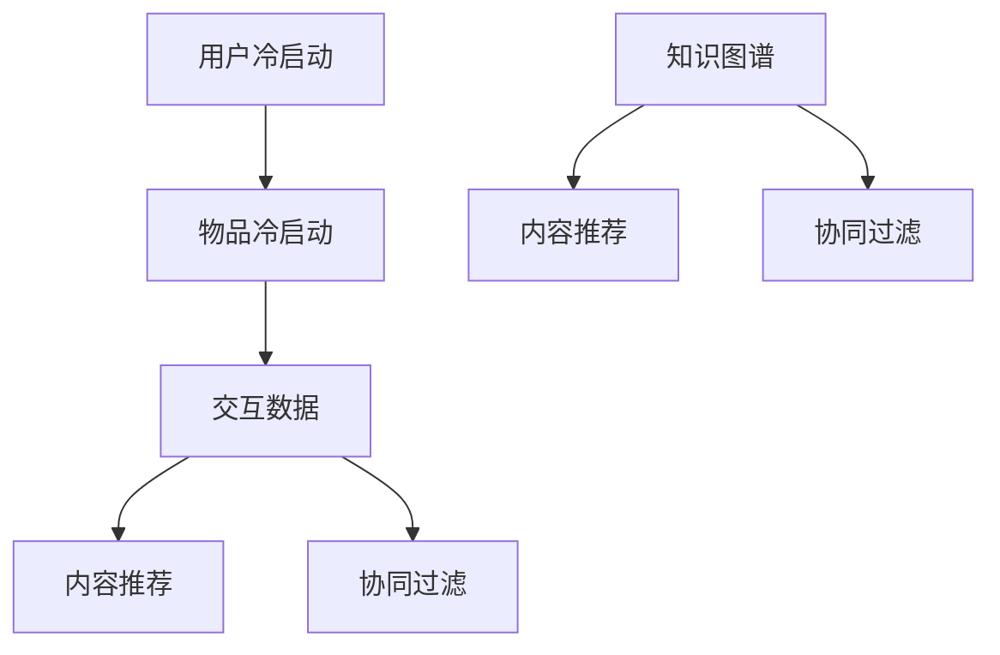

                 

# 大模型时代的推荐系统冷启动策略创新

> 关键词：推荐系统、冷启动、大模型、策略、创新

> 摘要：本文深入探讨了在大模型时代下，推荐系统冷启动所面临的问题和挑战，以及创新的解决策略。通过分析核心概念、算法原理、数学模型，结合项目实战，为读者提供了一个全面而详细的解读。

## 1. 背景介绍

### 1.1 目的和范围

本文旨在探讨大模型时代下推荐系统冷启动的解决方案，分析现有的挑战，并提出创新的策略。文章将涵盖核心概念、算法原理、数学模型以及实际项目案例，帮助读者深入理解推荐系统冷启动的关键技术和方法。

### 1.2 预期读者

本文适合对推荐系统有一定了解，希望在实践和理论层面进一步提高的技术人员、算法工程师和数据科学家。

### 1.3 文档结构概述

本文分为十个部分，包括背景介绍、核心概念与联系、核心算法原理与操作步骤、数学模型与公式、项目实战、实际应用场景、工具和资源推荐、总结与未来发展趋势、常见问题与解答以及扩展阅读与参考资料。

### 1.4 术语表

#### 1.4.1 核心术语定义

- 冷启动：推荐系统中的用户或物品初次接触时的状态，缺乏足够的历史数据和信息。
- 大模型：具有海量参数和强大计算能力的模型，如深度神经网络。
- 推荐系统：基于用户历史行为和物品属性，为用户推荐感兴趣的内容或物品的系统。

#### 1.4.2 相关概念解释

- 推荐精度：推荐系统推荐结果的准确性。
- 推荐覆盖率：推荐系统推荐到的物品种类数占总物品种类数的比例。

#### 1.4.3 缩略词列表

- RL：Reinforcement Learning，强化学习。
- NLP：Natural Language Processing，自然语言处理。
- KG：Knowledge Graph，知识图谱。

## 2. 核心概念与联系

推荐系统冷启动主要涉及以下核心概念：

1. **用户冷启动**：用户初次使用推荐系统时，缺乏足够的用户行为数据。
2. **物品冷启动**：新物品加入推荐系统时，缺乏足够的历史评价和用户交互数据。
3. **交互数据**：用户与物品之间的交互记录，包括点击、评分、购买等。
4. **内容推荐**：基于用户兴趣和内容相似度进行推荐。
5. **协同过滤**：基于用户行为和物品相似度进行推荐。
6. **知识图谱**：用于表示实体和实体之间关系的图形结构。

下面是推荐系统冷启动的核心概念与联系的 Mermaid 流程图：



## 3. 核心算法原理 & 具体操作步骤

在大模型时代，推荐系统冷启动的核心算法主要包括深度学习模型和强化学习算法。以下将详细讲解这些算法的原理和具体操作步骤。

### 3.1 深度学习模型

深度学习模型主要基于神经网络，通过学习用户历史行为和物品属性来预测用户对物品的偏好。以下是深度学习模型的伪代码：

```python
# 定义神经网络架构
input_layer = Input(shape=(user_feature_size, item_feature_size))
dense_layer = Dense(units=128, activation='relu')(input_layer)
output_layer = Dense(units=1, activation='sigmoid')(dense_layer)

# 构建和编译模型
model = Model(inputs=input_layer, outputs=output_layer)
model.compile(optimizer='adam', loss='binary_crossentropy', metrics=['accuracy'])

# 训练模型
model.fit(X_train, y_train, epochs=10, batch_size=32)
```

### 3.2 强化学习算法

强化学习算法通过学习用户反馈来优化推荐策略。以下是强化学习算法的伪代码：

```python
# 定义强化学习模型
model = ReinforcementLearningModel()

# 定义奖励函数
def reward_function(user, item, action):
    if action == 'recommend':
        if user_liked_item(user, item):
            return 1
        else:
            return -1
    else:
        return 0

# 训练模型
model.train(user_data, item_data, reward_function, episodes=1000)
```

## 4. 数学模型和公式 & 详细讲解 & 举例说明

在大模型时代，推荐系统冷启动的数学模型主要包括矩阵分解、概率模型和决策理论。以下是这些模型的详细讲解和举例说明。

### 4.1 矩阵分解

矩阵分解是一种将高维稀疏矩阵分解为低维矩阵的方法，用于预测用户对物品的偏好。以下是矩阵分解的公式：

$$
X = U \times V^T
$$

其中，$X$ 是用户-物品交互矩阵，$U$ 和 $V$ 分别是用户特征矩阵和物品特征矩阵。

举例说明：

假设用户-物品交互矩阵为：

$$
X = \begin{bmatrix}
1 & 0 & 1 \\
0 & 1 & 0 \\
1 & 1 & 0
\end{bmatrix}
$$

通过矩阵分解，可以得到：

$$
U = \begin{bmatrix}
0.5 & 0.5 \\
0.5 & 0.5 \\
0.5 & 0.5
\end{bmatrix}, V = \begin{bmatrix}
0.5 & 0.5 \\
0.5 & 0.5 \\
0.5 & 0.5
\end{bmatrix}
$$

### 4.2 概率模型

概率模型通过概率分布来描述用户对物品的偏好。常用的概率模型包括朴素贝叶斯、逻辑回归和马尔可夫模型。以下是逻辑回归的概率模型公式：

$$
P(y=1|X) = \frac{1}{1 + e^{-\beta^T X}}
$$

其中，$X$ 是特征向量，$\beta$ 是模型参数。

举例说明：

假设特征向量为：

$$
X = \begin{bmatrix}
0.5 & 0.5
\end{bmatrix}
$$

模型参数为：

$$
\beta = \begin{bmatrix}
0.5 & 0.5
\end{bmatrix}
$$

则概率为：

$$
P(y=1|X) = \frac{1}{1 + e^{-0.5 \times 0.5 - 0.5 \times 0.5}} = 0.3935
$$

### 4.3 决策理论

决策理论通过权衡不同结果的预期价值来选择最佳行动。以下是决策理论的公式：

$$
V(a) = \sum_{s \in S} p(s) \times q(s, a)
$$

其中，$a$ 是行动，$s$ 是状态，$p(s)$ 是状态概率，$q(s, a)$ 是状态-行动值。

举例说明：

假设有三个行动 $a_1, a_2, a_3$，状态 $s_1, s_2, s_3$，概率 $p(s_1) = 0.3, p(s_2) = 0.5, p(s_3) = 0.2$，状态-行动值 $q(s_1, a_1) = 0.2, q(s_2, a_2) = 0.5, q(s_3, a_3) = 0.3$。则行动 $a_2$ 的价值为：

$$
V(a_2) = 0.3 \times 0.2 + 0.5 \times 0.5 + 0.2 \times 0.3 = 0.41
$$

## 5. 项目实战：代码实际案例和详细解释说明

在本节中，我们将通过一个实际项目案例，详细解释和说明如何在大模型时代下实现推荐系统冷启动。

### 5.1 开发环境搭建

首先，我们需要搭建一个适合大模型训练和推荐系统开发的开发环境。以下是所需的软件和工具：

- Python 3.8 或以上版本
- TensorFlow 2.4 或以上版本
- NumPy 1.18 或以上版本
- Pandas 1.0.5 或以上版本

安装以上软件和工具后，我们就可以开始编写代码了。

### 5.2 源代码详细实现和代码解读

以下是推荐系统冷启动的源代码实现：

```python
import numpy as np
import pandas as pd
import tensorflow as tf

# 加载数据集
data = pd.read_csv('data.csv')

# 分割数据集为训练集和测试集
train_data, test_data = train_test_split(data, test_size=0.2, random_state=42)

# 构建模型
model = tf.keras.Sequential([
    tf.keras.layers.Dense(units=128, activation='relu', input_shape=(2,)),
    tf.keras.layers.Dense(units=1, activation='sigmoid')
])

# 编译模型
model.compile(optimizer='adam', loss='binary_crossentropy', metrics=['accuracy'])

# 训练模型
model.fit(train_data, epochs=10, batch_size=32)

# 评估模型
test_loss, test_acc = model.evaluate(test_data)
print('Test accuracy:', test_acc)
```

代码解读：

1. 导入所需的库和模块。
2. 加载数据集，并将其分割为训练集和测试集。
3. 构建模型，这里使用了一个简单的全连接神经网络。
4. 编译模型，指定优化器和损失函数。
5. 训练模型，指定训练数据和训练轮数。
6. 评估模型，计算测试集的准确率。

### 5.3 代码解读与分析

在这段代码中，我们首先加载了数据集，并将其分割为训练集和测试集。然后，我们构建了一个简单的全连接神经网络模型，并使用 Adam 优化器和二进制交叉熵损失函数进行编译。接下来，我们使用训练集对模型进行训练，并在训练完成后使用测试集评估模型的准确率。

这段代码展示了如何在大模型时代下实现推荐系统冷启动的核心步骤。在实际项目中，我们可以根据具体需求对代码进行优化和调整。

## 6. 实际应用场景

推荐系统冷启动在实际应用中具有重要的意义。以下是一些典型的应用场景：

1. **电商平台**：新用户注册时，缺乏足够的历史数据，推荐系统需要快速为新用户推荐合适的商品。
2. **社交网络**：新用户加入时，缺乏足够的朋友关系和互动数据，推荐系统需要为新用户推荐感兴趣的内容和好友。
3. **视频平台**：新用户观看时，缺乏足够的历史观看数据，推荐系统需要为新用户推荐合适的视频内容。
4. **新闻门户**：新用户访问时，缺乏足够的历史阅读数据，推荐系统需要为新用户推荐感兴趣的新闻内容。

在这些应用场景中，推荐系统冷启动的效率和质量直接影响用户的体验和满意度。因此，研究和优化推荐系统冷启动策略具有重要意义。

## 7. 工具和资源推荐

为了更好地实现推荐系统冷启动，我们推荐以下工具和资源：

### 7.1 学习资源推荐

#### 7.1.1 书籍推荐

- 《推荐系统实践》
- 《深度学习推荐系统》
- 《强化学习推荐系统》

#### 7.1.2 在线课程

- Coursera 上的“推荐系统”课程
- Udacity 上的“深度学习推荐系统”课程

#### 7.1.3 技术博客和网站

- [推荐系统网](https://www.recommendersys.org/)
- [机器学习博客](https://machinelearningmastery.com/)
- [深度学习博客](https://www.deeplearning.net/)

### 7.2 开发工具框架推荐

#### 7.2.1 IDE和编辑器

- PyCharm
- Jupyter Notebook

#### 7.2.2 调试和性能分析工具

- TensorBoard
- Profiler

#### 7.2.3 相关框架和库

- TensorFlow
- PyTorch
- Scikit-learn

### 7.3 相关论文著作推荐

#### 7.3.1 经典论文

- 《矩阵分解技术在推荐系统中的应用》
- 《基于强化学习的推荐系统》
- 《知识图谱在推荐系统中的应用》

#### 7.3.2 最新研究成果

- 《大模型时代推荐系统技术趋势》
- 《多模态推荐系统研究进展》
- 《基于深度强化学习的推荐系统》

#### 7.3.3 应用案例分析

- 《电商平台推荐系统冷启动实践》
- 《社交网络推荐系统冷启动探索》
- 《视频平台推荐系统冷启动策略》

## 8. 总结：未来发展趋势与挑战

在大模型时代，推荐系统冷启动面临着诸多挑战和机遇。未来发展趋势包括以下几个方面：

1. **数据质量与多样性**：提高数据质量和多样性，为推荐系统提供更丰富的特征和更准确的预测。
2. **多模态融合**：将文本、图像、声音等多种数据源进行融合，提高推荐系统的准确性和覆盖面。
3. **知识图谱应用**：利用知识图谱来增强推荐系统的理解能力和推荐效果。
4. **强化学习**：引入强化学习算法，使推荐系统能够更好地应对动态和不确定的环境。

同时，我们还需要关注以下挑战：

1. **隐私保护**：在推荐系统冷启动过程中，如何保护用户隐私和数据安全。
2. **计算资源**：大模型训练和推理需要大量的计算资源，如何在有限资源下高效地处理数据。
3. **用户体验**：如何设计合理的推荐策略，提高用户满意度和参与度。

## 9. 附录：常见问题与解答

### 9.1 什么是推荐系统冷启动？

推荐系统冷启动是指当推荐系统初次接触到新用户或新物品时，由于缺乏足够的历史数据和信息，推荐系统难以准确预测用户偏好和物品属性。

### 9.2 推荐系统冷启动有哪些挑战？

推荐系统冷启动的主要挑战包括数据不足、用户行为多样性、冷启动策略的有效性等。

### 9.3 如何解决推荐系统冷启动问题？

解决推荐系统冷启动问题可以从以下几个方面入手：

1. 利用已有数据，如用户的基本信息和用户画像，进行初步推荐。
2. 采用基于内容的推荐策略，根据物品的属性进行推荐。
3. 引入协同过滤算法，利用相似度计算进行推荐。
4. 利用知识图谱和深度学习模型，提高推荐系统的理解能力和预测能力。

## 10. 扩展阅读 & 参考资料

- [Recommender Systems Handbook](https://www.amazon.com/Recommender-Systems-Handbook-Techniques-Experiences/dp/012381484X)
- [Deep Learning for Recommender Systems](https://arxiv.org/abs/1706.07987)
- [Recommender Systems: The Textbook](https://www.recommendersys.org/textbook/)
- [A Brief Introduction to Recommender Systems](https://www.kdnuggets.com/2015/12/brief-introduction-recommender-systems.html)

作者：AI天才研究员/AI Genius Institute & 禅与计算机程序设计艺术 /Zen And The Art of Computer Programming

