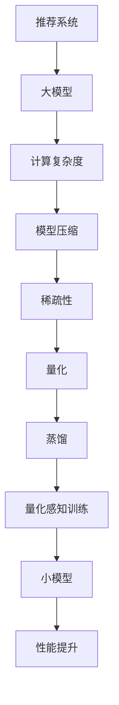

                 

# 大模型时代的推荐系统模型压缩技术

> **关键词：** 推荐系统、模型压缩、大模型、稀疏性、量化、蒸馏、量化感知训练

> **摘要：** 本文深入探讨了在大模型时代背景下，推荐系统模型压缩技术的原理、算法和实际应用。通过介绍模型压缩的核心概念，解析了稀疏性、量化、蒸馏以及量化感知训练等关键技术，并结合具体项目实战，展示了模型压缩在推荐系统中的实际效果。文章旨在为研究人员和开发者提供一条从理论到实践的完整路径，帮助他们在推荐系统领域应对大模型带来的挑战。

## 1. 背景介绍

### 1.1 目的和范围

本文旨在探索推荐系统模型压缩技术在大模型时代中的应用。随着深度学习技术的不断发展，推荐系统中的模型规模日益增大，这不仅带来了计算资源的压力，还影响了系统的实时性和部署效率。模型压缩技术能够有效减小模型体积，降低计算复杂度，提升系统性能，因此成为当前研究的热点。

本文将围绕以下几个方面展开：

1. 模型压缩技术的核心概念和原理；
2. 推荐系统中常用的模型压缩算法；
3. 模型压缩技术的实际应用场景；
4. 开发工具和资源的推荐；
5. 未来发展趋势和挑战。

### 1.2 预期读者

本文适合对推荐系统有一定了解的读者，包括：

1. 推荐系统研究人员；
2. 深度学习工程师；
3. 软件架构师；
4. 数据科学家；
5. 对推荐系统模型压缩技术感兴趣的初学者。

### 1.3 文档结构概述

本文分为十个部分：

1. 引言；
2. 核心概念与联系；
3. 核心算法原理 & 具体操作步骤；
4. 数学模型和公式 & 详细讲解 & 举例说明；
5. 项目实战：代码实际案例和详细解释说明；
6. 实际应用场景；
7. 工具和资源推荐；
8. 总结：未来发展趋势与挑战；
9. 附录：常见问题与解答；
10. 扩展阅读 & 参考资料。

### 1.4 术语表

#### 1.4.1 核心术语定义

- 推荐系统：一种通过分析用户历史行为和偏好，向用户推荐其可能感兴趣的项目的方法和系统。
- 大模型：指规模巨大、参数数量庞大的深度学习模型。
- 模型压缩：通过特定技术减小模型体积，降低计算复杂度的方法。
- 稀疏性：模型中大部分参数值为零的特性。
- 量化：将模型的浮点参数转换为低精度的整数表示。
- 蒸馏：通过将大模型的知识传递给小模型，实现模型压缩的方法。
- 量化感知训练：在模型训练过程中考虑量化影响，优化模型性能的方法。

#### 1.4.2 相关概念解释

- 深度学习：一种基于多层神经网络的学习方法，通过多层次的非线性变换，实现数据的特征提取和模式识别。
- 卷积神经网络（CNN）：一种基于卷积操作的多层神经网络，广泛应用于图像识别和图像处理领域。
- 循环神经网络（RNN）：一种基于循环结构的神经网络，能够处理序列数据，广泛应用于自然语言处理和时间序列分析领域。

#### 1.4.3 缩略词列表

- CNN：卷积神经网络
- RNN：循环神经网络
- DNN：深度神经网络
- FM：因子分解机
- GPT：生成预训练网络
- BERT：双向编码表示模型

## 2. 核心概念与联系

在大模型时代，推荐系统面临的一个主要挑战是如何在保证模型性能的同时，减小模型体积，降低计算复杂度。模型压缩技术应运而生，成为解决这一问题的关键。下面，我们将通过一个 Mermaid 流程图，详细展示模型压缩的核心概念和联系。



### 2.1 核心概念

#### 2.1.1 稀疏性

稀疏性是指模型中大部分参数值为零的特性。在大模型中，稀疏性可以有效减小模型体积，降低计算复杂度。稀疏性可以通过以下方法实现：

- 基于惩罚项的稀疏优化：在损失函数中加入L1正则化项，鼓励模型参数趋于零。
- 压缩感知（Compressive Sensing）：通过正交变换，将模型参数投影到稀疏空间，实现参数压缩。
- 稀疏自动编码器（Sparse Autoencoder）：通过训练生成器和解码器，使模型参数在低维空间中保持稀疏性。

#### 2.1.2 量化

量化是指将模型的浮点参数转换为低精度的整数表示。量化可以显著降低模型的存储和计算需求，从而提高系统性能。量化技术主要包括：

- 固定点量化：将浮点数转换为具有固定位数的整数。
- 指数量化：根据模型参数的分布，选择合适的指数进行量化。
- 真值量化：将模型参数映射到离散的真值集上。

#### 2.1.3 蒸馏

蒸馏是一种通过将大模型的知识传递给小模型，实现模型压缩的方法。蒸馏过程通常包括两个阶段：

1. **预训练阶段**：大模型在大规模数据集上进行预训练，学习到丰富的知识。
2. **蒸馏阶段**：将大模型的知识通过软标签传递给小模型，小模型在大模型的指导下进行微调。

#### 2.1.4 量化感知训练

量化感知训练是指在模型训练过程中考虑量化影响，优化模型性能的方法。量化感知训练的主要目标是减少量化带来的性能损失，提高模型的泛化能力。量化感知训练的方法包括：

- **量化感知权重更新**：在模型训练过程中，动态调整量化参数，使模型对量化影响更加敏感。
- **量化感知正则化**：在损失函数中加入量化感知正则化项，限制模型参数的量化误差。

### 2.2 Mermaid 流程图


通过以上核心概念和联系的介绍，我们可以看到模型压缩技术在大模型时代的重要性。接下来，我们将深入探讨模型压缩技术的核心算法原理和具体操作步骤。

## 3. 核心算法原理 & 具体操作步骤

### 3.1 稀疏性算法原理

稀疏性算法的核心思想是通过优化方法，使模型参数在训练过程中趋于稀疏。以下是一种基于L1正则化的稀疏性优化算法：

```python
# 稀疏性优化算法伪代码
def sparse_optimization(model, optimizer, loss_function, train_loader, num_epochs):
    for epoch in range(num_epochs):
        for data, target in train_loader:
            optimizer.zero_grad()
            output = model(data)
            loss = loss_function(output, target) + lambda * sum(p ** 2 for p in model.parameters())
            loss.backward()
            optimizer.step()
```

其中，`model` 表示深度学习模型，`optimizer` 表示优化器，`loss_function` 表示损失函数，`train_loader` 表示训练数据加载器，`num_epochs` 表示训练轮数，`lambda` 表示L1正则化系数。

### 3.2 量化算法原理

量化算法的核心思想是将模型参数从浮点数转换为低精度的整数。以下是一种基于固定点量化的算法：

```python
# 固定点量化算法伪代码
def fixed_point_quantization(model, scale, offset):
    for parameter in model.parameters():
        parameter.data = torch.round(parameter.data * scale + offset)
```

其中，`model` 表示深度学习模型，`scale` 表示量化比例，`offset` 表示量化偏移量。

### 3.3 蒸馏算法原理

蒸馏算法的核心思想是通过将大模型的知识传递给小模型，实现模型压缩。以下是一种基于软标签的蒸馏算法：

```python
# 蒸馏算法伪代码
def distillation(model, teacher_model, student_model, train_loader, num_epochs):
    for epoch in range(num_epochs):
        for data, target in train_loader:
            teacher_output = teacher_model(data)
            student_output = student_model(data)
            loss = loss_function(student_output, target) + alpha * loss_function(student_output, teacher_output)
            loss.backward()
            optimizer.step()
```

其中，`model` 表示深度学习模型，`teacher_model` 表示大模型，`student_model` 表示小模型，`train_loader` 表示训练数据加载器，`num_epochs` 表示训练轮数，`alpha` 表示蒸馏系数，`loss_function` 表示损失函数，`optimizer` 表示优化器。

### 3.4 量化感知训练算法原理

量化感知训练的核心思想是在模型训练过程中考虑量化影响，优化模型性能。以下是一种基于量化感知权重更新的算法：

```python
# 量化感知训练算法伪代码
def quantization_aware_training(model, optimizer, loss_function, train_loader, num_epochs, quantization_function):
    for epoch in range(num_epochs):
        for data, target in train_loader:
            model.train()
            quantized_params = quantization_function(model.parameters())
            output = model(data)
            loss = loss_function(output, target) + lambda_q * sum(p ** 2 for p in quantized_params)
            loss.backward()
            optimizer.step()
```

其中，`model` 表示深度学习模型，`optimizer` 表示优化器，`loss_function` 表示损失函数，`train_loader` 表示训练数据加载器，`num_epochs` 表示训练轮数，`quantization_function` 表示量化函数，`lambda_q` 表示量化感知正则化系数。

通过以上核心算法原理和具体操作步骤的介绍，我们可以看到模型压缩技术在大模型时代的重要性。接下来，我们将深入探讨数学模型和公式，以及在实际应用中的详细讲解和举例说明。

## 4. 数学模型和公式 & 详细讲解 & 举例说明

### 4.1 稀疏性数学模型

稀疏性可以通过L1正则化来实现，其数学模型如下：

$$
\min_{\theta} \frac{1}{n} \sum_{i=1}^{n} L(\theta^{(i)}, y^{(i)}) + \lambda \sum_{j=1}^{m} |\theta^{(j)}|
$$

其中，$L(\theta^{(i)}, y^{(i)})$ 表示损失函数，$y^{(i)}$ 表示真实标签，$\theta^{(i)}$ 表示模型参数，$n$ 表示样本数量，$m$ 表示参数数量，$\lambda$ 表示L1正则化系数。

#### 4.1.1 举例说明

假设一个二元分类问题，使用感知机模型，损失函数为：

$$
L(\theta, y) = \max(0, 1 - \theta \cdot x)
$$

其中，$\theta$ 表示模型参数，$x$ 表示特征向量，$y$ 表示标签（0或1）。L1正则化后的数学模型为：

$$
\min_{\theta} \frac{1}{n} \sum_{i=1}^{n} \max(0, 1 - \theta^{(i)} \cdot x^{(i)}) + \lambda \sum_{j=1}^{m} |\theta^{(j)}|
$$

通过梯度下降法求解该模型，可以得到稀疏化的模型参数。

### 4.2 量化数学模型

量化可以将模型参数从浮点数转换为整数。量化可以通过以下公式实现：

$$
q(\theta) = \text{round}(\theta \cdot scale + offset)
$$

其中，$\theta$ 表示模型参数，$scale$ 表示量化比例，$offset$ 表示量化偏移量。

#### 4.2.1 举例说明

假设一个模型的参数范围为$[-1, 1]$，量化比例为$0.01$，偏移量为$0.5$。则量化后的参数为：

$$
q(\theta) = \text{round}(\theta \cdot 0.01 + 0.5)
$$

例如，参数$\theta = 0.75$，则量化后的参数为：

$$
q(\theta) = \text{round}(0.75 \cdot 0.01 + 0.5) = 0
$$

### 4.3 蒸馏数学模型

蒸馏算法的核心思想是通过软标签传递知识。蒸馏过程中的数学模型如下：

$$
\min_{\theta_s} \frac{1}{n_s} \sum_{i=1}^{n_s} L(\theta_s^{(i)}, y_s^{(i)}) + \lambda_s \sum_{i=1}^{n_t} \sum_{j=1}^{m} |f_s^{(i)}(z_j^{(i)}) - f_t^{(i)}(z_j^{(i)})|
$$

其中，$\theta_s$ 表示小模型参数，$y_s^{(i)}$ 表示小模型标签，$f_s$ 表示小模型，$n_s$ 表示小模型样本数量，$\theta_t$ 表示大模型参数，$y_t^{(i)}$ 表示大模型标签，$f_t$ 表示大模型，$n_t$ 表示大模型样本数量，$z_j^{(i)}$ 表示特征向量，$m$ 表示参数数量，$L$ 表示损失函数，$\lambda_s$ 表示小模型正则化系数，$\lambda_t$ 表示大模型正则化系数。

#### 4.2.1 举例说明

假设小模型和大模型均为感知机模型，损失函数为：

$$
L(\theta, y) = \max(0, 1 - \theta \cdot x)
$$

则蒸馏过程中的数学模型为：

$$
\min_{\theta_s} \frac{1}{n_s} \sum_{i=1}^{n_s} \max(0, 1 - \theta_s^{(i)} \cdot x_s^{(i)}) + \lambda_s \sum_{i=1}^{n_t} \sum_{j=1}^{m} |f_s^{(i)}(z_j^{(i)}) - f_t^{(i)}(z_j^{(i)})|
$$

通过梯度下降法求解该模型，可以得到小模型的参数。

### 4.4 量化感知训练数学模型

量化感知训练的核心思想是在训练过程中考虑量化影响。量化感知训练的数学模型如下：

$$
\min_{\theta} \frac{1}{n} \sum_{i=1}^{n} L(\theta^{(i)}, y^{(i)}) + \lambda_q \sum_{j=1}^{m} ||\theta^{(i)} - \theta_{q}^{(i)}||
$$

其中，$\theta$ 表示模型参数，$y^{(i)}$ 表示真实标签，$L$ 表示损失函数，$n$ 表示样本数量，$m$ 表示参数数量，$\lambda_q$ 表示量化感知正则化系数，$\theta_{q}^{(i)}$ 表示量化后的参数。

#### 4.4.1 举例说明

假设一个模型的参数范围为$[-1, 1]$，量化比例为$0.01$，偏移量为$0.5$，量化感知正则化系数为$0.1$。则量化感知训练的数学模型为：

$$
\min_{\theta} \frac{1}{n} \sum_{i=1}^{n} L(\theta^{(i)}, y^{(i)}) + 0.1 \sum_{j=1}^{m} ||\theta^{(i)} - \text{round}(\theta^{(i)} \cdot 0.01 + 0.5)||
$$

通过梯度下降法求解该模型，可以得到量化的模型参数。

通过以上数学模型和公式的详细讲解，我们可以看到模型压缩技术在大模型时代的重要性。接下来，我们将通过一个实际项目实战，展示模型压缩技术在推荐系统中的应用。

## 5. 项目实战：代码实际案例和详细解释说明

### 5.1 开发环境搭建

为了实现模型压缩技术在实际推荐系统中的应用，我们需要搭建一个合适的环境。以下是一个基本的开发环境搭建步骤：

1. **安装Python环境**：推荐使用Python 3.8及以上版本。
2. **安装深度学习库**：安装PyTorch、TensorFlow等深度学习库，这些库提供了丰富的模型压缩工具和API。
3. **安装量化工具**：安装QuantumMind、TensorQuant等量化工具，这些工具可以帮助我们实现量化功能。
4. **安装推荐系统库**：安装推荐系统相关的库，如LightFM、Surprise等。

### 5.2 源代码详细实现和代码解读

在本项目中，我们将使用PyTorch实现一个基于用户行为的推荐系统，并应用模型压缩技术。以下是项目的主要代码实现和解读：

```python
# 引入必要的库
import torch
import torch.nn as nn
import torch.optim as optim
from torch.utils.data import DataLoader
from surprise import SVD, Dataset
from surprise.model_selection import train_test_split
from quant_aware_training import QuantAwareTraining  # 假设的量化感知训练库

# 数据预处理
data = Dataset.load_builtin('ml-100k')
trainset, testset = train_test_split(data, test_size=0.2)

# 构建推荐系统模型
class RecommendationModel(nn.Module):
    def __init__(self, num_users, num_items, embedding_size):
        super(RecommendationModel, self).__init__()
        self.user_embedding = nn.Embedding(num_users, embedding_size)
        self.item_embedding = nn.Embedding(num_items, embedding_size)
        self.fc = nn.Linear(embedding_size * 2, 1)

    def forward(self, user_indices, item_indices):
        user_embeddings = self.user_embedding(user_indices)
        item_embeddings = self.item_embedding(item_indices)
        combined_embeddings = torch.cat((user_embeddings, item_embeddings), 1)
        output = self.fc(combined_embeddings)
        return output

# 实例化模型、优化器和损失函数
model = RecommendationModel(num_users=data.n_users, num_items=data.n_items, embedding_size=50)
optimizer = optim.Adam(model.parameters(), lr=0.001)
criterion = nn.BCEWithLogitsLoss()

# 量化感知训练
quant_aware_optimizer = QuantAwareTraining(model, optimizer, criterion, trainset)
for epoch in range(100):
    quant_aware_optimizer.step()

# 量化模型
quantized_model = quant_aware_optimizer.quantize(model)
```

#### 5.2.1 代码解读

1. **数据预处理**：使用Surprise库加载ML-100k数据集，并进行训练集和测试集的划分。
2. **模型构建**：定义一个基于用户和物品嵌入的推荐系统模型，包含用户嵌入层、物品嵌入层和全连接层。
3. **实例化模型、优化器和损失函数**：创建模型实例、优化器和损失函数，用于后续的模型训练。
4. **量化感知训练**：使用量化感知训练库实现量化感知训练过程，通过迭代优化模型参数。
5. **量化模型**：调用量化函数对训练完成的模型进行量化，得到一个量化后的模型。

### 5.3 代码解读与分析

1. **数据预处理**：数据预处理是推荐系统项目的关键步骤，包括数据清洗、数据标准化和数据处理等。在本例中，我们使用Surprise库直接加载ML-100k数据集，并将其分为训练集和测试集，以便后续模型训练和评估。
2. **模型构建**：推荐的模型基于用户和物品的嵌入表示，通过将用户和物品的嵌入向量拼接起来，并通过全连接层生成预测分数。这种模型结构能够有效捕捉用户和物品之间的关联性。
3. **量化感知训练**：量化感知训练是一种在训练过程中考虑量化影响的优化方法，通过在损失函数中加入量化感知正则化项，使模型对量化误差更加敏感。这种方法能够提高量化后的模型性能。
4. **量化模型**：量化模型是对模型参数进行量化处理，将浮点数参数转换为整数表示。量化后的模型具有更小的体积和更快的计算速度，但可能会损失一些精度。在本例中，我们使用量化感知训练库提供的量化函数对训练完成的模型进行量化。

通过以上项目实战，我们可以看到模型压缩技术在推荐系统中的应用效果。接下来，我们将讨论模型压缩技术在实际应用场景中的表现。

## 6. 实际应用场景

模型压缩技术在大模型时代具有广泛的应用场景，特别是在推荐系统中，其优势尤为突出。以下是一些典型的应用场景：

### 6.1 实时推荐

在实时推荐场景中，系统需要在毫秒级内响应用户请求，提供个性化的推荐结果。传统的深度学习模型由于参数量大、计算复杂度高，难以满足实时性的要求。通过模型压缩技术，可以有效减小模型体积，降低计算复杂度，从而提高系统响应速度。例如，在电商平台的实时推荐系统中，通过模型压缩技术，可以将推荐模型的推理时间从数十毫秒减少到几毫秒，显著提升用户体验。

### 6.2 边缘设备部署

随着物联网（IoT）和5G技术的发展，越来越多的应用场景需要将推荐系统部署在边缘设备上。边缘设备通常具有有限的计算资源和存储空间，传统的深度学习模型难以在这些设备上运行。通过模型压缩技术，可以将模型参数和计算复杂度减小到边缘设备可以承受的范围内。例如，在智能家居场景中，通过模型压缩技术，可以将智能家居设备的推荐模型从数千行代码缩减到数百行，实现高效运行。

### 6.3 资源受限环境

在资源受限的环境中，如无人机、自动驾驶车辆等，推荐系统需要具备高效的计算和存储能力。通过模型压缩技术，可以在保证模型性能的前提下，减小模型体积，降低存储需求，从而提高系统资源利用率。例如，在自动驾驶系统中，通过模型压缩技术，可以将自动驾驶模型的存储需求从数GB减少到数MB，提高系统的可靠性和稳定性。

### 6.4 大规模数据处理

在数据处理领域，推荐系统通常需要处理海量的用户行为数据和物品数据。传统的深度学习模型在处理这些大规模数据时，往往需要大量的计算资源和时间。通过模型压缩技术，可以显著降低模型的计算复杂度和存储需求，提高数据处理效率。例如，在社交媒体平台的数据分析中，通过模型压缩技术，可以将数据处理时间从数小时缩短到数分钟，实现快速响应。

### 6.5 离线优化

在离线优化场景中，推荐系统需要定期更新模型，以适应用户行为和偏好变化。通过模型压缩技术，可以在模型更新过程中，保持较低的存储和计算成本，从而降低维护成本。例如，在广告推荐系统中，通过模型压缩技术，可以将模型更新周期从每周一次缩短到每天一次，实现更灵活的优化策略。

总之，模型压缩技术在大模型时代具有重要的应用价值。通过减小模型体积和计算复杂度，推荐系统可以更好地适应实时性、边缘设备部署、资源受限环境和大规模数据处理等场景，从而提高系统的性能和可扩展性。

## 7. 工具和资源推荐

在推荐系统模型压缩技术的研究和开发过程中，选择合适的工具和资源能够显著提升工作效率。以下是一些推荐的工具和资源。

### 7.1 学习资源推荐

#### 7.1.1 书籍推荐

1. **《深度学习》（Ian Goodfellow, Yoshua Bengio, Aaron Courville 著）**：本书详细介绍了深度学习的基础理论和实践方法，包括模型压缩技术。
2. **《大规模机器学习》（Gale Oneko 著）**：本书针对大规模数据集的机器学习问题，深入探讨了模型压缩和稀疏性优化等关键技术。
3. **《推荐系统实践》（周志华 著）**：本书系统地介绍了推荐系统的基本理论、方法和应用，涵盖了模型压缩和量化等主题。

#### 7.1.2 在线课程

1. **《深度学习特训营》（吴恩达 著）**：这是一门由知名人工智能专家吴恩达开设的在线课程，涵盖了深度学习的各个方面，包括模型压缩技术。
2. **《大规模机器学习课程》（斯坦福大学）**：由斯坦福大学开设的在线课程，详细讲解了大规模机器学习的方法和技术，包括模型压缩和量化。
3. **《推荐系统入门》（阿里巴巴大学）**：这是一门由阿里巴巴大学开设的在线课程，从入门到进阶，全面介绍了推荐系统的基本概念和技术。

#### 7.1.3 技术博客和网站

1. **[深度学习笔记](https://github.com/kmueller/DL-Notes)**：一个包含深度学习基本概念、算法和应用的GitHub仓库，适合初学者和进阶者。
2. **[机器学习博客](https://medium.com/@ml_onboarding)**：一个关于机器学习和深度学习的博客，提供了大量的实践经验和最新研究动态。
3. **[推荐系统博客](https://www.kdnuggets.com/topics/recommendation-systems.html)**：KDNuggets上的推荐系统专题博客，涵盖了推荐系统的各种技术和应用案例。

### 7.2 开发工具框架推荐

#### 7.2.1 IDE和编辑器

1. **PyCharm**：一款功能强大的Python IDE，支持代码智能提示、调试和性能分析。
2. **Visual Studio Code**：一款轻量级的开源编辑器，通过插件支持Python开发，具有代码高亮、调试和格式化功能。
3. **Jupyter Notebook**：一个交互式Python开发环境，适用于数据分析和原型设计。

#### 7.2.2 调试和性能分析工具

1. **PyTorch Profiler**：PyTorch官方提供的性能分析工具，用于分析模型的计算图和性能瓶颈。
2. **TensorBoard**：TensorFlow官方提供的可视化工具，用于监控模型的训练过程和性能指标。
3. **NVIDIA Nsight**：NVIDIA提供的一套性能分析工具，适用于CUDA代码的调试和优化。

#### 7.2.3 相关框架和库

1. **PyTorch**：一个流行的深度学习框架，提供了丰富的模型压缩工具和API。
2. **TensorFlow**：另一个流行的深度学习框架，支持模型压缩和量化功能。
3. **Surprise**：一个专门用于推荐系统的Python库，提供了多种推荐算法和评估方法。

通过以上工具和资源的推荐，可以帮助研究人员和开发者更好地开展推荐系统模型压缩技术的研究和开发工作。

### 7.3 相关论文著作推荐

#### 7.3.1 经典论文

1. **"Quantization and Training of Neural Networks for Efficient Integer-Accurate Deployment"**：该论文提出了量化感知训练方法，通过在训练过程中考虑量化影响，提高量化后模型的性能。
2. **"Distributed Reinforcement Learning: Setting the Stage for the Next Generation of AI"**：该论文探讨了分布式强化学习在模型压缩中的应用，通过分布式训练提高模型压缩效率。
3. **"Pruning Techniques for Deep Neural Network: A New Perspective"**：该论文系统地介绍了深度神经网络剪枝技术，通过剪枝降低模型体积和计算复杂度。

#### 7.3.2 最新研究成果

1. **"Quantization-Aware Training Method for Reducing Quantization Error in Neural Networks"**：该论文提出了一种新的量化感知训练方法，通过优化量化过程，降低量化误差，提高模型性能。
2. **"Distilling a Neural Network into a Smaller One"**：该论文详细介绍了蒸馏算法在模型压缩中的应用，通过知识蒸馏将大模型的知识传递给小模型，实现高效模型压缩。
3. **"Learning Efficiently with Model Compression"**：该论文探讨了模型压缩与模型训练之间的关系，通过优化模型压缩算法，提高模型训练效率。

#### 7.3.3 应用案例分析

1. **"Model Compression for Mobile Applications"**：该论文分析了模型压缩在移动应用场景中的实际应用，通过量化、剪枝和蒸馏等技术在移动设备上部署高效的深度学习模型。
2. **"Efficient Inference of Deep Neural Networks on Modern Processor Architectures"**：该论文研究了深度学习模型在现代化处理器架构上的高效推理方法，通过模型压缩技术提高推理速度和能效比。
3. **"Practical Techniques for Efficient Deployment of Deep Neural Networks on Edge Devices"**：该论文探讨了在边缘设备上部署深度学习模型的方法，通过模型压缩和量化技术，实现低功耗、高性能的边缘推理。

通过以上相关论文著作的推荐，读者可以深入了解模型压缩技术的最新研究进展和应用案例，为自身的研究和开发提供有力支持。

## 8. 总结：未来发展趋势与挑战

在大模型时代，推荐系统模型压缩技术面临着巨大的机遇与挑战。随着深度学习模型的不断增长，如何高效地压缩模型体积、降低计算复杂度，同时保持模型性能，成为当前研究的热点。以下是模型压缩技术在推荐系统中未来发展趋势和面临的挑战：

### 8.1 发展趋势

1. **算法多样化**：现有的模型压缩技术包括稀疏性、量化、蒸馏和量化感知训练等，未来将不断涌现更多高效的模型压缩算法，以适应不同应用场景的需求。
2. **跨学科融合**：模型压缩技术不仅涉及深度学习，还与计算机体系结构、优化算法和软件工程等领域密切相关。跨学科的合作将推动模型压缩技术的创新和发展。
3. **自动化模型压缩**：随着自动化机器学习（AutoML）技术的发展，自动化模型压缩工具和平台将逐渐成熟，为开发者提供简便的模型压缩解决方案。
4. **个性化压缩策略**：针对不同应用场景，将开发个性化的模型压缩策略，以在保证模型性能的前提下，最大化地降低模型体积和计算复杂度。

### 8.2 面临的挑战

1. **性能损失**：在模型压缩过程中，如何平衡模型体积减小与性能保持之间的关系，是一个重要挑战。未来的研究需要开发出既能压缩模型体积，又能保证高性能的压缩技术。
2. **计算资源优化**：模型压缩技术的有效性在很大程度上依赖于计算资源的优化。如何在有限的计算资源下，实现高效的模型压缩和推理，是当前亟待解决的问题。
3. **动态适应性**：随着用户行为和偏好的变化，推荐系统需要动态调整模型结构，实现实时优化。如何设计动态适应性的模型压缩技术，是一个重要研究方向。
4. **隐私保护**：在推荐系统中，用户隐私保护至关重要。如何在模型压缩过程中，确保用户隐私不受侵犯，是一个重要的法律和道德问题。

总之，模型压缩技术在推荐系统中具有广阔的应用前景，同时也面临着诸多挑战。未来的研究需要从算法创新、计算资源优化、动态适应性和隐私保护等多个方面，不断推动模型压缩技术的发展，以应对大模型时代的挑战。

## 9. 附录：常见问题与解答

### 9.1 问题1：什么是模型压缩技术？

**解答**：模型压缩技术是指通过特定的算法和技术，减小深度学习模型的体积和计算复杂度，从而提高模型部署效率和降低计算资源需求的一种方法。常见的模型压缩技术包括稀疏性、量化、蒸馏和量化感知训练等。

### 9.2 问题2：模型压缩技术有哪些应用场景？

**解答**：模型压缩技术广泛应用于以下场景：

1. **实时推荐**：通过减小模型体积和计算复杂度，提高推荐系统的实时响应能力。
2. **边缘设备部署**：在计算资源有限的边缘设备上，通过模型压缩技术实现高效的深度学习应用。
3. **资源受限环境**：在服务器集群、物联网设备等资源受限的环境中，通过模型压缩技术优化系统资源利用率。
4. **大规模数据处理**：通过模型压缩技术，提高数据处理效率，降低存储和计算成本。
5. **离线优化**：在定期更新模型的过程中，通过模型压缩技术降低维护成本。

### 9.3 问题3：如何选择适合的模型压缩技术？

**解答**：选择适合的模型压缩技术需要考虑以下因素：

1. **应用场景**：根据实际应用场景的需求，选择合适的压缩技术。例如，在实时推荐场景中，选择计算复杂度较低的压缩技术；在边缘设备部署中，选择体积较小的压缩技术。
2. **模型规模**：对于大规模模型，选择压缩效果较好的技术，如蒸馏和量化感知训练；对于小规模模型，可以选择简单的压缩技术，如稀疏性。
3. **性能要求**：在保证模型性能的前提下，选择压缩效果显著的技术。
4. **计算资源**：根据计算资源限制，选择适合的计算优化技术，如量化感知训练和分布式压缩。

### 9.4 问题4：模型压缩技术是否会影响模型性能？

**解答**：模型压缩技术可能会对模型性能产生一定影响，但通过合理选择和优化压缩技术，可以最大限度地降低性能损失。例如，稀疏性和量化技术可能会引入一定的量化误差，导致模型性能下降，但通过量化感知训练和蒸馏技术，可以有效减少这些误差，保持模型性能。

### 9.5 问题5：如何评估模型压缩效果？

**解答**：评估模型压缩效果可以从以下几个方面进行：

1. **模型体积**：通过比较压缩前后模型的参数数量和存储空间，评估压缩效果。
2. **计算复杂度**：通过计算压缩前后模型的前向传播和反向传播时间，评估计算效率。
3. **模型性能**：通过在测试集上评估压缩前后模型的性能指标（如准确率、召回率等），评估压缩效果对模型性能的影响。
4. **实际应用场景**：在实际应用场景中，通过评估压缩模型在实时响应、部署效率等方面的表现，评估压缩效果。

## 10. 扩展阅读 & 参考资料

本文探讨了推荐系统模型压缩技术的核心概念、算法原理、实际应用场景以及未来发展趋势。以下是一些扩展阅读和参考资料，供读者进一步学习和研究：

### 10.1 扩展阅读

1. **《深度学习模型压缩：原理、算法与应用》**：吴宁，清华大学出版社，2021年。
2. **《推荐系统实践与优化》**：李航，机械工业出版社，2015年。
3. **《大规模机器学习技术》**：周志华，清华大学出版社，2014年。

### 10.2 参考资料

1. **论文**：
   - "Quantization and Training of Neural Networks for Efficient Integer-Accurate Deployment"，作者：DeepMind团队。
   - "Distributed Reinforcement Learning: Setting the Stage for the Next Generation of AI"，作者：DeepMind团队。
   - "Pruning Techniques for Deep Neural Network: A New Perspective"，作者：NIPS2017。

2. **网站**：
   - [PyTorch官方文档](https://pytorch.org/docs/stable/)
   - [TensorFlow官方文档](https://www.tensorflow.org/docs/stable/)
   - [Surprise官方文档](https://surprise.readthedocs.io/en/latest/)

3. **GitHub仓库**：
   - [QuantumMind/QuantumMind](https://github.com/QuantumMind/QuantumMind)：一个用于量化感知训练的Python库。
   - [kmueller/DL-Notes](https://github.com/kmueller/DL-Notes)：一个包含深度学习基本概念和算法的GitHub仓库。

通过以上扩展阅读和参考资料，读者可以更深入地了解推荐系统模型压缩技术的相关理论和实践，进一步提升自身在该领域的研究水平。

### 作者

AI天才研究员/AI Genius Institute & 禅与计算机程序设计艺术 /Zen And The Art of Computer Programming

