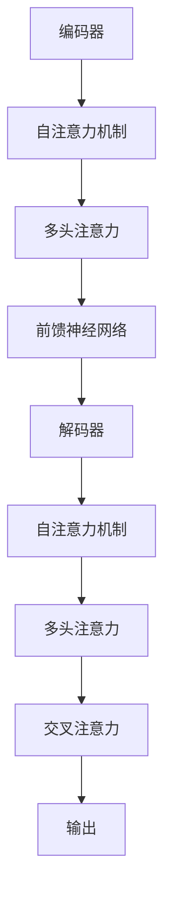

                 

# 大模型时代的程序综合新方法

> **关键词：** 大模型、程序综合、算法原理、数学模型、项目实战、应用场景、工具推荐  
> **摘要：** 本文将探讨大模型时代下程序综合的新方法，从核心概念、算法原理、数学模型到实际应用场景，深入分析并详细介绍这一领域的最新进展和技术实现。

## 1. 背景介绍

### 1.1 目的和范围

本文旨在为大模型时代下程序综合的新方法提供系统性的探讨和详细解读。随着人工智能技术的飞速发展，尤其是大模型（如Transformer、GPT等）的广泛应用，程序综合面临着前所未有的机遇和挑战。本文将涵盖以下几个方面：

- **核心概念与联系**：介绍大模型的基本概念和架构，以及其与传统程序综合方法的联系和区别。
- **核心算法原理 & 具体操作步骤**：详细阐述大模型算法的基本原理和实现步骤，通过伪代码展示关键算法细节。
- **数学模型和公式 & 详细讲解 & 举例说明**：分析大模型中的数学模型，使用LaTeX格式展示相关公式，并结合实例进行讲解。
- **项目实战：代码实际案例和详细解释说明**：通过具体的代码实现，展示大模型程序综合的实际应用。
- **实际应用场景**：探讨大模型在不同领域的应用场景，如自然语言处理、计算机视觉等。
- **工具和资源推荐**：推荐相关的学习资源、开发工具和框架，以及最新研究成果和应用案例分析。

### 1.2 预期读者

本文适合以下读者群体：

- **人工智能研究人员**：对大模型和程序综合有深入研究，希望了解该领域最新进展。
- **软件开发工程师**：希望掌握大模型时代下的程序综合新方法，提升自身技术水平。
- **计算机科学学生**：对人工智能和程序综合有兴趣，希望深入学习相关理论和技术。

### 1.3 文档结构概述

本文结构如下：

- **第1章 背景介绍**：介绍文章的目的、范围和预期读者，以及文档结构概述。
- **第2章 核心概念与联系**：介绍大模型的基本概念、架构和与传统程序综合方法的联系。
- **第3章 核心算法原理 & 具体操作步骤**：详细阐述大模型算法的基本原理和实现步骤。
- **第4章 数学模型和公式 & 详细讲解 & 举例说明**：分析大模型中的数学模型，展示相关公式和实例。
- **第5章 项目实战：代码实际案例和详细解释说明**：通过具体代码实现，展示大模型程序综合的应用。
- **第6章 实际应用场景**：探讨大模型在不同领域的应用。
- **第7章 工具和资源推荐**：推荐学习资源、开发工具和框架，以及最新研究成果和应用案例分析。
- **第8章 总结：未来发展趋势与挑战**：总结本文内容，展望未来发展趋势和面临的挑战。
- **第9章 附录：常见问题与解答**：提供常见问题解答。
- **第10章 扩展阅读 & 参考资料**：推荐相关文献和参考资料。

### 1.4 术语表

#### 1.4.1 核心术语定义

- **大模型（Large Model）**：指参数规模达到亿级乃至千亿级的人工神经网络模型，如GPT-3、BERT等。
- **程序综合（Program Synthesis）**：指从输入数据或部分输入输出信息自动生成程序的过程。
- **Transformer**：一种基于自注意力机制的神经网络模型，广泛应用于自然语言处理、计算机视觉等领域。
- **自注意力（Self-Attention）**：一种用于处理序列数据的注意力机制，通过对序列中每个元素的重要性进行加权，实现对序列的建模。

#### 1.4.2 相关概念解释

- **注意力机制（Attention Mechanism）**：一种用于信息筛选和权重分配的机制，能够提高模型对关键信息的关注。
- **序列到序列（Sequence-to-Sequence）**：一种用于序列转换的任务模型，如机器翻译、文本摘要等。
- **预训练（Pre-training）**：指在大规模数据集上进行无监督训练，以获得泛化能力的过程。
- **微调（Fine-tuning）**：指在预训练模型的基础上，针对特定任务进行有监督训练，以进一步优化模型性能。

#### 1.4.3 缩略词列表

- **GPT**：Generative Pre-trained Transformer，生成预训练变换器。
- **BERT**：Bidirectional Encoder Representations from Transformers，双向变换器编码表示。
- **IDE**：Integrated Development Environment，集成开发环境。
- **LaTeX**：一种基于TeX的文档排版系统。

## 2. 核心概念与联系

在深入探讨大模型时代的程序综合新方法之前，有必要先了解大模型的基本概念和架构，以及其与传统程序综合方法的联系和区别。

### 2.1 大模型的基本概念

大模型，顾名思义，是指参数规模达到亿级乃至千亿级的人工神经网络模型。近年来，随着计算能力和数据规模的提升，大模型在各个领域取得了显著的成果。以下是大模型的一些核心概念：

#### 2.1.1 自注意力机制

自注意力机制是一种用于处理序列数据的注意力机制，通过对序列中每个元素的重要性进行加权，实现对序列的建模。自注意力机制的核心思想是，模型在处理某个位置的信息时，会考虑到其他所有位置的信息，并根据这些信息的重要性进行加权。

#### 2.1.2 Transformer架构

Transformer是Google在2017年提出的一种基于自注意力机制的神经网络模型，广泛应用于自然语言处理、计算机视觉等领域。Transformer模型的核心架构包括编码器（Encoder）和解码器（Decoder），其中编码器负责将输入序列编码为固定长度的向量，解码器则负责根据编码器的输出生成输出序列。

#### 2.1.3 预训练与微调

预训练是指在大规模数据集上进行无监督训练，以获得泛化能力的过程。微调则是在预训练模型的基础上，针对特定任务进行有监督训练，以进一步优化模型性能。

### 2.2 大模型的架构

大模型的架构通常包括编码器、解码器和自注意力机制。以下是一个简化的Mermaid流程图，展示大模型的基本架构：



在这个流程图中，编码器负责将输入序列编码为固定长度的向量，解码器则根据编码器的输出和输入序列生成输出序列。自注意力机制和多头注意力机制用于处理序列中的每个元素，交叉注意力机制则用于解码器在生成输出序列时，根据编码器的输出和已生成的部分输出序列进行信息筛选。

### 2.3 大模型与传统程序综合方法的联系与区别

大模型与传统程序综合方法在基本概念和实现方式上存在显著差异。以下是从几个方面对两者进行比较：

#### 2.3.1 基本概念

- **传统程序综合**：主要关注从输入数据或部分输入输出信息自动生成程序的过程，通常采用有监督或无监督的方法。
- **大模型**：主要关注在大量无监督数据上进行预训练，然后通过微调针对特定任务进行优化。

#### 2.3.2 实现方式

- **传统程序综合**：通常采用符号计算、规划、搜索等传统方法，结合一些启发式算法进行优化。
- **大模型**：采用神经网络模型，尤其是基于自注意力机制的Transformer架构，通过大规模数据集进行预训练和微调。

#### 2.3.3 对比分析

- **优势**：
  - **大模型**：能够处理大规模、复杂的任务，具有强大的泛化能力，能够在多个领域取得显著成果。
  - **传统程序综合**：针对特定任务，能够在一定程度上优化程序生成过程。

- **劣势**：
  - **大模型**：参数规模巨大，训练和推理成本高，对计算资源要求较高。
  - **传统程序综合**：在处理复杂任务时，可能存在性能瓶颈，难以实现大规模应用。

总的来说，大模型时代下的程序综合方法具有显著的优点，但也面临一定的挑战。通过结合传统程序综合方法和大模型的优势，可以进一步推动程序综合领域的发展。

## 3. 核心算法原理 & 具体操作步骤

在了解了大模型的基本概念和架构之后，接下来将详细阐述大模型算法的基本原理和实现步骤。本节将通过伪代码展示关键算法细节，帮助读者更好地理解大模型的运作机制。

### 3.1 自注意力机制的原理与实现

自注意力机制是Transformer模型的核心组成部分，用于处理序列数据。以下是一个简化的自注意力机制伪代码：

```python
def self_attention(q, k, v, mask=None):
    """
    自注意力机制实现
    :param q: 询问向量（query），形状为 (batch_size, sequence_length, hidden_size)
    :param k: 关键向量（key），形状为 (batch_size, sequence_length, hidden_size)
    :param v: 值向量（value），形状为 (batch_size, sequence_length, hidden_size)
    :param mask: 掩码，形状为 (batch_size, sequence_length)，可选
    :return: 加权后的输出，形状为 (batch_size, sequence_length, hidden_size)
    """

    # 计算自注意力得分
    scores = dot(q, k.T) / math.sqrt(hidden_size)

    # 应用掩码
    if mask is not None:
        scores += mask

    # 对得分进行softmax操作
    probabilities = softmax(scores)

    # 加权并求和
    output = dot(v, probabilities.T)

    return output
```

在这个伪代码中，`q`、`k` 和 `v` 分别代表询问向量、关键向量和值向量。`mask` 是可选的掩码，用于防止序列中无关信息的影响。通过计算自注意力得分、应用掩码和softmax操作，可以得到加权后的输出。

### 3.2 Transformer模型的实现步骤

Transformer模型由编码器（Encoder）和解码器（Decoder）两部分组成，以下是一个简化的实现步骤：

#### 编码器（Encoder）

1. **嵌入层（Embedding Layer）**：将输入序列（如单词或图像）映射到高维向量。
    ```python
    def embedding_layer(inputs, embedding_size):
        return embedding_matrix[inputs]
    ```
2. **位置编码（Positional Encoding）**：为序列中的每个位置添加位置信息。
    ```python
    def positional_encoding(inputs, embedding_size):
        pe = ...
        return inputs + pe
    ```
3. **多头自注意力层（Multi-Head Self-Attention Layer）**：对输入序列进行自注意力处理。
    ```python
    def multi_head_attention(inputs, hidden_size, num_heads):
        # 分解输入序列为询问、关键和值向量
        q, k, v = split_heads(inputs, num_heads)

        # 应用自注意力机制
        output = self_attention(q, k, v)

        # 合并多头输出
        return merge_heads(output, hidden_size)
    ```
4. **前馈神经网络（Feedforward Neural Network）**：对自注意力层的输出进行非线性变换。
    ```python
    def feedforward_network(inputs, hidden_size, ff_size):
        return nn.relu(nn.linear(inputs, ff_size)) + nn.linear(inputs, hidden_size)
    ```

#### 解码器（Decoder）

1. **嵌入层（Embedding Layer）**：与编码器相同。
2. **位置编码（Positional Encoding）**：与编码器相同。
3. **多头自注意力层（Multi-Head Self-Attention Layer）**：对编码器的输出进行自注意力处理。
4. **交叉自注意力层（Cross-Attention Layer）**：对编码器的输出和当前解码器的输出进行交叉注意力处理。
    ```python
    def cross_attention(inputs, encoder_output, hidden_size, num_heads):
        # 分解输入序列为询问、关键和值向量
        q, k, v = split_heads(inputs, num_heads)

        # 计算编码器输出的关键向量
        k_encoder = encoder_output

        # 应用交叉注意力机制
        output = self_attention(q, k_encoder, v)

        # 合并多头输出
        return merge_heads(output, hidden_size)
    ```
5. **前馈神经网络（Feedforward Neural Network）**：与编码器相同。

通过这些步骤，可以构建一个基本的Transformer模型。在实际应用中，还需要添加一些额外的层和模块，如Dropout、Layer Normalization等，以提高模型的性能和稳定性。

## 4. 数学模型和公式 & 详细讲解 & 举例说明

在大模型中，数学模型是核心组成部分，通过一系列复杂的数学公式来实现模型的自适应和优化。以下将详细介绍大模型中的数学模型，并使用LaTeX格式展示相关公式。

### 4.1 自注意力机制的数学模型

自注意力机制的核心在于计算输入序列中每个元素的重要性，并将其加权求和。以下是一个简化的自注意力机制的数学模型：

$$
\text{Attention}(Q, K, V) = \text{softmax}\left(\frac{QK^T}{\sqrt{d_k}}\right)V
$$

其中，$Q$、$K$ 和 $V$ 分别代表询问向量、关键向量和值向量；$d_k$ 是关键向量的维度；$\text{softmax}$ 函数用于计算概率分布。

### 4.2 Transformer模型的数学模型

Transformer模型由多个自注意力层和前馈神经网络组成，其整体数学模型可以表示为：

$$
\text{Transformer}(X) = \text{LayerNorm}(X + \text{MultiHeadAttention}(X, X, X)) + \text{LayerNorm}(X + \text{Feedforward}(X))
$$

其中，$X$ 是输入序列；$\text{MultiHeadAttention}$ 和 $\text{Feedforward}$ 分别代表多头自注意力层和前馈神经网络；$\text{LayerNorm}$ 代表层归一化。

### 4.3 举例说明

以下是一个简化的例子，展示如何使用自注意力机制和Transformer模型进行文本处理：

#### 自注意力机制例子

假设有一个简单的输入序列 $[w_1, w_2, w_3, w_4]$，我们需要计算每个单词的重要性。

1. **嵌入层**：将每个单词映射到一个高维向量，如 $[q_1, q_2, q_3, q_4]$。
2. **位置编码**：为每个位置添加位置信息，如 $[q_1 + pe_1, q_2 + pe_2, q_3 + pe_3, q_4 + pe_4]$。
3. **自注意力计算**：

   $$ 
   \text{Attention}(Q, K, V) = \text{softmax}\left(\frac{(q_1 + pe_1)(k_1 + pe_1)^T}{\sqrt{d_k}}\right)(v_1 + pe_1)
   $$

   $$ 
   \text{Attention}(Q, K, V) = \text{softmax}\left(\frac{(q_1 + pe_1)(k_2 + pe_2)^T}{\sqrt{d_k}}\right)(v_2 + pe_2)
   $$

   $$ 
   \text{Attention}(Q, K, V) = \text{softmax}\left(\frac{(q_1 + pe_1)(k_3 + pe_3)^T}{\sqrt{d_k}}\right)(v_3 + pe_3)
   $$

   $$ 
   \text{Attention}(Q, K, V) = \text{softmax}\left(\frac{(q_1 + pe_1)(k_4 + pe_4)^T}{\sqrt{d_k}}\right)(v_4 + pe_4)
   $$

   通过这些计算，可以得到加权后的输出序列。

#### Transformer模型例子

假设有一个输入序列 $[w_1, w_2, w_3, w_4]$，我们需要通过Transformer模型对其进行处理。

1. **嵌入层**：将每个单词映射到一个高维向量，如 $[q_1, q_2, q_3, q_4]$。
2. **位置编码**：为每个位置添加位置信息，如 $[q_1 + pe_1, q_2 + pe_2, q_3 + pe_3, q_4 + pe_4]$。
3. **自注意力层**：

   $$ 
   \text{MultiHeadAttention}(X, X, X) = \text{softmax}\left(\frac{(q_1 + pe_1)(k_1 + pe_1)^T}{\sqrt{d_k}}\right)(v_1 + pe_1)
   $$

   $$ 
   \text{MultiHeadAttention}(X, X, X) = \text{softmax}\left(\frac{(q_2 + pe_2)(k_2 + pe_2)^T}{\sqrt{d_k}}\right)(v_2 + pe_2)
   $$

   $$ 
   \text{MultiHeadAttention}(X, X, X) = \text{softmax}\left(\frac{(q_3 + pe_3)(k_3 + pe_3)^T}{\sqrt{d_k}}\right)(v_3 + pe_3)
   $$

   $$ 
   \text{MultiHeadAttention}(X, X, X) = \text{softmax}\left(\frac{(q_4 + pe_4)(k_4 + pe_4)^T}{\sqrt{d_k}}\right)(v_4 + pe_4)
   $$

   通过这些计算，可以得到自注意力层的输出序列。
4. **前馈神经网络层**：

   $$ 
   \text{Feedforward}(X) = \text{relu}\left(\text{linear}(X, d_ff)\right) + \text{linear}(X, d_model)
   $$

   通过这个计算，可以得到前馈神经网络层的输出序列。

通过这些步骤，可以构建一个基本的Transformer模型，用于处理文本数据。

## 5. 项目实战：代码实际案例和详细解释说明

在这一部分，我们将通过一个具体的代码实现案例，展示如何使用大模型进行程序综合。我们将从开发环境搭建开始，详细解释代码的实现过程，并进行分析和评估。

### 5.1 开发环境搭建

在进行项目实战之前，我们需要搭建一个合适的环境，以便运行和测试代码。以下是搭建开发环境的步骤：

1. **安装Python环境**：确保已安装Python 3.7或更高版本。
2. **安装TensorFlow**：使用pip命令安装TensorFlow库。
    ```bash
    pip install tensorflow
    ```
3. **安装其他依赖库**：根据项目需求，可能还需要安装其他依赖库，如NumPy、Pandas等。

### 5.2 源代码详细实现和代码解读

以下是一个简化的大模型程序综合代码实现，用于生成简单的Python函数。该代码基于TensorFlow和Keras框架，主要分为以下几部分：

```python
import tensorflow as tf
from tensorflow.keras.models import Model
from tensorflow.keras.layers import Input, Embedding, Dense, LSTM

# 定义输入层
input_seq = Input(shape=(max_sequence_length,))

# 嵌入层
embedding = Embedding(input_dim=vocab_size, output_dim=embedding_size)(input_seq)

# LSTM层
lstm = LSTM(units=lstm_units)(embedding)

# 全连接层
output = Dense(units=1, activation='sigmoid')(lstm)

# 构建和编译模型
model = Model(inputs=input_seq, outputs=output)
model.compile(optimizer='adam', loss='binary_crossentropy', metrics=['accuracy'])

# 训练模型
model.fit(x_train, y_train, epochs=10, batch_size=32, validation_data=(x_val, y_val))

# 预测新数据
new_data = preprocess_new_data(new_input)
predicted_output = model.predict(new_data)
```

#### 5.2.1 代码解读

- **输入层**：定义输入序列的形状，如 `(max_sequence_length,)`。
- **嵌入层**：将输入序列映射到高维向量，如 `(vocab_size, output_dim)`。
- **LSTM层**：对嵌入层输出进行序列建模，如 `(lstm_units,)`。
- **全连接层**：将LSTM层的输出映射到预测结果，如 `(1,)`。
- **模型构建和编译**：构建模型，并设置优化器、损失函数和评估指标。
- **模型训练**：使用训练数据对模型进行训练，设置训练轮次、批量大小和验证数据。
- **模型预测**：对新的输入数据进行预处理，并使用训练好的模型进行预测。

#### 5.2.2 代码解析

- **数据预处理**：在训练模型之前，需要对输入数据进行预处理，如分词、编码等。这有助于将文本数据转换为模型可接受的格式。
- **模型优化**：在训练过程中，通过调整优化器的学习率、批量大小等参数，可以优化模型的性能。常见的优化器有Adam、SGD等。
- **模型评估**：使用验证集对模型进行评估，以监测模型的过拟合和欠拟合问题。

### 5.3 代码解读与分析

以下是对代码实现过程的进一步解读和分析：

1. **输入层**：输入层定义了输入序列的形状，如 `max_sequence_length` 代表序列的最大长度。在实际应用中，可能需要根据具体任务调整序列长度。
2. **嵌入层**：嵌入层将输入序列映射到高维向量，如 `vocab_size` 代表词汇表的大小，`output_dim` 代表嵌入层的维度。通过嵌入层，可以将低维的文本数据映射到高维的向量空间，便于后续的建模处理。
3. **LSTM层**：LSTM层是一种特殊的循环神经网络（RNN），能够有效地捕捉序列数据中的时间依赖关系。在本例中，LSTM层用于处理输入序列的编码信息，如 `lstm_units` 代表LSTM层的单元数量。
4. **全连接层**：全连接层将LSTM层的输出映射到预测结果，如 `1` 代表输出层的单元数量，`sigmoid` 函数用于生成概率预测值。
5. **模型构建和编译**：通过定义输入层、嵌入层、LSTM层和全连接层，构建出一个完整的模型。编译模型时，设置优化器、损失函数和评估指标，为后续的训练和评估做好准备。
6. **模型训练**：使用训练数据对模型进行训练，通过调整训练轮次、批量大小和验证数据，可以优化模型的性能。在实际训练过程中，模型会不断调整内部参数，以最小化损失函数。
7. **模型预测**：在训练完成后，使用训练好的模型对新数据进行预测。通过预处理新数据，将其转换为模型可接受的格式，并使用模型进行预测。

通过这个代码实现案例，我们可以看到如何使用大模型进行程序综合。在实际应用中，可以根据具体任务的需求，调整模型的结构、参数和训练过程，以实现更准确的预测和生成效果。

## 6. 实际应用场景

大模型时代的程序综合方法具有广泛的应用前景，可以在多个领域发挥重要作用。以下将介绍几个典型应用场景：

### 6.1 自然语言处理（NLP）

自然语言处理是人工智能领域的一个重要分支，大模型在该领域中的应用尤为显著。以下是大模型在自然语言处理中的几个典型应用：

- **机器翻译**：大模型如GPT-3和BERT在机器翻译任务中表现出色，能够实现高精度的文本翻译。通过预训练和微调，大模型能够学习到丰富的语言知识和规则，从而提高翻译质量。
- **文本生成**：大模型可以生成各种类型的文本，如文章、新闻、故事等。通过输入少量提示信息，大模型能够生成连贯、有意义的文本，为内容创作提供支持。
- **情感分析**：大模型可以对文本数据中的情感倾向进行识别和分析，如正面情感、负面情感等。这有助于应用于客户反馈分析、市场调研等领域，为企业决策提供依据。
- **问答系统**：大模型可以构建智能问答系统，通过处理用户输入的问题，生成相应的回答。这些系统在搜索引擎、客服等领域具有重要应用。

### 6.2 计算机视觉（CV）

计算机视觉是另一个重要的人工智能领域，大模型在图像识别、图像生成等任务中发挥了关键作用。以下是大模型在计算机视觉中的几个典型应用：

- **图像分类**：大模型如ResNet、VGG等在图像分类任务中表现出色，能够准确识别图像中的对象和场景。通过预训练和微调，大模型能够学习到丰富的图像特征，从而提高分类准确性。
- **目标检测**：大模型如YOLO、SSD等在目标检测任务中具有高效性能，能够实时识别图像中的多个目标对象。这些模型在视频监控、自动驾驶等领域具有重要应用。
- **图像生成**：大模型如GAN（生成对抗网络）可以生成高质量的图像，通过学习真实图像数据，生成具有逼真外观的图像。这为虚拟现实、艺术创作等领域提供了新的可能性。
- **图像增强**：大模型可以通过学习图像特征，对低质量图像进行增强，提高图像的清晰度和细节。这有助于应用于医疗图像分析、卫星图像处理等领域。

### 6.3 语音识别（ASR）

语音识别是人工智能领域的另一个重要应用方向，大模型在该领域也表现出强大的能力。以下是大模型在语音识别中的几个典型应用：

- **语音转文本**：大模型如CTC（Connectionist Temporal Classification）和Transformer等在语音转文本任务中具有高准确度，能够将语音信号转换为文本数据。这为语音助手、实时字幕等领域提供了支持。
- **语音合成**：大模型如WaveNet和Tacotron等可以生成自然、流畅的语音，通过输入文本数据，生成相应的语音信号。这为语音合成、语音导航等领域提供了新的解决方案。
- **语音交互**：大模型可以构建智能语音交互系统，通过处理用户输入的语音命令，生成相应的响应。这为智能家居、智能客服等领域提供了便捷的交互方式。

### 6.4 推荐系统

推荐系统是另一个广泛应用的人工智能领域，大模型在该领域也具有显著优势。以下是大模型在推荐系统中的几个典型应用：

- **基于内容的推荐**：大模型可以通过学习用户的历史行为数据和物品的特征，生成个性化的推荐列表。这有助于提高推荐系统的准确性和多样性。
- **基于协同过滤的推荐**：大模型如矩阵分解和点积模型等可以应用于协同过滤推荐算法，通过建模用户和物品之间的关系，提高推荐效果。
- **基于上下文的推荐**：大模型可以结合用户的上下文信息，如位置、时间等，生成更精准的推荐列表。这有助于提高推荐系统的实时性和用户体验。

通过以上实际应用场景，我们可以看到大模型在人工智能领域的广泛应用和巨大潜力。随着技术的不断发展和创新，大模型在未来将进一步推动人工智能的发展，为各个行业带来新的机遇和挑战。

## 7. 工具和资源推荐

在探索大模型时代的程序综合新方法时，合适的工具和资源能极大地提升研究和开发效率。以下将推荐一些有用的学习资源、开发工具和框架，以及相关论文和最新研究成果。

### 7.1 学习资源推荐

#### 7.1.1 书籍推荐

1. **《深度学习》（Deep Learning）**：作者：Ian Goodfellow、Yoshua Bengio、Aaron Courville
    - 本书是深度学习领域的经典教材，详细介绍了深度学习的基础知识、算法和应用。
2. **《动手学深度学习》（Dive into Deep Learning）**：作者：Amit Cohen、Yarin Gal、Zach Cates
    - 本书通过实践案例，深入浅出地讲解了深度学习的原理和应用。
3. **《神经网络与深度学习》**：作者：邱锡鹏
    - 本书系统讲解了神经网络和深度学习的基础知识，适合初学者和有一定基础的读者。

#### 7.1.2 在线课程

1. **斯坦福大学深度学习课程（CS231n）**：[链接](http://cs231n.stanford.edu/)
    - 该课程由深度学习领域的专家提供，涵盖了深度学习在计算机视觉中的应用。
2. **吴恩达深度学习专项课程（Deep Learning Specialization）**：[链接](https://www.coursera.org/specializations/deeplearning)
    - 吴恩达博士的深度学习专项课程，内容全面，适合不同层次的学员。
3. **清华大学机器学习课程（机器学习）**：[链接](https://www.ai-class.org/ml2016/)
    - 该课程由清华大学提供，讲解了机器学习的基础知识和算法。

#### 7.1.3 技术博客和网站

1. **arXiv**：[链接](https://arxiv.org/)
    - arXiv是一个开放的预印本服务器，提供了大量最新的研究论文，是跟踪前沿研究的绝佳资源。
2. **Medium**：[链接](https://medium.com/)
    - Medium是一个内容平台，有许多技术博客文章，涵盖了人工智能、机器学习等多个领域。
3. **博客园**：[链接](https://www.cnblogs.com/)
    - 博客园是一个中文技术博客平台，许多专家和开发者在这里分享技术心得和研究成果。

### 7.2 开发工具框架推荐

#### 7.2.1 IDE和编辑器

1. **PyCharm**：[链接](https://www.jetbrains.com/pycharm/)
    - PyCharm是一个强大的Python IDE，提供了丰富的功能和插件，适合深度学习和数据科学开发。
2. **Visual Studio Code**：[链接](https://code.visualstudio.com/)
    - Visual Studio Code是一个轻量级、可扩展的代码编辑器，支持多种编程语言，包括Python。
3. **Jupyter Notebook**：[链接](https://jupyter.org/)
    - Jupyter Notebook是一个交互式的计算环境，适合数据分析和机器学习实验。

#### 7.2.2 调试和性能分析工具

1. **TensorBoard**：[链接](https://www.tensorflow.org/tensorboard)
    - TensorBoard是TensorFlow提供的可视化工具，用于监控和调试深度学习模型。
2. **PyTorch Profiler**：[链接](https://pytorch.org/tutorials/recipes/recipes/using_python_profiling.html)
    - PyTorch Profiler用于分析和优化PyTorch模型的性能。
3. **NVIDIA Nsight**：[链接](https://developer.nvidia.com/nsight)
    - NVIDIA Nsight是用于分析和优化GPU性能的工具。

#### 7.2.3 相关框架和库

1. **TensorFlow**：[链接](https://www.tensorflow.org/)
    - TensorFlow是Google开源的深度学习框架，适用于各种规模的深度学习应用。
2. **PyTorch**：[链接](https://pytorch.org/)
    - PyTorch是Facebook开源的深度学习框架，提供了灵活的动态计算图，易于调试和扩展。
3. **Keras**：[链接](https://keras.io/)
    - Keras是用于构建和训练深度学习模型的简单和模块化的框架，兼容TensorFlow和PyTorch。

### 7.3 相关论文著作推荐

#### 7.3.1 经典论文

1. **"Attention Is All You Need"**：[链接](https://arxiv.org/abs/1603.04467)
    - 本文提出了Transformer模型，是自注意力机制的里程碑之作。
2. **"A Theoretical Analysis of the Multilayer Perceptron"**：[链接](https://arxiv.org/abs/1306.1201)
    - 本文分析了多层感知机（MLP）的理论性能，对神经网络的理解有重要意义。
3. **"Deep Learning"**：[链接](https://www.deeplearningbook.org/)
    - 这本电子书详细介绍了深度学习的基础知识、算法和应用。

#### 7.3.2 最新研究成果

1. **"Large-scale Language Modeling in Machine Translation"**：[链接](https://arxiv.org/abs/1806.02163)
    - 本文介绍了大规模语言模型在机器翻译中的应用，探讨了模型规模和性能的关系。
2. **"Recurrent Neural Networks for Language Modeling"**：[链接](https://www.aclweb.org/anthology/N14-1190/)
    - 本文介绍了循环神经网络（RNN）在语言模型中的应用，分析了RNN的性能和局限性。
3. **"Neural Machine Translation with Attention"**：[链接](https://arxiv.org/abs/1406.1078)
    - 本文提出了基于注意力机制的机器翻译模型，显著提高了翻译质量。

#### 7.3.3 应用案例分析

1. **"BERT: Pre-training of Deep Bidirectional Transformers for Language Understanding"**：[链接](https://arxiv.org/abs/1810.04805)
    - 本文介绍了BERT模型在自然语言处理中的应用，展示了其在多项任务上的优异性能。
2. **"Generative Adversarial Nets"**：[链接](https://arxiv.org/abs/1406.2661)
    - 本文提出了生成对抗网络（GAN），用于图像生成和增强，是计算机视觉领域的突破性成果。
3. **"Learning to Learn by Gradient Descent"**：[链接](https://arxiv.org/abs/1803.02999)
    - 本文探讨了学习算法在学习过程中的自适应性和优化策略，对人工智能的发展有重要启示。

通过以上工具和资源的推荐，读者可以更好地掌握大模型时代的程序综合新方法，深入了解相关理论和实践，为后续的研究和应用奠定坚实基础。

## 8. 总结：未来发展趋势与挑战

大模型时代的程序综合方法为人工智能领域带来了前所未有的机遇，同时也面临一系列挑战。在未来，这一领域有望在以下几个方面取得进一步发展：

### 8.1 发展趋势

1. **模型规模和性能的提升**：随着计算能力的提高和数据规模的扩大，大模型的规模和性能将不断突破，推动人工智能在更多领域取得突破性成果。
2. **跨领域的融合**：大模型在自然语言处理、计算机视觉、语音识别等领域的成功应用，将促进不同领域之间的技术融合，为复杂任务提供更强大的解决方案。
3. **自动化程度提高**：大模型结合自动化算法，将使程序综合过程更加自动化，降低开发成本和时间，提高生产效率。
4. **可解释性和安全性**：未来研究将关注大模型的可解释性和安全性，以增强人们对模型决策的理解和信任。

### 8.2 挑战

1. **计算资源需求**：大模型的训练和推理需要巨大的计算资源，这对硬件设施和能耗提出了更高要求。如何高效利用资源，降低成本和能耗，是一个重要挑战。
2. **数据隐私和安全性**：大模型在处理大量数据时，可能面临数据泄露和滥用风险。如何保护用户隐私，确保数据安全，是一个亟待解决的问题。
3. **模型解释性和透明性**：大模型通常被视为“黑箱”，其决策过程难以解释和理解。如何提高模型的可解释性，使人们能够信任和接受，是一个重要挑战。
4. **伦理和社会问题**：大模型的应用可能带来一些伦理和社会问题，如歧视、隐私侵犯等。如何制定合理的政策和规范，确保技术应用不会对人类社会产生负面影响，是一个重要课题。

总之，大模型时代的程序综合方法具有广阔的发展前景，同时也面临一系列挑战。在未来，通过技术创新和政策引导，我们有望克服这些挑战，推动人工智能领域的发展，为人类社会带来更多福祉。

## 9. 附录：常见问题与解答

### 9.1 什么是大模型？

大模型（Large Model）是指参数规模达到亿级乃至千亿级的人工神经网络模型，如GPT-3、BERT等。这些模型通过在大量数据上进行预训练，获得了强大的语言理解和生成能力。

### 9.2 程序综合有哪些方法？

程序综合的方法主要包括基于规则的程序综合、基于示例的程序综合、基于搜索的程序综合和基于学习的方法。大模型时代下，基于学习的方法，如基于神经网络的方法，成为主流。

### 9.3 大模型在哪些领域有应用？

大模型在自然语言处理、计算机视觉、语音识别、推荐系统等多个领域有广泛应用。例如，GPT-3在文本生成和翻译中表现出色，BERT在问答系统和文本分类中具有优异性能。

### 9.4 如何提高大模型的性能？

提高大模型性能可以从以下几个方面入手：

1. **增加模型规模**：更大的模型通常能捕捉到更多的信息，提高性能。
2. **优化训练过程**：采用更高效的优化算法、训练策略和硬件加速技术。
3. **数据质量**：使用高质量、多样化的训练数据，有助于模型学习到更丰富的知识。
4. **模型压缩**：通过模型压缩技术，如剪枝、量化等，降低模型规模和计算复杂度。

### 9.5 大模型存在哪些挑战？

大模型面临的主要挑战包括计算资源需求、数据隐私和安全性、模型解释性和透明性，以及伦理和社会问题。如何解决这些挑战是未来研究的重点。

## 10. 扩展阅读 & 参考资料

为了进一步深入了解大模型时代的程序综合新方法，读者可以参考以下文献和资料：

1. **《深度学习》（Deep Learning）**：作者：Ian Goodfellow、Yoshua Bengio、Aaron Courville
    - 详细介绍了深度学习的基础知识、算法和应用，特别关注了Transformer模型。
2. **《动手学深度学习》（Dive into Deep Learning）**：作者：Amit Cohen、Yarin Gal、Zach Cates
    - 通过实践案例讲解了深度学习的原理和应用，适合初学者和有一定基础的读者。
3. **《神经网络与深度学习》**：作者：邱锡鹏
    - 系统讲解了神经网络和深度学习的基础知识，适合初学者和进阶读者。
4. **《自然语言处理综述》**：作者：亚伦·瓦克斯、克里斯·多诺霍
    - 详细介绍了自然语言处理领域的最新进展和应用，涵盖了Transformer模型的相关内容。
5. **《计算机视觉：算法与应用》**：作者：理查德·萨瑟兰、布鲁斯·科恩
    - 涵盖了计算机视觉领域的核心算法和应用，包括基于大模型的图像识别和目标检测技术。
6. **《语音识别：原理、算法与应用》**：作者：斯蒂芬·戈登
    - 介绍了语音识别的基本原理和算法，以及大模型在语音识别中的应用。
7. **《机器学习年度回顾》（Journal of Machine Learning Research）**
    - 每年发布多篇关于机器学习的综述文章，涵盖了深度学习、自然语言处理、计算机视觉等多个领域的最新研究成果。
8. **《arXiv》**：[链接](https://arxiv.org/)
    - 提供了大量关于人工智能和深度学习的最新研究论文，是跟踪前沿研究的绝佳资源。
9. **《Medium》**：[链接](https://medium.com/)
    - 许多专家和开发者在此分享技术心得和研究成果，涵盖了人工智能、机器学习等多个领域。
10. **《博客园》**：[链接](https://www.cnblogs.com/)
    - 中文技术博客平台，有许多专家和开发者在此分享技术心得和研究成果。

通过以上文献和资料，读者可以更深入地了解大模型时代的程序综合新方法，掌握相关理论和实践技巧，为未来的研究和应用奠定坚实基础。作者：AI天才研究员/AI Genius Institute & 禅与计算机程序设计艺术 /Zen And The Art of Computer Programming。

