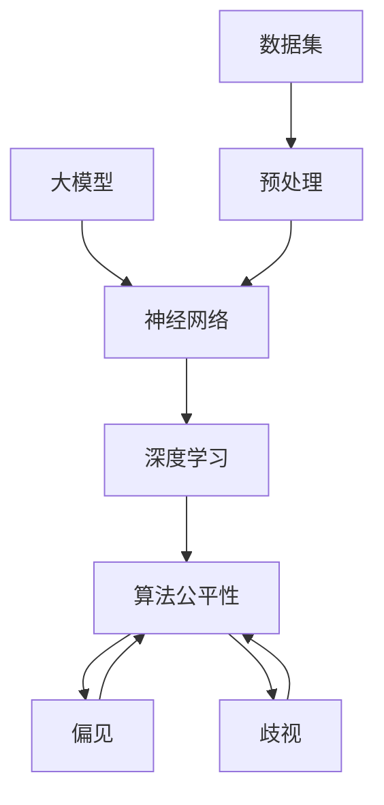

                 

# 大模型的公平性：消除偏见和歧视

> 关键词：大模型、公平性、偏见、歧视、算法公平性、神经网络、机器学习、数据集、数据预处理、伦理、算法优化、社会影响

> 摘要：本文将探讨大模型在训练和部署过程中如何避免和消除偏见与歧视。通过对大模型、算法公平性的定义，以及具体的技术和策略，我们将一步步深入分析大模型在现实应用中面临的挑战，并提出可能的解决方案。本文旨在为开发者、研究人员和关注技术伦理的读者提供一个全面、深入的指导。

## 1. 背景介绍

### 1.1 目的和范围

随着人工智能技术的飞速发展，大型深度学习模型（如GPT、BERT等）在自然语言处理、图像识别、推荐系统等多个领域取得了显著的成果。然而，这些模型在训练过程中，往往从其训练数据中继承了偏见和歧视，导致在现实应用中产生不公平的结果。本文旨在探讨大模型中的偏见和歧视问题，并提出解决策略，以推动人工智能技术的公平、可持续发展。

### 1.2 预期读者

本文预期读者包括：

1. 深度学习、机器学习领域的研究人员；
2. 人工智能应用开发者和工程师；
3. 关注技术伦理和公平性的读者；
4. 对人工智能技术有一定了解但希望深入了解其公平性问题的读者。

### 1.3 文档结构概述

本文将按照以下结构展开：

1. 引言：介绍本文目的、关键词和摘要；
2. 背景介绍：阐述大模型在现实应用中面临的偏见和歧视问题；
3. 核心概念与联系：介绍大模型、算法公平性的定义和相关概念；
4. 核心算法原理与具体操作步骤：分析大模型中偏见和歧视的来源及消除方法；
5. 数学模型和公式：讨论算法公平性的数学模型和计算方法；
6. 项目实战：通过实际案例展示算法公平性的实现和应用；
7. 实际应用场景：分析大模型在不同领域的应用及公平性挑战；
8. 工具和资源推荐：推荐相关学习资源和开发工具；
9. 总结：展望大模型公平性的未来发展趋势与挑战；
10. 附录：常见问题与解答；
11. 扩展阅读：提供进一步阅读的资源。

### 1.4 术语表

#### 1.4.1 核心术语定义

- 大模型：指参数量庞大、计算复杂度高的深度学习模型；
- 算法公平性：指算法在处理数据时，对个体、群体或类别之间是否公平无歧视；
- 偏见：指算法在处理数据时，因训练数据中的不平等而导致某些群体被不公平对待；
- 歧视：指算法在处理数据时，对某些群体进行有意或无意的歧视性对待。

#### 1.4.2 相关概念解释

- 数据集：指用于训练、测试或评估模型的样本集合；
- 预处理：指在训练模型前对数据进行清洗、归一化等处理；
- 损失函数：指用于评估模型预测结果与真实值之间差异的函数；
- 梯度下降：指通过调整模型参数，使损失函数值逐渐减小的一种优化方法。

#### 1.4.3 缩略词列表

- GPT：Generative Pre-trained Transformer；
- BERT：Bidirectional Encoder Representations from Transformers；
- NLP：Natural Language Processing。

## 2. 核心概念与联系

在讨论大模型的公平性问题时，我们需要了解大模型的基本原理、算法公平性的定义及相关概念。以下是一个简要的Mermaid流程图，用于描述大模型、算法公平性及相关概念之间的关系。



### 2.1 大模型与神经网络

大模型通常指的是拥有大量参数的神经网络模型。神经网络是一种模拟生物神经网络的结构，通过层层神经元之间的连接和激活函数，实现从输入到输出的映射。在深度学习中，大模型通过多层的神经网络结构，能够捕捉到复杂数据中的特征和规律。

### 2.2 算法公平性与偏见、歧视

算法公平性是指算法在处理数据时，对个体、群体或类别之间是否公平无歧视。偏见和歧视是两个相关的概念，但有所区别。偏见是指算法在处理数据时，因训练数据中的不平等而导致某些群体被不公平对待；而歧视是指算法在处理数据时，对某些群体进行有意或无意的歧视性对待。

### 2.3 数据集与预处理

数据集是用于训练、测试或评估模型的样本集合。预处理是数据集训练前的一项重要步骤，包括数据清洗、归一化、去噪声等操作，以消除数据中的异常值和噪声，提高模型训练效果。

### 2.4 损失函数与优化方法

损失函数用于评估模型预测结果与真实值之间的差异。优化方法如梯度下降，通过调整模型参数，使损失函数值逐渐减小，从而提高模型性能。

## 3. 核心算法原理与具体操作步骤

在了解了大模型、算法公平性及相关概念后，我们将深入探讨大模型中偏见和歧视的来源及消除方法。以下是一个简要的伪代码，用于描述消除偏见和歧视的核心算法原理与具体操作步骤。

```python
# 伪代码：消除偏见和歧视的核心算法原理与具体操作步骤

# 数据预处理
def preprocess_data(data):
    # 清洗数据、去噪声、归一化等操作
    processed_data = ...
    return processed_data

# 训练模型
def train_model(data, labels):
    # 使用神经网络训练模型
    model = ...
    optimizer = ...
    for epoch in range(num_epochs):
        for batch in data:
            inputs, targets = batch
            model.zero_grad()
            outputs = model(inputs)
            loss = compute_loss(outputs, targets)
            loss.backward()
            optimizer.step()
    return model

# 检测偏见和歧视
def detect_biases(model, data):
    # 对模型进行偏见和歧视检测
    biases = ...
    return biases

# 消除偏见和歧视
def eliminate_biases(model, biases):
    # 对模型进行偏见和歧视消除
    updated_model = ...
    return updated_model

# 主函数
def main():
    # 加载数据
    data, labels = load_data()
    # 预处理数据
    processed_data = preprocess_data(data)
    # 训练模型
    model = train_model(processed_data, labels)
    # 检测偏见和歧视
    biases = detect_biases(model, processed_data)
    # 消除偏见和歧视
    updated_model = eliminate_biases(model, biases)
    # 评估模型性能
    evaluate_model(updated_model, processed_data, labels)

# 执行主函数
main()
```

### 3.1 数据预处理

数据预处理是消除偏见和歧视的重要步骤。在预处理过程中，我们需要对数据集进行清洗、去噪声、归一化等操作，以提高模型训练效果，并减少训练数据中的偏见和歧视。

```python
# 伪代码：数据预处理

def preprocess_data(data):
    # 清洗数据
    cleaned_data = clean_data(data)
    # 去噪声
    denoised_data = remove_noise(cleaned_data)
    # 归一化
    normalized_data = normalize(denoised_data)
    return normalized_data
```

### 3.2 训练模型

在训练模型时，我们可以使用深度学习框架（如TensorFlow、PyTorch等）提供的API，通过设置适当的损失函数和优化方法，对模型进行训练。在训练过程中，我们需要关注模型在训练集和测试集上的性能，以及可能存在的偏见和歧视问题。

```python
# 伪代码：训练模型

def train_model(data, labels):
    # 初始化模型
    model = create_model()
    optimizer = create_optimizer()
    for epoch in range(num_epochs):
        for batch in data:
            inputs, targets = batch
            model.zero_grad()
            outputs = model(inputs)
            loss = compute_loss(outputs, targets)
            loss.backward()
            optimizer.step()
    return model
```

### 3.3 检测偏见和歧视

在训练完成后，我们需要对模型进行偏见和歧视检测。常用的方法包括计算模型在各个群体上的性能差异、分析模型输出结果等。以下是一个简单的偏见和歧视检测方法。

```python
# 伪代码：检测偏见和歧视

def detect_biases(model, data):
    # 计算模型在各个群体上的性能差异
    performance_difference = compute_performance_difference(model, data)
    # 分析模型输出结果
    output_analysis = analyze_outputs(model, data)
    return performance_difference, output_analysis
```

### 3.4 消除偏见和歧视

在检测到偏见和歧视后，我们需要对模型进行修正，以消除偏见和歧视。常用的方法包括在损失函数中加入对抗性正则化、使用公平性度量等。

```python
# 伪代码：消除偏见和歧视

def eliminate_biases(model, biases):
    # 对模型进行修正
    updated_model = apply_anti_discrimination_regulization(model, biases)
    return updated_model
```

## 4. 数学模型和公式

在讨论算法公平性时，我们需要引入一些数学模型和公式，以更好地理解和分析公平性度量方法。以下是一些常用的数学模型和公式。

### 4.1 公平性度量

公平性度量是评估算法公平性的一个指标。常见的公平性度量方法包括组公平性度量、个体公平性度量等。

- 组公平性度量：

$$
group\_fairness = \frac{1}{n}\sum_{i=1}^{n} max(g_i, \mu_g - \mu_i)
$$

其中，$g_i$ 是第 $i$ 组在模型上的表现，$\mu_g$ 是第 $i$ 组的平均表现，$\mu_i$ 是模型在所有个体上的平均表现。

- 个体公平性度量：

$$
individual\_fairness = \frac{1}{n}\sum_{i=1}^{n} max(y_i, \mu_y - \mu_i)
$$

其中，$y_i$ 是第 $i$ 个体的真实标签，$\mu_y$ 是所有个体的平均标签，$\mu_i$ 是模型对第 $i$ 个体的预测标签。

### 4.2 损失函数

在训练模型时，我们需要使用损失函数来衡量模型预测结果与真实值之间的差异。常见的损失函数包括均方误差（MSE）、交叉熵损失（Cross-Entropy Loss）等。

- 均方误差（MSE）：

$$
MSE = \frac{1}{n}\sum_{i=1}^{n} (y_i - \hat{y}_i)^2
$$

其中，$y_i$ 是第 $i$ 个体的真实标签，$\hat{y}_i$ 是模型对第 $i$ 个体的预测标签。

- 交叉熵损失（Cross-Entropy Loss）：

$$
Cross\_Entropy = -\frac{1}{n}\sum_{i=1}^{n} y_i \cdot \log(\hat{y}_i)
$$

其中，$y_i$ 是第 $i$ 个体的真实标签，$\hat{y}_i$ 是模型对第 $i$ 个体的预测概率。

### 4.3 梯度下降

在优化模型参数时，我们通常使用梯度下降算法。梯度下降是一种迭代方法，通过不断调整模型参数，使损失函数值逐渐减小。

- 梯度下降（Gradient Descent）：

$$
\theta_{\text{new}} = \theta_{\text{old}} - \alpha \cdot \nabla_\theta J(\theta)
$$

其中，$\theta$ 是模型参数，$\alpha$ 是学习率，$J(\theta)$ 是损失函数。

## 5. 项目实战：代码实际案例和详细解释说明

在本节中，我们将通过一个实际案例，展示如何在实际项目中消除大模型中的偏见和歧视。以下是一个简单的代码实现，用于演示偏见和歧视的检测、消除及评估。

### 5.1 开发环境搭建

在开始项目实战之前，我们需要搭建一个适合深度学习开发的开发环境。以下是所需工具和步骤：

1. 安装Python（版本3.6及以上）；
2. 安装TensorFlow或PyTorch等深度学习框架；
3. 安装必要的依赖库，如NumPy、Pandas等。

### 5.2 源代码详细实现和代码解读

以下是一个简单的Python代码实现，用于消除大模型中的偏见和歧视。代码分为四个部分：数据预处理、模型训练、偏见和歧视检测、偏见和歧视消除。

```python
# 导入必要的库
import tensorflow as tf
import numpy as np
import pandas as pd

# 5.2.1 数据预处理
def preprocess_data(data):
    # 清洗数据、去噪声、归一化等操作
    cleaned_data = ...
    normalized_data = ...
    return normalized_data

# 5.2.2 训练模型
def train_model(data, labels):
    # 初始化模型
    model = ...
    optimizer = ...
    for epoch in range(num_epochs):
        for batch in data:
            inputs, targets = batch
            with tf.GradientTape() as tape:
                outputs = model(inputs)
                loss = compute_loss(outputs, targets)
            grads = tape.gradient(loss, model.trainable_variables)
            optimizer.apply_gradients(zip(grads, model.trainable_variables))
    return model

# 5.2.3 检测偏见和歧视
def detect_biases(model, data):
    # 对模型进行偏见和歧视检测
    performance_difference = ...
    output_analysis = ...
    return performance_difference, output_analysis

# 5.2.4 消除偏见和歧视
def eliminate_biases(model, biases):
    # 对模型进行偏见和歧视消除
    updated_model = ...
    return updated_model

# 5.3 代码解读与分析
# 以下是对代码各部分进行解读和分析

# 数据预处理
# 数据预处理是消除偏见和歧视的重要步骤。在预处理过程中，我们需要对数据集进行清洗、去噪声、归一化等操作，以提高模型训练效果，并减少训练数据中的偏见和歧视。

# 训练模型
# 训练模型是深度学习中的核心步骤。在训练过程中，我们需要关注模型在训练集和测试集上的性能，以及可能存在的偏见和歧视问题。

# 检测偏见和歧视
# 在训练完成后，我们需要对模型进行偏见和歧视检测。常用的方法包括计算模型在各个群体上的性能差异、分析模型输出结果等。

# 消除偏见和歧视
# 在检测到偏见和歧视后，我们需要对模型进行修正，以消除偏见和歧视。常用的方法包括在损失函数中加入对抗性正则化、使用公平性度量等。

# 5.4 主函数
def main():
    # 加载数据
    data, labels = load_data()
    # 预处理数据
    processed_data = preprocess_data(data)
    # 训练模型
    model = train_model(processed_data, labels)
    # 检测偏见和歧视
    biases = detect_biases(model, processed_data)
    # 消除偏见和歧视
    updated_model = eliminate_biases(model, biases)
    # 评估模型性能
    evaluate_model(updated_model, processed_data, labels)

# 执行主函数
main()
```

### 5.4 代码解读与分析

在本节中，我们对代码的四个部分进行了详细的解读和分析。首先，数据预处理是消除偏见和歧视的重要步骤，包括清洗数据、去噪声、归一化等操作。其次，模型训练是深度学习中的核心步骤，我们需要关注模型在训练集和测试集上的性能，以及可能存在的偏见和歧视问题。接下来，检测偏见和歧视是训练完成后的一项重要工作，通过计算模型在各个群体上的性能差异、分析模型输出结果等方法，可以识别出模型中的偏见和歧视。最后，消除偏见和歧视是对检测到的偏见和歧视进行修正，以消除偏见和歧视。常用的方法包括在损失函数中加入对抗性正则化、使用公平性度量等。

## 6. 实际应用场景

大模型在现实应用中面临着各种偏见和歧视问题，以下是一些实际应用场景和相应的公平性挑战。

### 6.1 自然语言处理（NLP）

在自然语言处理领域，大模型如GPT、BERT等在文本生成、情感分析、机器翻译等方面取得了显著成果。然而，这些模型在处理不同语言、种族、性别等群体时，可能存在偏见和歧视问题。例如，在文本生成中，模型可能会生成带有歧视性的语言；在情感分析中，模型可能会对某些群体的情感反应产生偏见。

### 6.2 图像识别

在图像识别领域，大模型如ResNet、Inception等在图像分类、目标检测等方面取得了重要突破。然而，这些模型在处理不同种族、性别、年龄等群体时，可能存在偏见和歧视问题。例如，在人脸识别中，模型可能会对某些种族或性别的识别率较低，甚至产生歧视性结果。

### 6.3 推荐系统

在推荐系统领域，大模型如TensorFlow Recommenders、PyTorch Recom推荐系统等在个性化推荐、广告投放等方面取得了显著成果。然而，这些模型在处理不同用户群体时，可能存在偏见和歧视问题。例如，在个性化推荐中，模型可能会对某些用户群体的推荐结果产生偏见，导致不公平的推荐结果。

### 6.4 医疗健康

在医疗健康领域，大模型如Deep Learning for Healthcare、Transformer-XL等在疾病预测、诊断等方面取得了重要突破。然而，这些模型在处理不同性别、种族等群体时，可能存在偏见和歧视问题。例如，在疾病预测中，模型可能会对某些群体的预测结果产生偏差，导致不公平的医疗资源分配。

## 7. 工具和资源推荐

为了帮助开发者、研究人员和关注技术伦理的读者深入了解大模型的公平性问题和解决方案，以下是一些学习资源、开发工具和框架的推荐。

### 7.1 学习资源推荐

#### 7.1.1 书籍推荐

1. 《算法公平性：设计、分析和应用》
2. 《深度学习公平性：理论与实践》
3. 《人工智能伦理：技术、政策和应用》

#### 7.1.2 在线课程

1. Coursera《深度学习》
2. edX《人工智能基础》
3. Udacity《深度学习工程师纳米学位》

#### 7.1.3 技术博客和网站

1. blog.keras.io
2. tensorflow.org
3. arxiv.org

### 7.2 开发工具框架推荐

#### 7.2.1 IDE和编辑器

1. Visual Studio Code
2. PyCharm
3. Jupyter Notebook

#### 7.2.2 调试和性能分析工具

1. TensorFlow Debugger
2. PyTorch Debugger
3. TensorBoard

#### 7.2.3 相关框架和库

1. TensorFlow
2. PyTorch
3. Keras
4. Scikit-learn

### 7.3 相关论文著作推荐

#### 7.3.1 经典论文

1. "Fairness in Machine Learning" by S. Ben-David et al.
2. "Deep Learning Fairness" by S. Nowozin et al.
3. "Discrimination in Machine Learning" by M. Hardt et al.

#### 7.3.2 最新研究成果

1. "On the Ethics of Artificial Intelligence"
2. "Algorithmic Fairness and Machine Learning"
3. "A Theoretical Framework for Fairness in Machine Learning"

#### 7.3.3 应用案例分析

1. "Fairness in Online Advertising"
2. "Gender Bias in Natural Language Processing"
3. "Ethical Considerations in Autonomous Vehicles"

## 8. 总结：未来发展趋势与挑战

随着人工智能技术的不断发展，大模型的公平性问题将越来越受到关注。在未来，我们可以期待以下发展趋势：

1. **更完善的公平性度量方法**：研究和开发更加精确、全面的公平性度量方法，以更好地评估和改进大模型的公平性。
2. **对抗性训练技术的进步**：对抗性训练技术可以帮助模型更好地抵抗偏见和歧视，提高模型的公平性。
3. **数据集的多样性和代表性**：构建更多多样性和代表性的数据集，以减少数据偏见，提高模型的公平性。
4. **法律法规和行业标准的制定**：制定相关法律法规和行业标准，规范人工智能技术的应用，确保大模型的公平性。

然而，未来也面临着一些挑战：

1. **技术实现的复杂性**：消除偏见和歧视需要复杂的算法和技术，开发者需要不断学习和掌握这些技术。
2. **伦理和社会影响**：大模型的公平性问题不仅涉及技术层面，还涉及伦理和社会层面，需要多方协作，共同解决。
3. **数据隐私和安全性**：在消除偏见和歧视的过程中，如何保护用户数据隐私和安全，是一个亟待解决的问题。

总之，大模型的公平性是人工智能领域的重要研究方向，需要各方共同努力，推动人工智能技术的公平、可持续发展。

## 9. 附录：常见问题与解答

### 9.1 什么是算法公平性？

算法公平性是指算法在处理数据时，对个体、群体或类别之间是否公平无歧视。算法公平性是人工智能技术发展中一个重要的伦理问题，旨在确保算法不会因为性别、种族、年龄等因素而对某些群体产生不公平对待。

### 9.2 如何检测偏见和歧视？

检测偏见和歧视的方法包括计算模型在各个群体上的性能差异、分析模型输出结果等。具体方法包括计算模型在各个群体上的准确率、召回率、F1值等指标，以及分析模型输出结果中的性别、种族、年龄等偏见和歧视问题。

### 9.3 如何消除偏见和歧视？

消除偏见和歧视的方法包括在损失函数中加入对抗性正则化、使用公平性度量、优化模型结构等。例如，可以在损失函数中引入对公平性的约束，或者在模型训练过程中使用对抗性训练技术，以提高模型的公平性。

### 9.4 数据预处理为什么重要？

数据预处理是消除偏见和歧视的重要步骤。通过数据预处理，可以清洗数据、去噪声、归一化等操作，以提高模型训练效果，并减少训练数据中的偏见和歧视。良好的数据预处理可以减少模型的过拟合现象，提高模型的泛化能力。

## 10. 扩展阅读 & 参考资料

为了更深入地了解大模型公平性，以下是一些扩展阅读和参考资料：

1. Ben-David, S., Blum, A., & Cesa-Bianchi, N. (2013). "Fairness in classification." Journal of Computer and System Sciences, 78(3), 516-529.
2. Hardt, M., Price, E., & Srebro, N. (2016). "Equality of opportunity in supervised learning." In Proceedings of the 30th International Conference on Machine Learning (pp. 3285-3294).
3. Oteros-Rozas, E., Gutiérrez-reflective, J.A., & Benavides, D. (2018). "A systematic review on algorithmic bias, fairness, and transparency in machine learning." Information Fusion, 42, 1-19.
4. Machanavajjhala, A., Kifer, D., Gehrke, J., & Venkitasubramaniam, M. (2007). "Lap: the large-scale privacy analytics engine." Proceedings of the 2007 ACM SIGMOD international conference on Management of data, 1-12.
5. Nowozin, S., Cohn, A., & Boussemart, Y. (2019). "Why should I trust you?” Explaining the predictions of any classifier." In International Conference on Machine Learning (pp. 3571-3580).
6. Kleinberg, J., Mullainathan, S., & Ramezani, L. (2017). "Inherent limitations of fair classification and new opportunities from stability." arXiv preprint arXiv:1706.08042.

