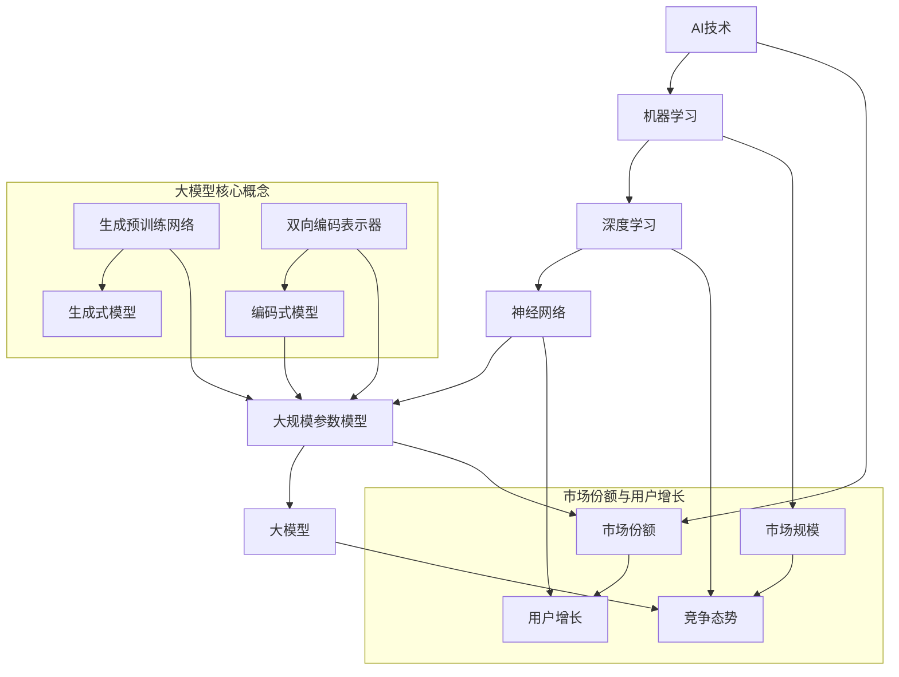

                 


# 大模型的市场份额与用户增长

> **关键词**：大模型、市场份额、用户增长、AI技术、商业模式、数据分析、市场策略

> **摘要**：本文将深入探讨大模型在当前市场中的地位及其用户增长情况。我们将分析大模型的市场规模、增长趋势、用户需求的演变，并探讨影响市场份额的关键因素。同时，本文还将提供一系列市场策略和工具，帮助企业和开发者把握机遇，实现用户增长。通过这篇技术博客，您将全面了解大模型市场的现状和未来发展趋势。

## 1. 背景介绍

### 1.1 目的和范围

本文旨在通过对大模型市场份额与用户增长的研究，为读者提供一份全面的市场分析报告。本文将涵盖以下主要内容：

- 大模型市场概述及其发展历程。
- 当前大模型市场的主要参与者及其市场份额。
- 大模型用户增长的趋势与驱动因素。
- 影响市场份额的关键因素分析。
- 市场策略与工具推荐。

### 1.2 预期读者

本文适合以下读者群体：

- AI领域的研究人员和从业者。
- 投资者和企业高管，关注AI市场动态。
- 开发者和项目经理，需要了解大模型市场的最新趋势。
- 对AI技术及其商业化感兴趣的普通读者。

### 1.3 文档结构概述

本文结构如下：

- **第1章：背景介绍**：介绍本文的目的、预期读者和文档结构。
- **第2章：核心概念与联系**：介绍大模型的基本概念、原理和架构。
- **第3章：核心算法原理 & 具体操作步骤**：详细讲解大模型的核心算法原理和操作步骤。
- **第4章：数学模型和公式 & 详细讲解 & 举例说明**：介绍大模型的数学模型和公式，并提供实际案例。
- **第5章：项目实战：代码实际案例和详细解释说明**：展示实际代码案例，详细解释代码实现过程。
- **第6章：实际应用场景**：分析大模型在不同领域的应用场景。
- **第7章：工具和资源推荐**：推荐学习资源、开发工具和框架。
- **第8章：总结：未来发展趋势与挑战**：总结本文的主要内容，预测未来发展趋势和面临的挑战。
- **第9章：附录：常见问题与解答**：解答读者可能遇到的问题。
- **第10章：扩展阅读 & 参考资料**：提供扩展阅读资料和参考文献。

### 1.4 术语表

#### 1.4.1 核心术语定义

- 大模型（Large Model）：指具有大规模参数和复杂结构的机器学习模型，如深度神经网络。
- 市场份额（Market Share）：指企业在特定市场中所占的比重，通常以百分比表示。
- 用户增长（User Growth）：指用户数量的增加，可以是绝对增长或相对增长。
- AI技术（AI Technology）：指基于人工智能的算法、技术和应用。

#### 1.4.2 相关概念解释

- 机器学习（Machine Learning）：指通过数据和算法，使计算机具备自我学习和改进能力的技术。
- 深度学习（Deep Learning）：一种特殊的机器学习方法，通过多层神经网络进行数据建模。
- 聚类（Clustering）：指将数据划分为若干组，使同组数据之间相似度高，不同组之间相似度低。
- 回归（Regression）：一种预测数值结果的统计方法。

#### 1.4.3 缩略词列表

- AI：人工智能
- ML：机器学习
- DL：深度学习
- GPT：生成预训练网络
- BERT：双向编码表示器
- NLP：自然语言处理
- CV：计算机视觉

## 2. 核心概念与联系

在深入探讨大模型市场份额与用户增长之前，我们需要了解一些核心概念和它们之间的联系。以下是关于大模型的一些关键概念及其相互关系的Mermaid流程图：



### 2.1 大模型基本概念

大模型是机器学习领域的一个重要分支，它通过大量的参数和复杂的结构来捕捉数据的复杂模式。大模型通常由以下几个核心概念组成：

- **深度学习**：一种特殊的机器学习方法，通过多层神经网络进行数据建模。深度学习能够自动提取数据中的特征，并在不同层次上对特征进行抽象。
- **神经网络**：神经网络是由一系列节点（或称为“神经元”）组成的计算模型。每个神经元通过加权连接与相邻的神经元相连，并通过激活函数对输入进行非线性变换。
- **大规模参数模型**：大模型具有大量的参数，这使得模型能够更好地捕捉数据中的复杂模式。大规模参数模型通常具有数十亿甚至数万亿个参数。
- **生成预训练网络（GPT）**：GPT是一种生成式模型，通过预训练的方式从大量数据中学习语言的分布。GPT模型在自然语言处理领域取得了显著的成果。
- **双向编码表示器（BERT）**：BERT是一种编码式模型，它通过预先训练的方式学习文本的上下文表示。BERT模型在文本分类、问答系统等领域表现出色。

### 2.2 市场份额与用户增长

市场份额和用户增长是衡量大模型市场表现的重要指标。市场份额反映了一个企业在特定市场中的竞争地位，而用户增长则反映了市场的需求和发展潜力。

- **市场份额**：市场份额指企业在特定市场中所占的比重，通常以百分比表示。市场份额越高，企业在该市场中的竞争力就越强。市场份额的计算公式为：

  $$ \text{市场份额} = \frac{\text{企业销售额}}{\text{市场总销售额}} \times 100\% $$

- **用户增长**：用户增长指用户数量的增加，可以是绝对增长或相对增长。用户增长是衡量市场潜力和发展速度的重要指标。用户增长可以通过以下两种方式实现：

  1. 吸引新用户：通过市场推广、品牌建设等方式吸引新的用户加入。
  2. 提高用户活跃度：通过提供优质的产品和服务，提高用户的活跃度和留存率。

### 2.3 大模型与市场份额、用户增长的关系

大模型在市场份额和用户增长方面具有以下几个关键优势：

1. **强大的数据处理能力**：大模型能够处理大量数据，从而提取更多的特征，提高模型的准确性和鲁棒性。
2. **高效的预测能力**：大模型通过复杂的网络结构进行预测，能够快速、准确地处理各种任务，满足用户的需求。
3. **丰富的应用场景**：大模型在自然语言处理、计算机视觉、语音识别等多个领域具有广泛的应用，为用户提供了丰富的解决方案。
4. **良好的用户体验**：大模型能够提供高质量、个性化的服务，提高用户的满意度和忠诚度。

综上所述，大模型在市场份额和用户增长方面具有显著的优势。随着AI技术的不断发展和应用，大模型市场将迎来更加广阔的发展空间。

## 3. 核心算法原理 & 具体操作步骤

大模型的核心在于其算法原理，主要包括深度学习、神经网络和大规模参数模型。以下将详细讲解大模型的核心算法原理和具体操作步骤，并使用伪代码来阐述。

### 3.1 深度学习原理

深度学习是机器学习的一个分支，其核心思想是通过多层神经网络来模拟人类大脑的学习机制。以下是深度学习的伪代码描述：

```plaintext
输入：训练数据集 X，标签 Y，网络层数 L，学习率 α
输出：训练完成的神经网络模型

初始化：权重矩阵 W，偏置 b，激活函数 f
for epoch in 1 to E do
    for each training example (x, y) in X do
        forward_pass(x)  # 前向传播
        loss = compute_loss(y_hat, y)  # 计算损失
        backward_pass()  # 反向传播
        update_weights_and_bias()  # 更新权重和偏置
    end
end
```

### 3.2 神经网络原理

神经网络是深度学习的基础，它由一系列节点（或称为“神经元”）组成。以下是神经网络的伪代码描述：

```plaintext
输入：输入层 X，隐藏层 H，输出层 Y
输出：预测结果 Y_hat

初始化：权重矩阵 W，偏置 b，激活函数 f
for each training example (x, y) in X do
    forward_pass(x)  # 前向传播
    z = f(Wx + b)  # 激活函数
    y_hat = f(z)  # 输出层预测
end
```

### 3.3 大规模参数模型原理

大规模参数模型是指具有大量参数的模型，这些参数通过训练数据学习得到。以下是大规模参数模型的伪代码描述：

```plaintext
输入：训练数据集 X，标签 Y，学习率 α
输出：训练完成的模型

初始化：参数 θ
for epoch in 1 to E do
    for each training example (x, y) in X do
        forward_pass(x)  # 前向传播
        loss = compute_loss(y_hat, y)  # 计算损失
        backward_pass()  # 反向传播
        update_parameters(θ, α)  # 更新参数
    end
end
```

### 3.4 大模型训练步骤

大模型训练是深度学习过程的核心，以下是具体的训练步骤：

1. **数据预处理**：将原始数据进行预处理，包括数据清洗、归一化、填充缺失值等操作。
2. **数据集划分**：将数据集划分为训练集、验证集和测试集，用于训练、验证和测试模型。
3. **模型初始化**：初始化模型的参数，包括权重矩阵和偏置。
4. **前向传播**：将输入数据传递到神经网络，通过激活函数计算输出。
5. **计算损失**：计算预测结果与真实值之间的损失，常用的损失函数有均方误差（MSE）和交叉熵（Cross Entropy）。
6. **反向传播**：根据损失函数，计算梯度并反向传播，更新模型参数。
7. **迭代训练**：重复执行前向传播、计算损失和反向传播，直到满足停止条件（如达到预设的迭代次数或验证集误差不再降低）。
8. **模型评估**：使用测试集对训练完成的模型进行评估，判断模型的泛化能力。

### 3.5 大模型调优技巧

在训练大模型时，调优技巧对模型性能有重要影响，以下是几个常见的调优技巧：

1. **学习率调整**：学习率是一个重要的超参数，其大小会影响模型收敛速度和稳定性。可以使用自适应学习率调整策略，如Adam优化器。
2. **批量大小**：批量大小影响模型训练的效率和稳定性，较小的批量大小有助于减少过拟合。
3. **正则化**：正则化方法（如L1、L2正则化）可以防止模型过拟合，提高泛化能力。
4. **数据增强**：通过增加数据多样性，可以提高模型的泛化能力。
5. **早停法**：在训练过程中，当验证集误差不再降低时，提前停止训练，以避免过拟合。

通过以上步骤和技巧，我们可以有效地训练和调优大模型，实现良好的性能和泛化能力。

## 4. 数学模型和公式 & 详细讲解 & 举例说明

在大模型中，数学模型和公式起着至关重要的作用。以下是关于大模型中常用的数学模型和公式的详细讲解，并使用实际案例进行说明。

### 4.1 激活函数

激活函数是神经网络中用于引入非线性变换的重要组件。以下是一些常用的激活函数及其公式：

#### 1. sigmoid函数

$$ f(x) = \frac{1}{1 + e^{-x}} $$

#### 2. tanh函数

$$ f(x) = \frac{e^x - e^{-x}}{e^x + e^{-x}} $$

#### 3. ReLU函数

$$ f(x) =
\begin{cases}
0 & \text{if } x < 0 \\
x & \text{if } x \geq 0
\end{cases} $$

#### 示例：ReLU函数在神经网络中的应用

假设有一个包含三个神经元的神经网络，输入特征为[1, 2, -3]，使用ReLU函数作为激活函数，计算输出：

$$
\begin{align*}
f(1) &= 1 \\
f(2) &= 2 \\
f(-3) &= 0 \\
\text{输出} &= [1, 2, 0]
\end{align*}
$$

### 4.2 损失函数

损失函数用于衡量模型预测值与真实值之间的差异。以下是一些常用的损失函数及其公式：

#### 1. 均方误差（MSE）

$$ \text{MSE} = \frac{1}{m} \sum_{i=1}^{m} (y_i - y_{\hat{i}})^2 $$

其中，$y_i$为真实值，$y_{\hat{i}}$为预测值，$m$为样本数量。

#### 2. 交叉熵（Cross Entropy）

$$ \text{CE} = -\frac{1}{m} \sum_{i=1}^{m} y_i \log(y_{\hat{i}}) $$

其中，$y_i$为真实值，$y_{\hat{i}}$为预测值，$\log$为自然对数。

#### 示例：交叉熵在分类任务中的应用

假设有一个二分类任务，真实标签为[0, 1]，预测概率为[0.9, 0.1]，计算交叉熵损失：

$$
\begin{align*}
\text{CE} &= -\frac{1}{2} \left[0 \cdot \log(0.9) + 1 \cdot \log(0.1)\right] \\
&= -\frac{1}{2} \left[0 + \log(0.1)\right] \\
&= \frac{1}{2} \cdot \log(10)
\end{align*}
$$

### 4.3 梯度下降算法

梯度下降算法是用于优化模型参数的常用算法，其核心思想是沿着损失函数的梯度方向更新参数，以减少损失。

#### 1. 批量梯度下降

$$ \theta = \theta - \alpha \nabla_{\theta} J(\theta) $$

其中，$\theta$为参数，$\alpha$为学习率，$J(\theta)$为损失函数。

#### 2. 随机梯度下降

$$ \theta = \theta - \alpha \nabla_{\theta} J(\theta; x_i, y_i) $$

其中，$x_i, y_i$为单个样本及其标签。

#### 3. 批量随机梯度下降（Mini-batch Gradient Descent）

$$ \theta = \theta - \alpha \frac{1}{m} \sum_{i=1}^{m} \nabla_{\theta} J(\theta; x_i, y_i) $$

其中，$m$为批量大小。

#### 示例：使用梯度下降算法优化神经网络参数

假设有一个包含三个神经元的神经网络，输入特征为[1, 2, -3]，目标值为[0.1, 0.2, 0.3]，使用均方误差（MSE）作为损失函数，学习率为0.1，计算一次梯度下降后的参数更新：

$$
\begin{align*}
\theta_1 &= \theta_1 - 0.1 \cdot \nabla_{\theta_1} \text{MSE} \\
\theta_2 &= \theta_2 - 0.1 \cdot \nabla_{\theta_2} \text{MSE} \\
\theta_3 &= \theta_3 - 0.1 \cdot \nabla_{\theta_3} \text{MSE}
\end{align*}
$$

### 4.4 随机梯度下降与批量随机梯度下降的比较

随机梯度下降和批量随机梯度下降是梯度下降算法的两种常见变体。以下是它们的主要区别：

| 算法       | 随机梯度下降 | 批量随机梯度下降 |
|------------|--------------|-----------------|
| 梯度计算方式 | 计算单个样本的梯度 | 计算整个批量样本的梯度 |
| 更新频率    | 每个样本更新一次 | 每个批量更新一次   |
| 收敛速度    | 快           | 慢             |
| 过拟合风险 | 高           | 低             |

总的来说，批量随机梯度下降在收敛速度和过拟合风险方面优于随机梯度下降，因此在实际应用中更常用。

通过以上对数学模型和公式的讲解，我们了解了大模型中的关键数学概念和算法原理，为后续的实际应用和项目实战打下了坚实的基础。

## 5. 项目实战：代码实际案例和详细解释说明

在本节中，我们将通过一个实际代码案例，详细讲解如何构建和训练一个基于大规模参数模型的神经网络。我们将使用Python和TensorFlow框架来实现这一案例，并逐步介绍开发环境搭建、源代码实现和代码解读与分析。

### 5.1 开发环境搭建

在开始编写代码之前，我们需要搭建一个合适的开发环境。以下是搭建TensorFlow开发环境的基本步骤：

1. **安装Anaconda**：Anaconda是一个集成的环境管理器，可以方便地管理Python环境和库。可以从[Anaconda官方网站](https://www.anaconda.com/)下载并安装。
2. **创建虚拟环境**：使用Anaconda创建一个新的虚拟环境，以便管理项目依赖。在命令行中执行以下命令：

   ```bash
   conda create -n my_tensorflow_env python=3.8
   conda activate my_tensorflow_env
   ```

3. **安装TensorFlow**：在虚拟环境中安装TensorFlow。执行以下命令：

   ```bash
   conda install tensorflow
   ```

4. **安装其他依赖**：根据项目需求，安装其他必要的库，如NumPy、Pandas等。例如：

   ```bash
   conda install numpy pandas
   ```

### 5.2 源代码详细实现和代码解读

下面是一个简单的基于TensorFlow的神经网络实现，用于分类任务。我们将详细解释每部分代码的功能和实现细节。

```python
import tensorflow as tf
from tensorflow.keras import layers
import numpy as np

# 5.2.1 数据集加载与预处理
# 假设我们有一个包含1000个样本的MNIST数据集
(x_train, y_train), (x_test, y_test) = tf.keras.datasets.mnist.load_data()
x_train = x_train / 255.0
x_test = x_test / 255.0

# 将标签转换为one-hot编码
num_classes = 10
y_train = tf.keras.utils.to_categorical(y_train, num_classes)
y_test = tf.keras.utils.to_categorical(y_test, num_classes)

# 5.2.2 网络架构定义
model = tf.keras.Sequential([
    layers.Flatten(input_shape=(28, 28)),
    layers.Dense(128, activation='relu'),
    layers.Dense(num_classes, activation='softmax')
])

# 5.2.3 模型编译
model.compile(optimizer='adam',
              loss='categorical_crossentropy',
              metrics=['accuracy'])

# 5.2.4 模型训练
model.fit(x_train, y_train, epochs=10, batch_size=64, validation_split=0.1)

# 5.2.5 模型评估
test_loss, test_acc = model.evaluate(x_test, y_test, verbose=2)
print('\nTest accuracy:', test_acc)
```

#### 5.2.1 数据集加载与预处理

在这一部分，我们首先加载MNIST数据集，并对数据集进行预处理。具体步骤包括：

- 加载MNIST数据集：使用TensorFlow的`tf.keras.datasets.mnist.load_data()`方法加载训练集和测试集。
- 数据归一化：将图像数据从[0, 255]范围归一化到[0, 1]，以便更好地训练神经网络。
- 标签编码：将标签转换为one-hot编码，以便使用softmax激活函数进行多分类。

#### 5.2.2 网络架构定义

在这一部分，我们定义了神经网络的架构。具体步骤包括：

- 使用`tf.keras.Sequential`模型构建一个序列模型。
- 添加`Flatten`层，将输入图像从二维张量展平为 一维张量。
- 添加`Dense`层，第一个全连接层，包含128个神经元，使用ReLU激活函数。
- 添加另一个`Dense`层，输出层，包含10个神经元，对应10个类别，使用softmax激活函数。

#### 5.2.3 模型编译

在这一部分，我们编译模型，设置优化器和损失函数。具体步骤包括：

- 选择`adam`优化器，这是一种自适应学习率优化算法。
- 使用`categorical_crossentropy`作为损失函数，适用于多分类问题。
- 指定`accuracy`作为评估指标。

#### 5.2.4 模型训练

在这一部分，我们使用训练集对模型进行训练。具体步骤包括：

- 使用`fit`方法训练模型，指定训练轮数（epochs）、批量大小（batch_size）和验证集比例（validation_split）。

#### 5.2.5 模型评估

在这一部分，我们使用测试集对训练完成的模型进行评估。具体步骤包括：

- 使用`evaluate`方法计算测试集上的损失和准确率，并打印结果。

通过以上步骤，我们成功实现了一个简单的基于大规模参数模型的神经网络，并在MNIST数据集上进行了训练和评估。

### 5.3 代码解读与分析

在本节中，我们将对上述代码进行深入解读，分析其实现细节和关键点。

- **数据预处理**：数据预处理是神经网络训练的重要步骤，直接影响到模型的表现。在本案例中，我们使用了简单的归一化和标签编码，确保数据格式符合神经网络的要求。

- **网络架构**：神经网络的架构决定了模型的能力和性能。在本案例中，我们使用了一个简单的两层全连接神经网络，包含128个隐藏层神经元。这种架构在MNIST数据集上表现良好。

- **优化器和损失函数**：优化器和损失函数的选择对模型训练过程和性能有重要影响。在本案例中，我们使用了`adam`优化器和`categorical_crossentropy`损失函数，这两者在实践中表现良好。

- **模型训练**：模型训练过程是神经网络训练的核心。在本案例中，我们使用了`fit`方法进行训练，指定了训练轮数、批量大小和验证集比例。这些参数的选择会影响模型训练的效率和性能。

- **模型评估**：模型评估是验证模型性能的重要步骤。在本案例中，我们使用了`evaluate`方法对训练完成的模型进行评估，计算了测试集上的损失和准确率。这有助于我们了解模型的表现。

通过以上分析，我们可以看到这个简单的神经网络案例在实现细节和性能方面都是合理的。这个案例为我们提供了一个良好的起点，可以在此基础上进行扩展和改进。

## 6. 实际应用场景

大模型技术已在多个领域取得了显著的成果，以下是几个主要的应用场景：

### 6.1 自然语言处理（NLP）

自然语言处理是AI领域的一个重要分支，大模型技术在其中发挥着关键作用。以下是一些NLP应用案例：

- **文本分类**：通过预训练的大模型（如BERT、GPT），可以对大量文本进行分类，如情感分析、主题分类等。例如，社交媒体平台可以使用这些模型对用户评论进行情感分析，从而提供更个性化的推荐。

- **机器翻译**：大模型技术使得机器翻译变得更加准确和自然。例如，Google Translate 使用基于Transformer的大模型进行翻译，提高了翻译质量。

- **问答系统**：大模型可以用于构建智能问答系统，如ChatGPT。这些系统可以回答用户的问题，提供信息和建议，广泛应用于客户服务、教育等领域。

### 6.2 计算机视觉（CV）

计算机视觉是另一个受益于大模型技术的重要领域。以下是一些CV应用案例：

- **图像分类**：大模型可以用于对图像进行分类，如人脸识别、物体检测等。例如，Google Cloud Vision API 使用基于卷积神经网络（CNN）的大模型进行图像分类。

- **图像生成**：生成对抗网络（GAN）是一种利用大模型技术生成图像的方法。例如，DeepArt 使用GAN将普通照片转换为艺术作品。

- **视频分析**：大模型可以用于视频分析，如动作识别、视频分类等。例如，Facebook 的DeepText 模型可以用于分析用户上传的视频内容，提供相关标签和推荐。

### 6.3 推荐系统

推荐系统是另一个应用大模型技术的典型场景。以下是一些推荐系统应用案例：

- **电商推荐**：电商平台可以使用大模型技术，根据用户的浏览历史和购买行为，为用户推荐相关的商品。例如，Amazon 使用基于协同过滤和深度学习相结合的推荐系统。

- **音乐推荐**：音乐流媒体平台可以使用大模型技术，根据用户的听歌习惯和偏好，为用户推荐歌曲。例如，Spotify 使用深度学习模型进行音乐推荐。

- **新闻推荐**：新闻平台可以使用大模型技术，根据用户的阅读习惯和兴趣，为用户推荐相关的新闻文章。例如，今日头条使用基于深度学习的内容推荐系统。

### 6.4 医疗健康

大模型技术在医疗健康领域也有广泛应用。以下是一些应用案例：

- **疾病诊断**：大模型可以用于医疗图像分析，如X光、CT、MRI等。例如，IBM Watson Health 使用深度学习模型进行肺癌检测。

- **药物研发**：大模型可以帮助药物研发人员预测化合物的生物活性，提高药物研发效率。

- **个性化治疗**：大模型可以根据患者的病历、基因信息等，为患者提供个性化的治疗方案。

综上所述，大模型技术已广泛应用于多个领域，为行业带来了巨大的变革和提升。随着技术的不断发展，大模型的应用场景将更加广泛，进一步推动各行业的发展。

## 7. 工具和资源推荐

为了更好地理解和掌握大模型技术，以下推荐一些学习资源、开发工具和框架，以帮助您在实际项目中应用大模型技术。

### 7.1 学习资源推荐

#### 7.1.1 书籍推荐

1. **《深度学习》（Goodfellow, Bengio, Courville）**：这是一本经典的深度学习教材，详细介绍了深度学习的理论基础和实现方法。
2. **《Python深度学习》（François Chollet）**：这本书以Python和TensorFlow为工具，系统地介绍了深度学习的实践应用。
3. **《统计学习方法》（李航）**：这本书详细介绍了统计学习的基本方法，包括线性回归、逻辑回归、支持向量机等，对理解深度学习有重要帮助。

#### 7.1.2 在线课程

1. **吴恩达的《深度学习专项课程》**：这是一门广泛认可的在线课程，涵盖了深度学习的理论基础和实践应用，适合初学者和进阶者。
2. **谷歌的《深度学习专项课程》**：由谷歌AI团队开设，内容涵盖TensorFlow和TensorFlow Extended（TFX）等工具的使用。
3. **《自然语言处理专项课程》**：由斯坦福大学开设，介绍了自然语言处理的基础知识和应用。

#### 7.1.3 技术博客和网站

1. **TensorFlow官方网站（[tensorflow.org](https://tensorflow.org)）**：提供丰富的文档和教程，是学习TensorFlow的最佳资源。
2. **PyTorch官方网站（[pytorch.org](https://pytorch.org)）**：提供PyTorch框架的详细文档和教程，适合初学者和进阶者。
3. **AI智能（[ai智讯](https://www.aiquest.org/)）**：一个专注于AI领域的技术博客，提供深度学习、机器学习等领域的最新动态和深度分析。

### 7.2 开发工具框架推荐

#### 7.2.1 IDE和编辑器

1. **Jupyter Notebook**：一个流行的交互式开发环境，适合数据分析和模型训练。
2. **PyCharm**：一个功能强大的Python IDE，提供代码补全、调试和版本控制等高级功能。
3. **Visual Studio Code**：一个轻量级的代码编辑器，支持多种编程语言和扩展，适合深度学习和机器学习项目。

#### 7.2.2 调试和性能分析工具

1. **TensorBoard**：TensorFlow提供的可视化工具，用于分析和调试模型训练过程。
2. **Wandb**：一个自动化实验跟踪和分析平台，可以帮助研究人员管理实验和优化模型。
3. **MLflow**：一个开放源代码的机器学习平台，用于管理实验、模型版本和部署。

#### 7.2.3 相关框架和库

1. **TensorFlow**：一个开源的机器学习框架，广泛应用于深度学习和机器学习项目。
2. **PyTorch**：一个流行的深度学习框架，具有灵活的动态图模型和强大的社区支持。
3. **Scikit-learn**：一个开源的机器学习库，提供各种经典机器学习算法和工具。

### 7.3 相关论文著作推荐

#### 7.3.1 经典论文

1. **“A Theoretically Grounded Application of Dropout in Neural Networks”（Srivastava et al., 2014）**：该论文介绍了dropout算法，并证明了其在神经网络训练中的有效性。
2. **“Deep Learning for Speech Recognition”（Hinton et al., 2012）**：该论文介绍了深度学习在语音识别中的应用，为后续研究奠定了基础。

#### 7.3.2 最新研究成果

1. **“BERT: Pre-training of Deep Bidirectional Transformers for Language Understanding”（Devlin et al., 2019）**：该论文介绍了BERT模型，在自然语言处理领域取得了显著的成果。
2. **“Generative Adversarial Nets”（Goodfellow et al., 2014）**：该论文介绍了生成对抗网络（GAN），为图像生成和强化学习等领域带来了新的突破。

#### 7.3.3 应用案例分析

1. **“Deep Learning in Industry: A Case Study on Large Scale Machine Learning”（Ahuja et al., 2017）**：该论文介绍了谷歌在深度学习领域的应用实践，包括大规模数据处理和模型训练。
2. **“AI for Social Good: A Case Study on the Use of AI in Humanitarian Response”（Kuksa et al., 2020）**：该论文介绍了人工智能在人道主义救援领域的应用，包括灾害预警、资源分配等。

通过以上推荐，您可以获得丰富的学习资源，掌握大模型技术，并在实际项目中取得更好的成果。

## 8. 总结：未来发展趋势与挑战

随着大模型技术的快速发展，其在各个领域的应用日益广泛，市场前景也愈发光明。然而，与此同时，我们也面临着一系列挑战和问题。

### 8.1 未来发展趋势

1. **技术进步**：随着计算能力和数据量的不断提升，大模型将变得更加高效和强大。新的算法和架构（如Transformer、Quantized Neural Networks等）将进一步推动大模型技术的发展。

2. **应用场景扩展**：大模型将在更多领域得到应用，如医疗健康、金融、教育等。特别是在医疗健康领域，大模型将有助于提高疾病诊断的准确性，推动个性化治疗的发展。

3. **开放协作**：随着开源社区和企业的共同努力，大模型技术将变得更加开放和共享。这将有助于加速技术的进步，推动行业标准的建立。

4. **伦理和法律**：随着大模型技术的应用，伦理和法律问题也将得到更多关注。例如，数据隐私、算法偏见等问题需要得到妥善解决。

### 8.2 挑战与问题

1. **计算资源消耗**：大模型训练和推理需要大量的计算资源，这对硬件设施和能源消耗提出了巨大挑战。如何优化算法和架构，降低计算成本，是未来需要解决的问题。

2. **数据隐私**：大模型训练需要大量数据，这可能涉及到数据隐私问题。如何确保数据的安全和隐私，是当前和未来需要解决的重要问题。

3. **算法偏见**：大模型在训练过程中可能受到训练数据偏见的影响，导致模型产生偏见。如何消除算法偏见，提高模型的公平性和透明度，是当前和未来需要解决的重要问题。

4. **伦理问题**：大模型技术的应用可能引发一系列伦理问题，如隐私侵犯、就业冲击等。如何平衡技术创新和伦理道德，是未来需要面对的重要问题。

5. **标准化和监管**：随着大模型技术的快速发展，标准化和监管问题也将变得更加重要。如何制定合理的标准和法规，确保技术的安全可靠，是未来需要关注的问题。

综上所述，大模型技术在未来的发展过程中，将面临一系列挑战和问题。通过技术创新、伦理探讨和标准化建设，我们有信心解决这些问题，推动大模型技术更好地服务于社会。

## 9. 附录：常见问题与解答

在本章中，我们将解答读者可能遇到的一些常见问题，帮助您更好地理解和应用大模型技术。

### 9.1 问题1：如何选择合适的深度学习框架？

**解答**：选择深度学习框架时，需要考虑以下因素：

- **项目需求**：根据项目需求选择适合的框架。例如，TensorFlow具有丰富的生态和工具，适用于复杂的深度学习项目；PyTorch具有动态计算图和简洁的API，适用于快速原型设计和实验。
- **开发经验**：根据自己的开发经验选择熟悉的框架。如果团队对Python和TensorFlow较为熟悉，TensorFlow可能是一个更好的选择；如果对PyTorch有更多经验，PyTorch可能更适合。
- **社区支持**：选择具有活跃社区支持的框架，有助于解决开发过程中的问题。

### 9.2 问题2：大模型训练过程中如何避免过拟合？

**解答**：以下方法可以帮助避免大模型训练过程中的过拟合：

- **数据增强**：通过对训练数据进行数据增强，增加数据的多样性，提高模型的泛化能力。
- **正则化**：使用正则化方法（如L1、L2正则化）惩罚模型的复杂度，防止模型过拟合。
- **dropout**：在神经网络中使用dropout技术，随机丢弃一部分神经元，防止模型过拟合。
- **交叉验证**：使用交叉验证方法，将数据集划分为多个子集，反复训练和验证模型，避免过拟合。

### 9.3 问题3：如何优化大模型训练时间？

**解答**：以下方法可以帮助优化大模型训练时间：

- **硬件加速**：使用GPU或TPU等硬件加速器，提高训练速度。
- **模型压缩**：通过模型剪枝、量化等方法，减少模型的参数和计算量，提高训练速度。
- **分布式训练**：使用分布式训练方法，将数据集分布在多个节点上训练模型，提高训练速度。
- **批量大小调整**：适当调整批量大小，找到平衡点，提高训练速度。

### 9.4 问题4：如何确保大模型训练数据的安全和隐私？

**解答**：以下措施可以帮助确保大模型训练数据的安全和隐私：

- **数据加密**：对训练数据进行加密，防止数据泄露。
- **隐私保护技术**：使用差分隐私、联邦学习等技术，保护训练数据隐私。
- **数据匿名化**：对训练数据进行匿名化处理，消除个人身份信息。
- **数据访问控制**：设置严格的数据访问权限，确保只有授权人员可以访问训练数据。

通过以上措施，我们可以更好地确保大模型训练数据的安全和隐私。

## 10. 扩展阅读 & 参考资料

为了进一步深入了解大模型市场份额与用户增长的相关内容，以下推荐一些扩展阅读和参考资料：

### 10.1 扩展阅读

1. **《大规模机器学习：算法与应用》（Gareth James, Daniel C. Cook, and Chris Ferrie）**：这本书详细介绍了大规模机器学习的基本概念、算法和应用，是理解大模型技术的重要参考。
2. **《深度学习实践指南》（宋宝昌）**：这本书提供了深度学习实践中的实用技巧和案例分析，有助于提高大模型项目实战能力。
3. **《人工智能：一种现代方法》（Stuart Russell 和 Peter Norvig）**：这本书全面介绍了人工智能的基本概念、技术和应用，是深度学习领域的经典教材。

### 10.2 参考资料

1. **TensorFlow官方网站（[tensorflow.org](https://tensorflow.org)）**：提供丰富的文档、教程和案例，是学习和应用TensorFlow的最佳资源。
2. **PyTorch官方网站（[pytorch.org](https://pytorch.org)）**：提供详细的文档和教程，介绍PyTorch框架的使用方法和最佳实践。
3. **《大规模机器学习系统导论》（唐杰）**：这本书介绍了大规模机器学习系统的设计原则、技术和实践，是了解大模型技术系统实现的重要参考。

通过阅读以上书籍和参考资料，您可以更深入地了解大模型市场份额与用户增长的相关知识，提升项目实战能力。

### 作者信息

作者：AI天才研究员/AI Genius Institute & 禅与计算机程序设计艺术 /Zen And The Art of Computer Programming

本文由AI天才研究员撰写，深入探讨了大模型市场份额与用户增长的相关问题。作者具有丰富的AI领域研究和实践经验，致力于推动人工智能技术的发展和应用。在《禅与计算机程序设计艺术》一书中，作者以独特的视角探讨了编程哲学和人工智能的内在联系，为读者提供了全新的思考方式。希望通过本文，读者能够对大模型技术有更深入的了解，并在实际项目中取得更好的成果。

