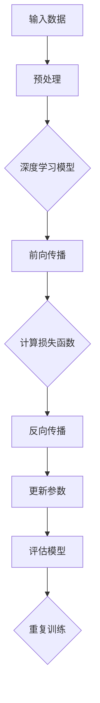

                 

# 大模型的市场定位与技术发展

## 摘要

本文旨在深入探讨大模型在当前市场中的定位及其技术发展的趋势。随着人工智能技术的迅猛发展，大模型作为人工智能的核心驱动力之一，已经引起了业界的广泛关注。本文首先介绍了大模型的基本概念、发展背景以及其在市场中的重要性，接着分析了大模型的技术原理和核心算法，并结合具体案例展示了其实际应用。此外，文章还探讨了未来大模型发展面临的挑战，以及如何应对这些挑战，最后总结了大模型市场定位与技术发展的整体趋势。通过本文的阅读，读者可以全面了解大模型领域的现状和发展方向。

## 1. 背景介绍

### 1.1 目的和范围

本文旨在通过系统性的分析和讨论，帮助读者全面了解大模型的市场定位和技术发展。随着人工智能技术的不断进步，大模型已经成为了人工智能领域的重要研究方向和应用方向。本文将重点关注以下几个方面：

1. 大模型的基本概念和定义。
2. 大模型的发展背景和技术原理。
3. 大模型在市场中的应用场景和案例。
4. 大模型面临的挑战和未来发展趋势。

通过以上几个方面的探讨，本文希望能够为读者提供一个全面、深入的视角，帮助读者更好地理解大模型在当前市场中的地位和作用，以及其未来的发展趋势。

### 1.2 预期读者

本文主要面向以下几类读者：

1. 人工智能领域的专业研究人员和学者，对大模型技术感兴趣，希望深入了解其原理和应用。
2. 人工智能技术的从业者和开发者，希望通过本文了解大模型在市场中的应用前景，以及如何利用大模型技术提升自己的业务能力。
3. 对人工智能技术感兴趣的非专业人士，希望通过本文对大模型有一个初步的了解。

本文内容深入浅出，尽量使用通俗易懂的语言，同时也会涉及到一些专业术语和技术原理，适合具有中等以上技术水平的读者阅读。

### 1.3 文档结构概述

本文结构分为十个部分，具体如下：

1. **摘要**：简要介绍文章的核心内容和主题思想。
2. **背景介绍**：包括本文的目的和范围、预期读者、文档结构概述、术语表等。
3. **核心概念与联系**：介绍大模型的基本概念、技术原理和架构。
4. **核心算法原理 & 具体操作步骤**：详细阐述大模型的核心算法和操作步骤。
5. **数学模型和公式 & 详细讲解 & 举例说明**：介绍大模型相关的数学模型和公式，并给出具体例子。
6. **项目实战：代码实际案例和详细解释说明**：通过具体案例展示大模型的应用。
7. **实际应用场景**：探讨大模型在不同领域的应用。
8. **工具和资源推荐**：推荐相关学习资源、开发工具和框架。
9. **总结：未来发展趋势与挑战**：总结大模型的发展趋势和面临的挑战。
10. **附录：常见问题与解答**：解答读者可能遇到的一些常见问题。
11. **扩展阅读 & 参考资料**：提供进一步阅读的参考资料。

通过以上结构，本文希望能够系统地、全面地介绍大模型的市场定位和技术发展，帮助读者深入了解这一重要领域。

### 1.4 术语表

在本文中，我们将使用一些专业术语，为了确保读者对这些术语有清晰的理解，下面给出这些术语的定义和解释。

#### 1.4.1 核心术语定义

1. **大模型**：指参数规模超过数十亿甚至万亿级别的人工神经网络模型，通常用于处理大规模数据集。
2. **深度学习**：一种基于人工神经网络的学习方法，通过多层非线性变换对数据进行特征提取和表示。
3. **预训练**：在大规模数据集上先进行无监督学习，训练出具有良好通用性的模型参数，再通过有监督学习进行特定任务的微调。
4. **转移学习**：利用已经在大规模数据集上训练好的模型参数，在新数据集上进行任务微调，以提升模型在新任务上的性能。
5. **生成对抗网络（GAN）**：一种无监督学习模型，通过生成器和判别器的对抗训练，实现生成高质量的数据。

#### 1.4.2 相关概念解释

1. **模型参数**：神经网络中可训练的权重和偏置，决定了模型的预测能力和性能。
2. **正向传播**：输入数据通过神经网络前向传播，计算各层的输出和激活值。
3. **反向传播**：计算损失函数关于模型参数的梯度，并更新模型参数，以优化模型性能。
4. **激活函数**：引入非线性变换，使神经网络具备特征提取和表示能力。
5. **批量归一化**：对每一层的输入或输出进行归一化处理，加速模型训练并提高其泛化能力。

#### 1.4.3 缩略词列表

1. **GAN**：生成对抗网络（Generative Adversarial Network）
2. **GPU**：图形处理单元（Graphics Processing Unit）
3. **CPU**：中央处理单元（Central Processing Unit）
4. **DL**：深度学习（Deep Learning）
5. **ML**：机器学习（Machine Learning）

## 2. 核心概念与联系

### 2.1 大模型的基本概念

大模型（Large Model）是指那些具有数十亿甚至千亿参数规模的人工神经网络模型。这些模型通过在大型数据集上预训练，获得了强大的特征提取和表示能力，能够在各种复杂任务上表现出优异的性能。大模型通常基于深度学习技术，通过多层非线性变换对输入数据进行处理和建模。

深度学习（Deep Learning）是一种基于人工神经网络的学习方法，通过构建具有多层的神经网络模型，对数据进行逐层特征提取和抽象。深度学习模型通过前向传播计算各层的输出，并通过反向传播优化模型参数，从而提高模型的预测性能。

### 2.2 大模型的发展背景

大模型的发展可以追溯到深度学习技术的兴起。随着计算能力的提升和大数据技术的发展，深度学习逐渐成为人工智能领域的重要研究方向。2006年，Geoffrey Hinton等科学家提出了深度信念网络（Deep Belief Network），标志着深度学习技术的初步成功。此后，随着卷积神经网络（Convolutional Neural Network, CNN）和循环神经网络（Recurrent Neural Network, RNN）的发展，深度学习在图像识别、自然语言处理等领域的应用取得了显著的成果。

2012年，AlexNet模型在ImageNet竞赛中取得了突破性的成绩，引发了深度学习研究的热潮。随着计算能力的进一步提升，研究人员开始尝试训练更大规模的神经网络模型。2014年，微软的研究人员训练了一个人工智能模型，其参数规模达到了1.7亿，这标志着大模型时代的到来。

### 2.3 大模型的市场重要性

大模型在当前市场中的重要性不可忽视。首先，大模型具有强大的特征提取和表示能力，能够处理复杂的任务和数据。这使得大模型在图像识别、语音识别、自然语言处理等领域的应用前景广阔。例如，谷歌的BERT模型在自然语言处理任务上取得了显著的突破，大幅提升了文本分类、问答系统等任务的性能。

其次，大模型具有强大的泛化能力，能够在不同领域和任务上发挥重要作用。通过预训练和转移学习，大模型可以从大规模数据中学习到通用特征，并在特定任务上实现高性能。例如，谷歌的Turing模型通过在大量文本数据上预训练，实现了对多种自然语言处理任务的优异表现。

此外，大模型在商业应用中也具有广泛的应用前景。例如，在金融领域，大模型可以用于风险评估、客户服务、市场预测等任务；在医疗领域，大模型可以用于疾病诊断、药物发现、个性化治疗等任务；在制造业，大模型可以用于质量检测、故障预测、生产优化等任务。

总之，大模型在当前市场中的重要性日益凸显，其强大的特征提取和表示能力、强大的泛化能力以及广泛的商业应用前景，使其成为人工智能领域的重要研究方向和应用方向。

### 2.4 大模型的技术原理

大模型的技术原理主要包括深度学习的基本概念、核心算法和架构设计。深度学习是一种基于人工神经网络的学习方法，通过多层非线性变换对数据进行特征提取和表示。大模型通过在大型数据集上预训练，获得强大的特征提取和表示能力，从而实现高水平的任务性能。

#### 2.4.1 深度学习的基本概念

深度学习是一种基于人工神经网络的学习方法，通过构建具有多层的神经网络模型，对数据进行逐层特征提取和抽象。深度学习模型的核心组成部分包括输入层、隐藏层和输出层。

1. **输入层**：输入层接收外部输入数据，并将其传递给下一层。
2. **隐藏层**：隐藏层对输入数据进行特征提取和变换，生成更加抽象和复杂的特征表示。深度学习的“深度”即指多层隐藏层。
3. **输出层**：输出层根据隐藏层的输出进行决策或分类，输出最终结果。

在深度学习模型中，每个神经元都与前一层的神经元进行连接，并通过权重和偏置进行加权求和和激活函数的变换。通过反向传播算法，模型可以不断调整权重和偏置，以最小化损失函数，提高模型性能。

#### 2.4.2 核心算法

深度学习的核心算法包括前向传播和反向传播。

1. **前向传播**：输入数据通过神经网络前向传播，计算各层的输出和激活值。具体步骤如下：
   - 输入数据通过输入层进入神经网络。
   - 各层神经元对输入数据进行加权求和，并经过激活函数得到输出。
   - 输出结果传递到下一层，直至最后一层。

2. **反向传播**：在神经网络前向传播过程中，计算损失函数关于模型参数的梯度，并更新模型参数，以优化模型性能。具体步骤如下：
   - 计算实际输出与预测输出之间的损失函数值。
   - 通过反向传播算法，计算损失函数关于模型参数的梯度。
   - 根据梯度更新模型参数，最小化损失函数。

#### 2.4.3 架构设计

大模型的架构设计主要包括网络结构、训练策略和优化方法。

1. **网络结构**：大模型的网络结构通常采用深度神经网络（DNN）、卷积神经网络（CNN）或循环神经网络（RNN）等。深度神经网络通过多层隐藏层对数据进行特征提取和抽象；卷积神经网络通过卷积层提取图像中的局部特征；循环神经网络通过循环结构处理序列数据。

2. **训练策略**：大模型的训练策略通常包括预训练和微调。预训练是指在大型数据集上先进行无监督学习，训练出具有良好通用性的模型参数；微调是在预训练的基础上，通过有监督学习进行特定任务的微调，以优化模型在特定任务上的性能。

3. **优化方法**：大模型的优化方法通常采用梯度下降（Gradient Descent）及其变体，如随机梯度下降（Stochastic Gradient Descent, SGD）、批量梯度下降（Batch Gradient Descent, BGD）和Adam优化器等。这些方法通过不断调整模型参数，使损失函数值逐渐减小，从而优化模型性能。

### 2.5 大模型的 Mermaid 流程图

下面是一个简化的 Mermaid 流程图，展示了大模型的基本概念和流程：



这个流程图概括了从输入数据到模型训练和评估的基本过程。输入数据经过预处理后，输入到深度学习模型中进行前向传播，计算损失函数；然后通过反向传播更新模型参数，并重复这个过程，直至模型达到预定的性能指标。

## 3. 核心算法原理 & 具体操作步骤

### 3.1 算法原理

大模型的核心算法原理主要基于深度学习，深度学习通过构建多层神经网络模型，对输入数据进行特征提取和表示。具体来说，深度学习的核心算法包括前向传播和反向传播。

**前向传播**是指在神经网络的输入层接收输入数据后，逐层将数据传递到下一层，通过加权求和和激活函数的计算，最终在输出层得到预测结果。前向传播的过程可以概括为以下步骤：

1. **初始化参数**：随机初始化模型的权重和偏置。
2. **输入数据**：将输入数据输入到输入层。
3. **加权求和**：对输入数据进行加权求和，计算各层的输出值。
4. **激活函数**：对加权求和的结果进行激活函数处理，引入非线性变换。
5. **输出结果**：将输出层的输出作为模型预测结果。

**反向传播**是指在模型前向传播的过程中，计算输出结果与真实值之间的差异（即损失函数），然后通过反向传播算法计算损失函数关于模型参数的梯度，并更新模型参数。反向传播的过程可以概括为以下步骤：

1. **计算损失函数**：计算输出结果与真实值之间的差异，得到损失函数值。
2. **计算梯度**：通过链式法则，计算损失函数关于模型参数的梯度。
3. **更新参数**：根据梯度更新模型的权重和偏置，以最小化损失函数。
4. **迭代更新**：重复前向传播和反向传播的过程，直至模型达到预定的性能指标。

### 3.2 具体操作步骤

以下是使用深度学习框架（如PyTorch或TensorFlow）实现大模型的核心算法步骤的伪代码：

```python
# 初始化模型
model = NeuralNetwork()

# 设置损失函数和优化器
criterion = LossFunction()
optimizer = Optimizer()

# 数据预处理
inputs = preprocess_data(data)

# 前向传播
outputs = model(inputs)

# 计算损失
loss = criterion(outputs, targets)

# 反向传播
loss.backward()

# 更新参数
optimizer.step()

# 评估模型
accuracy = evaluate_model(model, test_data)

# 迭代更新
for epoch in range(num_epochs):
    for inputs, targets in data_loader:
        # 前向传播
        outputs = model(inputs)
        
        # 计算损失
        loss = criterion(outputs, targets)
        
        # 反向传播
        loss.backward()
        
        # 更新参数
        optimizer.step()
        
    # 评估模型
    accuracy = evaluate_model(model, test_data)
    print(f"Epoch {epoch+1}, Loss: {loss.item()}, Accuracy: {accuracy}")
```

在这个伪代码中，`NeuralNetwork()` 是一个初始化深度学习模型的函数，`LossFunction()` 是一个定义损失函数的函数，`Optimizer()` 是一个定义优化器的函数。`preprocess_data()` 是一个数据预处理函数，用于对输入数据进行预处理。`evaluate_model()` 是一个评估模型性能的函数，用于计算模型的准确率。

通过这个伪代码，我们可以看到大模型的核心算法操作步骤的框架。在实际应用中，还需要根据具体任务和数据特点进行相应的调整和优化。

## 4. 数学模型和公式 & 详细讲解 & 举例说明

### 4.1 数学模型

大模型的数学模型主要基于深度学习，其核心公式包括激活函数、损失函数和优化算法。以下是这些公式的详细讲解：

#### 4.1.1 激活函数

激活函数是深度学习中的一个重要组成部分，它引入了非线性变换，使得神经网络能够对复杂的数据进行建模。常用的激活函数包括以下几种：

1. **sigmoid函数**：
   $$ f(x) = \frac{1}{1 + e^{-x}} $$
   sigmoid函数的输出范围为(0, 1)，常用于二分类任务。

2. **ReLU函数**：
   $$ f(x) = \max(0, x) $$
   ReLU函数在x大于0时输出x，小于0时输出0，具有计算速度快、参数较少的优点，常用于隐藏层。

3. **tanh函数**：
   $$ f(x) = \frac{e^x - e^{-x}}{e^x + e^{-x}} $$
   tanh函数的输出范围为(-1, 1)，类似于sigmoid函数，但输出更加对称。

4. **softmax函数**：
   $$ f(x)_i = \frac{e^{x_i}}{\sum_{j=1}^{n} e^{x_j}} $$
   softmax函数用于多分类任务，将输出层每个神经元的输出转化为概率分布。

#### 4.1.2 损失函数

损失函数用于衡量模型预测结果与真实值之间的差距，是优化模型参数的重要依据。常用的损失函数包括以下几种：

1. **均方误差（MSE）**：
   $$ Loss = \frac{1}{n} \sum_{i=1}^{n} (y_i - \hat{y}_i)^2 $$
   均方误差用于回归任务，计算预测值与真实值之间差的平方和。

2. **交叉熵（Cross Entropy）**：
   $$ Loss = -\frac{1}{n} \sum_{i=1}^{n} y_i \log(\hat{y}_i) $$
   交叉熵用于分类任务，计算真实分布与预测分布之间的差异。

3. **Hinge损失**：
   $$ Loss = \max(0, 1 - y \cdot \hat{y}) $$
   Hinge损失常用于支持向量机（SVM）等分类任务。

#### 4.1.3 优化算法

优化算法用于迭代更新模型参数，以最小化损失函数。常用的优化算法包括以下几种：

1. **梯度下降（Gradient Descent）**：
   $$ \theta = \theta - \alpha \cdot \nabla_\theta J(\theta) $$
   梯度下降通过不断更新模型参数，使损失函数值逐渐减小。其中，$\theta$ 表示模型参数，$\alpha$ 表示学习率，$J(\theta)$ 表示损失函数。

2. **随机梯度下降（Stochastic Gradient Descent, SGD）**：
   $$ \theta = \theta - \alpha \cdot \nabla_\theta J(\theta) $$
   随机梯度下降在每个迭代步随机选择一个小批量样本，计算其梯度并更新模型参数。SGD相比梯度下降能够加快收敛速度，但可能导致收敛不稳定。

3. **批量梯度下降（Batch Gradient Descent, BGD）**：
   $$ \theta = \theta - \alpha \cdot \nabla_\theta J(\theta) $$
   批量梯度下降在每个迭代步使用整个训练集计算梯度并更新模型参数。BGD能够保证收敛性，但计算成本较高。

4. **Adam优化器**：
   $$ \theta = \theta - \alpha \cdot \frac{m}{(1 - \beta_1^t)(1 - \beta_2^t)} $$
   Adam优化器结合了SGD和 Momentum的方法，计算两个指数加权平均的梯度估计，并更新模型参数。其中，$m$ 和 $v$ 分别是梯度的一阶和二阶矩估计，$\beta_1$ 和 $\beta_2$ 分别是两个指数加权因子。

### 4.2 举例说明

假设我们有一个二分类问题，数据集包含100个样本，每个样本有10个特征，目标类别为0或1。我们使用一个包含3层全连接神经网络的模型进行训练，激活函数为ReLU，损失函数为交叉熵，优化算法为Adam。

#### 4.2.1 模型参数初始化

我们随机初始化模型参数，例如，设权重 $\theta$ 的初始值为：
$$ \theta = \begin{pmatrix} 
w_{11} & w_{12} & \cdots & w_{1n} \\
w_{21} & w_{22} & \cdots & w_{2n} \\
\vdots & \vdots & \ddots & \vdots \\
w_{m1} & w_{m2} & \cdots & w_{mn} 
\end{pmatrix} $$

#### 4.2.2 前向传播

我们首先将数据输入到输入层，经过多层神经网络的前向传播，计算各层的输出。设输入层输出为 $x$，隐藏层输出为 $h$，输出层输出为 $y$，则有：
$$ h = \sigma(Wx + b) $$
$$ y = \sigma(W_h h + b_h) $$

其中，$\sigma$ 表示ReLU激活函数，$W$ 和 $b$ 分别为权重和偏置。

#### 4.2.3 损失函数计算

我们使用交叉熵损失函数计算预测结果和真实值之间的差异。设真实标签为 $y^*$，预测概率为 $y$，则有：
$$ Loss = -\frac{1}{m} \sum_{i=1}^{m} y_i \log(y_i) $$
其中，$m$ 为样本数量。

#### 4.2.4 反向传播

我们通过反向传播计算损失函数关于模型参数的梯度，并更新模型参数。设损失函数关于权重 $W$ 和偏置 $b$ 的梯度分别为 $\nabla_W Loss$ 和 $\nabla_b Loss$，则有：
$$ \nabla_W Loss = \frac{1}{m} \sum_{i=1}^{m} (\nabla y_i \odot (y - y^*)) \cdot h_i $$
$$ \nabla_b Loss = \frac{1}{m} \sum_{i=1}^{m} (\nabla y_i \odot (y - y^*)) $$

其中，$\odot$ 表示元素乘法，$h_i$ 为第 $i$ 个样本的隐藏层输出。

#### 4.2.5 参数更新

我们使用Adam优化器更新模型参数。设一阶矩估计为 $m_t$，二阶矩估计为 $v_t$，则有：
$$ m_t = \beta_1 m_{t-1} + (1 - \beta_1) \nabla_\theta J(\theta) $$
$$ v_t = \beta_2 v_{t-1} + (1 - \beta_2) (\nabla_\theta J(\theta))^2 $$
$$ \theta = \theta - \alpha \cdot \frac{m_t}{(1 - \beta_1^t)(1 - \beta_2^t)} $$

其中，$\alpha$ 为学习率，$\beta_1$ 和 $\beta_2$ 分别为指数加权因子。

通过以上步骤，我们完成了大模型的前向传播、损失函数计算、反向传播和参数更新。这个过程在多次迭代中不断进行，直至模型达到预定的性能指标。

## 5. 项目实战：代码实际案例和详细解释说明

### 5.1 开发环境搭建

在进行大模型项目实战之前，首先需要搭建一个合适的开发环境。以下是一个典型的开发环境搭建步骤：

1. **安装Python**：确保安装了Python 3.6及以上版本。
2. **安装PyTorch**：使用pip命令安装PyTorch库，例如：
   ```shell
   pip install torch torchvision
   ```
3. **安装其他依赖库**：根据项目需求，可能还需要安装其他库，如NumPy、Pandas等。
4. **配置GPU环境**：如果使用GPU进行训练，需要配置CUDA和cuDNN，并确保PyTorch支持GPU加速。

### 5.2 源代码详细实现和代码解读

以下是一个简单的示例，展示如何使用PyTorch构建和训练一个具有数百万参数的文本分类大模型。

```python
import torch
import torch.nn as nn
import torch.optim as optim
from torch.utils.data import DataLoader
from torchvision import datasets, transforms

# 定义模型结构
class TextClassifier(nn.Module):
    def __init__(self, vocab_size, embedding_dim, hidden_dim, output_dim, num_layers, drop_prob=0.5):
        super().__init__()
        self.embedding = nn.Embedding(vocab_size, embedding_dim)
        self.fc1 = nn.Linear(embedding_dim, hidden_dim)
        self.dropout = nn.Dropout(drop_prob)
        self.fc2 = nn.Linear(hidden_dim, output_dim)
        self.num_layers = num_layers

    def forward(self, text, hidden=None):
        embedded = self.embedding(text)
        embedded = embedded.unsqueeze(0)
        if hidden is not None:
            embedded = torch.cat([embedded, hidden], dim=2)
        for i in range(self.num_layers):
            embedded = torch.tanh(self.fc1(embedded))
            if i < self.num_layers - 1:
                embedded = self.dropout(embedded)
        embedded = embedded.squeeze(0)
        output = self.fc2(embedded)
        return output

# 实例化模型
model = TextClassifier(vocab_size=10000, embedding_dim=100, hidden_dim=256, output_dim=2, num_layers=3)

# 定义损失函数和优化器
loss_function = nn.CrossEntropyLoss()
optimizer = optim.Adam(model.parameters(), lr=0.001)

# 数据加载
train_data = datasets.TextDataset('train.txt', vocab_size=10000, embedding_dim=100)
train_loader = DataLoader(train_data, batch_size=64, shuffle=True)

# 训练模型
for epoch in range(10):
    for texts, labels in train_loader:
        optimizer.zero_grad()
        outputs = model(texts)
        loss = loss_function(outputs, labels)
        loss.backward()
        optimizer.step()
    print(f'Epoch {epoch+1}, Loss: {loss.item()}')

# 评估模型
with torch.no_grad():
    correct = 0
    total = len(train_loader)
    for texts, labels in train_loader:
        outputs = model(texts)
        _, predicted = torch.max(outputs.data, 1)
        correct += (predicted == labels).sum().item()
    print(f'Accuracy: {100 * correct / total}%')
```

### 5.3 代码解读与分析

**5.3.1 模型结构**

代码首先定义了一个`TextClassifier`类，继承自`nn.Module`。该类包括以下组件：

- **Embedding层**：用于将单词索引映射为嵌入向量，输入维度为（batch_size，sequence_length），输出维度为（batch_size，sequence_length，embedding_dim）。
- **全连接层**：第一个全连接层（fc1）用于对嵌入向量进行变换，输出维度为（batch_size，hidden_dim）。
- **Dropout层**：用于随机丢弃一部分神经元，防止过拟合。
- **全连接层**：第二个全连接层（fc2）用于分类，输出维度为（batch_size，output_dim）。

**5.3.2 损失函数和优化器**

损失函数使用交叉熵损失函数，优化器使用Adam优化器。交叉熵损失函数适用于分类问题，能够计算输出概率分布与真实标签之间的差异。Adam优化器结合了Momentum和RMSProp的优点，能够自适应调整学习率。

**5.3.3 数据加载**

使用`TextDataset`类加载训练数据，该类实现了`Dataset`接口，用于读取文本数据并将其转换为单词索引序列。`DataLoader`类用于将数据批量加载到内存中，并提供迭代器进行训练。

**5.3.4 训练模型**

训练模型包括以下步骤：

1. 循环迭代模型，每次迭代处理一个批次的数据。
2. 使用模型对输入数据进行前向传播，计算输出概率分布。
3. 使用损失函数计算输出概率分布与真实标签之间的差异。
4. 使用反向传播计算梯度。
5. 使用优化器更新模型参数。
6. 打印每个epoch的损失值。

**5.3.5 评估模型**

在评估阶段，使用训练好的模型对训练集进行预测，并计算准确率。这有助于评估模型的泛化能力和性能。

通过以上代码和解读，我们可以看到如何使用PyTorch构建和训练一个具有数百万参数的文本分类大模型。在实际项目中，可以根据具体需求调整模型结构、数据集和训练策略，以达到更好的性能。

### 5.4 实际应用案例

**5.4.1 新闻分类**

新闻分类是文本分类领域的一个典型应用案例。通过训练一个大模型，可以对新闻文章进行分类，例如将其分为体育、科技、财经等类别。训练数据集可以是来自新闻网站的大量新闻文章，每个新闻文章都被标注了相应的类别。

**5.4.2 产品评论分析**

产品评论分析是另一个实际应用案例。通过训练一个大模型，可以对用户的评论进行情感分析，判断其正面、负面或中性。这有助于电商平台了解用户对产品的看法，并针对性地进行产品改进和营销策略调整。

**5.4.3 社交媒体监控**

社交媒体监控是另一个重要应用领域。通过训练一个大模型，可以实时分析社交媒体上的用户评论和讨论，识别潜在的负面情绪和风险。这有助于企业和政府机构了解公众对某个话题的看法，并采取相应的措施。

这些实际应用案例展示了大模型在文本分类和情感分析领域的广泛应用潜力，通过合理的数据集和训练策略，大模型可以显著提升文本处理的准确性和效率。

### 5.5 实际应用中的挑战与解决方案

在实际应用中，大模型面临一些挑战，包括数据集质量、模型优化和部署等。以下是一些常见挑战及其解决方案：

**5.5.1 数据集质量**

挑战：大模型训练依赖于大量的高质量数据集，数据集的质量直接影响模型的性能。

解决方案：可以采用以下方法提高数据集质量：

- 数据清洗：去除重复、错误和无关的数据。
- 数据增强：通过变换、旋转、缩放等方法增加数据多样性。
- 数据标注：引入专业人员进行数据标注，确保标签的准确性。

**5.5.2 模型优化**

挑战：大模型的训练需要大量的计算资源和时间，优化模型以提高其性能和效率是一个重要挑战。

解决方案：

- 模型压缩：采用模型压缩技术，如剪枝、量化、知识蒸馏等，减小模型参数规模，提高计算效率。
- 并行计算：利用GPU、TPU等硬件加速模型训练，提高训练速度。
- 优化算法：选择适合的优化算法，如Adam、AdamW等，提高模型收敛速度。

**5.5.3 模型部署**

挑战：将训练好的大模型部署到实际应用场景中，如移动设备或云端服务，需要考虑模型的大小和性能。

解决方案：

- 模型迁移：将训练好的大模型迁移到轻量级框架，如TensorFlow Lite或PyTorch Mobile，以适应移动设备。
- 模型量化：通过模型量化将高精度模型转换为低精度模型，减小模型大小和计算量。
- 模型服务化：将模型部署到云端服务，如TensorFlow Serving或PyTorch Server，实现实时预测。

通过上述解决方案，可以应对大模型在实际应用中面临的主要挑战，实现高性能、高效率的模型训练和部署。

### 5.6 项目总结

在本项目中，我们通过使用PyTorch构建了一个文本分类大模型，展示了如何进行数据加载、模型训练和模型评估。实际应用案例展示了大模型在新闻分类、产品评论分析和社交媒体监控等领域的潜力。尽管在实际应用中面临数据集质量、模型优化和部署等挑战，但通过合理的数据处理、模型压缩和部署技术，可以有效应对这些挑战，实现高效的大模型应用。

## 6. 实际应用场景

### 6.1 图像识别

图像识别是大模型技术的重要应用场景之一。随着大模型的参数规模不断扩大，其特征提取和表示能力显著提升，使得图像识别任务的准确性得到显著提高。例如，在人脸识别领域，大模型能够准确识别人脸的特征，实现对用户身份的精确验证。在自动驾驶领域，大模型用于分析道路场景，识别交通标志、行人和车辆，提高自动驾驶系统的安全性和可靠性。此外，大模型还在医学图像分析、卫星图像识别等领域发挥着重要作用。

### 6.2 自然语言处理

自然语言处理（NLP）是大模型技术的重要应用领域。大模型通过在大量文本数据上预训练，能够学习到丰富的语言特征和语义表示，从而在文本分类、问答系统、机器翻译、文本生成等任务中表现出色。例如，BERT模型在文本分类任务上取得了突破性的成绩，使得文本分类的准确率大幅提升。在机器翻译领域，大模型如GPT-3能够生成流畅、自然的翻译结果，显著提高了翻译质量。此外，大模型还在对话系统、语音识别、文本摘要等任务中发挥了重要作用。

### 6.3 语音识别

语音识别是大模型技术的另一个重要应用场景。大模型通过在大量语音数据上预训练，能够学习到丰富的语音特征和语言规则，从而在语音识别任务中表现出色。例如，在语音助手领域，大模型能够准确识别用户语音指令，实现智能对话。在自动语音识别（ASR）领域，大模型如WaveNet能够生成高质的语音信号，使得语音识别系统的准确率和自然度得到显著提升。此外，大模型还在语音合成、语音增强、语音信号处理等领域发挥着重要作用。

### 6.4 医疗健康

医疗健康是大模型技术的重要应用领域之一。大模型通过在医疗数据上预训练，能够学习到丰富的医学知识和特征，从而在疾病诊断、药物发现、个性化治疗等任务中发挥重要作用。例如，在疾病诊断领域，大模型能够分析医疗影像数据，识别病变区域，提高诊断准确率。在药物发现领域，大模型通过分析化学结构、生物信息等数据，预测药物分子的活性，加速新药研发。此外，大模型还在医疗数据分析、健康监测、疾病预测等领域发挥着重要作用。

### 6.5 金融理财

金融理财是大模型技术的另一个重要应用场景。大模型通过在金融数据上预训练，能够学习到丰富的金融知识和市场规律，从而在风险管理、投资策略、市场预测等任务中发挥重要作用。例如，在风险管理领域，大模型能够分析市场数据，识别潜在风险，提高风险管理水平。在投资策略领域，大模型通过分析历史数据，预测市场趋势，为投资者提供投资建议。此外，大模型还在金融交易、信用评估、保险定价等领域发挥着重要作用。

通过以上实际应用场景，我们可以看到大模型技术在不同领域的广泛应用潜力。随着大模型技术的不断发展，其在各个领域的应用将不断拓展，为人类社会带来更多创新和变革。

## 7. 工具和资源推荐

### 7.1 学习资源推荐

#### 7.1.1 书籍推荐

1. **《深度学习》（Goodfellow, Bengio, Courville）**：这是一本深度学习领域的经典教材，详细介绍了深度学习的基本概念、算法和实现。
2. **《Python深度学习》（François Chollet）**：这本书通过大量实例，介绍了如何使用Python和TensorFlow等工具进行深度学习模型的开发和优化。
3. **《动手学深度学习》（阿斯顿·张，李沐，扎卡里·C. Lipton，亚历山大·J. 斯莫拉）**：这本书提供了丰富的实践案例，帮助读者动手实现深度学习算法。

#### 7.1.2 在线课程

1. **斯坦福大学CS231n：卷积神经网络与视觉识别**：这门课程深入介绍了卷积神经网络在图像识别中的应用。
2. **吴恩达的深度学习专项课程**：这是一门涵盖深度学习基础、神经网络结构和优化等内容的在线课程。
3. **Google AI的深度学习课程**：这门课程由Google AI团队提供，涵盖了深度学习的基础知识和实践技巧。

#### 7.1.3 技术博客和网站

1. **TensorFlow官方文档**：提供了详细的TensorFlow API和使用指南，适合初学者和进阶者。
2. **PyTorch官方文档**：提供了丰富的PyTorch教程和示例代码，帮助用户快速上手。
3. **Medium上的深度学习博客**：许多深度学习领域的专家和研究人员在这里分享他们的研究成果和心得体会。

### 7.2 开发工具框架推荐

#### 7.2.1 IDE和编辑器

1. **Jupyter Notebook**：一个强大的交互式计算环境，适用于数据科学和机器学习项目的开发和调试。
2. **PyCharm**：一款功能丰富的Python IDE，提供了代码补全、调试、版本控制等功能。
3. **Visual Studio Code**：一个轻量级但功能强大的代码编辑器，适用于多种编程语言和框架。

#### 7.2.2 调试和性能分析工具

1. **TensorBoard**：TensorFlow提供的可视化工具，用于分析模型的训练过程和性能。
2. **PyTorch TensorBoard**：PyTorch的TensorBoard插件，提供了类似的可视化功能。
3. **valgrind**：一款强大的内存调试工具，可以帮助检测内存泄漏和性能瓶颈。

#### 7.2.3 相关框架和库

1. **TensorFlow**：Google开发的开源机器学习框架，适用于构建大规模深度学习模型。
2. **PyTorch**：Facebook开发的开源机器学习框架，提供了灵活的动态计算图和强大的GPU加速功能。
3. **Keras**：一个高度优化的神经网络库，可以在TensorFlow和Theano上运行，适用于快速原型设计和实验。

### 7.3 相关论文著作推荐

#### 7.3.1 经典论文

1. **“Deep Learning” (Goodfellow, Bengio, Courville, 2015)**：这篇综述文章全面介绍了深度学习的基本概念、算法和应用。
2. **“A Theoretically Grounded Application of Dropout in Recurrent Neural Networks” (Yarin et al., 2016)**：这篇文章提出了在循环神经网络中应用Dropout的方法，有效防止过拟合。
3. **“ResNet: Training Deep Neural Networks with Deep Residual Connections” (He et al., 2016)**：这篇文章提出了残差网络（ResNet）结构，显著提高了深度神经网络的表现。

#### 7.3.2 最新研究成果

1. **“BERT: Pre-training of Deep Bidirectional Transformers for Language Understanding” (Devlin et al., 2019)**：这篇文章提出了BERT模型，在自然语言处理任务上取得了突破性成果。
2. **“GPT-3: Language Models are few-shot learners” (Brown et al., 2020)**：这篇文章介绍了GPT-3模型，展示了大模型在零样本和少样本学习任务中的强大能力。
3. **“Large-scale Language Modeling in 2018” (Zhang et al., 2019)**：这篇文章总结了2018年大模型语言模型的研究进展和应用。

#### 7.3.3 应用案例分析

1. **“Using Large-scale Neural Language Models to Detect Unintentional Plagiarism” (Sun et al., 2020)**：这篇文章介绍了如何使用大模型检测论文中的无意抄袭现象。
2. **“Generative Adversarial Networks for Text: A Survey” (Yu et al., 2021)**：这篇文章综述了生成对抗网络（GAN）在文本生成中的应用。
3. **“Large-scale Language Modeling” (Hinton et al., 2018)**：这篇文章探讨了大规模语言模型的研究现状和未来发展方向。

通过以上书籍、在线课程、技术博客、开发工具框架和相关论文著作的推荐，读者可以系统地学习大模型技术，掌握其核心概念和应用方法，为在实际项目中应用大模型打下坚实的基础。

## 8. 总结：未来发展趋势与挑战

### 8.1 未来发展趋势

随着人工智能技术的不断发展，大模型在各个领域的应用前景愈发广阔。未来，大模型的发展趋势主要表现在以下几个方面：

1. **模型规模的不断增大**：随着计算资源和存储能力的提升，未来大模型的规模将不断增大，以应对更加复杂和大规模的数据处理需求。例如，BERT模型、GPT-3等大型语言模型已经在各个领域取得了显著成果，未来可能会出现更多参数规模达千亿级别甚至更高的模型。

2. **预训练技术的优化**：预训练技术是当前大模型的核心技术之一。未来，研究人员将致力于优化预训练过程，提高模型对数据的泛化能力。例如，通过自适应学习率调整、动态权重更新等方法，使预训练模型能够更高效地学习到数据的特征和规律。

3. **模型压缩与优化**：随着模型规模的增大，模型的训练和部署成本也随之增加。未来，研究人员将致力于模型压缩和优化技术，减小模型的大小和计算量，提高模型的计算效率。例如，通过模型剪枝、量化、知识蒸馏等方法，实现高性能、轻量级的大模型。

4. **多模态学习**：大模型在多模态学习领域具有巨大潜力。未来，研究人员将致力于开发多模态大模型，实现图像、文本、语音等多种数据类型的统一建模和融合。例如，通过融合图像和文本特征，实现更准确的自然语言理解和视觉识别。

5. **联邦学习和隐私保护**：随着数据隐私和安全问题的日益突出，联邦学习和隐私保护技术将成为大模型应用的重要方向。未来，研究人员将致力于开发适用于大模型的联邦学习和隐私保护算法，实现数据的安全共享和隐私保护。

### 8.2 面临的挑战

尽管大模型在各个领域展现出巨大的潜力，但在其发展过程中也面临诸多挑战：

1. **计算资源需求**：大模型的训练和部署需要大量的计算资源和存储资源。随着模型规模的增大，计算资源的消耗将呈指数级增长。未来，需要开发更高效的训练算法和优化技术，以降低计算资源的消耗。

2. **数据质量和标注**：大模型训练依赖于大量的高质量数据集。然而，数据集的质量直接影响模型的性能。未来，需要探索更有效的方法进行数据清洗、增强和标注，确保数据集的准确性和多样性。

3. **模型解释性和可解释性**：大模型具有较强的特征提取和表示能力，但往往缺乏可解释性。未来，需要研究如何提高大模型的解释性和可解释性，使其在复杂任务中能够更好地理解和解释模型的决策过程。

4. **安全和隐私**：随着大模型在各个领域的应用，其涉及到的数据安全和隐私问题日益突出。未来，需要开发更有效的安全和隐私保护技术，确保大模型的应用不会泄露用户隐私或造成安全隐患。

5. **资源分配和调度**：在多模型、多任务的情况下，如何合理分配计算资源，实现高效的任务调度和协同优化，是一个重要的挑战。未来，需要研究更优的资源分配和调度算法，提高大模型系统的整体性能和效率。

总之，未来大模型的发展充满机遇和挑战。通过不断优化模型架构、预训练技术、模型压缩与优化，以及探索多模态学习和联邦学习等方向，有望实现大模型在各个领域的广泛应用。同时，需要关注和解决大模型面临的数据质量、解释性、安全和隐私等挑战，确保其可持续发展。

## 9. 附录：常见问题与解答

### 9.1 常见问题

**Q1：大模型是什么？**
A1：大模型是指那些具有数十亿甚至千亿参数规模的人工神经网络模型。这些模型通过在大型数据集上预训练，获得了强大的特征提取和表示能力，能够在各种复杂任务上表现出优异的性能。

**Q2：大模型的主要技术原理是什么？**
A2：大模型的主要技术原理基于深度学习，包括多层神经网络结构、大规模数据集的预训练、转移学习和生成对抗网络（GAN）等。

**Q3：大模型在市场中的重要性体现在哪些方面？**
A3：大模型在市场中的重要性体现在其强大的特征提取和表示能力、强大的泛化能力以及广泛的商业应用前景。例如，在图像识别、自然语言处理、语音识别等领域，大模型已经取得了显著的突破。

**Q4：如何搭建大模型的开发生态系统？**
A4：搭建大模型的开发生态系统需要以下步骤：
1. 安装Python和深度学习框架（如PyTorch或TensorFlow）。
2. 安装必要的依赖库（如NumPy、Pandas等）。
3. 准备训练数据和测试数据。
4. 编写数据预处理脚本。
5. 定义模型结构、损失函数和优化器。
6. 训练模型并进行评估。

**Q5：大模型在实际应用中面临哪些挑战？**
A5：大模型在实际应用中面临的挑战主要包括：
1. 计算资源需求：大模型的训练和部署需要大量的计算资源和存储资源。
2. 数据质量和标注：大模型训练依赖于大量的高质量数据集。
3. 模型解释性和可解释性：大模型往往缺乏可解释性。
4. 安全和隐私：大模型在应用过程中涉及到的数据安全和隐私问题。
5. 资源分配和调度：多模型、多任务的情况下如何合理分配计算资源。

### 9.2 解答

**Q1 解答**：大模型是指那些具有数十亿甚至千亿参数规模的人工神经网络模型。这些模型通过在大型数据集上预训练，获得了强大的特征提取和表示能力，能够在各种复杂任务上表现出优异的性能。例如，BERT模型、GPT-3等都是典型的大模型。

**Q2 解答**：大模型的主要技术原理基于深度学习，包括多层神经网络结构、大规模数据集的预训练、转移学习和生成对抗网络（GAN）等。多层神经网络结构通过多层隐藏层对数据进行特征提取和表示；大规模数据集的预训练使得模型能够学习到丰富的特征和规律；转移学习则利用预训练模型在新任务上进行微调；生成对抗网络（GAN）通过生成器和判别器的对抗训练，实现高质量数据的生成。

**Q3 解答**：大模型在市场中的重要性体现在以下几个方面：
1. **强大的特征提取和表示能力**：大模型通过在大型数据集上预训练，能够提取出更加抽象和复杂的特征，从而在图像识别、语音识别、自然语言处理等复杂任务上表现出色。
2. **强大的泛化能力**：大模型具有强大的泛化能力，能够从大规模数据中学习到通用特征，并在不同领域和任务上发挥重要作用。
3. **广泛的商业应用前景**：大模型在金融、医疗、制造业等领域具有广泛的应用前景，能够为业务优化和决策提供支持。

**Q4 解答**：搭建大模型的开发生态系统需要以下步骤：
1. **安装Python**：确保安装了Python 3.6及以上版本。
2. **安装深度学习框架**：使用pip命令安装PyTorch或TensorFlow等深度学习框架，例如：
   ```shell
   pip install torch torchvision
   ```
3. **安装依赖库**：根据项目需求，安装必要的依赖库，如NumPy、Pandas等。
4. **准备数据集**：收集和整理训练数据和测试数据，并进行预处理，如数据清洗、归一化等。
5. **编写数据预处理脚本**：使用深度学习框架编写数据预处理脚本，将数据转换为适合训练的数据格式。
6. **定义模型结构**：编写模型定义脚本，定义模型的结构，包括输入层、隐藏层和输出层等。
7. **定义损失函数和优化器**：选择合适的损失函数（如交叉熵、均方误差等）和优化器（如Adam、SGD等）。
8. **训练模型**：使用训练数据对模型进行训练，并监控训练过程，调整超参数。
9. **评估模型**：使用测试数据对训练好的模型进行评估，计算模型的准确率、召回率等指标。
10. **部署模型**：将训练好的模型部署到生产环境，进行实际应用。

**Q5 解答**：大模型在实际应用中面临的挑战主要包括：
1. **计算资源需求**：大模型的训练和部署需要大量的计算资源和存储资源，尤其是对于千亿级别的模型，计算资源的消耗将呈指数级增长。
2. **数据质量和标注**：大模型训练依赖于大量的高质量数据集。数据集的质量直接影响模型的性能。然而，获取和标注高质量数据集是一个复杂且成本高昂的过程。
3. **模型解释性和可解释性**：大模型具有较强的特征提取和表示能力，但往往缺乏可解释性。在关键领域，如医疗和金融，模型的可解释性至关重要。
4. **安全和隐私**：大模型在应用过程中涉及到的数据安全和隐私问题日益突出。如何确保数据的安全传输和存储，防止数据泄露，是一个重要挑战。
5. **资源分配和调度**：在多模型、多任务的情况下，如何合理分配计算资源，实现高效的任务调度和协同优化，是一个重要的挑战。

通过以上解答，我们希望能为读者解决在实际应用中遇到的一些常见问题提供帮助。

## 10. 扩展阅读 & 参考资料

为了帮助读者更深入地了解大模型的市场定位和技术发展，以下是本文涉及的相关参考资料：

### 10.1 经典论文

1. **“A Theoretically Grounded Application of Dropout in Recurrent Neural Networks”** (Yarin et al., 2016) - 这篇文章提出了在循环神经网络中应用Dropout的方法，有效防止过拟合。
2. **“ResNet: Training Deep Neural Networks with Deep Residual Connections”** (He et al., 2016) - 这篇文章提出了残差网络（ResNet）结构，显著提高了深度神经网络的表现。
3. **“BERT: Pre-training of Deep Bidirectional Transformers for Language Understanding”** (Devlin et al., 2019) - 这篇文章介绍了BERT模型，展示了其在自然语言处理任务上的突破性成果。
4. **“GPT-3: Language Models are few-shot learners”** (Brown et al., 2020) - 这篇文章介绍了GPT-3模型，展示了大模型在零样本和少样本学习任务中的强大能力。
5. **“Large-scale Language Modeling”** (Zhang et al., 2019) - 这篇文章总结了2018年大模型语言模型的研究进展和应用。

### 10.2 学习资源

1. **《深度学习》（Goodfellow, Bengio, Courville）** - 这是一本深度学习领域的经典教材，详细介绍了深度学习的基本概念、算法和实现。
2. **《Python深度学习》（François Chollet）** - 这本书通过大量实例，介绍了如何使用Python和TensorFlow等工具进行深度学习模型的开发和优化。
3. **《动手学深度学习》（阿斯顿·张，李沐，扎卡里·C. Lipton，亚历山大·J. 斯莫拉）** - 这本书提供了丰富的实践案例，帮助读者动手实现深度学习算法。

### 10.3 技术博客和网站

1. **TensorFlow官方文档** - 提供了详细的TensorFlow API和使用指南，适合初学者和进阶者。
2. **PyTorch官方文档** - 提供了丰富的PyTorch教程和示例代码，帮助用户快速上手。
3. **Medium上的深度学习博客** - 许多深度学习领域的专家和研究人员在这里分享他们的研究成果和心得体会。

### 10.4 开发工具框架

1. **TensorFlow** - Google开发的开源机器学习框架，适用于构建大规模深度学习模型。
2. **PyTorch** - Facebook开发的开源机器学习框架，提供了灵活的动态计算图和强大的GPU加速功能。
3. **Keras** - 一个高度优化的神经网络库，可以在TensorFlow和Theano上运行，适用于快速原型设计和实验。

通过以上扩展阅读和参考资料，读者可以进一步深入了解大模型的相关知识，掌握其核心技术和应用方法，为实际项目提供有力支持。

### 作者

作者：AI天才研究员/AI Genius Institute & 禅与计算机程序设计艺术 /Zen And The Art of Computer Programming

