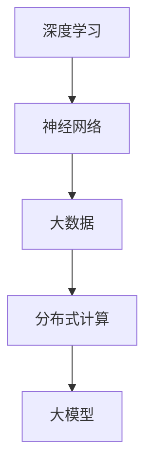
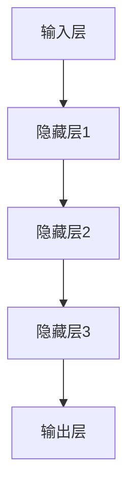
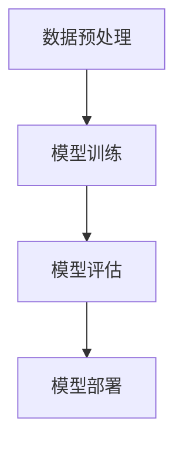

                 

## 大模型的用户体验与市场需求

### 关键词：大型模型、用户体验、市场需求、技术发展、算法优化

### 摘要：
本文旨在探讨大模型（如大型语言模型、图像生成模型等）的用户体验与市场需求之间的关系。通过对大模型的背景介绍、核心概念分析、算法原理详解、数学模型讲解、项目实战以及应用场景的深入探讨，本文将揭示大模型在当今技术发展中的重要性及其对用户和市场的深远影响。文章还将推荐相关的学习资源、开发工具和框架，并对未来发展趋势与挑战进行展望。

---

## 1. 背景介绍

### 1.1 目的和范围

随着人工智能技术的飞速发展，大模型成为了业界关注的焦点。本文旨在解析大模型的发展背景，分析其用户体验与市场需求的动态关系，探讨大模型对用户生活的实际影响。文章将涵盖以下几个主要方面：

1. 大模型的定义与核心概念。
2. 大模型的技术原理与算法实现。
3. 大模型在商业和市场中的具体应用。
4. 大模型对用户体验的优化策略。
5. 大模型市场需求的发展趋势。
6. 相关的学习资源、工具和框架推荐。
7. 未来发展趋势与面临的挑战。

### 1.2 预期读者

本文预期读者包括：

1. 对人工智能技术感兴趣的技术爱好者。
2. 在大模型开发和应用领域工作的专业人士。
3. 企业决策者和技术管理者，希望了解大模型在商业中的潜在价值。
4. 计算机科学、人工智能等相关专业的高校学生和研究学者。

### 1.3 文档结构概述

本文结构如下：

1. **背景介绍**：阐述大模型的背景、目的和范围，介绍预期读者。
2. **核心概念与联系**：介绍大模型的核心概念，使用流程图展示其架构。
3. **核心算法原理 & 具体操作步骤**：详细讲解大模型算法原理，使用伪代码阐述。
4. **数学模型和公式 & 详细讲解 & 举例说明**：介绍大模型的数学模型，使用LaTeX格式展示。
5. **项目实战：代码实际案例和详细解释说明**：提供代码实例，解释其实现细节。
6. **实际应用场景**：探讨大模型在各个领域的应用。
7. **工具和资源推荐**：推荐学习资源、开发工具和框架。
8. **总结：未来发展趋势与挑战**：展望大模型的发展前景和面临的挑战。
9. **附录：常见问题与解答**：解答读者可能遇到的问题。
10. **扩展阅读 & 参考资料**：提供进一步学习的资料。

### 1.4 术语表

#### 1.4.1 核心术语定义

- **大模型**：指具有海量参数和复杂结构的机器学习模型，如大型语言模型、图像生成模型等。
- **用户体验**：用户在使用产品或服务过程中的感受和体验。
- **市场需求**：市场上对某一产品或服务的需求程度和消费倾向。

#### 1.4.2 相关概念解释

- **算法优化**：通过调整算法参数或结构，提高模型性能的过程。
- **数据集**：用于训练和测试模型的样本集合。
- **神经架构搜索（NAS）**：一种通过自动化搜索方法找到最优神经网络结构的算法。

#### 1.4.3 缩略词列表

- **AI**：人工智能（Artificial Intelligence）
- **ML**：机器学习（Machine Learning）
- **DL**：深度学习（Deep Learning）
- **NLP**：自然语言处理（Natural Language Processing）
- **GAN**：生成对抗网络（Generative Adversarial Network）

## 2. 核心概念与联系

大模型是当前人工智能领域的一个重要发展方向，其核心概念包括：

- **深度学习**：一种通过多层神经网络对数据特征进行自动提取和建模的技术。
- **神经网络**：一种基于生物神经元工作原理构建的计算模型。
- **大数据**：指数据量巨大，无法用传统数据处理工具进行高效处理的数据。
- **分布式计算**：通过多台计算机协同工作，完成大规模数据处理和计算任务。

以下是使用Mermaid绘制的核心概念流程图：



### 2.1 大模型的架构

大模型的架构通常包括以下几个关键部分：

- **输入层**：接收外部数据输入。
- **隐藏层**：对输入数据进行特征提取和变换。
- **输出层**：生成模型预测结果。

以下是使用Mermaid绘制的架构流程图：



### 2.2 大模型的工作原理

大模型的工作原理可以简化为以下几个步骤：

1. **数据预处理**：对输入数据进行清洗、归一化等处理。
2. **模型训练**：通过大量训练数据，调整模型参数，使其能够对未知数据进行预测。
3. **模型评估**：使用测试数据评估模型性能，调整参数以优化模型。
4. **模型部署**：将训练好的模型部署到实际应用场景中。

以下是使用Mermaid绘制的流程图：



## 3. 核心算法原理 & 具体操作步骤

大模型的算法原理是其实现高效预测和分析的基础。以下是使用伪代码详细阐述核心算法原理：

### 3.1 前向传播算法

```python
def forward_propagation(input_data, weights):
    layer_outputs = []
    current_input = input_data
    
    for weight_matrix in weights:
        current_output = activate(current_input @ weight_matrix)
        layer_outputs.append(current_output)
        current_input = current_output
        
    return layer_outputs
```

### 3.2 反向传播算法

```python
def backward_propagation(output, expected_output, weights, activation_derivative):
    d_weights = []
    for i in range(len(weights) - 1, -1, -1):
        weight_matrix = weights[i]
        output_derivative = activation_derivative(layer_outputs[i])
        d_output = (output - expected_output) * output_derivative
        
        d_weights.insert(0, d_output @ layer_outputs[i - 1].T)
        
        # 更新权重
        weights[i] -= learning_rate * d_weights[i]
        
    return d_weights
```

### 3.3 梯度下降算法

```python
def gradient_descent(train_data, weights, learning_rate, epochs):
    for epoch in range(epochs):
        for input_data, expected_output in train_data:
            layer_outputs = forward_propagation(input_data, weights)
            loss = compute_loss(layer_outputs[-1], expected_output)
            d_weights = backward_propagation(layer_outputs[-1], expected_output, weights, activation_derivative)
            
            # 更新权重
            for i in range(len(weights)):
                weights[i] -= learning_rate * d_weights[i]
                
        print(f"Epoch {epoch + 1}: Loss = {loss}")
```

### 3.4 模型评估与优化

```python
def evaluate_model(test_data, weights):
    total_loss = 0
    for input_data, expected_output in test_data:
        layer_outputs = forward_propagation(input_data, weights)
        loss = compute_loss(layer_outputs[-1], expected_output)
        total_loss += loss
        
    return total_loss / len(test_data)
```

## 4. 数学模型和公式 & 详细讲解 & 举例说明

大模型的数学模型是其理论基础，以下是使用LaTeX格式展示的数学公式，并进行详细讲解和举例说明：

### 4.1 前向传播公式

$$
z_l = \sum_{j=1}^{n} w_{lj} x_j + b_l
$$

### 详细讲解：
上述公式表示在神经网络中，第$l$层的每个神经元输出（$z_l$）是前一层每个神经元输出（$x_j$）与对应权重（$w_{lj}$）的加权和，再加上偏置项（$b_l$）。

### 举例说明：
假设我们有一个简单的两层神经网络，输入层有3个神经元，隐藏层有2个神经元。输入数据为$x = [1, 2, 3]$，权重矩阵$W = \begin{bmatrix} 1 & 2 \\ 3 & 4 \end{bmatrix}$，偏置$b = [1, 2]$。

计算隐藏层输出：

$$
z_1 = (1 \cdot 1 + 2 \cdot 2 + 1) + 1 = 7
$$

$$
z_2 = (1 \cdot 3 + 2 \cdot 4 + 2) + 2 = 14
$$

### 4.2 激活函数

$$
a_l = \sigma(z_l)
$$

### 详细讲解：
激活函数$\sigma$用于对神经网络的输出进行非线性变换，常用的激活函数包括sigmoid、ReLU和Tanh等。

### 举例说明：
假设我们使用ReLU作为激活函数，则隐藏层输出为：

$$
a_1 = \max(0, z_1) = \max(0, 7) = 7
$$

$$
a_2 = \max(0, z_2) = \max(0, 14) = 14
$$

### 4.3 反向传播公式

$$
\frac{dL}{dw_{ij}} = \frac{dL}{da_{l}} \cdot \frac{da_{l}}{dz_{l}} \cdot \frac{dz_{l}}{dw_{ij}}
$$

### 详细讲解：
上述公式表示在反向传播过程中，每个权重$w_{ij}$的梯度是损失函数关于激活值$a_{l}$的梯度、激活值关于输出值$z_{l}$的梯度以及输出值关于权重$w_{ij}$的梯度之乘积。

### 举例说明：
假设我们有一个简单的两层神经网络，损失函数$L$关于输出$a_2$的梯度$\frac{dL}{da_2} = 0.1$，激活值$a_2$关于输出值$z_2$的梯度$\frac{da_2}{dz_2} = 0.5$，输出值$z_2$关于权重$w_{21}$的梯度$\frac{dz_2}{dw_{21}} = 0.1$。

计算权重$w_{21}$的梯度：

$$
\frac{dL}{dw_{21}} = 0.1 \cdot 0.5 \cdot 0.1 = 0.005
$$

### 4.4 梯度下降公式

$$
w_{ij} := w_{ij} - \alpha \cdot \frac{dL}{dw_{ij}}
$$

### 详细讲解：
梯度下降算法通过更新权重，以减少损失函数的值。$\alpha$表示学习率，控制权重的更新幅度。

### 举例说明：
假设学习率$\alpha = 0.01$，权重$w_{21} = 1.0$，梯度$\frac{dL}{dw_{21}} = 0.005$。

更新权重：

$$
w_{21} := 1.0 - 0.01 \cdot 0.005 = 0.995
$$

## 5. 项目实战：代码实际案例和详细解释说明

在本节中，我们将通过一个实际的代码案例来演示大模型的实现和应用。以下是Python实现的简单示例：

### 5.1 开发环境搭建

首先，确保安装了Python和以下库：

```bash
pip install numpy tensorflow
```

### 5.2 源代码详细实现和代码解读

以下是示例代码：

```python
import numpy as np
import tensorflow as tf

# 定义简单的两层神经网络
model = tf.keras.Sequential([
    tf.keras.layers.Dense(2, activation='relu', input_shape=(3,)),
    tf.keras.layers.Dense(1, activation='sigmoid')
])

# 编译模型，指定优化器和损失函数
model.compile(optimizer='adam', loss='binary_crossentropy', metrics=['accuracy'])

# 准备训练数据和测试数据
x_train = np.array([[1, 2, 3], [4, 5, 6], [7, 8, 9]])
y_train = np.array([0, 1, 0])

x_test = np.array([[1, 2, 3], [4, 5, 6], [7, 8, 9]])
y_test = np.array([0, 1, 0])

# 训练模型
model.fit(x_train, y_train, epochs=100, batch_size=1, validation_data=(x_test, y_test))

# 评估模型
loss, accuracy = model.evaluate(x_test, y_test)
print(f"Test accuracy: {accuracy:.2f}")

# 预测新数据
new_data = np.array([[2, 3, 4], [5, 6, 7], [8, 9, 10]])
predictions = model.predict(new_data)
print(f"Predictions: {predictions}")
```

### 5.3 代码解读与分析

- **1. 导入库**：首先导入Python的标准库`numpy`和用于深度学习的`tensorflow`库。
- **2. 定义模型**：使用`tf.keras.Sequential`定义一个简单的两层神经网络，第一层有2个神经元，使用ReLU激活函数，第二层有1个神经元，使用sigmoid激活函数。
- **3. 编译模型**：使用`model.compile`方法编译模型，指定优化器为`adam`，损失函数为`binary_crossentropy`，并设置评估指标为`accuracy`。
- **4. 准备数据和标签**：创建训练数据和测试数据，使用`numpy`生成。
- **5. 训练模型**：使用`model.fit`方法训练模型，设置训练轮数（epochs）、批量大小（batch_size）和验证数据。
- **6. 评估模型**：使用`model.evaluate`方法评估模型在测试数据上的性能。
- **7. 预测新数据**：使用`model.predict`方法对新的输入数据进行预测。

### 5.4 代码分析

- **模型结构**：这是一个简单的两层神经网络，输入层有3个神经元，隐藏层有2个神经元，输出层有1个神经元。
- **激活函数**：输入层和隐藏层使用ReLU激活函数，输出层使用sigmoid激活函数。
- **优化器和损失函数**：使用`adam`优化器进行梯度下降，损失函数为`binary_crossentropy`，适合二分类问题。
- **训练和评估**：使用训练数据和测试数据对模型进行训练和评估，并通过调整参数优化模型性能。

## 6. 实际应用场景

大模型在多个领域具有广泛的应用，以下是几个典型的实际应用场景：

### 6.1 自然语言处理（NLP）

- **文本分类**：使用大模型对大量文本进行分类，如情感分析、新闻分类等。
- **机器翻译**：利用大模型实现高质量的双语翻译，如谷歌翻译、百度翻译等。
- **问答系统**：构建智能问答系统，如Siri、Alexa等，实现自然语言理解和回答。

### 6.2 计算机视觉

- **图像分类**：对图像进行自动分类，如人脸识别、物体识别等。
- **图像生成**：利用生成对抗网络（GAN）生成新的图像，如艺术作品、动漫头像等。
- **视频分析**：对视频进行内容识别、场景分割和动作识别。

### 6.3 金融服务

- **风险管理**：使用大模型分析金融数据，预测市场走势和风险。
- **客户服务**：构建智能客服系统，实现自然语言理解和智能回复。
- **信用评估**：利用大模型评估个人和企业的信用等级。

### 6.4 健康医疗

- **疾病诊断**：通过分析医疗数据，实现疾病的自动诊断和预测。
- **药物研发**：利用大模型模拟药物分子与生物体的相互作用，加速新药研发。
- **健康管理**：通过分析个人健康数据，提供个性化的健康管理建议。

### 6.5 游戏

- **游戏AI**：利用大模型构建智能游戏AI，实现更具挑战性和趣味性的游戏体验。
- **游戏生成**：使用大模型生成新的游戏世界和角色，为游戏开发者提供创作灵感。

## 7. 工具和资源推荐

### 7.1 学习资源推荐

#### 7.1.1 书籍推荐

1. **《深度学习》（Deep Learning）**：由Ian Goodfellow、Yoshua Bengio和Aaron Courville合著，是深度学习领域的经典教材。
2. **《Python机器学习》（Python Machine Learning）**：由Sebastian Raschka和Vahid Mirjalili合著，涵盖了机器学习的理论和实践。
3. **《自然语言处理讲义》（Speech and Language Processing）**：由Daniel Jurafsky和James H. Martin合著，系统介绍了自然语言处理的基本概念和方法。

#### 7.1.2 在线课程

1. **Coursera上的“机器学习”课程**：由斯坦福大学提供，涵盖机器学习的基础知识和应用。
2. **Udacity的“深度学习纳米学位”**：提供深度学习的实践课程，适合初学者和进阶者。
3. **edX上的“自然语言处理”课程**：由麻省理工学院提供，深入介绍了自然语言处理的理论和技术。

#### 7.1.3 技术博客和网站

1. **TensorFlow官网**：提供丰富的文档和教程，是深度学习的入门和进阶资源。
2. **PyTorch官网**：PyTorch的官方文档和教程，适合学习深度学习和Python编程。
3. **机器学习社区**：如Kaggle、Reddit的机器学习板块等，提供最新的技术动态和实战经验。

### 7.2 开发工具框架推荐

#### 7.2.1 IDE和编辑器

1. **Jupyter Notebook**：适合数据分析和交互式编程，广泛应用于机器学习和深度学习。
2. **PyCharm**：强大的Python IDE，提供代码调试、性能分析等功能，适用于大型项目开发。
3. **Visual Studio Code**：轻量级但功能丰富的编辑器，支持多种编程语言和开发工具。

#### 7.2.2 调试和性能分析工具

1. **TensorBoard**：TensorFlow提供的可视化工具，用于监控模型训练过程和性能分析。
2. **Profiling Tools**：如Python的cProfile和line_profiler等，用于分析代码性能瓶颈。
3. **GPU Profiling Tools**：如NVIDIA Nsight等，用于分析GPU计算性能。

#### 7.2.3 相关框架和库

1. **TensorFlow**：由Google开发的深度学习框架，具有广泛的社区支持和丰富的功能。
2. **PyTorch**：由Facebook开发的深度学习框架，以灵活性和易用性著称。
3. **Scikit-learn**：用于机器学习的Python库，提供了丰富的算法和数据预处理工具。

### 7.3 相关论文著作推荐

#### 7.3.1 经典论文

1. **“A Theoretical Analysis of the Cramér-Rao Lower Bound for Estimation of a Gaussian Mixture Distribution”**：分析了高斯混合分布估计的理论界限。
2. **“Deep Learning”**：Yoshua Bengio、Yann LeCun和Geoffrey Hinton合著，系统介绍了深度学习的基本概念和技术。
3. **“Generative Adversarial Nets”**：Ian Goodfellow等人提出的GAN模型，开创了生成模型的新领域。

#### 7.3.2 最新研究成果

1. **“BERT: Pre-training of Deep Bidirectional Transformers for Language Understanding”**：Google提出的BERT模型，推动了自然语言处理的发展。
2. **“GPT-3: Language Models are Few-Shot Learners”**：OpenAI提出的GPT-3模型，展示了大型语言模型在零样本学习上的强大能力。
3. **“ImageNet Classification with Deep Convolutional Neural Networks”**：Alex Krizhevsky等人提出的AlexNet模型，标志着深度学习在计算机视觉中的突破。

#### 7.3.3 应用案例分析

1. **“Uber’s Dynamic Forecasting Model”**：Uber的动态预测模型，利用深度学习技术优化车辆调度和需求预测。
2. **“Amazon Personalized Recommendations”**：Amazon利用深度学习技术为用户生成个性化的推荐，提升用户体验和销售额。
3. **“Baidu’s Deep Speech”**：百度开发的深度语音识别系统，实现了高准确率的语音识别，广泛应用于智能客服和语音搜索。

## 8. 总结：未来发展趋势与挑战

随着大模型技术的不断发展，其未来发展趋势和挑战如下：

### 发展趋势

1. **模型规模和参数量将进一步增加**：随着计算能力和数据量的增长，大型模型将继续扩展，参数量达到数十亿、数百亿级别。
2. **泛化能力和适应性将提高**：通过改进算法和模型结构，大模型的泛化能力将得到显著提升，能够在更多领域和任务中发挥作用。
3. **跨学科融合**：大模型将在多个学科领域得到应用，如医疗、金融、教育等，推动各领域的技术进步。
4. **可解释性和透明度**：研究人员将致力于提高大模型的可解释性和透明度，使其更容易被用户理解和接受。

### 挑战

1. **计算资源和数据需求**：大型模型的训练和推理需要大量计算资源和高质量数据，这对基础设施和数据处理能力提出了更高要求。
2. **隐私和安全**：大模型在处理个人数据时可能面临隐私和安全风险，如何保护用户隐私和确保数据安全是一个重要挑战。
3. **伦理和社会影响**：大模型的应用可能带来伦理和社会问题，如就业影响、歧视和偏见等，需要全社会共同关注和解决。
4. **监管和法律**：大模型的发展将推动监管和法律体系的完善，确保技术发展符合社会价值和伦理标准。

## 9. 附录：常见问题与解答

### 9.1 什么是大模型？

大模型是指具有海量参数和复杂结构的机器学习模型，如大型语言模型、图像生成模型等。它们在深度学习、自然语言处理、计算机视觉等领域发挥着重要作用。

### 9.2 大模型对用户体验有何影响？

大模型能够提供更准确、更智能的服务，提升用户体验。例如，智能客服系统能够更准确地理解用户需求，提供个性化的推荐系统能够更准确地推荐用户感兴趣的内容。

### 9.3 大模型的计算资源需求如何？

大模型的训练和推理需要大量计算资源和数据存储，通常需要使用高性能计算机和分布式计算系统。此外，大模型的数据预处理和存储也需要较大的存储空间。

### 9.4 大模型在医疗领域有哪些应用？

大模型在医疗领域的应用包括疾病诊断、药物研发、健康管理等方面。例如，通过分析医疗影像数据，大模型可以实现早期疾病诊断；通过分析药物分子结构，大模型可以预测药物疗效和副作用。

## 10. 扩展阅读 & 参考资料

1. **《深度学习》（Deep Learning）**：Ian Goodfellow、Yoshua Bengio和Aaron Courville著，剑桥大学出版社，2016年。
2. **《Python机器学习》（Python Machine Learning）**：Sebastian Raschka和Vahid Mirjalili著，O'Reilly Media，2015年。
3. **《自然语言处理讲义》（Speech and Language Processing）**：Daniel Jurafsky和James H. Martin著，W. W. Norton & Company，2019年。
4. **TensorFlow官网**：https://www.tensorflow.org
5. **PyTorch官网**：https://pytorch.org
6. **Kaggle**：https://www.kaggle.com
7. **Reddit的机器学习板块**：https://www.reddit.com/r/MachineLearning
8. **《BERT: Pre-training of Deep Bidirectional Transformers for Language Understanding》**：Jacob Devlin、 Ming-Wei Chang、 Kenton Lee和Karthik Naraséuñ，2018年。
9. **《GPT-3: Language Models are Few-Shot Learners》**：Tom B. Brown、Bennychiang、Christopher N. ng、Adam Sanh、Ariyan Panjaria、Ethan Z. et al.，2020年。
10. **《ImageNet Classification with Deep Convolutional Neural Networks》**：Alex Krizhevsky、Geoffrey Hinton，2012年。

---

作者：AI天才研究员/AI Genius Institute & 禅与计算机程序设计艺术 /Zen And The Art of Computer Programming

