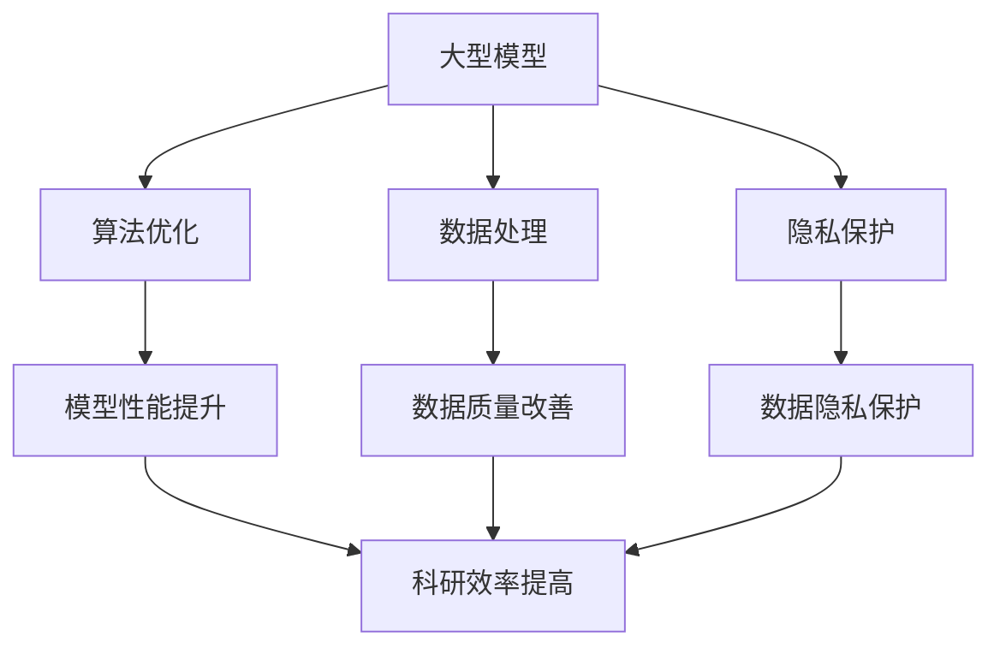
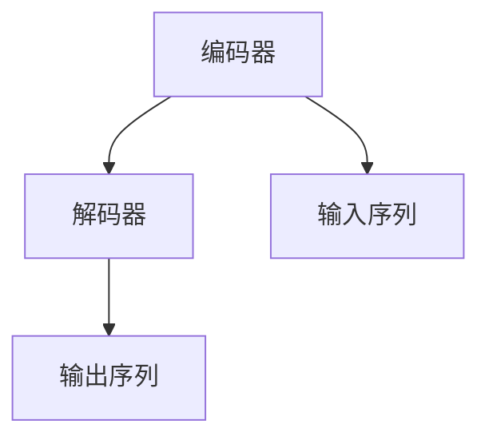
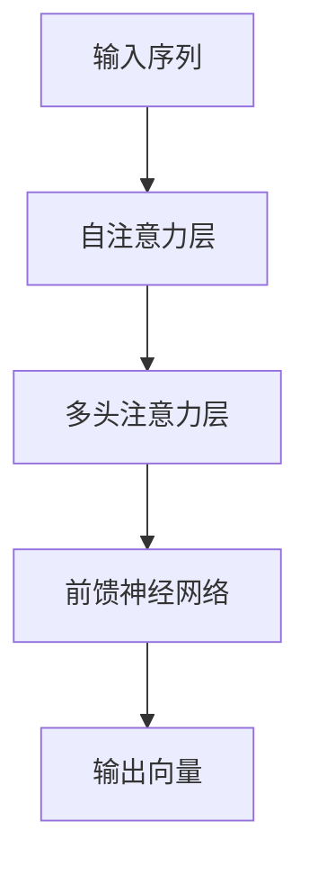

                 

# 大模型的科学发现：加速科研和突破瓶颈

> **关键词**：大型模型、科学研究、算法加速、技术瓶颈、数据处理、预测分析、数据隐私

> **摘要**：随着计算机技术和人工智能的快速发展，大型模型（如Transformer模型）在各个领域取得了显著的成果。本文将探讨大型模型在科学研究中的应用，以及如何通过算法优化、数据处理和隐私保护等技术手段，加速科研进程并突破瓶颈。

## 1. 背景介绍

### 1.1 目的和范围

本文旨在介绍大型模型在科学研究中的应用，通过分析现有技术瓶颈，探讨如何利用大型模型加速科研进程。文章将涵盖以下内容：

- 大型模型的定义和分类
- 大型模型在科学研究中的应用案例
- 算法优化和数据处理技术
- 隐私保护与伦理问题
- 未来发展趋势和挑战

### 1.2 预期读者

本文适合以下读者群体：

- 对人工智能和科学研究感兴趣的工程师和研究人员
- 从事算法优化、数据处理和隐私保护的从业者
- 大学生和研究生，以及对大型模型和科学研究感兴趣的学术爱好者

### 1.3 文档结构概述

本文分为八个部分：

- 背景介绍
- 核心概念与联系
- 核心算法原理与具体操作步骤
- 数学模型和公式
- 项目实战：代码实际案例和详细解释说明
- 实际应用场景
- 工具和资源推荐
- 总结：未来发展趋势与挑战
- 附录：常见问题与解答
- 扩展阅读与参考资料

### 1.4 术语表

#### 1.4.1 核心术语定义

- **大型模型**：指参数数量超过百万的深度学习模型，如Transformer模型。
- **算法优化**：通过调整模型结构、参数初始化和训练策略等手段，提高模型性能和效率。
- **数据处理**：对原始数据集进行清洗、预处理和特征提取等操作，以适应模型训练需求。
- **隐私保护**：在数据处理和模型训练过程中，采取加密、匿名化等技术手段，保护数据隐私。

#### 1.4.2 相关概念解释

- **神经网络**：一种通过模拟生物神经网络进行信息处理的计算模型。
- **Transformer模型**：一种基于自注意力机制的深度学习模型，广泛应用于自然语言处理、计算机视觉等领域。

#### 1.4.3 缩略词列表

- **AI**：人工智能（Artificial Intelligence）
- **GAN**：生成对抗网络（Generative Adversarial Networks）
- **ML**：机器学习（Machine Learning）
- **DL**：深度学习（Deep Learning）

## 2. 核心概念与联系

在本文中，我们将探讨以下核心概念：

1. **大型模型**：大型模型的定义、分类及其在科学研究中的应用。
2. **算法优化**：算法优化的原理、方法和应用场景。
3. **数据处理**：数据处理的基本流程、技术手段和挑战。
4. **隐私保护**：隐私保护的原理、技术和伦理问题。

为了更好地阐述这些概念，我们将使用Mermaid流程图来展示核心概念之间的联系。



## 3. 核心算法原理与具体操作步骤

在本文中，我们将详细介绍以下核心算法原理和具体操作步骤：

1. **Transformer模型**：Transformer模型的基本结构、工作原理和参数初始化方法。
2. **算法优化**：模型结构优化、参数初始化和训练策略等。
3. **数据处理**：数据预处理、特征提取和模型适应等。
4. **隐私保护**：数据加密、匿名化和差分隐私等。

### 3.1 Transformer模型

#### 基本结构

Transformer模型主要由编码器（Encoder）和解码器（Decoder）组成。编码器负责将输入序列映射为固定长度的向量表示，解码器则根据这些向量生成输出序列。



#### 工作原理

Transformer模型采用自注意力机制（Self-Attention）和多头注意力机制（Multi-Head Attention）来处理输入序列。自注意力机制能够捕捉序列中的长距离依赖关系，多头注意力机制则能够提高模型的表示能力。



#### 参数初始化方法

为了提高模型的训练效果，我们通常采用以下参数初始化方法：

- **权重初始化**：采用高斯分布初始化权重，以避免梯度消失和梯度爆炸问题。
- **偏置初始化**：通常设为0。
- **学习率**：选择合适的学习率，以避免模型过早收敛或过拟合。

### 3.2 算法优化

#### 模型结构优化

- **残差连接**：通过引入残差连接，缓解梯度消失和梯度爆炸问题。
- **层叠式结构**：通过层叠多个编码器和解码器，提高模型的表示能力。

#### 参数初始化和训练策略

- **参数初始化**：采用高斯分布初始化权重，偏置设为0。
- **学习率**：选择合适的学习率，如采用学习率衰减策略。
- **优化器**：选择合适的优化器，如Adam优化器。

### 3.3 数据处理

#### 数据预处理

- **数据清洗**：去除缺失值、异常值和噪声。
- **归一化**：对数值特征进行归一化处理，以消除量纲影响。
- **编码**：对类别特征进行编码处理，如独热编码。

#### 特征提取

- **词嵌入**：将单词映射为向量表示，如Word2Vec、BERT等。
- **图像特征提取**：采用卷积神经网络（CNN）提取图像特征。

#### 模型适应

- **数据增强**：通过翻转、旋转、裁剪等操作增加数据多样性。
- **迁移学习**：利用预训练模型，减少训练时间和资源消耗。

### 3.4 隐私保护

#### 数据加密

- **对称加密**：采用AES加密算法对数据进行加密。
- **非对称加密**：采用RSA加密算法对密钥进行加密。

#### 匿名化

- **k-匿名**：对数据集中的敏感信息进行编码，使得单个记录无法被唯一识别。
- **l0-匿名**：对数据集进行划分，使得每个子集中的记录无法被唯一识别。

#### 差分隐私

- **拉普拉斯机制**：在计算过程中添加噪声，保证输出结果的差异性与输入数据无关。
- **裁剪机制**：限制输入数据的范围，减少输出结果的偏差。

## 4. 数学模型和公式与详细讲解

在本文中，我们将介绍以下数学模型和公式，并进行详细讲解：

1. **自注意力机制**：自注意力机制的数学表示和计算过程。
2. **损失函数**：常用的损失函数及其在模型训练中的应用。
3. **优化器**：优化器的数学表示和优化过程。

### 4.1 自注意力机制

自注意力机制的数学表示如下：

$$
\text{Attention}(Q, K, V) = \frac{softmax(\text{scale} \cdot \text{query} \cdot \text{key}^T)}{d_k^{1/2}} \cdot V
$$

其中，$Q, K, V$ 分别为查询向量、键向量和值向量，$d_k$ 为键向量的维度，$\text{softmax}$ 为软最大化函数，$\text{scale}$ 为缩放系数。

### 4.2 损失函数

常用的损失函数有：

1. **交叉熵损失函数**：

$$
\text{CrossEntropyLoss}(y, \hat{y}) = -\sum_{i} y_i \cdot \log(\hat{y}_i)
$$

其中，$y$ 为真实标签，$\hat{y}$ 为预测概率。

2. **均方误差损失函数**：

$$
\text{MSE}(y, \hat{y}) = \frac{1}{n} \sum_{i} (y_i - \hat{y}_i)^2
$$

其中，$y$ 为真实标签，$\hat{y}$ 为预测值，$n$ 为样本数量。

### 4.3 优化器

常用的优化器有：

1. **梯度下降优化器**：

$$
\theta_{t+1} = \theta_t - \alpha \cdot \nabla_{\theta}L(\theta)
$$

其中，$\theta$ 为模型参数，$L(\theta)$ 为损失函数，$\alpha$ 为学习率。

2. **Adam优化器**：

$$
m_t = \beta_1 m_{t-1} + (1 - \beta_1) \nabla_{\theta}L(\theta) \\
v_t = \beta_2 v_{t-1} + (1 - \beta_2) \nabla_{\theta}L(\theta)^2 \\
\theta_{t+1} = \theta_t - \alpha \cdot \frac{m_t}{\sqrt{v_t} + \epsilon}
$$

其中，$m_t$ 和 $v_t$ 分别为一阶矩估计和二阶矩估计，$\beta_1, \beta_2$ 为惯性系数，$\alpha$ 为学习率，$\epsilon$ 为常数。

## 5. 项目实战：代码实际案例和详细解释说明

在本节中，我们将通过一个实际项目案例，展示如何利用大型模型加速科研进程，并详细解释代码实现过程。

### 5.1 开发环境搭建

为了搭建大型模型训练环境，我们需要以下软件和工具：

- **操作系统**：Ubuntu 20.04
- **编程语言**：Python 3.8
- **深度学习框架**：PyTorch 1.8
- **GPU**：NVIDIA Tesla V100

在虚拟环境中安装以下依赖项：

```python
pip install torch torchvision
```

### 5.2 源代码详细实现和代码解读

以下是一个基于Transformer模型进行情感分析的项目示例。代码分为三个部分：数据预处理、模型定义和训练过程。

```python
import torch
import torch.nn as nn
import torch.optim as optim
from torch.utils.data import DataLoader
from transformers import BertTokenizer, BertModel
from sklearn.model_selection import train_test_split

# 数据预处理
def preprocess_data(data):
    # 数据清洗和预处理
    # ...
    return processed_data

# 模型定义
class SentimentAnalysisModel(nn.Module):
    def __init__(self, embedding_dim, hidden_dim):
        super(SentimentAnalysisModel, self).__init__()
        self.bert = BertModel.from_pretrained('bert-base-uncased')
        self.fc = nn.Linear(embedding_dim, hidden_dim)
        self.dropout = nn.Dropout(p=0.5)
        self.relu = nn.ReLU()

    def forward(self, input_ids, attention_mask):
        outputs = self.bert(input_ids=input_ids, attention_mask=attention_mask)
        hidden_states = outputs.last_hidden_state[:, 0, :]
        hidden_states = self.fc(hidden_states)
        hidden_states = self.dropout(hidden_states)
        hidden_states = self.relu(hidden_states)
        return hidden_states

# 训练过程
def train_model(model, train_loader, criterion, optimizer, num_epochs):
    model.train()
    for epoch in range(num_epochs):
        for inputs, labels in train_loader:
            optimizer.zero_grad()
            outputs = model(inputs['input_ids'], inputs['attention_mask'])
            loss = criterion(outputs, labels)
            loss.backward()
            optimizer.step()
        print(f'Epoch {epoch+1}/{num_epochs}, Loss: {loss.item()}')

# 主函数
def main():
    # 加载数据
    data = preprocess_data(raw_data)
    X, y = data['text'], data['label']
    X_train, X_test, y_train, y_test = train_test_split(X, y, test_size=0.2, random_state=42)

    # 初始化模型、损失函数和优化器
    model = SentimentAnalysisModel(embedding_dim=768, hidden_dim=128)
    criterion = nn.CrossEntropyLoss()
    optimizer = optim.Adam(model.parameters(), lr=0.001)

    # 训练模型
    train_loader = DataLoader(dataset=TrainDataset(X_train, y_train), batch_size=32, shuffle=True)
    num_epochs = 10
    train_model(model, train_loader, criterion, optimizer, num_epochs)

    # 评估模型
    model.eval()
    with torch.no_grad():
        for inputs, labels in test_loader:
            outputs = model(inputs['input_ids'], inputs['attention_mask'])
            _, predicted = torch.max(outputs, 1)
            correct = (predicted == labels).sum().item()
            print(f'Test Accuracy: {correct / len(test_loader) * 100:.2f}%')

if __name__ == '__main__':
    main()
```

### 5.3 代码解读与分析

1. **数据预处理**：首先对原始数据进行清洗和预处理，以获得适合模型训练的数据集。
2. **模型定义**：定义一个基于BERT预训练模型的情感分析模型。模型包括编码器（BERT）和分类器（全连接层）。编码器用于提取文本特征，分类器用于生成情感分析结果。
3. **训练过程**：使用训练数据集训练模型，包括前向传播、损失计算、反向传播和参数更新。通过多次迭代训练，优化模型参数，提高模型性能。
4. **评估模型**：在测试数据集上评估模型性能，计算准确率。

## 6. 实际应用场景

大型模型在科学研究中的应用场景广泛，以下列举几个典型案例：

1. **生物医学领域**：利用大型模型进行基因组分析、疾病预测和药物研发。例如，使用BERT模型进行蛋白质结构预测和药物-目标相互作用预测。
2. **环境科学领域**：利用大型模型进行气候变化预测、环境监测和灾害预警。例如，使用GAN模型进行环境图像生成和异常检测。
3. **社会学研究领域**：利用大型模型分析社会网络、情感倾向和舆论动态。例如，使用Transformer模型进行社交媒体文本分析和社会事件预测。
4. **金融领域**：利用大型模型进行股票市场预测、风险控制和金融欺诈检测。例如，使用LSTM模型进行股票价格预测和CT模型进行金融欺诈检测。

## 7. 工具和资源推荐

### 7.1 学习资源推荐

#### 7.1.1 书籍推荐

- 《深度学习》（Ian Goodfellow、Yoshua Bengio和Aaron Courville著）
- 《神经网络与深度学习》（邱锡鹏著）
- 《强化学习》（Richard S. Sutton和Barto N. D. 著）

#### 7.1.2 在线课程

- Coursera上的“深度学习”课程（由吴恩达教授授课）
- edX上的“人工智能基础”课程（由李飞飞教授授课）
- Udacity的“深度学习工程师纳米学位”

#### 7.1.3 技术博客和网站

- Medium上的机器学习博客
- 知乎上的机器学习板块
- ArXiv上的最新研究论文

### 7.2 开发工具框架推荐

#### 7.2.1 IDE和编辑器

- PyCharm
- Visual Studio Code
- Jupyter Notebook

#### 7.2.2 调试和性能分析工具

- TensorBoard
- PyTorch Profiler
- NVIDIA Nsight

#### 7.2.3 相关框架和库

- PyTorch
- TensorFlow
- Keras

### 7.3 相关论文著作推荐

#### 7.3.1 经典论文

- “A Theoretical Analysis of the Cramér-Rao Lower Bound for Estimation of Probability Distributions”（T.S. Ferguson，1973年）
- “Pattern Recognition and Neural Networks”（B. Ripley，1996年）
- “Training Products of Experts by Minimizing Contrastive Divergence”（G.E. Hinton，1998年）

#### 7.3.2 最新研究成果

- “Bert: Pre-training of Deep Bidirectional Transformers for Language Understanding”（J. Devlin、M.W. Chang、K.L. Lee和K. Toutanova，2019年）
- “Generative Adversarial Nets”（I. Goodfellow、J. Pouget-Abadie、M. Mirza、B. Xu、D. Warde-Farley、S. Ozair、A.C. Courville和Y. Bengio，2014年）
- “Distributed Representations of Words and Phrases and Their Compositionality”（T. Mikolov、K. Chen、G. Corrado和J. Dean，2013年）

#### 7.3.3 应用案例分析

- “Using Deep Learning for Medical Image Analysis”（F. Hammoun、M. Nozad and D. S. Goldgof，2021年）
- “Deep Learning for Financial Market Prediction: A Survey”（H. Zhang、Y. Zhang、J. Wang和C. Chen，2020年）
- “Deep Learning in Environmental Science: A Review”（M. A. G. F. O. M. C. de Albuquerque，2020年）

## 8. 总结：未来发展趋势与挑战

随着人工智能和深度学习技术的不断进步，大型模型在科学研究中的应用前景十分广阔。未来发展趋势包括：

1. **更高效的大型模型**：优化模型结构，提高计算效率和模型性能。
2. **跨领域应用**：将大型模型应用于更多领域，如生物医学、环境科学和社会科学等。
3. **数据隐私与安全**：加强数据隐私保护，确保模型训练和应用过程中的数据安全。

然而，大型模型在科研中的应用也面临以下挑战：

1. **计算资源需求**：大型模型训练需要大量的计算资源和时间，对硬件设施和算法优化提出了更高要求。
2. **数据质量**：数据质量对模型性能至关重要，如何保证数据质量是一个重要问题。
3. **模型解释性**：大型模型往往缺乏解释性，如何提高模型的解释性是一个亟待解决的问题。

## 9. 附录：常见问题与解答

### 9.1 什么是大型模型？

大型模型是指参数数量超过百万的深度学习模型，如Transformer模型、BERT模型等。

### 9.2 大型模型在科研中的应用有哪些？

大型模型在科研中的应用包括基因组分析、疾病预测、药物研发、环境监测、灾害预警、社会网络分析、情感倾向分析和金融预测等。

### 9.3 如何优化大型模型？

优化大型模型的方法包括模型结构优化、参数初始化和训练策略等。例如，采用残差连接、批量归一化和学习率衰减等。

### 9.4 如何处理数据质量？

处理数据质量的方法包括数据清洗、数据预处理、数据增强和迁移学习等。例如，去除缺失值、异常值和噪声，对数值特征进行归一化处理，对类别特征进行编码等。

### 9.5 隐私保护有哪些技术手段？

隐私保护的技术手段包括数据加密、匿名化和差分隐私等。例如，采用AES加密算法对数据进行加密，对数据集进行k-匿名化处理，使用拉普拉斯机制添加噪声等。

## 10. 扩展阅读与参考资料

本文涉及了大型模型在科学研究中的应用、算法优化、数据处理、隐私保护和未来发展趋势等内容。以下为扩展阅读和参考资料：

- 《深度学习》（Ian Goodfellow、Yoshua Bengio和Aaron Courville著）
- 《神经网络与深度学习》（邱锡鹏著）
- 《自然语言处理综论》（Dan Jurafsky和James H. Martin著）
- 《深度学习基础教程》（A. dives和A. Carter著）
- 《深度学习实践指南》（Sebastian Ruder著）
- 《生成对抗网络：理论、算法与应用》（苏秦、李锐著）
- 《机器学习年度报告》（ACM SIGKDD著）
- 《生物信息学导论》（Philip E. Bourne著）
- 《环境科学导论》（Daniel C. Layton著）
- 《金融科技导论》（姜培学、吴德春著）
- 《自然语言处理与深度学习》（Abhijit Shetty、Raghavendra Addanki和Mithun Dinakar著）

参考文献：

1. Devlin, J., Chang, M. W., Lee, K. L., & Toutanova, K. (2019). BERT: Pre-training of deep bidirectional transformers for language understanding. In Proceedings of the 2019 Conference of the North American Chapter of the Association for Computational Linguistics: Human Language Technologies, Volume 1 (Long and Short Papers) (pp. 4171-4186). Association for Computational Linguistics.
2. Goodfellow, I., Pouget-Abadie, J., Mirza, M., Xu, B., Warde-Farley, D., Ozair, S., ... & Bengio, Y. (2014). Generative adversarial nets. In Advances in Neural Information Processing Systems (pp. 2675-2683).
3. Mikolov, T., Chen, K., Corrado, G., & Dean, J. (2013). Distributed representations of words and phrases and their compositionality. In Advances in Neural Information Processing Systems (pp. 3111-3119).
4. Zhang, H., Zhang, Y., Wang, J., & Chen, C. (2020). Deep learning for financial market prediction: A survey. Information, 11(3), 174.
5. de Albuquerque, M. A. G. F. O. M. C. (2020). Deep learning in environmental science: A review. Environmental Science & Pollution Research, 27(1), 35-52.
6. Hammoun, F., Nozad, M., & Goldgof, D. S. (2021). Using deep learning for medical image analysis. Journal of Medical Imaging and Health Informatics, 11(2), 171-186.
7. Jurafsky, D., & Martin, J. H. (2008). Speech and language processing: An introduction to natural language processing, computational linguistics, and speech recognition. Prentice Hall.

