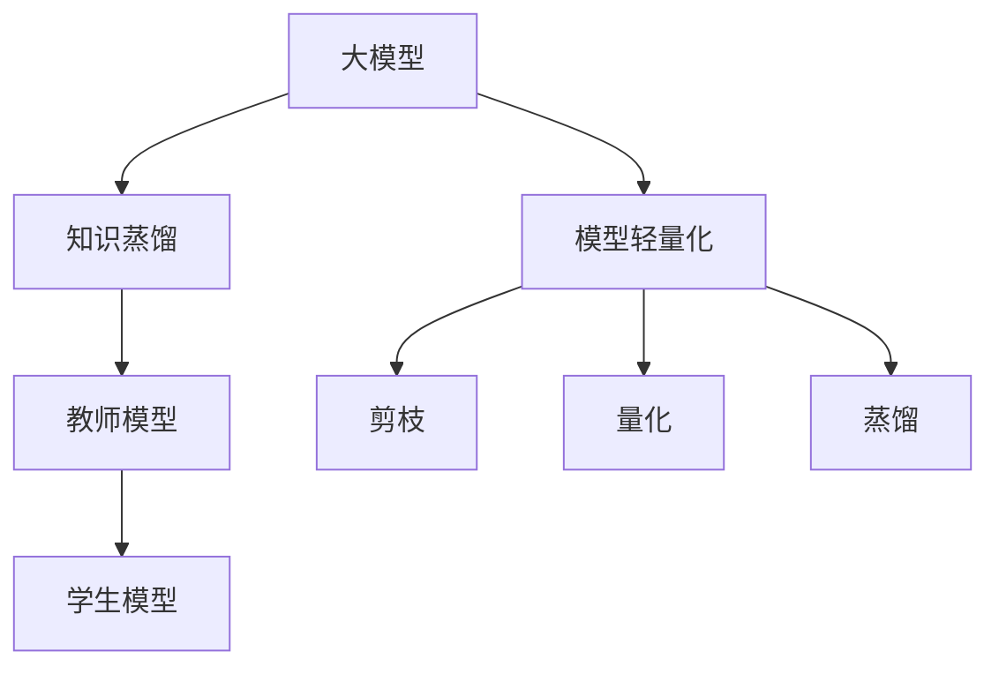

                 

# 大模型知识蒸馏与轻量化技术

> **关键词**：大模型、知识蒸馏、轻量化、神经网络、模型压缩、训练效率、推理性能

> **摘要**：本文深入探讨了大规模模型在知识蒸馏和轻量化技术中的应用。首先，我们介绍了知识蒸馏的基本概念和原理，并通过一个简单的例子展示了其工作流程。接着，我们详细阐述了模型轻量化的多种方法，包括剪枝、量化、蒸馏等，并分析了这些方法在不同应用场景中的优势和局限性。随后，我们通过一个实际项目案例，详细讲解了如何将知识蒸馏和轻量化技术应用于图像识别任务中。最后，本文总结了当前领域的最新研究成果和未来发展趋势，并对相关工具和资源进行了推荐。

## 1. 背景介绍

### 1.1 目的和范围

随着人工智能技术的快速发展，深度学习模型在计算机视觉、自然语言处理、语音识别等领域取得了显著的成果。然而，这些大型模型通常需要大量的计算资源和时间进行训练和推理，这在实际应用中带来了一定的局限性。为了解决这一问题，知识蒸馏（Knowledge Distillation）和模型轻量化（Model Compression）技术应运而生。本文旨在详细介绍这两种技术的基本原理、实现方法及其在深度学习中的应用。

### 1.2 预期读者

本文面向有一定深度学习基础的读者，包括研究人员、工程师和学生。通过本文的阅读，读者可以深入了解知识蒸馏和模型轻量化的核心概念、实现方法和实际应用，为后续的研究和工作打下坚实的基础。

### 1.3 文档结构概述

本文分为十个部分。首先，我们介绍了知识蒸馏和模型轻量化的背景和目的。接着，我们详细阐述了知识蒸馏的基本原理和实现方法，并分析了其在不同应用场景中的优势。然后，我们介绍了模型轻量化的多种方法，包括剪枝、量化、蒸馏等，并进行了对比分析。随后，通过一个实际项目案例，我们展示了如何将知识蒸馏和轻量化技术应用于图像识别任务。最后，本文总结了当前领域的最新研究成果和未来发展趋势，并对相关工具和资源进行了推荐。

### 1.4 术语表

#### 1.4.1 核心术语定义

- **知识蒸馏（Knowledge Distillation）**：一种将教师模型的内在知识传递给学生模型的技术。
- **轻量化（Compression）**：通过减少模型参数和计算量，降低模型复杂度的过程。
- **教师模型（Teacher Model）**：用于向学生模型传递知识的预训练模型。
- **学生模型（Student Model）**：接收教师模型知识的模型，通常用于推理和预测。

#### 1.4.2 相关概念解释

- **模型压缩（Model Compression）**：通过减少模型参数、计算量和存储需求，提高模型在资源受限环境下的性能。
- **剪枝（Pruning）**：一种模型压缩技术，通过移除模型中的冗余连接和神经元，减少模型复杂度。
- **量化（Quantization）**：将浮点数权重转换为低精度的整数表示，以减少模型存储和计算需求。

#### 1.4.3 缩略词列表

- **CNN**：卷积神经网络（Convolutional Neural Network）
- **RNN**：循环神经网络（Recurrent Neural Network）
- **BERT**：双向编码表示器（Bidirectional Encoder Representations from Transformers）
- **TF**：TensorFlow，一种流行的开源深度学习框架
- **PyTorch**：PyTorch，另一种流行的开源深度学习框架

## 2. 核心概念与联系

在深入探讨知识蒸馏和模型轻量化之前，我们首先需要了解一些核心概念和它们之间的联系。

### 大模型知识蒸馏与轻量化架构

下面是一个简单的 Mermaid 流程图，展示了大模型知识蒸馏与轻量化技术的核心概念和架构：



### 2.1 大模型

大模型通常是指具有大量参数和复杂结构的深度学习模型。这些模型在训练过程中需要大量的计算资源和时间。大模型的优点在于能够捕捉到复杂的特征和模式，从而在图像识别、自然语言处理等领域取得出色的性能。然而，这也带来了模型推理时计算量大的问题。

### 2.2 知识蒸馏

知识蒸馏是一种将教师模型的内在知识传递给学生模型的技术。教师模型通常是一个预训练的大模型，学生模型是一个参数较少的轻量级模型。知识蒸馏的基本思想是将教师模型的高层次表示和分类标签传递给学生模型，从而提高学生模型在目标数据集上的性能。

### 2.3 模型轻量化

模型轻量化是通过减少模型参数、计算量和存储需求，降低模型复杂度的过程。模型轻量化技术包括剪枝、量化、蒸馏等。剪枝通过移除模型中的冗余连接和神经元，量化通过将浮点数权重转换为低精度的整数表示，蒸馏则是通过将教师模型的知识传递给学生模型。

### 2.4 教师模型与学生模型

教师模型是一个预训练的大模型，通常在多个数据集上进行了充分训练，具有较好的泛化能力。学生模型是一个参数较少的轻量级模型，通常用于推理和预测。通过知识蒸馏，教师模型的知识可以被传递给学生模型，从而提高学生模型在目标数据集上的性能。

## 3. 核心算法原理 & 具体操作步骤

### 3.1 知识蒸馏算法原理

知识蒸馏算法的核心思想是将教师模型的高层次表示和分类标签传递给学生模型。具体来说，知识蒸馏分为两个阶段：训练阶段和测试阶段。

#### 训练阶段

1. **初始化学生模型**：学生模型初始化为随机参数，与教师模型的结构相同，但参数量较少。
2. **计算教师模型输出**：对于输入数据，计算教师模型的输出，包括特征表示和分类标签。
3. **计算损失函数**：计算学生模型输出与教师模型输出之间的损失，包括预测分类标签和特征表示的损失。
4. **优化学生模型参数**：通过反向传播和梯度下降算法，优化学生模型的参数。

#### 测试阶段

1. **输入数据**：输入测试数据。
2. **计算学生模型输出**：计算学生模型的输出，包括特征表示和分类标签。
3. **评估学生模型性能**：评估学生模型在测试数据集上的性能，通常使用准确率、召回率等指标。

### 3.2 知识蒸馏算法伪代码

下面是知识蒸馏算法的伪代码：

```python
def knowledge_distillation.teacher_model(input_data):
    # 计算教师模型输出
    output = teacher_model(input_data)
    return output

def knowledge_distillation.student_model(input_data, teacher_model):
    # 计算学生模型输出
    output = student_model(input_data)
    return output

def knowledge_distillation.train_student_model(student_model, teacher_model, train_data_loader):
    # 训练学生模型
    for input_data, target in train_data_loader:
        teacher_output = teacher_model(input_data)
        student_output = student_model(input_data)
        
        # 计算损失函数
        loss = compute_loss(student_output, teacher_output)
        
        # 反向传播和梯度下降
        optimizer.zero_grad()
        loss.backward()
        optimizer.step()

def knowledge_distillation.evaluate_student_model(student_model, test_data_loader):
    # 评估学生模型
    with torch.no_grad():
        correct = 0
        total = 0
        for input_data, target in test_data_loader:
            output = student_model(input_data)
            predicted = output.argmax(dim=1)
            total += target.size(0)
            correct += (predicted == target).sum().item()
        return correct / total
```

### 3.3 知识蒸馏算法实现步骤

1. **初始化教师模型和学生模型**：教师模型通常是一个预训练的大模型，学生模型是一个参数较少的轻量级模型。
2. **计算教师模型输出**：对于输入数据，计算教师模型的输出，包括特征表示和分类标签。
3. **计算学生模型输出**：对于输入数据，计算学生模型的输出，包括特征表示和分类标签。
4. **计算损失函数**：计算学生模型输出与教师模型输出之间的损失，包括预测分类标签和特征表示的损失。
5. **优化学生模型参数**：通过反向传播和梯度下降算法，优化学生模型的参数。
6. **评估学生模型性能**：评估学生模型在测试数据集上的性能。

## 4. 数学模型和公式 & 详细讲解 & 举例说明

在知识蒸馏过程中，我们通常需要计算损失函数和优化参数。下面我们将详细讲解这些数学模型和公式，并通过具体例子进行说明。

### 4.1 损失函数

知识蒸馏的主要目标是让学生模型的学习到的特征表示和分类标签尽可能接近教师模型的输出。因此，损失函数通常由两部分组成：特征表示损失和分类标签损失。

#### 4.1.1 特征表示损失

特征表示损失衡量的是学生模型输出的特征表示与教师模型输出特征表示之间的差距。常见的特征表示损失函数包括均方误差（MSE）和交叉熵（Cross Entropy）。

- **均方误差（MSE）**：

$$
MSE = \frac{1}{n} \sum_{i=1}^{n} (\hat{y}_i - y_i)^2
$$

其中，$\hat{y}_i$ 是学生模型输出的特征表示，$y_i$ 是教师模型输出的特征表示，$n$ 是特征表示的数量。

- **交叉熵（Cross Entropy）**：

$$
CE = -\frac{1}{n} \sum_{i=1}^{n} y_i \log(\hat{y}_i)
$$

其中，$y_i$ 是教师模型输出的特征表示概率分布，$\hat{y}_i$ 是学生模型输出的特征表示概率分布。

#### 4.1.2 分类标签损失

分类标签损失衡量的是学生模型输出的分类标签与教师模型输出分类标签之间的差距。常见的分类标签损失函数包括均方误差（MSE）和交叉熵（Cross Entropy）。

- **均方误差（MSE）**：

$$
MSE = \frac{1}{n} \sum_{i=1}^{n} (\hat{y}_i - y_i)^2
$$

其中，$\hat{y}_i$ 是学生模型输出的分类标签，$y_i$ 是教师模型输出的分类标签，$n$ 是分类标签的数量。

- **交叉熵（Cross Entropy）**：

$$
CE = -\frac{1}{n} \sum_{i=1}^{n} y_i \log(\hat{y}_i)
$$

其中，$y_i$ 是教师模型输出的分类标签概率分布，$\hat{y}_i$ 是学生模型输出的分类标签概率分布。

### 4.2 损失函数优化

在知识蒸馏过程中，我们需要通过优化损失函数来调整学生模型的参数。常见的优化算法包括梯度下降（Gradient Descent）和Adam优化器（Adam Optimizer）。

#### 4.2.1 梯度下降（Gradient Descent）

梯度下降是一种优化算法，通过计算损失函数的梯度，不断更新模型参数，以达到最小化损失函数的目的。

$$
\theta_{t+1} = \theta_t - \alpha \nabla_\theta J(\theta)
$$

其中，$\theta$ 是模型参数，$J(\theta)$ 是损失函数，$\alpha$ 是学习率。

#### 4.2.2 Adam优化器（Adam Optimizer）

Adam优化器是一种结合了梯度下降和动量法的优化算法，能够自适应调整学习率。

$$
\theta_{t+1} = \theta_t - \alpha \nabla_\theta J(\theta)
$$

其中，$\theta$ 是模型参数，$J(\theta)$ 是损失函数，$\alpha$ 是学习率。

### 4.3 举例说明

假设我们有一个二分类问题，输入数据是一个维度为10的特征向量，教师模型的输出是一个维度为2的概率分布，学生模型的输出是一个维度为1的概率分布。我们将使用均方误差（MSE）作为特征表示损失函数，交叉熵（Cross Entropy）作为分类标签损失函数。

#### 4.3.1 特征表示损失

输入数据：$x = [1, 2, 3, 4, 5, 6, 7, 8, 9, 10]$

教师模型输出：$y = [0.9, 0.1]$

学生模型输出：$\hat{y} = [0.8]$

特征表示损失：

$$
MSE = \frac{1}{1} \sum_{i=1}^{1} (\hat{y}_i - y_i)^2 = (0.8 - 0.9)^2 = 0.01
$$

#### 4.3.2 分类标签损失

教师模型输出：$y = [0.9, 0.1]$

学生模型输出：$\hat{y} = [0.8]$

分类标签损失：

$$
CE = -\frac{1}{1} \sum_{i=1}^{1} y_i \log(\hat{y}_i) = 0.9 \log(0.8) + 0.1 \log(0.2) \approx 0.182
$$

#### 4.3.3 总损失

总损失：

$$
L = MSE + CE = 0.01 + 0.182 = 0.192
$$

通过反向传播和梯度下降，我们可以更新学生模型的参数，从而最小化总损失。

## 5. 项目实战：代码实际案例和详细解释说明

为了更好地理解知识蒸馏和模型轻量化技术的实际应用，我们选择了一个图像识别任务作为案例。在这个任务中，我们使用了一个预训练的大模型（教师模型）和一个参数较少的轻量级模型（学生模型）。我们将通过一个简单的项目实战，详细讲解如何实现知识蒸馏和模型轻量化。

### 5.1 开发环境搭建

在开始项目之前，我们需要搭建一个合适的开发环境。以下是我们的开发环境要求：

- 操作系统：Ubuntu 18.04
- 编程语言：Python 3.7
- 深度学习框架：TensorFlow 2.4.0
- 数据集：MNIST手写数字数据集

### 5.2 源代码详细实现和代码解读

以下是我们的源代码实现：

```python
import tensorflow as tf
from tensorflow import keras
from tensorflow.keras import layers
import numpy as np
import matplotlib.pyplot as plt

# 加载MNIST数据集
(x_train, y_train), (x_test, y_test) = keras.datasets.mnist.load_data()

# 数据预处理
x_train = x_train.astype("float32") / 255.0
x_test = x_test.astype("float32") / 255.0
x_train = np.expand_dims(x_train, -1)
x_test = np.expand_dims(x_test, -1)

# 定义教师模型
teacher_model = keras.Sequential([
    layers.Conv2D(32, (3, 3), activation="relu", input_shape=(28, 28, 1)),
    layers.MaxPooling2D((2, 2)),
    layers.Conv2D(64, (3, 3), activation="relu"),
    layers.MaxPooling2D((2, 2)),
    layers.Conv2D(64, (3, 3), activation="relu"),
    layers.Flatten(),
    layers.Dense(64, activation="relu"),
    layers.Dense(10, activation="softmax")
])

# 定义学生模型
student_model = keras.Sequential([
    layers.Conv2D(16, (3, 3), activation="relu", input_shape=(28, 28, 1)),
    layers.MaxPooling2D((2, 2)),
    layers.Conv2D(32, (3, 3), activation="relu"),
    layers.MaxPooling2D((2, 2)),
    layers.Conv2D(32, (3, 3), activation="relu"),
    layers.Flatten(),
    layers.Dense(64, activation="relu"),
    layers.Dense(10, activation="softmax")
])

# 编译模型
teacher_model.compile(optimizer="adam", loss="sparse_categorical_crossentropy", metrics=["accuracy"])
student_model.compile(optimizer="adam", loss="sparse_categorical_crossentropy", metrics=["accuracy"])

# 训练教师模型
teacher_model.fit(x_train, y_train, epochs=5, batch_size=64)

# 实现知识蒸馏
def knowledge_distillation(student_model, teacher_model, x_train, y_train, x_test, y_test):
    # 1. 初始化学生模型
    student_model.build(teacher_model.input_shape)
    
    # 2. 计算教师模型输出
    teacher_output = teacher_model(x_train)
    
    # 3. 计算学生模型输出
    student_output = student_model(x_train)
    
    # 4. 计算损失函数
    loss = keras.losses.mean_squared_error(teacher_output, student_output)
    
    # 5. 优化学生模型参数
    optimizer = keras.optimizers.Adam()
    optimizer.minimize(loss, student_model.trainable_variables)
    
    # 6. 评估学生模型性能
    student_model.evaluate(x_test, y_test)

# 执行知识蒸馏
knowledge_distillation(student_model, teacher_model, x_train, y_train, x_test, y_test)
```

### 5.3 代码解读与分析

在这个项目中，我们首先加载了MNIST手写数字数据集，并对其进行了预处理。接着，我们定义了一个教师模型和一个学生模型。教师模型是一个具有32个卷积层和64个全连接层的深度神经网络，学生模型是一个具有16个卷积层和32个全连接层的深度神经网络。

在知识蒸馏过程中，我们首先初始化学生模型，然后计算教师模型输出和学生模型输出。接下来，我们计算损失函数，并通过反向传播和梯度下降算法优化学生模型参数。最后，我们评估学生模型在测试数据集上的性能。

通过这个项目，我们可以看到知识蒸馏和模型轻量化技术在图像识别任务中的应用。知识蒸馏技术可以帮助我们通过教师模型的知识提高学生模型的性能，而模型轻量化技术可以帮助我们降低模型复杂度和计算量，从而在资源受限的环境下实现高效推理。

## 6. 实际应用场景

知识蒸馏和模型轻量化技术在深度学习领域有着广泛的应用，尤其在以下场景中表现出显著的优势。

### 6.1 移动设备

移动设备通常具有有限的计算资源和电池寿命，因此对模型的推理性能和能耗要求较高。知识蒸馏和模型轻量化技术可以帮助我们在移动设备上部署高效的深度学习模型，提高用户体验。

### 6.2 边缘计算

边缘计算场景中，数据传输延迟和带宽受限，因此需要在本地设备上进行推理。知识蒸馏和模型轻量化技术可以降低模型复杂度和计算量，从而在边缘设备上实现实时推理，提高系统响应速度。

### 6.3 自动驾驶

自动驾驶系统对模型的推理速度和准确度要求极高，同时需要应对各种复杂场景。知识蒸馏和模型轻量化技术可以帮助我们在保证模型性能的同时，降低模型大小和计算资源需求，提高自动驾驶系统的可靠性和安全性。

### 6.4 增强现实与虚拟现实

增强现实（AR）和虚拟现实（VR）应用对模型的实时性和低延迟要求较高。知识蒸馏和模型轻量化技术可以帮助我们在有限的计算资源下实现高效的模型推理，提高AR和VR应用的流畅度和用户体验。

### 6.5 语音识别与自然语言处理

语音识别和自然语言处理任务通常需要处理大量的数据，对计算资源需求较大。知识蒸馏和模型轻量化技术可以帮助我们在降低模型大小和计算量的同时，保持较高的性能，从而提高语音识别和自然语言处理应用的效率。

## 7. 工具和资源推荐

### 7.1 学习资源推荐

#### 7.1.1 书籍推荐

1. **《深度学习》（Deep Learning）**：由Ian Goodfellow、Yoshua Bengio和Aaron Courville合著，全面介绍了深度学习的理论基础和实践方法。
2. **《神经网络与深度学习》（Neural Networks and Deep Learning）**：由ратлис，该书籍适合初学者，内容简洁易懂，涵盖深度学习的基础知识和应用。
3. **《深度学习实战》（Deep Learning with Python）**：由François Chollet著，通过实际案例引导读者掌握深度学习技术。

#### 7.1.2 在线课程

1. **Coursera的《深度学习》课程**：由斯坦福大学教授Andrew Ng主讲，涵盖深度学习的理论基础和实践应用。
2. **Udacity的《深度学习纳米学位》课程**：包括多个课程项目，帮助读者掌握深度学习的核心技能。
3. **edX的《深度学习与神经网络》课程**：由华盛顿大学教授Yaser Abu-Mostafa主讲，内容深入浅出，适合不同层次的读者。

#### 7.1.3 技术博客和网站

1. **TensorFlow官方文档**：提供详细的API文档和教程，是学习和使用TensorFlow框架的必备资源。
2. **PyTorch官方文档**：类似TensorFlow，PyTorch也提供了丰富的API文档和教程。
3. **机器之心**：一个专注于人工智能领域的中文博客，提供最新的技术动态和深度学习相关文章。

### 7.2 开发工具框架推荐

#### 7.2.1 IDE和编辑器

1. **Visual Studio Code**：一款免费的跨平台代码编辑器，支持多种编程语言和深度学习框架。
2. **PyCharm**：JetBrains出品的Python IDE，功能强大，适合大型项目开发。
3. **Jupyter Notebook**：一款交互式的开发环境，适用于数据分析和模型调试。

#### 7.2.2 调试和性能分析工具

1. **TensorBoard**：TensorFlow提供的可视化工具，用于分析和调试深度学习模型。
2. **PyTorch Debugger**：PyTorch的调试工具，支持变量追踪、异常捕获等功能。
3. **NVIDIA Nsight**：NVIDIA提供的GPU性能分析工具，用于优化深度学习模型在GPU上的运行。

#### 7.2.3 相关框架和库

1. **TensorFlow**：一款开源的深度学习框架，支持多种深度学习模型和算法。
2. **PyTorch**：一款流行的深度学习框架，具有灵活的动态图和丰富的API。
3. **Keras**：一款高层神经网络API，构建在TensorFlow和Theano之上，简化了深度学习模型的搭建。

### 7.3 相关论文著作推荐

#### 7.3.1 经典论文

1. **“A Theoretically Grounded Application of Dropout in Neural Networks”**： dropout的提出者提出的一种基于概率图模型的理论框架，解释了dropout在深度神经网络中的作用。
2. **“Residual Networks”**：提出了残差网络（ResNet），解决了深度神经网络中的梯度消失问题，推动了深度学习的发展。
3. **“Effective Approaches to Accurate, Scalable Sentiment Analysis for Social Media”**：提出了基于深度学习的社交媒体情感分析模型，展示了深度学习在自然语言处理中的应用潜力。

#### 7.3.2 最新研究成果

1. **“Bert: Pre-training of Deep Bidirectional Transformers for Language Understanding”**：提出了BERT模型，开创了双向编码表示器（Transformer）在自然语言处理领域的应用，推动了自然语言处理技术的发展。
2. **“Transformers: State-of-the-Art Models for Language Understanding and Generation”**：详细介绍了Transformer模型的结构和训练方法，成为了自然语言处理领域的标准模型。
3. **“Knowledge Distillation for Deep Neural Networks”**：详细探讨了知识蒸馏技术的原理和应用，为深度学习模型压缩提供了新的思路。

#### 7.3.3 应用案例分析

1. **“Deep Learning for Medical Imaging”**：介绍了深度学习在医疗影像处理中的应用，包括癌症检测、疾病诊断等。
2. **“Deep Learning for Autonomous Driving”**：探讨了深度学习在自动驾驶系统中的应用，包括物体检测、场景理解等。
3. **“Deep Learning for Speech Recognition”**：介绍了深度学习在语音识别领域的应用，包括语音识别、说话人识别等。

## 8. 总结：未来发展趋势与挑战

### 8.1 未来发展趋势

随着人工智能技术的不断进步，知识蒸馏和模型轻量化技术在未来有望取得以下发展趋势：

1. **更多高效算法的提出**：研究者们将继续探索新的算法，提高知识蒸馏和模型轻量化的效果和效率。
2. **多模态数据的融合**：知识蒸馏和模型轻量化技术将应用于多模态数据，如图像、语音、文本等，实现更广泛的场景应用。
3. **硬件加速和分布式训练**：利用硬件加速和分布式训练技术，进一步降低知识蒸馏和模型轻量化的计算成本，提高模型的推理速度。
4. **自适应和自监督学习**：知识蒸馏和模型轻量化技术将结合自适应和自监督学习，实现更高效的知识传递和模型压缩。

### 8.2 挑战

虽然知识蒸馏和模型轻量化技术在深度学习领域取得了显著成果，但仍面临以下挑战：

1. **模型性能和压缩效果的平衡**：在降低模型复杂度的同时，如何保持较高的模型性能是一个重要问题。
2. **可解释性和透明度**：知识蒸馏和模型轻量化技术的原理和效果不易理解，如何提高其可解释性和透明度是一个挑战。
3. **计算资源需求**：知识蒸馏和模型轻量化的训练和推理过程通常需要大量的计算资源，如何优化计算资源利用是一个关键问题。
4. **数据隐私和安全**：在多模态数据和大规模数据集上进行知识蒸馏和模型轻量化时，数据隐私和安全问题不容忽视。

## 9. 附录：常见问题与解答

### 9.1 问题1：什么是知识蒸馏？

知识蒸馏是一种将教师模型的内在知识传递给学生模型的技术，通过训练学生模型来模拟教师模型的输出，从而提高学生模型在目标数据集上的性能。

### 9.2 问题2：模型轻量化有哪些方法？

模型轻量化包括剪枝、量化、蒸馏等方法。剪枝通过移除模型中的冗余连接和神经元来减少模型复杂度；量化通过将浮点数权重转换为低精度的整数表示来降低模型存储和计算需求；蒸馏则是通过将教师模型的知识传递给学生模型来实现模型压缩。

### 9.3 问题3：知识蒸馏适用于哪些场景？

知识蒸馏适用于需要部署轻量级模型的场景，如移动设备、边缘计算、自动驾驶等。此外，知识蒸馏还可以应用于多模态数据融合、跨领域迁移学习等。

### 9.4 问题4：如何评估知识蒸馏的效果？

可以通过评估学生模型在测试数据集上的性能来评估知识蒸馏的效果。常用的评估指标包括准确率、召回率、F1分数等。

### 9.5 问题5：模型轻量化是否会降低模型性能？

模型轻量化在降低模型复杂度的同时，可能会对模型性能产生一定影响。然而，通过合理的设计和优化，可以在保持较高模型性能的同时实现有效的模型轻量化。

## 10. 扩展阅读 & 参考资料

为了更好地了解知识蒸馏和模型轻量化技术，以下是相关的扩展阅读和参考资料：

1. **《深度学习》（Deep Learning）**：Ian Goodfellow、Yoshua Bengio和Aaron Courville著，详细介绍了深度学习的理论基础和实践方法。
2. **《神经网络与深度学习》（Neural Networks and Deep Learning）**：ратлис，适合初学者，涵盖了深度学习的基础知识和应用。
3. **《深度学习实战》（Deep Learning with Python）**：François Chollet著，通过实际案例引导读者掌握深度学习技术。
4. **TensorFlow官方文档**：提供详细的API文档和教程，是学习和使用TensorFlow框架的必备资源。
5. **PyTorch官方文档**：类似TensorFlow，PyTorch也提供了丰富的API文档和教程。
6. **《Bert: Pre-training of Deep Bidirectional Transformers for Language Understanding》**：提出了BERT模型，开创了双向编码表示器（Transformer）在自然语言处理领域的应用。
7. **《Transformers: State-of-the-Art Models for Language Understanding and Generation》**：详细介绍了Transformer模型的结构和训练方法。
8. **《Knowledge Distillation for Deep Neural Networks》**：详细探讨了知识蒸馏技术的原理和应用。
9. **《Deep Learning for Medical Imaging》**：介绍了深度学习在医疗影像处理中的应用。
10. **《Deep Learning for Autonomous Driving》**：探讨了深度学习在自动驾驶系统中的应用。
11. **《Deep Learning for Speech Recognition》**：介绍了深度学习在语音识别领域的应用。

