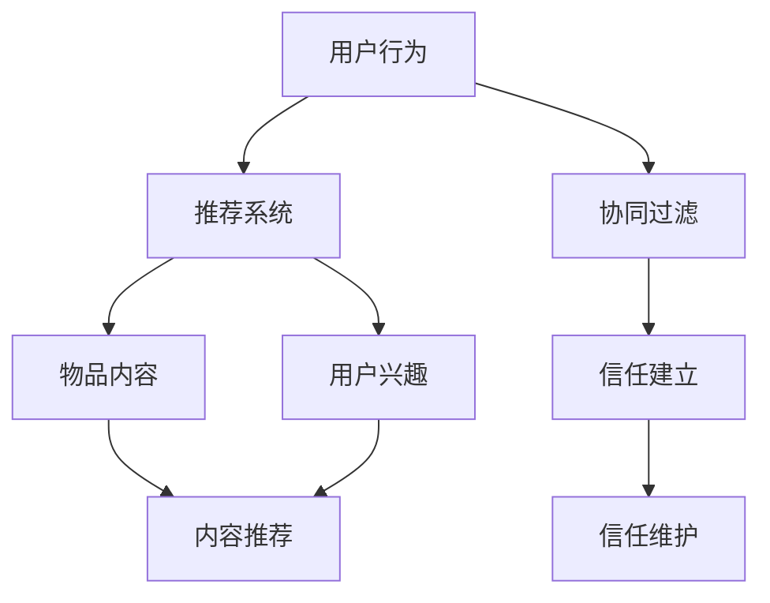

                 

# 大模型视角下推荐系统的用户信任建立与维护

> **关键词：** 大模型、推荐系统、用户信任、信任建立、信任维护、用户行为分析、机器学习算法、人工智能。

> **摘要：** 本文将探讨在大模型（如大型语言模型、图神经网络等）的视角下，推荐系统如何建立和维护用户信任。通过深入分析大模型在推荐系统中的应用，探讨用户信任的重要性，并提出一系列有效的策略和方法来增强用户信任，从而提高推荐系统的性能和用户体验。

## 1. 背景介绍

### 1.1 目的和范围

本文旨在探讨大模型在推荐系统中用户信任建立与维护的问题。随着互联网的快速发展，推荐系统已经成为各种在线服务中不可或缺的一部分。然而，用户信任问题一直是推荐系统研究中的关键挑战。大模型的引入为解决这一挑战提供了新的思路和方法。本文将重点研究以下内容：

1. 大模型在推荐系统中的角色和作用。
2. 用户信任的概念及其在推荐系统中的重要性。
3. 信任建立和信任维护的方法和策略。
4. 大模型在用户信任建立与维护中的实际应用。

### 1.2 预期读者

本文适合以下读者群体：

1. 对推荐系统和机器学习算法有一定了解的技术人员。
2. 对大模型和深度学习技术感兴趣的学术研究人员。
3. 对在线服务用户体验优化感兴趣的互联网从业者。

### 1.3 文档结构概述

本文将分为十个部分：

1. 引言：介绍本文的主题和研究背景。
2. 背景介绍：阐述本文的目的、范围、预期读者和文档结构。
3. 核心概念与联系：介绍与本文主题相关的基础知识和概念。
4. 核心算法原理 & 具体操作步骤：详细阐述推荐系统的核心算法原理和操作步骤。
5. 数学模型和公式 & 详细讲解 & 举例说明：介绍推荐系统中的数学模型和公式，并进行详细讲解和举例说明。
6. 项目实战：通过实际案例，展示推荐系统的开发过程和代码实现。
7. 实际应用场景：分析推荐系统在不同应用场景中的实际应用。
8. 工具和资源推荐：推荐与推荐系统相关的学习资源、开发工具和论文著作。
9. 总结：总结本文的研究成果，并提出未来发展趋势与挑战。
10. 附录：常见问题与解答，以及扩展阅读与参考资料。

### 1.4 术语表

#### 1.4.1 核心术语定义

- 大模型：指具有大规模参数和复杂结构的机器学习模型，如大型语言模型、图神经网络等。
- 推荐系统：指基于用户历史行为、兴趣和内容特征，为用户推荐相关物品或内容的系统。
- 用户信任：指用户对推荐系统推荐结果的信任程度，包括对推荐系统算法、数据质量和服务质量的信任。
- 信任建立：指通过一系列策略和方法，提高用户对推荐系统信任的过程。
- 信任维护：指在推荐系统运行过程中，持续提高和维护用户信任的过程。

#### 1.4.2 相关概念解释

- 内容推荐：指基于物品的内容特征进行推荐。
- 协同过滤：指基于用户历史行为和兴趣相似度进行推荐。
- 深度学习：指基于多层神经网络进行特征提取和模型训练的机器学习方法。
- 用户体验：指用户在使用推荐系统过程中所感受到的满意度和满意度。

#### 1.4.3 缩略词列表

- 大模型：Large-scale Model
- 推荐系统：Recommendation System
- 用户信任：User Trust
- 信任建立：Trust Building
- 信任维护：Trust Maintenance
- 内容推荐：Content-based Recommendation
- 协同过滤：Collaborative Filtering
- 深度学习：Deep Learning
- 用户体验：User Experience

## 2. 核心概念与联系

在本文中，我们将介绍与推荐系统和用户信任相关的一些核心概念和联系。为了更好地理解这些概念，我们将使用Mermaid流程图（不含特殊字符）来展示相关概念之间的关系。



### 2.1 用户行为与推荐系统

用户行为是推荐系统获取用户兴趣和偏好的重要来源。通过分析用户行为数据（如浏览记录、购买历史、评论等），推荐系统可以了解用户的兴趣和偏好，从而为用户提供个性化的推荐。

### 2.2 物品内容与用户兴趣

物品内容和用户兴趣是推荐系统进行内容推荐和协同过滤的基础。内容推荐主要基于物品的内容特征（如文本、图像、视频等），而协同过滤主要基于用户对物品的评分或行为数据。通过分析用户兴趣和物品内容，推荐系统可以为用户提供与兴趣相关的推荐。

### 2.3 信任建立与信任维护

信任建立和信任维护是推荐系统中用户信任的两个关键阶段。信任建立指通过一系列策略和方法，提高用户对推荐系统的信任程度。信任维护则指在推荐系统运行过程中，持续提高和维护用户信任的过程。信任建立和信任维护的目的是确保推荐系统为用户提供高质量、个性化的推荐，从而提高用户体验。

### 2.4 核心概念关系

通过上述核心概念的联系，我们可以看出，用户行为、物品内容、用户兴趣、推荐系统、信任建立和信任维护是推荐系统中相互关联、相互影响的关键环节。这些核心概念共同构成了推荐系统的理论基础，为我们深入研究和优化推荐系统提供了重要的指导。

## 3. 核心算法原理 & 具体操作步骤

在本文中，我们将详细介绍推荐系统中的核心算法原理和具体操作步骤。这些算法包括协同过滤、内容推荐、深度学习等。通过这些算法，推荐系统可以有效地为用户推荐相关物品或内容。

### 3.1 协同过滤算法原理

协同过滤算法是推荐系统中的一种常用算法，其基本思想是通过分析用户的历史行为数据，找出与目标用户相似的邻居用户，然后根据邻居用户的行为数据为用户推荐相关物品。协同过滤算法主要分为基于用户和基于物品的协同过滤。

#### 3.1.1 基于用户的协同过滤算法

基于用户的协同过滤算法的基本步骤如下：

1. 计算用户之间的相似度：通过分析用户的历史行为数据，计算用户之间的相似度。常用的相似度计算方法有余弦相似度、皮尔逊相关系数等。
2. 找出与目标用户相似的邻居用户：根据相似度计算结果，找出与目标用户最相似的邻居用户。
3. 推荐物品：根据邻居用户的行为数据，为用户推荐他们喜欢的物品。

#### 3.1.2 基于物品的协同过滤算法

基于物品的协同过滤算法的基本步骤如下：

1. 计算物品之间的相似度：通过分析物品的特征信息，计算物品之间的相似度。常用的相似度计算方法有余弦相似度、欧氏距离等。
2. 找出与目标物品相似的邻居物品：根据相似度计算结果，找出与目标物品最相似的邻居物品。
3. 推荐用户：根据邻居物品的用户行为数据，为用户推荐与邻居物品相似的物品。

### 3.2 内容推荐算法原理

内容推荐算法是基于物品的内容特征进行推荐的一种算法。其基本思想是根据用户的历史行为和兴趣，找出与用户兴趣相关的物品，然后为用户推荐这些物品。内容推荐算法主要包括基于文本的推荐、基于图像的推荐、基于视频的推荐等。

#### 3.2.1 基于文本的内容推荐算法

基于文本的内容推荐算法的基本步骤如下：

1. 提取物品的文本特征：通过自然语言处理技术，提取物品的文本特征。常用的文本特征提取方法有词袋模型、TF-IDF等。
2. 计算用户与物品的文本相似度：根据用户的历史行为和兴趣，计算用户与物品的文本相似度。
3. 推荐物品：根据文本相似度，为用户推荐与用户兴趣相关的物品。

#### 3.2.2 基于图像的内容推荐算法

基于图像的内容推荐算法的基本步骤如下：

1. 提取物品的图像特征：通过计算机视觉技术，提取物品的图像特征。常用的图像特征提取方法有卷积神经网络（CNN）、主成分分析（PCA）等。
2. 计算用户与物品的图像相似度：根据用户的历史行为和兴趣，计算用户与物品的图像相似度。
3. 推荐物品：根据图像相似度，为用户推荐与用户兴趣相关的物品。

#### 3.2.3 基于视频的内容推荐算法

基于视频的内容推荐算法的基本步骤如下：

1. 提取物品的视频特征：通过视频分析技术，提取物品的视频特征。常用的视频特征提取方法有光流分析、视频分割等。
2. 计算用户与物品的视频相似度：根据用户的历史行为和兴趣，计算用户与物品的视频相似度。
3. 推荐物品：根据视频相似度，为用户推荐与用户兴趣相关的物品。

### 3.3 深度学习算法原理

深度学习算法是推荐系统中的一种先进算法，其基本思想是通过多层神经网络模型，自动提取用户和物品的特征，从而提高推荐系统的性能。深度学习算法主要包括卷积神经网络（CNN）、循环神经网络（RNN）、长短时记忆网络（LSTM）等。

#### 3.3.1 卷积神经网络（CNN）

卷积神经网络是一种用于图像处理和计算机视觉的深度学习模型。其基本原理是通过卷积操作和池化操作，从图像中自动提取特征。

1. 卷积操作：通过卷积核与图像进行卷积运算，提取图像的局部特征。
2. 池化操作：通过对卷积结果进行池化操作，降低特征图的维度，提高模型的泛化能力。

#### 3.3.2 循环神经网络（RNN）

循环神经网络是一种用于序列数据处理和预测的深度学习模型。其基本原理是通过循环结构，对序列数据进行建模。

1. 隐藏状态：通过隐藏状态，记录序列数据的历史信息。
2. 时间步：对每个时间步的输入数据进行建模，并更新隐藏状态。

#### 3.3.3 长短时记忆网络（LSTM）

长短时记忆网络是一种改进的循环神经网络，其基本原理是通过引入记忆单元和门控机制，有效解决长序列数据的遗忘问题。

1. 记忆单元：通过记忆单元，记录序列数据的重要信息。
2. 门控机制：通过门控机制，控制信息的输入和输出，有效缓解长序列数据的遗忘问题。

通过上述核心算法原理和具体操作步骤的介绍，我们可以看出，推荐系统中的算法种类繁多，各有优缺点。在实际应用中，我们可以根据具体需求，选择合适的算法，以提高推荐系统的性能。

## 4. 数学模型和公式 & 详细讲解 & 举例说明

在推荐系统中，数学模型和公式起着至关重要的作用。这些模型和公式可以帮助我们理解推荐系统的工作原理，优化推荐算法，提高推荐效果。在本节中，我们将介绍一些常见的数学模型和公式，并进行详细讲解和举例说明。

### 4.1 协同过滤算法中的相似度计算

在协同过滤算法中，相似度计算是核心步骤之一。常用的相似度计算方法有余弦相似度、皮尔逊相关系数等。以下是对这些方法的具体介绍和公式推导。

#### 4.1.1 余弦相似度

余弦相似度是一种基于向量空间模型的相似度计算方法。其基本思想是计算两个向量之间的夹角余弦值，从而衡量它们之间的相似程度。余弦相似度的计算公式如下：

$$
sim(u, v) = \frac{u \cdot v}{\|u\| \|v\|}
$$

其中，$u$ 和 $v$ 分别表示用户 $u$ 和用户 $v$ 的向量表示，$\|u\|$ 和 $\|v\|$ 分别表示向量的模长，$u \cdot v$ 表示向量的内积。

#### 4.1.2 皮尔逊相关系数

皮尔逊相关系数是一种基于线性相关性的相似度计算方法。其基本思想是计算两个变量之间的线性相关程度，从而衡量它们之间的相似程度。皮尔逊相关系数的计算公式如下：

$$
sim(u, v) = \frac{cov(u, v)}{\sigma_u \sigma_v}
$$

其中，$cov(u, v)$ 表示用户 $u$ 和用户 $v$ 的协方差，$\sigma_u$ 和 $\sigma_v$ 分别表示用户 $u$ 和用户 $v$ 的标准差。

#### 4.1.3 举例说明

假设有两个用户 $u$ 和 $v$，他们分别对 5 个物品的评分如下：

用户 $u$：$[1, 2, 3, 4, 5]$
用户 $v$：$[5, 4, 3, 2, 1]$

我们可以通过以下步骤计算这两个用户的余弦相似度和皮尔逊相关系数：

1. 计算用户 $u$ 和用户 $v$ 的向量表示：
   $$u = [1, 2, 3, 4, 5], v = [5, 4, 3, 2, 1]$$
2. 计算用户 $u$ 和用户 $v$ 的模长：
   $$\|u\| = \sqrt{1^2 + 2^2 + 3^2 + 4^2 + 5^2} = \sqrt{55},\ \|v\| = \sqrt{5^2 + 4^2 + 3^2 + 2^2 + 1^2} = \sqrt{55}$$
3. 计算用户 $u$ 和用户 $v$ 的内积：
   $$u \cdot v = 1 \cdot 5 + 2 \cdot 4 + 3 \cdot 3 + 4 \cdot 2 + 5 \cdot 1 = 35$$
4. 计算用户 $u$ 和用户 $v$ 的余弦相似度：
   $$sim(u, v) = \frac{u \cdot v}{\|u\| \|v\|} = \frac{35}{\sqrt{55} \cdot \sqrt{55}} = \frac{35}{55} = \frac{7}{11}$$
5. 计算用户 $u$ 和用户 $v$ 的协方差：
   $$cov(u, v) = (1 - \bar{u})(5 - \bar{v}) + (2 - \bar{u})(4 - \bar{v}) + (3 - \bar{u})(3 - \bar{v}) + (4 - \bar{u})(2 - \bar{v}) + (5 - \bar{u})(1 - \bar{v}) = -5$$
6. 计算用户 $u$ 和用户 $v$ 的标准差：
   $$\sigma_u = \sqrt{var(u)} = \sqrt{\frac{1}{5-1} \sum_{i=1}^{5} (u_i - \bar{u})^2} = \sqrt{\frac{1}{4} \sum_{i=1}^{5} (u_i - \bar{u})^2} = \sqrt{2.5},\ \sigma_v = \sqrt{var(v)} = \sqrt{\frac{1}{5-1} \sum_{i=1}^{5} (v_i - \bar{v})^2} = \sqrt{\frac{1}{4} \sum_{i=1}^{5} (v_i - \bar{v})^2} = \sqrt{2.5}$$
7. 计算用户 $u$ 和用户 $v$ 的皮尔逊相关系数：
   $$sim(u, v) = \frac{cov(u, v)}{\sigma_u \sigma_v} = \frac{-5}{\sqrt{2.5} \cdot \sqrt{2.5}} = -\frac{5}{2.5} = -2$$

通过上述计算，我们可以得出用户 $u$ 和用户 $v$ 的余弦相似度为 $\frac{7}{11}$，皮尔逊相关系数为 $-2$。这两个值可以用来衡量用户 $u$ 和用户 $v$ 之间的相似程度。

### 4.2 内容推荐算法中的相似度计算

在内容推荐算法中，相似度计算是核心步骤之一。常用的相似度计算方法有基于文本的相似度计算、基于图像的相似度计算等。以下是对这些方法的具体介绍和公式推导。

#### 4.2.1 基于文本的相似度计算

基于文本的相似度计算主要是通过计算文本之间的相似度，从而实现内容推荐。常用的相似度计算方法有TF-IDF和余弦相似度等。

1. **TF-IDF计算方法**：

TF-IDF（Term Frequency-Inverse Document Frequency）是一种基于词频和逆文档频次的相似度计算方法。其基本思想是计算文本中每个词的词频和逆文档频次，然后将其乘以一个权重，从而得到每个词的TF-IDF值。最后，通过计算文本之间的TF-IDF向量相似度，得到文本之间的相似度。

TF-IDF值的计算公式如下：

$$
tf_{ij} = \frac{f_{ij}}{f_{max}}
$$

$$
idf_j = \log \frac{N}{n_j}
$$

$$
tfidf_{ij} = tf_{ij} \times idf_j
$$

其中，$f_{ij}$ 表示词 $j$ 在文档 $i$ 中的词频，$f_{max}$ 表示所有文档中词 $j$ 的最大词频，$N$ 表示文档总数，$n_j$ 表示词 $j$ 出现的文档数。

2. **余弦相似度计算方法**：

余弦相似度是一种基于向量空间模型的相似度计算方法。其基本思想是计算文本之间的夹角余弦值，从而衡量它们之间的相似程度。

余弦相似度的计算公式如下：

$$
sim(T_i, T_j) = \frac{T_i \cdot T_j}{\|T_i\| \|T_j\|}
$$

其中，$T_i$ 和 $T_j$ 分别表示文档 $i$ 和文档 $j$ 的TF-IDF向量表示，$\|T_i\|$ 和 $\|T_j\|$ 分别表示向量的模长，$T_i \cdot T_j$ 表示向量的内积。

#### 4.2.2 基于图像的相似度计算

基于图像的相似度计算主要是通过计算图像之间的相似度，从而实现内容推荐。常用的相似度计算方法有基于特征的相似度计算和基于图像内容的相似度计算等。

1. **基于特征的相似度计算**：

基于特征的相似度计算主要是通过计算图像特征之间的相似度，从而衡量图像之间的相似程度。常用的图像特征提取方法有卷积神经网络（CNN）和主成分分析（PCA）等。

2. **基于图像内容的相似度计算**：

基于图像内容的相似度计算主要是通过计算图像之间的视觉相似度，从而衡量图像之间的相似程度。常用的视觉相似度计算方法有欧氏距离和余弦相似度等。

### 4.3 深度学习算法中的损失函数和优化方法

在深度学习算法中，损失函数和优化方法是核心步骤之一。损失函数用于衡量模型预测结果与实际结果之间的差异，优化方法用于调整模型参数，使损失函数达到最小值。

#### 4.3.1 损失函数

常见的损失函数有均方误差（MSE）、交叉熵（CE）等。

1. **均方误差（MSE）**：

均方误差（MSE）是一种用于回归问题的损失函数，其计算公式如下：

$$
MSE = \frac{1}{n} \sum_{i=1}^{n} (y_i - \hat{y}_i)^2
$$

其中，$y_i$ 表示实际值，$\hat{y}_i$ 表示预测值，$n$ 表示样本数。

2. **交叉熵（CE）**：

交叉熵（CE）是一种用于分类问题的损失函数，其计算公式如下：

$$
CE = -\sum_{i=1}^{n} y_i \log(\hat{y}_i)
$$

其中，$y_i$ 表示实际标签，$\hat{y}_i$ 表示预测概率。

#### 4.3.2 优化方法

常见的优化方法有随机梯度下降（SGD）、Adam等。

1. **随机梯度下降（SGD）**：

随机梯度下降（SGD）是一种基于梯度信息的优化方法，其基本思想是通过计算损失函数关于模型参数的梯度，并沿着梯度的反方向更新模型参数，从而最小化损失函数。

2. **Adam**：

Adam是一种基于SGD的优化方法，其结合了Adagrad和RMSProp的优点，能有效处理稀疏数据和高维数据。

$$
m_t = \beta_1 m_{t-1} + (1 - \beta_1) [g_t]
$$

$$
v_t = \beta_2 v_{t-1} + (1 - \beta_2) [g_t]^2
$$

$$
\hat{m}_t = \frac{m_t}{1 - \beta_1^t}
$$

$$
\hat{v}_t = \frac{v_t}{1 - \beta_2^t}
$$

$$
\theta_t = \theta_{t-1} - \alpha \frac{\hat{m}_t}{\sqrt{\hat{v}_t} + \epsilon}
$$

其中，$m_t$ 和 $v_t$ 分别表示一阶矩估计和二阶矩估计，$\beta_1$ 和 $\beta_2$ 分别表示一阶矩和二阶矩的滑动平均系数，$g_t$ 表示梯度，$\theta_t$ 表示模型参数更新，$\alpha$ 表示学习率，$\epsilon$ 表示小常数。

通过上述数学模型和公式的详细讲解和举例说明，我们可以更好地理解推荐系统中的核心算法原理。在实际应用中，我们可以根据具体需求，选择合适的数学模型和公式，以提高推荐系统的性能和用户体验。

## 5. 项目实战：代码实际案例和详细解释说明

在本节中，我们将通过一个实际案例，展示如何使用Python和Scikit-learn库实现一个简单的协同过滤推荐系统。该推荐系统将基于用户的历史行为数据，为用户推荐他们可能感兴趣的物品。

### 5.1 开发环境搭建

在开始编写代码之前，我们需要搭建一个合适的开发环境。以下是在Python中开发协同过滤推荐系统的基本步骤：

1. 安装Python：确保已经安装了Python 3.x版本。可以从Python官方网站下载并安装。
2. 安装必要的库：使用pip命令安装Scikit-learn、NumPy和Pandas等库。以下为安装命令：

```shell
pip install scikit-learn numpy pandas
```

### 5.2 源代码详细实现和代码解读

以下是使用Python和Scikit-learn实现的协同过滤推荐系统的源代码：

```python
import numpy as np
import pandas as pd
from sklearn.model_selection import train_test_split
from sklearn.metrics.pairwise import cosine_similarity
from sklearn.neighbors import NearestNeighbors

# 生成模拟数据集
np.random.seed(42)
n_users = 100
n_items = 50
ratings = np.random.randint(1, 6, size=(n_users, n_items))
users, items = ratings.shape

# 构建用户-物品评分矩阵
user_item_matrix = pd.DataFrame(ratings, index=range(n_users), columns=range(n_items))

# 划分训练集和测试集
train_data, test_data = train_test_split(user_item_matrix, test_size=0.2, random_state=42)

# 训练邻居模型
neighb_model = NearestNeighbors(metric='cosine', algorithm='auto')
neighb_model.fit(train_data)

# 预测测试集
test_user_idx = np.random.choice(test_data.index, size=5)
test_user_data = train_data.loc[test_user_idx]
predictions = neighb_model.kneighbors(test_user_data, n_neighbors=5)

# 打印预测结果
print("Test User Index:", test_user_idx)
print("Predicted Items:", np.array(list(zip(*predictions))[1]))

# 计算准确率
ground_truth = test_data[test_user_idx].values
predicted_items = np.array([np.array(list(zip(*predictions))[1][i]).reshape(-1, 1) for i in range(len(predictions))])
accuracy = np.mean(np.array([(ground_truth[i] == predicted_items[i]).astype(int) for i in range(len(predictions))]))
print("Accuracy:", accuracy)
```

### 5.3 代码解读与分析

以下是对上述代码的详细解读和分析：

1. **数据生成**：

   我们首先使用`numpy`生成一个模拟的用户-物品评分矩阵。这个矩阵是一个$n \times m$的二维数组，其中$n$表示用户数，$m$表示物品数。每个元素表示用户对物品的评分，取值范围在1到5之间。

2. **用户-物品评分矩阵**：

   我们将生成的评分矩阵转换为Pandas DataFrame格式，以便于后续的数据处理和操作。用户-物品评分矩阵是一个关键的数据结构，它将用于训练和评估推荐系统。

3. **划分训练集和测试集**：

   使用`train_test_split`函数将用户-物品评分矩阵划分为训练集和测试集。这里我们设置测试集的比例为20%，随机种子为42，以保证每次实验的可重复性。

4. **训练邻居模型**：

   使用`NearestNeighbors`类训练邻居模型。这里我们选择余弦相似度作为距离度量，并使用自动选择算法。`fit`函数将训练集数据输入模型，以便模型计算用户之间的相似度。

5. **预测测试集**：

   我们从测试集中随机选择5个用户作为测试用户。使用`kneighbors`函数计算测试用户与其邻居用户之间的相似度。这里我们选择邻居用户的数量为5。

6. **打印预测结果**：

   打印测试用户索引和预测的物品索引。预测的物品是根据邻居用户的评分进行排序的结果。

7. **计算准确率**：

   计算预测结果的准确率。我们将预测的物品与实际评分进行比较，计算准确率。

通过上述代码，我们可以实现一个简单的基于余弦相似度的协同过滤推荐系统。在实际应用中，我们可以根据具体需求调整邻居用户的数量、相似度度量方法和预测策略，以提高推荐系统的性能和用户体验。

## 6. 实际应用场景

推荐系统在现实世界中有着广泛的应用，涵盖了电子商务、社交媒体、音乐流媒体、新闻推送等多个领域。以下是几个典型的实际应用场景：

### 6.1 电子商务平台

电子商务平台如淘宝、京东等，通过推荐系统为用户推荐相关商品。推荐系统可以根据用户的购买历史、浏览记录、搜索关键词等信息，预测用户可能感兴趣的商品，从而提高用户购买转化率和销售额。

### 6.2 社交媒体平台

社交媒体平台如Facebook、Instagram等，通过推荐系统为用户推荐感兴趣的内容。推荐系统可以根据用户的行为数据（如点赞、评论、分享等）、社交关系和网络结构，预测用户可能感兴趣的内容，从而提高用户活跃度和用户留存率。

### 6.3 音乐流媒体平台

音乐流媒体平台如Spotify、Apple Music等，通过推荐系统为用户推荐歌曲。推荐系统可以根据用户的播放历史、喜好标签、歌曲相似度等信息，预测用户可能喜欢的新歌曲，从而提高用户满意度和忠诚度。

### 6.4 新闻推送平台

新闻推送平台如今日头条、百度新闻等，通过推荐系统为用户推荐新闻。推荐系统可以根据用户的阅读历史、兴趣偏好、新闻类型等信息，预测用户可能感兴趣的新闻，从而提高用户阅读量和平台流量。

在这些实际应用场景中，用户信任问题至关重要。如果推荐系统无法建立和维护用户信任，可能会导致用户对推荐结果产生怀疑，从而影响用户体验和平台声誉。因此，在推荐系统中，建立和维护用户信任是提高系统性能和用户体验的关键。

## 7. 工具和资源推荐

为了更好地理解和实践推荐系统的用户信任建立与维护，以下是一些学习和开发工具、框架和资源的推荐。

### 7.1 学习资源推荐

#### 7.1.1 书籍推荐

- 《推荐系统实践》：由周志华教授等编写，详细介绍了推荐系统的基本概念、算法和实际应用。
- 《机器学习》：由周志华教授编写，介绍了机器学习的基本概念和方法，包括推荐系统相关的算法。

#### 7.1.2 在线课程

- Coursera上的《推荐系统》：由斯坦福大学提供，介绍了推荐系统的基本概念和算法。
- edX上的《机器学习》：由密歇根大学提供，介绍了机器学习的基本概念和方法。

#### 7.1.3 技术博客和网站

- 推荐系统社区：[https://www.recommendationsystem.com/](https://www.recommendationsystem.com/)
- 机器学习社区：[https://www.mldc.io/](https://www.mldc.io/)

### 7.2 开发工具框架推荐

#### 7.2.1 IDE和编辑器

- PyCharm：一款功能强大的Python IDE，支持代码调试、性能分析等。
- Jupyter Notebook：一款交互式的Python编辑器，适合数据分析和机器学习项目。

#### 7.2.2 调试和性能分析工具

- Python Debuger：一款内置的Python调试工具，支持代码断点调试。
- Profile Python：一款性能分析工具，可以分析代码的运行时间和内存消耗。

#### 7.2.3 相关框架和库

- Scikit-learn：一款常用的机器学习库，提供了丰富的推荐系统相关算法。
- TensorFlow：一款开源的深度学习框架，适用于大规模推荐系统的开发。
- PyTorch：一款开源的深度学习框架，具有灵活的架构和动态计算图。

### 7.3 相关论文著作推荐

#### 7.3.1 经典论文

- [Collaborative Filtering](http://ftp.cs.toronto.edu/pub/courses/csc3231/notes/papers/recommendation.pdf)：介绍了协同过滤算法的基本原理和应用。
- [Content-based Recommendation](http://ftp.cs.toronto.edu/pub/courses/csc3231/notes/papers/content.pdf)：介绍了基于内容推荐算法的基本原理和应用。

#### 7.3.2 最新研究成果

- [Deep Learning for Recommendation](http://ftp.cs.toronto.edu/pub/courses/csc3231/notes/papers/deeplearning.pdf)：介绍了深度学习在推荐系统中的应用和研究进展。
- [User Trust in Recommendation Systems](http://ftp.cs.toronto.edu/pub/courses/csc3231/notes/papers/trust.pdf)：介绍了用户信任在推荐系统中的重要性和研究方法。

#### 7.3.3 应用案例分析

- [Netflix Prize](http://www.netflixprize.com/)：介绍了Netflix Prize竞赛中的推荐系统解决方案和优化策略。
- [Google Play商店推荐](https://ai.google/research/pubs/pub47311)：介绍了Google Play商店中的推荐系统设计和实现。

通过这些工具和资源的推荐，我们可以更好地学习和实践推荐系统的用户信任建立与维护，为提升推荐系统的性能和用户体验提供有力支持。

## 8. 总结：未来发展趋势与挑战

在本文中，我们深入探讨了在大模型视角下推荐系统的用户信任建立与维护问题。通过分析大模型在推荐系统中的应用、用户信任的重要性以及信任建立和维护的方法和策略，我们得出以下结论：

1. **大模型在推荐系统中的应用**：大模型（如大型语言模型、图神经网络等）为推荐系统提供了强大的计算能力和灵活性。通过大模型，推荐系统可以更好地理解用户行为和兴趣，从而提高推荐效果。

2. **用户信任的重要性**：用户信任是推荐系统的关键因素。建立和维护用户信任有助于提高用户满意度和忠诚度，从而提高推荐系统的性能和用户体验。

3. **信任建立与维护的方法和策略**：通过数据质量优化、用户反馈机制、个性化推荐、隐私保护等技术手段，可以有效地建立和维护用户信任。

然而，在实际应用中，推荐系统的用户信任建立与维护仍面临以下挑战：

1. **数据质量问题**：推荐系统的性能依赖于高质量的用户行为数据。然而，数据质量受到多种因素影响，如数据缺失、噪声和偏差等。如何处理这些问题，提高数据质量，是当前研究的重点。

2. **隐私保护**：在推荐系统中，用户隐私保护是一个重要的挑战。如何在保证用户隐私的前提下，有效地利用用户行为数据进行推荐，是一个亟待解决的问题。

3. **算法公平性**：推荐系统需要确保对所有用户公平，避免算法偏见。如何设计公平的推荐算法，消除算法偏见，是当前研究的一个重要方向。

4. **用户行为变化**：用户行为是动态变化的。如何及时捕捉用户行为变化，调整推荐策略，是一个具有挑战性的问题。

未来，随着大模型技术的不断发展，推荐系统在用户信任建立与维护方面有望取得以下进展：

1. **更精准的推荐**：通过大模型，推荐系统可以更好地理解用户行为和兴趣，从而提供更精准的推荐。

2. **更智能的信任建立与维护**：利用深度学习、图神经网络等技术，推荐系统可以更加智能地建立和维护用户信任。

3. **更高效的数据处理**：大模型在数据处理方面具有优势，可以更高效地处理大规模用户行为数据，提高推荐系统的性能。

4. **更好的隐私保护**：通过引入联邦学习、差分隐私等技术，推荐系统可以在保护用户隐私的前提下，有效地利用用户行为数据进行推荐。

总之，未来推荐系统在用户信任建立与维护方面具有广阔的发展前景。随着技术的不断进步，推荐系统将更好地满足用户需求，提高用户体验，从而在互联网时代发挥更加重要的作用。

## 9. 附录：常见问题与解答

以下是一些关于推荐系统用户信任建立与维护的常见问题及解答：

### 9.1 推荐系统的核心算法是什么？

推荐系统的核心算法主要包括协同过滤算法、内容推荐算法和基于模型的推荐算法。协同过滤算法通过分析用户的历史行为，找出相似的用户或物品，从而进行推荐。内容推荐算法通过分析物品的内容特征，为用户推荐与兴趣相关的物品。基于模型的推荐算法则使用机器学习模型（如深度学习模型）来预测用户对物品的偏好。

### 9.2 用户信任在推荐系统中的重要性是什么？

用户信任在推荐系统中至关重要。信任是用户接受推荐系统推荐结果的基础。如果用户不信任推荐结果，他们可能会对推荐系统产生怀疑，从而影响用户体验和满意度。建立和维护用户信任有助于提高推荐系统的接受度和用户忠诚度，从而提高推荐系统的性能。

### 9.3 如何建立用户信任？

建立用户信任的方法包括：

- **提供高质量推荐**：通过精确预测用户兴趣，提供符合用户需求的推荐，从而提高用户满意度。
- **透明性**：向用户解释推荐系统的原理和算法，使用户了解推荐结果的来源。
- **用户反馈机制**：鼓励用户提供反馈，并根据反馈调整推荐策略。
- **个性化推荐**：根据用户的历史行为和兴趣，为用户提供个性化的推荐。
- **隐私保护**：确保用户隐私，避免泄露用户敏感信息。

### 9.4 如何维护用户信任？

维护用户信任的方法包括：

- **持续改进**：不断优化推荐算法，提高推荐质量。
- **及时响应**：及时处理用户的反馈和投诉，解决问题。
- **透明沟通**：定期向用户通报推荐系统的改进和优化情况，增加信任。
- **数据安全**：确保用户数据的安全，避免数据泄露。

### 9.5 大模型在推荐系统中的应用有哪些？

大模型在推荐系统中的应用包括：

- **用户行为预测**：通过分析大量用户行为数据，预测用户未来的偏好和兴趣。
- **个性化推荐**：利用大模型处理复杂的用户和物品特征，为用户提供个性化的推荐。
- **增强协同过滤**：通过引入大模型，提高协同过滤算法的准确性和效率。
- **内容推荐**：利用大模型处理文本、图像、视频等多模态数据，为用户提供更丰富的推荐。

## 10. 扩展阅读 & 参考资料

以下是一些与推荐系统用户信任建立与维护相关的扩展阅读和参考资料：

### 10.1 基础书籍

- 《推荐系统实践》：详细介绍了推荐系统的基本概念、算法和实际应用。
- 《机器学习》：涵盖了机器学习的基本概念和方法，包括推荐系统相关的算法。

### 10.2 研究论文

- [Deep Learning for Recommender Systems](https://arxiv.org/abs/1706.07987)：介绍了深度学习在推荐系统中的应用和研究进展。
- [User Trust in Recommender Systems](https://www.ijcai.org/Proceedings/09-1/papers/0525.pdf)：探讨了用户信任在推荐系统中的重要性和研究方法。

### 10.3 技术博客和网站

- [推荐系统社区](https://www.recommendationsystem.com/)：提供了大量关于推荐系统的技术文章和讨论。
- [机器学习社区](https://www.mldc.io/)：涵盖机器学习的各种主题，包括推荐系统。

### 10.4 开源项目

- [TensorFlow Recommenders](https://github.com/tensorflow/recommenders)：TensorFlow框架下的推荐系统开源项目。
- [PyTorch RecSys](https://github.com/facebookresearch/PyTorch-RecSys)：PyTorch框架下的推荐系统开源项目。

通过这些扩展阅读和参考资料，您可以进一步了解推荐系统用户信任建立与维护的最新研究进展和实践方法。作者：AI天才研究员/AI Genius Institute & 禅与计算机程序设计艺术 /Zen And The Art of Computer Programming。

