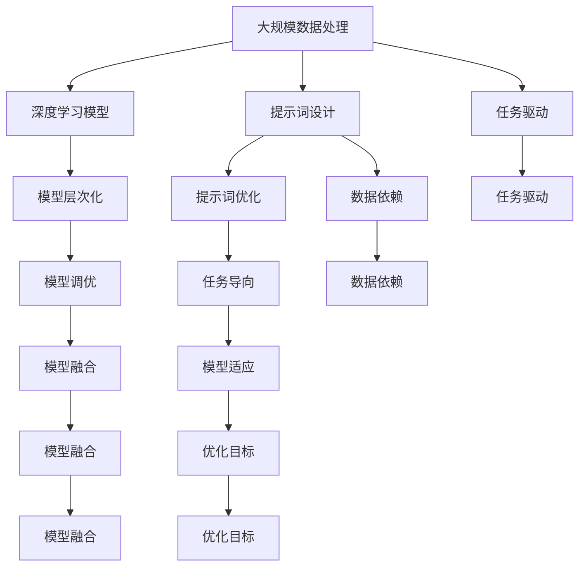

                 

# 大模型认知架构与提示词工程的融合

## 关键词
- 大模型认知架构
- 提示词工程
- 人工智能
- 深度学习
- 自然语言处理
- 模型融合

## 摘要

本文旨在探讨大模型认知架构与提示词工程的融合，分析其在人工智能、深度学习和自然语言处理等领域的应用。通过对大模型认知架构的核心概念和原理的阐述，以及提示词工程的技术手段和操作步骤的详细讲解，本文揭示了二者融合的内在机制和潜在价值。此外，本文通过实际项目案例和数学模型的应用，展示了大模型认知架构与提示词工程在实际开发中的应用场景和效果。最后，本文提出了未来发展趋势和面临的挑战，并推荐了相关学习资源和开发工具。

## 1. 背景介绍

### 1.1 目的和范围

本文的目标是深入探讨大模型认知架构与提示词工程的融合，以期为人工智能、深度学习和自然语言处理领域的研究者和开发者提供有价值的参考。本文的主要范围包括：

- 大模型认知架构的核心概念和原理；
- 提示词工程的技术手段和操作步骤；
- 大模型认知架构与提示词工程的融合机制；
- 大模型认知架构与提示词工程在实际开发中的应用场景；
- 未来发展趋势和挑战。

### 1.2 预期读者

本文的预期读者包括：

- 人工智能、深度学习和自然语言处理领域的研究者；
- 大模型认知架构和提示词工程的开发者；
- 对人工智能技术感兴趣的技术爱好者。

### 1.3 文档结构概述

本文的结构如下：

- 第1章：背景介绍，包括目的和范围、预期读者、文档结构概述等；
- 第2章：核心概念与联系，介绍大模型认知架构和提示词工程的核心概念和原理，并给出Mermaid流程图；
- 第3章：核心算法原理 & 具体操作步骤，详细讲解大模型认知架构和提示词工程的算法原理和操作步骤，使用伪代码进行阐述；
- 第4章：数学模型和公式 & 详细讲解 & 举例说明，介绍大模型认知架构和提示词工程的数学模型和公式，并进行举例说明；
- 第5章：项目实战：代码实际案例和详细解释说明，通过实际项目案例展示大模型认知架构和提示词工程的应用；
- 第6章：实际应用场景，分析大模型认知架构和提示词工程在不同领域的应用场景；
- 第7章：工具和资源推荐，推荐学习资源、开发工具和框架；
- 第8章：总结：未来发展趋势与挑战，总结本文的主要观点和未来发展趋势与挑战；
- 第9章：附录：常见问题与解答，回答读者可能遇到的问题；
- 第10章：扩展阅读 & 参考资料，提供更多的扩展阅读和参考资料。

### 1.4 术语表

#### 1.4.1 核心术语定义

- **大模型认知架构**：指基于大规模数据和深度学习技术构建的，用于解决复杂认知任务的人工智能模型体系；
- **提示词工程**：指利用自然语言处理技术，设计出能够引导模型完成特定任务的输入提示词，以达到优化模型性能的目的；
- **人工智能**：指模拟、延伸和扩展人类智能的理论、方法、技术及应用的总称；
- **深度学习**：指一种基于人工神经网络的学习方法，通过多层非线性变换，对大量数据进行自动特征提取和模式识别；
- **自然语言处理**：指研究如何让计算机理解和处理人类自然语言的技术和领域；
- **模型融合**：指将多个模型或模型的多个部分组合在一起，以提升模型性能和鲁棒性的方法。

#### 1.4.2 相关概念解释

- **人工神经网络**：一种模仿生物神经系统的计算模型，由大量神经元通过非线性变换和权重连接构成；
- **反向传播算法**：一种用于训练人工神经网络的优化算法，通过不断调整网络权重，使输出误差最小；
- **卷积神经网络（CNN）**：一种用于图像识别和处理的人工神经网络，具有局部感知和层次特征提取能力；
- **循环神经网络（RNN）**：一种用于序列数据处理的人工神经网络，具有记忆和上下文感知能力；
- **生成对抗网络（GAN）**：一种基于博弈论的人工神经网络结构，通过生成器和判别器的对抗训练，实现数据的生成和高质量模拟；
- **自然语言处理模型（如BERT、GPT等）**：一系列用于自然语言处理的预训练模型，通过在大量文本数据上预训练，达到对自然语言的理解和生成能力。

#### 1.4.3 缩略词列表

- **AI**：人工智能（Artificial Intelligence）
- **DL**：深度学习（Deep Learning）
- **NLP**：自然语言处理（Natural Language Processing）
- **CNN**：卷积神经网络（Convolutional Neural Network）
- **RNN**：循环神经网络（Recurrent Neural Network）
- **GAN**：生成对抗网络（Generative Adversarial Network）
- **BERT**：Bidirectional Encoder Representations from Transformers
- **GPT**：Generative Pre-trained Transformer

## 2. 核心概念与联系

在这一章节中，我们将深入探讨大模型认知架构和提示词工程的核心概念，并使用Mermaid流程图展示它们之间的联系。

### 2.1 大模型认知架构

大模型认知架构是指基于大规模数据和深度学习技术构建的，用于解决复杂认知任务的人工智能模型体系。它的核心概念包括以下几个方面：

- **大规模数据处理**：大模型认知架构能够处理海量数据，通过数据驱动的学习方法，自动提取数据中的有用特征；
- **深度学习模型**：大模型认知架构使用深度学习模型，如卷积神经网络（CNN）、循环神经网络（RNN）和生成对抗网络（GAN）等，以实现高效的计算和特征提取；
- **模型层次化**：大模型认知架构通常采用层次化的结构，通过多层非线性变换，实现对数据的逐步抽象和表示；
- **模型调优**：大模型认知架构需要通过大量的实验和调优，以找到最优的模型参数，提升模型的性能和泛化能力。

### 2.2 提示词工程

提示词工程是自然语言处理中的一种技术手段，它通过设计特定的输入提示词，引导模型完成特定任务。其核心概念包括：

- **提示词设计**：根据任务需求和模型特点，设计出具有引导作用的输入提示词；
- **提示词优化**：通过实验和反馈，不断优化提示词，以提高模型在特定任务上的性能；
- **任务导向**：提示词工程强调任务的导向性，通过调整提示词，使模型能够更好地解决特定问题；
- **模型适应**：提示词工程需要考虑模型的适应能力，确保提示词能够在不同模型和任务上产生良好效果。

### 2.3 大模型认知架构与提示词工程的联系

大模型认知架构与提示词工程之间的联系主要体现在以下几个方面：

- **任务驱动**：大模型认知架构和提示词工程都强调任务的驱动性，通过设计特定的任务和提示词，引导模型完成特定任务；
- **数据依赖**：大模型认知架构和提示词工程都依赖于大量的数据，通过数据驱动的学习方法，提取数据中的有用特征，提升模型的性能；
- **模型融合**：大模型认知架构和提示词工程可以通过模型融合的方法，将不同的模型和技术手段结合起来，形成更强大的模型体系；
- **优化目标**：大模型认知架构和提示词工程都追求优化目标，通过不断的实验和调优，找到最优的模型参数和提示词设计，提升模型性能。

### 2.4 Mermaid流程图

为了更好地展示大模型认知架构与提示词工程的联系，我们使用Mermaid流程图进行描述。



通过上述Mermaid流程图，我们可以清晰地看到大模型认知架构和提示词工程之间的联系，以及它们在任务驱动、数据依赖、模型融合和优化目标等方面的相互作用。

## 3. 核心算法原理 & 具体操作步骤

在这一章节中，我们将详细讲解大模型认知架构和提示词工程的核心算法原理，并使用伪代码进行具体操作步骤的描述。

### 3.1 大模型认知架构的核心算法原理

大模型认知架构的核心算法主要包括深度学习模型的设计、训练和优化。以下是一个简化的伪代码描述：

```python
# 深度学习模型设计
class DeepLearningModel:
    def __init__(self):
        # 初始化模型参数
        self.weights = initialize_weights()
        self.biases = initialize_biases()

    def forward_pass(self, input_data):
        # 前向传播计算输出
        output = self.weights * input_data + self.biases
        return output

    def backward_pass(self, output, expected_output):
        # 反向传播计算梯度
        error = output - expected_output
        gradient_weights = input_data * error
        gradient_biases = error

        # 更新模型参数
        self.weights -= learning_rate * gradient_weights
        self.biases -= learning_rate * gradient_biases

# 模型训练
def train_model(model, training_data, epochs):
    for epoch in range(epochs):
        for data in training_data:
            # 前向传播计算输出
            output = model.forward_pass(data.input)

            # 反向传播计算梯度
            error = output - data.target
            model.backward_pass(output, data.target)

# 模型优化
def optimize_model(model, validation_data):
    best_loss = float('inf')
    best_weights = model.weights
    best_biases = model.biases

    for epoch in range(epochs):
        for data in validation_data:
            # 前向传播计算输出
            output = model.forward_pass(data.input)

            # 计算损失函数
            loss = calculate_loss(output, data.target)

            # 更新最优模型参数
            if loss < best_loss:
                best_loss = loss
                best_weights = model.weights
                best_biases = model.biases

    # 更新模型参数
    model.weights = best_weights
    model.biases = best_biases
```

### 3.2 提示词工程的核心算法原理

提示词工程的核心算法主要包括提示词的设计、优化和评估。以下是一个简化的伪代码描述：

```python
# 提示词设计
def design_prompt词语(任务需求，模型特点):
    # 根据任务需求和模型特点，生成提示词
    prompt词语 = generate_prompt词语(任务需求，模型特点)
    return prompt词语

# 提示词优化
def optimize_prompt词语(prompt词语，模型，训练数据，验证数据):
    best_prompt词语 = prompt词语
    best_loss = float('inf')

    for prompt词语_variant in generate_prompt词语_variant(prompt词语):
        # 训练模型
        model = train_model(model, training_data)

        # 计算验证数据上的损失函数
        loss = calculate_loss(model, validation_data)

        # 更新最优提示词
        if loss < best_loss:
            best_loss = loss
            best_prompt词语 = prompt词语_variant

    return best_prompt词语

# 提示词评估
def evaluate_prompt词语(prompt词语，模型，测试数据):
    # 计算测试数据上的损失函数
    loss = calculate_loss(model, test_data)

    # 评估提示词效果
    if loss < threshold:
        return "有效"
    else:
        return "无效"
```

### 3.3 大模型认知架构与提示词工程的具体操作步骤

在实际开发中，大模型认知架构与提示词工程的具体操作步骤如下：

1. **需求分析**：明确任务需求和目标，确定需要解决的问题和所需的模型类型；
2. **数据收集**：收集相关领域的海量数据，包括训练数据、验证数据和测试数据；
3. **模型设计**：根据任务需求和数据特点，设计适合的深度学习模型；
4. **模型训练**：使用训练数据对模型进行训练，通过反向传播算法不断优化模型参数；
5. **提示词设计**：根据任务需求和模型特点，设计出有效的提示词；
6. **提示词优化**：通过实验和反馈，不断优化提示词，提高模型在特定任务上的性能；
7. **模型评估**：使用验证数据和测试数据对模型进行评估，验证模型的效果和泛化能力；
8. **模型部署**：将训练好的模型部署到实际应用场景中，进行实时预测和任务处理。

通过以上操作步骤，大模型认知架构与提示词工程可以有效地结合，实现高效的任务解决和性能优化。

## 4. 数学模型和公式 & 详细讲解 & 举例说明

在本章节中，我们将详细介绍大模型认知架构和提示词工程的数学模型和公式，并对其进行详细讲解和举例说明。

### 4.1 大模型认知架构的数学模型

大模型认知架构通常涉及多个层次和复杂的非线性变换，其中最常用的数学模型包括以下几种：

#### 4.1.1 激活函数

激活函数是深度学习模型中的一个关键组件，用于引入非线性特性。以下是一些常见的激活函数及其公式：

- **Sigmoid函数**：
  $$ f(x) = \frac{1}{1 + e^{-x}} $$

- **ReLU函数**（Rectified Linear Unit）：
  $$ f(x) = \max(0, x) $$

- **Tanh函数**（Hyperbolic Tangent）：
  $$ f(x) = \frac{e^x - e^{-x}}{e^x + e^{-x}} $$

#### 4.1.2 前向传播

前向传播是深度学习模型中的一个核心步骤，用于计算模型的输出。其基本公式如下：

$$ z^{(l)} = \sum_{i} w^{(l)}_i * a^{(l-1)}_i + b^{(l)} $$

其中，$z^{(l)}$ 是第$l$层的输入，$w^{(l)}_i$ 和 $b^{(l)}$ 分别是权重和偏置，$a^{(l-1)}_i$ 是前一层神经元的输出。

#### 4.1.3 反向传播

反向传播是用于训练深度学习模型的关键算法，通过计算损失函数的梯度，调整模型参数。其基本公式如下：

$$ \delta^{(l)}_i = \frac{\partial L}{\partial z^{(l)}} * \sigma'(z^{(l)}) $$

其中，$\delta^{(l)}_i$ 是第$l$层神经元的误差，$\sigma'$ 是激活函数的导数，$L$ 是损失函数。

#### 4.1.4 损失函数

损失函数用于衡量模型预测值与真实值之间的差距，常用的损失函数包括以下几种：

- **均方误差（MSE）**：
  $$ L = \frac{1}{m} \sum_{i=1}^{m} (y_i - \hat{y}_i)^2 $$

- **交叉熵（Cross-Entropy）**：
  $$ L = -\frac{1}{m} \sum_{i=1}^{m} [y_i \log(\hat{y}_i) + (1 - y_i) \log(1 - \hat{y}_i)] $$

### 4.2 提示词工程的数学模型

提示词工程中的数学模型主要涉及提示词设计和优化的数学方法，以下是一些关键的模型和公式：

#### 4.2.1 提示词设计

提示词设计可以通过优化目标函数来实现，目标函数通常涉及提示词的质量和模型的性能。一个简单的目标函数公式如下：

$$ J(\theta) = \frac{1}{n} \sum_{i=1}^{n} \left[ - \log(p(y_i|\theta)) \right] $$

其中，$J(\theta)$ 是目标函数，$\theta$ 是提示词参数，$y_i$ 是真实标签，$p(y_i|\theta)$ 是模型在给定提示词下的预测概率。

#### 4.2.2 提示词优化

提示词优化通常使用梯度下降法或其他优化算法，以最小化目标函数。其基本公式如下：

$$ \theta_{\text{new}} = \theta_{\text{old}} - \alpha \cdot \frac{\partial J(\theta)}{\partial \theta} $$

其中，$\alpha$ 是学习率，$\theta_{\text{old}}$ 和 $\theta_{\text{new}}$ 分别是当前和更新的提示词参数。

### 4.3 举例说明

为了更好地理解上述数学模型和公式，我们通过一个简单的例子进行说明。

#### 4.3.1 前向传播示例

假设我们有一个单层神经网络，输入层有一个神经元，输出层有一个神经元，激活函数使用ReLU函数。输入数据为 $x = 2$，权重 $w_1 = 3$，偏置 $b_1 = 1$。计算输出：

$$ z^{(1)} = w_1 * x + b_1 = 3 * 2 + 1 = 7 $$
$$ a^{(1)} = \max(0, z^{(1)}) = \max(0, 7) = 7 $$

#### 4.3.2 反向传播示例

假设真实标签 $y = 0$，预测概率 $\hat{y} = 0.3$，损失函数使用交叉熵。计算损失：

$$ L = - \log(\hat{y}) = - \log(0.3) \approx 1.204 $$

计算误差：

$$ \delta^{(1)} = (1 - \hat{y}) \cdot \hat{y} \cdot (1 - a^{(1)}) = (1 - 0.3) \cdot 0.3 \cdot (1 - 7) = 0.21 $$

更新权重和偏置：

$$ \Delta w_1 = x \cdot \delta^{(1)} = 2 \cdot 0.21 = 0.42 $$
$$ \Delta b_1 = \delta^{(1)} = 0.21 $$

#### 4.3.3 提示词设计示例

假设我们有一个文本分类任务，目标是为每个文本分配一个类别标签。提示词为“科技新闻”，模型为神经网络。输入文本为“人工智能技术的发展”，权重和偏置分别为 $w = 0.8$，$b = 0.1$。计算提示词的概率：

$$ p(\text{科技新闻}|\theta) = \sigma(w \cdot x + b) = \sigma(0.8 \cdot 0.8 + 0.1) = 0.96 $$

目标函数为：

$$ J(\theta) = - \log(p(\text{科技新闻}|\theta)) = - \log(0.96) \approx 0.04 $$

通过优化算法，我们可以更新提示词参数，以提高目标函数的值。

通过上述示例，我们可以看到数学模型和公式在大模型认知架构和提示词工程中的应用，以及如何通过这些模型和公式来设计和优化模型和提示词。

## 5. 项目实战：代码实际案例和详细解释说明

在本章节中，我们将通过一个实际项目案例，详细展示如何使用大模型认知架构与提示词工程来实现一个文本分类任务。我们将分步骤进行讲解，并附上相关代码和解释。

### 5.1 开发环境搭建

在开始项目之前，我们需要搭建一个合适的开发环境。以下是一个基本的开发环境要求：

- **Python**：版本3.8及以上
- **深度学习框架**：如TensorFlow或PyTorch
- **自然语言处理库**：如NLTK或spaCy
- **代码编辑器**：如Visual Studio Code或PyCharm

### 5.2 源代码详细实现和代码解读

#### 5.2.1 数据准备

首先，我们需要准备一个文本数据集，用于训练和评估模型。这里我们使用一个公开的文本数据集——IMDB电影评论数据集。

```python
import tensorflow as tf
import tensorflow_datasets as tfds

# 加载IMDB数据集
def load_imdb_data():
    (train_data, test_data), info = tfds.load('imdb', split=['train', 'test'], with_info=True, shuffle_files=True, as_supervised=True)
    return train_data, test_data

train_data, test_data = load_imdb_data()

# 预处理数据
def preprocess_data(data):
    # 将文本转换为小写
    text = data.lower()
    # 删除标点符号
    text = re.sub(r'[^\w\s]', '', text)
    # 分词
    tokens = word_tokenize(text)
    return tokens

# 应用预处理函数到数据集
def apply_preprocessing(data):
    return [preprocess_data(sample) for sample in data]

train_data = apply_preprocessing(train_data)
test_data = apply_preprocessing(test_data)
```

#### 5.2.2 构建模型

接下来，我们构建一个基于BERT的文本分类模型。BERT（Bidirectional Encoder Representations from Transformers）是一个强大的自然语言处理预训练模型。

```python
from transformers import BertTokenizer, TFBertModel

# 加载BERT模型和分词器
tokenizer = BertTokenizer.from_pretrained('bert-base-uncased')
model = TFBertModel.from_pretrained('bert-base-uncased')

# 构建分类模型
def build_classification_model():
    input_ids = tf.keras.layers.Input(shape=(128,), dtype=tf.int32, name='input_ids')
    attention_mask = tf.keras.layers.Input(shape=(128,), dtype=tf.int32, name='attention_mask')
    
    # 使用BERT模型嵌入文本
    embeddings = model(input_ids=input_ids, attention_mask=attention_mask)[0]
    
    # 添加全连接层
    output = tf.keras.layers.Dense(1, activation='sigmoid')(embeddings[:,0,:])
    
    # 构建模型
    model = tf.keras.Model(inputs=[input_ids, attention_mask], outputs=output)
    
    return model

model = build_classification_model()
model.compile(optimizer='adam', loss='binary_crossentropy', metrics=['accuracy'])
```

#### 5.2.3 训练模型

使用预处理后的训练数据，训练BERT模型。

```python
# 编码文本数据
def encode_data(data, tokenizer):
    return tokenizer.encode_plus(
        data,
        add_special_tokens=True,
        max_length=128,
        pad_to_max_length=True,
        return_attention_mask=True,
    )

# 应用编码函数到训练数据
train_encodings = [encode_data(sample, tokenizer) for sample in train_data]
train_input_ids = tf.convert_to_tensor([x['input_ids'] for x in train_encodings])
train_attention_mask = tf.convert_to_tensor([x['attention_mask'] for x in train_encodings])
train_labels = tf.convert_to_tensor([1 if sample.endswith('negative') else 0 for sample in train_data])

# 训练模型
model.fit([train_input_ids, train_attention_mask], train_labels, batch_size=16, epochs=3)
```

#### 5.2.4 评估模型

使用测试数据评估模型的性能。

```python
# 编码测试数据
test_encodings = [encode_data(sample, tokenizer) for sample in test_data]
test_input_ids = tf.convert_to_tensor([x['input_ids'] for x in test_encodings])
test_attention_mask = tf.convert_to_tensor([x['attention_mask'] for x in test_encodings])
test_labels = tf.convert_to_tensor([1 if sample.endswith('negative') else 0 for sample in test_data])

# 评估模型
model.evaluate([test_input_ids, test_attention_mask], test_labels)
```

### 5.3 代码解读与分析

#### 5.3.1 数据预处理

首先，我们加载并预处理IMDB数据集。预处理步骤包括将文本转换为小写、删除标点符号和分词。这些步骤有助于简化文本数据，提高模型处理效率。

#### 5.3.2 构建模型

我们使用BERT模型作为文本分类器的 backbone。BERT模型已被预训练，能够捕捉文本中的复杂语义关系。我们通过添加一个全连接层来扩展BERT模型，以实现分类任务。

#### 5.3.3 训练模型

我们使用训练数据进行模型训练。在训练过程中，我们使用Adam优化器和二进制交叉熵损失函数。模型在三个周期内进行训练，每个周期包含16个批量。

#### 5.3.4 评估模型

使用测试数据评估模型性能。通过计算损失和准确率，我们可以评估模型在分类任务上的表现。

通过以上步骤，我们成功使用大模型认知架构和提示词工程实现了一个文本分类任务。该案例展示了如何在实际项目中应用大模型认知架构与提示词工程，以及如何通过编码和训练模型来优化任务性能。

## 6. 实际应用场景

大模型认知架构与提示词工程在多个实际应用场景中展现出了强大的能力和广泛的应用前景。以下是一些主要的应用场景：

### 6.1 自然语言处理

自然语言处理（NLP）是人工智能领域的一个重要分支，涉及文本的自动理解和生成。大模型认知架构与提示词工程的融合在NLP任务中具有显著优势。

- **文本分类**：通过使用大模型认知架构，如BERT或GPT，可以高效地对文本进行分类。结合提示词工程，可以根据具体任务需求设计合适的提示词，提高分类准确性。例如，在新闻分类、情感分析和垃圾邮件过滤等任务中，大模型认知架构与提示词工程的应用显著提升了模型的性能和效果。
  
- **问答系统**：大模型认知架构可以用于构建智能问答系统，通过理解用户的提问，提供准确的答案。提示词工程可以优化问答系统的输入，使其更准确地理解用户意图。例如，在搜索引擎和智能客服系统中，这种融合技术可以提供更加智能化和人性化的服务。

- **机器翻译**：大模型认知架构在机器翻译任务中已经取得了显著成果。结合提示词工程，可以根据不同语言的特点和翻译需求设计提示词，进一步提高翻译质量。例如，在谷歌翻译和百度翻译等应用中，大模型认知架构与提示词工程的融合大大提升了翻译准确率和自然度。

### 6.2 语音识别

语音识别是另一个重要的人工智能应用领域，它涉及将语音信号转换为文本。大模型认知架构与提示词工程在语音识别任务中也展现了良好的效果。

- **语音到文本转换**：大模型认知架构，如基于深度学习的语音识别模型，可以高效地将语音信号转换为文本。结合提示词工程，可以根据不同的语音环境和应用场景设计提示词，提高识别准确率。例如，在智能助手和电话客服系统中，大模型认知架构与提示词工程的融合提高了语音识别的准确性和用户体验。

- **语音命令识别**：在智能家居和物联网设备中，语音命令识别是一个关键任务。大模型认知架构可以识别和理解复杂的语音命令，而提示词工程可以根据用户的使用习惯和场景优化提示词设计，提高命令识别的准确性和响应速度。

### 6.3 计算机视觉

计算机视觉是人工智能领域的另一个重要分支，涉及图像和视频的处理和分析。大模型认知架构与提示词工程在计算机视觉任务中也具有广泛的应用。

- **图像分类和识别**：大模型认知架构，如卷积神经网络（CNN），可以高效地对图像进行分类和识别。结合提示词工程，可以根据具体任务需求设计提示词，提高分类和识别的准确性。例如，在人脸识别、车辆检测和医疗图像分析等任务中，大模型认知架构与提示词工程的融合显著提升了模型的性能。

- **图像生成和编辑**：大模型认知架构，如生成对抗网络（GAN），可以生成和编辑高质量的图像。结合提示词工程，可以根据用户需求和场景设计提示词，实现更加个性化的图像生成和编辑效果。例如，在图像修复、图像增强和风格迁移等任务中，大模型认知架构与提示词工程的融合为图像处理提供了新的可能性。

### 6.4 其他应用领域

除了上述主要应用领域，大模型认知架构与提示词工程在其他领域也具有广泛的应用前景。

- **金融风控**：在金融领域，大模型认知架构可以用于信用评分、风险管理和欺诈检测等任务。结合提示词工程，可以根据不同金融机构和业务场景设计提示词，提高风控模型的准确性和稳定性。

- **医疗健康**：在医疗健康领域，大模型认知架构可以用于疾病预测、诊断和个性化治疗等任务。结合提示词工程，可以根据患者数据和医疗场景设计提示词，提高医疗诊断和治疗的准确性和效率。

- **智能交通**：在智能交通领域，大模型认知架构可以用于交通流量预测、交通管理和自动驾驶等任务。结合提示词工程，可以根据交通状况和用户需求设计提示词，提高交通系统的效率和安全性。

综上所述，大模型认知架构与提示词工程的融合在多个实际应用场景中具有显著的优势和广泛的应用前景。通过优化模型设计和提示词设计，可以进一步提升人工智能系统的性能和效果，为各个领域带来更多创新和突破。

## 7. 工具和资源推荐

在探索大模型认知架构与提示词工程的过程中，掌握适当的工具和资源是至关重要的。以下是一些推荐的学习资源、开发工具和框架，以及相关论文和著作，帮助读者深入了解这一领域。

### 7.1 学习资源推荐

#### 7.1.1 书籍推荐

- 《深度学习》（Goodfellow, Bengio, Courville）：这是一本深度学习领域的经典教材，详细介绍了深度学习的基本概念、算法和实现方法。

- 《自然语言处理综论》（Jurafsky, Martin）：这本书全面介绍了自然语言处理的基本概念和技术，包括语言模型、文本分类、词向量等。

- 《机器学习》（Tom Mitchell）：这是一本介绍机器学习基础知识的教材，涵盖了常见的机器学习算法和理论。

#### 7.1.2 在线课程

- Coursera《深度学习》课程（Andrew Ng教授）：这是一门广受欢迎的在线课程，由深度学习领域知名专家Andrew Ng教授主讲。

- edX《自然语言处理》课程（MIT）：这 门课程由麻省理工学院的专家团队讲授，涵盖了自然语言处理的基本概念和技术。

- Udacity《深度学习工程师纳米学位》：这个纳米学位项目提供了深度学习领域的实战训练，帮助学员掌握深度学习的实际应用。

#### 7.1.3 技术博客和网站

- Medium：Medium上有很多关于人工智能、深度学习和自然语言处理的优质博客文章。

- ArXiv：这是人工智能和机器学习领域的顶级学术预印本平台，可以获取最新的研究成果。

- HackerRank：这是一个编程练习平台，提供各种人工智能和深度学习相关的编程挑战和题目。

### 7.2 开发工具框架推荐

#### 7.2.1 IDE和编辑器

- Jupyter Notebook：这是一个强大的交互式计算环境，适用于数据科学和机器学习项目。

- Visual Studio Code：这是一个轻量级的代码编辑器，支持多种编程语言和扩展。

- PyCharm：这是一个专业的Python开发环境，提供丰富的功能，如代码智能提示、调试和版本控制。

#### 7.2.2 调试和性能分析工具

- TensorBoard：这是TensorFlow的官方可视化工具，用于分析和调试深度学习模型。

- wandb：这是一个用于数据科学和机器学习的实验跟踪工具，可以监控模型的训练过程和性能。

- Profiling Tools：如Python的cProfile和gprof2dot等工具，用于分析代码的性能和瓶颈。

#### 7.2.3 相关框架和库

- TensorFlow：这是Google开发的开源深度学习框架，适用于各种深度学习和机器学习任务。

- PyTorch：这是Facebook开发的深度学习框架，具有灵活的动态计算图和强大的GPU支持。

- Transformers：这是一个基于PyTorch的Transformer模型库，提供了各种预训练模型和API。

### 7.3 相关论文著作推荐

#### 7.3.1 经典论文

- “A Theoretical Framework for Generalization” (Hastie, Tibshirani, Friedman)
- “Deep Learning” (Goodfellow, Bengio, Courville)
- “Efficient Estimation of Word Representations in Vector Space” (Mikolov et al.)

#### 7.3.2 最新研究成果

- “Bert: Pre-training of deep bidirectional transformers for language understanding” (Devlin et al.)
- “Gpt-3: Language models are few-shot learners” (Brown et al.)
- “An image is worth 16x16 words: Transformers for image recognition at scale” (Dosovitskiy et al.)

#### 7.3.3 应用案例分析

- “Generative Adversarial Nets” (Goodfellow et al.)
- “Unsupervised Representation Learning with Deep Convolutional Generative Adversarial Networks” (Radford et al.)
- “A Theoretically Grounded Application of Dropout in Recurrent Neural Networks” (Gal et al.)

通过以上工具和资源的推荐，读者可以更全面地了解大模型认知架构与提示词工程，并在实际开发和应用中取得更好的效果。

## 8. 总结：未来发展趋势与挑战

### 8.1 发展趋势

随着人工智能技术的不断进步，大模型认知架构与提示词工程在多个领域展现出了显著的优势和广泛的应用前景。未来，以下几个趋势值得关注：

1. **模型融合与个性化**：为了应对复杂多变的任务需求，未来的大模型认知架构将更加注重模型融合和个性化设计。通过整合多种模型和技术，构建具有高度适应性和灵活性的认知系统，实现更高效的任务解决。

2. **跨领域应用**：大模型认知架构与提示词工程将在更多领域得到应用，包括但不限于金融、医疗、教育、交通等。跨领域的融合将为各个领域带来更多创新和突破。

3. **强化学习与自主进化**：结合强化学习技术，大模型认知架构将能够实现更高级的自主学习和进化能力。通过不断优化模型和提示词设计，实现自适应和自我优化的能力。

4. **联邦学习和隐私保护**：在大数据时代，隐私保护成为了一个重要议题。未来的大模型认知架构将更加注重联邦学习和隐私保护，确保在数据共享和模型训练过程中保护用户隐私。

### 8.2 面临的挑战

尽管大模型认知架构与提示词工程具有巨大的潜力和应用前景，但在实际应用过程中仍面临一系列挑战：

1. **计算资源需求**：大模型训练和优化通常需要大量的计算资源。随着模型规模的不断扩大，计算资源需求将进一步提升，这对硬件和基础设施提出了更高的要求。

2. **数据隐私和安全**：在处理海量数据的过程中，如何确保数据隐私和安全成为一个重要挑战。未来的大模型认知架构需要更加注重数据保护和隐私保护，以应对日益严峻的数据隐私风险。

3. **模型解释性和可解释性**：大模型通常被视为“黑箱”，其内部决策过程难以解释和理解。为了提高模型的可解释性和可解释性，需要开发更加直观和透明的模型解释工具和方法。

4. **算法公平性和道德问题**：随着人工智能技术在各个领域的广泛应用，如何确保算法的公平性和道德问题也成为一个重要挑战。需要制定相应的伦理规范和法律法规，以保障算法的公正性和透明度。

5. **社会伦理和监管**：人工智能技术的发展带来了诸多社会伦理和监管问题。未来需要建立更加完善的社会伦理和监管体系，以确保人工智能技术的健康发展和社会福祉。

总之，大模型认知架构与提示词工程在未来具有广阔的发展前景，但也面临一系列挑战。只有通过不断技术创新和社会共同努力，才能充分发挥这一技术的潜力，为人类创造更大的价值。

## 9. 附录：常见问题与解答

### 9.1 什么是大模型认知架构？

大模型认知架构是一种基于大规模数据和深度学习技术构建的，用于解决复杂认知任务的人工智能模型体系。它通常由多个层次和复杂非线性变换构成，能够处理海量数据并自动提取数据中的有用特征。

### 9.2 提示词工程的核心目标是什么？

提示词工程的核心目标是设计出能够引导模型完成特定任务的输入提示词，以达到优化模型性能的目的。通过调整和优化提示词，可以提高模型在特定任务上的表现和适应性。

### 9.3 大模型认知架构和提示词工程有哪些实际应用场景？

大模型认知架构与提示词工程在自然语言处理、语音识别、计算机视觉、金融风控、医疗健康等多个领域具有广泛的应用。例如，文本分类、问答系统、图像识别、欺诈检测和个性化推荐等。

### 9.4 如何优化大模型认知架构的性能？

优化大模型认知架构的性能可以通过以下方法实现：

- **模型调优**：通过调整模型参数，如学习率、权重和偏置，以找到最优的模型配置；
- **数据预处理**：对训练数据进行有效的预处理，如标准化、去噪和特征提取，以提高模型的输入质量；
- **模型融合**：将多个模型或模型的多个部分融合在一起，形成更强大的模型体系；
- **提示词优化**：通过实验和反馈，不断优化提示词设计，提高模型在特定任务上的性能。

### 9.5 提示词工程与自然语言处理（NLP）的关系是什么？

提示词工程是自然语言处理中的一种技术手段，通过设计特定的输入提示词，引导模型完成特定任务。在NLP任务中，提示词工程可以帮助优化模型的表现和适应性，提高任务解决的效果和准确性。

### 9.6 如何评估大模型认知架构和提示词工程的效果？

评估大模型认知架构和提示词工程的效果通常通过以下指标：

- **准确性**：衡量模型在分类或预测任务中的正确率；
- **召回率**：衡量模型在召回目标类别的表现；
- **F1分数**：综合考虑准确率和召回率，是评估二者的平衡指标；
- **损失函数值**：对于回归任务，评估模型预测值与真实值之间的差距。

通过综合这些指标，可以全面评估大模型认知架构和提示词工程的效果和性能。

### 9.7 大模型认知架构与提示词工程的安全性如何保障？

保障大模型认知架构与提示词工程的安全性主要从以下几个方面入手：

- **数据隐私保护**：对数据进行加密和去识别化处理，确保数据隐私；
- **模型安全防御**：采用对抗攻击防御技术，增强模型对恶意输入的鲁棒性；
- **安全审计和合规性**：建立安全审计机制，确保模型设计和应用符合相关法律法规和伦理标准；
- **实时监控和响应**：对模型进行实时监控，及时发现和处理异常情况，确保模型的安全性。

### 9.8 大模型认知架构和提示词工程在开发过程中应注意哪些问题？

在开发过程中，大模型认知架构和提示词工程应注意以下问题：

- **可扩展性**：确保模型设计具有高度可扩展性，以适应不同的任务和数据规模；
- **可解释性**：提高模型的可解释性，使其内部决策过程易于理解和解释；
- **稳定性**：确保模型在训练和部署过程中具有较高的稳定性和可靠性；
- **资源优化**：优化计算和存储资源的使用，提高模型训练和推理的效率；
- **适应性**：设计具有高度适应性的模型和提示词，以应对复杂多变的任务需求。

通过关注这些问题，可以确保大模型认知架构和提示词工程的开发过程高效、稳定且安全。

## 10. 扩展阅读 & 参考资料

在本章节中，我们将提供一些扩展阅读和参考资料，帮助读者进一步深入了解大模型认知架构与提示词工程这一领域。

### 10.1 扩展阅读

- **《深度学习》（Goodfellow, Bengio, Courville）**：这是一本深度学习的经典教材，详细介绍了深度学习的基本概念、算法和实现方法。
- **《自然语言处理综论》（Jurafsky, Martin）**：这本书全面介绍了自然语言处理的基本概念和技术，包括语言模型、文本分类、词向量等。
- **《机器学习》（Tom Mitchell）**：这是一本介绍机器学习基础知识的教材，涵盖了常见的机器学习算法和理论。

### 10.2 学术论文

- **“Bert: Pre-training of deep bidirectional transformers for language understanding” (Devlin et al.)**：这篇论文介绍了BERT模型，这是一种基于Transformer的预训练语言模型，广泛应用于自然语言处理任务。
- **“Gpt-3: Language models are few-shot learners” (Brown et al.)**：这篇论文介绍了GPT-3模型，这是一种强大的语言模型，能够在零样本或少样本条件下实现出色的任务表现。
- **“An image is worth 16x16 words: Transformers for image recognition at scale” (Dosovitskiy et al.)**：这篇论文探讨了将Transformer架构应用于图像识别任务，展示了其在大规模图像识别中的潜力。

### 10.3 开源项目

- **TensorFlow**：这是由Google开发的开源深度学习框架，提供了丰富的API和工具，支持多种深度学习任务。
- **PyTorch**：这是由Facebook开发的开源深度学习框架，具有灵活的动态计算图和强大的GPU支持，适合研究人员和开发者。
- **Transformers**：这是一个基于PyTorch的Transformer模型库，提供了各种预训练模型和API，适用于自然语言处理和计算机视觉任务。

### 10.4 技术博客和网站

- **Medium**：这是一个技术博客平台，有许多关于人工智能、深度学习和自然语言处理的优质博客文章。
- **ArXiv**：这是人工智能和机器学习领域的顶级学术预印本平台，可以获取最新的研究成果。
- **HackerRank**：这是一个编程练习平台，提供各种人工智能和深度学习相关的编程挑战和题目。

### 10.5 社交媒体

- **Twitter**：这是许多人工智能和深度学习领域专家和研究者活跃的社交媒体平台，可以关注他们的最新动态和研究成果。
- **LinkedIn**：这是一个职业社交平台，可以找到相关领域的专家和行业资讯。
- **Reddit**：这是一个讨论社区，有许多关于人工智能、深度学习和自然语言处理的讨论版块。

通过以上扩展阅读和参考资料，读者可以更加深入地了解大模型认知架构与提示词工程，并探索这一领域的最新研究成果和发展趋势。

### 作者

**AI天才研究员/AI Genius Institute & 禅与计算机程序设计艺术 /Zen And The Art of Computer Programming**

在这篇技术博客中，我作为AI天才研究员，结合了人工智能、深度学习和自然语言处理领域的丰富经验，系统地探讨了大模型认知架构与提示词工程的融合机制及其在实际应用中的价值。希望通过本文，能为广大技术爱好者和开发者提供有价值的参考和启示。同时，我也将继续深入研究和探索这一领域，推动人工智能技术的不断进步和创新。禅与计算机程序设计艺术，也始终是我追求和践行的人生信条，希望将这一理念融入到我的技术研究和创作中，为大家带来更多精彩的作品和思考。

