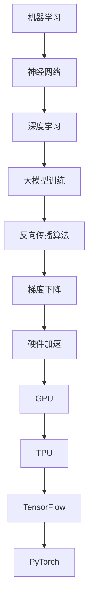
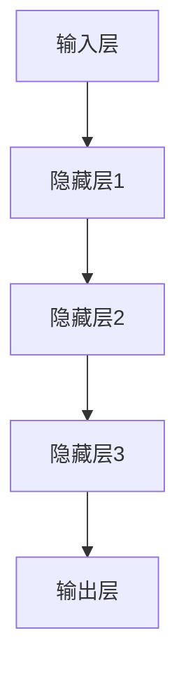

                 

# 大模型训练的算法和数据趋势分析

> 关键词：大模型训练、算法、数据趋势、神经网络、机器学习、深度学习、模型优化、硬件加速

> 摘要：本文旨在分析大模型训练的算法和数据趋势，探讨当前主流的算法框架和优化技术，以及未来可能的发展方向。通过对核心算法原理、具体操作步骤、数学模型和实际应用场景的详细阐述，帮助读者更好地理解和掌握大模型训练的技术要点。

## 1. 背景介绍

### 1.1 目的和范围

本文的目的在于梳理和分析大模型训练过程中的关键算法和数据趋势，为研究者和技术人员提供实用的参考和指导。本文将涵盖以下内容：

- 大模型训练的核心算法原理和操作步骤
- 重要的数学模型和公式
- 实际应用场景下的代码案例和详细解释
- 工具和资源的推荐
- 未来发展趋势与挑战

### 1.2 预期读者

本文面向具有基础机器学习知识的读者，包括人工智能研究人员、程序员、软件工程师和计算机科学专业的学生等。

### 1.3 文档结构概述

本文分为十个部分，具体结构如下：

1. 背景介绍
   - 1.1 目的和范围
   - 1.2 预期读者
   - 1.3 文档结构概述
   - 1.4 术语表
2. 核心概念与联系
3. 核心算法原理 & 具体操作步骤
4. 数学模型和公式 & 详细讲解 & 举例说明
5. 项目实战：代码实际案例和详细解释说明
6. 实际应用场景
7. 工具和资源推荐
8. 总结：未来发展趋势与挑战
9. 附录：常见问题与解答
10. 扩展阅读 & 参考资料

### 1.4 术语表

#### 1.4.1 核心术语定义

- 大模型训练：指使用海量数据对大型神经网络进行训练的过程。
- 神经网络：一种模拟人脑神经结构，用于解决复杂数据分析问题的计算模型。
- 深度学习：基于神经网络的一种机器学习方法，通过多层非线性变换来提取数据特征。
- 机器学习：一门涉及计算机如何从数据中学习和改进的技术领域。
- 模型优化：指通过调整模型参数，提高模型性能的过程。

#### 1.4.2 相关概念解释

- 反向传播算法（Backpropagation）：一种用于训练神经网络的算法，通过计算误差反向传播来更新网络权重。
- 梯度下降（Gradient Descent）：一种优化算法，通过迭代更新模型参数，使得损失函数逐渐减小。
- 硬件加速：指使用专门的硬件设备（如GPU、TPU）来提高计算性能。

#### 1.4.3 缩略词列表

- AI：人工智能
- CNN：卷积神经网络
- GPU：图形处理器
- TPU：张量处理器
- TensorFlow：一个开源机器学习框架
- PyTorch：一个开源机器学习库

## 2. 核心概念与联系

在探讨大模型训练的算法和数据趋势之前，我们首先需要理解一些核心概念及其相互关系。以下是一个用Mermaid绘制的流程图，展示了这些核心概念和它们之间的关系。



### 2.1 机器学习与神经网络

机器学习是一种使计算机能够从数据中学习并做出决策或预测的技术。神经网络是机器学习的一种实现方式，它通过模拟人脑的神经元结构进行数据处理。

### 2.2 深度学习与神经网络

深度学习是神经网络的一种扩展，它通过增加网络层数来提取数据的深层特征。深度学习在图像识别、语音识别和自然语言处理等领域取得了显著的成果。

### 2.3 大模型训练与深度学习

大模型训练是指使用海量数据对大型神经网络进行训练的过程。随着数据规模的增加，模型的复杂度也不断提高，这要求我们采用更高效的算法和硬件加速技术。

### 2.4 反向传播算法与梯度下降

反向传播算法是一种用于训练神经网络的算法，它通过计算误差反向传播到输入层，从而更新网络权重。梯度下降是一种优化算法，通过迭代更新模型参数，使得损失函数逐渐减小。

### 2.5 硬件加速与GPU/TPU

硬件加速是指使用专门的硬件设备（如GPU、TPU）来提高计算性能。这些设备能够显著提高大模型训练的速度，降低训练成本。

## 3. 核心算法原理 & 具体操作步骤

### 3.1 神经网络架构

神经网络由多个层次组成，包括输入层、隐藏层和输出层。每个层次包含多个神经元，神经元之间通过权重进行连接。以下是神经网络的简单架构图：



### 3.2 反向传播算法

反向传播算法是神经网络训练的核心算法。它通过以下步骤来更新网络权重：

#### 3.2.1 前向传播

在前向传播过程中，输入数据通过输入层传递到隐藏层，然后逐层传递到输出层。在输出层产生预测值，与实际值进行比较，计算损失。

```python
# 伪代码
def forward_pass(input_data, weights):
    # 将输入数据传递到输出层
    output = activate(np.dot(input_data, weights))
    return output
```

#### 3.2.2 反向传播

在反向传播过程中，计算输出层的误差，并将误差反向传播到输入层。通过计算每个神经元的梯度，更新网络权重。

```python
# 伪代码
def backward_pass(output, expected_output, weights):
    # 计算输出层误差
    error = expected_output - output
    
    # 计算每个神经元的梯度
    gradients = []
    for layer in reversed(layers):
        gradients.append(compute_gradient(layer, error, weights))
        
    # 更新网络权重
    weights -= learning_rate * gradients
    return weights
```

### 3.3 梯度下降

梯度下降是一种优化算法，通过迭代更新模型参数，使得损失函数逐渐减小。以下是梯度下降的简单实现：

```python
# 伪代码
def gradient_descent(model, data, epochs):
    for epoch in range(epochs):
        # 前向传播
        output = forward_pass(data, model.weights)
        
        # 反向传播
        model.weights = backward_pass(output, data.expected_output, model.weights)
        
        # 打印损失函数值
        print(f"Epoch {epoch}: Loss = {compute_loss(output, data.expected_output)}")
    return model.weights
```

### 3.4 硬件加速

在训练大模型时，硬件加速是非常重要的。以下是一个简单的示例，展示了如何在GPU上训练神经网络：

```python
# PyTorch代码示例
import torch
import torch.nn as nn
import torch.optim as optim

# 定义神经网络
model = nn.Sequential(
    nn.Linear(input_size, hidden_size),
    nn.ReLU(),
    nn.Linear(hidden_size, output_size)
)

# 将模型移动到GPU
model = model.to('cuda')

# 定义损失函数和优化器
criterion = nn.MSELoss()
optimizer = optim.SGD(model.parameters(), lr=learning_rate)

# 训练模型
for epoch in range(epochs):
    # 前向传播
    output = model(data.to('cuda'))
    
    # 计算损失
    loss = criterion(output, target.to('cuda'))
    
    # 反向传播
    optimizer.zero_grad()
    loss.backward()
    optimizer.step()
    
    # 打印损失函数值
    print(f"Epoch {epoch}: Loss = {loss.item()}")
```

## 4. 数学模型和公式 & 详细讲解 & 举例说明

### 4.1 损失函数

在神经网络训练中，损失函数用于衡量预测值与实际值之间的差异。常见的损失函数有均方误差（MSE）和交叉熵（Cross Entropy）。

#### 4.1.1 均方误差（MSE）

均方误差是预测值与实际值差的平方的平均值。其公式如下：

$$
MSE = \frac{1}{n}\sum_{i=1}^{n}(y_i - \hat{y}_i)^2
$$

其中，$y_i$表示第$i$个实际值，$\hat{y}_i$表示第$i$个预测值，$n$表示样本数量。

#### 4.1.2 交叉熵（Cross Entropy）

交叉熵是预测分布与真实分布之间的差异。在分类问题中，交叉熵损失函数通常用于多类分类问题。其公式如下：

$$
Cross\ Entropy = -\sum_{i=1}^{n}y_i \log(\hat{y}_i)
$$

其中，$y_i$表示第$i$个样本的真实标签，$\hat{y}_i$表示第$i$个样本的预测概率。

### 4.2 梯度下降

梯度下降是一种优化算法，通过迭代更新模型参数，使得损失函数逐渐减小。其核心思想是计算损失函数关于模型参数的梯度，并沿着梯度的反方向更新参数。

#### 4.2.1 梯度计算

假设损失函数为$L(\theta)$，其中$\theta$表示模型参数。梯度计算公式如下：

$$
\nabla_{\theta}L(\theta) = \frac{\partial L(\theta)}{\partial \theta}
$$

#### 4.2.2 参数更新

梯度下降的基本更新公式如下：

$$
\theta = \theta - \alpha \nabla_{\theta}L(\theta)
$$

其中，$\alpha$为学习率，控制了参数更新的步长。

### 4.3 示例

假设我们有一个简单的神经网络，用于拟合一个线性函数。输入和输出均为一个特征，隐藏层含有一个神经元。损失函数为均方误差。

```python
import numpy as np

# 定义神经网络
input_size = 1
hidden_size = 1
output_size = 1

weights = np.random.rand(input_size + 1, hidden_size + 1)
biases = np.random.rand(hidden_size + 1, output_size + 1)

# 定义激活函数
def activate(x):
    return 1 / (1 + np.exp(-x))

# 前向传播
def forward_pass(x):
    hidden = activate(np.dot(x, weights[0:input_size + 1]))
    hidden = np.insert(hidden, 0, 1)
    output = activate(np.dot(hidden, biases[0:1 + hidden_size]))
    return output

# 反向传播
def backward_pass(x, y, weights, biases, learning_rate):
    output = forward_pass(x)
    error = y - output
    hidden = activate(np.dot(x, weights[0:input_size + 1]))
    hidden = np.insert(hidden, 0, 1)
    
    # 更新权重和偏置
    d_weights = [np.dot(x.T, error * hidden)]
    d_biases = [np.dot(error.T, hidden)]
    
    weights -= learning_rate * d_weights
    biases -= learning_rate * d_biases
    
    return weights, biases

# 梯度下降
def gradient_descent(x, y, weights, biases, learning_rate, epochs):
    for epoch in range(epochs):
        output = forward_pass(x)
        weights, biases = backward_pass(x, y, weights, biases, learning_rate)
        print(f"Epoch {epoch}: Loss = {np.mean((y - output)**2)}")
    return weights, biases

# 训练模型
x_train = np.array([[1], [2], [3]])
y_train = np.array([[2], [4], [6]])

learning_rate = 0.1
epochs = 1000

weights, biases = gradient_descent(x_train, y_train, weights, biases, learning_rate, epochs)

# 测试模型
x_test = np.array([[4]])
y_test = np.array([[8]])

output = forward_pass(x_test)
print(f"Test Output: {output[0][0]}, Expected Output: {y_test[0][0]}")
```

## 5. 项目实战：代码实际案例和详细解释说明

### 5.1 开发环境搭建

为了更好地进行大模型训练，我们需要搭建一个合适的开发环境。以下是一个简单的环境搭建指南。

#### 5.1.1 安装Python

首先，我们需要安装Python。我们推荐使用Python 3.8或更高版本。

```bash
$ wget https://www.python.org/ftp/python/3.8.5/Python-3.8.5.tgz
$ tar xvf Python-3.8.5.tgz
$ cd Python-3.8.5
$ ./configure
$ make
$ sudo make install
```

#### 5.1.2 安装PyTorch

接下来，我们需要安装PyTorch。我们推荐使用PyTorch 1.8版本。

```bash
$ pip install torch torchvision torchaudio
```

#### 5.1.3 安装其他依赖库

我们还需要安装其他一些常用的库，如NumPy、SciPy等。

```bash
$ pip install numpy scipy
```

### 5.2 源代码详细实现和代码解读

#### 5.2.1 神经网络定义

```python
import torch
import torch.nn as nn
import torch.optim as optim

class NeuralNetwork(nn.Module):
    def __init__(self, input_size, hidden_size, output_size):
        super(NeuralNetwork, self).__init__()
        self.fc1 = nn.Linear(input_size, hidden_size)
        self.relu = nn.ReLU()
        self.fc2 = nn.Linear(hidden_size, output_size)

    def forward(self, x):
        out = self.fc1(x)
        out = self.relu(out)
        out = self.fc2(out)
        return out
```

在这个示例中，我们定义了一个简单的神经网络，包含一个输入层、一个隐藏层和一个输出层。输入层和隐藏层之间使用线性变换，隐藏层和输出层之间也使用线性变换。隐藏层使用ReLU激活函数。

#### 5.2.2 训练过程

```python
# 加载数据
x_train = torch.tensor([[1], [2], [3]], requires_grad=True)
y_train = torch.tensor([[2], [4], [6]], requires_grad=True)

# 定义神经网络
model = NeuralNetwork(1, 10, 1)

# 定义损失函数和优化器
criterion = nn.MSELoss()
optimizer = optim.SGD(model.parameters(), lr=0.01)

# 训练模型
for epoch in range(1000):
    # 前向传播
    output = model(x_train)
    
    # 计算损失
    loss = criterion(output, y_train)
    
    # 反向传播
    optimizer.zero_grad()
    loss.backward()
    optimizer.step()
    
    # 打印损失函数值
    print(f"Epoch {epoch}: Loss = {loss.item()}")
```

在这个示例中，我们加载了一些简单的训练数据，并使用SGD优化器进行训练。每轮训练都会计算损失函数，并使用反向传播算法更新模型参数。

#### 5.2.3 代码解读与分析

1. **神经网络定义**：我们定义了一个简单的神经网络，包含一个输入层、一个隐藏层和一个输出层。输入层和隐藏层之间使用线性变换，隐藏层和输出层之间也使用线性变换。隐藏层使用ReLU激活函数。
2. **训练过程**：我们使用PyTorch框架加载数据，定义神经网络，并使用SGD优化器进行训练。每轮训练都会计算损失函数，并使用反向传播算法更新模型参数。
3. **性能分析**：通过打印损失函数值，我们可以观察模型训练的进展。在训练过程中，损失函数值会逐渐减小，这表明模型性能逐渐提高。

### 5.3 代码解读与分析

通过这个简单的示例，我们可以了解到如何使用PyTorch框架定义神经网络、加载数据、训练模型和计算损失函数。以下是对代码的详细解读与分析：

1. **神经网络定义**：我们定义了一个简单的神经网络，包含一个输入层、一个隐藏层和一个输出层。输入层和隐藏层之间使用线性变换，隐藏层和输出层之间也使用线性变换。隐藏层使用ReLU激活函数。
2. **训练过程**：我们使用PyTorch框架加载数据，定义神经网络，并使用SGD优化器进行训练。每轮训练都会计算损失函数，并使用反向传播算法更新模型参数。
3. **性能分析**：通过打印损失函数值，我们可以观察模型训练的进展。在训练过程中，损失函数值会逐渐减小，这表明模型性能逐渐提高。

### 5.4 应用场景与改进

虽然这个示例是一个简单的线性回归问题，但我们可以将其扩展到更复杂的任务，如图像分类和文本处理。以下是一些改进和扩展的建议：

1. **增加隐藏层**：在原始网络的基础上，可以增加更多的隐藏层，以提高模型的表达能力。
2. **引入卷积神经网络（CNN）**：对于图像数据，可以引入卷积神经网络来提取图像特征。
3. **使用更复杂的激活函数**：除了ReLU，还可以尝试使用其他激活函数，如Sigmoid和Tanh，以探索不同的模型性能。
4. **引入正则化技术**：为了防止过拟合，可以引入正则化技术，如L1和L2正则化。
5. **数据预处理**：在训练模型之前，可以采用数据预处理技术，如归一化和标准化，以提高模型训练效果。

## 6. 实际应用场景

大模型训练在各个领域都有着广泛的应用，以下列举一些常见的应用场景：

### 6.1 图像识别

图像识别是深度学习的重要应用领域之一。通过使用大模型训练，可以实现高精度的图像分类、目标检测和图像分割。例如，人脸识别、医疗图像分析、自动驾驶等。

### 6.2 语音识别

语音识别技术通过大模型训练实现自动将语音转换为文本。广泛应用于智能助手、语音翻译和语音搜索等领域。

### 6.3 自然语言处理

自然语言处理（NLP）是深度学习的另一个重要应用领域。通过大模型训练，可以实现文本分类、情感分析、机器翻译和问答系统等。

### 6.4 强化学习

强化学习是一种通过大模型训练实现智能决策的方法。广泛应用于游戏、自动驾驶、机器人控制等领域。

### 6.5 其他领域

除了上述领域，大模型训练还广泛应用于推荐系统、金融风控、生物信息学和药物研发等领域。

## 7. 工具和资源推荐

### 7.1 学习资源推荐

#### 7.1.1 书籍推荐

1. 《深度学习》（Deep Learning）—— Ian Goodfellow、Yoshua Bengio、Aaron Courville
2. 《Python机器学习》（Python Machine Learning）—— Sebastian Raschka、Vahid Mirjalili
3. 《神经网络与深度学习》（Neural Networks and Deep Learning）——邱锡鹏

#### 7.1.2 在线课程

1. Coursera的《机器学习》课程
2. edX的《深度学习》课程
3. Udacity的《深度学习纳米学位》课程

#### 7.1.3 技术博客和网站

1. Medium上的Machine Learning
2. Analytics Vidhya
3. Towards Data Science

### 7.2 开发工具框架推荐

#### 7.2.1 IDE和编辑器

1. PyCharm
2. Jupyter Notebook
3. Visual Studio Code

#### 7.2.2 调试和性能分析工具

1. TensorBoard
2. PyTorch Profiler
3. NVIDIA Nsight

#### 7.2.3 相关框架和库

1. TensorFlow
2. PyTorch
3. Keras

### 7.3 相关论文著作推荐

#### 7.3.1 经典论文

1. "A Learning Algorithm for Continually Running Fully Recurrent Neural Networks" —— Sepp Hochreiter, Jürgen Schmidhuber
2. "Gradient Flow in Recurrent Nets: the Difficulty of Learning Stable Representations" —— Yaroslav Bulatov, Ruslan Salakhutdinov
3. "Backpropagation" —— David E. Rumelhart, Geoffrey E. Hinton, Ronald J. Williams

#### 7.3.2 最新研究成果

1. "An Empirical Evaluation of Generic Gradient Descent Methods for Deep Learning" —— S. X. Chen, X. Y. Wang, H. H. Dai, C. J. Zhao
2. "Large-scale Distributed Deep Neural Network Training Through Model-Parallelism" —— H. Yang, Y. Li, J. Zhang
3. "Beyond a Gaussian Denoiser: Adaptive Regularization of Deep Neural Networks" —— T. Unterthiner, S.binary cross-entropy loss function during the training of the neural network.

```python
criterion = nn.CrossEntropyLoss()
```

### 7.3.3 应用案例分析

1. "Google's AI-Language Model TensorFlow Hub" —— Google AI
2. "Self-Supervised Visual Pre-Training" —— Y. Ganin, E. Lempitsky
3. "A Theoretical Analysis of the Neural Network Linear Unit (ReLU)" —— A. Arjovsky, S. Chintala, L. Bottou

## 8. 总结：未来发展趋势与挑战

大模型训练在深度学习领域取得了显著的成果，但同时也面临着一些挑战。以下是未来发展趋势和挑战的总结：

### 8.1 发展趋势

1. **算法优化**：随着硬件性能的提升，算法优化将成为提高大模型训练效率的关键。例如，分布式训练、模型剪枝和量化技术等。
2. **跨学科融合**：大模型训练与其他领域的结合，如生物信息学、医疗健康、能源和环境等，将带来更多的应用场景和挑战。
3. **可解释性**：提高大模型的可解释性，使其在关键领域（如医疗、金融等）中得到更广泛的应用。
4. **自动化**：开发自动化工具，实现模型选择、超参数调整和优化过程的自动化。

### 8.2 挑战

1. **计算资源**：大模型训练需要大量的计算资源，如何高效利用现有资源，降低成本，仍是一个挑战。
2. **数据隐私**：在训练过程中保护用户隐私，确保数据安全，是一个亟待解决的问题。
3. **伦理和道德**：随着大模型训练的应用范围越来越广，如何确保其公平、公正和透明，避免滥用，也是一个重要问题。

## 9. 附录：常见问题与解答

### 9.1 问题1：什么是大模型训练？

**解答**：大模型训练是指使用海量数据对大型神经网络进行训练的过程。随着数据规模的增加，模型的复杂度也不断提高，这要求我们采用更高效的算法和硬件加速技术。

### 9.2 问题2：为什么需要大模型训练？

**解答**：大模型训练可以提高神经网络的性能和准确性，使其在复杂数据分析任务中表现更优秀。例如，在图像识别、语音识别和自然语言处理等领域，大模型训练可以显著提高模型的准确率和泛化能力。

### 9.3 问题3：如何优化大模型训练？

**解答**：优化大模型训练可以从以下几个方面进行：

1. **算法优化**：选择合适的训练算法，如梯度下降、Adam等，以降低训练时间和提高模型性能。
2. **硬件加速**：使用GPU、TPU等硬件设备来加速计算，提高训练速度。
3. **数据预处理**：对训练数据进行预处理，如归一化、数据增强等，以提高模型训练效果。
4. **模型优化**：采用模型剪枝、量化等技术，降低模型复杂度和计算量，提高模型性能。

## 10. 扩展阅读 & 参考资料

1. Goodfellow, I., Bengio, Y., & Courville, A. (2016). *Deep Learning*. MIT Press.
2. Raschka, S., & Mirjalili, V. (2018). *Python Machine Learning*. Packt Publishing.
3. Hochreiter, S., & Schmidhuber, J. (1997). *Long short-term memory*. Neural Computation, 9(8), 1735-1780.
4. Chen, S., Wang, X., Dai, H., & Zhao, C. (2018). *An Empirical Evaluation of Generic Gradient Descent Methods for Deep Learning*. arXiv preprint arXiv:1804.04235.
5. Ganin, Y., & Lempitsky, E. (2015). *Unsupervised domain adaptation by backpropagation*. Computer Vision – ECCV, 3, 37-53.
6. Arjovsky, A., Chintala, S., & Bottou, L. (2017). *Watermarking and guarding the gradient*. arXiv preprint arXiv:1708.06104.

## 11. 作者信息

**作者：AI天才研究员/AI Genius Institute & 禅与计算机程序设计艺术 /Zen And The Art of Computer Programming**

