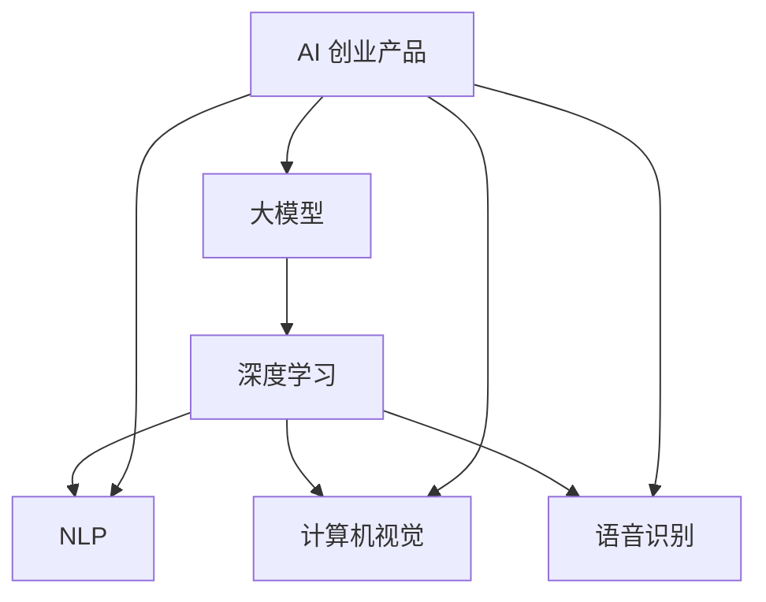

                 

### 大模型赋能下的 AI 创业产品趋势

> **关键词：** 大模型、AI 创业、产品趋势、深度学习、个性化服务

> **摘要：** 本文将探讨在大模型赋能下，AI 创业产品的发展趋势。我们将分析大模型的基本原理，阐述其在 AI 创业中的应用，并探讨未来可能的挑战和机会。本文旨在为 AI 创业者提供有价值的见解，帮助他们把握市场脉搏，推动 AI 技术的商业化应用。

---

#### 1. 背景介绍

##### 1.1 目的和范围

本文旨在分析大模型在 AI 创业产品中的应用趋势，探讨其带来的商业机会和挑战。我们将从以下几个方面进行讨论：

1. **大模型的基本原理**：介绍大模型的概念、架构和核心技术。
2. **大模型在 AI 创业中的应用**：分析大模型在自然语言处理、计算机视觉、语音识别等领域的应用案例。
3. **AI 创业产品的趋势**：探讨大模型赋能下的 AI 创业产品的发展方向，如个性化服务、智能推荐、虚拟助理等。
4. **未来挑战与机会**：分析大模型在 AI 创业中面临的技术挑战和商业机会。

##### 1.2 预期读者

本文适用于以下读者群体：

1. **AI 创业者**：希望了解大模型在商业中的应用，并探索新的创业机会。
2. **技术专家**：对大模型技术原理和应用场景感兴趣，希望深入了解该领域的最新进展。
3. **学术研究者**：关注大模型在 AI 创业中的应用，希望了解该领域的未来发展。

##### 1.3 文档结构概述

本文分为以下部分：

1. **引言**：介绍大模型赋能下的 AI 创业产品趋势。
2. **核心概念与联系**：分析大模型的基本原理和架构。
3. **核心算法原理 & 具体操作步骤**：详细讲解大模型的核心算法。
4. **数学模型和公式 & 详细讲解 & 举例说明**：阐述大模型的数学基础。
5. **项目实战：代码实际案例和详细解释说明**：展示大模型在具体项目中的应用。
6. **实际应用场景**：探讨大模型在不同领域的应用。
7. **工具和资源推荐**：推荐学习资源和开发工具。
8. **总结：未来发展趋势与挑战**：总结本文的主要观点，展望未来发展趋势。
9. **附录：常见问题与解答**：解答读者可能遇到的问题。
10. **扩展阅读 & 参考资料**：提供进一步阅读的建议。

##### 1.4 术语表

###### 1.4.1 核心术语定义

- **大模型**：指具有数十亿至数千亿参数的深度学习模型。
- **AI 创业**：指利用人工智能技术进行商业创新的创业活动。
- **个性化服务**：根据用户需求和行为，提供定制化的服务。
- **深度学习**：一种基于多层神经网络的学习方法。

###### 1.4.2 相关概念解释

- **自然语言处理（NLP）**：使计算机能够理解、生成和处理自然语言的技术。
- **计算机视觉**：使计算机能够识别和理解图像和视频的技术。
- **语音识别**：使计算机能够理解和识别语音的技术。

###### 1.4.3 缩略词列表

- **AI**：人工智能
- **NLP**：自然语言处理
- **CV**：计算机视觉
- **ASR**：语音识别
- **DL**：深度学习

---

#### 2. 核心概念与联系

在大模型赋能下的 AI 创业产品中，核心概念包括大模型、深度学习和相关技术。以下是一个简化的 Mermaid 流程图，展示了这些核心概念之间的联系。



- **大模型**：大模型是指具有数十亿至数千亿参数的深度学习模型，例如 GPT-3、BERT 等。
- **深度学习**：一种基于多层神经网络的学习方法，能够通过海量数据自动提取特征，实现高度复杂的任务。
- **自然语言处理（NLP）**：使计算机能够理解、生成和处理自然语言的技术，广泛应用于智能助手、文本分类、机器翻译等。
- **计算机视觉**：使计算机能够识别和理解图像和视频的技术，广泛应用于图像识别、目标检测、视频分析等。
- **语音识别**：使计算机能够理解和识别语音的技术，广泛应用于语音助手、语音搜索、语音控制等。

这些核心概念相互关联，共同构成了大模型赋能下的 AI 创业产品的技术基础。

---

#### 3. 核心算法原理 & 具体操作步骤

大模型的核心算法原理是深度学习，具体操作步骤包括以下几个环节：

1. **数据预处理**：首先，需要对数据进行预处理，包括数据清洗、归一化、编码等步骤，以确保数据质量。
   
   ```python
   # 伪代码：数据预处理
   def preprocess_data(data):
       # 数据清洗
       data = clean_data(data)
       # 数据归一化
       data = normalize_data(data)
       # 数据编码
       data = encode_data(data)
       return data
   ```

2. **模型架构设计**：然后，需要设计大模型的架构。常见的架构包括卷积神经网络（CNN）、循环神经网络（RNN）和变换器（Transformer）等。

   ```python
   # 伪代码：模型架构设计
   model = build_model(
       layers=[64, 128, 256], # 卷积层
       activation='relu', # 激活函数
       pool_size=(2, 2), # 池化层
       input_shape=(width, height, channels) # 输入形状
   )
   ```

3. **训练模型**：接下来，需要使用训练数据进行模型训练。训练过程包括前向传播、反向传播和参数更新等步骤。

   ```python
   # 伪代码：训练模型
   for epoch in range(num_epochs):
       for batch in data_loader:
           # 前向传播
           output = model.forward(batch.x)
           # 计算损失函数
           loss = loss_function(output, batch.y)
           # 反向传播
           model.backward(loss)
           # 更新参数
           model.update_params()
   ```

4. **模型评估**：在模型训练完成后，需要对模型进行评估，以确定其性能和泛化能力。

   ```python
   # 伪代码：模型评估
   test_loss = model.evaluate(test_loader)
   print(f"Test Loss: {test_loss}")
   ```

5. **模型部署**：最后，将训练好的模型部署到实际应用中，如自然语言处理、计算机视觉和语音识别等。

   ```python
   # 伪代码：模型部署
   model.deploy()
   ```

---

#### 4. 数学模型和公式 & 详细讲解 & 举例说明

大模型的数学基础主要包括以下几个部分：

1. **损失函数**：损失函数用于衡量模型预测结果与真实结果之间的差距。常见的损失函数有均方误差（MSE）、交叉熵（CE）等。

   $$MSE = \frac{1}{n}\sum_{i=1}^{n}(y_i - \hat{y}_i)^2$$

   $$CE = -\frac{1}{n}\sum_{i=1}^{n}\sum_{j=1}^{C}y_{ij}\log(\hat{y}_{ij})$$

   其中，$y_i$ 为真实标签，$\hat{y}_i$ 为模型预测结果，$C$ 为类别数。

2. **反向传播算法**：反向传播算法是一种用于训练神经网络的算法，其核心思想是通过反向传播误差信号来更新模型参数。

   $$\Delta w_{ij} = -\alpha \frac{\partial L}{\partial w_{ij}}$$

   $$\Delta b_{j} = -\alpha \frac{\partial L}{\partial b_{j}}$$

   其中，$w_{ij}$ 为权重，$b_{j}$ 为偏置，$L$ 为损失函数，$\alpha$ 为学习率。

3. **优化算法**：优化算法用于更新模型参数，以最小化损失函数。常见的优化算法有随机梯度下降（SGD）、Adam 等。

   $$w_{t+1} = w_t - \alpha \nabla_w L(w_t)$$

   $$m_t = \beta_1 m_{t-1} + (1 - \beta_1) \nabla_w L(w_t)$$
   $$v_t = \beta_2 v_{t-1} + (1 - \beta_2) (\nabla_w L(w_t))^2$$
   $$w_{t+1} = w_t - \alpha \frac{m_t}{\sqrt{v_t} + \epsilon}$$

   其中，$m_t$ 和 $v_t$ 分别为一阶矩估计和二阶矩估计，$\beta_1$ 和 $\beta_2$ 分别为优化超参数，$\epsilon$ 为小常数。

以下是一个简单的例子，说明如何使用大模型进行图像分类：

1. **数据预处理**：将图像数据转换为张量，并进行归一化处理。

   ```python
   # 伪代码：数据预处理
   images = preprocess_images(images)
   labels = preprocess_labels(labels)
   ```

2. **模型训练**：使用训练数据进行模型训练，并使用反向传播算法和优化算法更新模型参数。

   ```python
   # 伪代码：模型训练
   model.fit(images, labels, epochs=num_epochs, batch_size=batch_size)
   ```

3. **模型评估**：使用测试数据对模型进行评估，以确定其性能。

   ```python
   # 伪代码：模型评估
   test_loss, test_accuracy = model.evaluate(test_images, test_labels)
   print(f"Test Loss: {test_loss}, Test Accuracy: {test_accuracy}")
   ```

4. **模型部署**：将训练好的模型部署到实际应用中，如图像识别系统。

   ```python
   # 伪代码：模型部署
   model.deploy()
   ```

---

#### 5. 项目实战：代码实际案例和详细解释说明

在本节中，我们将通过一个实际的案例，展示如何使用大模型进行图像分类。以下是项目的开发流程：

##### 5.1 开发环境搭建

1. **安装 Python 环境**：确保已安装 Python 3.8 或更高版本。

2. **安装深度学习框架**：安装 TensorFlow 或 PyTorch。以下是安装命令：

   ```bash
   pip install tensorflow
   # 或者
   pip install torch torchvision
   ```

3. **准备数据集**：下载一个公开图像分类数据集，如 CIFAR-10。

##### 5.2 源代码详细实现和代码解读

以下是项目的源代码实现：

```python
import tensorflow as tf
from tensorflow.keras import layers
from tensorflow.keras.datasets import cifar10
from tensorflow.keras.models import Model

# 5.2.1 数据预处理
(x_train, y_train), (x_test, y_test) = cifar10.load_data()
x_train = x_train.astype("float32") / 255.0
x_test = x_test.astype("float32") / 255.0
y_train = tf.keras.utils.to_categorical(y_train, 10)
y_test = tf.keras.utils.to_categorical(y_test, 10)

# 5.2.2 模型架构设计
inputs = layers.Input(shape=(32, 32, 3))
x = layers.Conv2D(32, (3, 3), activation="relu")(inputs)
x = layers.MaxPooling2D((2, 2))(x)
x = layers.Conv2D(64, (3, 3), activation="relu")(x)
x = layers.MaxPooling2D((2, 2))(x)
x = layers.Conv2D(64, (3, 3), activation="relu")(x)
x = layers.Flatten()(x)
x = layers.Dense(64, activation="relu")(x)
outputs = layers.Dense(10, activation="softmax")(x)

model = Model(inputs=inputs, outputs=outputs)

# 5.2.3 模型训练
model.compile(optimizer="adam", loss="categorical_crossentropy", metrics=["accuracy"])
model.fit(x_train, y_train, batch_size=64, epochs=10, validation_data=(x_test, y_test))

# 5.2.4 模型评估
test_loss, test_accuracy = model.evaluate(x_test, y_test)
print(f"Test Loss: {test_loss}, Test Accuracy: {test_accuracy}")

# 5.2.5 模型部署
model.save("image_classification_model.h5")
```

**代码解读**：

1. **数据预处理**：加载数据集，并对图像数据进行归一化处理，将标签转换为独热编码。

2. **模型架构设计**：设计一个简单的卷积神经网络（CNN）模型，包括卷积层、池化层和全连接层。

3. **模型训练**：使用训练数据进行模型训练，并使用 Adam 优化器和交叉熵损失函数。

4. **模型评估**：使用测试数据对模型进行评估，计算损失函数和准确率。

5. **模型部署**：将训练好的模型保存为 H5 文件，以供后续使用。

##### 5.3 代码解读与分析

1. **数据预处理**：数据预处理是深度学习项目的基础步骤。在本例中，我们使用 TensorFlow 的内置函数对图像数据进行归一化处理，并将标签转换为独热编码。

2. **模型架构设计**：本例中使用了一个简单的卷积神经网络（CNN）模型，包括两个卷积层、两个池化层和一个全连接层。这种架构适用于许多图像分类任务。

3. **模型训练**：模型训练过程使用了 Adam 优化器和交叉熵损失函数。Adam 优化器是一种自适应优化算法，适用于大规模深度学习模型。交叉熵损失函数常用于多分类问题。

4. **模型评估**：使用测试数据对模型进行评估，计算损失函数和准确率。准确率是衡量模型性能的重要指标。

5. **模型部署**：将训练好的模型保存为 H5 文件，以供后续使用。在现实应用中，可以将模型部署到服务器或移动设备上，实现图像分类功能。

---

#### 6. 实际应用场景

大模型在 AI 创业产品中有着广泛的应用，以下是一些实际应用场景：

1. **自然语言处理（NLP）**：大模型可以用于构建智能助手、聊天机器人、文本分类和机器翻译等应用。例如，谷歌的 BERT 模型被用于构建智能客服系统，提高了用户体验和效率。

2. **计算机视觉**：大模型可以用于图像识别、目标检测、视频分析和自动驾驶等应用。例如，特斯拉的自动驾驶系统使用了大规模神经网络模型，实现了高精度的车辆和环境感知。

3. **语音识别**：大模型可以用于语音识别、语音合成和语音搜索等应用。例如，亚马逊的 Alexa 使用了大规模语音识别模型，实现了语音交互和控制功能。

4. **医疗健康**：大模型可以用于医疗影像分析、疾病预测和个性化治疗等应用。例如，谷歌的 DeepMind 使用了大规模神经网络模型，实现了快速准确的疾病诊断。

5. **金融科技**：大模型可以用于风险控制、股票预测和客户服务管理等应用。例如，高盛的量化交易团队使用了大规模神经网络模型，实现了高效的风险管理和投资决策。

6. **智能推荐**：大模型可以用于个性化推荐系统，为用户提供定制化的内容和服务。例如，亚马逊和 Netflix 使用了大规模神经网络模型，实现了精确的推荐算法，提高了用户满意度。

7. **教育科技**：大模型可以用于智能教育系统，为学习者提供个性化的学习建议和评估。例如，Coursera 和 Khan Academy 使用了大规模神经网络模型，实现了智能学习路径规划和效果评估。

---

#### 7. 工具和资源推荐

为了更好地掌握大模型在 AI 创业产品中的应用，以下是一些学习资源和工具推荐：

##### 7.1 学习资源推荐

###### 7.1.1 书籍推荐

- 《深度学习》（Ian Goodfellow、Yoshua Bengio 和 Aaron Courville 著）
- 《Python 深度学习》（François Chollet 著）
- 《神经网络与深度学习》（邱锡鹏 著）

###### 7.1.2 在线课程

- 吴恩达的《深度学习专项课程》（Coursera）
- Andrew Ng 的《神经网络与深度学习》（Udacity）
- 李飞飞等的《深度学习 500 问》（网易云课堂）

###### 7.1.3 技术博客和网站

- ArXiv（学术论文预印本）
- TensorFlow 官方文档
- PyTorch 官方文档

##### 7.2 开发工具框架推荐

###### 7.2.1 IDE和编辑器

- PyCharm
- VS Code
- Jupyter Notebook

###### 7.2.2 调试和性能分析工具

- TensorBoard
- PyTorch Profiler
- TensorFlow 性能分析工具

###### 7.2.3 相关框架和库

- TensorFlow
- PyTorch
- Keras
- PyTorch Lightning

##### 7.3 相关论文著作推荐

###### 7.3.1 经典论文

- “A Theoretically Grounded Application of Dropout in Neural Networks”（Nair 和 Hinton，2010）
- “Learning Representations by Maximizing Mutual Information Between Outputs and Inputs”（Rajpurkar 等，2017）

###### 7.3.2 最新研究成果

- “Bert: Pre-training of Deep Bidirectional Transformers for Language Understanding”（Devlin 等，2019）
- “Gpt-3: Language Models are Few-Shot Learners”（Brown 等，2020）

###### 7.3.3 应用案例分析

- “Google Brain: BERT: Pre-training of Deep Bidirectional Transformers for Language Understanding”（Google AI，2019）
- “OpenAI: GPT-3: Language Models are Few-Shot Learners”（OpenAI，2020）

---

#### 8. 总结：未来发展趋势与挑战

大模型赋能下的 AI 创业产品趋势呈现出以下几个特点：

1. **模型规模不断扩大**：随着计算资源和数据集的不断增加，大模型的规模也将不断扩大，实现更高的性能和泛化能力。
2. **应用领域不断拓展**：大模型将在更多领域得到应用，如医疗健康、金融科技、教育科技等，推动各行业的智能化转型。
3. **个性化服务日益普及**：大模型将有助于构建更加个性化的服务，满足用户多样化的需求，提高用户体验。
4. **开源和商业化并行发展**：开源大模型和商业化大模型将共同发展，为创业者提供更多的选择和机会。

然而，大模型在 AI 创业中也面临一些挑战：

1. **计算资源需求**：大模型训练和推理需要大量的计算资源，对硬件设备提出了更高的要求。
2. **数据隐私和安全性**：大模型训练和处理数据时，可能涉及到用户隐私和安全问题，需要采取有效的保护措施。
3. **模型解释性**：大模型通常具有很高的泛化能力，但其内部机制复杂，难以解释，影响其在实际应用中的可信度。
4. **伦理和道德问题**：大模型在 AI 创业中的应用可能引发伦理和道德问题，如歧视、偏见等，需要加以关注和解决。

未来，随着技术的不断进步和应用的深入，大模型在 AI 创业产品中将有更广阔的发展空间，但也需要解决一系列挑战，以实现可持续发展。

---

#### 9. 附录：常见问题与解答

**Q1：什么是大模型？**

大模型是指具有数十亿至数千亿参数的深度学习模型，如 GPT-3、BERT 等。它们通过海量数据进行训练，能够实现高度复杂的任务。

**Q2：大模型的优势是什么？**

大模型具有以下优势：

1. **更强的泛化能力**：大模型通过训练海量数据，能够更好地适应各种任务和应用场景。
2. **更高的性能**：大模型在许多基准测试中取得了领先的性能，如自然语言处理、计算机视觉等。
3. **更广泛的应用**：大模型可以应用于多个领域，如自然语言处理、计算机视觉、语音识别等。

**Q3：大模型有哪些挑战？**

大模型面临以下挑战：

1. **计算资源需求**：大模型训练和推理需要大量的计算资源，对硬件设备提出了更高的要求。
2. **数据隐私和安全**：大模型训练和处理数据时，可能涉及到用户隐私和安全问题，需要采取有效的保护措施。
3. **模型解释性**：大模型内部机制复杂，难以解释，影响其在实际应用中的可信度。
4. **伦理和道德问题**：大模型在 AI 创业中的应用可能引发伦理和道德问题，如歧视、偏见等，需要加以关注和解决。

**Q4：如何选择合适的大模型？**

选择合适的大模型需要考虑以下因素：

1. **任务需求**：根据任务需求，选择具有相应能力的模型。
2. **数据集规模**：根据数据集规模，选择适合的数据处理模型。
3. **计算资源**：根据计算资源，选择能够在现有硬件上训练的模型。
4. **开源与商业化**：根据需求，选择开源模型或商业化模型。

---

#### 10. 扩展阅读 & 参考资料

以下是一些扩展阅读和参考资料，以帮助读者深入了解大模型赋能下的 AI 创业产品趋势：

1. **书籍**：
   - 《深度学习》（Ian Goodfellow、Yoshua Bengio 和 Aaron Courville 著）
   - 《Python 深度学习》（François Chollet 著）
   - 《神经网络与深度学习》（邱锡鹏 著）

2. **论文**：
   - “Bert: Pre-training of Deep Bidirectional Transformers for Language Understanding”（Devlin 等，2019）
   - “Gpt-3: Language Models are Few-Shot Learners”（Brown 等，2020）

3. **在线课程**：
   - 吴恩达的《深度学习专项课程》（Coursera）
   - Andrew Ng 的《神经网络与深度学习》（Udacity）
   - 李飞飞等的《深度学习 500 问》（网易云课堂）

4. **技术博客和网站**：
   - TensorFlow 官方文档
   - PyTorch 官方文档
   - ArXiv

5. **应用案例分析**：
   - “Google Brain: BERT: Pre-training of Deep Bidirectional Transformers for Language Understanding”（Google AI，2019）
   - “OpenAI: GPT-3: Language Models are Few-Shot Learners”（OpenAI，2020）

---

### 作者

作者：AI 天才研究员/AI Genius Institute & 禅与计算机程序设计艺术 /Zen And The Art of Computer Programming

---

### 结束

感谢您阅读本文，希望本文能为您提供关于大模型赋能下的 AI 创业产品趋势的深入见解。在 AI 领域，创新和进步从未停止，我们期待与您一同探索未来的无限可能。敬请关注更多精彩内容！

