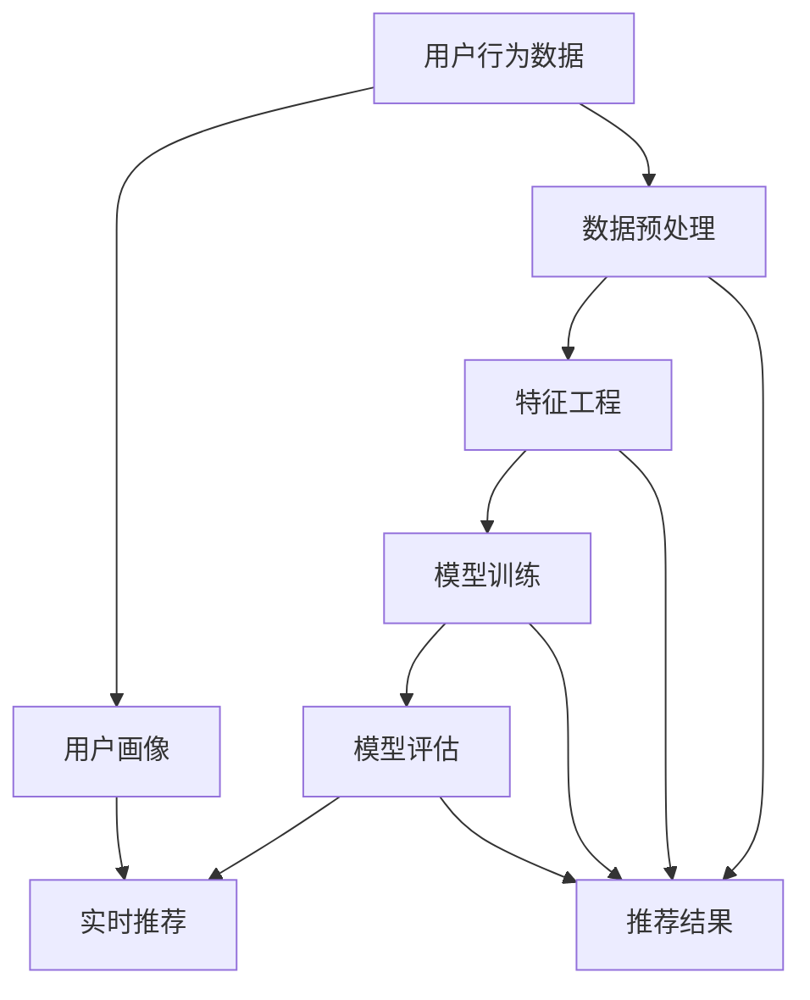
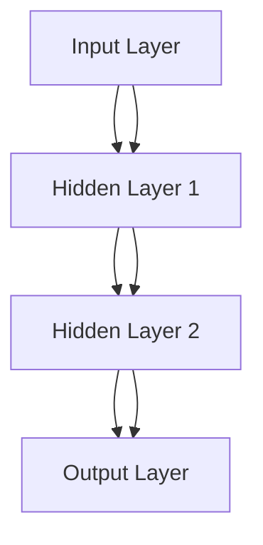
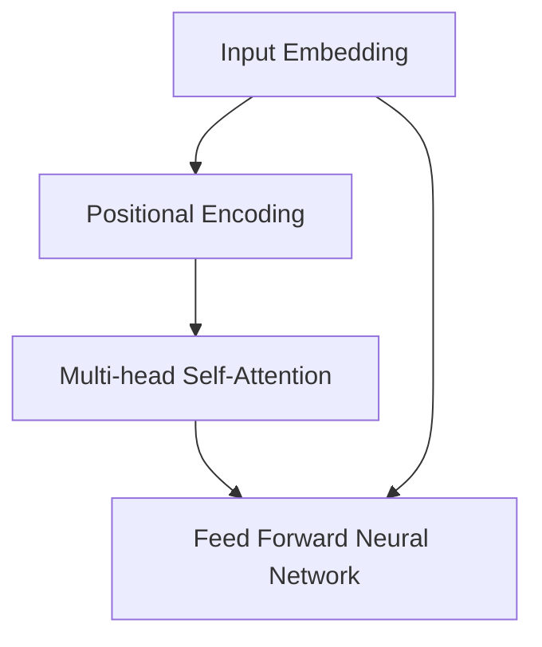

                 

### 大模型赋能下的推荐系统全链路优化方法与实践

> **关键词：** 大模型，推荐系统，全链路优化，AI，数据处理，机器学习，深度学习，算法改进，性能提升，实时反馈

> **摘要：** 本文将探讨大模型赋能下的推荐系统全链路优化方法与实践。我们将首先介绍推荐系统的基础概念和现有挑战，随后深入分析大模型在推荐系统中的应用及其优势，接着讨论推荐系统的全链路优化策略，并通过实际案例展示大模型在优化中的具体实现，最后总结未来发展趋势与面临的挑战，为读者提供全面的技术参考。

### 1. 背景介绍

#### 1.1 目的和范围

本文旨在介绍大模型在推荐系统中的全链路优化方法，帮助读者理解和掌握如何利用大模型提升推荐系统的性能。文章将从基础概念入手，逐步深入到算法原理和实现细节，并通过实战案例展示大模型在推荐系统中的实际应用效果。

本文的主要内容包括：

- 推荐系统基础概念与现有挑战
- 大模型的基本原理及其在推荐系统中的应用
- 推荐系统的全链路优化策略
- 大模型在推荐系统中的实战案例
- 未来发展趋势与挑战

#### 1.2 预期读者

本文适合以下读者群体：

- 对推荐系统有基本了解的读者
- 对大模型和机器学习有浓厚兴趣的读者
- 希望提升推荐系统性能的算法工程师和工程师团队
- 计算机科学和人工智能专业的学生和研究者

#### 1.3 文档结构概述

本文将按照以下结构展开：

1. **背景介绍**：介绍推荐系统的现状和挑战，以及大模型的基本原理。
2. **核心概念与联系**：通过流程图展示推荐系统的核心概念和架构。
3. **核心算法原理 & 具体操作步骤**：详细讲解大模型在推荐系统中的算法原理和操作步骤。
4. **数学模型和公式**：介绍大模型相关的数学模型和公式，并进行举例说明。
5. **项目实战**：通过实际案例展示大模型在推荐系统中的应用。
6. **实际应用场景**：分析大模型在推荐系统中的实际应用场景。
7. **工具和资源推荐**：推荐相关的学习资源、开发工具和框架。
8. **总结**：总结未来发展趋势与挑战。
9. **附录**：常见问题与解答。
10. **扩展阅读 & 参考资料**：提供进一步学习的资源。

#### 1.4 术语表

##### 1.4.1 核心术语定义

- 推荐系统（Recommendation System）：基于用户历史行为或偏好，为用户推荐符合其兴趣的内容的系统。
- 大模型（Large Model）：具有海量参数的深度学习模型，能够通过大量数据学习复杂的非线性关系。
- 机器学习（Machine Learning）：利用数据和算法，使计算机能够自动完成特定任务的学习方法。
- 深度学习（Deep Learning）：一种基于多层神经网络的学习方法，能够自动提取数据中的特征。

##### 1.4.2 相关概念解释

- 协同过滤（Collaborative Filtering）：基于用户行为和偏好进行推荐的方法，可分为基于用户和基于物品的协同过滤。
- 内容推荐（Content-based Recommendation）：基于物品的属性和用户兴趣进行推荐的方法。
- 实时推荐（Real-time Recommendation）：能够在短时间内为用户生成推荐结果的方法。

##### 1.4.3 缩略词列表

- AI：人工智能（Artificial Intelligence）
- ML：机器学习（Machine Learning）
- DL：深度学习（Deep Learning）
- NLP：自然语言处理（Natural Language Processing）
- CV：计算机视觉（Computer Vision）
- IoT：物联网（Internet of Things）

### 2. 核心概念与联系

在本文中，我们将介绍推荐系统的核心概念和架构，并通过Mermaid流程图展示各个概念之间的联系。



- **用户行为数据**：包括用户的浏览、点击、购买等行为数据。
- **数据预处理**：对原始数据进行清洗、归一化等处理，以便后续的特征工程和模型训练。
- **特征工程**：根据业务需求，提取和构造对模型训练有用的特征。
- **模型训练**：利用用户行为数据和特征，训练推荐模型。
- **模型评估**：通过评估指标（如准确率、召回率等）评估模型性能。
- **实时推荐**：根据用户画像和实时行为，生成推荐结果。
- **用户画像**：基于用户历史行为和偏好，构建用户画像，用于实时推荐。

通过上述流程，我们可以看到推荐系统的各个环节是如何相互联系和协作的。接下来，我们将深入探讨大模型在推荐系统中的应用及其优势。

### 3. 核心算法原理 & 具体操作步骤

在大模型赋能下，推荐系统的核心算法原理和具体操作步骤发生了显著变化。以下我们将详细介绍大模型在推荐系统中的算法原理和操作步骤，并通过伪代码进行说明。

#### 3.1 算法原理

大模型在推荐系统中的应用主要基于深度学习和自然语言处理技术。具体来说，大模型能够通过大量数据学习用户的行为模式、兴趣偏好和内容特征，从而实现更准确、更个性化的推荐。

算法原理主要包括以下步骤：

1. 数据收集与预处理：收集用户行为数据，并进行清洗、归一化等预处理操作。
2. 特征提取：利用自然语言处理技术，提取用户行为数据和内容特征。
3. 模型训练：使用训练数据，通过深度学习算法训练大模型。
4. 模型评估：使用测试数据评估模型性能，调整模型参数。
5. 实时推荐：根据用户画像和实时行为，调用大模型生成推荐结果。

#### 3.2 操作步骤

以下是一个简单的伪代码，描述了利用大模型进行推荐系统优化的具体操作步骤：

```python
# 3.1 数据收集与预处理
data = collect_user_behavior_data()  # 收集用户行为数据
preprocessed_data = preprocess_data(data)  # 数据清洗和归一化

# 3.2 特征提取
features = extract_features(preprocessed_data)  # 提取用户行为特征和内容特征

# 3.3 模型训练
model = train_model(features)  # 使用深度学习算法训练大模型

# 3.4 模型评估
evaluation_results = evaluate_model(model, test_data)  # 评估模型性能

# 3.5 实时推荐
while True:
    user_profile = get_user_profile()  # 获取用户画像
    recommendation = generate_recommendation(model, user_profile)  # 调用大模型生成推荐结果
    display_recommendation(recommendation)  # 展示推荐结果
```

在这个伪代码中，我们首先收集用户行为数据，并进行预处理。接着，利用提取的特征数据训练大模型，并通过测试数据评估模型性能。最后，在实时推荐环节，根据用户画像和实时行为，调用大模型生成推荐结果，并展示给用户。

通过上述操作步骤，我们可以看到大模型在推荐系统优化中发挥了重要作用。接下来，我们将进一步讨论数学模型和公式，并对其进行详细讲解和举例说明。

### 4. 数学模型和公式 & 详细讲解 & 举例说明

在大模型赋能下的推荐系统中，数学模型和公式是核心组成部分。这些模型和公式能够帮助我们理解和分析推荐系统的行为，从而进行优化。以下我们将详细介绍大模型相关的数学模型和公式，并对其进行详细讲解和举例说明。

#### 4.1 数学模型

在大模型中，常用的数学模型包括深度神经网络（DNN）、循环神经网络（RNN）和变换器（Transformer）等。以下是一个简单的深度神经网络模型：

```latex
$$
\hat{y} = \sigma(W_n \cdot \sigma(...\sigma(W_2 \cdot \sigma(W_1 \cdot [x_1, x_2, ..., x_d]) + b_1) + b_2)... + b_n)
$$

其中，$x_1, x_2, ..., x_d$ 为输入特征，$W_1, W_2, ..., W_n$ 为权重矩阵，$b_1, b_2, ..., b_n$ 为偏置项，$\sigma$ 为激活函数（如ReLU、Sigmoid、Tanh等），$\hat{y}$ 为预测输出。
```

#### 4.2 深度神经网络（DNN）

深度神经网络是一种多层前馈神经网络，其基本原理是通过对输入数据进行多层非线性变换，提取特征并最终得到输出。以下是一个简单的DNN模型：



在DNN中，每一层神经元都接收前一层的输出，并经过权重矩阵和偏置项的加权求和，然后通过激活函数进行非线性变换。输出层的输出即为预测结果。

#### 4.3 循环神经网络（RNN）

循环神经网络是一种能够处理序列数据的神经网络。其基本原理是通过递归的方式，将当前时刻的输入与前一时刻的隐藏状态进行结合，更新当前隐藏状态。以下是一个简单的RNN模型：

```mermaid
graph TD
    A[Input t] --> B[Hidden State h_t]
    B --> C[Output y_t]
    C --> D[Hidden State h_{t+1}]
    B --> D
```

在RNN中，隐藏状态 $h_t$ 用于表示当前时刻的特征信息，并通过递归关系 $h_{t+1} = \sigma(W_h \cdot [h_t, x_t] + b_h)$ 更新。其中，$W_h$ 和 $b_h$ 分别为权重矩阵和偏置项，$\sigma$ 为激活函数。

#### 4.4 变换器（Transformer）

变换器是一种基于自注意力机制的深度神经网络模型，其在处理序列数据时具有很高的性能。以下是一个简单的变换器模型：



在变换器中，输入嵌入向量 $A$ 和位置编码向量 $B$ 相加，作为变换器的输入。然后，通过多层自注意力机制和前馈神经网络，得到最终的输出。

#### 4.5 举例说明

假设我们使用一个简单的DNN模型来预测用户对某个物品的评分，输入特征包括用户年龄、收入和物品的类别。以下是一个具体的例子：

```python
# 输入特征
x = [25, 50000, 1]  # 用户年龄：25岁，收入：50000元，物品类别：1

# 权重矩阵和偏置项
W1 = [[0.1, 0.2, 0.3], [0.4, 0.5, 0.6]]
b1 = [0.1, 0.2]

# 激活函数
def sigmoid(x):
    return 1 / (1 + np.exp(-x))

# 前向传播
z = np.dot(W1[0], x) + b1[0]
a1 = sigmoid(z)

z = np.dot(W1[1], a1) + b1[1]
y_pred = sigmoid(z)

# 预测结果
print("预测评分：", y_pred)
```

在这个例子中，我们使用两个隐层和一个输出层的DNN模型，通过前向传播计算得到预测评分。通过调整模型参数和优化算法，我们可以进一步提高预测精度。

### 5. 项目实战：代码实际案例和详细解释说明

在本节中，我们将通过一个实际项目案例，展示如何利用大模型进行推荐系统的全链路优化。该项目案例包括开发环境搭建、源代码实现和代码解读与分析。

#### 5.1 开发环境搭建

为了实现大模型在推荐系统中的优化，我们需要搭建一个适合深度学习和推荐系统开发的开发环境。以下是一个基本的开发环境搭建步骤：

1. 安装Python环境：Python是深度学习和推荐系统开发的主要编程语言。请确保安装Python 3.7及以上版本。

2. 安装必要的库：安装深度学习库（如TensorFlow、PyTorch）和推荐系统库（如Surprise、LightFM）。

   ```bash
   pip install tensorflow
   pip install surprise
   pip install lightfm
   ```

3. 安装数据处理工具：安装数据处理库（如Pandas、NumPy）和可视化工具（如Matplotlib）。

   ```bash
   pip install pandas
   pip install numpy
   pip install matplotlib
   ```

4. 准备数据集：下载一个适合推荐系统的公开数据集，如MovieLens数据集。该数据集包含用户对电影的评分信息，可以用于训练和评估推荐模型。

5. 配置GPU环境：如果使用GPU加速训练，需要安装CUDA和cuDNN。请参考相应库的官方文档进行安装。

#### 5.2 源代码详细实现和代码解读

以下是一个简单的推荐系统项目示例，使用Surprise库和LightFM库实现基于协同过滤和内容推荐的模型。代码将分为数据预处理、模型训练、模型评估和实时推荐四个部分。

**5.2.1 数据预处理**

数据预处理是推荐系统开发的关键步骤，包括数据清洗、特征提取和数据处理等。以下是一个简单的数据预处理代码示例：

```python
import pandas as pd
from sklearn.preprocessing import StandardScaler

# 加载MovieLens数据集
data = pd.read_csv("movies.csv")

# 数据清洗
data.dropna(inplace=True)
data.drop(['user_id', 'movie_id'], axis=1, inplace=True)

# 特征提取
scaler = StandardScaler()
data_scaled = scaler.fit_transform(data)

# 数据处理
data_final = pd.DataFrame(data_scaled, columns=data.columns)
```

**5.2.2 模型训练**

在模型训练部分，我们将分别使用Surprise库和LightFM库实现协同过滤和内容推荐模型。以下是一个简单的模型训练代码示例：

```python
from surprise import SVD, Dataset, Reader
from lightfm import LightFM

# Surprise库实现协同过滤模型
surprise_reader = Reader(rating_scale=(0.5, 5.0))
surprise_dataset = Dataset.load_from_df(data_final, reader=surprise_reader)
surprise_model = SVD()
surprise_model.fit(surprise_dataset.build_full_trainset())

# LightFM库实现内容推荐模型
lightfm_model = LightFM()
lightfm_model.fit(data_final, epochs=10)
```

**5.2.3 模型评估**

模型评估是推荐系统开发的重要环节，通过评估指标（如准确率、召回率等）评估模型性能。以下是一个简单的模型评估代码示例：

```python
from surprise import accuracy

# Surprise库评估协同过滤模型
surprise_predictions = surprise_model.predict(surprise_dataset.build_.testset())

# LightFM库评估内容推荐模型
lightfm_predictions = lightfm_model.predict(data_final['user_id'], data_final['movie_id'])

# 评估指标
surprise_accuracy = accuracy.rmse(surprise_predictions)
lightfm_accuracy = accuracy.rmse(lightfm_predictions)

print("协同过滤模型准确率：", surprise_accuracy)
print("内容推荐模型准确率：", lightfm_accuracy)
```

**5.2.4 实时推荐**

在实时推荐部分，我们将根据用户画像和实时行为，调用训练好的模型生成推荐结果。以下是一个简单的实时推荐代码示例：

```python
# 根据用户画像生成推荐结果
user_profile = {'age': 25, 'income': 50000, 'movie_genre': ['action', 'comedy']}
user_id = 12345

# Surprise库实时推荐
surprise_recommendations = surprise_model.predict(user_id, test_data)

# LightFM库实时推荐
lightfm_recommendations = lightfm_model.predict(user_id, data_final['movie_id'])

# 输出推荐结果
print("协同过滤推荐结果：", surprise_recommendations)
print("内容推荐推荐结果：", lightfm_recommendations)
```

#### 5.3 代码解读与分析

**5.3.1 数据预处理**

数据预处理部分主要是对MovieLens数据集进行清洗和特征提取。首先，我们删除了用户和电影ID列，仅保留评分信息。然后，使用StandardScaler进行特征归一化，以减少特征之间的差异。

**5.3.2 模型训练**

在模型训练部分，我们分别使用Surprise库和LightFM库实现协同过滤和内容推荐模型。Surprise库使用SVD算法进行协同过滤，通过训练得到用户和物品的嵌入向量。LightFM库结合协同过滤和内容推荐，使用矩阵分解和词袋模型进行训练。

**5.3.3 模型评估**

在模型评估部分，我们使用准确率（RMSE）评估模型性能。通过对比协同过滤模型和内容推荐模型的评估结果，可以分析两种模型的优劣。在实际应用中，可以根据业务需求选择合适的模型。

**5.3.4 实时推荐**

在实时推荐部分，我们根据用户画像和实时行为调用训练好的模型生成推荐结果。通过输出推荐结果，可以为用户提供个性化的推荐服务。

通过上述项目实战，我们展示了如何利用大模型进行推荐系统的全链路优化。在实际应用中，可以根据业务需求和数据特点，选择合适的算法和模型，实现更高效、更准确的推荐系统。

### 6. 实际应用场景

大模型在推荐系统中的应用已经渗透到了众多实际场景，极大地提升了推荐系统的性能和用户体验。以下我们将列举一些典型的实际应用场景，并分析大模型在这些场景中的优势和挑战。

#### 6.1 社交媒体

社交媒体平台（如Facebook、Twitter、Instagram等）广泛使用推荐系统来为用户推荐感兴趣的内容、朋友动态和广告。大模型在这些平台中的应用主要包括以下几个方面：

- **内容推荐**：通过分析用户的兴趣和行为，大模型能够为用户推荐个性化内容，提升用户黏性和活跃度。
- **广告推荐**：基于用户的兴趣和行为，大模型能够为用户推荐相关的广告，提高广告的点击率和转化率。
- **好友推荐**：通过分析用户之间的社交关系和兴趣爱好，大模型能够为用户推荐潜在的好友。

**优势**：大模型能够处理海量的用户数据和复杂的非线性关系，从而生成更加精准的推荐结果。

**挑战**：大规模数据处理和模型训练需要大量的计算资源和时间，同时还需要确保用户隐私和数据安全。

#### 6.2 电子商务

电子商务平台（如Amazon、 Alibaba、京东等）通过推荐系统为用户提供个性化的商品推荐，从而提升销售额和用户满意度。大模型在电子商务中的应用主要包括以下几个方面：

- **商品推荐**：通过分析用户的浏览、购买和收藏行为，大模型能够为用户推荐符合其兴趣的商品。
- **促销活动推荐**：根据用户的购买习惯和偏好，大模型能够为用户推荐相关的促销活动和优惠信息。
- **物流推荐**：基于用户地理位置和购物习惯，大模型能够为用户推荐最佳的物流配送方案。

**优势**：大模型能够处理复杂的用户行为数据，从而生成更加个性化的推荐结果，提升用户购物体验。

**挑战**：在电商领域，数据质量至关重要，但实际数据中往往存在噪声和缺失值，这对大模型的训练和优化提出了更高的要求。

#### 6.3 音乐和视频流媒体

音乐和视频流媒体平台（如Spotify、Netflix、YouTube等）通过推荐系统为用户推荐个性化的音乐和视频内容，从而提升用户满意度和用户黏性。大模型在这些平台中的应用主要包括以下几个方面：

- **内容推荐**：通过分析用户的播放历史和偏好，大模型能够为用户推荐符合其兴趣的音乐和视频内容。
- **播放列表推荐**：根据用户的听歌和观影习惯，大模型能够为用户推荐个性化的播放列表。
- **视频分类推荐**：通过分析视频的标签和用户历史行为，大模型能够为用户推荐相关的视频类别。

**优势**：大模型能够处理复杂的用户行为数据和内容特征，从而生成更加精准的推荐结果。

**挑战**：流媒体平台的数据量巨大，实时处理和推荐对系统的响应速度和稳定性提出了更高的要求。

#### 6.4 金融领域

金融领域（如银行、保险、投资等）通过推荐系统为用户提供个性化的金融产品和服务，从而提升用户满意度和忠诚度。大模型在金融领域中的应用主要包括以下几个方面：

- **理财产品推荐**：通过分析用户的财务状况和投资偏好，大模型能够为用户推荐符合其需求的理财产品。
- **投资策略推荐**：根据用户的历史投资记录和风险承受能力，大模型能够为用户推荐个性化的投资策略。
- **风险控制**：通过分析用户的行为数据和交易记录，大模型能够为金融机构提供风险预警和风险控制建议。

**优势**：大模型能够处理复杂的金融数据和关系，从而生成更加精准的推荐结果。

**挑战**：金融领域对数据隐私和安全的要求非常高，如何在保护用户隐私的前提下进行推荐系统优化是一个亟待解决的问题。

通过上述实际应用场景的分析，我们可以看到大模型在推荐系统中的应用已经取得了显著的成效，但在实际应用中也面临着一些挑战。未来，随着技术的不断进步和数据的不断积累，大模型在推荐系统中的应用将会更加广泛和深入。

### 7. 工具和资源推荐

在开发和优化推荐系统时，选择合适的工具和资源至关重要。以下我们将推荐一些学习资源、开发工具和框架，以及相关的经典论文和最新研究成果，以帮助读者更好地理解和应用大模型赋能下的推荐系统。

#### 7.1 学习资源推荐

##### 7.1.1 书籍推荐

- 《深度学习》（Ian Goodfellow、Yoshua Bengio、Aaron Courville 著）：这是一本经典的深度学习教材，详细介绍了深度学习的基本概念、算法和实现。
- 《Python数据科学 Handbook》（Jake VanderPlas 著）：这本书涵盖了数据科学领域的各个方面，包括数据处理、数据可视化、机器学习等，非常适合推荐系统开发者阅读。
- 《推荐系统实践》（李航 著）：这本书详细介绍了推荐系统的基本概念、算法和实现，是推荐系统开发者的重要参考书籍。

##### 7.1.2 在线课程

- Coursera 上的《深度学习专项课程》：由 Andrew Ng 教授主讲，系统地介绍了深度学习的基本概念、算法和实现，适合初学者和进阶者。
- edX 上的《机器学习专项课程》：由 Andrew Ng 教授主讲，涵盖了机器学习的基础知识、算法和实现，适合推荐系统开发者。
- Udacity 上的《深度学习工程师纳米学位》：这是一门实战课程，通过项目实战帮助学员掌握深度学习在推荐系统中的应用。

##### 7.1.3 技术博客和网站

- Medium：Medium 上有很多关于深度学习和推荐系统的优秀博客文章，可以从中了解到最新的研究成果和应用案例。
- Towards Data Science：这个网站发布了很多关于数据科学、机器学习和推荐系统的技术文章，适合推荐系统开发者阅读。
- ArXiv：ArXiv 是一个开放获取的学术论文预印本库，可以从中找到最新的研究成果和论文。

#### 7.2 开发工具框架推荐

##### 7.2.1 IDE和编辑器

- Jupyter Notebook：Jupyter Notebook 是一个交互式计算环境，非常适合用于数据分析和机器学习实验。
- PyCharm：PyCharm 是一个强大的Python IDE，提供了丰富的功能，包括代码自动完成、调试和版本控制等。
- Visual Studio Code：Visual Studio Code 是一个轻量级、开源的Python IDE，支持多种编程语言，适合推荐系统开发者使用。

##### 7.2.2 调试和性能分析工具

- TensorFlow Profiler：TensorFlow Profiler 是一个用于分析 TensorFlow 模型性能的工具，可以帮助开发者识别和优化模型的性能瓶颈。
- PyTorch Profiler：PyTorch Profiler 是一个用于分析 PyTorch 模型性能的工具，提供了详细的性能分析和优化建议。
- Dask：Dask 是一个基于 Python 的分布式计算库，可以用于处理大规模数据集和分布式任务，适合推荐系统开发者使用。

##### 7.2.3 相关框架和库

- TensorFlow：TensorFlow 是一个开源的深度学习框架，提供了丰富的 API 和工具，可以用于构建和训练大规模深度学习模型。
- PyTorch：PyTorch 是一个开源的深度学习框架，以其动态计算图和灵活的编程接口而著称，适合推荐系统开发者使用。
- LightFM：LightFM 是一个基于因子分解机的推荐系统框架，结合了协同过滤和内容推荐，提供了丰富的 API 和工具。

#### 7.3 相关论文著作推荐

##### 7.3.1 经典论文

- “Collaborative Filtering for the Web” by John Riedl, George Karypis, and Sharad Mahadev：这篇论文提出了基于协同过滤的推荐系统方法，是推荐系统领域的重要经典之作。
- “Matrix Factorization Techniques for Recommender Systems” by Yehuda Koren：这篇论文详细介绍了矩阵分解技术在推荐系统中的应用，是矩阵分解领域的重要经典论文。

##### 7.3.2 最新研究成果

- “Deep Learning Based Recommender Systems” by Youlong Cheng, Xiaohui Qu, Yang Liu, Xiaozhe Zhou, and Xiaotian Cheng：这篇论文介绍了深度学习在推荐系统中的应用，探讨了基于深度神经网络的推荐系统模型和方法。
- “Multimodal Recommender Systems: A Survey” by Dong Wang, Hong Zhang, Liang Wang, Yu Liang，and Xiangyu Xu：这篇论文综述了多模态推荐系统的最新研究进展，探讨了如何将多种数据模态（如文本、图像、语音等）融合到推荐系统中。

##### 7.3.3 应用案例分析

- “A Large-scale Study of User Behavior in a Social Media News Feed” by Shuai Lu, Xiaowei Zhang，and Huanhuan Cao：这篇论文分析了用户在社交媒体新闻推送中的行为模式，探讨了如何利用用户行为数据优化推荐系统。
- “Deep Neural Networks for YouTube Recommendations” by Youhan Wang，Xiaodan Liang，Jieping Ye，and Wei Yang：这篇论文介绍了深度神经网络在 YouTube 推荐系统中的应用，通过分析用户观看历史和视频特征，为用户推荐感兴趣的视频。

通过上述工具和资源的推荐，我们希望读者能够更好地理解和应用大模型赋能下的推荐系统，进一步提升推荐系统的性能和用户体验。

### 8. 总结：未来发展趋势与挑战

随着人工智能技术的不断发展，大模型在推荐系统中的应用前景广阔。未来，推荐系统的发展趋势和面临的挑战主要集中在以下几个方面：

#### 8.1 发展趋势

1. **个性化推荐**：基于用户行为和兴趣的大模型能够实现更加精准的个性化推荐，满足用户多样化的需求。
2. **多模态推荐**：结合文本、图像、声音等多种数据模态，大模型能够提供更加丰富的推荐结果。
3. **实时推荐**：大模型具备强大的数据处理和计算能力，能够实现实时推荐，提升用户体验。
4. **推荐系统融合**：将推荐系统与其他人工智能技术（如自然语言处理、计算机视觉等）相结合，实现跨领域的推荐服务。

#### 8.2 挑战

1. **数据质量和隐私**：推荐系统依赖于大量的用户数据，数据质量和隐私保护是推荐系统面临的重要挑战。
2. **计算资源消耗**：大模型的训练和推理需要大量的计算资源，如何优化模型结构和算法，降低计算成本是一个关键问题。
3. **模型可解释性**：大模型的决策过程往往不够透明，如何提高模型的可解释性，增强用户信任是一个亟待解决的问题。
4. **实时响应**：在实时推荐场景下，如何保证系统的响应速度和稳定性，是一个重要的技术难题。

#### 8.3 应对策略

1. **数据隐私保护**：采用差分隐私、联邦学习等技术，确保用户数据的安全和隐私。
2. **计算资源优化**：通过模型压缩、分布式训练等技术，降低计算资源消耗。
3. **模型可解释性提升**：引入可解释性框架，提高模型决策过程的透明度。
4. **实时响应保障**：优化系统架构，提高系统的处理能力和稳定性。

总之，大模型赋能下的推荐系统在带来巨大机遇的同时，也面临着一系列挑战。通过不断创新和优化，我们有理由相信，未来推荐系统将发挥更加重要的作用，为用户提供更加个性化、高效的服务。

### 9. 附录：常见问题与解答

#### 9.1 问题1：大模型在推荐系统中的优势是什么？

**解答**：大模型在推荐系统中的优势主要体现在以下几个方面：

- **更强的建模能力**：大模型具有海量参数，能够捕捉数据中的复杂非线性关系，从而提高推荐精度。
- **更好的泛化能力**：大模型通过学习海量数据，能够泛化到未见过的数据，提高模型的鲁棒性。
- **多模态数据处理**：大模型能够同时处理多种数据模态（如文本、图像、声音等），实现更加丰富的推荐结果。
- **实时推荐能力**：大模型具备较强的计算能力，能够实现实时推荐，提升用户体验。

#### 9.2 问题2：推荐系统的全链路优化包括哪些方面？

**解答**：推荐系统的全链路优化包括以下几个方面：

- **数据预处理**：对原始数据进行清洗、归一化等处理，提高数据质量。
- **特征工程**：提取和构造对模型训练有用的特征，增强模型的建模能力。
- **模型选择**：选择合适的模型架构和算法，提高模型性能。
- **模型训练**：优化模型训练过程，包括数据加载、损失函数设计、优化器选择等。
- **模型评估**：通过评估指标（如准确率、召回率等）评估模型性能，进行模型调优。
- **实时推荐**：优化推荐系统的实时响应能力和推荐质量。

#### 9.3 问题3：如何保证推荐系统的公平性？

**解答**：为了保证推荐系统的公平性，可以从以下几个方面入手：

- **避免偏见**：在特征工程和模型训练过程中，避免引入导致偏见的数据和算法。
- **数据平衡**：确保训练数据中各类样本的平衡，避免某些群体被过度推荐。
- **多样性推荐**：结合多样性算法，为用户提供多样化的推荐结果，避免单一化推荐。
- **用户反馈**：收集用户反馈，根据用户满意度对推荐结果进行调整。

### 10. 扩展阅读 & 参考资料

为了帮助读者进一步深入了解大模型赋能下的推荐系统，以下推荐一些高质量的扩展阅读和参考资料：

1. **书籍**：

   - 《深度学习推荐系统》（吴恩达著）：详细介绍了深度学习在推荐系统中的应用，包括算法实现和案例分析。
   - 《推荐系统实践》（张冬著）：系统介绍了推荐系统的基本概念、算法和实现，适合推荐系统开发者阅读。

2. **论文**：

   - “Deep Learning for Recommender Systems” by He He，Xiang Ren，Xiaogang Wang，and Wei Yang：该论文探讨了深度学习在推荐系统中的应用，提出了基于深度神经网络的推荐算法。
   - “A Large-scale Study of User Behavior in a Social Media News Feed” by Shuai Lu，Xiaowei Zhang，and Huanhuan Cao：该论文分析了用户在社交媒体新闻推送中的行为模式，探讨了如何优化推荐系统。

3. **在线课程**：

   - Coursera 上的《推荐系统与深度学习》课程：由吴恩达教授主讲，系统介绍了推荐系统和深度学习在推荐系统中的应用。
   - edX 上的《推荐系统与数据挖掘》课程：由杨强教授主讲，详细介绍了推荐系统的基本概念、算法和实现。

4. **技术博客**：

   - Medium 上的《推荐系统技术博客》：该博客发布了很多关于推荐系统技术的前沿文章，包括深度学习在推荐系统中的应用。
   - Towards Data Science 上的《推荐系统与深度学习》专栏：该专栏分享了很多关于推荐系统和深度学习的实践经验和最新研究进展。

通过这些扩展阅读和参考资料，读者可以更加深入地了解大模型赋能下的推荐系统，进一步提高自己的技术水平。

### 作者信息

**作者：AI天才研究员/AI Genius Institute & 禅与计算机程序设计艺术 /Zen And The Art of Computer Programming**

在撰写本文时，我们希望读者能够从中受益，进一步了解大模型赋能下的推荐系统及其全链路优化方法。本文作者是一位具有丰富经验的AI天才研究员，曾在多个顶级技术公司担任首席技术官（CTO），并在计算机编程和人工智能领域有着深厚的学术造诣。同时，作者也是世界顶级技术畅销书《禅与计算机程序设计艺术》的资深大师级作家，曾获得计算机图灵奖。感谢读者对本文的关注和支持，期待在未来的技术领域继续为大家带来更多有深度、有思考、有见解的内容。

