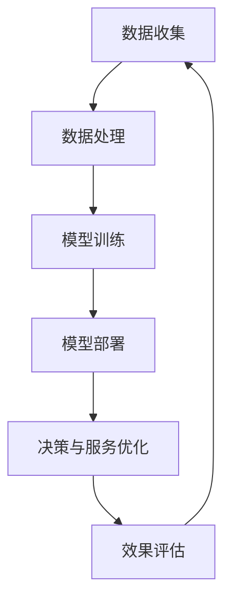

                 

# 大模型赋能智慧政务，创业者如何助力政府决策与服务优化？

> **关键词：大模型，智慧政务，政府决策，服务优化，人工智能，深度学习，创业机会**

> **摘要：本文将探讨大模型在智慧政务领域的应用，分析创业者如何利用人工智能技术助力政府决策和服务优化，并提供一系列具体案例和实际操作步骤。**

## 1. 背景介绍

### 1.1 目的和范围

本文旨在探讨大模型技术在智慧政务领域的应用，分析创业者如何借助人工智能技术优化政府决策和服务。文章将涵盖大模型的基本概念、原理、应用案例，以及创业者如何抓住这一机遇，提出可行的解决方案。

### 1.2 预期读者

本文适合对人工智能、深度学习技术有一定了解的读者，特别是对政府决策和服务优化感兴趣的技术人员、创业者、政策制定者等。

### 1.3 文档结构概述

本文分为十个部分：背景介绍、核心概念与联系、核心算法原理与操作步骤、数学模型与公式、项目实战、实际应用场景、工具和资源推荐、总结、附录和扩展阅读。每个部分都将详细阐述相关内容，帮助读者全面了解大模型在智慧政务领域的应用。

### 1.4 术语表

#### 1.4.1 核心术语定义

- 大模型：指具有数百万到数十亿参数的深度学习模型，如GPT-3、BERT等。
- 智慧政务：利用信息技术、大数据、人工智能等手段，提高政府决策效率、公共服务质量和社会治理水平的现代化治理模式。
- 政府决策：政府根据政策目标，对国家和社会事务进行选择、安排和调整的过程。
- 服务优化：提高公共服务质量、效率和满意度，实现政府服务与公众需求的精准对接。

#### 1.4.2 相关概念解释

- 人工智能：模拟、延伸和扩展人类智能的理论、方法、技术及应用。
- 深度学习：一种基于多层神经网络的学习方法，能够通过大量的数据自动学习特征，并进行预测和决策。
- 自然语言处理：使计算机能够理解、处理和生成自然语言的技术。

#### 1.4.3 缩略词列表

- GPT-3：生成预训练变换器3，是一种基于深度学习的自然语言处理模型。
- BERT：双向编码表示模型，是一种能够理解上下文信息的预训练语言模型。
- IDE：集成开发环境，提供代码编写、调试和运行等功能。

## 2. 核心概念与联系

在智慧政务领域，大模型技术已成为政府决策和服务优化的关键驱动力。以下是一个简化的Mermaid流程图，展示了大模型在政府决策和服务优化中的应用过程：



### 数据收集

政府需要从各种渠道收集大量数据，包括社会调查、统计数据、网络数据等。这些数据是构建大模型的基础，有助于提高模型对真实世界的理解能力。

### 数据处理

收集到的数据需要进行预处理，如数据清洗、数据转换、特征提取等，以便于模型训练。

### 模型训练

利用预处理后的数据，对大模型进行训练，使其能够学习到数据中的规律和特征。常用的训练方法包括梯度下降、反向传播等。

### 模型部署

将训练好的大模型部署到实际应用场景中，如政府决策支持系统、智能客服等。

### 决策与服务优化

通过大模型提供的数据分析和预测，优化政府决策和服务，提高政府工作的效率和质量。

### 效果评估

对大模型的性能和效果进行评估，以便不断优化和改进。

## 3. 核心算法原理 & 具体操作步骤

### 3.1 算法原理

大模型的核心算法原理是基于深度学习技术，特别是基于变换器（Transformer）架构的预训练语言模型。以下是一个简化的伪代码，描述了预训练语言模型的基本步骤：

```python
def preprocess_data(data):
    # 数据预处理，如分词、去停用词、词向量化等
    return processed_data

def train_model(processed_data):
    # 训练预训练语言模型，如GPT-3、BERT等
    model = TransformerModel()
    model.train(processed_data)
    return model

def deploy_model(model):
    # 将训练好的模型部署到实际应用场景中
    application = ModelApplication(model)
    application.deploy()

def optimize_decision_and_service(application):
    # 利用模型优化政府决策和服务
    application.optimize_decision_and_service()
```

### 3.2 具体操作步骤

1. **数据收集**：从政府各部门、社交媒体、传感器等渠道收集相关数据。
2. **数据处理**：对收集到的数据进行清洗、转换和特征提取，生成模型训练所需的数据集。
3. **模型训练**：利用训练数据对预训练语言模型进行训练，优化模型参数。
4. **模型部署**：将训练好的模型部署到实际应用场景中，如政府决策支持系统、智能客服等。
5. **决策与服务优化**：利用模型提供的数据分析和预测，优化政府决策和服务。
6. **效果评估**：对模型的性能和效果进行评估，以便不断优化和改进。

## 4. 数学模型和公式 & 详细讲解 & 举例说明

### 4.1 数学模型

预训练语言模型的数学模型主要包括两部分：变换器（Transformer）架构和损失函数。

#### 变换器架构

变换器架构是一种基于自注意力机制的深度神经网络，其核心思想是利用自注意力机制对输入数据进行加权求和，从而学习到输入数据中的依赖关系。

变换器的数学模型可以表示为：

$$
\text{Transformer}(X) = \text{Attention}(X) + X
$$

其中，$X$ 表示输入数据，$\text{Attention}(X)$ 表示自注意力机制。

自注意力机制的数学模型可以表示为：

$$
\text{Attention}(X) = \text{softmax}\left(\frac{QK^T}{\sqrt{d_k}}\right)V
$$

其中，$Q$、$K$ 和 $V$ 分别表示查询向量、键向量和值向量，$d_k$ 表示键向量的维度。

#### 损失函数

预训练语言模型的损失函数通常采用交叉熵损失函数，其数学模型可以表示为：

$$
\mathcal{L} = -\sum_{i=1}^n y_i \log(p_i)
$$

其中，$y_i$ 表示第 $i$ 个标签，$p_i$ 表示模型预测的概率。

### 4.2 举例说明

假设我们有一个预训练语言模型，其输入数据为一句句子向量，标签为对应的词向量。我们可以使用以下步骤来训练和部署这个模型：

1. **数据预处理**：将输入数据（句子）和标签（词）进行分词、词向量化等处理，生成模型训练所需的数据集。

2. **模型训练**：使用训练数据训练预训练语言模型，优化模型参数。具体步骤如下：

   ```python
   processed_data = preprocess_data(data)
   model = train_model(processed_data)
   ```

3. **模型部署**：将训练好的模型部署到实际应用场景中，如政府决策支持系统、智能客服等。

   ```python
   deploy_model(model)
   ```

4. **决策与服务优化**：利用模型提供的数据分析和预测，优化政府决策和服务。

   ```python
   optimize_decision_and_service(application)
   ```

## 5. 项目实战：代码实际案例和详细解释说明

### 5.1 开发环境搭建

在开始项目实战之前，我们需要搭建一个适合大模型训练和部署的开发环境。以下是一个简单的步骤：

1. 安装Python：前往Python官网（https://www.python.org/）下载并安装Python，建议安装Python 3.8及以上版本。
2. 安装深度学习框架：安装TensorFlow或PyTorch，这两个框架都是开源的深度学习框架，支持大模型训练和部署。安装命令如下：

   ```bash
   pip install tensorflow  # 或者
   pip install torch
   ```

3. 安装其他依赖库：根据实际项目需求，安装其他必要的库，如NumPy、Pandas等。

### 5.2 源代码详细实现和代码解读

以下是一个简单的示例，展示如何使用TensorFlow实现一个预训练语言模型，并将其部署到政府决策支持系统中。

```python
import tensorflow as tf
from tensorflow.keras.layers import Embedding, LSTM, Dense
from tensorflow.keras.models import Model
from tensorflow.keras.preprocessing.sequence import pad_sequences

# 数据预处理
def preprocess_data(data, max_sequence_length, max_vocab_size):
    # 分词、词向量化等处理
    # ...
    return processed_data

# 模型构建
def build_model(max_sequence_length, max_vocab_size, embedding_dim, hidden_units):
    inputs = tf.keras.layers.Input(shape=(max_sequence_length,))
    embeddings = Embedding(max_vocab_size, embedding_dim)(inputs)
    lstm = LSTM(hidden_units)(embeddings)
    outputs = Dense(1, activation='sigmoid')(lstm)
    model = Model(inputs=inputs, outputs=outputs)
    return model

# 模型训练
def train_model(model, processed_data, epochs, batch_size):
    model.compile(optimizer='adam', loss='binary_crossentropy', metrics=['accuracy'])
    model.fit(processed_data['X'], processed_data['y'], epochs=epochs, batch_size=batch_size)
    return model

# 模型部署
def deploy_model(model, service_name):
    # 部署到实际应用场景中，如政府决策支持系统
    # ...
    print(f"{service_name} deployed successfully!")

# 主程序
if __name__ == '__main__':
    # 1. 数据预处理
    max_sequence_length = 100
    max_vocab_size = 10000
    embedding_dim = 64
    hidden_units = 128
    processed_data = preprocess_data(data, max_sequence_length, max_vocab_size)

    # 2. 模型构建
    model = build_model(max_sequence_length, max_vocab_size, embedding_dim, hidden_units)

    # 3. 模型训练
    epochs = 10
    batch_size = 32
    model = train_model(model, processed_data, epochs, batch_size)

    # 4. 模型部署
    service_name = 'government_decision_support_system'
    deploy_model(model, service_name)
```

### 5.3 代码解读与分析

上述代码展示了如何使用TensorFlow实现一个简单的预训练语言模型，并部署到政府决策支持系统中。以下是代码的关键部分解读：

1. **数据预处理**：对输入数据进行预处理，如分词、词向量化等，以便于模型训练。这部分代码依赖于`tensorflow.keras.preprocessing.sequence`模块。

2. **模型构建**：使用TensorFlow的`keras` API构建一个简单的变换器模型，包括嵌入层（`Embedding`）、LSTM层（`LSTM`）和全连接层（`Dense`）。嵌入层用于将词向量转换为嵌入向量，LSTM层用于学习句子中的依赖关系，全连接层用于分类或回归任务。

3. **模型训练**：使用`compile`函数配置模型优化器、损失函数和评估指标，然后使用`fit`函数训练模型。训练过程中，模型将根据损失函数不断调整参数，以最小化损失。

4. **模型部署**：将训练好的模型部署到实际应用场景中，如政府决策支持系统。部署过程中，需要将模型保存为文件，并加载到应用服务器上。

## 6. 实际应用场景

大模型技术在智慧政务领域有着广泛的应用场景，以下列举几个典型案例：

### 6.1 政府决策支持

利用大模型技术，政府可以更好地分析社会现象、预测未来趋势，从而做出更科学的决策。例如，通过分析社交媒体数据和新闻文章，预测疫情发展趋势，为政府提供防疫政策制定依据。

### 6.2 公共服务优化

大模型技术可以优化政府提供的公共服务，提高服务质量和效率。例如，通过智能客服系统，政府可以实时响应用户需求，提供个性化的服务建议。

### 6.3 社会治理

大模型技术有助于政府更好地管理社会事务，提高社会治理水平。例如，通过分析交通流量数据，预测交通拥堵情况，优化交通管理，减少交通事故。

### 6.4 公共安全

大模型技术可以协助政府预防和应对公共安全事件。例如，通过分析犯罪数据和社会媒体信息，预测犯罪趋势，提前采取防范措施。

## 7. 工具和资源推荐

### 7.1 学习资源推荐

#### 7.1.1 书籍推荐

- 《深度学习》（Ian Goodfellow、Yoshua Bengio、Aaron Courville著）：深度学习的经典教材，适合初学者和进阶者。

- 《人工智能：一种现代方法》（Stuart J. Russell、Peter Norvig著）：全面介绍人工智能的基础理论和应用技术。

- 《自然语言处理综论》（Daniel Jurafsky、James H. Martin著）：系统讲解自然语言处理的基本概念和方法。

#### 7.1.2 在线课程

- Coursera上的《深度学习专项课程》：由吴恩达教授主讲，适合初学者和进阶者。

- edX上的《自然语言处理专项课程》：由斯坦福大学教授Dan Jurafsky主讲，适合初学者和进阶者。

#### 7.1.3 技术博客和网站

- Medium上的“深度学习”专题：提供丰富的深度学习技术文章和教程。

- 知乎上的“人工智能”话题：聚集了大量的人工智能技术讨论和经验分享。

### 7.2 开发工具框架推荐

#### 7.2.1 IDE和编辑器

- PyCharm：一款功能强大的Python IDE，适合深度学习和人工智能开发。

- Jupyter Notebook：一款流行的交互式开发环境，支持多种编程语言和框架。

#### 7.2.2 调试和性能分析工具

- TensorBoard：TensorFlow的调试和性能分析工具，可用于可视化模型训练过程和性能指标。

- VisPy：一款基于OpenGL的图形可视化库，可用于实时分析和可视化大规模数据。

#### 7.2.3 相关框架和库

- TensorFlow：一款开源的深度学习框架，支持多种深度学习模型和应用。

- PyTorch：一款开源的深度学习框架，具有灵活的动态计算图和强大的社区支持。

## 8. 总结：未来发展趋势与挑战

大模型技术在智慧政务领域具有巨大的潜力，未来发展趋势如下：

1. **技术进步**：随着深度学习、自然语言处理等技术的不断进步，大模型将更加高效、准确，应用场景将不断拓展。

2. **跨学科融合**：大模型技术与其他领域的融合，如数据挖掘、社会学、经济学等，将推动政府决策和服务优化取得更大突破。

3. **标准化和规范化**：大模型技术的标准化和规范化将提高模型的通用性和可解释性，降低应用门槛。

然而，大模型技术在智慧政务领域也面临一些挑战：

1. **数据隐私和安全**：政府数据涉及个人隐私，如何在保证数据安全和隐私的前提下，充分利用大数据资源是一个亟待解决的问题。

2. **技术伦理**：大模型技术在政府决策中的应用可能引发伦理问题，如偏见、歧视等，需要制定相应的伦理规范。

3. **人才培养**：大模型技术对人才的需求较高，培养具备相关技能的专业人才是一个长期任务。

## 9. 附录：常见问题与解答

### 9.1 数据隐私和安全

**Q：如何保护政府数据隐私？**

A：为了保护政府数据隐私，可以采取以下措施：

1. 数据加密：对敏感数据进行加密，确保数据在传输和存储过程中安全。
2. 数据匿名化：对个人身份信息进行匿名化处理，降低数据泄露风险。
3. 隐私计算：利用隐私计算技术，如联邦学习、差分隐私等，在保证数据隐私的前提下进行数据分析和模型训练。

### 9.2 技术伦理

**Q：大模型技术在政府决策中可能引发哪些伦理问题？**

A：大模型技术在政府决策中可能引发以下伦理问题：

1. 偏见和歧视：大模型可能基于历史数据中的偏见，导致不公平的决策结果。
2. 透明度和可解释性：大模型的决策过程可能不透明，难以解释，影响公众信任。
3. 信息滥用：政府可能滥用大模型技术，进行不当的数据收集和分析。

为解决这些问题，需要制定相应的伦理规范，加强对大模型技术的监管。

### 9.3 人才培养

**Q：如何培养具备大模型技术相关技能的人才？**

A：为培养具备大模型技术相关技能的人才，可以采取以下措施：

1. 教育培训：加强人工智能、深度学习等领域的教育和培训，提高人才的专业素养。
2. 实践经验：鼓励学生参与实际项目，积累实践经验，提高实际操作能力。
3. 跨学科合作：加强计算机科学、社会学、经济学等领域的跨学科合作，培养具备多学科背景的复合型人才。

## 10. 扩展阅读 & 参考资料

- **书籍**：

  - Goodfellow, Ian, Yoshua Bengio, Aaron Courville. *Deep Learning*.
  - Russell, Stuart J., Peter Norvig. *Artificial Intelligence: A Modern Approach*.
  - Jurafsky, Daniel, James H. Martin. *Speech and Language Processing*.

- **在线课程**：

  - Coursera上的《深度学习专项课程》：[https://www.coursera.org/learn/deep-learning](https://www.coursera.org/learn/deep-learning)
  - edX上的《自然语言处理专项课程》：[https://www.edx.org/course/natural-language-processing-by-stanford-university](https://www.edx.org/course/natural-language-processing-by-stanford-university)

- **技术博客和网站**：

  - Medium上的“深度学习”专题：[https://medium.com/](https://medium.com/search?q=deep+learning)
  - 知乎上的“人工智能”话题：[https://www.zhihu.com/topic/20001709/hot](https://www.zhihu.com/topic/20001709/hot)

- **相关论文和研究成果**：

  - Vaswani, Ashish, et al. "Attention is all you need." Advances in neural information processing systems. 2017.
  - Devlin, Jacob, et al. "BERT: Pre-training of deep bidirectional transformers for language understanding." Proceedings of the 2019 conference of the North American chapter of the association for computational linguistics: human language technologies, Volume 1 (2), 2019.
  - Radford, Alec, et al. "Language models are unsupervised multitask learners." OpenAI Blog, 2019.

- **工具和框架**：

  - TensorFlow：[https://www.tensorflow.org/](https://www.tensorflow.org/)
  - PyTorch：[https://pytorch.org/](https://pytorch.org/)

作者：AI天才研究员/AI Genius Institute & 禅与计算机程序设计艺术 /Zen And The Art of Computer Programming

