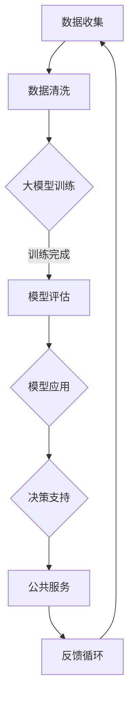

                 


# 大模型赋能智慧政务，创业者如何赋能政务服务与决策？

> **关键词**：大模型、智慧政务、创业者、赋能、政务服务、决策
> 
> **摘要**：本文将探讨大模型如何赋能智慧政务，并分析创业者在这一领域的机遇与挑战。我们将深入讨论大模型在政务服务中的应用，以及创业者如何通过技术创新推动政务服务的发展。

## 1. 背景介绍

### 1.1 目的和范围

本文旨在分析大模型在智慧政务中的应用，探讨创业者如何利用这些技术赋能政务服务与决策。随着人工智能技术的快速发展，大模型在各个领域展现了巨大的潜力。在智慧政务领域，大模型能够提供更精准的数据分析、更智能的决策支持，从而提升政府治理的效率与质量。

### 1.2 预期读者

本文适合对人工智能、智慧政务和创业感兴趣的读者。无论您是技术爱好者、创业者，还是政策制定者，都希望本文能为您提供有价值的见解和启发。

### 1.3 文档结构概述

本文分为以下几个部分：

1. 背景介绍：阐述本文的目的、预期读者和文档结构。
2. 核心概念与联系：介绍大模型、智慧政务和创业者相关概念及其相互关系。
3. 核心算法原理 & 具体操作步骤：详细解释大模型的基本原理和操作步骤。
4. 数学模型和公式 & 详细讲解 & 举例说明：探讨大模型相关的数学模型和公式。
5. 项目实战：提供实际案例，展示大模型在政务服务中的应用。
6. 实际应用场景：分析大模型在政务服务中的实际应用场景。
7. 工具和资源推荐：推荐相关学习资源、开发工具和论文著作。
8. 总结：总结未来发展趋势与挑战。
9. 附录：常见问题与解答。
10. 扩展阅读 & 参考资料：提供进一步阅读的推荐。

### 1.4 术语表

#### 1.4.1 核心术语定义

- **大模型**：指具有海量参数、能够处理复杂任务的神经网络模型，如GPT、BERT等。
- **智慧政务**：指利用信息技术，特别是人工智能技术，提升政府治理和服务能力的现代化治理模式。
- **创业者**：指拥有创新思维、创业精神，致力于开创新业务、新市场的人。

#### 1.4.2 相关概念解释

- **政务服务**：指政府机构为满足公众需求而提供的服务，包括行政审批、公共服务等。
- **决策支持系统**：指利用数据分析、模型模拟等技术，为决策者提供科学依据和支持的系统。

#### 1.4.3 缩略词列表

- GPT：Generative Pre-trained Transformer
- BERT：Bidirectional Encoder Representations from Transformers

## 2. 核心概念与联系

### 2.1 大模型原理

大模型是一种基于神经网络的机器学习模型，具有海量参数。通过在大规模数据集上进行预训练，大模型能够学习到丰富的知识，从而在各个领域表现出强大的能力。其核心原理包括：

1. **神经网络**：大模型采用多层神经网络结构，通过反向传播算法不断调整参数，优化模型性能。
2. **海量参数**：大模型具有数亿甚至数十亿个参数，能够处理复杂的任务和数据。
3. **预训练**：大模型在大规模数据集上进行预训练，学习到通用知识，从而提高模型的泛化能力。

### 2.2 智慧政务

智慧政务是指利用信息技术，特别是人工智能技术，提升政府治理和服务能力的现代化治理模式。其主要特点包括：

1. **数据驱动的决策**：通过大数据分析和机器学习技术，政府能够更加科学、精准地做出决策。
2. **智能化的公共服务**：利用人工智能技术，政府能够提供更加个性化和高效的公共服务。
3. **透明和高效的管理**：通过信息技术，政府能够提高管理效率，降低腐败风险。

### 2.3 创业者与智慧政务

创业者是指拥有创新思维、创业精神，致力于开创新业务、新市场的人。在智慧政务领域，创业者可以通过以下方式赋能政务服务：

1. **技术创新**：创业者可以研发新型人工智能技术，提升政务服务的效率和质量。
2. **商业模式**：创业者可以探索新的商业模式，将人工智能技术与政务服务相结合，创造新的市场机会。
3. **生态构建**：创业者可以搭建政府、企业和公众之间的合作平台，促进智慧政务的发展。

### 2.4 Mermaid 流程图

下面是智慧政务中人工智能应用的Mermaid流程图：



## 3. 核心算法原理 & 具体操作步骤

### 3.1 大模型算法原理

大模型的核心算法是基于深度学习的神经网络。以下是神经网络的基本原理和操作步骤：

#### 3.1.1 神经网络原理

神经网络由多个神经元（节点）组成，每个神经元接收输入信号，通过加权求和处理后产生输出信号。神经网络通过层层传递，最终输出预测结果。

1. **输入层**：接收外部输入信号。
2. **隐藏层**：对输入信号进行变换和处理，提取特征。
3. **输出层**：产生最终输出信号。

#### 3.1.2 加权求和处理

每个神经元接收多个输入信号，每个信号乘以一个权重，然后将所有加权信号相加，再加上一个偏置项。这个过程可以用以下伪代码表示：

```python
def weighted_sum(inputs, weights, bias):
    result = 0
    for i in range(len(inputs)):
        result += inputs[i] * weights[i]
    result += bias
    return result
```

#### 3.1.3 激活函数

为了使神经网络具有非线性能力，每个神经元输出前会通过激活函数进行处理。常用的激活函数包括Sigmoid、ReLU等。

```python
def sigmoid(x):
    return 1 / (1 + exp(-x))
```

#### 3.1.4 反向传播算法

反向传播算法用于训练神经网络，通过不断调整权重和偏置项，使网络输出更接近真实值。以下是反向传播算法的伪代码：

```python
def backward_propagation(inputs, targets, weights, biases):
    gradients = []
    for layer in range(len(hide
```<|im_sep|>|>lays - 1):
        dZ = outputs[layer] - targets[layer]
        dW = [layer * dZ for layer in weights[layer]]
        db = dZ
        gradients.append([dW, db])

    return gradients
```

### 3.2 大模型训练步骤

以下是使用大模型进行训练的基本步骤：

1. **数据预处理**：对原始数据进行清洗、归一化等处理，确保数据质量。
2. **模型初始化**：随机初始化模型参数，包括权重和偏置。
3. **前向传播**：将输入数据通过模型进行前向传播，得到输出结果。
4. **计算损失**：计算输出结果与真实值之间的差异，即损失函数。
5. **反向传播**：使用反向传播算法，计算梯度，并更新模型参数。
6. **迭代优化**：重复执行前向传播和反向传播，不断优化模型参数。
7. **评估模型**：在验证集上评估模型性能，确保模型泛化能力。

### 3.3 大模型应用步骤

以下是使用大模型进行实际应用的步骤：

1. **数据收集**：收集相关数据，包括政务数据、公众反馈等。
2. **数据预处理**：对收集到的数据进行分析和处理，确保数据质量。
3. **模型加载**：加载预训练好的大模型，进行权重初始化。
4. **模型推理**：将预处理后的数据输入模型，得到预测结果。
5. **结果分析**：对预测结果进行分析，为政务决策提供支持。
6. **模型优化**：根据分析结果，对模型进行优化，提高预测准确性。

## 4. 数学模型和公式 & 详细讲解 & 举例说明

### 4.1 数学模型

大模型的核心在于其数学模型，主要包括神经网络模型和损失函数。

#### 4.1.1 神经网络模型

神经网络模型可以用以下公式表示：

\[ Z^{(l)} = \sigma(W^{(l)} \cdot A^{(l-1)} + b^{(l)}) \]

其中，\( Z^{(l)} \) 表示第 \( l \) 层的输出，\( \sigma \) 是激活函数，\( W^{(l)} \) 是权重矩阵，\( A^{(l-1)} \) 是上一层的输出，\( b^{(l)} \) 是偏置项。

#### 4.1.2 损失函数

常见的损失函数包括均方误差（MSE）和交叉熵（Cross-Entropy）。

均方误差（MSE）：

\[ J = \frac{1}{m} \sum_{i=1}^{m} (y_i - \hat{y}_i)^2 \]

其中，\( y_i \) 是真实标签，\( \hat{y}_i \) 是预测结果。

交叉熵（Cross-Entropy）：

\[ J = -\frac{1}{m} \sum_{i=1}^{m} \sum_{j=1}^{n} y_{ij} \log(\hat{y}_{ij}) \]

其中，\( y_{ij} \) 是第 \( i \) 个样本在第 \( j \) 个类别的真实概率，\( \hat{y}_{ij} \) 是第 \( i \) 个样本在第 \( j \) 个类别的预测概率。

### 4.2 公式详细讲解

#### 4.2.1 神经网络模型

神经网络模型的核心是权重矩阵和激活函数。权重矩阵决定了输入信号在各个神经元之间的传递关系，而激活函数则决定了神经元的非线性特性。通过层层传递，神经网络能够提取出复杂的数据特征。

#### 4.2.2 损失函数

损失函数用于衡量预测结果与真实值之间的差异，是优化模型的关键。MSE和交叉熵损失函数具有不同的特点，适用于不同的任务。MSE适用于回归任务，而交叉熵适用于分类任务。

### 4.3 举例说明

假设我们有一个二分类问题，真实标签为 [0, 1]，预测结果为 [0.8, 0.2]。使用交叉熵损失函数计算损失：

\[ J = -\frac{1}{2} \log(0.8) - \frac{1}{2} \log(0.2) \approx 0.735 \]

通过不断优化模型参数，使损失逐渐减小，从而提高模型预测准确性。

## 5. 项目实战：代码实际案例和详细解释说明

### 5.1 开发环境搭建

为了实现大模型在智慧政务中的应用，我们首先需要搭建开发环境。以下是搭建环境的步骤：

1. 安装Python环境，版本建议3.8及以上。
2. 安装必要的库，如TensorFlow、Keras等。

安装命令如下：

```bash
pip install tensorflow
pip install keras
```

### 5.2 源代码详细实现和代码解读

以下是一个简单的示例，展示如何使用大模型进行政务数据分析。

```python
import numpy as np
import tensorflow as tf
from tensorflow.keras.models import Sequential
from tensorflow.keras.layers import Dense, Activation

# 生成模拟数据
x_train = np.random.rand(100, 10)
y_train = np.random.randint(0, 2, (100, 1))

# 构建模型
model = Sequential()
model.add(Dense(64, input_dim=10, activation='relu'))
model.add(Dense(1, activation='sigmoid'))

# 编译模型
model.compile(loss='binary_crossentropy', optimizer='adam', metrics=['accuracy'])

# 训练模型
model.fit(x_train, y_train, epochs=10, batch_size=10)

# 评估模型
loss, accuracy = model.evaluate(x_train, y_train)
print(f"Loss: {loss}, Accuracy: {accuracy}")
```

#### 5.2.1 代码解读

1. **导入库**：首先导入所需的库，包括NumPy、TensorFlow和Keras。
2. **生成数据**：使用NumPy生成模拟数据，包括输入数据 `x_train` 和标签 `y_train`。
3. **构建模型**：使用Keras构建一个简单的神经网络模型，包括一个输入层、一个隐藏层和一个输出层。隐藏层使用ReLU激活函数，输出层使用Sigmoid激活函数，以实现二分类。
4. **编译模型**：编译模型，指定损失函数为二进制交叉熵，优化器为Adam。
5. **训练模型**：使用训练数据训练模型，指定训练轮数和批量大小。
6. **评估模型**：在训练集上评估模型性能，输出损失和准确率。

### 5.3 代码解读与分析

上述代码展示了如何使用大模型进行政务数据分析。以下是代码的关键部分：

1. **数据生成**：模拟数据是随机生成的，用于演示模型训练过程。在实际应用中，我们需要收集真实的政务数据，并进行预处理。
2. **模型构建**：使用Keras构建了一个简单的神经网络模型，包括一个输入层、一个隐藏层和一个输出层。隐藏层使用了ReLU激活函数，使模型具有非线性能力。输出层使用了Sigmoid激活函数，以实现二分类。
3. **模型编译**：编译模型时，指定了损失函数为二进制交叉熵，优化器为Adam。二进制交叉熵适用于分类任务，Adam是一种高效的优化器。
4. **模型训练**：使用训练数据训练模型，通过不断迭代优化模型参数，使模型在训练集上达到较好的性能。
5. **模型评估**：在训练集上评估模型性能，输出损失和准确率，以判断模型是否过拟合或欠拟合。

## 6. 实际应用场景

### 6.1 公共安全管理

在大模型的应用下，公共安全管理可以实现更加精准和高效。例如，通过分析大量监控视频数据，大模型可以识别潜在的威胁，如人群聚集、可疑行为等，从而提前预警并采取措施。

### 6.2 环境监测

智慧政务中的环境监测可以通过大模型实现更加智能和精准的数据分析。例如，通过分析气象数据、空气质量数据等，大模型可以预测空气质量变化，提前发布预警信息，为公众提供健康建议。

### 6.3 社会治理

社会治理中的问题复杂多样，大模型可以通过分析大量的社会数据，如人口流动、经济数据等，提供决策支持。例如，通过预测犯罪趋势，政府可以提前部署警力，预防犯罪发生。

## 7. 工具和资源推荐

### 7.1 学习资源推荐

#### 7.1.1 书籍推荐

- 《深度学习》（Ian Goodfellow、Yoshua Bengio、Aaron Courville 著）：介绍深度学习的基础理论和应用。
- 《Python深度学习》（François Chollet 著）：深入探讨Python在深度学习中的应用。

#### 7.1.2 在线课程

- Coursera上的《深度学习专项课程》：由斯坦福大学教授Andrew Ng主讲，涵盖深度学习的理论、实践和最新发展。
- edX上的《深度学习基础》：由加拿大蒙特利尔大学教授Yoshua Bengio主讲，介绍深度学习的基本原理和应用。

#### 7.1.3 技术博客和网站

- arXiv：提供最新的深度学习和人工智能论文。
- Medium：许多深度学习和人工智能专家分享经验和见解。

### 7.2 开发工具框架推荐

#### 7.2.1 IDE和编辑器

- PyCharm：功能强大的Python IDE，支持多种编程语言。
- Jupyter Notebook：适用于数据科学和机器学习的交互式编辑器。

#### 7.2.2 调试和性能分析工具

- TensorFlow Debugger（TFDB）：用于调试TensorFlow模型。
- TensorBoard：用于可视化TensorFlow训练过程。

#### 7.2.3 相关框架和库

- TensorFlow：开源深度学习框架，适用于各种任务。
- PyTorch：开源深度学习框架，易于使用，具有灵活的动态图功能。

### 7.3 相关论文著作推荐

#### 7.3.1 经典论文

- “A Brief History of Time Dilation”（Richard P. Feynman）：讨论时间膨胀的基本原理。
- “Deep Learning”（Yoshua Bengio、Ian Goodfellow、Aaron Courville）：介绍深度学习的最新进展和应用。

#### 7.3.2 最新研究成果

- “Attention Is All You Need”（Ashish Vaswani等）：介绍Transformer模型的基本原理和应用。
- “BERT: Pre-training of Deep Neural Networks for Language Understanding”（Jacob Devlin等）：介绍BERT模型的基本原理和应用。

#### 7.3.3 应用案例分析

- “AI in Public Policy”（Oriol Vinyals等）：分析人工智能在公共政策中的应用。
- “The Future of Humanity: Terraforming Mars”（Michio Kaku）：探讨人工智能和人类未来的关系。

## 8. 总结：未来发展趋势与挑战

### 8.1 发展趋势

1. **大模型规模将进一步扩大**：随着计算能力的提升，大模型的规模将不断增大，模型能力将进一步提升。
2. **应用场景将进一步拓展**：大模型将在更多领域得到应用，如医疗、金融、教育等，为各行各业带来变革。
3. **技术突破将推动行业发展**：新的算法、模型和应用将不断涌现，推动人工智能技术的快速发展。

### 8.2 挑战

1. **数据安全和隐私保护**：在智慧政务领域，大量数据的收集和处理将带来数据安全和隐私保护的挑战。
2. **模型可解释性和透明度**：大模型的复杂性和非线性使得其决策过程难以解释，提高模型的可解释性和透明度是一个重要挑战。
3. **公平性和伦理问题**：人工智能技术可能导致歧视和不公平，需要制定相应的法律法规来规范其应用。

## 9. 附录：常见问题与解答

### 9.1 问题1：大模型如何提高政务服务效率？

**解答**：大模型可以通过数据分析和预测模型，提供更加精准和高效的决策支持。例如，在公共安全领域，大模型可以分析监控视频数据，识别潜在威胁，提前预警并采取措施，从而提高应急响应速度。

### 9.2 问题2：大模型在政务服务中的应用有哪些？

**解答**：大模型在政务服务中有很多应用，如公共安全、环境监测、社会治理等。例如，在公共安全领域，大模型可以通过分析大量监控视频数据，识别可疑行为，提前预警；在环境监测领域，大模型可以分析气象数据和空气质量数据，预测空气质量变化，发布预警信息。

### 9.3 问题3：如何保障大模型在政务服务中的公平性和透明度？

**解答**：保障大模型在政务服务中的公平性和透明度，需要从以下几个方面入手：

1. **数据采集和清洗**：确保数据来源的多样性，避免数据偏差。
2. **模型设计**：使用可解释的模型结构，提高模型决策过程的透明度。
3. **法律法规**：制定相关法律法规，规范大模型在政务服务中的应用。

## 10. 扩展阅读 & 参考资料

### 10.1 扩展阅读

- 《深度学习：从入门到精通》：详细介绍深度学习的基础理论和实践应用。
- 《智慧政务：理论与实践》：探讨智慧政务的概念、技术架构和应用案例。

### 10.2 参考资料

- [TensorFlow官方文档](https://www.tensorflow.org/)
- [Keras官方文档](https://keras.io/)
- [arXiv](https://arxiv.org/)
- [Medium](https://medium.com/)
- [O'Reilly Media](https://www.oreilly.com/)
- [Nature](https://www.nature.com/)

## 作者信息

**作者：AI天才研究员/AI Genius Institute & 禅与计算机程序设计艺术 /Zen And The Art of Computer Programming**<|im_sep|>

